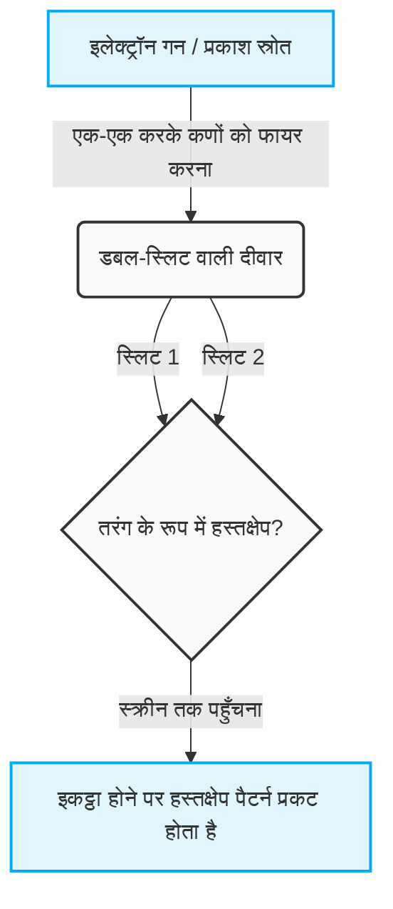
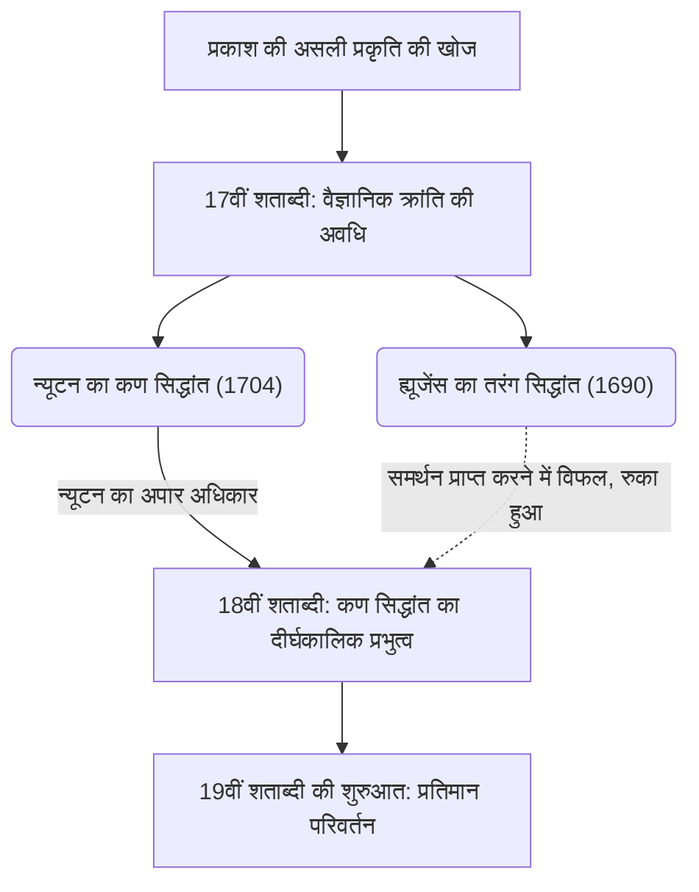
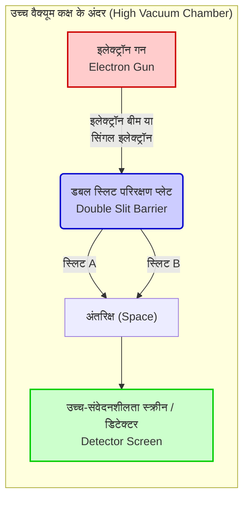

## 1. 【परिचय】डबल-स्लिट प्रयोग क्या है?

हम जिस दुनिया में रहते हैं, वह कुछ निश्चित नियमों द्वारा शासित प्रतीत होती है। ऊपर फेंकी गई गेंद एक परवलयाकार पथ का अनुसरण करते हुए नीचे गिरती है, और यदि आप पानी की सतह पर पत्थर फेंकते हैं, तो लहरें फैलने लगती हैं। ये "मैक्रो दुनिया" के सामान्य नियम हैं जिनका वर्णन न्यूटोनियन यांत्रिकी सहित शास्त्रीय भौतिकी करती है, और वे हमारे अंतर्ज्ञान के साथ पूरी तरह मेल खाते हैं। हालाँकि, जैसे ही हम पदार्थ का निर्माण करने वाली सबसे छोटी इकाइयों, जैसे कि परमाणु, इलेक्ट्रॉन, या प्रकाश के कणों (फोटॉन) से बनी "माइक्रो दुनिया" में कदम रखते हैं, यह सामान्य ज्ञान ढहने लगता है। यह एक ऐसा क्षेत्र है जहाँ हमारी रोजमर्रा की समझ और अंतर्ज्ञान बिल्कुल काम नहीं करते, और यहाँ अत्यंत विचित्र और रहस्यमयी नियम राज करते हैं।

माइक्रो दुनिया की इस असामान्यता को सबसे सरल और चौंकाने वाले रूप में हमारे सामने पेश करने वाला "डबल-स्लिट प्रयोग (Double-slit experiment)" है। 20वीं सदी के महान प्रतिभाशाली भौतिक विज्ञानी रिचर्ड फेनमैन ने इस प्रयोग के बारे में कहा था कि "यह क्वांटम यांत्रिकी का एकमात्र रहस्य है," और इसके अलावा उन्होंने टिप्पणी की कि "क्वांटम यांत्रिकी के सभी रहस्य इसी प्रयोग में समाहित हैं।" साथ ही, कई प्रसिद्ध भौतिक विज्ञानी इस प्रयोग को "भौतिकी के इतिहास का सबसे सुंदर प्रयोग" कहने से नहीं थकते। तो फिर, केवल दो छिद्रों (स्लिट्स) वाले बोर्ड का एक अत्यंत सरल प्रयोग इतना विशेष क्यों माना जाता है, और यह लगातार वैज्ञानिकों को क्यों आकर्षित करता है?

### अंतर्ज्ञान के विपरीत मैक्रो और माइक्रो दुनिया

सबसे पहले, आइए मैक्रो दुनिया में होने वाली एक घटना की कल्पना करें जहाँ हमारा अंतर्ज्ञान सटीक रूप से काम करता है।
उदाहरण के लिए, मान लीजिए कि एक मशीन है जो लगातार दीवार की ओर पेंट से रंगी हुई छोटी गेंदें (या मशीन गन की गोलियां) दागती है। इसके सामने एक लोहे की प्लेट रखी गई है जिसमें दो लंबी और पतली स्लिट्स (दरारें) अगल-बगल बनी हुई हैं। जब आप गेंदों को बेतरतीब ढंग से दागते हैं, तो केवल वे गेंदें जो किसी एक स्लिट से होकर गुजरती हैं, पीछे की दीवार से टकराती हैं और इंक का निशान छोड़ती हैं। इसके परिणामस्वरूप, दीवार पर सामने वाली दो स्लिट्स के आकार के समान "दो खड़ी रेखाओं" का निशान उभरना चाहिए। यह गेंदों का एक निश्चित प्रक्षेपवक्र वाले "कणों" के रूप में व्यवहार है, जो एक स्वाभाविक परिणाम है और कोई भी सहज रूप से इसकी भविष्यवाणी कर सकता है।

अब, आइए "तरंग" के मामले पर विचार करें। एक पानी के टैंक के बीच में दो स्लिट्स वाला एक विभाजन रखें और एक तरफ से लहरें उत्पन्न करें। जब लहरें इन दो स्लिट्स तक पहुँचती हैं तो वे उनमें से होकर गुजरती हैं, और प्रत्येक स्लिट एक नए तरंग स्रोत के रूप में कार्य करते हुए, दो अर्ध-गोलाकार लहरों के रूप में आगे फैलती हैं। और जब ये दो लहरें आपस में टकराती हैं, तो "हस्तक्षेप (interference)" नामक घटना घटित होती है। जहाँ लहरों के शिखर एक-दूसरे से मिलते हैं, वहाँ लहरें और ऊँची हो जाती हैं, और जहाँ एक शिखर दूसरे की गर्त से मिलता है, वे एक-दूसरे को रद्द करके सपाट हो जाती हैं। परिणामस्वरूप, पीछे की दीवार (या किनारे) पर एक सुंदर धारीदार पैटर्न बनता है जिसे "हस्तक्षेप पैटर्न (interference pattern)" कहा जाता है, जहाँ लहरें तेज टकराती हैं और बिल्कुल नहीं टकरातीं, ऐसे स्थान बारी-बारी से दिखाई देते हैं। यह भी तरंगों की एक बुनियादी विशेषता है जिसे पानी की सतह या ध्वनि तरंगों में आमतौर पर देखा जा सकता है।

यहाँ तक कुछ भी अजीब नहीं है। यदि आप कण फेंकते हैं, तो वे "दो रेखाएँ" बनाते हैं, और यदि आप तरंगें भेजते हैं, तो वे "हस्तक्षेप पैटर्न" बनाती हैं। यह हमारी दुनिया का सामान्य ज्ञान और शास्त्रीय भौतिकी का आधार है।

### प्रयोग का अवलोकन और इसे "सबसे सुंदर प्रयोग" क्यों कहा जाता है

हालाँकि, जब प्रकाश या इलेक्ट्रॉनों जैसी माइक्रो संस्थाओं का उपयोग करके बिल्कुल इसी संरचना का प्रयोग किया जाता है, तो स्थिति अचानक बदल जाती है, और मानवीय अंतर्ज्ञान पूरी तरह से धोखा खा जाता है।
इतिहास पर नज़र डालें तो 1801 में, ब्रिटिश भौतिक विज्ञानी थॉमस यंग ने सूरज की रोशनी का उपयोग करके पहली बार यह डबल-स्लिट प्रयोग किया था (यंग का प्रयोग)। उस समय यह सिद्धांत प्रमुख था कि प्रकाश एक "कण" है जैसा कि न्यूटन ने प्रस्तावित किया था, लेकिन यंग के प्रयोग के परिणामस्वरूप, स्क्रीन पर एक सुंदर "हस्तक्षेप पैटर्न" दिखाई दिया। इसके द्वारा यह निर्णायक प्रमाण मिला कि "प्रकाश एक तरंग है", और ऐसा लगा मानो लंबे समय से चले आ रहे विवाद का एक बार के लिए समाधान हो गया हो।

असली रहस्य, और भौतिकी का सबसे बड़ा प्रतिमान परिवर्तन (paradigm shift) यहीं से शुरू होता है। 20वीं सदी में प्रवेश करने के बाद, जब प्रायोगिक तकनीकों में अद्भुत रूप से प्रगति हुई, तो प्रकाश या इलेक्ट्रॉनों को "एक-एक करके" फायर करना संभव हो गया। इलेक्ट्रॉन में द्रव्यमान होता है, यह अंतरिक्ष में एक विशिष्ट स्थान घेरता है, और यह निश्चित रूप से एक स्पष्ट "कण" है। एक इलेक्ट्रॉन गन से सिर्फ एक इलेक्ट्रॉन दागा जाता है, जो डबल-स्लिट से होकर स्क्रीन पर कहीं एक बिंदु (चमकीले बिंदु) के रूप में पहुँचता है। इस स्तर पर, स्क्रीन पर टकराने के निशान को देखते हुए, इलेक्ट्रॉन निश्चित रूप से एक कण के रूप में व्यवहार कर रहा होता है।
और फिर, "एक-एक करके इलेक्ट्रॉनों को दागने" की यह प्रक्रिया हजारों और लाखों बार दोहराई जाती है, जो सोचने में ही अकल्पनीय है। चूंकि हर बार केवल एक ही इलेक्ट्रॉन उड़ रहा होता है, इसलिए हवा में दूसरे इलेक्ट्रॉनों के साथ टकराकर तरंगों की तरह हस्तक्षेप करना भौतिक रूप से असंभव है। स्वाभाविक रूप से, हर किसी ने यही सोचा था कि स्क्रीन पर गेंद फेंकने के समान स्लिट्स के आकार से मेल खाती "दो रेखाएँ" उभरेंगी।

लेकिन, जैसे-जैसे स्क्रीन पर अनगिनत इलेक्ट्रॉनों के बिंदु जमा होते गए, वहाँ जो पैटर्न उभरा, वह अविश्वसनीय था। वह एक "हस्तक्षेप पैटर्न" था, जो केवल तभी दिखाई देना चाहिए जब लहरें आपस में टकराती हैं।

एक-एक करके दागे गए "कण" यानी इलेक्ट्रॉन, किसी कारण से समग्र रूप में "तरंगों" की तरह व्यवहार करते हैं और खुद से ही हस्तक्षेप करके एक धारीदार पैटर्न बनाते हैं। आखिर इसका मतलब क्या है? ऐसा लगता है मानो दागा गया एक इलेक्ट्रॉन अंतरिक्ष में एक तरंग की तरह फैल जाता है, एक साथ दोनों स्लिट्स से गुजरता है, आत्म-हस्तक्षेप का कारण बनता है, और फिर स्क्रीन से टकराने के क्षण में एक कण के रूप में फिर से दिखाई देता है।
इससे भी अधिक अजीब बात यह है कि जैसे ही वैज्ञानिकों ने यह देखने के लिए स्लिट के बगल में एक डिटेक्टर (कैमरे जैसा उपकरण) लगाया कि "इलेक्ट्रॉन किस स्लिट से होकर गुजरा", इलेक्ट्रॉन ने अचानक अपने तरंग जैसे गुणों को खो दिया, और स्क्रीन पर हस्तक्षेप पैटर्न के बजाय साधारण "दो रेखाएँ" दिखाई देने लगीं। "देखे जाने" पर अपना व्यवहार बदलने की इस घटना ने भौतिक विज्ञानियों को और भी अधिक भ्रम में डाल दिया।

डबल-स्लिट प्रयोग को "भौतिकी में सबसे सुंदर प्रयोग" कहे जाने का सबसे बड़ा कारण यह है कि किसी बड़े त्वरक या अत्यंत जटिल गणितीय सूत्रों का उपयोग किए बिना, यह केवल दो दरारों (स्लिट्स) और एक स्क्रीन के अत्यंत सरल और सुंदर सेटअप के साथ ब्रह्मांड के मौलिक रहस्यों को उजागर कर देता है। यह हमें स्पष्ट रूप से वह क्षण दिखाता है जब मैक्रो दुनिया का सामान्य ज्ञान शानदार ढंग से ढह जाता है। यह केवल भौतिक घटनाओं की पुष्टि तक सीमित नहीं है; यह हमारे सामने लगातार गहरे दार्शनिक और ज्ञानमीमांसक प्रश्न उठाता है, जैसे कि "वास्तविकता क्या है?" और "क्या यह दुनिया जिसे हम 'देखते' हैं, वास्तव में वस्तुनिष्ठ रूप से मौजूद है?" इस एक सरल प्रयोग में, मानव बुद्धि की सीमाएँ और उन्हें पार करने की कोशिश करने वाले विज्ञान का अनंत रोमांच समाहित है।
## 2. 【इतिहास】प्रकाश तरंग है या कण? कभी न खत्म होने वाले विवाद की यात्रा

जब से मानव जाति ने "प्रकाश" के अस्तित्व को पहचाना है, इसकी असली प्रकृति की खोज कभी नहीं रुकी। प्राचीन ग्रीस के समय से एम्पेडोकल्स और यूक्लिड जैसे दार्शनिकों और गणितज्ञों ने प्रकाश और दृष्टि के तंत्र पर विचार किया है, लेकिन एक आधुनिक विज्ञान के रूप में पूर्ण दृष्टिकोण 17वीं शताब्दी में शुरू हुआ। उस युग में शुरू हुआ विवाद कि "प्रकाश कण है या तरंग?" ने 300 से अधिक वर्षों तक भौतिकी की दुनिया को दो भागों में विभाजित कर दिया, और अंततः क्वांटम यांत्रिकी नामक एक पूरी तरह से नई भौतिकी के द्वार खोलने वाली प्रेरक शक्ति बन गया। इस भाग में, हम विज्ञान के इतिहास की इस शानदार यात्रा का विस्तार से वर्णन करेंगे।

### 2.1 न्यूटन का कण सिद्धांत बनाम ह्यूजेंस का तरंग सिद्धांत: 17वीं सदी का टकराव

17वीं शताब्दी के उत्तरार्ध में, वैज्ञानिक क्रांति के बीच, प्रकाश की असली प्रकृति के बारे में दो मजबूत सिद्धांत प्रस्तुत किए गए। वे थे आइजैक न्यूटन (Isaac Newton) का "कण सिद्धांत (Corpuscular theory)" और क्रिस्टियान ह्यूजेंस (Christiaan Huygens) का "तरंग सिद्धांत (Wave theory)"।

#### न्यूटन का कण सिद्धांत
गुरुत्वाकर्षण के नियम आदि के लिए जाने जाने वाले आधुनिक भौतिकी के दिग्गज, आइजैक न्यूटन का मानना ​​था कि प्रकाश अत्यंत छोटे कणों (सूक्ष्म कणों) का एक संग्रह है। 1672 के एक पेपर और अपने 1704 के मुख्य कार्य "ऑप्टिक्स (Opticks)" में, न्यूटन ने प्रकाश की एक सीधी रेखा में यात्रा करने की प्रकृति और दर्पणों से प्रतिबिंब के नियमों को एक यांत्रिक मॉडल के साथ शानदार ढंग से समझाया जहाँ कण दीवार से उछलते हैं। इसके अलावा, एक प्रिज्म द्वारा सफेद प्रकाश को सात रंगों (स्पेक्ट्रम फैलाव) में विभाजित करने की घटना के संबंध में, उन्होंने तर्क दिया कि अलग-अलग रंगों के प्रकाश अलग-अलग द्रव्यमान वाले कण होते हैं, और किसी माध्यम से गुजरते समय उनका अपवर्तनांक भिन्न होता है।
न्यूटन ने तरंग सिद्धांत के खिलाफ यह बात उठाई कि "यदि प्रकाश ध्वनि की तरह एक तरंग है, तो इसे बाधाओं के पीछे मुड़ना चाहिए (विवर्तन घटना), लेकिन प्रकाश एक सीधी रेखा में यात्रा करता है और एक स्पष्ट छाया बनाता है", और इस प्रकार उन्होंने इसे तरंग होने से इनकार कर दिया।

#### ह्यूजेंस का तरंग सिद्धांत
दूसरी ओर, एक उत्कृष्ट डच भौतिक विज्ञानी क्रिस्टियान ह्यूजेंस ने 1690 में प्रकाशित अपने "प्रकाश पर ग्रंथ (Treatise on Light)" में तर्क दिया कि प्रकाश एक तरंग (अनुदैर्ध्य तरंग) है जो बाहरी अंतरिक्ष को भरने वाले "ईथर (aether)" नामक एक लोचदार माध्यम से यात्रा करती है। ह्यूजेंस ने प्रसिद्ध "ह्यूजेंस का सिद्धांत (Huygens' Principle)" प्रस्तावित किया, जिसके अनुसार "तरंग पर प्रत्येक बिंदु एक नई द्वितीयक तरंग का स्रोत बन जाता है," और प्रकाश के सीधी रेखा में गमन, परावर्तन और अपवर्तन के नियमों को ज्यामितीय रूप से शानदार ढंग से समझाया।
विशेष रूप से अपवर्तन के संबंध में, न्यूटन ने भविष्यवाणी की थी कि "जब प्रकाश पानी या कांच जैसे सघन माध्यम में प्रवेश करता है, तो कण आकर्षण का अनुभव करते हैं और तेज हो जाते हैं, जिससे प्रकाश की गति बढ़ जाती है", लेकिन ह्यूजेंस के तरंग सिद्धांत ने यह निष्कर्ष निकाला कि "सघन माध्यम में तरंग की गति धीमी हो जाती है", जिससे दोनों एक दूसरे के सीधे विरोध में आ गए।

हालाँकि, उस समय वैज्ञानिक समुदाय में न्यूटन के पूर्ण अधिकार और प्रभाव के कारण, ह्यूजेंस का तरंग सिद्धांत धीरे-धीरे पृष्ठभूमि में चला गया, और 18वीं शताब्दी के दौरान न्यूटन का कण सिद्धांत मुख्यधारा बना रहा।

## 2.2 थॉमस यंग का प्रकाश का डबल-स्लिट प्रयोग (1801) और तरंग सिद्धांत की जीत

19वीं सदी की शुरुआत में, एक ऐसी निर्णायक घटना घटी जिसने लंबे समय से हावी कण सिद्धांत के वर्चस्व को तोड़ दिया। इस घटना के मुख्य नायक ब्रिटिश बहुश्रुत थॉमस यंग (Thomas Young) थे। यंग, जो एक चिकित्सक थे और जिन्होंने मिस्र के चित्रलिपि (रोसेटा स्टोन) को पढ़ने में भी योगदान दिया था, ने 1801 में भौतिकी के इतिहास में एक अत्यंत शानदार प्रयोग किया। यही "यंग का व्यतिकरण प्रयोग (बाद में डबल-स्लिट प्रयोग)" है।

#### व्यतिकरण फ्रिंज (Interference fringes) की खोज
यंग के प्रयोग का सेटअप बेहद सरल और चतुर था। उन्होंने सूर्य के प्रकाश को एक बहुत ही बारीक पिनहोल (या स्लिट) से गुजार कर एक बिंदु प्रकाश स्रोत बनाया, और फिर उस प्रकाश को एक-दूसरे के बहुत करीब स्थित दो बारीक स्लिट्स (डबल-स्लिट) से गुजारा, जिसे पीछे एक स्क्रीन पर प्रोजेक्ट किया गया।
अगर प्रकाश न्यूटन के कहे अनुसार एक शुद्ध "कण" होता, तो स्क्रीन पर स्लिट्स के आकार के अनुसार दो चमकीली रेखाएं दिखाई देनी चाहिए थीं। लेकिन, यंग ने स्क्रीन पर जो देखा वह चमकीली और गहरी (अंधेरी) पट्टियों का एक वैकल्पिक पैटर्न था, जिसे "व्यतिकरण फ्रिंज (Interference fringes)" कहा जाता है।

यह घटना पूरी तरह से तब तक नहीं समझाई जा सकती थी जब तक कि प्रकाश को एक तरंग न माना जाए। जब पानी की सतह पर दो तरंगें आपस में टकराती हैं, तो जहां तरंगों के शीर्ष आपस में मिलते हैं, वह जगह और ऊंची हो जाती है (रचनात्मक व्यतिकरण), और जहां शीर्ष और गर्त मिलते हैं, वे एक-दूसरे को रद्द करके समतल हो जाते हैं (विनाशकारी व्यतिकरण)। यंग ने निष्कर्ष निकाला कि दो स्लिट्स से निकलने वाली प्रकाश की तरंगें बिल्कुल इसी तरह व्यतिकरण कर रही थीं।

#### गणितीय पुष्टिकरण और तरंग सिद्धांत की स्थापना
इस रचनात्मक और विनाशकारी व्यतिकरण की शर्तें दोनों स्लिट्स से स्क्रीन पर स्थित बिंदु तक के पथ की लंबाई के अंतर (पथांतर $\Delta L$) द्वारा निर्धारित होती हैं। यदि स्लिट्स के बीच की दूरी $d$ है, स्क्रीन की ओर का कोण $\theta$ है, और प्रकाश की तरंग दैर्ध्य $\lambda$ है, तो पथांतर को इस प्रकार व्यक्त किया जाता है:

$$ \Delta L = d \sin \theta $$

* **चमकीली रेखा (रचनात्मक व्यतिकरण की शर्त)**: $\Delta L = m\lambda \quad (m = 0, \pm1, \pm2, \dots)$
* **गहरी रेखा (विनाशकारी व्यतिकरण की शर्त)**: $\Delta L = \left(m + \frac{1}{2}\right)\lambda$

शुरुआत में ब्रिटेन में यंग की इस घोषणा को न्यूटन के समर्थकों से कड़ी आलोचना और उपहास का सामना करना पड़ा। हालांकि, बाद में 1815 में फ्रांसीसी ऑगस्टिन-जीन फ्रेनेल (Augustin-Jean Fresnel) ने प्रकाश के विवर्तन और व्यतिकरण को एक कठोर गणितीय सिद्धांत के रूप में स्थापित किया। इसके अलावा, 1818 में फ्रेंच एकेडमी ऑफ साइंसेज की एक प्रतियोगिता में, एक जज सिमियन डेनिस पोइसन (तरंग सिद्धांत के विरोधी) ने यह इशारा किया कि "यदि फ्रेनेल का सिद्धांत सही है, तो एक वृत्ताकार बाधा की छाया के केंद्र में एक चमकीला धब्बा दिखाई देना चाहिए। ऐसी बेतुकी बात संभव नहीं है।" लेकिन, जब डोमिनिक फ़्राँस्वा जीन अरागो ने वास्तव में वह प्रयोग किया और उस "पोइसन के धब्बे (अरागो के धब्बे)" का पूरी तरह से अवलोकन कर लिया, तो तरंग सिद्धांत की प्रामाणिकता निर्विवाद हो गई।

1850 में, ल्योन फौकॉल्ट और अन्य लोगों ने प्रायोगिक रूप से साबित कर दिया कि पानी में प्रकाश की गति हवा की तुलना में धीमी होती है, जिससे न्यूटन की भविष्यवाणी पूरी तरह से खारिज हो गई। और फिर 1864 में, जेम्स क्लर्क मैक्सवेल ने विद्युत चुंबकत्व की परिणति के रूप में यह सिद्धांत स्थापित किया कि "प्रकाश विद्युत चुम्बकीय तरंगों का ही एक प्रकार है," और इसके साथ ही प्रकाश के "तरंग सिद्धांत" ने पूर्ण जीत हासिल कर ली, और ऐसा लगा कि विवाद हमेशा के लिए सुलझ गया है।

### 2.3 आइंस्टीन की प्रकाश क्वांटम परिकल्पना (1905) के माध्यम से कण सिद्धांत का पुनरुत्थान

प्रकाश एक विद्युत चुम्बकीय तरंग है, मैक्सवेल का यह सिद्धांत इतना सुंदर था कि 19वीं सदी के अंत में भौतिक विज्ञानियों का मानना था कि "भौतिकी लगभग पूरी हो चुकी है, और अब केवल सटीक मापन करना बाकी है।" हालांकि, 19वीं सदी के अंत और 20वीं सदी की शुरुआत के बीच, कुछ ऐसी अजीब घटनाएं सामने आईं जिन्हें तरंग सिद्धांत से किसी भी तरह नहीं समझाया जा सकता था। उनमें से एक था "प्रकाश वैद्युत प्रभाव (Photoelectric effect)"।

#### प्रकाश वैद्युत प्रभाव का रहस्य
प्रकाश वैद्युत प्रभाव वह घटना है जिसमें धातु की सतह पर प्रकाश पड़ने पर धातु से इलेक्ट्रॉन (फोटोइलेक्ट्रॉन) बाहर निकलते हैं। उस समय के तरंग सिद्धांत की सामान्य समझ के अनुसार, प्रकाश (तरंग) की ऊर्जा उसके आयाम (चमक) के समानुपाती होनी चाहिए थी। इसलिए, यह माना जाता था कि "यदि आप तीव्र (चमकीला) प्रकाश डालते हैं, तो किसी भी रंग के प्रकाश से इलेक्ट्रॉन ज़ोर से बाहर निकलने चाहिए।"
लेकिन, प्रयोग के नतीजे तरंग सिद्धांत की भविष्यवाणियों के बिल्कुल विपरीत थे।

1. **देहली आवृत्ति का अस्तित्व**: एक निश्चित आवृत्ति (रंग) से कम के प्रकाश (जैसे लाल प्रकाश) को चाहे कितना भी तीव्र (चमकीला) कर लें, या चाहे कितनी भी देर तक डालें, इलेक्ट्रॉन बिल्कुल भी बाहर नहीं निकलते थे।
2. **तात्कालिकता**: इसके विपरीत, यदि प्रकाश देहली आवृत्ति से अधिक है (जैसे पराबैंगनी प्रकाश), तो भले ही प्रकाश कितना भी कमजोर क्यों न हो, उसके सतह पर पड़ते ही इलेक्ट्रॉन तुरंत बाहर आ जाते थे।
3. **ऊर्जा की निर्भरता**: बाहर निकले इलेक्ट्रॉनों की गतिज ऊर्जा प्रकाश की तीव्रता (चमक) पर नहीं, बल्कि केवल प्रकाश की आवृत्ति (रंग) पर निर्भर करती थी।

#### आइंस्टीन का नाटकीय समाधान: प्रकाश क्वांटम (फोटॉन)
इस निराशाजनक रहस्य को स्विट्ज़रलैंड के पेटेंट कार्यालय में काम करने वाले एक अज्ञात युवा, अल्बर्ट आइंस्टीन (Albert Einstein) ने सुलझाया। "चमत्कारों का वर्ष" कहे जाने वाले 1905 में, उन्होंने मैक्स प्लैंक द्वारा तापीय विकिरण के अपने शोध (1900) में प्रस्तावित "ऊर्जा क्वांटम परिकल्पना" को सीधे प्रकाश पर लागू किया, और "प्रकाश क्वांटम परिकल्पना (Light quantum hypothesis)" को प्रकाशित किया।

आइंस्टीन ने साहसिक कल्पना की कि प्रकाश, जिसे एक निरंतर तरंग माना जाता था, वास्तव में ऊर्जा के पैकेट, यानी "प्रकाश क्वांटम (फोटॉन: Photon)" नामक कणों का एक संग्रह है। एक प्रकाश क्वांटम की ऊर्जा $E$, प्रकाश की आवृत्ति $\nu$ के समानुपाती होती है, और इसे प्लैंक-आइंस्टीन के निम्नलिखित सूत्र द्वारा दर्शाया जाता है:

$$ E = h\nu $$
（यहाँ, $h$ प्लैंक नियतांक है, $6.626 \times 10^{-34} \, \text{J}\cdot\text{s}$）

इस परिकल्पना का उपयोग करके, प्रकाश वैद्युत प्रभाव का रहस्य जादू की तरह सुलझ गया।
प्रकाश वैद्युत प्रभाव बिलियर्ड्स जैसी ही एक घटना थी, जहाँ "एक प्रकाश क्वांटम" धातु के "एक इलेक्ट्रॉन" से टकराता है, और अपनी पूरी ऊर्जा उसे सौंप देता है। यदि इलेक्ट्रॉन को धातु के बंधन से मुक्त करने के लिए आवश्यक न्यूनतम ऊर्जा को "कार्य फलन ($W$)" कहा जाए, तो बाहर निकले इलेक्ट्रॉन की अधिकतम गतिज ऊर्जा $E_k$ को इस शानदार समीकरण द्वारा व्यक्त किया जाता है:

$$ E_k = h\nu - W $$

अगर प्रकाश क्वांटम की ऊर्जा $h\nu$ कार्य फलन $W$ से कम है (कम आवृत्ति वाला प्रकाश), तो चाहे आप कितने भी प्रकाश क्वांटम से प्रहार करें (प्रकाश की तीव्रता कितनी भी बढ़ा लें), इलेक्ट्रॉन धातु से बाहर नहीं निकल पाएंगे। यही देहली आवृत्ति का कारण है।

#### "तरंग भी है, और कण भी" की एक रहस्यमयी दुनिया की ओर
आइंस्टीन की प्रकाश क्वांटम परिकल्पना को 1914 में रॉबर्ट मिलिकन द्वारा सटीक प्रयोगों से पूरी तरह साबित कर दिया गया, और आइंस्टीन को इस उपलब्धि के लिए 1921 में भौतिकी का नोबेल पुरस्कार मिला। (हालांकि मिलिकन शुरुआत में आइंस्टीन के सिद्धांत पर विश्वास नहीं करते थे, और उन्होंने इसे गलत साबित करने के लिए प्रयोग किए थे, लेकिन विडंबना यह रही कि उनके प्रयोगों ने ही इस सिद्धांत की सच्चाई साबित कर दी)। इसके अलावा, 1923 में आर्थर कॉम्पटन ने यह खोज की कि जब एक्स-रे इलेक्ट्रॉनों से टकराती हैं तो उनका तरंग दैर्ध्य बदल जाता है ("कॉम्पटन प्रकीर्णन"), जिससे यह सुनिश्चित हो गया कि प्रकाश एक "कण" के रूप में व्यवहार करता है जिसका संवेग $p = \frac{h}{\lambda}$ होता है।

यंग के प्रयोग द्वारा पूरी तरह से हरा दिया गया "कण सिद्धांत", 100 साल बाद "क्वांटम" के अधिक परिष्कृत रूप में चमत्कारिक ढंग से फिर से जीवित हो गया।
लेकिन, इसने एक गहरा विरोधाभास पैदा कर दिया। इसका मतलब यह था कि प्रकाश में स्पष्ट रूप से यंग के डबल-स्लिट प्रयोग में दिखाए गए "व्यतिकरण" जैसे तरंग के गुण होते हैं, और साथ ही प्रकाश वैद्युत प्रभाव में दिखाए गए "कण" के गुण भी होते हैं।

प्रकाश क्या है: तरंग या कण?
इस प्रश्न का भौतिकी का अंतिम उत्तर यह था कि "प्रकाश न तो केवल यह है, और न ही केवल वह है। प्रकाश एक क्वांटम इकाई है जो 'तरंग के गुणों' और 'कण के गुणों' दोनों को एक साथ जोड़ती है।" यह मानवीय अंतर्ज्ञान के सख्त खिलाफ था। और यहीं से "तरंग-कण द्वैत (Wave-particle duality)" का जन्म हुआ।
और द्वैत की यह अवधारणा केवल प्रकाश तक ही सीमित नहीं रही, बल्कि इसे इलेक्ट्रॉनों जैसे पदार्थों पर भी लागू किया जाने लगा (डी ब्रोग्ली की पदार्थ तरंग), और भौतिकी एक ऐसे रसातल में प्रवेश करने वाली थी जो पहले कभी नहीं देखा गया था—"क्वांटम यांत्रिकी" की अजीब और आकर्षक दुनिया। इसका सबसे प्रतीकात्मक मंच आधुनिक समय के लिए अपडेट किया गया "क्वांटम यांत्रिक डबल-स्लिट प्रयोग" है।
## 3. 【परिवर्तन】 क्या पदार्थ भी एक तरंग है? डी ब्रोग्ली तरंगें और इलेक्ट्रॉनों का डबल-स्लिट प्रयोग

प्रकाश "एक तरंग है और एक कण भी" है, आइंस्टीन की इस प्रकाश क्वांटम परिकल्पना (1905) के कारण भौतिकी की दुनिया बड़े भ्रम और एक पैराडाइम शिफ्ट (paradigm shift) के बीच में थी। ऐसा इसलिए था क्योंकि यद्यपि यंग के व्यतिकरण प्रयोग और मैक्सवेल के विद्युत चुंबकत्व ने लंबे समय से यह विश्वास दिलाया था कि "प्रकाश निश्चित रूप से एक तरंग है", फिर भी प्रकाश वैद्युत प्रभाव जैसी घटनाओं को तब तक नहीं समझाया जा सकता था जब तक कि प्रकाश को "कण (फोटॉन)" न माना जाए। "तरंग-कण द्वैत" की यह अजीब प्रकृति शुरू में केवल प्रकाश के लिए एक अनूठी विशेषता मानी जाती थी। हालाँकि, 1920 के दशक में, द्वैतवाद की यह अवधारणा प्रकाश की दुनिया से परे निकल गई और हमारे शरीर को बनाने वाले "पदार्थ" पर अपना प्रभाव दिखाना शुरू कर दिया।

### 3.1. लुई डी ब्रोग्ली की पदार्थ तरंगों का प्रस्ताव: सुंदर समरूपता से एक छलांग

1924 में, एक युवा फ्रांसीसी स्नातक छात्र, लुई डी ब्रोग्ली (Louis de Broglie) ने अपनी डॉक्टरेट थीसिस में एक अत्यंत साहसिक परिकल्पना का प्रस्ताव रखा जिसने भौतिकी के इतिहास को मौलिक रूप से उलट दिया। यह था: "यदि प्रकाश (जिसे एक तरंग माना जाता था) में कण के रूप में गुण हैं, तो क्या इसके विपरीत, इलेक्ट्रॉन जैसे पदार्थ (जिन्हें कण माना जाता था) में भी तरंगों के गुण नहीं होने चाहिए?"

इस परिकल्पना के मूल में डी ब्रोग्ली का दार्शनिक अंतर्ज्ञान था कि प्रकृति हमेशा समरूपता पसंद करती है। उन्होंने आइंस्टीन के विशेष सापेक्षता सिद्धांत और प्रकाश क्वांटम परिकल्पना से प्राप्त ऊर्जा और संवेग के समीकरणों को द्रव्यमान वाले भौतिक कणों पर लागू किया। एक फोटॉन का संवेग $p$, प्लैंक नियतांक $h$ और तरंग दैर्ध्य $\lambda$ का उपयोग करके $p = h / \lambda$ के रूप में व्यक्त किया जाता है। डी ब्रोग्ली ने इसे उलट दिया, और $m$ द्रव्यमान वाले और $v$ गति से चलने वाले कण (जिसका संवेग $p = mv$ है) से जुड़ी तरंग की तरंग दैर्ध्य $\lambda$ को निम्नलिखित बहुत ही सरल सूत्र के साथ व्यक्त किया:

$$ \lambda = \frac{h}{p} = \frac{h}{mv} $$

यह प्रसिद्ध "डी ब्रोग्ली तरंग दैर्ध्य (पदार्थ तरंगों की तरंग दैर्ध्य)" का सूत्र है। इस गणितीय सूत्र का अर्थ यह है कि हमारे दैनिक जीवन में देखी जाने वाली बेसबॉल गेंदों या कारों से लेकर सूक्ष्म इलेक्ट्रॉनों तक, हर चलती हुई चीज़ "तरंग" की प्रकृति रखती है। तो फिर, हम अपने दैनिक जीवन में बेसबॉल की गेंद को तरंग की तरह व्यतिकरण या विवर्तन करते हुए क्यों नहीं देखते हैं? इसका कारण यह है कि प्लैंक नियतांक $h$ （लगभग $6.626 \times 10^{-34} \text{ J}\cdot\text{s}$） अत्यंत छोटा है। मैक्रो (स्थूल) वस्तुओं के लिए, द्रव्यमान $m$ इतना बड़ा होता है कि डी ब्रोग्ली तरंग दैर्ध्य $\lambda$ व्यावहारिक रूप से शून्य के बराबर हो जाता है, और इसकी तरंग प्रकृति पूरी तरह से छिप जाती है। लेकिन, अत्यधिक कम द्रव्यमान वाले इलेक्ट्रॉनों की दुनिया में, यह तरंग दैर्ध्य एक्स-रे (विद्युत चुम्बकीय तरंगों) के तरंग दैर्ध्य (लगभग $0.1 \text{ nm}$ आदि) के समान पैमाने का हो जाता है, और यह ऐसे आकार के रूप में उभरता है जिसे कभी नजरअंदाज नहीं किया जा सकता।

डी ब्रोग्ली का यह पेपर सामान्य ज्ञान के इतना खिलाफ था कि इसने उस समय के जजों को बहुत भ्रमित कर दिया। लेकिन, जब जजों में से एक, पॉल लैंगविन ने इस पेपर को आइंस्टीन के पास भेजा, तो आइंस्टीन ने इसकी बहुत प्रशंसा करते हुए कहा, "उसने एक बड़े पर्दे का एक कोना उठा दिया है।" नतीजतन, डी ब्रोग्ली की "पदार्थ तरंग (matter wave)" की अवधारणा ने विश्वव्यापी ध्यान आकर्षित किया, और यह सीधे श्रोडिंगर द्वारा तरंग यांत्रिकी के पूरा होने का कारण बना।

### 3.2. डेविसन-जर्मर प्रयोग: पदार्थ की तरंग प्रकृति का प्रमाण

हालांकि डी ब्रोग्ली की परिकल्पना एक सिद्धांत के रूप में सुंदर थी, लेकिन इसके प्रायोगिक प्रमाण की आवश्यकता थी कि क्या यह वास्तव में प्राकृतिक दुनिया का वर्णन करता है। "अगर इलेक्ट्रॉन सच में एक तरंग है, तो उसे 'विवर्तन' और 'व्यतिकरण' जैसी तरंग-विशिष्ट घटनाओं को दिखाना चाहिए।" इस विश्वास के साथ, दुनिया भर के भौतिक विज्ञानियों ने इलेक्ट्रॉनों की तरंग प्रकृति को पकड़ने के लिए प्रयोग शुरू किए।

और अंततः 1927 में, निर्णायक सबूत सामने आया। यह अमेरिका की बेल लैब्स के भौतिक विज्ञानी क्लिंटन डेविसन (Clinton Davisson) और लेस्टर जर्मर (Lester Germer) द्वारा किया गया "डेविसन-जर्मर प्रयोग" था।

उन्होंने शुरू में यह प्रयोग एक अलग उद्देश्य से किया था, जिसमें निकल के क्रिस्टल पर इलेक्ट्रॉन बीम डालकर उनके प्रकीर्णन की जांच करनी थी। लेकिन, प्रयोग के दौरान हुई एक दुर्घटना (वैक्यूम ट्यूब टूटने के कारण निकल की सतह का ऑक्सीकरण) को ठीक करने के लिए जब उन्होंने निकल को उच्च तापमान पर गर्म किया, तो संयोग से निकल एक एकल क्रिस्टल में बदल गया। जब इस एकल-क्रिस्टलीकृत निकल पर फिर से इलेक्ट्रॉन बीम डाली गई, तो एक अद्भुत घटना देखी गई। प्रकीर्णित इलेक्ट्रॉनों की तीव्रता ने एक विशिष्ट कोण पर अपना अधिकतम मान दिखाया, जो एक स्पष्ट "विवर्तन पैटर्न" था।

क्रिस्टल के भीतर परमाणुओं के नियमित रूप से व्यवस्थित होने के बीच की दूरी (जाली स्थिरांक) इलेक्ट्रॉन की डी ब्रोग्ली तरंग दैर्ध्य के लगभग समान पैमाने पर होती है। दूसरे शब्दों में, निकल क्रिस्टल ने स्वयं इलेक्ट्रॉन के लिए एक "प्राकृतिक विवर्तन झंझरी" के रूप में कार्य किया। जब डेविसन और जर्मर ने इस विवर्तन पैटर्न से इलेक्ट्रॉन की तरंग दैर्ध्य की गणना की, तो परिणाम डी ब्रोग्ली के सूत्र $\lambda = h/p$ द्वारा अनुमानित मान से पूरी तरह मेल खाता था। उसी वर्ष, ब्रिटेन में जॉर्ज पैगेट थॉमसन (इलेक्ट्रॉन के खोजकर्ता जे.जे. थॉमसन के पुत्र) भी एक पतली धातु की पन्नी के माध्यम से इलेक्ट्रॉन बीम को पारित करके विवर्तन छल्ले (डेबी-शेरर छल्ले) को देखने में सफल रहे।

इन प्रयोगात्मक परिणामों ने एक निर्विवाद तथ्य के रूप में भौतिकी जगत के सामने यह सिद्ध कर दिया कि पदार्थ में तरंग के गुण होते हैं। एक इलेक्ट्रॉन, जिसे एक कण होना चाहिए, एक तरंग के रूप में व्यवहार करता है। यह वह क्षण था जब यह गहरा प्राकृतिक सत्य सामने आया, और यह क्वांटम यांत्रिकी की शुरुआत की घोषणा करने वाला बिगुल था। डी ब्रोग्ली को 1929 में, और डेविसन तथा थॉमसन को 1937 में नोबेल भौतिकी पुरस्कार से सम्मानित किया गया।

### 3.3. हिताची लिमिटेड (अकीरा टोनोमुरा और अन्य) द्वारा निर्णायक डबल-स्लिट प्रयोग (1989)

इलेक्ट्रॉनों के तरंग होने के साबित होने के बाद भी, भौतिकविदों की खोज नहीं रुकी। यह एक विचार प्रयोग के रूप में चर्चित "इलेक्ट्रॉन डबल-स्लिट प्रयोग" को वास्तविकता में और चरम सटीकता के साथ करने का एक प्रयास था।

प्रकाश के डबल-स्लिट प्रयोग (यंग के प्रयोग) की तरह, यदि इलेक्ट्रॉनों को डबल-स्लिट्स पर दागा जाता है, तो पीछे की स्क्रीन पर व्यतिकरण फ्रिंज दिखाई देने चाहिए। लेकिन यहाँ क्वांटम यांत्रिकी का सबसे गूढ़ विरोधाभास सामने आता है। "क्या होगा यदि हम इलेक्ट्रॉनों को एक साथ बड़ी मात्रा में फायर करने के बजाय **एक-एक करके** फायर करें?"

एक एकल इलेक्ट्रॉन एक अविभाज्य कण है। इसलिए, उसे केवल बाएँ या दाएँ स्लिट में से किसी एक से ही गुजरने में सक्षम होना चाहिए। जो इलेक्ट्रॉन एक-एक करके स्क्रीन पर पहुँचते हैं, वे स्क्रीन पर केवल एक चमकीला बिंदु छोड़ते हैं। जब इसे हजारों बार दोहराया जाता है, तो क्या डॉट्स का संग्रह केवल दो स्लिट्स की छाया (दो रेखाएं) बन जाएगा, या यह एक व्यतिकरण फ्रिंज बन जाएगा जो तरंग के गुणों को दर्शाता है?

इस अंतिम प्रश्न का, तकनीकी सीमाओं को पार करते हुए दुनिया में सबसे सुंदर और सटीक उत्तर जापानी कंपनी हिताची की एडवांस्ड रिसर्च लेबोरेटरी की रिसर्च टीम (डॉ. अकीरा टोनोमुरा और उनके सहयोगियों) ने दिया। 1989 में, उन्होंने इलेक्ट्रॉन बीम होलोग्राफी तकनीक और अल्ट्रा-हाई वैक्यूम, क्रायोजेनिक इलेक्ट्रॉन माइक्रोस्कोप तकनीक का उपयोग करके "एकल-इलेक्ट्रॉन बिप्रिज़्म व्यतिकरण प्रयोग" को सफलतापूर्वक अंजाम दिया।

प्रयोग का सेटअप आश्चर्यजनक था। इलेक्ट्रॉन गन से उत्सर्जित होने वाले इलेक्ट्रॉनों की संख्या को चरम सीमा तक कम कर दिया गया, जिससे एक ऐसी स्थिति पैदा हुई जहाँ "उपकरण में किसी भी समय केवल एक इलेक्ट्रॉन मौजूद था" जब इलेक्ट्रॉन अंतरिक्ष में उड़ रहा था। इलेक्ट्रॉनों की गति लगभग 150,000 किलोमीटर प्रति सेकंड तक पहुँच गई, और प्रकाश स्रोत से डिटेक्टर तक की दूरी को पार करने में उन्हें केवल एक पल लगता है। अगला इलेक्ट्रॉन पिछले वाले के स्क्रीन पर पहुंचने के बहुत बाद ही फायर किया जाता है।

जैसे ही प्रयोग शुरू होता है, इलेक्ट्रॉन के आने का संकेत देने वाले चमकीले बिंदु डिटेक्टर (मॉनिटर) पर एक-एक करके दिखाई देने लगते हैं। पहले कुछ या कुछ सौ बिंदुओं के चरण में, ऐसा लगता है कि वे स्क्रीन पर बेतरतीब ढंग से फैले हुए हैं। रात के आसमान के तारों की तरह, उनमें कोई व्यवस्था नहीं दिखती थी।

लेकिन, जैसे-जैसे हजारों और फिर दसियों हज़ार इलेक्ट्रॉन जमा होते गए, एक चौंकाने वाला नज़ारा उभर कर सामने आया जो किसी के भी देखने के लिए स्पष्ट था। बेतरतीब दिखने वाले बिंदुओं के संग्रह ने धीरे-धीरे एक नियमित रूप से प्रकाश और अंधकार का धारीदार पैटर्न—एक अचूक "व्यतिकरण फ्रिंज"—बनाना शुरू कर दिया।

इस परिणाम का अर्थ मानवीय अंतर्ज्ञान के सख्त खिलाफ था। इलेक्ट्रॉन निश्चित रूप से "एकल कण" के रूप में स्क्रीन पर पहुंचता है (यही कारण है कि एक एकल बिंदु दर्ज किया जाता है)। हालाँकि, कुल मिलाकर एक व्यतिकरण फ्रिंज बनाने का मतलब यह है कि इसे केवल इस तरह से समझा जा सकता है कि "वह एक इलेक्ट्रॉन खुद एक तरंग के रूप में एक ही समय में दोनों स्लिट्स (बिप्रिज़्म के दोनों तरफ) से गुजरा, और खुद के साथ व्यतिकरण किया।" एक एकल इलेक्ट्रॉन जो किसी और के साथ बातचीत नहीं कर रहा है, वह खुद के साथ व्यतिकरण करता है। वही सिद्धांत जो डिराक ने कहा था कि "एक फोटॉन केवल खुद के साथ ही व्यतिकरण करता है," यह द्रव्यमान वाले भौतिक कण, इलेक्ट्रॉन में भी पूरी तरह से साबित हो गया।

डॉ. अकीरा टोनोमुरा और उनके सहयोगियों के इस प्रयोग को दुनिया भर में क्वांटम यांत्रिकी के आश्चर्य, यानी "तरंग-कण द्वैत" के सबसे दृश्य और प्रत्यक्ष प्रमाण के रूप में सराहा गया। 2002 में ब्रिटिश विज्ञान पत्रिका 'Physics World' द्वारा आयोजित "भौतिकी के इतिहास में सबसे सुंदर प्रयोग" के लिए पाठकों के मतदान में, इस "इलेक्ट्रॉन डबल-स्लिट प्रयोग" का पहले स्थान पर चुना जाना स्वाभाविक ही था।

इस प्रकार, डी ब्रोग्ली की "पदार्थ एक तरंग है" की बेतुकी परिकल्पना ने 60 से अधिक वर्षों के बाद एक एकल इलेक्ट्रॉन द्वारा खींची गई रहस्यमय व्यतिकरण फ्रिंज के रूप में हमारे सामने अपना असली रूप प्रकट किया। लेकिन, जबकि इस प्रयोग ने क्वांटम यांत्रिकी के रहस्य को सुलझा दिया, इसने एक और भी गहरे रहस्य, यानी "मापन समस्या" का दरवाज़ा भी खोल दिया। "यदि हम यह देखने की कोशिश करते हैं कि यह किस स्लिट से होकर गुजरा, तो व्यतिकरण फ्रिंज गायब हो जाता है" — अगले अध्याय में, हम इस अजीब क्वांटम दुनिया की और भी गहराई में कदम रखेंगे।
## 4. [प्रायोगिक विधि और परिणाम] वास्तव में क्या हो रहा है

(डबल-स्लिट प्रयोग के मूल में जाने और क्वांटम यांत्रिकी की गहराईयों में झांकने के लिए, हम यहाँ प्रकाश के बजाय "इलेक्ट्रॉनों" का उपयोग करने वाले प्रयोगों पर ध्यान केंद्रित करेंगे। फोटॉन और अन्य प्राथमिक कणों, यहां तक कि फुलरीन जैसे अपेक्षाकृत बड़े अणुओं के साथ भी इसी तरह की घटना की पुष्टि की गई है, लेकिन द्रव्यमान वाले इलेक्ट्रॉनों का उपयोग करने से, जिन्हें हम "स्पष्ट रूप से पदार्थ के कण" के रूप में पहचानते हैं, इस घटना का विरोधाभास और रहस्य और भी अधिक स्पष्ट हो जाता है।)

### 4.1 प्रायोगिक उपकरण का सेटअप: सूक्ष्म दुनिया को पकड़ने के लिए मंच तैयार करना

सबसे पहले, आइए विस्तार से देखें कि यह ऐतिहासिक और अभिनव प्रयोग किस प्रकार के उपकरणों के साथ किया जाता है और इसका सेटअप कैसा होता है। डबल-स्लिट प्रयोग की वैचारिक संरचना आश्चर्यजनक रूप से सरल है, लेकिन वास्तव में इसे एक भौतिक प्रयोग के रूप में सफल बनाने के पीछे उन्नत तकनीक और अत्यंत कठोर पर्यावरणीय नियंत्रण की आवश्यकता होती है।

प्रायोगिक उपकरण मुख्य रूप से निम्नलिखित 3 प्रमुख घटकों से बना होता है। हवा के अणुओं के साथ टकराव के कारण इलेक्ट्रॉनों के प्रकीर्णन को रोकने के लिए, इन सभी को एक उच्च वैक्यूम कक्ष (वैक्यूम चेंबर) के अंदर कड़ाई से सील करके रखा जाता है।

1. **इलेक्ट्रॉन गन (Electron Gun)**:
   यह प्रयोग के मुख्य पात्र "इलेक्ट्रॉन" को फायर करने का उपकरण है। यह फिलामेंट को गर्म करके थर्मिओनिक उत्सर्जन करने या इलेक्ट्रॉनों को खींचने के लिए एक मजबूत विद्युत क्षेत्र का उपयोग करने के सिद्धांत का उपयोग करता है, जिससे एक निश्चित गतिज ऊर्जा वाले इलेक्ट्रॉनों को एक निश्चित दिशा में दागा जाता है। इस प्रयोग में जो बात अत्यंत महत्वपूर्ण है वह यह है कि इलेक्ट्रॉनों को झरने की तरह "बीम" के रूप में लगातार फायर किया जा सकता है, या आश्चर्यजनक रूप से, आउटपुट को अधिकतम सीमा तक कम करके "निश्चित रूप से एक-एक करके" नियंत्रित और फायर किया जा सकता है। यह "सिंगल-इलेक्ट्रॉन फायरिंग तकनीक" आधुनिक क्वांटम यांत्रिकी प्रयोगों में अपरिहार्य और परिष्कृत तकनीकों में से एक है।

2. **डबल स्लिट (Double Slit)**:
   यह एक परिरक्षण प्लेट (दीवार) है जिसमें दो बहुत ही संकीर्ण स्लिट्स (दरारें) एक-दूसरे के बेहद करीब और समानांतर बनी होती हैं, जिनसे होकर इलेक्ट्रॉन गन से फायर किए गए इलेक्ट्रॉन गुजरते हैं। चूंकि इलेक्ट्रॉनों की "मैटर वेव (डी ब्रोगली वेव)" की तरंग दैर्ध्य बहुत छोटी होती है, इसलिए इन स्लिट्स की चौड़ाई और स्लिट्स के बीच की दूरी को नैनोमीटर (एक मीटर का एक अरबवाँ हिस्सा) से लेकर माइक्रोमीटर पैमाने तक सूक्ष्म आकार में बहुत ही सटीकता से बनाया जाना चाहिए। यदि स्लिट्स की चौड़ाई और रिक्ति इलेक्ट्रॉनों की तरंग दैर्ध्य के सापेक्ष बहुत चौड़ी है, तो तरंग गुण "हस्तक्षेप" को स्पष्ट रूप से नहीं देखा जा सकेगा। यह कहा जा सकता है कि इस सूक्ष्म डबल स्लिट को बनाने की तकनीक अपने आप में अत्याधुनिक इलेक्ट्रॉन-बीम लिथोग्राफी सिस्टम जैसी सूक्ष्म-मशीनिंग तकनीक का परिणाम है।

3. **स्क्रीन (डिटेक्टर, Screen / Detector)**:
   यह एक अवलोकन स्क्रीन है जहां सुरक्षित रूप से डबल स्लिट से गुजरने वाले इलेक्ट्रॉन अंततः पहुंचते हैं, और यह उनकी स्थिति को रिकॉर्ड करता है। पुराने प्रयोगों में फोटोग्राफिक प्लेटों का उपयोग किया जाता था, लेकिन अब उच्च-संवेदनशीलता वाले CCD कैमरे, फ्लोरोसेंट प्लेट और विशेष अर्धचालक पिक्सेल डिटेक्टरों का उपयोग किया जाता है। इससे प्रत्येक फायर के लिए एक अत्यंत सटीक द्वि-आयामी समन्वय के रूप में यह रिकॉर्ड किया जा सकता है कि इलेक्ट्रॉन "कहाँ पहुँचा (हिट किया)"। जब एक इलेक्ट्रॉन स्क्रीन से टकराता है, तो वह वहां सूक्ष्म प्रकाश उत्सर्जित करता है या एक विद्युत संकेत उत्पन्न करता है, जो एक स्पष्ट निशान (डॉट) छोड़ता है कि यह "निश्चित रूप से यहां एक कण के रूप में पहुंचा है"।

नीचे दिया गया चित्र इस प्रायोगिक सेटअप की समग्र व्यवस्था और इलेक्ट्रॉनों के प्रक्षेपवक्र को योजनाबद्ध रूप से दर्शाता है।

### 4.2 जब बड़ी मात्रा में इलेक्ट्रॉनों को हिट किया जाता है: तरंग जैसा व्यवहार जो अंतर्ज्ञान को झुठलाता है (हस्तक्षेप पैटर्न का निर्माण)

खैर, अब हम प्रयोग शुरू करते हैं। पहले कदम के रूप में, हम इलेक्ट्रॉन गन का आउटपुट बढ़ाते हैं और एक शावर या मशीन गन की तरह, एक साथ लगातार "बड़ी संख्या में इलेक्ट्रॉनों" को डबल स्लिट की ओर फायर करते हैं।

यदि हम अपने रोजमर्रा के शास्त्रीय भौतिकी ज्ञान के बारे में सोचें, तो इलेक्ट्रॉन द्रव्यमान वाले "कण (छोटी गोलियों की तरह)" होते हैं। इसलिए, यह उम्मीद की जाती है कि दो स्लिट्स से गुजरने वाले कई इलेक्ट्रॉन मुख्य रूप से स्क्रीन पर उन दो स्थानों पर टकराएंगे जो प्रत्येक स्लिट की सीधी दिशा के विस्तार पर हैं, जिसके परिणामस्वरूप "दो ऊर्ध्वाधर पट्टियों" जैसा पैटर्न बनना चाहिए। कल्पना करें कि आप एक स्टैंसिल प्लेट पर पेंट स्प्रे कर रहे हैं जिसमें दो दरारें हैं। दरारों से गुजरने वाला पेंट दरारों के आकार के अनुसार दीवार पर दो रेखाएँ खींचेगा।

हालाँकि, स्क्रीन पर जो पैटर्न वास्तव में दिखाई देता है, वह हमारे अंतर्ज्ञान और भविष्यवाणियों को पूरी तरह से झुठलाता है। स्क्रीन पर दो साधारण ऊर्ध्वाधर पट्टियों के बजाय, **कई उज्ज्वल और अंधेरे धारीदार पैटर्न (हस्तक्षेप फ्रिंज: Interference Pattern)** स्पष्ट रूप से बनते हैं।

इस "हस्तक्षेप फ्रिंज" में बिल्कुल वही ज्यामितीय विशेषताएं होती हैं जो तालाब के पानी की सतह पर एक साथ दो पत्थर फेंकने पर बनने वाली तरंगों के ओवरलैपिंग पैटर्न, या प्रकाश के हस्तक्षेप प्रयोगों में देखे गए पैटर्न में होती हैं।
- **उन स्थानों पर जहां लहरों के शिखर और शिखर, या गर्त और गर्त ओवरलैप करते हैं (रचनात्मक हस्तक्षेप)**, यह एक "उज्ज्वल (इलेक्ट्रॉन टकराव घनत्व उच्च है)" पट्टी बन जाती है जहां कई इलेक्ट्रॉन पहुंचते हैं।
- **उन स्थानों पर जहां लहरों के शिखर और गर्त ओवरलैप करते हैं (विनाशकारी हस्तक्षेप)**, लहरें एक-दूसरे को रद्द कर देती हैं, जिसके परिणामस्वरूप "अंधेरी (इलेक्ट्रॉन टकराव घनत्व शून्य के करीब है)" पट्टी होती है जहां लगभग कोई इलेक्ट्रॉन नहीं पहुंचता है।

इस परिणाम का केवल एक ही निष्कर्ष निकलता है। वह यह है कि, **"इलेक्ट्रॉन एक तरंग की तरह व्यवहार कर रहे हैं"**। इलेक्ट्रॉन गन से निकलने वाले इलेक्ट्रॉनों का झुंड पानी की लहरों की तरह अंतरिक्ष में यात्रा करता है और "एक ही समय में" दोनों स्लिट्स से होकर गुजरता है। फिर, स्लिट A से विवर्तित होकर फैलने वाली तरंग और स्लिट B से विवर्तित होकर फैलने वाली तरंग स्क्रीन के सामने के स्थान पर ओवरलैप करती हैं, जिससे हस्तक्षेप होता है, और इसे केवल इस तरह से समझा जा सकता है कि यही कारण है कि यह विशिष्ट उज्ज्वल और अंधेरा धारीदार पैटर्न बनता है।

माना जाता था कि इलेक्ट्रॉन, जिन्हें दृढ़ता से "कण" माना जाता था, वास्तव में "तरंगों" के गुण भी रखते हैं (तरंग-कण द्वैत)। यह तथ्य अपने आप में भौतिकी में एक ऐतिहासिक खोज है और यह काफी आश्चर्यजनक है, लेकिन क्वांटम यांत्रिकी का असली रहस्य और वह घटना जो हमारे सामान्य ज्ञान को मौलिक रूप से पलट देती है, यहाँ से और भी गहरी हो जाती है।

### 4.3 जब इलेक्ट्रॉनों को "एक-एक करके" फायर किया जाता है: चरम प्रयोग जो "संभावना की तरंग" की वास्तविक प्रकृति को उजागर करता है

"चूंकि बड़ी संख्या में इलेक्ट्रॉन एक ही समय में दागे जाते हैं, तो क्या ऐसा नहीं हो सकता कि इलेक्ट्रॉन हवा में एक-दूसरे से टकराते हैं या विद्युत बलों (कूलम्ब बल) द्वारा एक-दूसरे को प्रतिकर्षित करते हैं, और परिणामस्वरूप, बस लहर जैसा पैटर्न बना रहे हैं?"
एक वैज्ञानिक के रूप में ऐसा सोचना एक बहुत ही स्वाभाविक प्रश्न है। वास्तव में, जब पहली बार हस्तक्षेप फ्रिंज की खोज की गई थी, तो कई भौतिकविदों ने ऐसा ही सोचा और घटना की शास्त्रीय तरीके से व्याख्या करने का प्रयास किया।

इस प्रश्न को पूरी तरह से हल करने के लिए, प्रायोगिक तकनीक को उन्नत किया गया और एक अधिक निर्णायक प्रयोग किया गया। (जापान में, 1989 में हिताची लिमिटेड के अकीरा टोनोमुरा और उनके समूह द्वारा किया गया प्रयोग बहुत प्रसिद्ध है, और इसे दुनिया के सबसे खूबसूरत प्रयोगों में से एक माना जाता है)।
वह प्रयोग है, **इलेक्ट्रॉन गन के आउटपुट को अधिकतम सीमा तक कम करना और इलेक्ट्रॉनों को "निश्चित रूप से एक-एक करके" फायर करना**।

विशेष रूप से, यह पुष्टि करने के बाद कि पिछला इलेक्ट्रॉन फायर हो गया है और स्क्रीन पर पहुंच गया है तथा पूरी तरह से गायब (या अवशोषित) हो गया है, तब अगला नया इलेक्ट्रॉन फायर किया जाता है। इसे दसियों हज़ार, सैकड़ों हज़ार बार, एक अविश्वसनीय संख्या में दोहराया जाता है। इस सेटिंग में, यह गारंटी दी जाती है कि प्रायोगिक उपकरण के अंदर के स्थान में "हमेशा केवल एक इलेक्ट्रॉन मौजूद होता है"। इसलिए, यह शारीरिक रूप से 100% असंभव है कि इलेक्ट्रॉन हवा में एक-दूसरे से टकराएं या एक-दूसरे के साथ हस्तक्षेप करें।

आइए समय (इलेक्ट्रॉनों की संचित संख्या) के साथ इस चरम स्थिति में एकल-इलेक्ट्रॉन प्रयोग के परिणामों का अनुसरण करें।

**चरण 1: प्रयोग शुरू होने के ठीक बाद (दसों से लेकर सैकड़ों इलेक्ट्रॉन)**
स्क्रीन पर, पूरी तरह से यादृच्छिक स्थानों पर एक-एक करके बिंदु अंकित होते जाते हैं। जिस क्षण इलेक्ट्रॉन स्क्रीन पर पहुंचता है, वह स्पष्ट रूप से "एक कण" के गुण को प्रदर्शित करता है और एक विशिष्ट सूक्ष्म समन्वय पर एक बिंदु (डॉट) को रिकॉर्ड करता है। इस समय, स्क्रीन के पैटर्न में कोई नियमितता नहीं पाई जा सकती है, और यह केवल अव्यवस्थित और यादृच्छिक बिंदुओं के संग्रह की तरह दिखता है। यह ऐसा है जैसे आंखों पर पट्टी बांधकर बेतरतीब ढंग से डार्ट्स फेंकना।

**चरण 2: हजारों से दसियों हज़ार इलेक्ट्रॉनों के पहुँचने के बाद**
जैसे-जैसे समय बीतता है और प्रयोग दोहराया जाता है, स्क्रीन पर हजारों से लेकर दसियों हज़ार बिंदु जमा हो जाते हैं, और एक अजीबोगरीब घटना घटित होने लगती है। बिंदुओं के वितरण में, जिसे पूरी तरह से यादृच्छिक माना जाता था, धीरे-धीरे "पूर्वाग्रह" और "छाया" दिखाई देने लगती है। वे क्षेत्र जहाँ बिंदु सघन रूप से गुच्छे में होते हैं, और वे क्षेत्र जहाँ लगभग कोई बिंदु अंकित नहीं होता, धीरे-धीरे अलग होने लगते हैं।

**चरण 3: प्रयोग के अंत में (सैकड़ों हज़ार या अधिक इलेक्ट्रॉन पहुँचने पर)**
काफी लंबे समय तक, भारी संख्या में (सैकड़ों हज़ार से लेकर लाखों) इलेक्ट्रॉनों को एक-एक करके दागने के थकाऊ काम के बाद, स्क्रीन की पूरी संचित छवि को देखने पर... वहां बिल्कुल वही आश्चर्यजनक **"हस्तक्षेप फ्रिंज"** स्पष्ट रूप से उभरता है, जो बड़ी संख्या में इलेक्ट्रॉनों को एक साथ फायर करने पर देखा गया था!

यह भौतिकी के इतिहास में सबसे रोंगटे खड़े कर देने वाला, अंतर्ज्ञान के खिलाफ, लेकिन सबसे सुंदर और गहन परिणामों में से एक है।

ऐसा इसलिए है क्योंकि इलेक्ट्रॉनों को "पूरी तरह से एक-एक करके" फायर किया गया था। पहले या बाद के इलेक्ट्रॉनों के साथ अंतःक्रिया करना बिल्कुल असंभव है। इसके बावजूद, यह तथ्य कि अंततः तरंग हस्तक्षेप दिखाने वाला एक धारीदार पैटर्न बनता है, का अर्थ है कि हमें इस अविश्वसनीय निष्कर्ष को स्वीकार करना ही होगा कि **"एकल इलेक्ट्रॉन स्वयं के साथ हस्तक्षेप कर रहा है"**।

यदि हम इस घटना को तार्किक रूप से समझाने का प्रयास करते हैं, तो अंतरिक्ष और पदार्थ के बारे में हमारी रोजमर्रा की समझ पूरी तरह से ध्वस्त हो जाती है।
1 इलेक्ट्रॉन गन से दागे जाने के बाद, एक "तरंग" की तरह पूरे अंतरिक्ष में फैल जाता है, **"एक ही समय में" दाईं स्लिट और बाईं स्लिट दोनों से होकर गुजरता है**, स्क्रीन के सामने "स्वयं की तरंग" के साथ हस्तक्षेप करता है, और फिर उस क्षण जब यह स्क्रीन पर पहुँचता है और देखा जाता है, तो यह फिर से "1 कण" के रूप में एक ही बिंदु पर सिकुड़ जाता है (निर्धारित हो जाता है)।

तो फिर, अंतरिक्ष से होकर गुजरने वाले इस 1 इलेक्ट्रॉन की "तरंग" की वास्तविक पहचान क्या है?
क्वांटम यांत्रिकी में, यह पानी की सतह या हवा जैसे भौतिक माध्यम के माध्यम से लहरने वाली कोई वास्तविक तरंग नहीं है। मैक्स बोर्न द्वारा प्रस्तावित व्याख्या के अनुसार, यह **"एक तरंग है जो उस अंतरिक्ष में एक विशिष्ट स्थान पर इलेक्ट्रॉन के मौजूद होने की 'प्रायिकता' (संभावना की तरंग) का प्रतिनिधित्व करती है"**। गणितीय रूप से इसे "वेव फंक्शन" कहा जाता है।

इलेक्ट्रॉन, पचिनको की गेंद की तरह एक सीधी रेखा में किसी विशिष्ट प्रक्षेपवक्र (मार्ग) पर उड़ान नहीं भरते हैं। फायर होने से लेकर स्क्रीन तक पहुँचने के समय के बीच, इलेक्ट्रॉन "दाएं स्लिट से गुजरने की अवस्था" और "बाएं स्लिट से गुजरने की अवस्था" के साथ-साथ "अंतरिक्ष में हर संभव मार्ग से गुजरने की अवस्था" के रूप में, विभिन्न संभावनाओं के साथ "अतिव्यापी अवस्थाओं" में अंतरिक्ष में फैलते हैं।

फिर, जिस क्षण यह स्क्रीन नामक अवलोकन उपकरण से टकराता है और यह मापा जाता है कि "यह कहाँ पहुँचा", अंतरिक्ष में फैली हुई संभावना की तरंग तुरंत एक बिंदु पर सिकुड़ जाती है (वेव फंक्शन का पतन), और पहली बार, वास्तविक कण की स्थिति "यह यहाँ था" के रूप में निर्धारित होती है।

हस्तक्षेप फ्रिंज का "उज्ज्वल भाग (वह भाग जहां अंततः कई बिंदु एक साथ आते हैं)" वह स्थान है जहां तरंग के हस्तक्षेप से इलेक्ट्रॉनों के होने की संभावना बढ़ गई है, और "अंधेरा भाग (वह भाग जहां बिंदु एक साथ नहीं आते हैं)" का अर्थ है वह स्थान जहां संभावना की तरंगें एक-दूसरे को रद्द करके शून्य हो गई हैं। जैसे पासे को कई बार घुमाने पर प्रत्येक संख्या के आने की संभावना सैद्धांतिक मान (1/6) तक पहुंच जाती है, वैसे ही एकल इलेक्ट्रॉनों का "संभाव्य व्यवहार" जब सैकड़ों हज़ार बार दोहराया जाता है, तो संभावना तरंग का आकार (हस्तक्षेप फ्रिंज) एक वास्तविक पैटर्न के रूप में उभरता है।

"एक इलेक्ट्रॉन एक ही समय में दो स्लिट्स से गुजरता है।" "जब तक इसे देखा नहीं जाता तब तक स्थिति निर्धारित नहीं होती है, और यह केवल संभावना की तरंग के रूप में मौजूद है जहां अनगिनत संभावनाएं ओवरलैप करती हैं।"
डबल-स्लिट प्रयोग द्वारा प्रस्तुत किए गए ये ठंडे प्रयोगात्मक तथ्य हमसे एक गहरा दार्शनिक प्रश्न पूछते हैं जो भौतिकी की सीमाओं से परे जाता है: "अस्तित्व में होने का वास्तव में क्या अर्थ है?" और "हम जिस वास्तविकता को समझते हैं वह वास्तव में क्या है?"

## 5. [अवलोकन समस्या] क्वांटम, जिसे देखने पर व्यवहार बदल जाता है

यही कारण है कि क्वांटम यांत्रिकी में डबल-स्लिट प्रयोग का न केवल भौतिकी पर, बल्कि दर्शनशास्त्र और विचार के क्षेत्र पर भी गहरा प्रभाव पड़ा है, और इसे विज्ञान के इतिहास में सबसे सुंदर और साथ ही सबसे खौफनाक प्रयोग कहा जाता है। यह आश्चर्यजनक तथ्य है कि "अवलोकन (माप)" का कार्य ही भौतिक घटनाओं के परिणाम को निर्णायक रूप से बदल देता है।

हम जिस रोजमर्रा की (मैक्रो) दुनिया में रहते हैं, यानी शास्त्रीय भौतिकी द्वारा शासित दुनिया में, "देखना" केवल एक निष्क्रिय कार्य है। चाहे हम रात के आसमान में तैरते हुए चंद्रमा को देखें या नहीं, चंद्रमा मजबूती से वहां मौजूद है और न्यूटन के यांत्रिकी के अनुसार एक निश्चित कक्षा में घूमता है। सिर्फ इसलिए कि हम इसे देख रहे हैं, चंद्रमा की कक्षा नहीं बदलती है। हमारा यह मजबूत सामान्य ज्ञान है कि पर्यवेक्षक के अस्तित्व का अवलोकन की जा रही वस्तु की वस्तुनिष्ठ वास्तविकता पर कोई प्रभाव नहीं पड़ता है।

हालाँकि, क्वांटम की सूक्ष्म दुनिया में, यह सामान्य ज्ञान मौलिक रूप से उलट जाता है। "देखना (अवलोकन करना)" केवल जानकारी प्राप्त करना नहीं है, बल्कि एक सक्रिय प्रक्रिया है जिसका वस्तु पर अपरिवर्तनीय और निर्णायक प्रभाव पड़ता है। जिस क्षण कोई पर्यवेक्षक प्रकृति से प्रश्न पूछता है, प्रकृति अपना व्यवहार बदल देती है। इस खंड में, हम "माप समस्या" पर बहुत विस्तार से चर्चा करेंगे, जो डबल-स्लिट प्रयोग का सबसे बड़ा रहस्य है और जिस पर आधुनिक भौतिकी में अभी भी बहस चल रही है।

### जब आप "अवलोकन" करते हैं कि वह किस स्लिट से गुजरा, तो क्या होता है

इलेक्ट्रॉन, फोटॉन, या फुलरीन (C60) जैसे बड़े अणुओं तक, क्वांटम को एक-एक करके फायर करने की प्रक्रिया की कल्पना करें, जहाँ वे दो स्लिट्स से होकर गुजरते हैं और स्क्रीन पर पहुँचते हैं। अब तक के स्पष्टीकरणों में, हमने पुष्टि की है कि भले ही क्वांटम को एक-एक करके अंतराल पर भेजा जाए, अगर हम लंबे समय तक स्क्रीन पर जमा हुए चमकीले बिंदुओं का अवलोकन करते हैं, तो वहां एक सुंदर हस्तक्षेप फ्रिंज (तरंग जैसी प्रकृति दिखाने का प्रमाण) बनती है। इसे इस तरह समझा जाता है कि एक क्वांटम अंतरिक्ष में "दाएं स्लिट से गुजरने की संभावना" और "बाएं स्लिट से गुजरने की संभावना" के दो राज्यों के सुपरपोजिशन के रूप में यात्रा करता है, और उसकी स्वयं की संभावना की तरंगें आपस में हस्तक्षेप करती हैं।

हालाँकि, यहाँ भौतिकविदों के मन में एक स्वाभाविक लेकिन क्वांटम दुनिया में एक शैतानी प्रश्न आया: "क्या क्वांटम वास्तव में 'एक ही समय में दोनों स्लिट्स' से गुजर रहा है? या क्या यह 'वास्तव में केवल एक स्लिट से गुजर रहा है, लेकिन हम इसके बारे में नहीं जानते हैं'? चलो स्लिट के पास एक कैमरा लगाते हैं और यह पता लगाते हैं।"

इस प्रश्न का उत्तर देने के लिए, प्रयोग सेटअप में एक बदलाव किया जाता है। स्लिट के ठीक बगल में एक अत्यंत संवेदनशील "डिटेक्टर (अवलोकन उपकरण)" स्थापित किया गया है। यह डिटेक्टर इस बात का "अवलोकन" और रिकॉर्ड करने के लिए है कि इलेक्ट्रॉन दाईं स्लिट से गुजरा या बाईं स्लिट से। डिटेक्टर को जोड़ने के अलावा प्रयोगात्मक सेटअप पूरी तरह से समान है। इलेक्ट्रॉनों को एक-एक करके फायर किया जाता है। डिटेक्टर मज़बूती से काम करता है और हमें इलेक्ट्रॉनों के मार्ग की जानकारी सही-सही देता है कि यह "दाएं से गुजरा" या "बाएं से गुजरा"। जैसा कि अपेक्षित था, यह पुष्टि की जाती है कि आधे इलेक्ट्रॉन दाईं ओर से और बाकी आधे बाईं ओर से गुजरते हैं। यह हमारे अंतर्ज्ञान को संतुष्ट करता है: "अरे, तो आख़िरकार इलेक्ट्रॉन सिर्फ एक कण के रूप में किसी एक छिद्र से होकर गुजर रहा था। सुपरपोजिशन तो बस एक भ्रम है।"

हालाँकि, जब भौतिकविदों ने अंततः स्क्रीन पर पहुँचे इलेक्ट्रॉनों के वितरण पैटर्न की जाँच की, तो वे अवाक रह गए। वहां जो चित्रित किया गया था वह अब तरंगों के गुणों को दिखाने वाली सुंदर हस्तक्षेप फ्रिंज नहीं थी, बल्कि केवल "दो रेखाएं (या दो पहाड़)" थीं। यह बिल्कुल उसी पैटर्न के समान है जो तब बनता है जब बेसबॉल या कंकड़ जैसे शास्त्रीय कणों को स्लिट्स की ओर फेंका जाता है। "तरंगों का हस्तक्षेप", जो हस्तक्षेप फ्रिंज के निर्माण के लिए अपरिहार्य है, पूरी तरह से गायब हो गया था।

जिस क्षण हमने यह "अवलोकन" करने की कोशिश की कि इलेक्ट्रॉन "किससे होकर गुजरा", इलेक्ट्रॉन ने अपने तरंग जैसे गुण (सुपरपोजिशन अवस्था) को छोड़ दिया और एक शुद्ध शास्त्रीय कण के रूप में व्यवहार करना शुरू कर दिया। यदि आप अवलोकन उपकरण को बंद करते हैं, तो हस्तक्षेप फ्रिंज फिर से दिखाई देती है, और जब आप इसे चालू करते हैं, तो हस्तक्षेप फ्रिंज बिना कोई निशान छोड़े गायब हो जाती है। और भी आश्चर्य की बात यह है कि बाद के प्रयोगों (क्वांटम इरेज़र प्रयोग) ने दिखाया है कि यदि "अवलोकन डेटा रिकॉर्ड किया जाता है, लेकिन बिना देखे ही हटा दिया जाता है", तो हस्तक्षेप फ्रिंज फिर से वापस आ जाती है। क्वांटम ऐसे व्यवहार करता है मानो वह "जानता" है कि हम उसे देख रहे हैं, या मार्ग की जानकारी ब्रह्मांड में कहीं छोड़ दी गई है। इसे "मार्ग की जानकारी प्राप्त करने से हस्तक्षेप का विनाश" कहा जाता है, और यह इस बात का निर्णायक प्रमाण बन गया कि क्वांटम दुनिया हमारे अंतर्ज्ञान से कितनी दूर है।

### कोपेनहेगन व्याख्या (वेव पैकेट का पतन)

हमें इस अत्यंत रहस्यमयी घटना की व्याख्या कैसे करनी चाहिए? 1920 के दशक में नील्स बोहर, वर्नर हाइजेनबर्ग, मैक्स बोर्न आदि द्वारा विकसित क्वांटम यांत्रिकी की सबसे मानक और रूढ़िवादी व्याख्या "कोपेनहेगन व्याख्या" है।

कोपेनहेगन व्याख्या में, यह माना जाता है कि देखे जाने से पहले, क्वांटम केवल अंतरिक्ष में फैली "संभावना की तरंग (वेव फंक्शन)" के रूप में मौजूद होता है। वेव फंक्शन (आमतौर पर $\Psi$ के रूप में दर्शाया जाता है) स्वयं एक भौतिक इकाई नहीं है, बल्कि एक गणितीय उपकरण है जो "संभाव्यता आयाम" का प्रतिनिधित्व करता है कि क्वांटम को किसी विशेष स्थान पर पाया जाएगा। संभावना की यह तरंग श्रोडिंगर समीकरण के अनुसार समय के साथ नियतात्मक और सुचारू रूप से विकसित (परिवर्तित) होती है। डबल-स्लिट प्रयोग में, इलेक्ट्रॉन की संभावना तरंग दाईं स्लिट और बाईं स्लिट दोनों से होकर गुजरती है और स्क्रीन के सामने एक-दूसरे के साथ हस्तक्षेप करती है। यहाँ तक, यह एक ऐसी दुनिया है जहाँ तरंग गुण हावी होते हैं, और यह एक नियतात्मक प्रक्रिया है।

हालाँकि, जिस क्षण "अवलोकन" की भौतिक प्रक्रिया होती है, यह वेव फंक्शन एक नाटकीय और असंतत परिवर्तन से गुजरता है। इसे "वेव पैकेट का पतन (वेव फंक्शन का पतन: Wavefunction Collapse)" कहा जाता है। जिस क्षण डिटेक्टर को पता चलता है कि "इलेक्ट्रॉन दाईं स्लिट से होकर गुजरा", पूरे अंतरिक्ष में फैली हर संभव लहर जैसे कि "यह बाईं ओर से गुजर सकता है" या "यह बीच से गुजर सकता है", प्रकाश की गति से भी तेज एक पल में गायब हो जाती है, और केवल एक वास्तविकता (बिंदु) तक सिकुड़ जाती है, जो कि "कण दाईं स्लिट से होकर गुजरा" है।

कोपेनहेगन व्याख्या का सबसे कट्टरपंथी और महत्वपूर्ण दावा यह है कि "देखे जाने से पहले, यह 'तय नहीं' होता है कि क्वांटम कहां है या वह किस अवस्था में है।" ऐसा नहीं है कि हम केवल इसलिए नहीं जानते क्योंकि यह वास्तव में कहीं है (इसे "छिपे हुए चर सिद्धांत" कहा जाता है), बल्कि यह है कि "वह अवस्था जहां अस्तित्व की संभावना अंतरिक्ष में फैली हुई है, वही वास्तविकता है", और अवलोकन नामक एक मैक्रोस्कोपिक प्रणाली के साथ बातचीत अनगिनत संभावनाओं में से यादृच्छिक रूप से एक वास्तविकता को "चुनती" और "निर्धारित" करती है।

अल्बर्ट आइंस्टीन ने जीवन भर इस अस्पष्ट और संभाव्य विचार का कड़ा विरोध किया। प्रसिद्ध उद्धरण "भगवान ब्रह्मांड के साथ पासा नहीं खेलते" इस संभाव्य व्याख्या की आलोचना है। उन्होंने व्यंग्यात्मक रूप से यह भी कहा, "क्या तुम यह कह रहे हो कि जब मैं चंद्रमा को नहीं देख रहा होता, तो क्या चंद्रमा वहां मौजूद नहीं होता?" और वह यह तर्क देते रहे कि क्वांटम यांत्रिकी एक अधूरा सिद्धांत है (ईपीआर विरोधाभास, आदि)। हालाँकि, बेल की असमानता के बाद के सत्यापन प्रयोगों (एलेन आस्पेक्ट के प्रयोग, आदि) ने स्थानीय छिपे हुए चर सिद्धांत को खारिज कर दिया जिसकी आइंस्टीन ने कामना की थी, और आज तक, कई सटीक प्रयोगात्मक परिणाम इस खौफनाक कोपेनहेगन व्याख्या (या इससे संबंधित गैर-स्थानीय और संभाव्य मॉडल जैसे मल्टीवर्स व्याख्या) की शुद्धता का समर्थन करते आ रहे हैं।

### हाइजेनबर्ग के अनिश्चितता सिद्धांत के साथ संबंध

अवलोकन की क्रिया अनिवार्य रूप से क्वांटम की स्थिति को क्यों बदल देती है और हस्तक्षेप फ्रिंज को नष्ट कर देती है? वर्नर हाइजेनबर्ग द्वारा 1927 में प्रस्तावित "अनिश्चितता सिद्धांत (Uncertainty Principle)", अधिक मौलिक भौतिकी सिद्धांतों के परिप्रेक्ष्य से इस रहस्य को स्पष्ट रूप से समझाता है।

अनिश्चितता सिद्धांत ब्रह्मांड का एक मौलिक नियम है जो बताता है कि सूक्ष्म दुनिया में, किसी कण के संयुग्मित भौतिक मात्राओं (जोड़े गए गुणों), जैसे "स्थिति (वह कहां है)" और "संवेग (यह किस द्रव्यमान के साथ, किस दिशा में और कितनी गति से उड़ रहा है)", दोनों को एक ही समय में अनंत सटीकता के साथ सटीक रूप से मापना सैद्धांतिक रूप से असंभव है।

इसे गणितीय रूप से निम्नलिखित प्रसिद्ध असमानता द्वारा व्यक्त किया गया है:

$$ \Delta x \cdot \Delta p \ge \frac{\hbar}{2} $$

यहाँ, प्रत्येक प्रतीक का अर्थ निम्नलिखित है:
- $\Delta x$ : "स्थिति की अनिश्चितता (स्थिति माप में मानक विचलन, त्रुटि का प्रसार)"
- $\Delta p$ : "संवेग की अनिश्चितता (संवेग माप में मानक विचलन)"
- $\hbar$ : "डिराक स्थिरांक (एच-बार, कम किया हुआ प्लैंक स्थिरांक)"। यह प्लैंक स्थिरांक $h$ को $2\pi$ से विभाजित करने पर प्राप्त होता है, और यह लगभग $1.054 \times 10^{-34} \mathrm{J\cdot s}$ का एक बहुत छोटा मान है।

इस सूत्र का अर्थ यह है कि "स्थिति की अनिश्चितता" और "संवेग की अनिश्चितता" का गुणनफल हमेशा एक निश्चित न्यूनतम मान ($\hbar / 2$) से अधिक या उसके बराबर होना चाहिए। दूसरे शब्दों में, आप किसी कण की स्थिति को जितना अधिक सटीकता से निर्धारित करने का प्रयास करते हैं (जितना अधिक आप $\Delta x$ को शून्य के करीब लाते हैं), संवेग की अनिश्चितता ($\Delta p$) व्युत्क्रमानुपाती रूप से अनंत की ओर विचलन करती है, जिससे यह पूरी तरह से अप्रत्याशित हो जाता है कि कण अगले क्षण में कहाँ उड़ेगा। और इसके विपरीत भी सत्य है; यदि आप संवेग को सटीकता से मापने का प्रयास करते हैं, तो कण की स्थिति पूरे अंतरिक्ष में धुंधली हो जाएगी।

महत्वपूर्ण बात यह है कि यह "मनुष्यों द्वारा बनाए गए मापक यंत्रों के खराब प्रदर्शन के कारण होने वाली त्रुटि" नहीं है, बल्कि "प्राकृतिक दुनिया में उतार-चढ़ाव की मूलभूत प्रकृति" है जो क्वांटम में ही निहित है। क्वांटम को एक ही समय में स्थिति और संवेग दोनों के निश्चित मान रखने की अनुमति ही नहीं है।

आइए अनिश्चितता सिद्धांत के लेंस के माध्यम से डबल-स्लिट प्रयोग में "अवलोकन समस्या" को सुलझाएं।
डिटेक्टर का उपयोग करके यह पता लगाने का हमारा प्रयास कि "इलेक्ट्रॉन दाईं या बाईं स्लिट से होकर गुजरा", दूसरे शब्दों में, "स्लिट सतह पर इलेक्ट्रॉन की ऊर्ध्वाधर स्थिति ($x$) को अत्यधिक सटीकता के साथ मापने और निर्दिष्ट करने" के अलावा और कुछ नहीं है (अर्थात $\Delta x$ को स्लिट के बीच की दूरी से बहुत छोटा बनाना)।

इलेक्ट्रॉन की स्थिति देखने के लिए, हमें इलेक्ट्रॉन के साथ किसी प्रकार की अंतःक्रिया करनी होगी। उदाहरण के लिए, इलेक्ट्रॉन पर प्रकाश (फोटॉन) चमकाने और एक माइक्रोस्कोप के माध्यम से बिखरे हुए प्रकाश को देखने पर विचार करें (हाइजेनबर्ग का माइक्रोस्कोप विचार प्रयोग)। यह भेद करने के लिए कि इलेक्ट्रॉन किस स्लिट से होकर गुजरा है, हमें उस पर ऐसे प्रकाश को चमकाना होगा जिसकी तरंग दैर्ध्य स्लिट रिक्ति से छोटी हो, यानी बहुत उच्च ऊर्जा वाला प्रकाश।

हालाँकि, जब कोई उच्च-ऊर्जा फोटॉन किसी इलेक्ट्रॉन से टकराता है, तो फोटॉन इलेक्ट्रॉन को एक बड़ा झटका (संवेग में परिवर्तन) देता है, बिल्कुल टकराने वाली बिलियर्ड गेंदों की तरह। नतीजतन, इलेक्ट्रॉन का ऊर्ध्वाधर संवेग ($p$) यादृच्छिक और बेतहाशा रूप से बाधित हो जाता है (अनिश्चितता सिद्धांत के कारण, $\Delta x$ को छोटा करने की कीमत के रूप में $\Delta p$ बढ़ जाता है)।

स्लिट से गुजरने के तुरंत बाद इलेक्ट्रॉन का संवेग यादृच्छिक रूप से बाधित हो जाता है, जिसका अर्थ है कि स्क्रीन पर इलेक्ट्रॉन बाद में जिस स्थान पर पहुंचेगा वह पूरी तरह से बिखर जाएगा। मूल रूप से, उत्तम हस्तक्षेप पैटर्न जो एक सुपरिम्पोज्ड तरंग के रूप में अपने चरण को बनाए रखते हुए अंतरिक्ष के माध्यम से यात्रा करता और एक विशिष्ट स्थान पर संभावनाओं को जमा करता, इस गड़बड़ी (चरण का यादृच्छिकरण = डिकोहेरेंस) के कारण पूरी तरह से नष्ट हो जाता है। परिणामस्वरूप, तरंग का हस्तक्षेप गायब हो जाता है, और दो स्लिट्स से गुजरने वाले कणों के बिखरने से बनी दो शास्त्रीय रेखाएं दिखाई देती हैं।

इस प्रकार, अनिश्चितता सिद्धांत ठंडे गणितीय सूत्रों के माध्यम से क्रूर तथ्य को साबित करता है कि "ऐसी अवलोकन करना असंभव है जो वस्तु को बिल्कुल भी प्रभावित किए बिना (हस्तक्षेप को बनाए रखते हुए) मार्ग की जानकारी प्राप्त करता हो।" अवलोकन की क्रिया एक हिंसक कार्य है जहाँ हम वस्तु से एक सूचना (स्थिति) निश्चित रूप से निकालते हैं, जबकि साथ ही वस्तु के पास मौजूद अन्य महत्वपूर्ण जानकारी (संवेग और तरंग चरण) को बाधित करते हैं और उसे हमेशा के लिए ब्रह्मांड के अज्ञात क्षेत्रों में दूर ले जाते हैं। डबल-स्लिट प्रयोग को क्वांटम यांत्रिकी का परम प्रदर्शन कहा जा सकता है, जो स्पष्ट रूप से दर्शाता है कि कैसे यह अनिश्चितता सिद्धांत और वेव पैकेट का पतन सूक्ष्म दुनिया पर हावी है।
## 6. [अत्याधुनिक] क्वांटम यांत्रिकी के मूल सिद्धांत और आधुनिक व्याख्या

डबल स्लिट प्रयोग द्वारा प्रस्तुत किया गया यह अजीब तथ्य कि "देखने (अवलोकन) से पहले यह एक तरंग है, और अवलोकन के क्षण में यह एक कण बन जाता है," भौतिक विज्ञानियों के मन में ब्रह्मांड की मूलभूत प्रकृति के बारे में गहरे सवाल पैदा करता है। इस अध्याय में, हम क्वांटम यांत्रिकी के सबसे गहन विषयों में गहराई से उतरेंगे: इस रहस्यमय घटना का गणितीय वर्णन कैसे किया जाए और इसकी व्याख्या कैसे की जाए। यहां, अत्याधुनिक सिद्धांत और प्रयोग जो हमारे सामान्य ज्ञान को पूरी तरह से पलट देते हैं, हमारा इंतजार कर रहे हैं। सूक्ष्म दुनिया में भौतिकी के नियम उन सिद्धांतों से पूरी तरह अलग काम करते हैं जिन्हें हम अपनी रोजमर्रा की स्थूल दुनिया में अनुभव करते हैं।

### श्रोडिंगर समीकरण और प्रायिकता आयाम

क्वांटम यांत्रिकी की दुनिया गणितीय रूप से "श्रोडिंगर समीकरण" द्वारा शासित है, जिसे 1926 में ऑस्ट्रियाई भौतिक विज्ञानी एर्विन श्रोडिंगर द्वारा प्राप्त किया गया था। जिस तरह न्यूटोनियन यांत्रिकी में गति का समीकरण ($F = ma$) स्थूल वस्तुओं की गति का नियतात्मक रूप से वर्णन करता है, श्रोडिंगर समीकरण सख्ती से वर्णन करता है कि सूक्ष्म कणों की अवस्था समय (समय विकास) के साथ कैसे बदलती है।

1-आयामी स्थान में गतिमान द्रव्यमान $m$ के एक कण के लिए सबसे बुनियादी, समय-निर्भर श्रोडिंगर समीकरण इस प्रकार व्यक्त किया जाता है:

$$ i\hbar \frac{\partial}{\partial t} \Psi(x, t) = \left[ -\frac{\hbar^2}{2m} \frac{\partial^2}{\partial x^2} + V(x, t) \right] \Psi(x, t) $$

इस प्रतीत होने वाले जटिल आंशिक अवकल समीकरण के प्रत्येक भाग का एक महत्वपूर्ण भौतिक अर्थ है जो क्वांटम यांत्रिकी की विशेषता है:

*   ** $i$ **: काल्पनिक इकाई ($i^2 = -1$)। श्रोडिंगर समीकरण की सबसे बड़ी विशेषताओं में से एक यह है कि इसके मूल समीकरण में एक काल्पनिक संख्या शामिल है। क्वांटम यांत्रिकी में, सम्मिश्र संख्याएँ केवल एक गणितीय सुविधा नहीं हैं, बल्कि प्रकृति का वर्णन करने में एक आवश्यक भूमिका निभाती हैं।
*   ** $\hbar$ ** (डिराक नियतांक): प्लैंक नियतांक $h$ को $2\pi$ से विभाजित करने पर प्राप्त मान (लगभग $1.054 \times 10^{-34} \mathrm{J \cdot s}$)। यह एक मूलभूत प्राकृतिक स्थिरांक है जो क्वांटम यांत्रिक पैमाने को निर्धारित करता है और सूक्ष्म और स्थूल के बीच की सीमा को परिभाषित करता है।
*   ** $\frac{\partial}{\partial t}$ **: समय $t$ के संबंध में आंशिक अवकलज। यह "समय विकास ऑपरेटर" का हिस्सा है जो दर्शाता है कि प्रणाली की स्थिति समय के साथ कैसे बदलती है।
*   ** $\Psi(x, t)$ ** (तरंग फलन): स्थिति $x$ और समय $t$ पर प्रणाली की अवस्था को दर्शाने वाला एक सम्मिश्र-मूल्यवान फलन है। यह सबसे महत्वपूर्ण तत्व है और इसमें कण की अवस्था (स्थिति, संवेग, ऊर्जा, आदि) के बारे में सारी जानकारी शामिल होती है।
*   ** $m$ **: कण का द्रव्यमान।
*   ** $-\frac{\hbar^2}{2m} \frac{\partial^2}{\partial x^2}$ **: गतिज ऊर्जा ऑपरेटर। इसमें स्थिति के संबंध में दूसरा अवकलज शामिल है और यह कण की गतिज ऊर्जा से मेल खाता है।
*   ** $V(x, t)$ **: स्थितिज ऊर्जा। यह उस वातावरण (विद्युत चुम्बकीय या गुरुत्वाकर्षण क्षेत्र जैसे बल क्षेत्र) का प्रतिनिधित्व करता है जिसमें कण रखा गया है।
*   ** संपूर्ण दायां पक्ष (हैमिल्टनियन ऑपरेटर $\hat{H}$) **: यह ऑपरेटर प्रणाली की कुल ऊर्जा (गतिज ऊर्जा + स्थितिज ऊर्जा) का प्रतिनिधित्व करता है। दूसरे शब्दों में, पूरा समीकरण यह संबंध दिखाता है कि "कुल ऊर्जा तरंग फलन के समय परिवर्तन को निर्धारित करती है।"

प्रारंभिक स्थितियाँ और सीमा स्थितियाँ प्रदान करके श्रोडिंगर समीकरण को हल करके, तरंग फलन $\Psi(x, t)$ प्राप्त किया जा सकता है। हालाँकि, यह $\Psi$ स्वयं एक सम्मिश्र संख्या है और सीधे देखी जा सकने वाली भौतिक मात्रा नहीं है। जर्मन भौतिक विज्ञानी मैक्स बॉर्न ने इस तरंग फलन के भौतिक अर्थ के बारे में एक युगांतरकारी व्याख्या प्रस्तावित की। वह है "प्रायिकता व्याख्या (बॉर्न का नियम)"।

बॉर्न के नियम के अनुसार, तरंग फलन के निरपेक्ष मान का वर्ग, यानी $|\Psi(x, t)|^2$, समय $t$ पर स्थिति $x$ में कण को खोजने के "प्रायिकता घनत्व" को दर्शाता है। तरंग फलन को स्वयं "प्रायिकता आयाम" कहा जाता है, जो अपने आप में एक प्रायिकता नहीं है, बल्कि इसे वर्ग करने पर ही यह वास्तविक प्रायिकता बन जाता है।

डबल स्लिट प्रयोग में व्यतिकरण फ्रिंज को प्रायिकता घनत्व की छाया (तरंग शक्ति) के पैटर्न के रूप में समझा जाता है जो सुपरपोजिशन के सिद्धांत के अनुसार एक-दूसरे के साथ हस्तक्षेप करने वाले इन प्रायिकता आयामों के परिणामस्वरूप होता है। जहां तरंग अधिक होती है (प्रायिकता घनत्व अधिक होता है), स्क्रीन पर कण के देखे जाने की संभावना उतनी ही अधिक होती है। दूसरे शब्दों में, एक इलेक्ट्रॉन एक निश्चित प्रक्षेपवक्र में नहीं उड़ता है, बल्कि "पूरे अंतरिक्ष में फैली अस्तित्व की संभावना की लहर" के रूप में व्यवहार करता है, और यह स्क्रीन पर कहां पहुंचेगा, यह उस क्षण तक केवल संभाव्य रूप से निर्धारित होता है जब यह वास्तव में पहुंचता है। आइंस्टीन ने इस मूलभूत यादृच्छिकता के प्रतिरोध के कारण ही यह कहकर आपत्ति जताई थी कि "भगवान पासा नहीं खेलते हैं।"

### बहु-विश्व व्याख्या और पायलट तरंग सिद्धांत

कोपेनहेगन व्याख्या (नील्स बोहर के इर्द-गिर्द केंद्रित एक रूढ़िवादी व्याख्या, जो मानती है कि तरंग फलन अवलोकन पर तुरंत ढह जाता है और एक परिणाम यादृच्छिक रूप से चुना जाता है) अब तक के सभी प्रयोगात्मक परिणामों की पूरी तरह से भविष्यवाणी कर सकती है। हालाँकि, इसमें गहरे दार्शनिक प्रश्न हैं जिन्हें "अवलोकन समस्या" कहा जाता है: "अवलोकन का कार्य भौतिकी के नियमों को क्यों बदल देता है?", "अवलोकनकर्ता वास्तव में क्या है?", और "स्थूल अवलोकन उपकरणों और सूक्ष्म प्रणालियों के बीच की सीमा कहाँ है?" इस समस्या से बचने और क्वांटम यांत्रिकी की अजीब दुनिया को एक अलग कोण से बिना किसी विरोधाभास के समझने की कोशिश करने वाली विभिन्न व्याख्याएँ हैं। इसके विशिष्ट उदाहरण "बहु-विश्व व्याख्या" और "पायलट तरंग सिद्धांत" हैं।

#### बहु-विश्व व्याख्या (एवरेट व्याख्या)

1957 में ह्यूग एवरेट III द्वारा प्रस्तावित "बहु-विश्व व्याख्या (Many-Worlds Interpretation)", साइंस फिक्शन की दुनिया में एक परिचित अवधारणा है, लेकिन भौतिकी में यह एक अत्यंत गंभीर सिद्धांत है। एवरेट ने कोपेनहेगन व्याख्या के सबसे अस्वाभाविक हिस्से, यानी "अवलोकन के कारण तरंग फलन के पतन" की प्रक्रिया को पूरी तरह से खारिज कर दिया, और माना कि श्रोडिंगर समीकरण हमेशा बिना किसी अपवाद के पूरे ब्रह्मांड के लिए सही होता है।

बहु-विश्व व्याख्या के अनुसार, जब क्वांटम मैकेनिकल सुपरपोजिशन की स्थिति में किसी प्रणाली (उदाहरण के लिए, दाईं स्लिट से गुजरने और बाईं स्लिट से गुजरने की अवस्थाओं का सुपरपोजिशन) को देखा जाता है, तो तरंग फलन पतन होकर उनमें से कोई एक नहीं बनता है, बल्कि ब्रह्मांड स्वयं शाखित (डिकोहेरेंस नामक भौतिक प्रक्रिया के माध्यम से स्वतंत्र अवस्थाओं में अलग) हो जाता है।

दूसरे शब्दों में, हर बार जब डबल स्लिट प्रयोग में एक इलेक्ट्रॉन दागा जाता है, तो "वह ब्रह्मांड जिसमें इलेक्ट्रॉन दाईं स्लिट से गुज़रा" और "वह ब्रह्मांड जिसमें इलेक्ट्रॉन बाईं स्लिट से गुज़रा" अनगिनत शाखाओं में बंट जाते हैं और समानांतर रूप से मौजूद होते हैं। चूँकि हम पर्यवेक्षक भी ब्रह्मांड का हिस्सा हैं, इसलिए हम अवलोकन के साथ-साथ खुद को भी विभाजित कर लेते हैं, और प्रत्येक ब्रह्मांड में, "मैंने जो दाईं ओर देखा" और "मैंने जो बाईं ओर देखा" दोनों अलग-अलग परिणामों को पहचानते हैं। प्रत्येक "मैं" महसूस करता है कि वह एकमात्र ब्रह्मांड में है। यद्यपि यह तरंग पतन के रहस्यमय तंत्र को समाप्त करता है और गणितीय सुंदरता को बनाए रखता है, इसके लिए एक ऐसे प्रतिमान बदलाव की आवश्यकता होती है जो हमारे अंतर्ज्ञान के दृढ़ता से विरुद्ध जाता है: अनगिनत समानांतर ब्रह्मांडों (मल्टीवर्स) के अस्तित्व को स्वीकार करना।

#### पायलट तरंग सिद्धांत (डी ब्रोग्ली-बोम सिद्धांत)

लुई डी ब्रोग्ली द्वारा आविष्कृत और 1952 में डेविड बोम द्वारा विकसित "पायलट तरंग सिद्धांत (Pilot-Wave Theory)" या "बोह्मियन मैकेनिक्स", बहु-विश्व व्याख्या से पूरी तरह से अलग दृष्टिकोण अपनाता है।

यह सिद्धांत "छिपे हुए चर सिद्धांत" का प्रतिनिधि है, जो कहता है कि कणों में हमेशा एक स्पष्ट स्थिति और प्रक्षेपवक्र होता है (अर्थात्, वे तब भी मौजूद होते हैं जब हम उनका अवलोकन नहीं कर रहे होते हैं)। हालाँकि, सामान्य शास्त्रीय यांत्रिकी से जो बात अलग है वह यह विचार है कि "पायलट तरंग (क्वांटम संभावित क्षेत्र)" नामक एक अदृश्य तरंग है जो पूरे अंतरिक्ष में फैलती है, और यह तरंग नियतात्मक रूप से कणों की गति का मार्गदर्शन करती है।

डबल स्लिट प्रयोग पर लागू होने पर, दागा गया इलेक्ट्रॉन स्वयं हमेशा निश्चित रूप से स्लिट्स में से एक से होकर गुजरता है। हालाँकि, इलेक्ट्रॉन का मार्गदर्शन करने वाली पायलट तरंग पानी की तरंग की तरह दोनों स्लिट्स से गुजरती है और व्यतिकरण का कारण बनती है। चूंकि इलेक्ट्रॉन इस बाधित पायलट तरंग के प्रवाह पर ले जाया जाता है, इसलिए वह स्थिति जहां यह अंततः स्क्रीन पर पहुंचता है, पक्षपाती हो जाती है, जिसके परिणामस्वरूप व्यतिकरण फ्रिंज बनते हैं। यह किस प्रक्षेपवक्र का अनुसरण करेगा यह पूरी तरह से लॉन्च के समय इसकी प्रारंभिक स्थिति (छिपा हुआ चर) द्वारा निर्धारित किया जाता है।

पायलट तरंग सिद्धांत का बड़ा आकर्षण यह है कि यह एक नियतात्मक विश्वदृष्टि को बनाए रख सकता है, जिसके लिए न तो तरंग फलन के अजीब पतन और न ही असीम रूप से बढ़ते समानांतर ब्रह्मांडों की आवश्यकता होती है। हालाँकि, सिद्धांत की संरचना के कारण, इसमें "गैर-स्थानीयता (Non-locality)" शामिल है, जिसमें पायलट तरंग प्रकाश की गति से अधिक तेजी से पूरे अंतरिक्ष को तुरंत प्रभावित करती है, जो आइंस्टीन के विशेष सापेक्षता के सिद्धांत के साथ इसके सुंदर एकीकरण को कठिन बनाने की एक नई समस्या पैदा करती है।

### विलंबित-विकल्प क्वांटम इरेज़र प्रयोग (क्या समय पीछे की ओर जाता है?)

क्वांटम यांत्रिकी की व्याख्या को लेकर होने वाली बहसों के बीच, ऐसे विचार प्रयोग और वास्तविक प्रयोग हैं जो सबसे अधिक समझ से बाहर हैं और "समय" और "कारणता" की हमारी अवधारणाओं को उनकी जड़ों तक हिला देते हैं। ये "विलंबित-विकल्प प्रयोग" हैं, जिसे जॉन व्हीलर ने 1978 में प्रस्तावित किया था, और "विलंबित-विकल्प क्वांटम इरेज़र प्रयोग (Delayed-Choice Quantum Eraser Experiment)", जिसे वास्तव में 1999 में किम एट अल द्वारा सत्यापित किया गया था।

एक सामान्य डबल स्लिट प्रयोग में, जब हम मार्ग की जानकारी (Which-way information) का निरीक्षण करते हैं कि एक इलेक्ट्रॉन या फोटॉन "किस स्लिट से होकर गुजरा," तो इसके तरंग जैसे गुण खो जाते हैं और व्यतिकरण फ्रिंज गायब होकर दो रेखाएं बन जाती हैं। तो क्या होगा यदि आप यह तय करते हैं कि मार्ग की जानकारी का निरीक्षण उस समय करना है जब कण स्लिट से गुजर चुका हो ** बाद **, लेकिन इसके स्क्रीन पर पहुंचने से ** पहले **? व्हीलर के विलंबित-विकल्प प्रयोग का यह मूल विचार है।

आश्चर्यजनक रूप से, यदि कण के स्लिट से गुजरने के बाद पथ की जानकारी को देखने के लिए चुना जाता है, तब भी व्यतिकरण फ्रिंज दिखाई नहीं देते हैं। इसके विपरीत, यदि आप अवलोकन न करना चुनते हैं, तो व्यतिकरण फ्रिंज दिखाई देते हैं। यह ऐसा दिखता है मानो भविष्य में निरीक्षण करने के विकल्प ने पीछे जाकर कण के अतीत के व्यवहार (कि यह स्लिट से गुजरते समय एक तरंग के रूप में व्यवहार करता है या एक कण के रूप में) को निर्धारित किया हो।

अधिक विकसित "विलंबित-विकल्प क्वांटम इरेज़र प्रयोग" एक और भी अजीब स्थिति बनाने के लिए क्वांटम उलझाव (एंटैंगलमेंट) का उपयोग करता है। एक विशेष क्रिस्टल स्लिट से गुजरने वाले फोटॉन A और उसके साथ क्वांटम रूप से उलझे हुए फोटॉन B की एक जोड़ी उत्पन्न करता है। फोटॉन A तुरंत पास की स्क्रीन (डिटेक्टर) की ओर बढ़ता है, जबकि फोटॉन B एक लंबे रास्ते से होकर दूर, जटिल ऑप्टिकल प्रणाली (हाफ-मिरर्स और डिटेक्टरों के नेटवर्क) की ओर जाता है।

1.  यदि सेटिंग ऐसी है कि फोटॉन B किस डिटेक्टर में प्रवेश करता है, इसकी जांच करके फोटॉन A की मार्ग जानकारी को अप्रत्यक्ष रूप से जाना जा सकता है, तो फोटॉन A स्क्रीन पर व्यतिकरण फ्रिंज नहीं बनाता है।
2.  हालाँकि, मान लीजिए कि आप एक उपकरण (इरेज़र) सम्मिलित करते हैं जो फोटॉन B के डिटेक्टर तक पहुंचने से पहले उसकी मार्ग जानकारी को जानबूझकर मिटा (स्क्रैम्बल करके अप्रभेद्य बना) देता है। फिर, कोई भी फोटॉन A के मार्ग की जानकारी को नहीं जान पाएगा, और आश्चर्यजनक रूप से, फोटॉन A स्क्रीन पर व्यतिकरण फ्रिंज बनाता है।

यहाँ सबसे चौंकाने वाली बात समय है। फोटॉन A और फोटॉन B के पथ की लंबाई को इस प्रकार समायोजित किया जाता है कि, फोटॉन A के स्क्रीन पर पहुंचने और डेटा रिकॉर्ड होने के ** बहुत बाद **, कोई यह चुनता है कि दूर उड़ने वाले फोटॉन B की जानकारी का "अवलोकन करना है या मिटाना है"। इस मामले में भी, यदि आप भविष्य में फोटॉन B की जानकारी को मिटाना चुनते हैं, तो जब आप बाद में फोटॉन A के डेटासेट का विश्लेषण करते हैं जो अतीत में स्क्रीन पर पहले ही पहुंच चुका था और तय हो गया था, तो वहां व्यतिकरण फ्रिंज उभर कर आते हैं (अधिक सटीक रूप से, उलझे हुए फोटॉन B के अवलोकन परिणामों के साथ सहसंबंध करके व्यतिकरण फ्रिंज को निकाला जा सकता है)।

क्या इसका वस्तुतः अर्थ यह है कि "भविष्य के अवलोकन के विकल्प ने अतीत की भौतिक घटनाओं को बदल दिया"? क्या कारणता ध्वस्त हो गई है?

कई आधुनिक भौतिक विज्ञानी यह व्याख्या करने में बेहद सतर्क हैं कि "कारणता उलट गई है" या "समय वस्तुतः पीछे की ओर चला गया है।" इसके बजाय, यह सुझाव देता है कि क्वांटम यांत्रिकी में, "ठोस अतीत की उद्देश्यपूर्ण घटनाएं (जैसे यह किस स्लिट से होकर गुजरी)", जैसा कि हम आमतौर पर सोचते हैं, तब तक मौजूद नहीं होती हैं जब तक कि अवलोकन की प्रक्रिया वास्तव में पूरी नहीं हो जाती और जानकारी नहीं निकाली जाती है। केवल फोटॉन A, फोटॉन B, और माप उपकरण तथा पर्यावरण सहित संपूर्ण प्रणाली को एक विशाल क्वांटम अवस्था (उलझी हुई अवस्था) के रूप में मानकर, इस घटना को बिना किसी विरोधाभास के गणितीय रूप से समझाया जा सकता है।

विलंबित-विकल्प क्वांटम इरेज़र प्रयोग दृढ़ता से यह संभावना प्रस्तुत करता है कि जिन अवधारणाओं को हम सत्य मानते हैं, जैसे "पूर्ण समय," "कारण और प्रभाव की अनिवार्यता," और "अवलोकन से स्वतंत्र वस्तुनिष्ठ वास्तविकता," केवल भ्रम हो सकते हैं जो सूक्ष्म क्वांटम दुनिया में लागू नहीं होते हैं। श्रोडिंगर की बिल्ली से शुरू हुआ अवलोकन का विरोधाभास, आधुनिक परिष्कृत प्रायोगिक तकनीकों के माध्यम से हम पर और भी गहरे दार्शनिक प्रश्न उठा रहा है जो ब्रह्मांड के मूल सार तक पहुंचते हैं।

## 7. [निष्कर्ष] डबल स्लिट प्रयोग हमारे सामने जो वास्तविकता प्रस्तुत करता है

डबल स्लिट प्रयोग केवल भौतिकी की पाठ्यपुस्तकों में पाया जाने वाला अतीत का कोई ऐतिहासिक प्रयोग नहीं है। यह जिसे हम "वास्तविकता" कहते हैं, उसकी नींव को हिलाता रहता है और ब्रह्मांड की सच्चाई के करीब पहुंचने के लिए अंतिम प्रवेश द्वार बना हुआ है। यह तथ्य कि प्रकाश और इलेक्ट्रॉनों जैसे सूक्ष्म दुनिया के निवासी देखे न जाने पर अंतरिक्ष में तरंगों की तरह फैलते हैं, और देखे जाने के क्षण में एक ही कण के रूप में निर्धारित हो जाते हैं, हमारे रोजमर्रा के ज्ञान से विश्वास करना मुश्किल है और एक जादुई व्यवहार जैसा है। हालाँकि, एक सदी से भी अधिक समय में अनगिनत सटीक प्रयोगों और सैद्धांतिक परीक्षणों ने यह साबित कर दिया है कि क्वांटम यांत्रिकी की यह प्रति-अंतर्ज्ञानी भविष्यवाणी ब्रह्मांड का एक निर्विवाद सत्य है। इस लेख को समाप्त करने के लिए, आइए एक बार फिर गहराई से विचार करें कि यह सरल लेकिन गहन प्रयोग आधुनिक समाज में किस तरह के नवाचार ला रहा है, और यह "वास्तविकता" की हमारी अपनी धारणा को कैसे बदल देगा।

### क्वांटम सूचना विज्ञान के अनुप्रयोग: क्वांटम कंप्यूटर और क्वांटम क्रिप्टोग्राफी

डबल स्लिट प्रयोग से उत्पन्न होने वाली क्वांटम यांत्रिकी की अजीब विशेषताएं—"सुपरपोजिशन (Superposition)" और "क्वांटम एंटैंगलमेंट (Quantum Entanglement)"—अब हाथीदांत टावर में दार्शनिक बहस का विषय नहीं रह गई हैं, बल्कि 21वीं सदी की अत्याधुनिक तकनीक का मूल बन गई हैं। इनमें सबसे प्रमुख क्वांटम कंप्यूटर है, जिसके लिए दुनिया भर में विकास की भयंकर प्रतिस्पर्धा चल रही है। जबकि शास्त्रीय कंप्यूटर बिट्स का उपयोग करके गणना करते हैं, जिनकी निश्चित अवस्था या तो "0" या "1" होती है, क्वांटम कंप्यूटर "क्वांटम बिट्स (Qubits)" का उपयोग करते हैं, जिनमें सुपरपोजिशन की स्थिति होती है जो "0 और 1 दोनों" होती है। यह बिल्कुल एक इलेक्ट्रॉन के बाएँ स्लिट और दाएँ स्लिट से "एक साथ" गुजरने की घटना का सीधे तौर पर गणना संसाधन के रूप में उपयोग करने जैसा ही है। एक साथ उलझे हुए कई क्यूबिट्स द्वारा उत्पन्न समानांतर कंप्यूटिंग शक्ति खगोलीय पैमाने तक पहुंचती है, और इसमें विशिष्ट प्रकार की कम्प्यूटेशनल समस्याओं (उदाहरण के लिए, विशाल संख्याओं का अभाज्य गुणनखंडन, नई दवाओं के विकास के लिए जटिल आणविक सिमुलेशन, परिवहन नेटवर्क अनुकूलन समस्याएं आदि) को एक पल में हल करने की क्षमता है, भले ही वे वर्तमान सुपर कंप्यूटरों के लिए ब्रह्मांड की आयु जितना समय लेने वाले पैमाने की हों।

इसके अलावा, क्वांटम क्रिप्टोग्राफी (विशेष रूप से क्वांटम की-डिस्ट्रीब्यूशन), जो कि अगली पीढ़ी की सुरक्षा तकनीक है, भी सीधे तौर पर क्वांटम यांत्रिकी की "अवलोकन समस्या" पर आधारित तकनीक है। डबल स्लिट प्रयोग में, जब हमने यह देखने की कोशिश की कि "इलेक्ट्रॉन किस स्लिट से गुज़रा है," तो व्यतिकरण फ्रिंज गायब हो गए और कण का व्यवहार बदल गया। क्वांटम क्रिप्टोग्राफी सुरक्षा गारंटी के रूप में भौतिकी के इसी मूल नियम का उपयोग करती है, अर्थात्, "जब किसी अज्ञात क्वांटम अवस्था को देखा (या गुप्त रूप से सुना) जाता है, तो स्थिति निश्चित रूप से अपरिवर्तनीय रूप से बदल जाती है और एक निश्चित निशान छोड़ देती है।" चाहे कोई कितनी भी उन्नत गणितीय हैकिंग तकनीक या अत्यधिक कंप्यूटिंग शक्ति का उपयोग करे, वह प्रकृति के मूल नियमों को मात नहीं दे सकता। परिणामस्वरूप, सिद्धांत रूप में कभी भी न तोड़े जा सकने वाले परम सुरक्षा वाले अगली पीढ़ी के संचार नेटवर्क का निर्माण वर्तमान में प्रगति पर है।

सूक्ष्म जगत के जो आश्चर्य कभी ब्लैकबोर्ड के सामने आइंस्टीन, बोहर और अन्य लोगों के बीच तीखी बहस का विषय थे, उन्हें अब विशाल डेटा सेंटरों और फाइबर-ऑप्टिक नेटवर्क में व्यावहारिक उपयोग में लाया जा रहा है, और वे हमारे सामाजिक बुनियादी ढांचे को पूरी तरह से फिर से लिखने वाले हैं। डबल स्लिट प्रयोग द्वारा सुझाई गई "तरंग-कण द्वैतता" और "अवलोकन द्वारा अवस्था का पतन" आधुनिक तकनीकी क्रांति के पीछे सबसे बड़ी प्रेरक शक्ति के रूप में समाज में हर जगह जीवंत हैं।

### "वास्तविकता क्या है?" का अंतिम प्रश्न

हालाँकि, प्रौद्योगिकी के अनुप्रयोग के व्यावहारिक पहलू से अधिक, सबसे महत्वपूर्ण और सबसे कठिन विषय जो डबल स्लिट प्रयोग हमारे सामने प्रस्तुत करता है, वह दार्शनिक प्रश्न है: "वास्तविकता वास्तव में क्या है?" हम आमतौर पर अनजाने में यह मानते हैं कि हम इसे देख रहे हैं या नहीं, चंद्रमा वहां मौजूद है, और दुनिया एक वस्तुनिष्ठ और ठोस इकाई के रूप में मौजूद है (स्थानीय यथार्थवाद)। यह एक ऐसा विश्वदृष्टि है जहां ब्रह्मांड मनुष्यों के अस्तित्व से पहले भी मौजूद था, और भौतिकी के नियमों के अनुसार एक घड़ी की मशीन की तरह चलता है। हालाँकि, डबल स्लिट प्रयोग, इसके बाद बेल के प्रमेय का सत्यापन, और विलंबित-विकल्प प्रयोग आदि ने वास्तविकता के इस भोले दृष्टिकोण को सिरे से खारिज कर दिया।

क्वांटम यांत्रिकी द्वारा प्रकट की गई दुनिया पूर्व-निर्धारित "वस्तुओं" का संग्रह नहीं है, बल्कि एक ऐसी दुनिया है जो देखे जाने तक अनगिनत संभावनाओं के अतिव्यापी होने के कारण "प्रायिकता की तरंग" के रूप में उतार-चढ़ाव करती है। यह वह विश्वदृष्टि है जो क्वांटम यांत्रिकी (कोपेनहेगन व्याख्या) की मानक व्याख्या द्वारा दिखाई गई है। पर्यावरण के साथ बातचीत करके "देखने" या "जानकारी निकालने" की प्रक्रिया स्वयं ही दुनिया को आकार देने वाला एक निर्णायक कारक बन जाती है। जब पर्यवेक्षक ब्रह्मांड के एक भाग के रूप में भौतिक प्रणाली में हस्तक्षेप करता है, तभी पासा फेंका जाता है, अनगिनत संभावनाओं में से एक वास्तविकता को चुना जाता है, और इतिहास के रूप में दर्ज किया जाता है। आइंस्टीन ने अपनी गहरी निराशा व्यक्त करते हुए पूछा, "क्या आप यह कह रहे हैं कि जब कोई नहीं देख रहा होता है तो चंद्रमा का अस्तित्व नहीं होता है?" लेकिन आधुनिक भौतिकी इस प्रश्न का उत्तर यह देने के लिए मजबूर है: "देखे न जाने पर चंद्रमा की अवस्था, देखे जाने पर उसकी अवस्था से मौलिक रूप से भिन्न होती है।"

इस तथ्य ने बहु-विश्व व्याख्या (एवरेट व्याख्या) का और भी अधिक आश्चर्यजनक दृष्टिकोण उत्पन्न किया। यह विचार है कि हर बार जब कोई इलेक्ट्रॉन दाईं ओर या बाईं ओर जाने का विकल्प चुनता है, तो तरंग पैकेट ढहने के बजाय, ब्रह्मांड स्वयं शाखित हो जाता है, और अनगिनत समानांतर ब्रह्मांड (पैरेलल वर्ल्ड) जहां हर संभावना साकार होती है, वास्तव में मौजूद हैं। यह व्याख्या, जो पहली नज़र में साइंस फिक्शन जैसी लग सकती है, वर्तमान में अग्रणी भौतिक विज्ञानियों द्वारा बहुत गंभीरता से चर्चा की जा रही है और समर्थकों को आकर्षित कर रही है। आप जो भी व्याख्या लें, डबल स्लिट प्रयोग ने यह स्पष्ट कर दिया है कि यह ठोस दुनिया जिसे हम "वास्तविकता" कहते हैं, वास्तव में अत्यंत नाजुक है और एक चमत्कारी संतुलन पर बनी है जो अवलोकन और सूचना के साथ निकटता से जुड़ी हुई है।

### एक अंतहीन खोज की ओर

इस लेख के माध्यम से, हमने विस्तार से देखा है कि कैसे प्रकाश की एक किरण, या एक इलेक्ट्रॉन को दो स्लिट्स से गुजारने का एक अत्यंत सरल प्रयोग न्यूटन के बाद से शास्त्रीय भौतिकी के सामान्य ज्ञान को तोड़कर क्वांटम यांत्रिकी के ज्ञान का एक बिल्कुल नया प्रतिमान खोलने में सक्षम रहा है। श्रोडिंगर की बिल्ली, हाइजेनबर्ग के अनिश्चितता सिद्धांत, आइंस्टीन के शब्द "भगवान पासा नहीं खेलते हैं" से लेकर आधुनिक विलंबित-विकल्प क्वांटम इरेज़र प्रयोगों तक, डबल स्लिट प्रयोग हमेशा सभी भौतिक और दार्शनिक बहसों के केंद्र में रहा है।

हम अब क्वांटम क्रांति के दूसरे कार्य के प्रवेश द्वार पर खड़े हैं। विज्ञान और तकनीक चाहे कितनी भी आगे बढ़ जाए, उन दो स्लिट्स के पार फैली "प्रायिकता की तरंगों" और "अवलोकन द्वारा निर्धारण" के गहरे रहस्य अभी तक पूरी तरह से सुलझे नहीं हैं। ब्रह्मांड की शुरुआत कैसे हुई? भौतिकी में चेतना और अवलोकन का क्या अर्थ है? सूक्ष्म क्वांटम यांत्रिकी और स्थूल सामान्य सापेक्षता को कैसे एकीकृत किया जाएगा (क्वांटम गुरुत्वाकर्षण सिद्धांत पर शोध)? इन अंतिम रहस्यों को सुलझाने की कुंजी डबल स्लिट प्रयोग की सरल लेकिन गहन घटना में भी छिपी हो सकती है।

अपनी दिन-प्रतिदिन की व्यस्तता के बीच, जब आप अचानक खिड़की से आती रोशनी देखते हैं या रात के आसमान में तारों की टिमटिमाहट को देखते हैं, तो कृपया इसे याद करने का प्रयास करें। प्रकाश बनाने वाले अनगिनत फोटॉन असीम संभावनाओं वाली तरंगें थे जो लंबी यात्रा के बाद आपकी आंखों के "ऑब्जर्वर" तक पहुंचने के क्षण तक ब्रह्मांड में हर संभव मार्ग से एक साथ गुजरते थे। यह वास्तविकता जो हम देख रहे हैं वह एक भव्य और शाश्वत नृत्य का केवल एक छोटा सा हिस्सा है जिसमें ब्रह्मांड खुद का अवलोकन और निर्धारण करना जारी रखता है। डबल स्लिट प्रयोग हमारे सामने दुनिया की अनिश्चितता के लिए न तो कोई डर पेश करता है और न ही शून्यवाद। बल्कि, यह विस्मय और आश्चर्य की एक जबरदस्त भावना है कि यह ब्रह्मांड कितना रहस्यमय है, अकल्पनीय रूप से समृद्ध है, और हमारे अस्तित्व से गहराई से जुड़ा हुआ है। इसे डबल स्लिट प्रयोग द्वारा मानवता को दिया गया सबसे बड़ा उपहार कहा जा सकता है।
