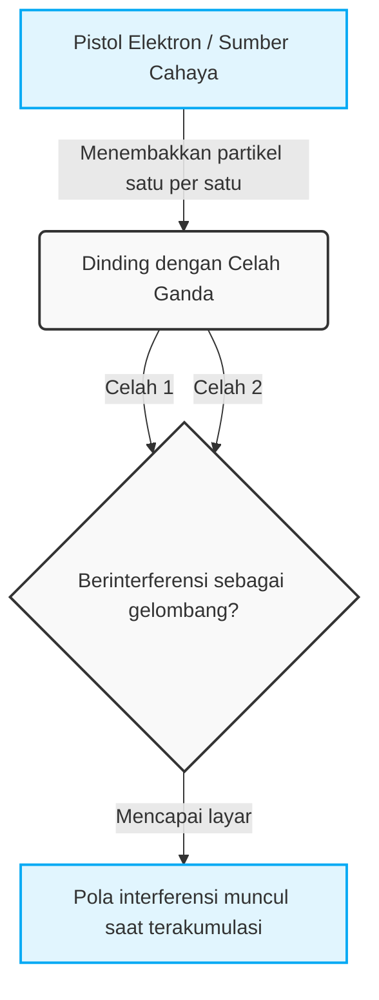
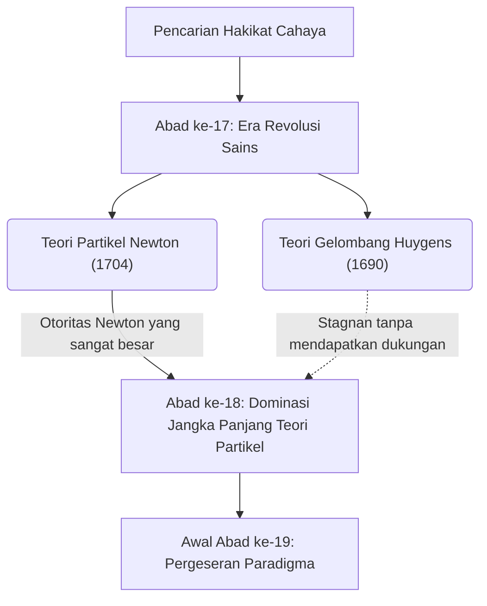
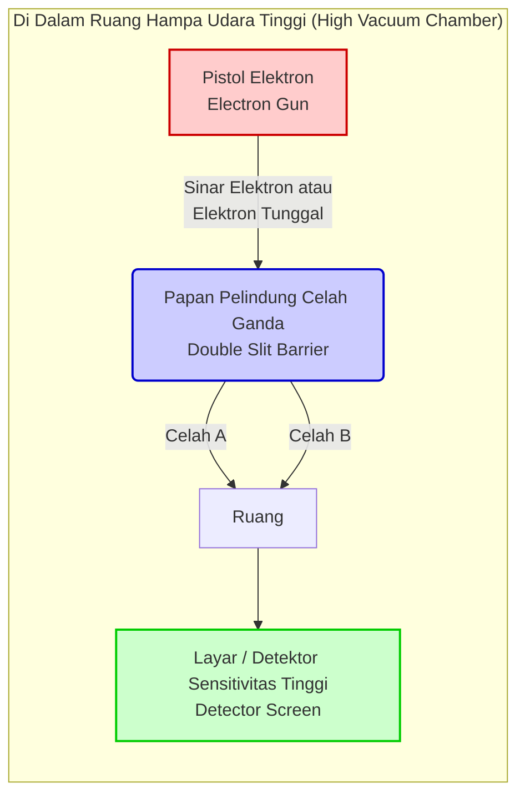

## 1. [Pengantar] Apa Itu Eksperimen Celah Ganda?

Dunia tempat kita hidup ini tampaknya diatur oleh aturan yang kokoh. Bola yang dilempar ke atas jatuh dalam lintasan parabola, dan batu yang dilemparkan ke permukaan air menciptakan riak yang menyebar. Ini adalah akal sehat dari "dunia makro" yang dijelaskan oleh fisika klasik, termasuk mekanika Newton, dan sepenuhnya sejalan dengan intuisi kita. Namun, begitu kita melangkah ke "dunia mikro", seperti atom dan elektron yang merupakan unit terkecil penyusun materi, atau partikel cahaya (foton), akal sehat itu hancur berantakan. Itu adalah ranah yang diatur oleh aturan yang sangat aneh dan tidak dapat dipahami, di mana indra dan intuisi sehari-hari kita sama sekali tidak berlaku.

"Eksperimen Celah Ganda" (Double-slit experiment) menghadapkan kita pada keanehan dunia mikro ini dalam bentuk yang paling sederhana namun mengejutkan. Fisikawan jenius abad ke-20, Richard Feynman, mengatakan tentang eksperimen ini bahwa "ini adalah satu-satunya misteri dalam mekanika kuantum," dan lebih lanjut menilai bahwa "semua misteri mekanika kuantum terkandung dalam eksperimen ini." Selain itu, banyak fisikawan terkemuka yang terus menyebut eksperimen ini sebagai "eksperimen paling indah dalam sejarah fisika." Lalu, mengapa eksperimen yang sangat sederhana—hanya berupa dua celah (slit) pada selembar pelat—dianggap begitu istimewa dan terus memikat para ilmuwan?

### Dunia Makro dan Mikro yang Berlawanan dengan Intuisi

Pertama, mari kita bayangkan fenomena di dunia makro di mana intuisi kita berfungsi secara akurat.
Misalnya, ada sebuah mesin yang menembakkan bola-bola kecil berlapis cat (atau peluru senapan mesin) berturut-turut ke arah dinding. Di depannya, ditempatkan pelat besi dengan dua celah sempit vertikal yang sejajar. Jika bola ditembakkan secara acak, hanya bola yang melewati salah satu celah yang akan menabrak dinding di belakangnya dan meninggalkan bekas tinta. Hasilnya, di dinding akan muncul tanda berupa "dua garis vertikal" yang bentuknya sama dengan dua celah di depannya. Ini adalah perilaku bola sebagai "partikel" dengan lintasan yang jelas, sebuah hasil wajar yang dapat diprediksi secara intuitif oleh siapa pun.

Selanjutnya, mari kita pertimbangkan kasus "gelombang". Tempatkan pembatas dengan dua celah di dalam tangki air dan buat gelombang dari satu sisi. Saat gelombang mencapai dua celah tersebut, gelombang akan melewatinya, dan setiap celah akan bertindak sebagai sumber gelombang baru, menyebar ke belakang sebagai dua gelombang berbentuk setengah lingkaran. Kemudian, ketika dua gelombang ini bertabrakan, terjadilah fenomena yang disebut "interferensi" (干渉). Tempat di mana puncak gelombang bertemu dengan puncak akan menjadi gelombang yang lebih tinggi, dan tempat di mana puncak bertemu dengan lembah akan saling meniadakan dan menjadi datar. Hasilnya, di dinding belakang (atau tepi air), akan terbentuk pola garis-garis indah yang disebut "pola interferensi" (干渉縞), di mana tempat yang terkena gelombang kuat dan tempat yang tidak terkena sama sekali muncul secara bergantian. Ini juga merupakan sifat dasar gelombang yang dapat diamati setiap hari pada permukaan air atau gelombang suara.

Sejauh ini tidak ada yang aneh sama sekali. Jika Anda melempar partikel, ia akan membuat "dua garis", dan jika Anda mengirimkan gelombang, ia akan membuat "pola interferensi". Ini adalah akal sehat di dunia tempat kita hidup, dan merupakan premis dari fisika klasik.

### Gambaran Umum Eksperimen dan Alasan Mengapa Disebut "Eksperimen Paling Indah"

Namun, jika kita melakukan eksperimen dengan struktur yang sama persis menggunakan entitas mikro seperti cahaya atau elektron, situasinya berubah drastis, dan intuisi manusia sepenuhnya dikhianati.
Melihat kembali ke dalam sejarah, pada tahun 1801, fisikawan Inggris Thomas Young pertama kali melakukan eksperimen celah ganda ini menggunakan sinar matahari (Eksperimen Young). Pada saat itu, teori bahwa cahaya adalah "partikel" yang diusulkan oleh Newton merupakan teori yang dominan, tetapi sebagai hasil dari eksperimen Young, "pola interferensi" yang indah muncul di layar. Hal ini memberikan bukti definitif bahwa "cahaya adalah gelombang", dan tampaknya perdebatan panjang itu telah diselesaikan.

Misteri sebenarnya, dan pergeseran paradigma terbesar dalam fisika dimulai dari sini. Memasuki abad ke-20, dengan kemajuan teknologi eksperimen yang luar biasa, menjadi mungkin untuk menembakkan cahaya atau elektron "satu per satu". Elektron memiliki massa dan menempati posisi tertentu di ruang angkasa, yang tak diragukan lagi adalah sebuah "partikel" yang jelas. Tembakkan hanya satu elektron dari pistol elektron, lewati celah ganda, dan buat ia mencapai suatu tempat di layar sebagai satu titik (titik terang). Pada titik ini, sejauh melihat jejak tabrakan di layar, elektron tidak diragukan lagi berperilaku sebagai partikel.
Kemudian, "penembakan satu elektron demi satu elektron" ini diulang ribuan atau puluhan ribu kali dalam jumlah yang sangat banyak. Karena elektron selalu terbang satu per satu, secara fisik tidak mungkin bagi mereka untuk bertabrakan dengan elektron lain di udara dan berinterferensi seperti gelombang. Tentu saja, semua orang berpikir bahwa "dua garis" yang sesuai dengan bentuk celah akan muncul di layar, sama seperti ketika melempar bola.

Namun, seiring dengan akumulasi titik-titik elektron yang tak terhitung jumlahnya di layar, pola yang muncul di sana adalah pola yang sulit dipercaya. Itu adalah "pola interferensi" yang seharusnya hanya muncul ketika gelombang saling bertabrakan.

Elektron, yang seharusnya merupakan "partikel" yang ditembakkan satu per satu, entah bagaimana berperilaku sebagai "gelombang" secara keseluruhan, berinterferensi dengan dirinya sendiri dan menggambar pola garis-garis. Apa sebenarnya arti dari semua ini? Seolah-olah satu elektron yang ditembakkan menyebar ke ruang angkasa seperti gelombang, melewati kedua celah pada saat yang sama, menyebabkan interferensi dengan dirinya sendiri, dan muncul kembali sebagai satu partikel pada saat bertabrakan dengan layar.
Lebih aneh lagi, begitu para ilmuwan menempatkan detektor (seperti kamera) di samping celah untuk memastikan "celah mana yang dilewati elektron", elektron tersebut tiba-tiba kehilangan sifat gelombangnya, dan hanya "dua garis" biasa yang muncul di layar, bukan pola interferensi. Fenomena mengubah perilaku ketika "sedang diamati" ini membawa para fisikawan ke dalam pusaran kebingungan yang lebih dalam.

Alasan utama mengapa eksperimen celah ganda disebut sebagai "eksperimen paling indah dalam fisika" adalah karena eksperimen ini mengungkap misteri mendasar alam semesta hanya dengan pengaturan yang sangat sederhana dan elegan, yaitu dua celah dan sebuah layar, tanpa memerlukan akselerator skala besar atau rumus matematika yang sangat rumit. Eksperimen ini secara visual dengan jelas menunjukkan momen ketika akal sehat dunia makro runtuh dengan spektakuler. Hal ini tidak hanya sekadar mengonfirmasi fenomena fisika, tetapi terus mengajukan pertanyaan filosofis dan epistemologis yang sangat mendalam kepada kita: "Apa itu realitas?" dan "Apakah dunia yang kita 'lihat' ini benar-benar ada secara objektif?". Di dalam satu eksperimen sederhana inilah, keterbatasan kecerdasan manusia dan romansa sains yang tak terbatas untuk melampauinya terkondensasi.
## 2. [Sejarah] Apakah Cahaya adalah Gelombang atau Partikel? Jejak Perdebatan yang Tak Berujung

Sejak umat manusia menyadari keberadaan "cahaya", pencarian tentang hakikat aslinya tidak pernah berhenti. Sejak zaman Yunani Kuno, para filsuf dan matematikawan seperti Empedocles dan Euclid telah merenungkan mekanisme cahaya dan penglihatan, tetapi pendekatan serius sebagai sains modern dimulai pada abad ke-17. Perdebatan tentang "apakah cahaya adalah partikel atau gelombang" yang dimulai pada era ini kemudian membelah dunia fisika selama lebih dari 300 tahun, dan akhirnya menjadi kekuatan pendorong untuk membuka pintu ke cabang fisika yang sama sekali baru, yaitu mekanika kuantum. Pada bagian ini, kita akan menelusuri secara rinci jejak sejarah sains yang epik ini.

### 2.1 Teori Partikel Newton vs Teori Gelombang Huygens: Bentrokan Abad ke-17

Pada paruh kedua abad ke-17, di tengah revolusi sains, dua teori kuat tentang hakikat cahaya diajukan. Teori tersebut adalah "Teori Partikel (Teori Korpuskular: Corpuscular theory)" oleh Isaac Newton dan "Teori Gelombang (Wave theory)" oleh Christiaan Huygens.

#### Teori Partikel Newton
Bintang besar fisika modern, Isaac Newton, yang dikenal karena hukum gravitasi universal dan penemuan lainnya, menganggap bahwa cahaya adalah kumpulan partikel yang sangat kecil (korpuskel). Dalam makalahnya tahun 1672 dan karya utamanya tahun 1704, "Opticks", Newton dengan cemerlang menjelaskan sifat cahaya yang merambat lurus dan hukum pemantulan pada cermin menggunakan model mekanika di mana partikel memantul dari dinding. Selain itu, mengenai fenomena di mana cahaya putih dipisahkan menjadi tujuh warna oleh prisma (dispersi), ia berpendapat bahwa warna cahaya yang berbeda adalah partikel dengan massa yang berbeda, dan karenanya memiliki indeks bias yang berbeda saat melewati suatu medium.
Menanggapi teori gelombang, Newton menunjukkan bahwa "jika cahaya adalah gelombang seperti suara, ia seharusnya melengkung di belakang rintangan (fenomena difraksi), tetapi cahaya merambat lurus dan menciptakan bayangan yang jelas," dengan demikian menolak gagasan bahwa cahaya adalah gelombang.

#### Teori Gelombang Huygens
Di sisi lain, fisikawan Belanda yang luar biasa, Christiaan Huygens, dalam bukunya "Risalah Tentang Cahaya (Treatise on Light)" yang diterbitkan pada tahun 1690, berpendapat bahwa cahaya adalah gelombang (gelombang longitudinal) yang merambat melalui medium elastis yang mengisi ruang angkasa yang disebut "eter". Huygens mengusulkan "Prinsip Huygens (Huygens' Principle)" yang terkenal, yang menyatakan bahwa "setiap titik pada muka gelombang menjadi sumber gelombang sekunder yang baru," dan dengan sangat baik menjelaskan secara geometris hukum perambatan lurus, pemantulan, dan pembiasan cahaya.
Khususnya mengenai pembiasan, Newton meramalkan bahwa "ketika cahaya memasuki medium yang rapat seperti air atau kaca, partikel-partikel tersebut akan dipercepat oleh gravitasi sehingga kecepatan cahaya menjadi lebih cepat," tetapi teori gelombang Huygens menyimpulkan bahwa "kecepatan rambat gelombang melambat di medium yang rapat," sehingga keduanya saling bertentangan secara langsung.

Namun, karena otoritas mutlak dan pengaruh Newton di komunitas sains pada saat itu, teori gelombang Huygens perlahan-lahan memudar, dan sepanjang abad ke-18 teori partikel Newton terus mendominasi sebagai arus utama.

## 2.2 Eksperimen Celah Ganda Cahaya Thomas Young (1801) dan Kemenangan Teori Gelombang

Memasuki abad ke-19, terjadi sebuah peristiwa penting yang menghancurkan benteng teori partikel yang telah lama mendominasi. Tokoh utamanya adalah seorang polimata Inggris, Thomas Young. Young, yang juga seorang dokter dan berkontribusi pada penguraian hieroglif Mesir (Batu Rosetta), pada tahun 1801 melakukan sebuah eksperimen yang bersinar terang dalam sejarah fisika. Itulah yang disebut "Eksperimen interferensi Young (yang kemudian dikenal sebagai eksperimen celah ganda)".

#### Penemuan Pola Interferensi
Susunan eksperimen Young sangat sederhana namun cerdik. Ia membuat sumber cahaya titik dengan melewatkan sinar matahari melalui lubang jarum (atau celah) yang sangat kecil, dan kemudian melewatkan cahaya tersebut melalui dua celah tipis (celah ganda) yang jaraknya sangat berdekatan, lalu memproyeksikannya ke layar di belakangnya.
Jika cahaya murni merupakan "partikel" seperti yang dikatakan Newton, maka dua garis terang yang sesuai dengan bentuk celah seharusnya terproyeksi di layar. Namun, apa yang Young lihat di layar adalah pola pita terang dan gelap yang berselang-seling, yaitu "Pola interferensi (Interference fringes)".

Fenomena ini sama sekali tidak dapat dijelaskan kecuali jika cahaya dianggap sebagai gelombang. Ketika dua gelombang bertabrakan di permukaan air, tempat di mana puncak gelombang bertemu dengan puncak gelombang akan menjadi lebih tinggi (interferensi konstruktif), dan tempat di mana puncak dan lembah bertemu akan saling menghilangkan dan menjadi datar (interferensi destruktif). Young menyimpulkan bahwa gelombang cahaya yang keluar dari dua celah menyebabkan interferensi dengan cara yang sama.

#### Dukungan Matematis dan Pembentukan Teori Gelombang
Kondisi interferensi konstruktif dan destruktif ini ditentukan oleh perbedaan panjang lintasan dari kedua celah ke suatu titik di layar (Beda lintasan optik $\Delta L$). Jika jarak antar celah adalah $d$, sudut terhadap layar adalah $\theta$, dan panjang gelombang cahaya adalah $\lambda$, maka beda lintasan optik dinyatakan sebagai berikut.

$$ \Delta L = d \sin \theta $$

* **Garis terang (Kondisi konstruktif)**: $\Delta L = m\lambda \quad (m = 0, \pm1, \pm2, \dots)$
* **Garis gelap (Kondisi destruktif)**: $\Delta L = \left(m + \frac{1}{2}\right)\lambda$

Pengumuman Young ini pada awalnya menuai kritik tajam dan ejekan dari para pengikut Newton di Inggris. Namun, pada tahun 1815, ilmuwan Prancis Augustin-Jean Fresnel membangun teori matematis yang ketat mengenai difraksi dan interferensi cahaya. Selanjutnya, pada kompetisi Akademi Sains Prancis tahun 1818, salah satu juri, Siméon Denis Poisson (penentang teori gelombang), menunjukkan bahwa "Jika teori Fresnel benar, maka akan ada titik terang di pusat bayangan penghalang melingkar. Hal konyol seperti itu tidak mungkin terjadi." Namun, ketika Dominique-François-Jean Arago benar-benar melakukan eksperimen dan mengamati "Titik Poisson (Titik Arago)" tersebut dengan sempurna, kebenaran teori gelombang tidak dapat diragukan lagi.

Pada tahun 1850, Léon Foucault dan rekan-rekannya membuktikan secara eksperimental bahwa kecepatan cahaya di dalam air lebih lambat daripada di udara, sehingga sepenuhnya membantah prediksi Newton. Kemudian pada tahun 1864, James Clerk Maxwell menetapkan teori bahwa "cahaya adalah sejenis gelombang elektromagnetik" sebagai puncak dari elektromagnetisme, di mana "Teori gelombang" cahaya meraih kemenangan mutlak, dan perdebatan tersebut sepertinya telah berakhir.

### 2.3 Kebangkitan Teori Partikel melalui Hipotesis Kuantum Cahaya Einstein (1905)

Teori Maxwell yang menyatakan bahwa cahaya adalah gelombang elektromagnetik sangatlah indah, sehingga para fisikawan di akhir abad ke-19 percaya bahwa "Fisika hampir selesai, dan yang tersisa hanyalah mengukur nilai-nilai angka kecil." Namun, dari akhir abad ke-19 hingga awal abad ke-20, muncul sebuah fenomena aneh yang sama sekali tidak dapat dijelaskan oleh teori gelombang. Fenomena itu adalah "Efek fotolistrik (Photoelectric effect)".

#### Misteri Efek Fotolistrik
Efek fotolistrik adalah fenomena di mana elektron (fotoelektron) terpancar keluar dari logam ketika cahaya disinari pada permukaan logam tersebut. Menurut pemahaman umum dari teori gelombang pada saat itu, energi cahaya (gelombang) seharusnya sebanding dengan amplitudonya (kecerahan). Oleh karena itu, diyakini bahwa "Jika disinari cahaya yang kuat (terang), warna cahaya apa pun akan menyebabkan elektron terpancar keluar dengan kuat."
Namun, hasil eksperimen sepenuhnya mengkhianati prediksi teori gelombang.

1. **Adanya frekuensi ambang batas**: Cahaya dengan frekuensi (warna) di bawah tingkat tertentu (misalnya, cahaya merah), seberapa kuat (terang) atau seberapa lama pun disinarkan, elektron sama sekali tidak terpancar keluar.
2. **Kesegeraan**: Sebaliknya, asalkan cahayanya berada di atas frekuensi ambang batas (misalnya, sinar ultraviolet), sekecil apa pun intensitas cahayanya, elektron akan segera terpancar keluar begitu cahaya disinarkan.
3. **Ketergantungan energi**: Energi kinetik dari elektron yang terpancar keluar hanya bergantung pada frekuensi (warna) cahaya, bukan pada intensitas (kecerahan) cahaya.

#### Solusi Dramatis Einstein: Kuantum Cahaya (Foton)
Misteri yang sangat membingungkan ini dipecahkan oleh seorang pemuda tak dikenal yang bekerja di kantor paten Swiss, Albert Einstein. Pada tahun 1905, yang disebut sebagai "Tahun Keajaiban", ia menerapkan "Hipotesis kuantum energi" yang diusulkan oleh Max Planck dalam penelitian radiasi termal (1900) pada cahaya itu sendiri, dan mengumumkan "Hipotesis kuantum cahaya (Light quantum hypothesis)".

Einstein dengan berani berasumsi bahwa cahaya, yang sebelumnya dianggap sebagai gelombang kontinu, merupakan kumpulan partikel dari bongkahan energi, yaitu "Kuantum cahaya (Foton: Photon)". Energi $E$ yang dimiliki oleh satu foton sebanding dengan frekuensi cahaya $\nu$, dan dinyatakan melalui rumus Planck-Einstein berikut.

$$ E = h\nu $$
(Di sini, $h$ adalah konstanta Planck, $6.626 \times 10^{-34} \, \text{J}\cdot\text{s}$)

Dengan menggunakan hipotesis ini, misteri efek fotolistrik terpecahkan layaknya sihir.
Efek fotolistrik adalah fenomena mirip biliar di mana "satu foton" bertabrakan dengan "satu elektron" di dalam logam, lalu menyerahkan seluruh energinya. Jika energi minimum yang diperlukan oleh elektron untuk melepaskan diri dari ikatan logam disebut "Fungsi kerja ($W$)", maka energi kinetik maksimum $E_k$ dari elektron yang terpancar keluar dinyatakan dengan persamaan luar biasa berikut.

$$ E_k = h\nu - W $$

Jika energi foton $h\nu$ lebih kecil dari fungsi kerja $W$ (cahaya frekuensi rendah), sebanyak apa pun foton yang ditabrakkan (seberapa kuat pun cahayanya), elektron tidak dapat terpancar keluar dari logam. Inilah alasan dari adanya frekuensi ambang batas.

#### Menuju Dunia yang Sulit Dipahami: "Gelombang sekaligus Partikel"
Hipotesis kuantum cahaya Einstein dibuktikan secara sempurna melalui eksperimen presisi oleh Robert Millikan pada tahun 1914, dan atas pencapaian ini Einstein menerima Hadiah Nobel Fisika pada tahun 1921. (Millikan sendiri awalnya tidak mempercayai teori Einstein, namun ironisnya, meskipun ia melakukan eksperimen untuk membantahnya, hasilnya justru membuktikan kebenaran teori tersebut). Lebih lanjut, pada tahun 1923, Arthur Compton menemukan "Hamburan Compton" di mana panjang gelombang sinar-X berubah ketika bertabrakan dengan elektron, sehingga memastikan bahwa cahaya berperilaku sebagai "partikel" yang memiliki momentum   $p = \frac{h}{\lambda}$.

"Teori partikel" yang seharusnya telah dikalahkan sepenuhnya oleh eksperimen Young, setelah 100 tahun berlalu, secara ajaib bangkit kembali dalam bentuk yang lebih disempurnakan, yaitu "Kuantum".
Namun, hal ini menciptakan kontradiksi yang serius. Cahaya memiliki sifat yang jelas sebagai gelombang seperti "interferensi" yang ditunjukkan dalam eksperimen celah ganda Young, sekaligus memiliki sifat sebagai "partikel" seperti yang ditunjukkan dalam efek fotolistrik.

Apakah cahaya itu gelombang, atau partikel?
Jawaban akhir fisika terhadap pertanyaan ini adalah sesuatu yang sangat bertentangan dengan intuisi manusia, yaitu "Cahaya adalah keduanya, sekaligus bukan keduanya. Cahaya adalah entitas kuantum yang memiliki kombinasi dari 'sifat gelombang' dan 'sifat partikel'." Inilah lahirnya "Dualisme gelombang-partikel (Wave-particle duality)".
Kemudian konsep dualisme ini tidak berhenti pada cahaya saja, melainkan mulai diterapkan pada materi itu sendiri seperti elektron (Gelombang materi de Broglie), dan fisika melangkah ke dalam jurang yang belum pernah ada sebelumnya, sebuah dunia yang aneh dan mempesona yang disebut "Mekanika kuantum". Panggung paling simbolis untuk hal tersebut adalah versi modern yang telah diperbarui dari "Eksperimen celah ganda mekanika kuantum".
## 3. [Transisi] Apakah Materi juga Gelombang? Gelombang de Broglie dan Eksperimen Celah Ganda Elektron

Dengan adanya hipotesis kuantum cahaya Einstein (1905) yang menyatakan bahwa cahaya "adalah gelombang, sekaligus partikel", dunia fisika berada di tengah-tengah kekacauan besar dan pusaran pergeseran paradigma. Meskipun selama bertahun-tahun cahaya diyakini secara absolut sebagai gelombang berkat eksperimen interferensi Young dan elektromagnetisme Maxwell, fenomena seperti efek fotolistrik tidak dapat dijelaskan kecuali cahaya dianggap sebagai "partikel (foton)". Sifat aneh "Dualisme gelombang-partikel" ini pada awalnya dianggap sebagai sifat unik yang hanya dimiliki oleh cahaya. Namun, memasuki tahun 1920-an, konsep dualisme ini tidak lagi terbatas pada dunia cahaya, melainkan mulai menampakkan taringnya pada "materi" itu sendiri yang membentuk tubuh kita.

### 3.1. Usulan Gelombang Materi oleh Louis de Broglie: Lompatan dari Simetri yang Indah

Pada tahun 1924, seorang mahasiswa pascasarjana muda dari Prancis, Louis de Broglie, dalam disertasi doktoralnya mengusulkan sebuah hipotesis yang sangat berani dan secara fundamental membalikkan sejarah fisika. Hipotesis tersebut adalah, "Jika cahaya (yang dianggap sebagai gelombang) memiliki sifat partikel, maka sebaliknya, mungkinkah materi seperti elektron (yang dianggap sebagai partikel) juga memiliki sifat gelombang?"

Intuisi filosofis de Broglie bahwa alam semesta selalu menyukai simetri menjadi dasar dari hipotesis ini. Ia menerapkan persamaan hubungan antara energi dan momentum yang diturunkan oleh Einstein dalam teori relativitas khusus dan hipotesis kuantum cahaya pada partikel materi bermassa. Momentum foton $p$ dinyatakan dengan menggunakan konstanta Planck $h$ dan panjang gelombang $\lambda$ sebagai $p = h / \lambda$. De Broglie membalik hal ini, dan merumuskan panjang gelombang $\lambda$ dari gelombang yang menyertai partikel bermassa $m$ dan bergerak dengan kecepatan $v$ (momentum $p = mv$) melalui persamaan matematika yang sangat sederhana berikut ini.

$$ \lambda = \frac{h}{p} = \frac{h}{mv} $$

Inilah rumus terkenal untuk "Panjang gelombang de Broglie (panjang gelombang materi)". Persamaan matematika ini berarti bahwa segala sesuatu yang bergerak, mulai dari bola bisbol dan mobil yang kita lihat dalam kehidupan sehari-hari, hingga elektron mikroskopis, membawa sifat sebagai "gelombang". Lalu, mengapa kita tidak melihat bola bisbol berinterferensi atau berdifraksi seperti gelombang dalam kehidupan sehari-hari? Hal itu dikarenakan konstanta Planck $h$ (sekitar $6.626 \times 10^{-34} \text{ J}\cdot\text{s}$) sangatlah kecil. Pada benda makroskopis, karena massa $m$ terlalu besar, panjang gelombang de Broglie $\lambda$ menjadi sangat kecil sehingga praktis dapat dianggap nol, dan sifat gelombangnya tersembunyi sepenuhnya. Namun, di dunia elektron dengan massa yang sangat kecil, panjang gelombang ini berada pada skala yang sama dengan panjang gelombang sinar-X (gelombang elektromagnetik) (sekitar $0.1 \text{ nm}$, dll.), dan muncul dalam ukuran yang tidak dapat diabaikan begitu saja.

Makalah de Broglie ini sangat tidak masuk akal (di luar akal sehat pada saat itu), sehingga sangat membingungkan para penguji. Namun, ketika salah satu penguji, Paul Langevin, mengirimkan makalah ini kepada Einstein, Einstein sangat memujinya dan berkata, "Ia telah mengangkat salah satu sudut dari tabir yang besar." Akibatnya, konsep "Gelombang materi (matter wave)" de Broglie menarik perhatian dunia, yang kemudian secara langsung mengarah pada penyelesaian mekanika gelombang oleh Schrödinger.

### 3.2. Eksperimen Davisson-Germer: Bukti Sifat Gelombang pada Materi

Meskipun hipotesis de Broglie indah sebagai teori, apakah teori tersebut mendeskripsikan alam semesta dalam kenyataan masih harus menunggu pembuktian melalui eksperimen. "Jika elektron benar-benar merupakan gelombang, maka ia seharusnya menyebabkan 'difraksi' dan 'interferensi' yang merupakan fenomena khas gelombang." Berdasarkan keyakinan ini, para fisikawan di seluruh dunia mulai melakukan eksperimen untuk menangkap sifat gelombang elektron.

Kemudian pada tahun 1927, bukti konklusif akhirnya didapatkan. Bukti itu berasal dari "Eksperimen Davisson-Germer" oleh fisikawan Clinton Davisson dan Lester Germer di Bell Labs, Amerika Serikat.

Awalnya mereka melakukan eksperimen dengan tujuan lain, yaitu menembakkan berkas elektron ke kristal nikel dan meneliti pola hamburannya. Namun, ketika mereka memanaskan nikel pada suhu tinggi untuk memulihkan diri dari kecelakaan selama eksperimen (oksidasi permukaan nikel akibat pecahnya tabung vakum), secara kebetulan mereka cukup beruntung karena nikel tersebut membentuk kristal tunggal (monokristal). Ketika mereka menembakkan berkas elektron kembali ke nikel yang telah terkristalisasi tunggal ini, fenomena mengejutkan teramati. Intensitas elektron yang dihamburkan menunjukkan "pola difraksi" yang jelas, yaitu memiliki nilai maksimum pada sudut-sudut tertentu.

Jarak berurutan dan teratur antar atom dalam kristal (konstanta kisi) hampir sama skalanya dengan panjang gelombang de Broglie dari elektron. Dengan kata lain, kristal nikel itu sendiri berfungsi sebagai "kisi difraksi alami" bagi elektron. Hasil hitung mundur Davisson dan Germer mengenai panjang gelombang elektron dari pola difraksi ini sangat cocok dengan nilai yang diprediksi oleh rumus de Broglie $\lambda = h/p$. Pada tahun yang sama, George Paget Thomson dari Inggris (putra J.J. Thomson penemu elektron) juga berhasil mengamati cincin difraksi (Cincin Debye-Scherrer) oleh berkas elektron yang menembus foil logam tipis.

Hasil dari eksperimen-eksperimen ini menghadapkan dunia fisika pada fakta tak terbantahkan bahwa materi memiliki sifat sebagai gelombang. Elektron yang seharusnya partikel berperilaku sebagai gelombang. Ini adalah momen terungkapnya kebenaran alam yang mendalam, sekaligus menjadi keriuhan (fanfare) yang menandai fajar mekanika kuantum. De Broglie dianugerahi Hadiah Nobel Fisika pada tahun 1929, sedangkan Davisson dan Thomson masing-masing pada tahun 1937.

### 3.3. Eksperimen Celah Ganda Penentu oleh Hitachi (Akira Tonomura dkk.) (1989)

Bahkan setelah terbukti bahwa elektron adalah gelombang, eksplorasi para fisikawan tidak pernah berhenti. Terdapat upaya untuk melaksanakan "Eksperimen celah ganda elektron" yang selama ini hanya dibicarakan sebagai eksperimen pikiran, menjadi kenyataan dan dengan presisi yang ekstrem.

Sama halnya dengan eksperimen celah ganda cahaya (Eksperimen Young), jika elektron ditembakkan ke arah celah ganda, maka pola interferensi seharusnya muncul di layar belakang. Namun, di sinilah paradoks mekanika kuantum yang paling membingungkan menampakkan dirinya. "Bagaimana jika elektron ditembakkan **satu per satu**, alih-alih ditembakkan dalam jumlah besar sekaligus?"

Satu elektron adalah partikel yang tidak dapat dibagi. Oleh karena itu, ia seharusnya hanya dapat melewati salah satu celah, entah celah kiri ataupun celah kanan. Elektron yang mencapai layar satu per satu hanya akan meninggalkan satu titik terang di layar. Ketika proses ini diulang puluhan ribu kali, apakah kumpulan titik-titik tersebut hanya akan menjadi bayangan dari dua celah (dua garis), ataukah menjadi pola interferensi yang menunjukkan sifat gelombang?

Atas pertanyaan pamungkas ini, tim peneliti dari Laboratorium Penelitian Dasar Hitachi di Jepang (Dr. Akira Tonomura dkk.) berhasil menerobos batas teknologi dan menyajikan jawaban yang paling indah dan sempurna di dunia. Pada tahun 1989, dengan memanfaatkan teknologi holografi elektron serta teknologi mikroskop elektron bervakum ultra-tinggi dan bersuhu kriogenik (sangat rendah), mereka berhasil dengan gemilang melakukan "Eksperimen interferensi biprisma elektron tunggal".

Susunan eksperimennya sangatlah menakjubkan. Mereka mengurangi jumlah elektron yang dipancarkan dari pistol elektron hingga batas ekstrem, sehingga selalu menciptakan kondisi "hanya ada satu elektron di dalam peralatan" selama elektron tersebut terbang di ruang hampa. Kecepatan elektron mencapai sekitar 150.000 kilometer per detik, dan waktu yang dibutuhkan untuk terbang dari sumber ke detektor hanyalah sekejap mata. Elektron berikutnya ditembakkan jauh setelah elektron sebelumnya mencapai layar.

Begitu eksperimen dimulai, titik-titik terang yang menunjukkan sampainya elektron mulai bermunculan satu per satu di detektor (monitor). Pada tahap awal untuk beberapa atau ratusan elektron pertama, titik-titik tersebut hanya tampak tersebar secara acak di layar. Bagaikan bintang-bintang di langit malam, tampaknya tidak ada keteraturan sama sekali di sana.

Namun, seiring dengan terakumulasinya ribuan hingga puluhan ribu elektron, pemandangan mengejutkan yang jelas bagi siapa pun mulai muncul. Kumpulan titik-titik yang sebelumnya tampak tak beraturan, secara perlahan-lahan membentuk pola pita terang dan gelap yang teratur —— sebuah "pola interferensi" yang tak terbantahkan.

Makna dari hasil ini sangatlah bertentangan dengan intuisi. Elektron secara pasti mencapai layar sebagai "1 partikel" (itulah sebabnya 1 titik terekam). Namun, fakta bahwa secara keseluruhan mereka membentuk pola interferensi hanya dapat ditafsirkan bahwa 1 elektron tersebut "secara bersamaan melewati kedua celah (kedua sisi biprisma) sebagai gelombang, dan berinterferensi dengan dirinya sendiri". Elektron tunggal yang tidak berinteraksi dengan siapa pun, berinterferensi dengan dirinya sendiri. Prinsip yang sama dengan perkataan Dirac bahwa "foton hanya berinterferensi dengan dirinya sendiri" telah dibuktikan secara sempurna pada elektron, partikel materi yang memiliki massa.

Eksperimen oleh Dr. Akira Tonomura dan rekan-rekannya ini dipuji di seluruh dunia sebagai bukti paling visual dan langsung dari keajaiban mekanika kuantum, yakni "Dualisme gelombang-partikel". Tidak mengherankan jika dalam pemungutan suara pembaca untuk "Eksperimen Paling Indah dalam Sejarah Fisika" yang diadakan oleh majalah sains Inggris "Physics World" pada tahun 2002, "Eksperimen celah ganda elektron" ini dengan bangga terpilih di posisi pertama.

Dengan demikian, hipotesis eksentrik de Broglie bahwa "materi adalah gelombang", setelah lebih dari 60 tahun berlalu, menampakkan wujud aslinya di depan mata kita sebagai pola interferensi mistis yang digambar oleh sebuah elektron. Namun, meskipun eksperimen ini memecahkan misteri mekanika kuantum, di saat yang bersamaan ia juga membuka pintu menuju misteri yang lebih dalam, yakni "Masalah pengukuran". "Jika kita mencoba melihat celah mana yang dilewatinya, maka pola interferensinya akan menghilang" —— di bab selanjutnya, mari kita melangkah lebih jauh ke dalam jurang terdalam dari dunia kuantum yang aneh ini.
## 4. 【Metode dan Hasil Eksperimen】 Apa yang Sebenarnya Terjadi

(Untuk mendekati inti dari eksperimen celah ganda dan mengintip ke dalam jurang mekanika kuantum, kita akan fokus menjelaskan eksperimen ini menggunakan "elektron" alih-alih cahaya. Meskipun fenomena serupa telah dikonfirmasi pada foton, partikel elementer lainnya, dan bahkan molekul yang relatif besar seperti fullerene, menggunakan elektron—yang memiliki massa dan kita kenali sebagai "jelas-jelas partikel materi"—akan semakin menonjolkan paradoks dan keajaiban fenomena ini.)

### 4.1 Persiapan Perangkat Eksperimen: Panggung untuk Menangkap Dunia Mikrokosmos

Pertama-tama, mari kita lihat secara detail pengaturan (setup) panggung tempat eksperimen historis dan revolusioner ini dilakukan. Struktur konseptual dari eksperimen celah ganda secara mengejutkan sangat sederhana, tetapi di balik keberhasilannya sebagai eksperimen fisik yang nyata, dibutuhkan teknologi canggih dan kontrol lingkungan yang sangat ketat.

Perangkat eksperimen secara garis besar terdiri dari 3 komponen utama berikut. Semuanya ditempatkan dan ditutup rapat di dalam ruang hampa udara tingkat tinggi (vacuum chamber) untuk mencegah hamburan elektron akibat tabrakan dengan molekul udara.

1. **Pistol Elektron (Electron Gun)**:
   Ini adalah alat untuk menembakkan "elektron", yang merupakan bintang utama dari eksperimen ini. Menggunakan prinsip pemanasan filamen untuk melepaskan elektron termionik atau menarik elektron menggunakan medan listrik yang kuat, alat ini menembakkan elektron dengan energi kinetik tertentu ke arah yang telah ditentukan. Hal yang sangat penting dalam eksperimen ini adalah bahwa ia tidak hanya dapat menembakkan elektron terus-menerus seperti air terjun sebagai "sinar (beam)" yang kuat, tetapi yang menakjubkan, outputnya juga dapat dikurangi hingga batas ekstrem sehingga dapat menembakkan elektron "benar-benar satu per satu" secara terkontrol. "Teknologi penembakan elektron tunggal" ini adalah salah satu teknologi presisi yang sangat diperlukan dalam eksperimen mekanika kuantum modern.

2. **Celah Ganda (Double Slit)**:
   Ini adalah papan pelindung (dinding) yang memiliki dua celah (lubang) yang dibuat sejajar, sangat sempit, dan jaraknya sangat berdekatan, sebagai tempat lewatnya elektron yang ditembakkan dari pistol elektron. Karena panjang gelombang dari "gelombang materi (gelombang de Broglie)" elektron sangatlah pendek, lebar celah dan jarak antar celah ini harus dibuat secara presisi dalam ukuran mikroskopis berskala nanometer (sepermiliar meter) hingga mikrometer. Jika lebar atau jarak celah terlalu lebar dibandingkan dengan panjang gelombang elektron, sifat gelombang berupa "interferensi" tidak akan dapat diamati dengan jelas. Teknologi untuk membuat celah ganda yang sangat kecil ini sendiri dapat dikatakan sebagai kristalisasi dari teknologi fabrikasi mikro seperti sistem litografi berkas elektron mutakhir.

3. **Layar (Detektor, Screen / Detector)**:
   Ini adalah layar observasi untuk merekam posisi akhir elektron yang berhasil melewati celah ganda. Di masa lalu, eksperimen menggunakan pelat foto peka cahaya atau sejenisnya, tetapi saat ini digunakan kamera CCD sensitivitas tinggi, layar fluoresen, detektor piksel semikonduktor khusus, dan sebagainya. Hal ini memungkinkan setiap elektron yang "tiba (menabrak) di mana" dapat direkam secara presisi sebagai koordinat dua dimensi setiap kali tembakan. Ketika elektron menabrak layar, ia memancarkan cahaya redup atau menghasilkan sinyal listrik di sana, meninggalkan jejak (titik) yang jelas yang berarti "tanpa ragu satu partikel telah tiba di sini."

Gambar di bawah ini adalah representasi skematik dari keseluruhan tata letak perangkat eksperimen ini beserta lintasan elektronnya.

### 4.2 Ketika Sejumlah Besar Elektron Ditembakkan: Perilaku sebagai Gelombang yang Mengkhianati Intuisi (Pembentukan Pola Interferensi)

Sekarang, akhirnya kita akan memulai eksperimen ini. Sebagai langkah pertama, kita akan meningkatkan output dari pistol elektron dan menembakkan "sejumlah besar elektron" secara serentak ke arah celah ganda secara terus-menerus, layaknya pancuran atau senapan mesin.

Jika dipikirkan dengan akal sehat fisika klasik yang kita miliki sehari-hari, elektron adalah "partikel (seperti peluru kecil)" yang memiliki massa. Oleh karena itu, sejumlah besar elektron yang melewati dua celah diperkirakan akan menabrak secara terkonsentrasi di dua lokasi pada layar yang berada pada garis lurus perpanjangan dari masing-masing celah, yang pada akhirnya membentuk pola seperti "dua garis vertikal." Bayangkan menyemprotkan cat semprot ke pelat stensil yang memiliki dua celah. Cat yang melewati celah tersebut seharusnya akan menggambar dua garis di dinding sesuai dengan bentuk celahnya.

Namun, pola yang sebenarnya muncul di layar benar-benar mengkhianati intuisi dan prediksi kita. Pada layar, terbentuk dengan sangat jelas bukan dua garis vertikal sederhana, melainkan **banyak pola garis terang dan gelap (Pola Interferensi: Interference Pattern)**.

"Pola interferensi" ini memiliki karakteristik geometris yang persis sama dengan pola yang terbentuk ketika riak dari dua batu yang dilemparkan bersamaan ke permukaan kolam saling tumpang tindih, atau pola yang terlihat dalam eksperimen interferensi cahaya.
- **Di tempat di mana puncak dan puncak, atau lembah dan lembah gelombang saling tumpang tindih (interferensi konstruktif)**, area tersebut menjadi garis "terang (kepadatan benturan elektron tinggi)" di mana banyak elektron tiba.
- **Di tempat di mana puncak dan lembah gelombang saling tumpang tindih (interferensi destruktif)**, gelombang saling meniadakan, dan area tersebut menjadi garis "gelap (kepadatan benturan elektron mendekati nol)" di mana elektron hampir tidak tiba sama sekali.

Kesimpulan dari hasil ini hanya satu. Yaitu, **"elektron berperilaku sebagai gelombang"**. Kawanan elektron yang dilepaskan dari pistol elektron merambat melalui ruang angkasa seperti gelombang air, dan melewati kedua celah "secara bersamaan". Kemudian, gelombang yang berdifraksi dan menyebar dari celah A, dan gelombang yang berdifraksi dan menyebar dari celah B, tumpang tindih dan berinterferensi di ruang tepat di depan layar, yang hanya dapat ditafsirkan bahwa hal itu menghasilkan pola garis terang dan gelap yang khas tersebut.

Fakta bahwa elektron yang selama ini diyakini kuat sebagai "partikel" ternyata juga memiliki sifat sebagai "gelombang" (dualitas gelombang-partikel). Fakta ini sendiri merupakan penemuan bersejarah dalam fisika dan sudah cukup menakjubkan, tetapi misteri sesungguhnya dari mekanika kuantum, dan fenomena yang secara fundamental menjungkirbalikkan akal sehat kita, akan semakin mendalam dari titik ini.

### 4.3 Ketika Elektron Ditembakkan "Satu per Satu": Eksperimen Ekstrem yang Mengungkap Identitas Asli "Gelombang Probabilitas"

"Karena elektron ditembakkan dalam jumlah besar secara bersamaan, bukankah elektron-elektron tersebut bertabrakan satu sama lain di udara atau saling tolak-menolak karena gaya listrik (gaya Coulomb), sehingga hanya menghasilkan pola seperti gelombang?"
Berpikir seperti ini adalah keraguan yang sangat wajar bagi seorang ilmuwan. Nyatanya, ketika pola interferensi pertama kali ditemukan, banyak fisikawan yang berpikir demikian dan mencoba menafsirkan fenomena tersebut secara klasik.

Untuk sepenuhnya menyelesaikan keraguan ini, teknologi eksperimen dikembangkan dan eksperimen yang lebih definitif pun dilakukan. (Di Jepang, eksperimen yang dilakukan pada tahun 1989 oleh kelompok Akira Tonomura dan rekan-rekannya di Hitachi sangat terkenal, dan dipuji sebagai salah satu eksperimen terindah di dunia).
Eksperimen tersebut adalah eksperimen di mana **output dari pistol elektron dikurangi hingga batas ekstrem, dan menembakkan elektron "benar-benar satu per satu"**.

Secara spesifik, setelah memastikan bahwa elektron sebelumnya telah ditembakkan, mencapai layar, dan sepenuhnya menghilang (atau diserap), barulah elektron baru berikutnya ditembakkan. Ini diulang dalam jumlah yang luar biasa, puluhan ribu hingga ratusan ribu kali. Dalam pengaturan ini, dijamin bahwa "selalu hanya ada satu elektron" yang ada di dalam ruang perangkat eksperimen pada satu waktu. Oleh karena itu, mustahil 100% secara fisik bagi elektron untuk bertabrakan satu sama lain di udara atau berinterferensi satu sama lain.

Mari kita ikuti hasil eksperimen dengan elektron tunggal dalam kondisi ekstrem ini seiring berjalannya waktu (akumulasi jumlah elektron).

**Langkah 1: Segera setelah dimulainya eksperimen (puluhan hingga ratusan elektron)**
Di layar, titik-titik tercetak satu per satu pada posisi yang benar-benar acak. Pada saat mencapai layar, elektron jelas menunjukkan sifat sebagai "satu partikel", merekam satu titik (dot) pada koordinat mikroskopis tertentu. Pada titik ini, tidak ada keteraturan yang terlihat pada pola di layar; itu hanya tampak seperti kumpulan titik yang acak dan kacau. Hal ini seperti melempar anak panah sembarangan dengan mata tertutup.

**Langkah 2: Setelah ribuan hingga puluhan ribu elektron tiba**
Seiring berjalannya waktu, seiring diulangnya eksperimen, dan ketika ribuan hingga puluhan ribu titik terakumulasi di layar, fenomena aneh mulai terjadi. Di dalam distribusi titik yang kita pikir sepenuhnya acak, perlahan-lahan mulai terlihat adanya "bias" atau "nuansa gelap terang". Area di mana titik-titik terkonsentrasi dan banyak tercetak, dengan area di mana titik-titik hampir tidak ada, mulai terpisah dengan samar-samar.

**Langkah 3: Di akhir eksperimen (ratusan ribu elektron atau lebih telah tiba)**
Setelah menghabiskan waktu yang cukup lama dan terus menembakkan sejumlah besar (ratusan ribu hingga jutaan) elektron satu per satu melalui pekerjaan yang melelahkan, ketika melihat gambar kumulatif di seluruh layar... di sana, **"Pola Interferensi"** yang menakjubkan, sama persis dengan saat sejumlah besar elektron ditembakkan sekaligus, terlihat dengan jelas!

Ini adalah salah satu hasil yang paling membuat bulu kuduk berdiri, berlawanan dengan intuisi, namun paling indah dan mendalam dalam sejarah fisika.

Karena, elektron ditembakkan "benar-benar satu per satu". Sangat tidak mungkin bagi sebuah elektron untuk berinteraksi dengan elektron sebelum dan sesudahnya. Meskipun demikian, fakta bahwa pada akhirnya terbentuk pola garis yang menunjukkan interferensi gelombang berarti kita harus menerima kesimpulan yang sulit dipercaya, yaitu bahwa **"satu elektron berinterferensi dengan dirinya sendiri"**.

Mencoba menjelaskan fenomena ini secara logis akan benar-benar menghancurkan indra ruang dan materi kita sehari-hari.
Setelah ditembakkan dari pistol elektron, satu elektron seolah-olah menyebar ke seluruh ruang seperti "gelombang", **melewati celah kanan dan celah kiri "secara bersamaan"**, berinterferensi dengan "gelombangnya sendiri" di depan layar, dan pada saat ia tiba dan diamati di layar, ia kembali menyusut (ditentukan) menjadi "satu partikel" pada satu titik.

Lalu, apa sebenarnya wujud asli dari "gelombang" yang merambat melalui ruang dari satu elektron ini?
Dalam mekanika kuantum, ini bukanlah gelombang berwujud di mana medium fisik seperti permukaan air atau udara sedang beriak. Menurut interpretasi yang diajukan oleh Max Born, ini adalah **"gelombang yang mewakili 'probabilitas' bahwa elektron tersebut ada di lokasi tertentu di ruang angkasa tersebut (gelombang probabilitas)"**. Secara matematis ini disebut "fungsi gelombang".

Elektron tidak terbang dalam garis lurus melalui lintasan (rute) tertentu seperti bola pachinko. Dari saat ia ditembakkan sampai mencapai layar, elektron menyebar di ruang angkasa sebagai "keadaan tumpang tindih (superposisi)" dengan berbagai probabilitas, antara "keadaan melewati celah kanan" dan "keadaan melewati celah kiri", dan bahkan "keadaan melewati semua jalur di ruang angkasa".

Kemudian, saat ia menabrak alat observasi yaitu layar, dan "di mana ia tiba" diukur, gelombang probabilitas yang tersebar di ruang angkasa secara instan menyusut ke satu titik (keruntuhan fungsi gelombang), dan untuk pertama kalinya posisi partikel nyata yang menyatakan "ia ada di sini" dikonfirmasi.

"Bagian terang (di mana titik-titik akhirnya paling banyak berkumpul)" dari pola interferensi adalah tempat di mana probabilitas keberadaan elektron ditingkatkan oleh interferensi gelombang, dan "bagian gelap (di mana titik-titik tidak berkumpul)" berarti tempat di mana gelombang probabilitas saling meniadakan dan menjadi nol. Sama seperti probabilitas mendapatkan setiap sisi saat melempar dadu berkali-kali akan mendekati nilai teoretis (1/6), "perilaku probabilistik" dari setiap elektron yang diulang ratusan ribu kali menyebabkan bentuk gelombang probabilitas (pola interferensi) muncul sebagai pola yang nyata.

"Satu elektron melewati dua celah secara bersamaan" "Keadaan tidak ditentukan sampai ia diamati, dan hanya ada sebagai gelombang probabilitas di mana kemungkinan tak terbatas saling tumpang tindih".
Fakta eksperimental yang dingin dari eksperimen celah ganda ini melontarkan pertanyaan filosofis mendalam kepada kita yang melampaui batasan fisika: "Apa sebenarnya makna dari ada itu sendiri?" dan "Apa sebenarnya realitas yang kita kenali ini?".

## 5. 【Masalah Pengukuran】 Kuantum yang Mengubah Perilakunya Ketika Diamati

Inti dari alasan mengapa eksperimen celah ganda dalam mekanika kuantum telah memberikan dampak yang luar biasa tidak hanya di bidang fisika tetapi juga pada domain filsafat dan pemikiran, serta disebut sebagai eksperimen yang paling indah namun paling menyeramkan dalam sejarah sains, terletak di sini. Yaitu fakta yang menakjubkan bahwa tindakan "pengamatan (pengukuran)" itu sendiri secara meyakinkan mengubah hasil dari fenomena fisik.

Di dunia (makro) sehari-hari tempat kita hidup, yaitu dunia yang dikuasai oleh fisika klasik, "melihat" hanyalah tindakan pasif semata. Apakah kita melihat bulan yang mengambang di langit malam atau tidak, bulan itu tetap ada di sana secara nyata dan bergerak mengikuti orbit tertentu berdasarkan mekanika Newton. Hanya karena kita melihatnya, orbit bulan tidak akan berubah. Keberadaan pengamat sama sekali tidak mempengaruhi realitas objektif dari objek yang diamati, itulah akal sehat kuat yang kita miliki.

Namun, di dunia mikro kuantum, akal sehat ini sepenuhnya dijungkirbalikkan. "Melihat (mengamati)" bukanlah sekadar penerimaan informasi, melainkan sebuah proses aktif yang memberikan dampak yang tidak dapat diubah dan menentukan pada objek. Pada saat pengamat secara alami melontarkan pertanyaan, alam akan mengubah perilakunya. Di bagian ini, kita akan menggali lebih dalam secara detail mengenai misteri terbesar dalam eksperimen celah ganda, yang perdebatannya masih terus berlangsung dalam fisika modern, yaitu "Masalah Pengukuran (Measurement Problem)".

### Apa yang Terjadi Jika Kita "Mengamati" Celah Mana yang Dilewati

Bayangkan proses menembakkan kuantum satu per satu, mulai dari elektron, foton, atau bahkan molekul besar seperti fullerene (C60), yang kemudian melewati dua celah hingga mencapai layar. Dari penjelasan sebelumnya, kita telah mengkonfirmasi bahwa meskipun kuantum diterbangkan satu per satu dengan jeda, jika kita mengamati akumulasi titik terang di layar dalam waktu yang lama, pola interferensi yang indah (bukti sifatnya sebagai gelombang) akan terbentuk di sana. Ini ditafsirkan sebagai hasil dari satu kuantum yang merambat melalui ruang angkasa sebagai superposisi (Superposition) dari dua kemungkinan, "kemungkinan melewati celah kanan" dan "kemungkinan melewati celah kiri", lalu gelombang probabilitasnya berinterferensi dengan dirinya sendiri.

Namun, di sini para fisikawan memiliki pertanyaan yang sangat wajar, tetapi jahat di dunia kuantum. "Apakah kuantum benar-benar melewati 'kedua celah secara bersamaan'? Atau 'apakah sebenarnya ia hanya melewati salah satu celah, tetapi kita saja yang tidak mengetahuinya'? Mari kita letakkan kamera di samping celah dan memastikannya."

Untuk menjawab pertanyaan ini, kita menambahkan satu perubahan pada perangkat eksperimen. Kita meletakkan "detektor (alat observasi)" dengan sensitivitas yang sangat tinggi tepat di sebelah celah. Detektor ini bertujuan untuk "mengamati" dan merekam apakah elektron melewati celah kanan atau celah kiri. Pengaturan eksperimen sama persis kecuali penambahan detektor. Kita menembakkan elektron satu per satu. Detektor beroperasi dengan pasti dan memberi tahu kita informasi rute elektron (Which-path information) secara akurat, "melewati kanan" atau "melewati kiri". Sesuai prediksi, dipastikan bahwa separuh elektron melewati kanan dan separuhnya lagi melewati kiri. Dengan ini, intuisi kita terpuaskan. "Tuh kan, ternyata elektron sebagai partikel hanya melewati salah satu lubang saja. Superposisi itu hanya ilusi."

Namun, para fisikawan yang memastikan pola distribusi akhir elektron yang mencapai layar menjadi tidak bisa berkata-kata. Apa yang tergambar di sana bukanlah pola interferensi indah yang menunjukkan sifat gelombang, melainkan hanya "dua garis (atau dua gundukan)". Ini persis sama dengan pola yang terbentuk ketika partikel klasik seperti bola bisbol atau kerikil dilemparkan ke celah. "Interferensi gelombang" yang sangat penting untuk membentuk pola interferensi telah sepenuhnya lenyap.

Pada saat kita mencoba mengamati "yang mana yang dilewati", elektron melepaskan sifatnya sebagai gelombang (keadaan superposisi) dan mulai berperilaku sebagai partikel klasik murni. Jika kita mematikan detektor, pola interferensi muncul kembali, dan jika kita menghidupkannya, pola interferensi hilang tanpa jejak. Hebatnya lagi, "jika data pengamatan direkam, tetapi tidak ada yang melihat data tersebut lalu menghapusnya", pola interferensi bahkan dapat dipulihkan, seperti yang ditunjukkan oleh eksperimen selanjutnya (eksperimen penghapusan kuantum). Kuantum bertindak seolah-olah dia "tahu" bahwa kita sedang melihatnya, atau bahwa informasi rutenya tertinggal di suatu tempat di alam semesta. Ini disebut "kerusakan interferensi melalui pemerolehan informasi rute", dan menjadi bukti konklusif betapa jauhnya dunia kuantum dari intuisi kita.

### Interpretasi Kopenhagen (Keruntuhan Paket Gelombang)

Lalu, bagaimana seharusnya kita menafsirkan fenomena yang sangat misterius ini? Pada tahun 1920-an, Niels Bohr, Werner Heisenberg, Max Born, dan lainnya membangun interpretasi paling standar dan ortodoks dalam mekanika kuantum, yaitu "Interpretasi Kopenhagen".

Dalam Interpretasi Kopenhagen, kuantum sebelum diamati dianggap hanya ada sebagai "gelombang probabilitas (fungsi gelombang)" yang menyebar di ruang angkasa. Fungsi gelombang (biasanya dilambangkan dengan $\Psi$) itu sendiri bukanlah entitas fisik yang nyata, melainkan alat matematika yang mewakili "amplitudo probabilitas" ditemukannya kuantum di suatu tempat. Gelombang probabilitas ini berkembang (berubah) seiring waktu secara deterministik dan halus mengikuti persamaan Schrödinger. Dalam eksperimen celah ganda, gelombang probabilitas elektron melewati celah kanan dan celah kiri, lalu saling berinterferensi di depan layar. Sampai titik ini, ini adalah proses deterministik di mana sifat gelombang mendominasi dunia tersebut.

Namun, pada saat proses fisik "pengamatan" dilakukan, fungsi gelombang ini mengalami perubahan dramatis dan tidak kontinu. Ini disebut "keruntuhan paket gelombang (keruntuhan fungsi gelombang: Wavefunction Collapse)". Pada saat detektor mendeteksi "elektron telah melewati celah kanan", semua gelombang kemungkinan yang menyebar ke seluruh ruang seperti "mungkin melewati kiri" atau "mungkin melewati tengah" menghilang dalam sekejap melebihi kecepatan cahaya, dan menyusut (runtuh) menjadi hanya satu realitas (titik) yaitu "partikel yang melewati celah kanan".

Klaim yang paling ekstrem dan penting dari Interpretasi Kopenhagen adalah, "Sebelum diamati, di mana kuantum berada atau dalam keadaan apa, itu 'belum ditentukan'." Ini bukan berarti ia sebenarnya ada di suatu tempat tetapi kita tidak mengetahuinya (ini disebut "teori variabel tersembunyi"), melainkan secara harfiah berarti "keadaan di mana probabilitas keberadaan yang tersebar di ruang angkasa itu sendiri adalah realitasnya", dan interaksi dengan sistem makro, yakni pengamatan, secara acak "memilih" dan "menentukan" satu realitas dari kemungkinan yang tak terhitung jumlahnya.

Sepanjang hidupnya, Albert Einstein sangat menentang gagasan yang ambigu dan probabilistik ini. Kutipannya yang terkenal, "Tuhan tidak bermain dadu (God does not play dice with the universe)", adalah kritiknya terhadap interpretasi probabilistik ini. Selain itu, ia menyindir dengan berkata, "Apakah kau mengatakan bahwa ketika aku tidak melihat bulan, bulan itu tidak ada di sana?", dan terus berargumen bahwa mekanika kuantum adalah teori yang tidak lengkap (seperti Paradoks EPR). Namun, eksperimen verifikasi ketidaksamaan Bell yang dilakukan setelah itu (seperti eksperimen Aspect) menyangkal teori variabel tersembunyi lokal yang diinginkan oleh Einstein, dan hingga saat ini, serangkaian hasil eksperimen presisi terus mendukung kebenaran dari Interpretasi Kopenhagen yang menyeramkan ini (atau model non-lokal/probabilistik terkait lainnya seperti interpretasi banyak-dunia).

### Hubungan dengan Prinsip Ketidakpastian Heisenberg

Mengapa tindakan pengamatan secara tak terelakkan mengubah keadaan kuantum dan merusak pola interferensi? Misteri ini dijelaskan secara brilian dari prinsip dasar fisika oleh "Prinsip Ketidakpastian (Uncertainty Principle)" yang diusulkan oleh Werner Heisenberg pada tahun 1927.

Prinsip Ketidakpastian adalah hukum dasar alam semesta yang menyatakan bahwa di dunia mikro, secara prinsip tidak mungkin untuk mengukur dua besaran fisik konjugat (sifat yang berpasangan) dari sebuah partikel, misalnya "posisi (di mana ia berada)" dan "momentum (berapa banyak massanya dan terbang dengan kecepatan berapa ke arah mana)", keduanya secara bersamaan dengan presisi yang tak terhingga.

Hal ini diekspresikan secara matematis melalui ketidaksamaan terkenal berikut:

$$ \Delta x \cdot \Delta p \ge \frac{\hbar}{2} $$

Di sini, setiap simbol memiliki arti sebagai berikut:
- $\Delta x$ : "Ketidakpastian posisi (simpangan baku dalam pengukuran posisi, penyebaran kesalahan)"
- $\Delta p$ : "Ketidakpastian momentum (simpangan baku dalam pengukuran momentum)"
- $\hbar$ : "Konstanta Dirac (h-bar, konstanta Planck tereduksi)". Ini adalah Konstanta Planck $h$ dibagi dengan $2\pi$, dan merupakan nilai yang sangat kecil sekitar $1.054 \times 10^{-34} \mathrm{J\cdot s}$.

Arti dari rumus ini adalah bahwa perkalian antara "ketidakpastian posisi" dan "ketidakpastian momentum" harus selalu lebih besar atau sama dengan nilai minimum tertentu ($\hbar / 2$). Artinya, semakin kita mencoba menentukan posisi partikel dengan sangat akurat (semakin mendekatkan $\Delta x$ ke nol hingga batasnya), ketidakpastian momentum ($\Delta p$) akan berbanding terbalik dan membesar menuju tak terhingga, sehingga arah terbang partikel di saat berikutnya menjadi benar-benar tak dapat diprediksi. Sebaliknya, jika kita mencoba mengukur momentum dengan sangat akurat, posisi partikel akan menjadi kabur dan tersebar ke seluruh ruang.

Hal yang paling penting adalah bahwa ini bukan "kesalahan yang timbul akibat kinerja alat ukur buatan manusia yang buruk", melainkan "sifat fluktuasi mendasar dari alam semesta" yang melekat pada kuantum itu sendiri. Kuantum pada dasarnya tidak diizinkan untuk memiliki nilai posisi dan momentum yang pasti secara bersamaan.

Mari kita bongkar "masalah pengukuran" dalam eksperimen celah ganda melalui lensa Prinsip Ketidakpastian ini.
Upaya kita untuk mengetahui "apakah elektron melewati celah kanan atau celah kiri" menggunakan detektor, dengan kata lain, tiada lain adalah upaya untuk "mengukur dan menentukan posisi vertikal ($x$) elektron pada bidang celah dengan akurasi tinggi" (membuat $\Delta x$ cukup kecil, lebih kecil dari jarak antar celah).

Untuk melihat posisi elektron, kita harus melakukan semacam interaksi dengan elektron tersebut. Misalnya, kita pertimbangkan untuk menyinari elektron dengan cahaya (foton) dan melihat cahaya hambatannya menggunakan mikroskop (eksperimen pemikiran mikroskop Heisenberg). Agar dapat membedakan celah mana yang dilewati elektron, kita harus menyinarinya dengan cahaya yang panjang gelombangnya lebih pendek dari jarak antar celah, yang berarti kita harus menggunakan cahaya dengan energi yang sangat tinggi.

Namun, ketika foton berenergi tinggi bertabrakan dengan elektron, seperti bola biliar yang bertabrakan, foton akan memberikan kejutan besar (perubahan momentum) pada elektron. Akibatnya, momentum vertikal ($p$) elektron akan terganggu secara acak dan hebat (berdasarkan Prinsip Ketidakpastian, sebagai harga karena telah mengecilkan $\Delta x$, maka $\Delta p$ akan meningkat).

Terganggunya momentum elektron secara acak segera setelah melewati celah berarti bahwa posisi di mana elektron akan mendarat di layar setelah itu akan menjadi benar-benar terpencar secara acak. Pola interferensi yang akurat, di mana elektron seharusnya merambat di ruang angkasa sambil mempertahankan fasenya sebagai gelombang yang saling tumpang tindih dan probabilitasnya terakumulasi di tempat tertentu, dihancurkan sepenuhnya oleh gangguan ini (pengacakan fase = dekoherensi). Sebagai hasilnya, interferensi gelombang menghilang, dan yang muncul hanyalah dua garis klasik yang dibentuk oleh partikel yang tersebar setelah melewati dua celah.

Dengan cara ini, Prinsip Ketidakpastian membuktikan dengan rumus yang dingin fakta kejam bahwa "tidak mungkin mengamati dan mengekstrak informasi rute tanpa memberikan dampak apa pun pada objek (sembari mempertahankan interferensinya)". Tindakan pengamatan, pada saat yang sama ketika kita menarik satu informasi pasti (posisi) dari objek, secara bersamaan juga merupakan tindakan brutal yang mengacaukan informasi penting lainnya (seperti momentum atau fase gelombang) yang dimiliki oleh objek, dan merebutnya selamanya ke kedalaman ketidaktahuan alam semesta. Eksperimen celah ganda bisa dikatakan sebagai demonstrasi pamungkas dari mekanika kuantum yang melukiskan dengan jelas di depan mata semua orang tentang bagaimana Prinsip Ketidakpastian dan keruntuhan paket gelombang menguasai dunia mikroskopis.
## 6. [Garis Depan] Dasar-dasar Mekanika Kuantum dan Interpretasi Modern

Fakta aneh yang disajikan oleh eksperimen celah ganda bahwa "ia adalah gelombang sampai diamati, dan menjadi partikel pada saat diamati" telah menimbulkan pertanyaan mendalam di kalangan fisikawan tentang sifat dasar alam semesta. Dalam bab ini, kita akan mendalami tema paling mendalam dari mekanika kuantum: bagaimana mendeskripsikan fenomena yang membingungkan ini secara matematis dan bagaimana menafsirkannya. Di sini, teori dan eksperimen mutakhir yang akan memutarbalikkan akal sehat kita secara fundamental telah menanti. Hukum fisika di dunia mikroskopis beroperasi pada prinsip-prinsip yang sama sekali berbeda dari dunia makroskopis yang kita alami sehari-hari.

### Persamaan Schrödinger dan Amplitudo Probabilitas

Yang secara matematis mengatur dunia mekanika kuantum adalah "Persamaan Schrödinger", yang diturunkan oleh fisikawan Austria Erwin Schrödinger pada tahun 1926. Sama seperti persamaan gerak dalam mekanika Newton ($F = ma$) yang secara deterministik mendeskripsikan pergerakan benda-benda makroskopis, persamaan Schrödinger mendeskripsikan dengan tepat bagaimana keadaan partikel mikroskopis berubah seiring berjalannya waktu (evolusi waktu).

Persamaan Schrödinger bergantung waktu yang paling dasar untuk sebuah partikel bermassa $m$ yang bergerak dalam ruang 1 dimensi dinyatakan sebagai berikut.

$$ i\hbar \frac{\partial}{\partial t} \Psi(x, t) = \left[ -\frac{\hbar^2}{2m} \frac{\partial^2}{\partial x^2} + V(x, t) \right] \Psi(x, t) $$

Setiap bagian dari persamaan diferensial parsial yang sekilas tampak rumit ini mengandung makna fisik penting yang mencirikan mekanika kuantum.

*   ** $i$ **: Unit imajiner ($i^2 = -1$). Salah satu ciri terbesar dari persamaan Schrödinger adalah dimasukkannya bilangan imajiner dalam persamaan dasarnya. Dalam mekanika kuantum, bilangan kompleks bukan sekadar alat kemudahan matematis, melainkan memainkan peran esensial untuk mendeskripsikan alam.
*   ** $\hbar$ ** (Konstanta Dirac): Nilai konstanta Planck $h$ dibagi dengan $2\pi$ (sekitar $1.054 \times 10^{-34} \mathrm{J \cdot s}$). Ini adalah konstanta alam fundamental yang menentukan skala mekanika kuantum dan menetapkan batas antara dunia mikroskopis dan makroskopis.
*   ** $\frac{\partial}{\partial t}$ **: Turunan parsial terhadap waktu $t$. Ini adalah bagian dari "operator evolusi waktu" yang menunjukkan bagaimana keadaan sistem berubah seiring berjalannya waktu.
*   ** $\Psi(x, t)$ ** (Fungsi Gelombang): Fungsi bernilai kompleks yang mewakili keadaan sistem pada posisi $x$ dan waktu $t$. Ini adalah elemen yang paling penting dan berisi semua informasi tentang keadaan partikel (seperti posisi, momentum, energi, dll.).
*   ** $m$ **: Massa partikel.
*   ** $-\frac{\hbar^2}{2m} \frac{\partial^2}{\partial x^2}$ **: Operator energi kinetik. Ini mencakup turunan orde kedua terhadap posisi dan berkorespondensi dengan energi kinetik partikel.
*   ** $V(x, t)$ **: Energi potensial. Ini merepresentasikan lingkungan di mana partikel ditempatkan (medan gaya seperti medan elektromagnetik atau medan gravitasi).
*   ** Seluruh ruas kanan (Operator Hamiltonian $\hat{H}$) **: Operator yang mewakili energi total sistem (energi kinetik + energi potensial). Dengan kata lain, keseluruhan persamaan menunjukkan hubungan bahwa "energi total menentukan perubahan fungsi gelombang terhadap waktu".

Dengan memberikan kondisi awal dan kondisi batas lalu menyelesaikan persamaan Schrödinger, kita dapat memperoleh fungsi gelombang $\Psi(x, t)$. Namun, $\Psi$ itu sendiri adalah bilangan kompleks dan bukan besaran fisik yang dapat diamati secara langsung. Fisikawan Jerman Max Born mengusulkan interpretasi terobosan mengenai makna fisik dari fungsi gelombang ini. Itulah "interpretasi probabilitas (Aturan Born)".

Menurut aturan Born, kuadrat dari nilai mutlak fungsi gelombang, yaitu $|\Psi(x, t)|^2$, mewakili "kepadatan probabilitas" untuk menemukan partikel pada posisi $x$ pada waktu $t$. Fungsi gelombang itu sendiri disebut "amplitudo probabilitas", dan meskipun itu sendiri bukanlah sebuah probabilitas, ia baru menjadi probabilitas aktual setelah dikuadratkan.

Pola interferensi dalam eksperimen celah ganda dipahami dengan tepat sebagai pola gradasi kepadatan probabilitas (kekuatan dan kelemahan gelombang) yang dihasilkan sebagai akibat dari saling berinterferensinya amplitudo probabilitas ini menurut prinsip superposisi. Semakin tinggi gelombang (semakin besar kepadatan probabilitasnya) di suatu lokasi, semakin tinggi pula probabilitas partikel tersebut diamati di layar pada lokasi itu. Dengan kata lain, elektron tidak terbang mengikuti lintasan yang pasti, melainkan berperilaku sebagai "gelombang probabilitas keberadaan yang menyebar ke seluruh ruang", dan di mana elektron akan mendarat di layar hanya ditentukan secara probabilistik hingga saat yang tepat ketika ia mendarat. Penolakan Einstein yang menyatakan bahwa "Tuhan tidak bermain dadu" juga merupakan bentuk penolakan terhadap sifat probabilistik fundamental ini.

### Interpretasi Banyak Dunia dan Teori Gelombang Pilot

Interpretasi Kopenhagen (interpretasi ortodoks yang berpusat pada Niels Bohr, yang menyatakan bahwa fungsi gelombang runtuh seketika saat diamati dan satu hasil dipilih secara acak) dapat memprediksi secara sempurna semua hasil eksperimen sejauh ini. Namun, interpretasi ini mengandung teka-teki filosofis mendalam yang disebut "masalah pengukuran", seperti "mengapa tindakan pengamatan mengubah hukum fisika?", "apa sebenarnya pengamat itu?", dan "di mana batas antara perangkat pengamatan makroskopis dan sistem mikroskopis?". Terdapat berbagai interpretasi yang berupaya menghindari masalah ini dan memahami dunia mekanika kuantum yang aneh secara konsisten dari sudut pandang lain. Contoh perwakilannya adalah "Interpretasi Banyak Dunia" dan "Teori Gelombang Pilot".

#### Interpretasi Banyak Dunia (Interpretasi Everett)

"Interpretasi Banyak Dunia (Many-Worlds Interpretation)", yang diusulkan oleh Hugh Everett III pada tahun 1957, merupakan konsep yang familier di dunia fiksi ilmiah (SF), namun ini adalah teori yang sangat serius dalam fisika. Everett sepenuhnya menyangkal proses "keruntuhan fungsi gelombang akibat pengamatan", yang merupakan bagian paling tidak wajar dari interpretasi Kopenhagen, dan menganggap bahwa persamaan Schrödinger selalu berlaku untuk seluruh alam semesta tanpa terkecuali.

Menurut interpretasi banyak dunia, ketika kita mengamati suatu sistem dalam keadaan superposisi mekanika kuantum (misalnya, superposisi antara keadaan melewati celah kanan dan keadaan melewati celah kiri), fungsi gelombangnya tidak menyusut menjadi salah satu dari keduanya, melainkan alam semesta itu sendirilah yang bercabang (terbagi menjadi keadaan-keadaan independen melalui proses fisik yang disebut dekoherensi).

Dengan kata lain, setiap kali sebuah elektron ditembakkan dalam eksperimen celah ganda, "alam semesta di mana elektron melewati celah kanan" dan "alam semesta di mana elektron melewati celah kiri" akan bercabang tanpa batas dan eksis secara paralel. Karena kita sebagai pengamat juga merupakan bagian dari alam semesta, kita sendiri juga bercabang pada saat yang bersamaan dengan pengamatan tersebut, dan di masing-masing alam semesta, "saya yang mengamatinya di kanan" dan "saya yang mengamatinya di kiri" secara masing-masing menyadari hasil yang berbeda. Masing-masing "saya" merasa bahwa dirinya berada di alam semesta yang satu-satunya. Meskipun ini mengeliminasi mekanisme misterius penyusutan gelombang dan mampu mempertahankan keindahan matematis, teori ini menuntut pergeseran paradigma yang sangat bertentangan dengan intuisi kita, yaitu keharusan untuk menerima keberadaan dari alam semesta paralel (multiverse) yang jumlahnya tak terhingga.

#### Teori Gelombang Pilot (Teori de Broglie-Bohm)

"Teori Gelombang Pilot (Pilot-Wave Theory)" atau "Mekanika Bohm", yang dicetuskan oleh Louis de Broglie dan dikembangkan oleh David Bohm pada tahun 1952, mengambil pendekatan yang sama sekali berbeda dari interpretasi banyak dunia.

Teori ini adalah perwakilan dari "teori variabel tersembunyi", yang menyatakan bahwa partikel selalu memiliki posisi dan lintasan yang jelas (dengan kata lain, mereka tetap eksis meskipun kita tidak mengamatinya). Namun, hal yang membedakannya dari mekanika klasik biasa adalah anggapan bahwa terdapat gelombang tak kasat mata yang disebut "gelombang pilot (medan potensial kuantum)" yang menyebar ke seluruh ruang, dan gelombang ini memandu (mengarahkan) pergerakan partikel secara deterministik.

Jika diterapkan pada eksperimen celah ganda, elektron itu sendiri yang ditembakkan selalu dan pasti melewati salah satu celah. Namun, gelombang pilot yang memandu elektron tersebut melewati kedua celah layaknya gelombang air di permukaan dan menciptakan interferensi. Karena elektron terbawa oleh aliran gelombang pilot yang berinterferensi ini, posisi pendaratan akhirnya di layar menjadi tidak merata (terbias), dan akibatnya terbentuklah pola interferensi. Lintasan mana yang diambilnya ditentukan sepenuhnya oleh posisi awalnya (variabel tersembunyi) saat ditembakkan.

Teori gelombang pilot memiliki daya tarik besar karena mampu mempertahankan pandangan dunia yang deterministik, tanpa memerlukan penyusutan fungsi gelombang yang menyeramkan maupun alam semesta paralel yang berkembang biak tanpa batas. Namun, secara struktural teori ini mengandung "non-lokalitas (Non-locality)" di mana gelombang pilot memengaruhi seluruh ruang seketika melampaui kecepatan cahaya, sehingga menimbulkan masalah baru, yakni sulitnya melakukan integrasi yang indah dengan teori relativitas khusus Einstein.

### Eksperimen Penghapus Kuantum Pilihan Tertunda (Apakah Waktu Berjalan Mundur?)

Di antara perdebatan seputar interpretasi mekanika kuantum, terdapat sebuah eksperimen pikiran dan eksperimen aktual yang paling tak dapat dipahami, sekaligus mampu mengguncang konsep "waktu" dan "kausalitas" kita hingga ke akarnya. Itulah "eksperimen pilihan tertunda" yang diusulkan oleh John Wheeler pada tahun 1978, serta "eksperimen penghapus kuantum pilihan tertunda (Delayed-Choice Quantum Eraser Experiment)" yang secara aktual diverifikasi oleh Kim dan rekan-rekannya pada tahun 1999.

Dalam eksperimen celah ganda biasa, apabila kita mengamati "informasi jalur (Which-way information)" yang menunjukkan "celah mana yang dilewati" oleh elektron atau foton, sifatnya sebagai gelombang akan hilang, dan pola interferensinya akan menghilang menjadi hanya dua garis. Lalu, bagaimana jika kita memutuskan untuk mengamati informasi jalur tersebut pada saat **setelah** partikel melewati celah, namun **sebelum** partikel tersebut mencapai layar? Inilah ide dasar dari eksperimen pilihan tertunda milik Wheeler.

Secara mengejutkan, meskipun kita memilih untuk mengamati informasi jalur setelah partikel melewati celah, pola interferensi tetap tidak muncul. Sebaliknya, jika kita memilih untuk tidak mengamatinya, pola interferensi akan muncul. Hal ini seolah-olah menunjukkan bahwa pilihan pengamatan di masa depan menentukan perilaku partikel di masa lalu secara retrospektif (apakah ia berperilaku sebagai gelombang atau sebagai partikel saat melewati celah).

Dalam "eksperimen penghapus kuantum pilihan tertunda" yang dikembangkan lebih lanjut, situasi yang lebih aneh diciptakan dengan memanfaatkan entanglement (keterikatan kuantum). Sepasang foton, yakni foton A yang melewati celah dan foton B yang berada dalam keadaan terjerat kuantum dengannya, dihasilkan menggunakan kristal khusus. Foton A segera menuju layar (detektor) yang ada di dekatnya, sedangkan foton B menempuh jalur yang lebih panjang menuju sistem optik kompleks di tempat yang jauh (jaringan cermin semi-transparan dan detektor).

1.  Jika pengaturannya dibuat sedemikian rupa sehingga kita dapat mengetahui informasi jalur foton A secara tidak langsung dengan memeriksa detektor mana yang dimasuki oleh foton B, maka foton A tidak akan membentuk pola interferensi di layar.
2.  Namun, misalkan sebelum foton B mencapai detektor, kita memasukkan sebuah alat (penghapus) yang secara sengaja menghapus (mengacaknya hingga tidak dapat dibedakan) informasi jalur foton B. Maka, informasi jalur foton A tidak lagi dapat diketahui oleh siapa pun, dan secara mengejutkan, foton A akan membentuk pola interferensi di layar.

Bagian paling mengejutkan di sini adalah waktu (timing)-nya. Kita menyesuaikan panjang jalur foton A dan foton B, lalu memilih "apakah akan mengamati atau menghapus" informasi foton B yang sedang melayang jauh, pada saat **jauh setelah** foton A mencapai layar dan datanya terekam. Bahkan dalam kasus ini pun, jika di masa depan kita memilih untuk menghapus informasi foton B, ketika kita menganalisis belakangan dataset foton A yang seharusnya sudah mencapai layar dan ditetapkan di masa lalu, pola interferensi akan muncul di sana (lebih tepatnya, pola interferensi dapat diekstraksi dengan mengambil korelasi dengan hasil observasi dari foton B yang terjerat).

Apakah ini secara harfiah berarti bahwa "pilihan pengamatan di masa depan telah mengubah kejadian fisik di masa lalu"? Apakah hukum kausalitas telah runtuh?

Banyak fisikawan modern yang sangat berhati-hati dalam menafsirkan hal ini sebagai "kausalitas telah berbalik" atau "waktu benar-benar berjalan mundur". Sebaliknya, dalam mekanika kuantum, hal ini mengisyaratkan bahwa "kejadian objektif masa lalu yang pasti (seperti celah mana yang dilewati)" seperti yang biasa kita pikirkan dalam kehidupan sehari-hari, sesungguhnya tidaklah eksis sampai proses pengamatan benar-benar selesai dan informasinya terekstraksi. Fenomena ini hanya dapat dijelaskan secara konsisten dan matematis dengan memperlakukan keseluruhannya—termasuk foton A, foton B, perangkat pengukuran, dan lingkungannya—sebagai satu keadaan kuantum raksasa (keadaan yang terjerat/entangled).

Eksperimen penghapus kuantum pilihan tertunda secara kuat menyajikan kemungkinan bahwa konsep-konsep yang kita yakini sebagai hal yang sudah semestinya, seperti "waktu absolut", "kepastian sebab dan akibat", serta "realitas objektif yang independen dari pengamatan", hanyalah ilusi semata yang tidak berlaku di dunia kuantum yang mikroskopis. Paradoks pengamatan, yang dimulai dari kucing Schrödinger, terus melontarkan pertanyaan filosofis kepada kita, yang didorong oleh teknik eksperimen canggih modern, untuk semakin mendalam menyentuh esensi alam semesta itu sendiri.

## 7. [Kesimpulan] Realitas yang Disodorkan oleh Eksperimen Celah Ganda kepada Kita

Eksperimen celah ganda bukanlah sekadar eksperimen historis masa lalu yang tercetak di buku teks fisika. Ia terus menjadi pintu gerbang pamungkas untuk mengguncang fondasi dari apa yang kita sebut sebagai "realitas" dan untuk mendekati kebenaran alam semesta. Fakta bahwa penghuni dunia sangat kecil seperti cahaya dan elektron menyebar di ruang layaknya gelombang ketika tidak diamati, dan kemudian ditetapkan sebagai satu partikel pada saat diamati, merupakan perilaku magis yang sulit dipercaya dari sudut pandang indra kita sehari-hari. Namun, verifikasi teoretis dan eksperimen presisi yang tak terhitung jumlahnya selama lebih dari satu abad telah membuktikan bahwa prediksi mekanika kuantum yang bertentangan dengan intuisi ini merupakan fakta alam semesta yang tak terbantahkan. Sebagai penutup dari artikel ini, mari kita merenungkan kembali secara mendalam inovasi seperti apa yang sedang dibawa oleh eksperimen sederhana namun mendalam ini ke masyarakat modern, dan bagaimana eksperimen ini mengubah persepsi kita sendiri terhadap "realitas".

### Aplikasi pada Ilmu Informasi Kuantum: Komputer Kuantum dan Kriptografi Kuantum

Sifat aneh mekanika kuantum yang bermula dari eksperimen celah ganda—"superposisi (superposition)" dan "keterikatan kuantum (entanglement)"—kini tak lagi sekadar menjadi bahan diskusi filosofis di menara gading, melainkan telah menjadi inti dari teknologi paling mutakhir abad ke-21. Di posisi terdepannya adalah komputer kuantum, yang tengah mengalami persaingan pengembangan yang sengit di seluruh dunia. Berbeda dengan komputer klasik yang melakukan perhitungan menggunakan bit yang memiliki status pasti antara "0" atau "1" sebagai unit dasarnya, komputer kuantum menggunakan "qubit (quantum bit)" yang memiliki keadaan superposisi, yaitu "berupa 0 sekaligus 1". Ini tak lain adalah pemanfaatan secara langsung dari fenomena di mana sebuah elektron melewati celah kiri dan celah kanan "secara bersamaan", untuk digunakan sebagai sumber daya komputasi. Kemampuan komputasi paralel yang dihasilkan dari keterikatan banyak qubit mencapai skala astronomis, dan menyimpan potensi untuk memecahkan jenis masalah perhitungan tertentu (misalnya faktorisasi prima dari bilangan raksasa, simulasi molekuler kompleks untuk pengembangan obat baru, atau masalah optimisasi jaringan transportasi) hanya dalam sekejap mata, meskipun skala permasalahannya mungkin membutuhkan waktu seumur alam semesta jika diselesaikan dengan superkomputer saat ini.

Lebih jauh lagi, kriptografi kuantum (khususnya distribusi kunci kuantum) yang merupakan teknologi keamanan generasi mendatang, juga berakar langsung pada "masalah pengamatan" dalam mekanika kuantum. Ketika kita mencoba mengamati "celah mana yang dilewati elektron" dalam eksperimen celah ganda, tindakan itu saja sudah melenyapkan pola interferensi dan mengubah perilaku partikel. Kriptografi kuantum memanfaatkan prinsip ini dengan tepat sebagai jaminan keamanan, yakni hukum dasar fisika bahwa "jika status kuantum yang tidak diketahui diamati (atau disadap), status tersebut pasti akan berubah secara ireversibel dan meninggalkan jejak yang pasti". Betapapun canggihnya teknik peretasan matematis atau daya komputasi luar biasa yang digunakan, tidak ada yang dapat mengelabui hukum dasar alam itu sendiri. Berkat hal ini, pembangunan jaringan komunikasi generasi berikutnya yang memiliki keamanan mutakhir dan secara teoretis sama sekali tidak dapat dibobol, saat ini sedang berlangsung.

Keajaiban dunia mikroskopis yang dahulu sempat diperdebatkan secara sengit oleh Einstein, Bohr, dan rekan-rekan mereka di depan papan tulis, kini dipraktikkan di dalam pusat data raksasa serta jaringan serat optik, dan sedang bersiap untuk menulis ulang infrastruktur sosial kita dari akar-akarnya. "Dualitas gelombang-partikel" dan "penyusutan keadaan akibat pengamatan" yang diisyaratkan oleh eksperimen celah ganda, terus hidup di berbagai penjuru masyarakat sebagai kekuatan pendorong terbesar dalam revolusi teknologi modern.

### Pertanyaan Pamungkas: "Apa itu Realitas?"

Namun, lebih dari sekadar aspek praktis dari aplikasi teknologi, tema paling penting dan paling sulit yang disodorkan kepada kita oleh eksperimen celah ganda tiada lain adalah pertanyaan filosofis mengenai "apa sebenarnya realitas itu?". Biasanya, secara tidak sadar kita meyakini bahwa, entah kita sedang melihatnya atau tidak, bulan tetap berada di sana, dan dunia eksis sebagai entitas yang objektif dan pasti (realisme lokal). Ini adalah pandangan dunia yang menyatakan bahwa alam semesta telah ada bahkan sebelum manusia ada, dan bergerak bak mekanisme mesin jam yang tunduk pada hukum-hukum fisika. Akan tetapi, eksperimen celah ganda beserta pembuktian Teorema Bell yang menyusul setelahnya, serta eksperimen pilihan tertunda, secara terang-terangan membantah pandangan realitas yang lugu ini.

Dunia yang diungkap oleh mekanika kuantum bukanlah sekumpulan "benda" yang telah ditentukan sebelumnya, melainkan dunia yang berfluktuasi sebagai "gelombang probabilitas" di mana berbagai kemungkinan yang tak terhitung jumlahnya saling tumpang tindih hingga saat pengamatan dilakukan. Inilah pandangan dunia yang ditunjukkan oleh interpretasi standar (Interpretasi Kopenhagen) dari mekanika kuantum. Tindakan "melihat", atau proses "mengekstraksi informasi" melalui interaksi dengan lingkungan itu sendiri, merupakan faktor penentu yang membentuk dunia. Baru ketika pengamat mengintervensi sistem fisik sebagai bagian dari alam semesta, dadu dilempar, satu realitas dipilih dari sekian banyak kemungkinan tak terhingga, dan diukir sebagai sejarah. Einstein menyatakan rasa frustrasinya yang mendalam dengan bertanya, "Apakah kamu mau bilang bahwa bulan tidak ada ketika tak seorang pun melihatnya?", tetapi fisika modern kini telah mencapai titik di mana mereka terpaksa menjawab pertanyaan tersebut dengan menyatakan, "Kondisi bulan ketika tidak dilihat secara mendasar berbeda dari kondisinya ketika sedang dilihat."

Fakta ini juga telah melahirkan visi yang lebih mengejutkan lagi, yaitu Interpretasi Banyak Dunia (Interpretasi Everett). Ini adalah gagasan di mana setiap kali terdapat pilihan apakah elektron melewati jalur kanan atau jalur kiri, paket gelombangnya tidak menyusut, melainkan alam semesta itu sendirilah yang bercabang, dan tak terhitung banyaknya alam semesta paralel di mana semua kemungkinan terwujud, benar-benar eksis. Interpretasi yang sekilas tampak seperti fiksi ilmiah ini kini tengah diperdebatkan secara sangat serius oleh para fisikawan terkemuka dan terus mengumpulkan banyak pendukung. Apapun interpretasi yang Anda ambil, apa yang diungkap oleh eksperimen celah ganda adalah fakta bahwa dunia yang solid ini, yang kita sebut sebagai "realitas", sesungguhnya bertumpu di atas keseimbangan ajaib yang sangat rapuh dan berkaitan erat dengan pengamatan serta informasi.

### Menuju Penjelajahan Tanpa Akhir

Melalui artikel ini, kita telah melihat secara rinci bagaimana sebuah eksperimen yang sangat sederhana—melewatkan seberkas cahaya, atau sebuah elektron, melalui dua celah sempit—telah menghancurkan akal sehat fisika klasik semenjak era Newton, dan membuka jalan bagi paradigma pengetahuan yang sama sekali baru, yaitu mekanika kuantum. Mulai dari kucing Schrödinger, prinsip ketidakpastian Heisenberg, kata-kata Einstein bahwa "Tuhan tidak bermain dadu", hingga eksperimen penghapus kuantum pilihan tertunda di zaman modern, eksperimen celah ganda selalu berada di pusat dari setiap perdebatan fisika dan filsafat.

Kita kini berdiri di depan gerbang babak kedua dari revolusi kuantum. Sejauh apa pun ilmu pengetahuan dan teknologi berkembang, misteri mendalam mengenai "gelombang probabilitas" dan "penetapan akibat pengamatan" yang membentang di balik dua celah tersebut, masih belum terpecahkan sepenuhnya. Bagaimana alam semesta bermula? Apa makna dari kesadaran dan pengamatan dalam ilmu fisika? Bagaimana mekanika kuantum mikroskopis dan teori relativitas umum makroskopis disatukan? (Penelitian tentang teori gravitasi kuantum). Kunci untuk mengungkap misteri-misteri pamungkas ini, mungkin juga tersembunyi di dalam fenomena yang sederhana namun mendalam yang disebut sebagai eksperimen celah ganda.

Di tengah kesibukan sehari-hari, saat Anda kebetulan melihat cahaya yang masuk melalui jendela, atau menatap kelap-kelip bintang di langit malam, cobalah untuk mengingatnya. Ingatlah bahwa foton-foton tak terhitung jumlahnya yang membentuk cahaya tersebut, adalah gelombang yang menyimpan kemungkinan tak terbatas untuk secara bersamaan melewati setiap jalur di alam semesta, tepat hingga saat di akhir perjalanan panjangnya ia mencapai "detektor" bernama pupil mata Anda. Realitas yang sedang kita saksikan ini, hanyalah sebagian kecil dari tarian abadi nan agung di mana alam semesta terus mengamati dan menetapkan dirinya sendiri. Apa yang disodorkan oleh eksperimen celah ganda kepada kita bukanlah teror atau kekosongan atas ketidakpastian dunia. Sebaliknya, ia adalah rasa takjub dan kekaguman yang luar biasa akan betapa misteriusnya alam semesta ini, betapa kaya ia hingga tak terbayangkan, dan betapa erat ia terhubung dengan eksistensi kita sendiri. Ini bisa dikatakan sebagai hadiah terbesar yang diberikan oleh eksperimen celah ganda kepada umat manusia.
