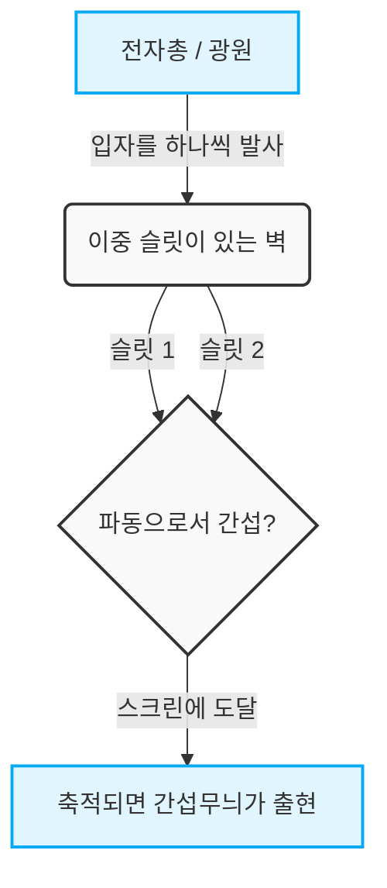
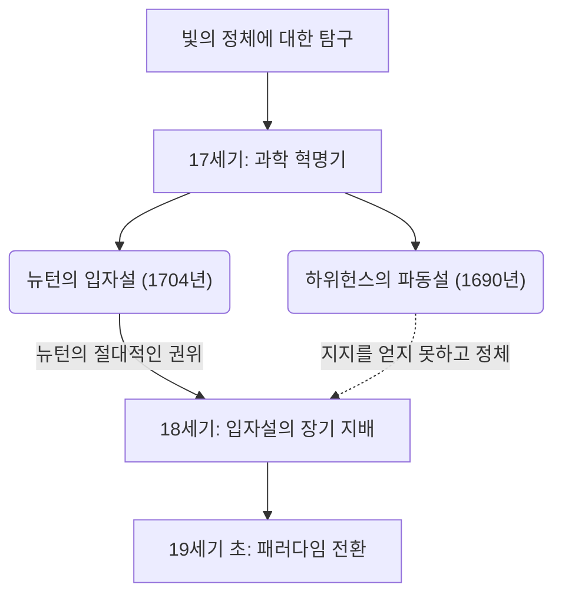
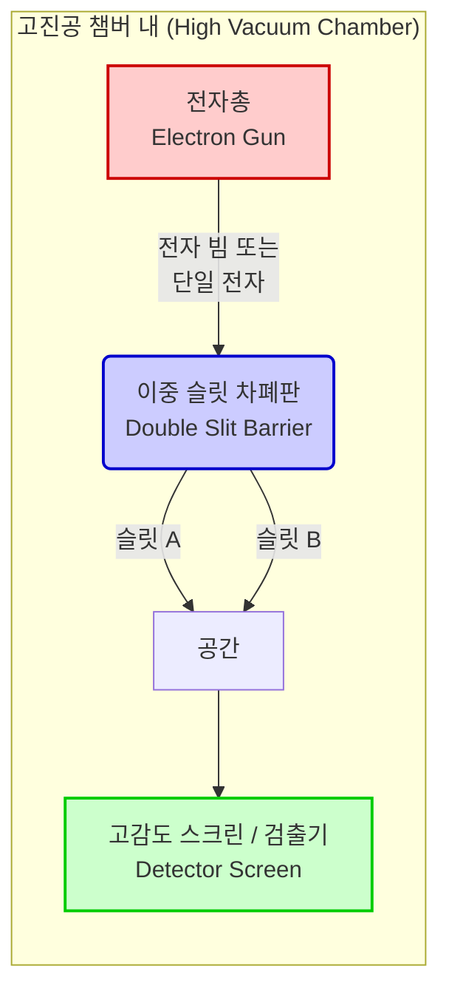

---
title: '【완전 망라】 양자역학 최대의 수수께끼 ''이중 슬릿 실험'' 알기 쉬운 철저 해설'
slug: "double-slit-experiment-ultimate-guide"
date: "2026-09-08T01:00:00+09:00"
tags: ["물리학", "양자역학", "이중 슬릿 실험", "슈뢰딩거 방정식"]
categories: ["물리·과학"]
math: true
mermaid: true
image: "cover.webp"
description: '물리학 역사상 가장 아름다운 실험으로 불리는 ''이중 슬릿 실험''에 대해 철저하게 해설합니다. 거시 세계의 상식이 통하지 않는 미시 세계의 특이성이나 양자역학의 심오한 미스터리에 대해 초보자도 알기 쉽게 정리했습니다.'
---
## 1. 【도입】 이중 슬릿 실험이란 무엇인가?

우리가 살아가는 이 세계는 확고한 규칙에 의해 지배되는 것처럼 보입니다. 위로 던져 올린 공은 포물선을 그리며 떨어지고, 수면에 돌을 던지면 파문이 퍼져나갑니다. 이것들은 뉴턴 역학을 비롯한 고전 물리학이 기술하는 '거시적인 세계'의 상식이며, 우리의 직관과 완전히 일치합니다. 하지만 물질을 구성하는 궁극적인 최소 단위인 원자나 전자, 혹은 빛의 입자(광자)와 같은 '미시적인 세계'에 발을 들여놓는 순간, 그 상식은 소리를 내며 무너져 내립니다. 그곳은 우리의 일상적인 감각이나 직관이 전혀 통용되지 않는, 극히 기묘하고 불가해한 규칙이 지배하는 영역인 것입니다.

이 미시적 세계의 이상성을 가장 단순하면서도 충격적인 형태로 우리에게 들이미는 것이 바로 '이중 슬릿 실험(Double-slit experiment)'입니다. 20세기를 대표하는 천재 물리학자 리처드 파인만은 이 실험에 대해 "양자역학의 유일한 수수께끼이다"라고 말했으며, 나아가 "이 실험 속에 양자역학의 모든 미스터리가 담겨 있다"라고 평가했습니다. 또한 수많은 저명한 물리학자들이 이 실험을 '물리학 역사상 가장 아름다운 실험'이라고 부르기를 주저하지 않습니다. 그렇다면 왜 판자 하나에 두 개의 틈(슬릿)을 낸 것뿐인 지극히 단순한 실험이 그토록 특별하게 여겨지며, 계속해서 과학자들을 매료시키는 것일까요?

### 직관에 반하는 거시적 세계와 미시적 세계

먼저 우리의 직관이 정확하게 기능하는 거시적인 세계에서의 현상을 상상해 봅시다.
예를 들어, 벽을 향해 페인트를 칠한 작은 공(혹은 기관총 총알이라도 상관없습니다)을 차례로 발사하는 기계가 있다고 가정해 보겠습니다. 그 앞에는 세로로 긴 좁은 슬릿(틈)이 나란히 두 개 뚫린 철판이 놓여 있습니다. 공을 무작위로 발사하면 둘 중 하나의 슬릿을 통과한 공만이 안쪽 벽에 부딪혀 잉크 자국을 남깁니다. 그 결과 벽에는 앞쪽의 두 슬릿과 똑같은 형태를 한 '두 개의 세로선' 자국이 떠오르게 될 것입니다. 이것은 공이 명확한 궤도를 지닌 '입자'로서의 움직임이며, 누구나 직관적으로 예상할 수 있는 당연한 결과입니다.

다음으로 '파동'의 경우를 생각해 봅시다. 수조 안에 두 개의 슬릿이 있는 칸막이를 놓고 한쪽에서 파동을 일으킵니다. 파동은 두 슬릿에 도달하면 그곳을 통과하고, 각각의 슬릿을 새로운 파원으로 삼아 두 개의 반원 모양 파동이 되어 안쪽으로 퍼져나갑니다. 그리고 이 두 파동이 서로 부딪히면 '간섭(interference)'이라고 불리는 현상이 일어납니다. 파동의 마루와 마루가 겹치는 곳은 더 높은 파동이 되고, 마루와 골이 겹치는 곳은 서로 상쇄되어 평탄해집니다. 그 결과 안쪽 벽(혹은 물가)에는 파동이 강하게 부딪히는 곳과 전혀 부딪히지 않는 곳이 번갈아 나타나는 '간섭무늬(interference pattern)'라고 불리는 아름다운 줄무늬가 형성됩니다. 이 또한 수면이나 음파 등에서 일상적으로 관찰할 수 있는 파동의 기본적인 성질입니다.

여기까지는 전혀 이상할 것이 없습니다. 입자를 던지면 '두 개의 선'을 만들고, 파동을 보내면 '간섭무늬'를 만든다. 이것이 우리가 사는 세계의 상식이며, 고전 물리학의 전제입니다.

### 실험의 개요와 '가장 아름다운 실험'이라 불리는 이유

하지만 빛이나 전자와 같은 미시적 존재를 사용하여 완전히 동일한 구조의 실험을 진행하면 사태는 급변하고, 인간의 직관은 완전히 배신당하게 됩니다.
역사를 되돌아보면, 1801년 영국의 물리학자 토머스 영(Thomas Young)은 태양광을 사용하여 이 이중 슬릿 실험을 처음으로 수행했습니다(영의 실험). 당시에 빛은 뉴턴이 제창한 '입자'라는 설이 유력했지만, 영의 실험 결과 스크린에는 아름다운 '간섭무늬'가 나타났습니다. 이로써 '빛은 파동이다'라는 결정적인 증거가 제시되었고, 오랫동안 이어진 논쟁에 일단은 결론이 난 것처럼 보였습니다.

진정한 미스터리, 그리고 물리학상 최대의 패러다임 전환은 여기서부터 시작됩니다. 20세기에 접어들어 실험 기술이 경이적으로 진보하면서, 빛이나 전자를 '하나씩' 발사하는 것이 가능해졌습니다. 전자는 질량을 지니고 공간의 특정 위치를 차지하는, 틀림없이 명확한 '입자'입니다. 전자총에서 전자를 단 하나만 발사하여, 이중 슬릿을 통과해 스크린 어딘가에 점 하나(휘점)로 도달하게 만듭니다. 이 시점에서는 스크린에 부딪힌 흔적을 보건대, 전자는 틀림없이 입자로서 행동하고 있습니다.
그리고 이 '전자를 하나씩 발사하는' 과정을 수천 번, 수만 번이라는 아득해질 정도로 엄청난 횟수로 반복합니다. 전자는 항상 한 번에 하나씩만 날아가고 있으므로, 공중에서 다른 전자와 부딪혀 파동처럼 간섭을 일으키는 일 등은 물리적으로 있을 수 없습니다. 당연히 스크린에는 공을 던졌을 때와 마찬가지로 슬릿의 형태에 대응하는 '두 개의 선'이 나타날 것이라고 누구나 생각했습니다.

그러나 무수한 전자의 점들이 스크린에 축적되어 감에 따라, 그곳에 떠오른 것은 믿기 힘든 무늬였습니다. 그것은 파동이 서로 부딪혔을 때만 나타나야 할 '간섭무늬'였던 것입니다.

하나씩 쏘아 올려졌을 '입자'인 전자가, 어째서인지 전체적으로는 '파동'처럼 행동하여 스스로와 간섭하며 줄무늬를 그려낸다. 이것은 대체 어떻게 된 일일까요? 마치 발사된 단 하나의 전자가 파동처럼 공간으로 퍼져나가며, 동시에 두 개의 슬릿을 통과해 자기 간섭을 일으키고, 스크린에 부딪히는 순간에 다시 하나의 입자로서 모습을 드러낸 것만 같습니다.
더욱 기묘하게도, 과학자들이 '전자가 어느 슬릿을 통과했는가'를 확인하고자 슬릿 옆에 관측기(카메라 같은 것)를 설치한 순간, 전자는 갑자기 파동으로서의 성질을 잃고 스크린에는 간섭무늬가 아닌 단순한 '두 개의 선'이 나타나게 됩니다. '관측당하고 있으면' 행동을 바꾼다는 이 현상은 물리학자들을 더 깊은 혼란의 소용돌이로 몰아넣었습니다.

이중 슬릿 실험이 '물리학에서 가장 아름다운 실험'이라고 불리는 가장 큰 이유는, 대규모의 가속기나 극히 난해한 수식을 사용하지 않고도, 단 두 개의 틈과 스크린이라는 지극히 단순하고 우아한 설정만으로 우주의 근원적인 수수께끼를 선명하게 드러내기 때문입니다. 거시적 세계의 상식이 보기 좋게 붕괴되는 순간을 시각적으로 생생하게 보여줍니다. 그것은 단순한 물리 현상의 확인에 그치지 않고, '실재란 무엇인가', '우리가 "보고 있는" 이 세계는 정말로 객관적으로 존재하고 있는 것인가'라는, 지극히 깊은 철학적・인식론적 질문을 우리에게 계속해서 던지고 있습니다. 이 단 하나의 단순한 실험 속에 인간 지성의 한계와, 그것을 뛰어넘으려는 과학의 무한한 낭만이 응축되어 있는 것입니다.
## 2. 【역사】 빛은 파동인가, 입자인가? 끝나지 않는 논쟁의 궤적

인류가 '빛'이라는 존재를 인식한 이래, 그 정체에 대한 탐구는 끊이지 않았습니다. 고대 그리스 시대부터 엠페도클레스나 유클리드 같은 철학자·수학자들이 빛과 시각의 메커니즘에 대해 고찰해 왔지만, 근대 과학으로서의 본격적인 접근이 시작된 것은 17세기에 이르러서였습니다. 이 시대에 막을 올린 "빛은 입자인가, 아니면 파동인가"라는 논쟁은 그 후 300년 이상 물리학계를 양분했으며, 마침내 양자역학이라는 완전히 새로운 물리학의 문을 여는 원동력이 되었습니다. 본 절에서는 이 장대한 과학사의 궤적을 상세히 더듬어 봅니다.

### 2.1 뉴턴의 입자설 vs 하위헌스의 파동설: 17세기의 격돌

17세기 후반, 과학 혁명의 한가운데에서 빛의 정체를 둘러싼 두 가지 강력한 이론이 제시되었습니다. 그것이 바로 아이작 뉴턴(Isaac Newton)의 '입자설(미립자설: Corpuscular theory)'과 크리스티안 하위헌스(Christiaan Huygens)의 '파동설(Wave theory)'입니다.

#### 뉴턴의 입자설
만유인력의 법칙 등으로 알려진 근대 물리학의 거성 아이작 뉴턴은 빛이 극히 작은 알갱이(미립자)들의 모임이라고 생각했습니다. 뉴턴은 1672년의 논문이나 1704년의 주저 『광학(Opticks)』에서 빛이 직진하는 성질이나 거울에서의 반사 법칙을, 입자가 벽에 튕겨 나오는 역학적인 모델로 선명하게 설명했습니다. 또한 프리즘에 의해 백색광이 일곱 색깔로 나뉘는 현상(분광)에 대해서도, 색이 다른 빛은 질량이 다른 입자이며 매질을 통과할 때의 굴절률이 다르기 때문이라고 주장했습니다.
뉴턴은 파동설에 대해 "만약 빛이 소리와 같은 파동이라면 장애물 뒤쪽으로 돌아 들어가야 하지만(회절 현상), 빛은 직진하여 명확한 그림자를 만든다"라는 점을 지적하며 파동임을 부정했습니다.

#### 하위헌스의 파동설
반면에 네덜란드의 탁월한 물리학자 크리스티안 하위헌스는 1690년에 발표한 『빛에 관한 논고(Treatise on Light)』에서, 빛은 '에테르(aether)'라고 불리는 우주 공간을 가득 채운 탄성 매질 속을 전파하는 파동(종파)이라고 주장했습니다. 하위헌스는 "파면상의 모든 점은 새로운 2차파의 파원이 된다"라는 유명한 '하위헌스의 원리(Huygens' Principle)'를 제창하여, 빛의 직진, 반사, 그리고 굴절의 법칙을 훌륭하게 기하학적으로 설명했습니다.
특히 굴절과 관련하여, 뉴턴은 "빛이 물이나 유리 같은 밀도가 높은 매질에 들어가면, 입자가 인력을 받아 가속되므로 광속이 빨라진다"고 예언했지만, 하위헌스의 파동설에서는 "밀도가 높은 매질에서는 파동이 전파되는 속도가 느려진다"고 결론지으며 양측은 정면으로 대립했습니다.

그러나 당시 과학계에서 뉴턴의 절대적인 권위와 영향력으로 인해 하위헌스의 파동설은 점차 자취를 감추게 되었고, 18세기 내내 뉴턴의 입자설이 주류로 군림하게 됩니다.

## 2.2 토머스 영의 빛의 이중 슬릿 실험(1801년)과 파동설의 승리

19세기에 접어들면서, 오랫동안 지배적이었던 입자설의 아성을 무너뜨리는 결정적인 사건이 일어납니다. 그 주역이 된 인물은 영국의 박식가 토머스 영(Thomas Young)입니다. 의사이자 이집트 상형문자 해독(로제타 스톤)에도 공헌한 영은, 1801년 물리학 역사에 찬란히 빛나는 실험을 수행했습니다. 그것이 '영의 간섭 실험(훗날의 이중 슬릿 실험)'입니다.

#### 간섭무늬의 발견
영의 실험 세팅은 지극히 단순하면서도 교묘했습니다. 그는 태양광을 아주 미세한 핀홀(또는 슬릿)에 통과시켜 점광원을 만들고, 그 빛을 다시 서로 아주 가까운 거리에 있는 두 개의 좁은 슬릿(이중 슬릿)을 통과시켜 뒤쪽 스크린에 투영했습니다.
만약 빛이 뉴턴이 말한 것과 같은 순수한 '입자'라면, 스크린에는 슬릿 모양에 해당하는 두 개의 밝은 선이 비쳐야 합니다. 그러나 영이 스크린에서 본 것은 밝은 무늬와 어두운 무늬가 번갈아 늘어선 줄무늬, 즉 '간섭무늬(Interference fringes)'였습니다.

이 현상은 빛이 파동이라고 생각하지 않으면 도저히 설명할 수 없는 것이었습니다. 수면에서 두 파동이 부딪힐 때, 파동의 마루와 마루가 겹치는 곳은 더 높아지고(보강 간섭), 마루와 골이 겹치는 곳은 서로 상쇄되어 평평해지는(상쇄 간섭) 현상이 일어납니다. 영은 두 슬릿에서 나온 빛의 파동이 이와 똑같이 간섭을 일으키고 있다고 결론지었습니다.

#### 수학적 뒷받침과 파동설의 확립
이 보강 간섭과 상쇄 간섭의 조건은 두 슬릿에서 스크린 위 점까지의 경로 길이 차이(광경로차 $\Delta L$)에 의해 결정됩니다. 슬릿의 간격을 $d$, 스크린을 향한 각도를 $\theta$, 빛의 파장을 $\lambda$ 라고 하면, 광경로차는 다음과 같이 표현됩니다.

$$ \Delta L = d \sin \theta $$

* **밝은 선(보강 간섭 조건)**: $\Delta L = m\lambda \quad (m = 0, \pm1, \pm2, \dots)$
* **어두운 선(상쇄 간섭 조건)**: $\Delta L = \left(m + \frac{1}{2}\right)\lambda$

영의 이 발표는 애초 영국 국내에서 뉴턴 신봉자들로부터 맹렬한 비판과 조롱을 받았습니다. 하지만 이후 1815년에 프랑스의 오귀스탱 장 프레넬(Augustin-Jean Fresnel)이 빛의 회절과 간섭을 엄밀한 수학적 이론으로 구축했습니다. 나아가 1818년 프랑스 과학 아카데미 콩쿠르에서 심사위원인 시메옹 드니 푸아송(파동설 반대파)이 "프레넬의 이론이 맞다면, 원형 장애물 그림자 중심에 밝은 반점이 생겨야 한다. 그런 말도 안 되는 일은 있을 수 없다"고 지적했습니다. 그러나 실제로 실험을 수행한 도미니크 프랑수아 장 아라고가 그 '푸아송의 반점(아라고의 반점)'을 완벽하게 관측해 내면서, 파동설의 정당성은 의심할 여지가 없는 것이 되었습니다.

1850년에는 레옹 푸코 등이 물속에서의 빛의 속도가 공기 중보다 느리다는 것을 실험으로 증명하여 뉴턴의 예측은 완전히 부정되었습니다. 그리고 1864년 제임스 클러크 맥스웰이 전자기학의 집대성으로서 '빛은 전자기파의 일종이다'라는 이론을 확립하면서, 비로소 빛의 '파동설'은 완전한 승리를 거두었고 논쟁은 결말이 난 것처럼 보였습니다.

### 2.3 아인슈타인의 광양자 가설(1905년)에 의한 입자설의 부활

빛이 전자기파라는 맥스웰의 이론은 너무나도 아름다워서, 19세기 말의 물리학자들은 "물리학은 거의 완성되었고, 이제 세밀한 수치만 측정하면 된다"고 믿었습니다. 그러나 19세기 말부터 20세기 초에 걸쳐, 파동설로는 도저히 설명할 수 없는 기묘한 현상이 앞을 가로막습니다. 그것이 바로 '광전 효과(Photoelectric effect)'입니다.

#### 광전 효과의 수수께끼
광전 효과란 금속 표면에 빛을 비추면 금속에서 전자(광전자)가 튀어나오는 현상입니다. 당시 파동설의 상식에 따르면, 빛(파동)의 에너지는 그 진폭(밝기)에 비례해야 했습니다. 따라서 "강한(밝은) 빛을 비추면, 어떤 색의 빛이든 전자가 힘차게 튀어나와야 한다"고 생각했습니다.
하지만 실험 결과는 파동설의 예측을 완전히 빗나갔습니다.

1. **한계 진동수의 존재**: 어떤 특정 진동수(색)보다 낮은 빛(예를 들어 붉은빛)은 아무리 강하게(밝게) 비추어도, 아무리 오랫동안 비추어도 전자가 전혀 튀어나오지 않았습니다.
2. **즉시성**: 반대로 한계 진동수보다 높은 빛(예를 들어 자외선)이라면, 아무리 미약한 빛이라도 비추는 순간 즉시 전자가 튀어나왔습니다.
3. **에너지의 의존성**: 튀어나온 전자의 운동 에너지는 빛의 세기(밝기)가 아니라 오직 빛의 진동수(색)에만 의존했습니다.

#### 아인슈타인의 극적인 해결책: 광양자(광자, Photon)
이 절망적인 수수께끼를 풀어낸 사람은 스위스 특허국에서 일하던 무명의 청년, 알베르트 아인슈타인(Albert Einstein)이었습니다. '기적의 해'라 불리는 1905년, 그는 막스 플랑크가 열복사 연구(1900년)에서 제창한 '에너지 양자 가설'을 빛 자체에 적용하여 '광양자 가설(Light quantum hypothesis)'을 발표했습니다.

아인슈타인은 연속적인 파동이라고 여겨졌던 빛을 에너지의 덩어리, 즉 '광양자(광자: Photon)'라는 입자의 무리라고 대담하게 가정했습니다. 하나의 광양자가 갖는 에너지 $E$ 는 빛의 진동수 $\nu$ 에 비례하며, 다음의 플랑크-아인슈타인 공식으로 표현됩니다.

$$ E = h\nu $$

(여기서 $h$ 는 플랑크 상수, $6.626 \times 10^{-34} \, \text{J}\cdot\text{s}$)

이 가설을 이용하면 광전 효과의 수수께끼는 마치 마법처럼 풀렸습니다.
광전 효과란 '하나의 광양자'가 금속 안의 '하나의 전자'와 충돌하여 그 에너지를 고스란히 전달하는 당구와 같은 현상이었던 것입니다. 전자가 금속의 속박을 뿌리치기 위해 필요한 최소한의 에너지를 '일함수( $W$ )'라고 하면, 튀어나온 전자의 최대 운동 에너지 $E_k$ 는 다음의 훌륭한 방정식으로 표현됩니다.

$$ E_k = h\nu - W $$

만약 광양자의 에너지 $h\nu$ 가 일함수 $W$ 보다 작다면(저진동수의 빛), 아무리 많은 광양자를 부딪쳐도(빛을 강하게 해도) 전자는 금속에서 튀어나올 수 없습니다. 이것이 한계 진동수가 존재하는 이유입니다.

#### '파동이며, 입자이다'라는 불가해한 세계로
아인슈타인의 광양자 가설은 1914년 로버트 밀리컨의 정밀한 실험으로 완전히 증명되었고, 아인슈타인은 이 공로로 1921년 노벨 물리학상을 수상합니다. (밀리컨 자신은 애초 아인슈타인의 이론을 믿지 않았고 이를 반증하려 실험을 했음에도 불구하고, 아이러니하게도 그 정당성을 증명하는 결과가 되고 말았습니다). 게다가 1923년에는 아서 콤프턴이 X선이 전자와 충돌할 때 파장이 변하는 '콤프턴 산란'을 발견하면서, 빛이 운동량 $p = \frac{h}{\lambda}$ 를 갖는 '입자'로 행동한다는 것이 확실해졌습니다.

영의 실험으로 완전히 패배했던 '입자설'이 100년의 세월을 지나 더 세련된 '양자'라는 형태로 기적적인 부활을 이룬 것입니다.
하지만 이는 심각한 모순을 낳았습니다. 빛은 영의 이중 슬릿 실험에서 보여준 '간섭'이라는 분명한 파동의 성질을 가지면서도, 광전 효과에서 보여준 '입자'로서의 성질 또한 함께 가지고 있는 셈이 됩니다.

빛은 파동인가, 아니면 입자인가?
이 질문에 대한 물리학의 최종적인 대답은 "빛은 그 둘 다이며, 둘 다 아니다. 빛은 '파동의 성질'과 '입자의 성질'을 함께 가지는 양자적 실체이다"라는, 인간의 직관에 몹시 반하는 것이었습니다. 이것이 '파동과 입자의 이중성(Wave-particle duality)'의 탄생입니다.
그리고 이 이중성의 개념은 빛에 그치지 않고 전자 등 물질 자체에도 적용되기에 이르러(드브로이의 물질파), 물리학은 전례 없는 심연, '양자역학'이라는 기묘하고 매혹적인 세계로 발을 들여놓게 됩니다. 그 가장 상징적인 무대가 되는 것이 바로 현대판으로 업데이트된 '양자역학적 이중 슬릿 실험'입니다.
## 3. 【전환】물질도 파동인가? 드브로이파와 전자의 이중 슬릿 실험

빛이 '파동이면서 동시에 입자이다'라는 아인슈타인의 광양자 가설(1905년)로 인해, 물리학계는 큰 혼란과 패러다임 전환의 소용돌이 속에 있었습니다. 오랫동안 영의 간섭 실험이나 맥스웰의 전자기학에 의해 "빛은 절대적으로 파동이다"라고 믿어져 왔음에도 불구하고, 광전 효과 등의 현상은 빛을 '알갱이(광자)'로 생각하지 않으면 설명할 수 없었기 때문입니다. 이 '파동과 입자의 이중성'이라는 기묘한 성질은 애초에 빛만이 가지는 특이한 성질이라고 여겨졌습니다. 그러나 1920년대에 들어서면 이 이중성의 개념은 빛의 세계에 머물지 않고 우리 몸을 구성하는 '물질' 자체를 향해 이빨을 드러내게 됩니다.

### 3.1. 루이 드브로이의 물질파 제창: 아름다운 대칭성으로부터의 도약

1924년, 프랑스의 젊은 대학원생이었던 루이 드브로이(Louis de Broglie)는 자신의 박사 논문에서 물리학의 역사를 근본부터 뒤엎는 지극히 대담한 가설을 제창했습니다. 그것은 "빛(파동으로 여겨졌던 것)이 입자로서의 성질을 가진다면, 반대로 전자 등 물질(입자로 여겨졌던 것) 또한 파동으로서의 성질을 가지지 않을까?"라는 것이었습니다.

자연계는 항상 대칭성을 선호한다는 드브로이의 철학적인 직관이 이 가설의 밑바탕에 있었습니다. 그는 아인슈타인이 특수 상대성 이론과 광양자 가설에서 도출해 낸 에너지와 운동량의 관계식을 질량을 가진 물질 입자에도 적용해 보인 것입니다. 광자의 운동량 $p$ 는 플랑크 상수 $h$ 와 파장 $\lambda$ 를 이용하여 $p = h / \lambda$ 로 표현됩니다. 드브로이는 이를 뒤집어, 질량 $m$ 을 갖고 속도 $v$ 로 운동하는 입자(운동량 $p = mv$)에 수반되는 파동의 파장 $\lambda$ 를 다음과 같이 매우 단순한 수식으로 표현했습니다.

$$ \lambda = \frac{h}{p} = \frac{h}{mv} $$

이것이 유명한 '드브로이 파장(물질파의 파장)' 공식입니다. 이 수식은 우리가 일상적으로 보는 야구공이나 자동차부터 미세한 전자에 이르기까지, 움직이는 것은 모두 '파동'으로서의 성질을 띠고 있음을 의미합니다. 그렇다면 왜 우리는 일상생활에서 야구공이 파동처럼 간섭하거나 회절하는 것을 보지 못하는 것일까요? 그것은 플랑크 상수 $h$ (약 $6.626 \times 10^{-34} \text{ J}\cdot\text{s}$)가 극히 작기 때문입니다. 거시적인 물체에서는 질량 $m$ 이 너무 크기 때문에, 드브로이 파장 $\lambda$ 는 사실상 0으로 간주할 수 있을 만큼 작아져 파동성이 완전히 숨겨집니다. 그러나 질량이 지극히 작은 전자의 세계에서는 이 파장이 X선(전자기파)의 파장과 동등한 스케일(약 $0.1 \text{ nm}$ 등)이 되어 결코 무시할 수 없는 크기로 나타나게 되는 것입니다.

드브로이의 이 논문은 너무나도 상식을 벗어난 것이었기에 당시 심사위원들을 크게 당혹시켰습니다. 그러나 심사위원 중 한 명이었던 폴 랑주뱅이 이 논문을 아인슈타인에게 보냈고, 아인슈타인은 "그는 거대한 베일의 한 모서리를 들어 올렸다"고 극찬했습니다. 이로써 드브로이의 '물질파(matter wave)' 개념은 세계적인 주목을 받게 되었고, 훗날 슈뢰딩거에 의한 파동역학의 완성으로 직결됩니다.

### 3.2. 데이비슨-거머 실험: 물질의 파동성 증명

드브로이의 가설은 이론으로서는 아름다웠지만, 그것이 현실의 자연계를 기술하고 있는지 여부는 실험에 의한 증명을 기다려야 했습니다. "전자가 정말 파동이라면, 파동 특유의 현상인 '회절'이나 '간섭'을 일으켜야 한다." 이 신념 아래 전 세계의 물리학자들이 전자의 파동성을 포착하고자 실험을 시작했습니다.

그리고 1927년, 마침내 결정적인 증거가 제시되었습니다. 미국 벨 연구소의 물리학자 클린턴 데이비슨(Clinton Davisson)과 레스터 거머(Lester Germer)가 수행한 '데이비슨-거머 실험'입니다.

그들은 애초 니켈 결정에 전자선을 쏘아 그 산란 양상을 조사한다는 다른 목적으로 실험을 하고 있었습니다. 그러나 실험 중 사고(진공관 파손에 의한 니켈 표면 산화)를 수습하기 위해 니켈을 고온으로 가열했는데, 우연히도 니켈이 단결정화되는 행운을 얻게 됩니다. 이 단결정화된 니켈에 다시 전자선을 쏘았을 때, 놀라운 현상이 관측되었습니다. 산란된 전자의 강도가 특정 각도에서 극댓값을 갖는 명확한 '회절 패턴'을 나타낸 것입니다.

결정 안의 원자가 규칙적으로 늘어서 있는 간격(격자 상수)은 전자의 드브로이 파장과 거의 같은 스케일입니다. 즉, 니켈 결정 자체가 전자에게 있어 '자연의 회절 격자'로 기능했던 것입니다. 데이비슨과 거머가 이 회절 패턴으로부터 전자의 파장을 역산한 결과는 드브로이의 식 $\lambda = h/p$ 가 예측하는 값과 훌륭하게 일치했습니다. 같은 해, 영국의 조지 패짓 톰슨(전자 발견자 J.J. 톰슨의 아들) 또한 얇은 금속박을 투과하는 전자선에 의한 회절 링(디바이-셰러 환)을 관측하는 데 성공했습니다.

이러한 실험 결과들은 물질이 파동으로서의 성질을 가진다는 것을 의심할 여지 없는 사실로서 물리학계에 들이밀었습니다. 입자여야 할 전자가 파동으로 행동한다. 이 심연의 자연 진리가 밝혀진 순간이자, 양자역학의 여명을 알리는 팡파르이기도 했습니다. 드브로이는 1929년에, 데이비슨과 톰슨은 1937년에 각각 노벨 물리학상을 수상합니다.

### 3.3. 히타치 제작소(토노무라 아키라 등)에 의한 결정적 이중 슬릿 실험(1989년)

전자가 파동임이 증명된 후에도 물리학자들의 탐구는 멈추지 않았습니다. 사고 실험으로만 이야기되어 온 '전자의 이중 슬릿 실험'을 현실에서, 그것도 극한의 정밀도로 실행하려는 시도였습니다.

빛의 이중 슬릿 실험(영의 실험)과 마찬가지로, 전자를 이중 슬릿을 향해 발사하면 뒤쪽 스크린에는 간섭무늬가 나타나야 합니다. 그러나 여기서 양자역학의 가장 불가해한 역설이 고개를 내밉니다. "만약 전자를 한 번에 대량으로 발사하는 것이 아니라, **1개씩** 발사한다면 어떻게 될까?"

1개의 전자는 분할할 수 없는 입자입니다. 따라서 왼쪽 슬릿이나 오른쪽 슬릿, 둘 중 어느 한쪽만 통과할 수 있어야 합니다. 1개씩 스크린에 도달하는 전자는 스크린 위에 1개의 빛나는 점을 남길 뿐입니다. 이것을 수만 번 반복했을 때 점과 점의 집합은 단순한 두 슬릿의 그림자(두 개의 선)가 될 것인가, 아니면 파동의 성질을 보여주는 간섭무늬가 될 것인가.

이 궁극적인 질문에 대해 기술적 한계를 돌파하고 세계에서 가장 아름답고 완벽한 해답을 제시한 것이 일본 히타치 제작소 기초연구소의 연구팀(토노무라 아키라 박사 등)이었습니다. 1989년 그들은 전자선 홀로그래피 기술과 초고진공 및 극저온 전자현미경 기술을 구사하여 '단일 전자 바이프리즘 간섭 실험'을 훌륭하게 성공시켰습니다.

실험 세팅은 경이로웠습니다. 전자총에서 방출되는 전자의 수를 극한까지 줄여, 전자가 공간을 날아가는 동안에는 항상 '장치 내에 전자가 단 1개만 존재하는' 상태를 만들어낸 것입니다. 전자의 속도는 초속 약 15만 킬로미터에 달하며, 광원에서 검출기까지의 거리를 날아가는 데 걸리는 시간은 아주 순식간입니다. 다음 전자가 발사되는 것은 앞선 전자가 스크린에 도달하고도 한참 뒤가 됩니다.

실험이 시작되자 검출기(모니터)에는 전자가 도달했음을 나타내는 빛나는 점이 하나둘씩 나타나기 시작합니다. 처음 몇 개, 몇백 개 단계에서는 화면 위에 무작위로 점이 흩어져 있는 것으로밖에 보이지 않습니다. 마치 밤하늘의 별처럼 그곳에는 아무런 질서도 없는 듯 여겨졌습니다.

하지만 수천 개, 수만 개의 전자가 축적되어 감에 따라 누구의 눈에도 명백한 경악스러운 광경이 떠올랐습니다. 무질서하게 보이던 점의 무리가 서서히 규칙적인 명암의 줄무늬——틀림없는 '간섭무늬'——를 형성해 나간 것입니다.

이 결과가 의미하는 바는 직관에 격렬하게 반하는 것이었습니다. 전자는 확실히 '1개의 입자'로서 스크린에 도달합니다(그렇기 때문에 1개의 점이 기록된다). 하지만 전체적으로 간섭무늬를 만든다는 것은, 그 1개의 전자가 "스스로 파동이 되어 양쪽 슬릿(바이프리즘 양측)을 동시에 통과하고, 자기 자신과 간섭했다"고밖에 해석할 수 없는 것입니다. 그 누구와도 상호작용하지 않은 단독의 전자가 자기 자신과 간섭을 일으킨다. 디랙이 "광자는 자기 자신과만 간섭한다"고 말했던 것과 같은 원리가, 질량을 가진 물질 입자인 전자에서도 완벽하게 실증된 것입니다.

토노무라 아키라 박사 등의 이 실험은 양자역학의 신비로움, 즉 '파동과 입자의 이중성'을 가장 시각적이자 직접적으로 증명한 것으로서 전 세계의 극찬을 받았습니다. 영국 과학 잡지 『Physics World』가 2002년에 실시한 "물리학 역사상 가장 아름다운 실험" 독자 투표에서 이 '전자의 이중 슬릿 실험'이 당당히 1위로 선정된 것도 당연한 일이라 할 수 있을 것입니다.

이렇게 "물질은 파동이다"라는 드브로이의 엉뚱한 가설은 60년 이상의 세월을 지나 1개의 전자가 그려내는 신비로운 간섭무늬로서 우리 눈앞에 그 진실한 모습을 드러낸 것입니다. 하지만 이 실험은 양자역학의 수수께끼를 풀어냄과 동시에 더 깊은 수수께끼, 즉 '관측 문제'로 향하는 문을 여는 것이기도 했습니다. "어느 슬릿을 통과했는지 보려고 하면 간섭무늬는 사라져 버린다"——다음 장에서는 이 기묘한 양자 세계의 더 깊은 심연으로 발을 들여놓아 봅시다.
## 4. [실험 방법과 결과] 구체적으로 무슨 일이 일어나고 있는가

(이중 슬릿 실험의 핵심에 다가가 양자역학의 심연을 들여다보기 위해, 여기서는 빛이 아닌 '전자'를 사용한 실험에 초점을 맞추어 해설하겠습니다. 광자나 다른 소립자, 나아가 풀러렌과 같은 비교적 큰 분자에서도 동일한 현상이 확인되고 있지만, 질량을 가지고 있어 우리가 '명백한 물질의 입자'라고 인식하고 있는 전자를 사용함으로써 이 현상의 역설과 신비로움이 한층 더 돋보이기 때문입니다.)

### 4.1 실험 장치 셋업: 극미의 세계를 포착하는 무대 장치

먼저, 이 역사적이고 혁신적인 실험이 어떤 장치로 이루어지는지 그 무대 장치(셋업)를 자세히 살펴보겠습니다. 이중 슬릿 실험의 개념적인 구조는 놀라울 정도로 단순하지만, 실제로 그것을 물리적인 실험으로서 성공시키는 이면에는 고도의 기술과 극히 엄밀한 환경 제어가 요구됩니다.

실험 장치는 크게 나누어 다음 세 가지 주요 구성 요소로 이루어져 있습니다. 이들은 모두 공기 분자와의 충돌로 인한 전자의 산란을 방지하기 위해, 고도의 진공 챔버(진공 용기) 안에 엄중하게 밀폐되어 배치됩니다.

1. **전자총(Electron Gun)**:
   실험의 주역인 '전자'를 발사하기 위한 장치입니다. 필라멘트를 가열하여 열전자를 방출시키거나 강한 전기장을 이용하여 전자를 끌어내는 원리를 이용하여, 일정한 운동 에너지를 가진 전자를 정해진 방향으로 발사합니다. 이 실험에서 매우 중요한 것은, 전자를 강력한 '빔'으로서 폭포수처럼 연속적으로 발사할 수도 있고, 놀랍게도 출력을 극한까지 줄여 '확실하게 1개씩' 제어하여 발사하는 것도 가능하다는 점입니다. 이 '단일 전자 발사 기술'은 현대 양자역학 실험에 있어 필수불가결한 정교한 기술 중 하나입니다.

2. **이중 슬릿(Double Slit)**:
   전자총에서 발사된 전자가 통과하기 위한, 매우 가늘고 극히 가까운 거리에 평행하게 뚫린 두 개의 슬릿(틈)을 가진 차폐판(벽)입니다. 전자의 '물질파(드브로이파)' 파장은 매우 짧기 때문에, 이 슬릿의 너비나 슬릿 간의 거리도 나노미터(10억 분의 1미터)에서 마이크로미터 스케일이라는 미세한 크기로 정밀하게 만들어져야 합니다. 만약 슬릿의 너비나 간격이 전자의 파장에 비해 너무 넓으면, 파동으로서의 성질인 '간섭'을 명확하게 관측할 수 없게 됩니다. 이 극소의 이중 슬릿을 제작하는 기술 자체가 최첨단 전자선 묘화 장치 등 미세 가공 기술의 결정체라고 할 수 있습니다.

3. **스크린(검출기, Screen / Detector)**:
   이중 슬릿을 무사히 통과한 전자가 최종적으로 도달하여, 그 위치를 기록하기 위한 관측 스크린입니다. 예전 실험에서는 감광성 사진건판 등이 사용되었지만, 현재는 고감도 CCD 카메라나 형광판, 특수한 반도체 픽셀 검출기 등이 사용됩니다. 이를 통해 전자가 '어디에 도달했는지(히트했는지)'를 1발마다 극히 정확한 2차원 좌표로 기록할 수 있습니다. 전자가 스크린에 충돌하면, 그곳에서 미세한 빛을 방출하거나 전기 신호를 발생시킴으로써 '틀림없이 이곳에 1개의 입자로서 도달했다'는 명확한 흔적(점)을 남깁니다.

아래 그림은 이 실험 장치의 전체적인 배치와 전자의 궤도를 모식적으로 나타낸 것입니다.

### 4.2 대량의 전자를 쏘았을 경우: 직관을 배신하는 파동으로서의 움직임 (간섭 무늬의 형성)

자, 드디어 실험을 시작합니다. 먼저 첫 번째 단계로 전자총의 출력을 높여 '대량의 전자'를 마치 샤워기나 기관총처럼 연속해서 이중 슬릿을 향해 일제히 발사합니다.

우리가 일상적으로 가지고 있는 고전물리학적인 상식으로 생각하면, 전자는 질량을 가진 '입자(작은 총알 같은 것)'입니다. 따라서 두 개의 슬릿을 통과한 다수의 전자는 각 슬릿의 직진 방향 연장선상에 있는 스크린 위 두 곳에 집중적으로 충돌하여, 결과적으로 '2개의 세로줄'과 같은 패턴을 형성할 것이라고 예상할 수 있습니다. 페인트 스프레이를 두 개의 틈이 뚫린 스텐실 판에 뿌리는 모습을 상상해 보십시오. 틈을 통과한 페인트는 그 틈의 모양대로 벽에 두 개의 선을 그릴 것입니다.

하지만 실제로 스크린에 나타나는 무늬는 우리의 직관과 예측을 완전히 배신하는 것입니다. 스크린 위에는 2개의 단순한 세로줄이 아니라, **여러 개의 명암 줄무늬(간섭 무늬: Interference Pattern)** 가 선명하게 형성됩니다.

이 '간섭 무늬'는 연못 수면에 두 개의 돌을 동시에 던졌을 때 생기는 파문이 겹쳐져 만들어지는 패턴이나, 빛의 간섭 실험에서 볼 수 있는 패턴과 완전히 동일한 기하학적 특징을 가지고 있습니다.
- **파동의 마루와 마루, 혹은 골과 골이 겹치는 곳(보강 간섭)** 에서는 전자가 많이 도달하는 '밝은(전자의 충돌 밀도가 높은)' 줄무늬가 됩니다.
- **파동의 마루와 골이 겹치는 곳(상쇄 간섭)** 에서는 파동이 서로를 상쇄하여 전자가 거의 도달하지 않는 '어두운(전자의 충돌 밀도가 0에 가까운)' 줄무늬가 됩니다.

이 결과가 의미하는 결론은 단 하나밖에 없습니다. 그것은 **'전자는 파동으로서 행동하고 있다'** 는 것입니다. 전자총에서 발사된 전자 무리는 공간을 수면파처럼 퍼져나가, 두 개의 슬릿을 '동시에' 통과하고 있습니다. 그리고 슬릿 A에서 회절하여 퍼진 파동과 슬릿 B에서 회절하여 퍼진 파동이 스크린 앞의 공간에서 겹쳐져 간섭을 일으킴으로써, 그 특징적인 명암의 줄무늬를 만들어내고 있다고밖에 해석할 수 없습니다.

'입자'라고 굳게 믿어졌던 전자가 사실은 '파동'으로서의 성질도 함께 가지고 있다는 것(파동과 입자의 이중성). 이 사실만으로도 물리학에 있어서 역사적인 대발견이며 충분히 놀라운 일이지만, 양자역학의 진정한 미스터리, 그리고 우리의 상식을 근본부터 뒤엎는 현상은 여기서부터 한 단계 더 깊어집니다.

### 4.3 전자를 '1개씩' 발사했을 경우: 극한의 실험이 폭로하는 '확률파'의 정체

"대량으로 전자를 동시에 쏘니까 전자들끼리 공중에서 충돌하거나 전기적인 힘(쿨롱 힘)으로 서로 반발하여, 결과적으로 파동 같은 무늬를 만들고 있는 것일 뿐이지 않을까?"
이렇게 생각하는 것은 과학자로서 매우 자연스러운 의문입니다. 실제로 간섭 무늬가 발견된 초기에는 많은 물리학자들이 그렇게 생각하고 현상을 고전적으로 해석하려고 시도했습니다.

이 의문에 완전히 결착을 짓기 위해 실험 기술을 진보시켜 더욱 결정적인 실험이 이루어졌습니다. (일본에서는 1989년 히타치 제작소의 토노무라 아키라 씨 등의 그룹이 진행한 실험이 매우 유명하며, 세계에서 가장 아름다운 실험 중 하나로 찬사를 받고 있습니다.)
그것이 바로 **전자총의 출력을 극한까지 줄여, 전자를 '확실하게 1개씩' 발사하는** 실험입니다.

구체적으로는, 앞의 전자가 발사되어 스크린에 도달해 완전히 소멸했음(혹은 흡수되었음)을 확인한 후 다음의 새로운 전자를 발사합니다. 이것을 수만 번, 수십만 번이라는 엄청난 횟수만큼 반복하는 것입니다. 이 설정에서 실험 장치 내 공간에는 '항상 1개의 전자만 존재한다'는 것이 보장됩니다. 따라서 전자끼리 공중에서 부딪히거나 서로 간섭하는 일은 물리적으로 100% 있을 수 없습니다.

이 극한 상태에서의 단일 전자에 의한 실험 결과를, 시간의 경과(전자의 축적 수)와 함께 따라가 보겠습니다.

**1단계: 실험 시작 직후(수십~수백 개의 전자)**
스크린에는 드문드문, 전혀 무작위인 위치에 점이 찍혀 나갑니다. 전자는 스크린에 도달하는 순간에는 분명히 '1개의 입자'로서의 성질을 보이며, 특정 미세한 좌표에 하나의 점(도트)을 기록합니다. 이 시점에서는 스크린 무늬에 어떤 규칙성도 찾아볼 수 없으며, 그저 무질서하고 무작위적인 점들의 집합으로밖에 보이지 않습니다. 마치 눈을 가리고 적당히 다트를 던지고 있는 것과 같습니다.

**2단계: 수천 개~수만 개의 전자가 도달한 후**
시간이 경과하고 실험이 반복되어 스크린 위에 수천에서 수만 개의 점이 축적되면, 기묘한 현상이 일어나기 시작합니다. 완전히 무작위라고 생각했던 점의 분포 속에 서서히 '치우침'이나 '농담'이 보이기 시작하는 것입니다. 점이 밀집해서 많이 찍히는 영역과, 점이 거의 찍히지 않는 영역이 희미하게 나뉘기 시작합니다.

**3단계: 실험 종료 시(수십만 개 이상의 전자가 도달)**
충분히 긴 시간을 들여 방대한 수(수십만에서 수백만 개)의 전자를 1개씩, 아득해질 것 같은 작업으로 계속 쏘고 난 후 스크린 전체의 축적 이미지를 보면…… 그곳에는 대량의 전자를 한꺼번에 발사했을 때와 완전히 동일한, 멋진 **'간섭 무늬'** 가 선명하게 떠올라 있는 것입니다!

이것은 물리학 역사상 가장 등골이 오싹하고 직관에 반하지만, 가장 아름답고 심오한 결과 중 하나입니다.

왜냐하면, 전자는 '완전히 1개씩' 발사되었기 때문입니다. 앞뒤의 전자와 상호작용하는 것은 절대 불가능합니다. 그럼에도 불구하고 최종적으로 파동의 간섭을 나타내는 줄무늬가 생긴다는 것은, **'1개의 전자가 자기 자신과 간섭하고 있다'** 는 믿기 힘든 결론을 받아들일 수밖에 없습니다.

이 현상을 논리적으로 설명하려고 하면, 우리의 일상적인 공간·물질 감각은 완전히 붕괴됩니다.
1개의 전자는 전자총에서 발사된 후, 마치 '파동'처럼 공간 전체로 퍼져나가 **오른쪽 슬릿과 왼쪽 슬릿 모두를 '동시에' 통과하고**, 스크린 앞에서 '자기 자신의 파동'과 서로 간섭하며, 그리고 스크린에 도달하여 관측되는 순간 다시 '1개의 입자'로서 어느 한 점으로 수축(결정)하는 것입니다.

그렇다면, 이 1개의 전자가 공간을 퍼져나가는 '파동'의 실체는 대체 무엇일까요?
양자역학에서 이것은 수면이나 공기와 같은 물리적인 매질이 물결치는 실체적인 파동이 아닙니다. 막스 보른에 의해 제창된 해석에 따르면, 이것은 **'전자가 그 공간의 특정 장소에 존재할 "확률"을 나타내는 파동(확률파)'** 인 것입니다. 수학적으로는 이것을 '파동 함수'라고 부릅니다.

전자는 파칭코 구슬처럼 특정 궤도(경로)를 일직선으로 날아가는 것이 아닙니다. 발사된 후 스크린에 도달할 때까지의 시간 동안, 전자는 '오른쪽 슬릿을 통과한 상태'와 '왼쪽 슬릿을 통과한 상태', 나아가 '공간의 모든 경로를 통과하는 상태'가 다양한 확률로 '겹쳐진 상태(중첩 상태)'로서 공간을 퍼져나갑니다.

그리고 스크린이라는 관측기에 부딪혀 '어디에 도달했는가'가 측정되는 순간, 공간에 퍼져 있던 확률파는 순식간에 한 점으로 수축하여(파동 함수의 수축), 비로소 '여기에 있었다'는 현실의 입자 위치가 확정되는 것입니다.

간섭 무늬의 '밝은 부분(최종적으로 점이 많이 모이는 부분)'은 전자가 존재할 확률이 파동의 간섭에 의해 높아진 장소이며, '어두운 부분(점이 모이지 않는 부분)'은 확률파가 상쇄되어 0이 된 장소를 의미합니다. 주사위를 여러 번 던지면 각각의 눈이 나올 확률이 이론값(1/6)에 가까워지는 것처럼, 1개씩 전자의 '확률적인 움직임'이 수십만 번 반복됨으로써 확률파의 형태(간섭 무늬)가 현실의 패턴으로 떠오르는 것입니다.

"1개의 전자가 2개의 슬릿을 동시에 통과한다", "관측되기 전까지는 상태가 확정되지 않고 무수한 가능성이 중첩된 확률파로서만 존재한다".
이 이중 슬릿 실험이 들이미는 냉철한 실험적 사실은 우리에게 "존재한다는 것은 애초에 어떤 의미인가", "우리가 인식하고 있는 현실이란 대체 무엇인가"라는, 물리학의 틀을 넘어선 심오한 철학적인 질문을 던지고 있는 것입니다.

## 5. [관측 문제] 보고 있으면 행동을 바꾸는 양자

양자역학에서의 이중 슬릿 실험이 물리학뿐만 아니라 철학이나 사상의 영역에까지 지대한 영향을 미치며, 과학 역사상 가장 아름답고 동시에 가장 섬뜩한 실험으로 불리는 이유의 핵심이 바로 여기에 있습니다. 그것은 '관측(측정)'이라는 행위 자체가 물리 현상의 결말을 결정적으로 바꿔버린다는 놀라운 사실입니다.

우리가 살아가는 일상(거시적)의 세계, 즉 고전물리학이 지배하는 세계에서 '본다는 것'은 단순한 수동적인 행위에 불과합니다. 우리가 밤하늘에 떠 있는 달을 보고 있든 아니든 달은 그곳에 확고하게 존재하며, 뉴턴 역학에 따라 일정한 궤도를 그리며 운동하고 있습니다. 보고 있다고 해서 달의 궤도가 바뀌지는 않습니다. 관찰자의 존재는 관찰되는 대상의 객관적 현실에 아무런 영향을 주지 않는다는 것이 우리가 가진 확고한 상식입니다.

하지만 양자의 미시적인 세계에서는 이 상식이 근본부터 뒤집힙니다. '본다는 것(관측한다는 것)'은 단순한 정보의 수용이 아니라, 대상에 비가역적이고 결정적인 영향을 미치는 능동적인 과정인 것입니다. 관측자가 자연에 질문을 던지는 순간 자연은 그 행동을 바꿔버립니다. 이 섹션에서는 이중 슬릿 실험의 최대 미스터리이자 현대 물리학에서도 여전히 논쟁이 계속되고 있는 '관측 문제(Measurement Problem)'에 대해 매우 자세히 파헤쳐 보겠습니다.

### 어느 슬릿을 통과했는지 '관측'하면 무슨 일이 일어나는가

전자나 광자, 혹은 풀러렌(C60)과 같은 큰 분자에 이르기까지 양자를 하나씩 발사하여, 그것이 두 개의 슬릿을 통과해 스크린에 도달하기까지의 과정을 상상해 보십시오. 지금까지의 설명에서 양자를 하나씩 간격을 두고 날려 보낸다고 해도, 장시간 계속해서 스크린 위에 축적된 빛의 점들을 관찰하면 그곳에 아름다운 간섭 무늬(파동으로서의 성질을 보여주는 증거)가 형성됨을 확인했습니다. 이것은 하나의 양자가 '오른쪽 슬릿을 통과할 가능성'과 '왼쪽 슬릿을 통과할 가능성'이라는 두 가지 상태의 중첩(Superposition)으로서 공간을 퍼져나가, 자기 자신의 확률파가 서로 간섭한 결과라고 해석됩니다.

그러나 여기서 물리학자들은 어떤 자연스러운, 하지만 양자의 세계에서는 악마적인 의문을 품었습니다. "양자가 정말로 '양쪽 슬릿을 동시에' 통과하고 있는 걸까? 아니면 '사실은 어느 한쪽 슬릿만 통과했는데 우리가 그것을 모를 뿐'인 걸까? 슬릿 곁에 카메라를 두고 확인해 보자"라고 말이죠.

이 의문에 답하기 위해 실험 장치에 한 가지 변경을 가합니다. 슬릿 바로 옆에 매우 감도가 높은 '검출기(관측 장치)'를 설치하는 것입니다. 이 검출기는 전자가 오른쪽 슬릿을 통과했는지 왼쪽 슬릿을 통과했는지를 '관측'하고 기록하기 위한 것입니다. 실험 셋업은 검출기를 추가한 것 외에는 완전히 동일합니다. 전자를 하나씩 발사합니다. 검출기는 확실하게 작동하여 '오른쪽을 통과했다', '왼쪽을 통과했다'라며 전자의 경로 정보(Which-path information)를 정확하게 알려줍니다. 예상대로 절반의 전자는 오른쪽을, 나머지 절반의 전자는 왼쪽을 통과하는 것이 확인됩니다. 이것으로 우리의 직관은 충족되었습니다. "뭐야, 역시 전자는 입자로서 어느 한쪽 구멍을 통과했을 뿐이잖아. 중첩이라니 환상이었군"이라면서 말입니다.

그런데 최종적으로 스크린에 도달한 전자의 분포 패턴을 확인한 물리학자들은 할 말을 잃습니다. 그곳에 그려져 있던 것은 더 이상 파동의 성질을 보여주는 아름다운 간섭 무늬가 아니라, 그저 '두 개의 선(또는 두 개의 산)'이었던 것입니다. 이것은 야구공이나 조약돌 같은 고전적인 입자를 슬릿을 향해 던졌을 때 생기는 패턴과 완전히 같습니다. 간섭 무늬 형성에 필수불가결한 '파동의 간섭'이 완전히 소멸해 버린 것입니다.

전자는 우리가 '어느 쪽을 통과했는가'를 관측하려고 한 순간에 파동으로서의 성질(중첩 상태)을 버리고 순수한 고전적 입자로서 행동하게 된 것입니다. 관측기의 전원을 끄면 다시 간섭 무늬가 나타나고, 전원을 켜면 간섭 무늬는 흔적도 없이 사라집니다. 더욱 놀라운 것은 '관측 데이터를 기록했지만 아무도 그 데이터를 보지 않고 지운 경우'에는 간섭 무늬가 부활한다는 것조차 나중의 실험(양자 지우개 실험)에서 밝혀졌습니다. 양자는 마치 우리가 지켜보고 있다는 것, 혹은 경로 정보가 우주 어딘가에 남아 있다는 것을 '알고 있는' 것처럼 행동합니다. 이것을 '경로 정보 획득에 의한 간섭의 파괴'라고 부르며, 양자의 세계가 얼마나 우리의 직관에서 동떨어져 있는지를 보여주는 결정적인 증거가 되었습니다.

### 코펜하겐 해석(파속의 수축)

이 기이하기 짝이 없는 현상을 우리는 어떻게 해석해야 할까요. 1920년대 닐스 보어와 베르너 하이젠베르크, 막스 보른 등이 중심이 되어 구축한, 양자역학의 가장 표준적이고 정통적인 해석이 '코펜하겐 해석'입니다.

코펜하겐 해석에서는 관측되기 전의 양자는 공간에 퍼지는 '확률파(파동 함수)'로서만 존재한다고 생각합니다. 파동 함수(보통 $\Psi$ 로 표기됩니다) 그 자체는 물리적인 실체가 아니라 어떤 장소에서 양자가 발견될 '확률 진폭'을 나타내는 수학적인 도구입니다. 이 확률파는 슈뢰딩거 방정식에 따라 결정론적이고 매끄럽게 시간 발전(변화)합니다. 이중 슬릿 실험에서 전자의 확률파는 오른쪽 슬릿과 왼쪽 슬릿 모두를 통과하며, 스크린 앞에서 서로 간섭합니다. 여기까지는 파동으로서의 성질이 지배하는 세계이며 결정론적인 과정입니다.

하지만 '관측'이라는 물리적 과정이 이루어진 순간, 이 파동 함수는 극적이고 비연속적인 변화를 이룹니다. 이것을 '파속의 수축(파동 함수의 수축: Wavefunction Collapse)'이라고 부릅니다. 관측기가 '전자가 오른쪽 슬릿을 통과했다'고 감지한 그 순간, 공간 전체에 퍼져 있던 '왼쪽을 통과할지도 모른다', '가운데를 통과할지도 모른다'와 같은 모든 가능성의 파동이 빛의 속도를 넘어 순식간에 사라지고, '오른쪽 슬릿을 통과한 입자'라는 단 하나의 현실(점)로 수축하는 것입니다.

코펜하겐 해석의 가장 과격하고 중요한 주장은 "관측하기 전에는 양자가 어디에 있는지, 어떤 상태에 있는지 '정해져 있지 않다'"는 점입니다. 우리가 모를 뿐 사실은 어딘가에 있는 것(이것을 '숨은 변수 이론'이라고 부릅니다)이 아니라, 말 그대로 '존재할 확률이 공간에 퍼져 있는 상태 그 자체가 현실'이며, 관측이라는 거시적인 계와의 상호작용이 무수히 많은 가능성 중에서 하나의 현실을 무작위로 '선택'하고 '결정'하고 있다고 주장합니다.

알베르트 아인슈타인은 이 모호하고 확률론적인 생각에 평생토록 강하게 반발했습니다. "신은 주사위 놀이를 하지 않는다(God does not play dice with the universe)"라는 유명한 말은 이 확률적 해석에 대한 비판입니다. 또한 "내가 달을 보고 있지 않을 때 달은 그곳에 존재하지 않는다고라도 말하는 것인가"라고 비꼬며, 양자역학은 미완성된 이론이라고 계속해서 주장했습니다(EPR 역설 등). 그러나 그 후 벨의 부등식 검증 실험(아스페의 실험 등)에 의해 아인슈타인이 원했던 국소적인 숨은 변수 이론은 부정되었고, 현재에 이르기까지 수많은 정밀한 실험 결과들이 이 기묘한 코펜하겐 해석(또는 그것과 이어지는 다세계 해석 등의 비국소적·확률적 모델)의 타당성을 계속해서 뒷받침하고 있습니다.

### 하이젠베르크의 불확정성 원리와의 관계

왜 관측이라는 행위는 필연적으로 양자의 상태를 변화시키고 간섭 무늬를 파괴해 버리는 것일까요? 이 수수께끼를 보다 근본적인 물리학 원리에서 명쾌하게 설명하는 것이 베르너 하이젠베르크가 1927년에 제창한 '불확정성 원리(Uncertainty Principle)'입니다.

불확정성 원리란 미시적인 세계에서 어떤 입자의 켤레 물리량(쌍이 되는 성질), 예를 들어 '위치(어디에 있는가)'와 '운동량(어느 정도의 질량으로 어느 방향을 향해 어느 정도의 속도로 날아가고 있는가)' 모두를 동시에 무한한 정밀도로 정확하게 측정하는 것은 원리적으로 불가능하다는 우주의 근본 법칙입니다.

이것을 수학적으로 표현한 것이 아래의 유명한 부등식입니다.

$$ \Delta x \cdot \Delta p \ge \frac{\hbar}{2} $$

여기서 각 기호는 다음을 의미합니다.
- $\Delta x$ : '위치의 불확실성(위치 측정에서의 표준 편차, 오차의 퍼짐)'
- $\Delta p$ : '운동량의 불확실성(운동량 측정에서의 표준 편차)'
- $\hbar$ : '디랙 상수(에이치 바, 환산 플랑크 상수)'. 플랑크 상수 $h$ 를 $2\pi$ 로 나눈 것이며, 약 $1.054 \times 10^{-34} \mathrm{J\cdot s}$ 라는 극히 작은 값.

이 수식이 의미하는 것은 '위치의 불확실성'과 '운동량의 불확실성'의 곱은 항상 일정한 극솟값($\hbar / 2$) 이상이어야 한다는 것입니다. 즉, 입자의 위치를 극히 정확하게 특정하려고 하면 할수록($\Delta x$ 를 한계까지 0에 가깝게 할수록) 반비례하여 운동량의 불확실성($\Delta p$)은 무한대를 향해 발산해 버려, 입자가 다음 순간 어디를 향해 날아갈지가 전혀 예측 불가능해지는 것입니다. 그 반대도 마찬가지여서, 운동량을 정밀하게 측정하려고 하면 이번에는 그 입자가 어디에 있는지가 공간 전체에 흐릿해져 버립니다.

중요한 것은 이것이 '인간이 만든 측정기의 성능이 나빠서 생기는 오차'가 아니라, 양자 자체가 내포하고 있는 '자연계의 근원적인 요동 성질'이라는 것입니다. 양자는 위치와 운동량 모두를 동시에 확정된 값으로 가지는 것 자체가 허용되지 않는 것입니다.

이중 슬릿 실험에서의 '관측 문제'를 이 불확정성 원리의 렌즈를 통해 풀어보겠습니다.
우리가 검출기를 사용하여 '전자가 오른쪽 슬릿과 왼쪽 슬릿 중 어느 쪽을 통과했는가'를 알려고 하는 것은, 바꿔 말하면 '슬릿 면에서의 전자 수직 방향 위치($x$)를 고정밀도로 측정하고 특정하는' 것에 다름 아닙니다($\Delta x$ 를 슬릿의 간격보다 충분히 작게 함).

전자의 위치를 보기 위해서는 전자와 어떠한 상호작용을 일으킬 필요가 있습니다. 예를 들어 빛(광자)을 전자에 쏘고 그 산란광을 현미경으로 보는(하이젠베르크의 현미경 사고 실험) 것을 생각해 보겠습니다. 전자가 어느 슬릿을 통과했는지 구분하기 위해서는 슬릿의 간격보다 파장이 짧은, 즉 에너지가 매우 높은 빛을 쏘아야 합니다.

하지만 에너지가 높은 광자를 전자에 충돌시키면, 당구공이 부딪히는 것처럼 광자는 전자에 큰 충격(운동량 변화)을 주게 됩니다. 이에 따라 전자의 수직 방향 운동량($p$)이 무작위로 격렬하게 교란됩니다(불확정성 원리에 의해 $\Delta x$ 를 작게 한 대가로 $\Delta p$ 가 증대함).

슬릿 통과 직후 전자의 운동량이 무작위로 교란된다는 것은, 전자가 그 후 스크린의 어느 위치에 도달할지가 완전히 제각각 흩어져 버림을 의미합니다. 본래대로라면 중첩된 파동으로서 위상을 유지한 채 공간을 나아가 특정 장소에 확률이 집적되었을 정교한 간섭 패턴은, 이 교란에 의해 완전히 파괴됩니다(위상의 무작위화=결어긋남(데코히어런스)). 결과적으로 파동의 간섭은 사라지고, 그저 두 개의 슬릿을 통과한 입자가 산란되어 만드는 고전적인 두 개의 선이 나타나는 것입니다.

이처럼 불확정성 원리는 '대상에 일절 영향을 주지 않고(간섭을 유지한 채) 경로 정보를 끌어내는 관측은 불가능하다'는 잔혹한 사실을 냉철한 수식으로 증명하고 있습니다. 관측이라는 행위는 우리가 대상으로부터 하나의 정보(위치)를 확정적으로 끌어냄과 동시에, 대상이 가진 다른 중요한 정보(운동량이나 파동성의 위상)를 어지럽히고 우주의 불가지한 저편으로 영원히 빼앗아가는 폭력적인 행위인 것입니다. 이중 슬릿 실험은 이 불확정성 원리와 파속의 수축이 미시적인 세계를 어떻게 지배하고 있는지를 누구의 눈에도 분명한 형태로 그려내는, 양자역학의 궁극적인 시연이라고 할 수 있을 것입니다.
## 6. 【최첨단】 양자역학의 기초와 현대적 해석

이중 슬릿 실험이 제시한 "관측하기 전까지는 파동이며, 관측하는 순간 입자가 된다"는 기묘한 사실은, 물리학자들에게 우주의 근본적인 성질에 대한 깊은 의문을 던졌습니다. 이 장에서는 이 불가해한 현상을 수학적으로 기술하고, 그리고 그것을 어떻게 해석해야 하는가 하는, 양자역학의 가장 심오한 주제로 깊이 들어가 보겠습니다. 이곳에는 우리의 상식을 근본부터 뒤엎을 만한, 최첨단 이론과 실험이 기다리고 있습니다. 미시 세계에서의 물리 법칙은, 우리가 일상적으로 경험하는 거시 세계와는 전혀 다른 원리로 움직이고 있는 것입니다.

### 슈뢰딩거 방정식과 확률 진폭

양자역학의 세계를 수학적으로 지배하고 있는 것이, 오스트리아의 물리학자 에르빈 슈뢰딩거가 1926년에 이끌어낸 "슈뢰딩거 방정식"입니다. 뉴턴 역학에서의 운동 방정식($F = ma$)이 거시적인 물체의 움직임을 결정론적으로 기술하듯, 슈뢰딩거 방정식은 미시적인 입자의 상태가 시간에 따라 어떻게 변화해 가는지(시간 발전)를 엄밀하게 기술합니다.

가장 기본적인, 1차원 공간을 운동하는 1개의 질량 $m$인 입자에 대한 시간에 의존하는 슈뢰딩거 방정식은, 다음과 같이 표현됩니다.

$$ i\hbar \frac{\partial}{\partial t} \Psi(x, t) = \left[ -\frac{\hbar^2}{2m} \frac{\partial^2}{\partial x^2} + V(x, t) \right] \Psi(x, t) $$

이 언뜻 보기에 복잡한 편미분 방정식의 각 부분에는, 각각 양자역학을 특징짓는 중요한 물리적 의미가 담겨 있습니다.

*   ** $i$ ** : 허수 단위($^2 = -1$). 슈뢰딩거 방정식의 가장 큰 특징 중 하나는, 기초 방정식에 허수가 포함되어 있다는 점입니다. 양자역학에서 복소수는 단순한 수학적인 방편이 아니라, 자연을 기술하기 위한 본질적인 역할을 수행하고 있습니다.
*   ** $\hbar$ ** (디랙 상수): 플랑크 상수 $h$ 를 $2\pi$ 로 나눈 값(약 $1.054 \times 10^{-34} \mathrm{J \cdot s}$). 양자역학적인 척도를 결정하고, 미시와 거시의 경계를 정하는 근본적인 자연 상수입니다.
*   ** $\frac{\partial}{\partial t}$ ** : 시간 $t$ 에 관한 편미분. 계의 상태가 시간에 따라 어떻게 변화하는지를 나타내는 "시간 발전 연산자"의 일부입니다.
*   ** $\Psi(x, t)$ ** (파동 함수): 위치 $x$ 와 시간 $t$ 에서 계의 상태를 나타내는 복소수 값의 함수입니다. 이것이 가장 중요한 요소이며, 입자의 상태에 관한 모든 정보(위치, 운동량, 에너지 등)를 포함하고 있습니다.
*   ** $m$ ** : 입자의 질량.
*   ** $-\frac{\hbar^2}{2m} \frac{\partial^2}{\partial x^2}$ ** : 운동 에너지 연산자. 위치에 관한 2계 미분을 포함하며, 입자의 운동 에너지에 대응합니다.
*   ** $V(x, t)$ ** : 퍼텐셜 에너지. 입자가 놓여 있는 환경(전자기장이나 중력장 등의 역장)을 나타냅니다.
*   ** 오른쪽 변 전체(해밀토니안 연산자 $\hat{H}$) ** : 계의 총 에너지(운동 에너지 + 퍼텐셜 에너지)를 나타내는 연산자입니다. 즉 방정식 전체는 "총 에너지가 파동 함수의 시간 변화를 결정한다"는 관계를 보여주고 있습니다.

초기 조건과 경계 조건을 부여하여 슈뢰딩거 방정식을 풂으로써, 파동 함수 $\Psi(x, t)$ 를 구할 수 있습니다. 그러나 이 $\Psi$ 자체는 복소수이며, 직접 관측할 수 있는 물리량이 아닙니다. 독일의 물리학자 막스 보른은 이 파동 함수의 물리적 의미에 대해 획기적인 해석을 제창했습니다. 그것이 '확률 해석(보른의 규칙)'입니다.

보른의 규칙에 따르면, 파동 함수의 절댓값의 제곱, 즉 $|\Psi(x, t)|^2$ 가 시간 $t$ 에서 위치 $x$ 에 입자를 발견할 '확률 밀도'를 나타낸다는 것입니다. 파동 함수 자체는 '확률 진폭'이라고 불리며, 그 자체는 확률이 아니지만 제곱함으로써 비로소 현실의 확률이 됩니다.

이중 슬릿 실험에서의 간섭무늬는 바로 이 확률 진폭이 중첩의 원리에 따라 서로 간섭한 결과 생기는, 확률 밀도의 농담(파동의 강약) 패턴으로 이해됩니다. 파동이 높은(확률 밀도가 큰) 장소일수록, 스크린 위에서 입자가 관측될 확률이 높아지는 것입니다. 즉, 전자는 확정된 궤도를 그리며 날아가는 것이 아니라, '공간 전체에 퍼지는 존재 확률의 파동'으로서 행동하며, 스크린의 어디에 도달할지는 도달하는 바로 그 순간까지 확률적으로밖에 결정되지 않습니다. 아인슈타인이 "신은 주사위를 던지지 않는다"고 반발했던 것도, 이 근원적인 확률성에 대한 저항이었습니다.

### 다세계 해석과 파일럿 파동 이론

코펜하겐 해석(관측에 의해 파동 함수가 순간적으로 수축하여, 하나의 결과가 무작위로 선택된다고 하는, 닐스 보어를 중심으로 한 정통파 해석)은 지금까지의 모든 실험 결과를 완벽하게 예측할 수 있습니다. 그러나, "왜 관측이라는 행위가 물리 법칙을 바꾸는가", "애초에 관측자란 무엇인가", "거시적인 관측 장치와 미시적인 계의 경계는 어디에 있는가"와 같은 '관측 문제'라고 불리는 깊은 철학적인 난제를 안고 있습니다. 이 문제를 회피하고, 양자역학의 기묘한 세계를 다른 각도에서 모순 없이 이해하려는 다양한 해석이 존재합니다. 그 대표적인 예가 '다세계 해석'과 '파일럿 파동 이론'입니다.

#### 다세계 해석(에버렛 해석)

1957년 휴 에버렛 3세에 의해 제창된 '다세계 해석(Many-Worlds Interpretation)'은, SF 세계에서도 친숙한 개념이지만, 물리학에서는 지극히 진지한 이론입니다. 에버렛은 코펜하겐 해석의 가장 부자연스러운 부분인 '관측에 의한 파동 함수의 수축'이라는 과정을 완전히 부정하고, 슈뢰딩거 방정식이 우주 전체에 대해 항상 예외 없이 성립한다고 생각했습니다.

다세계 해석에 따르면, 양자역학적인 중첩 상태에 있는 계(예를 들어, 오른쪽 슬릿을 통과한 상태와 왼쪽 슬릿을 통과한 상태의 중첩)를 관측했을 때, 파동 함수는 수축하여 어느 한쪽이 되는 것이 아니라, 우주 자체가 분기(결어긋남이라는 물리 과정을 통해 독립된 상태로 나뉘는 것)한다고 생각합니다.

즉, 이중 슬릿 실험에서 전자를 1개 발사할 때마다, '전자가 오른쪽 슬릿을 통과한 우주'와 '전자가 왼쪽 슬릿을 통과한 우주'가 무수히 가지를 뻗어 병행하여 존재하게 됩니다. 우리 관측자도 우주의 일부이므로, 관측과 동시에 우리 자신도 분기하여, 각각의 우주에서 '오른쪽에서 관측한 나'와 '왼쪽에서 관측한 나'가 각각 다른 결과를 인식하고 있는 것입니다. 각각의 '나'는 자신이 유일한 우주에 있다고 느낍니다. 파동의 수축이라는 수수께끼의 메커니즘을 배제하고 수학적인 아름다움을 유지할 수 있는 반면, 무수한 평행 우주(다중 우주)의 실재를 받아들여야만 한다는, 우리의 직관에 크게 반하는 패러다임 전환을 요구합니다.

#### 파일럿 파동 이론(드브로이-봄 이론)

루이 드브로이에 의해 고안되고, 1952년 데이비드 봄에 의해 발전된 '파일럿 파동 이론(Pilot-Wave Theory)' 또는 '봄 역학'은, 다세계 해석과는 전혀 다른 접근 방식을 취합니다.

이 이론은, 입자는 항상 명확한 위치와 궤도를 가지고 있다(즉, 우리가 관측하고 있지 않아도 실재하고 있다)는 '숨은 변수 이론'의 대표적인 것입니다. 그러나 일반적인 고전 역학과 다른 점은, 공간 전체에 퍼지는 '파일럿 파동(양자 퍼텐셜 장)'이라고 불리는 눈에 보이지 않는 파동이 존재하며, 이 파동이 입자의 운동을 결정론적으로 이끌고(가이드하고) 있다고 생각하는 점입니다.

이중 슬릿 실험에 적용해 보면, 발사된 전자 자체는 항상 어느 한쪽의 슬릿을 확실하게 통과하고 있습니다. 그러나 전자를 이끄는 파일럿 파동은 수면파처럼 양쪽 슬릿을 빠져나가 간섭을 일으킵니다. 전자는 이 간섭된 파일럿 파동의 흐름을 타고 운반되기 때문에, 최종적으로 스크린에 도달하는 위치가 편중되고, 결과적으로 간섭무늬가 형성되는 것입니다. 어떤 궤도를 따를지는, 발사 시의 초기 위치(숨은 변수)에 의해 완전히 결정되어 있습니다.

파일럿 파동 이론은, 파동 함수의 기분 나쁜 수축도, 무한히 증식하는 평행 우주도 필요로 하지 않고 결정론적인 세계관을 유지할 수 있다는 큰 매력이 있습니다. 그러나 이론의 구조상, 파일럿 파동이 빛의 속도를 넘어 순식간에 공간 전체에 영향을 미친다는 '비국소성(Non-locality)'을 내포하고 있어, 아인슈타인의 특수 상대성 이론과의 아름다운 통합이 어려워진다는 새로운 문제를 안게 됩니다.

### 지연 선택 양자 지우개 실험 (시간이 거슬러 올라가는가?)

양자역학의 해석을 둘러싼 논쟁 중에서 가장 불가해하며 우리의 '시간'이나 '인과율'의 개념을 근저에서부터 뒤흔드는 사고 실험과 실제 실험이 있습니다. 그것이 존 휠러가 1978년에 제안한 '지연 선택 실험', 그리고 1999년에 킴(Kim) 등에 의해 실제로 검증된 '지연 선택 양자 지우개 실험(Delayed-Choice Quantum Eraser Experiment)'입니다.

일반적인 이중 슬릿 실험에서 전자나 광자가 '어느 슬릿을 통과했는가'라는 경로 정보(Which-way information)를 관측하면, 파동으로서의 성질이 사라지고 간섭무늬는 지워져 2개의 줄무늬가 됩니다. 그럼, 입자가 슬릿을 빠져나간 **후**, 스크린에 도달하기 **전** 의 타이밍에서 경로 정보를 관측할지 여부를 결정하면 어떻게 될까요? 이것이 휠러의 지연 선택 실험의 기본적인 아이디어입니다.

놀랍게도 입자가 슬릿을 통과한 후에 경로 정보의 관측을 선택한 경우에도 간섭무늬는 나타나지 않습니다. 반대로, 관측하지 않는 것을 선택하면 간섭무늬가 나타납니다. 마치 미래에서의 관측 선택이 과거에서의 입자의 행동(슬릿 통과 시에 파동으로 행동했는지, 입자로 행동했는지)을 소급하여 결정한 것처럼 보이는 것입니다.

더 발전된 '지연 선택 양자 지우개 실험'에서는, 얽힘(양자 얽힘)을 이용하여 더욱 기묘한 상황을 만들어냅니다. 슬릿을 통과하는 광자 A와, 그것과 양자 얽힘 상태에 있는 광자 B의 쌍을 특수한 결정으로 생성합니다. 광자 A는 곧바로 근처의 스크린(검출기)으로 향하고, 광자 B는 더 긴 경로를 지나 멀리 떨어진 복잡한 광학계(하프 미러나 검출기 네트워크)로 향합니다.

1.  광자 B가 어느 검출기에 들어갔는지를 조사함으로써, 광자 A의 경로 정보를 간접적으로 알 수 있는 설정으로 한 경우, 광자 A는 스크린에 간섭무늬를 만들지 않습니다.
2.  그러나 광자 B가 검출기에 도달하기 전에, 광자 B의 경로 정보를 의도적으로 소거(스크램블하여 판별 불능으로 만듦)하는 장치(지우개)를 삽입했다고 합시다. 그러면 광자 A의 경로 정보는 이제 아무도 알 수 없게 되고, 놀랍게도 광자 A는 스크린 위에 간섭무늬를 형성하는 것입니다.

여기서 가장 충격적인 것은 타이밍입니다. 광자 A와 광자 B의 경로 길이를 조정하여, 광자 A가 스크린에 도달하여 데이터가 기록된 **훨씬 후** 에, 멀리 날아가고 있는 광자 B의 정보를 '관측할 것인가, 소거할 것인가'를 선택하는 것입니다. 이 경우에도, 미래에서 광자 B의 정보를 소거하는 것을 선택하면, 이미 과거에 스크린에 도달하여 고정되어 있었을 광자 A의 데이터 세트를 나중에 해석했을 때 거기에 간섭무늬가 떠오르는(더 정확하게는, 얽힌 광자 B의 관측 결과와 상관관계를 취함으로써 간섭무늬를 추출할 수 있는) 것입니다.

이것은 문자 그대로 '미래의 관측 선택이 과거의 물리적인 사건을 바꿨다'는 것을 의미하는 걸까요? 인과율은 붕괴되어 버린 걸까요?

많은 현대의 물리학자는 '인과율이 역전되었다'거나 '문자 그대로 시간이 거슬러 올라갔다'고 해석하는 것에는 극히 신중합니다. 오히려 양자역학에서는, 우리가 일상적으로 생각하는 것 같은 '확고한 과거의 객관적인 사건(어느 슬릿을 통과했는가 등)'은 실제로 관측 과정이 완료되고 정보가 추출될 때까지는 존재하지 않는다는 것을 시사하고 있습니다. 광자 A와 광자 B, 그리고 측정 장치와 환경을 포함한 전체를 하나의 거대한 양자 상태(얽힌 상태)로서 취급함으로써만 이 현상은 수학적으로 모순 없이 설명될 수 있는 것입니다.

지연 선택 양자 지우개 실험은, 우리가 당연하다고 믿고 있는 '절대적인 시간', '원인과 결과의 필연성', '관측으로부터 독립된 객관적 현실'과 같은 개념이 미시적인 양자 세계에서는 통용되지 않는 환상에 불과할 가능성을 강렬하게 들이대고 있습니다. 슈뢰딩거의 고양이에서 시작된 관측의 역설은, 현대의 정교한 실험 기술에 의해 점점 더 깊게 우주의 본질 그 자체에 접근하는 철학적인 질문을 우리에게 계속해서 던지고 있는 것입니다.

## 7. 【결어】 이중 슬릿 실험이 우리에게 들이대는 현실

이중 슬릿 실험은 단순한 물리학 교과서에 실려 있는 과거의 역사적인 실험이 아닙니다. 그것은 우리가 '현실'이라고 부르는 것의 근저를 뒤흔들고, 우주의 진리에 다가서기 위한 궁극적인 입구로 계속 존재하고 있습니다. 빛이나 전자라는 극소 세계의 거주자들이, 관측되지 않을 때에는 파동처럼 공간에 퍼지고, 관측되는 순간에 하나의 입자로서 확정된다는 사실은, 우리의 일상적인 감각에서 보면 도저히 믿기 힘든 마법과 같은 행동입니다. 그러나 한 세기 이상에 걸친 무수한 정밀한 실험과 이론의 검증이, 이 직관에 반하는 양자역학의 예언이 틀림없는 우주의 사실이라는 것을 증명해 왔습니다. 본고의 마무리로서, 이 단순하면서도 심연한 실험이 현대 사회에 어떠한 혁신을 가져오고 있는지, 그리고 우리 자신의 '현실'에 대한 인식을 어떻게 변용시키는가에 대해 다시 한번 깊이 고찰해 봅시다.

### 양자 정보 과학으로의 응용: 양자 컴퓨터와 양자 암호

이중 슬릿 실험에서 비롯된 양자역학의 기묘한 성질――'중첩(슈퍼포지션)'과 '양자 얽힘(엔탱글먼트)'――은, 이제 더 이상 상아탑에서의 철학적인 논쟁의 대상에 머물지 않고, 21세기의 최첨단 테크놀로지의 핵심을 담당하게 되었습니다. 그 필두로서 전 세계에서 치열한 개발 경쟁이 펼쳐지고 있는 것이 양자 컴퓨터입니다. 고전적인 컴퓨터가 '0'이거나 '1' 중 어느 하나의 확정된 상태를 갖는 비트를 기본 단위로 삼아 계산을 수행하는 데 반해, 양자 컴퓨터는 '0이기도 하고 1이기도 한' 중첩 상태를 갖는 '양자 비트(큐비트)'를 사용합니다. 이것은 바로 하나의 전자가 왼쪽 슬릿과 오른쪽 슬릿을 '동시에' 빠져나가는 현상을 계산 자원으로서 직접적으로 활용하고 있는 것에 다름 아닙니다. 다수의 양자 비트가 얽힘으로써 만들어지는 병렬 계산 능력은 천문학적인 규모에 도달하며, 특정 종류의 계산 문제(예를 들어, 거대한 수의 소인수 분해, 신약 개발을 위한 복잡한 분자 시뮬레이션, 교통망의 최적화 문제 등)를, 현재의 슈퍼컴퓨터로는 우주의 나이만큼의 시간이 걸릴 규모라 하더라도 단 한순간에 풀어낼 가능성을 숨기고 있습니다.

또한, 차세대 보안 기술인 양자 암호(특히 양자 키 분배)도 양자역학의 '관측 문제'에 직접적으로 뿌리를 둔 기술입니다. 이중 슬릿 실험에서 '전자가 어느 슬릿을 통과했는가'를 관측하려고 하면, 그것만으로 간섭무늬가 소멸하고 입자의 행동이 변화해 버렸습니다. 양자 암호는 바로 이 원리, 즉 "미지의 양자 상태를 관측(또는 도청)하면 반드시 그 상태가 비가역적으로 변화하여 확실한 흔적이 남는다"는 물리의 기본 법칙을 안전성의 담보로서 이용하고 있습니다. 아무리 고도의 수학적 해킹 기술이나 압도적인 계산력을 사용하더라도, 자연계의 기본 법칙 그 자체를 속일 수는 없습니다. 이를 통해 이론상 절대 뚫릴 수 없는, 궁극의 보안을 갖춘 차세대 통신망의 구축이 현재 진행형으로 추진되고 있습니다.

한때 아인슈타인이나 보어 등이 칠판 앞에서 격론을 벌였던 미시의 신비는, 이제 거대한 데이터 센터나 광섬유 망 속에서 실용화되어 우리 사회 인프라를 근저에서부터 다시 쓰려고 하고 있는 것입니다. 이중 슬릿 실험이 시사한 '파동과 입자의 이중성'이나 '관측에 의한 상태의 수축'은, 현대의 테크놀로지 혁명에 있어서 최대의 원동력으로서 사회의 곳곳에서 숨 쉬고 있습니다.

### '현실이란 무엇인가'라는 궁극의 질문

그러나 테크놀로지의 응용이라는 실용적인 측면 이상으로, 이중 슬릿 실험이 우리에게 들이대는 가장 중요하고 또 가장 곤란한 주제는, '현실이란 대체 무엇인가'라는 철학적인 질문과 다름없습니다. 우리는 평소에, 자신이 보고 있든 보지 않든 달은 그곳에 존재하며, 세계는 객관적이고 확고한 실체로서 존재하고 있다고 무의식중에 믿고 있습니다(국소적 실재론). 인간이 존재하기 전부터 우주는 존재했고 물리 법칙에 따라 시계 장치처럼 움직이고 있다는 세계관입니다. 그런데 이중 슬릿 실험이나 그에 이어지는 벨의 정리의 검증, 나아가 지연 선택 실험 등은 이 소박한 실재관을 정면으로 부정했습니다.

양자역학이 밝혀낸 세계는, 미리 결정된 '사물'들의 집합이 아니라, 관측될 때까지 무수한 가능성이 중첩된 '확률의 파동'으로서 요동치고 있는 세계입니다. 이것이 양자역학의 표준적인 해석(코펜하겐 해석)이 보여주는 세계관입니다. '본다'는 행위, 혹은 환경과의 상호작용에 의해 '정보를 끌어낸다'는 과정 그 자체가 세계를 형성하는 결정적인 요소가 되고 있는 것입니다. 관측자가 우주의 일부로서 물리계에 개입했을 때 비로소 주사위는 던져지고, 무수한 가능성 중에서 하나의 현실이 선택되어 역사로 새겨집니다. 아인슈타인은 "아무도 보고 있지 않을 때 달은 존재하지 않는다고라도 말하는 것인가"라며 깊은 초조함을 표명했지만, 현대 물리학은 그 질문에 대해 "보고 있지 않을 때의 달의 상태는 보고 있을 때의 상태와는 근본적으로 다르다"고 답할 수밖에 없는 데까지 왔습니다.

이 사실은 다세계 해석(에버렛 해석)이라는 더욱 놀라운 비전도 낳았습니다. 전자가 오른쪽을 통과할지 왼쪽을 통과할지라는 선택 때마다 파동 묶음이 수축하는 것이 아니라, 우주 자체가 분기하여 모든 가능성이 실현되는 무수한 평행 우주(패럴렐 월드)가 실재하고 있다는 사고방식입니다. 언뜻 보기에 SF처럼 생각되는 이 해석도, 현재의 일류 물리학자들에 의해 아주 진지하게 논의되며 지지자들을 모으고 있습니다. 어느 쪽 해석을 취하든 이중 슬릿 실험이 밝혀낸 것은, 우리가 '현실'이라고 부르고 있는 이 확고한 세계가 실은 지극히 섬세하고, 관측이나 정보와 밀접하게 결합된 기적적인 균형 위에 성립되어 있다는 사실인 것입니다.

### 끝나지 않는 탐구를 향해

본고를 통해, 한 줄기 빛 혹은 하나의 전자를 두 개의 틈으로 통과시킨다는 지극히 단순한 실험이, 어떻게 뉴턴 이래의 고전 물리학의 상식을 무너뜨리고 양자역학이라는 완전히 새로운 지식의 패러다임을 개척해 왔는지를 상세히 살펴보았습니다. 슈뢰딩거의 고양이, 하이젠베르크의 불확정성 원리, 아인슈타인의 "신은 주사위를 던지지 않는다"는 말, 그리고 현대의 지연 선택 양자 지우개 실험에 이르기까지, 이중 슬릿 실험은 항상 모든 물리학적, 철학적 논의의 중심에 있었습니다.

우리는 지금 양자 혁명의 제2막의 입구에 서 있습니다. 과학 기술이 아무리 진보하더라도, 저 두 개의 슬릿 너머로 펼쳐지는 '확률의 파동'과 '관측에 의한 확정'의 깊은 미스터리는 아직 완전하게는 해명되지 않았습니다. 우주는 어떻게 해서 시작되었는가. 의식이나 관측이란 물리학적으로 어떠한 의미를 갖는가. 미시의 양자역학과 거시의 일반 상대성 이론은 어떻게 해서 통일되는가(양자 중력 이론의 연구). 이러한 궁극의 수수께끼를 풀어낼 열쇠 또한 이중 슬릿 실험이라는 단순하면서도 심연한 현상 속에 숨겨져 있는지도 모릅니다.

일상의 바쁨 속에서, 문득 창문으로 스며드는 빛을 보았을 때나 밤하늘 별의 반짝임을 올려다보았을 때, 부디 떠올려 보십시오. 그 빛을 구성하는 무수한 광자들은, 긴 여행 끝에 당신의 눈동자라는 '관측기'에 도달하는 그 순간까지, 우주의 모든 경로를 동시에 빠져나가는 무한한 가능성을 간직한 파동이었다는 것을. 우리가 목격하고 있는 이 현실은, 우주가 스스로를 관측하고 계속 확정해 나간다는 장대하고 영원한 춤의 아주 작은 일부에 지나지 않는 것입니다. 이중 슬릿 실험이 우리에게 들이대는 것은, 세계의 불확실성에 대한 공포도 허무도 아닙니다. 그것은 이 우주가 얼마나 신비롭고 상상을 초월할 정도로 풍요로우며, 우리의 존재 그 자체와 깊이 연결되어 있는가 하는 압도적인 경이로움과 경외감인 것입니다. 이것이, 이중 슬릿 실험이 인류에게 부여한 최대의 선물이라고 할 수 있을 것입니다.
