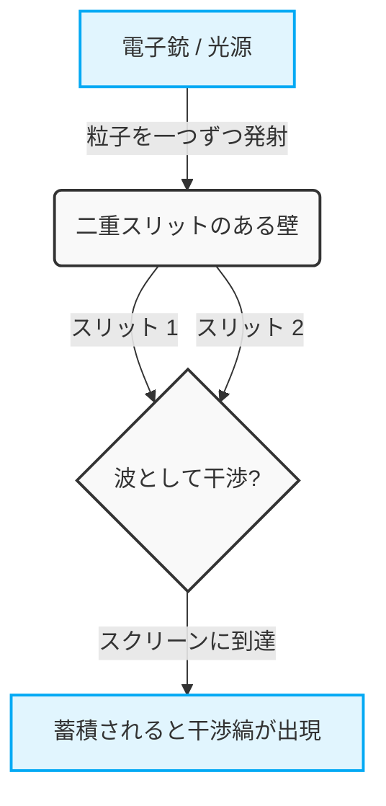
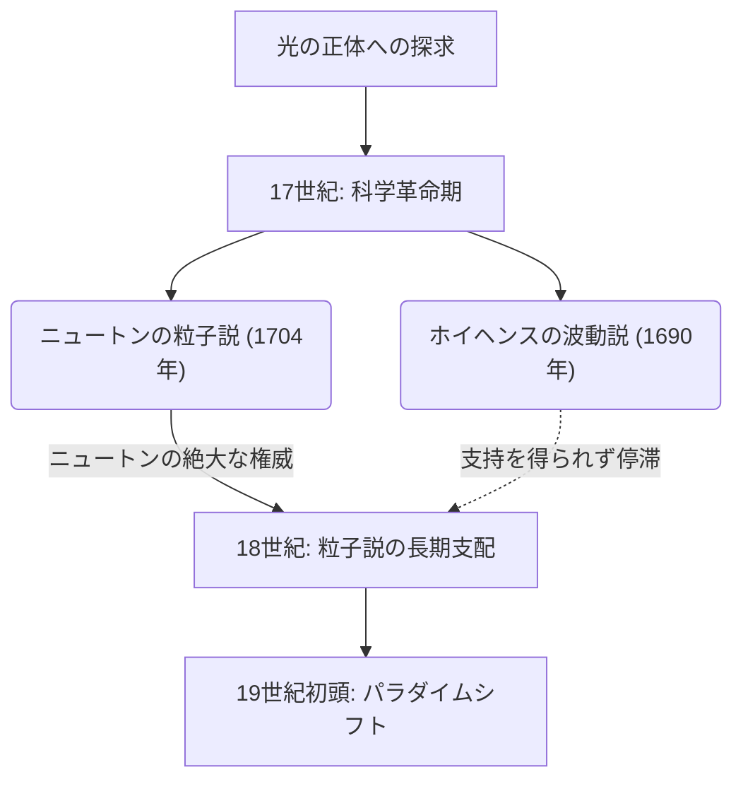
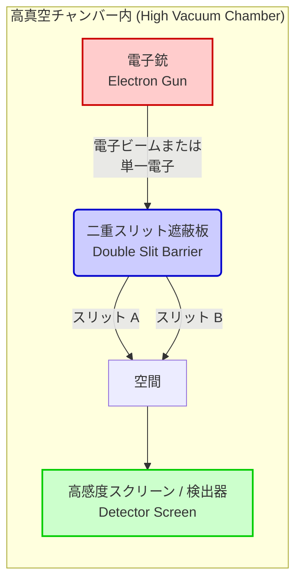

## 1. 【導入】二重スリット実験とは何か？

私たちの生きるこの世界は、確固たるルールに支配されているように見えます。投げ上げたボールは放物線を描いて落ち、水面に石を投げ入れれば波紋が広がります。これらはニュートン力学をはじめとする古典物理学が記述する「マクロな世界」の常識であり、私たちの直感と完全に一致しています。しかし、物質を構成する究極の最小単位である原子や電子、あるいは光の粒子（光子）といった「ミクロの世界」に足を踏み入れた途端、その常識は音を立てて崩れ去ります。そこは、私たちの日常的な感覚や直感が一切通用しない、極めて奇妙で不可解なルールが支配する領域なのです。

このミクロの世界の異常性を、最もシンプルかつ衝撃的な形で私たちに突きつけるのが、「二重スリット実験（Double-slit experiment）」です。20世紀を代表する天才物理学者リチャード・ファインマンは、この実験について「量子力学の唯一の謎である」と語り、さらに「この実験のなかに量子力学のすべてのミステリーが詰まっている」と評しました。また、多くの著名な物理学者がこの実験を「物理学史上最も美しい実験」と呼んでやみません。では、なぜ一枚の板に二つの隙間（スリット）を開けただけの極めて単純な実験が、そこまで特別視され、科学者たちを魅了し続けるのでしょうか？

### 直感に反するマクロとミクロの世界

まずは、私たちの直感が正確に機能するマクロな世界での現象を想像してみましょう。
例えば、壁に向かってペンキを塗った小さなボール（あるいはマシンガンの弾丸でも構いません）を次々と発射する機械があるとします。その手前には、縦長の細いスリット（隙間）が二つ並んで開けられた鉄板が置かれています。ボールをランダムに発射すると、スリットのどちらかを通り抜けたボールだけが奥の壁にぶつかり、インクのマークを残します。結果として壁には、手前の二つのスリットと同じ形をした「二本の縦線」のマークが浮かび上がるはずです。これはボールが明確な軌道を持つ「粒子」としての振る舞いであり、誰もが直感的に予想できる当然の結果です。

次に、「波」の場合を考えてみましょう。水槽の中に二つのスリットを持った衝立を置き、片側から波を起こします。波は二つのスリットに到達するとそこを通り抜け、それぞれのスリットを新たな波源として、二つの半円状の波となって奥へと広がっていきます。そして、この二つの波がぶつかり合うと、「干渉（かんしょう）」と呼ばれる現象が起きます。波の山と山が重なる場所はより高い波となり、山と谷が重なる場所は互いに打ち消し合って平坦になります。その結果、奥の壁（あるいは岸辺）には、波が強く当たる場所と全く当たらない場所が交互に現れる「干渉縞（かんしょうじま）」と呼ばれる美しい縞模様が形成されます。これもまた、水面や音波などで日常的に観察できる波の基本的な性質です。

ここまでは全く不思議なことはありません。粒子を投げれば「二本の線」を作り、波を送れば「干渉縞」を作る。これが私たちの住む世界の常識であり、古典物理学の前提です。

### 実験の概要と「最も美しい実験」と呼ばれる理由

しかし、光や電子のようなミクロの存在を使って全く同じ構造の実験を行うと、事態は急変し、人間の直感は完全に裏切られます。
歴史を振り返ると、1801年、イギリスの物理学者トマス・ヤングは、太陽光を用いてこの二重スリット実験を初めて行いました（ヤングの実験）。当時、光はニュートンが提唱した「粒子」であるという説が有力でしたが、ヤングの実験の結果、スクリーンには美しい「干渉縞」が現れたのです。これにより、「光は波である」という決定的な証拠が示され、長きにわたる論争に一度は決着がついたかのように見えました。

真のミステリー、そして物理学上の最大のパラダイムシフトはここから始まります。20世紀に入り、実験技術が驚異的に進歩すると、光や電子を「一つずつ」発射することが可能になりました。電子は質量を持ち、空間の特定の位置を占める、間違いなく明確な「粒子」です。電子銃から電子を一つだけ発射し、二重スリットを通ってスクリーンのどこかにポツンと一つの点（輝点）として到達させます。この時点では、スクリーンに当たった痕跡を見る限り、電子は間違いなく粒子として振る舞っています。
そして、この「一つずつの電子の発射」を何千回、何万回と気の遠くなるような回数繰り返します。電子は常に一つずつしか飛んでいないのですから、他の電子と空中でぶつかって波のように干渉することなど物理的にあり得ません。当然、スクリーンにはボールを投げた時と同じように、スリットの形に対応した「二本の線」が浮かび上がるはずだと誰もが考えました。

ところが、無数の電子の点がスクリーンに蓄積されていくにつれ、そこに浮かび上がってきたのは信じがたい模様でした。それは、波が互いにぶつかり合ったときにしか現れないはずの「干渉縞」だったのです。

一つずつ撃ち出されたはずの「粒子」である電子が、なぜか全体として「波」のように振る舞い、自らと干渉して縞模様を描き出す。これは一体どういうことでしょうか。まるで、発射された一つの電子が、波のように空間に広がり、同時に二つのスリットを通り抜け、自己干渉を起こし、スクリーンにぶつかる瞬間に再び一つの粒子として姿を現したかのようです。
さらに奇妙なことに、科学者たちが「電子がどちらのスリットを通ったのか」を確かめようと、スリットの脇に観測器（カメラのようなもの）を設置した途端、電子は突然波としての性質を失い、スクリーンには干渉縞ではなく単なる「二本の線」が現れるようになります。「見られている」と振る舞いを変えるというこの現象は、物理学者たちをさらなる混乱の渦に巻き込みました。

二重スリット実験が「物理学で最も美しい実験」と呼ばれる最大の理由は、大掛かりな加速器や極めて難解な数式を用いずとも、たった二つの隙間とスクリーンという極めて簡素でエレガントなセットアップだけで、宇宙の根源的な謎を浮き彫りにするからです。マクロな世界の常識が見事に崩壊する瞬間を、視覚的にまざまざと見せつけてくれます。それは単なる物理現象の確認にとどまらず、「実在とは何か」「私たちが『見ている』この世界は本当に客観的に存在しているのか」という、極めて深い哲学的・認識論的な問いを私たちに投げかけ続けています。このたった一つの簡素な実験の中に、人間の知性の限界と、それを超えようとする科学の無限のロマンが凝縮されているのです。

## 2. 【歴史】光は波か、粒子か？終わらぬ論争の軌跡

人類が「光」という存在を認識して以来、その正体についての探求は絶えることがありませんでした。古代ギリシャの時代から、エンペドクレスやユークリッドといった哲学者・数学者たちが光や視覚のメカニズムについて考察を巡らせてきましたが、近代科学としての本格的なアプローチが始まったのは17世紀のことです。この時代に幕を開けた「光は粒子なのか、それとも波なのか」という論争は、その後300年以上にわたって物理学界を二分し、ついには量子力学という全く新しい物理学の扉を開く原動力となりました。本節では、この壮大な科学史の軌跡を詳細に辿ります。

### 2.1 ニュートンの粒子説 vs ホイヘンスの波動説：17世紀の激突

17世紀後半、科学革命の真っ只中において、光の正体を巡る二つの強力な理論が提示されました。それが、アイザック・ニュートン（Isaac Newton）による「粒子説（微粒子説：Corpuscular theory）」と、クリスティアーン・ホイヘンス（Christiaan Huygens）による「波動説（Wave theory）」です。

#### ニュートンの粒子説
万有引力の法則などで知られる近代物理学の巨星、アイザック・ニュートンは、光が極めて小さな粒（微粒子）の集まりであると考えました。ニュートンは1672年の論文や、1704年の主著『光学（Opticks）』の中で、光が直進する性質や、鏡での反射の法則を、粒子が壁に弾かれる力学的なモデルで鮮やかに説明しました。また、プリズムによって白色光が七色に分かれる現象（分光）についても、異なる色の光は異なる質量の粒子であり、媒質を通る際の屈折率が異なるためだと主張しました。
ニュートンは波動説に対して、「もし光が音のような波であるならば、障害物の裏側に回り込むはずだ（回折現象）が、光は直進して明確な影を作る」という点を指摘し、波であることを否定しました。

#### ホイヘンスの波動説
一方、オランダの卓越した物理学者クリスティアーン・ホイヘンスは、1690年に発表した『光についての論考（Treatise on Light）』において、光は「エーテル」と呼ばれる宇宙空間を満たす弾性媒質の中を伝わる波（縦波）であると主張しました。ホイヘンスは、「波面上のすべての点は、新たな二次波の波源となる」という有名な「ホイヘンスの原理（Huygens' Principle）」を提唱し、光の直進、反射、そして屈折の法則を見事に幾何学的に説明しました。
特に屈折に関して、ニュートンは「光が水やガラスなどの密な媒質に入ると、粒子が引力を受けて加速するため光速が速くなる」と予言しましたが、ホイヘンスの波動説では「密な媒質では波の伝わる速度が遅くなる」と結論付けられ、両者は真っ向から対立しました。

しかし、当時の科学界におけるニュートンの絶対的な権威と影響力により、ホイヘンスの波動説は次第に影を潜め、18世紀を通じてニュートンの粒子説が主流として君臨し続けることになります。

## 2.2 トマス・ヤングの光の二重スリット実験（1801年）と波動説の勝利

19世紀に入ると、長らく支配的だった粒子説の牙城を崩す決定的な出来事が起こります。その主役となったのが、イギリスの博学者トマス・ヤング（Thomas Young）です。医師であり、エジプトのヒエログリフ解読（ロゼッタ・ストーン）にも貢献したヤングは、1801年、物理学の歴史に燦然と輝く実験を行いました。それが「ヤングの干渉実験（のちの二重スリット実験）」です。

#### 干渉縞の発見
ヤングの実験セットアップは極めてシンプルかつ巧妙でした。彼は、太陽光を非常に細いピンホール（またはスリット）に通して点光源を作り、その光をさらに、互いに非常に近い距離にある2つの細いスリット（二重スリット）を通過させ、背後のスクリーンに投影しました。
もし光がニュートンの言うような純粋な「粒子」であれば、スクリーンにはスリットの形に対応する2本の明るい線が映し出されるはずです。しかし、ヤングがスクリーンに見たものは、明るい縞と暗い縞が交互に並んだ縞模様、すなわち「干渉縞（Interference fringes）」でした。

この現象は、光が波であると考えなければ絶対に説明がつかないものでした。水面で2つの波がぶつかり合うとき、波の山と山が重なる場所はより高くなり（強め合い）、山と谷が重なる場所は打ち消し合って平らになる（弱め合い）現象が起きます。ヤングは、2つのスリットから出た光の波がこれと同じように干渉を起こしているのだと結論付けました。

#### 数学的な裏付けと波動説の確立
この強め合いと弱め合いの条件は、2つのスリットからスクリーン上の点までの経路の長さの差（光路差 $\Delta L$）によって決定されます。スリットの間隔を $d$、スクリーンへの角度を $\theta$、光の波長を $\lambda$ とすると、光路差は以下のように表されます。

$$ \Delta L = d \sin \theta $$

* **明線（強め合う条件）**: $\Delta L = m\lambda \quad (m = 0, \pm1, \pm2, \dots)$
* **暗線（弱め合う条件）**: $\Delta L = \left(m + \frac{1}{2}\right)\lambda$

このヤングの発表は、当初イギリス国内ではニュートン信奉者たちからの猛烈な批判と嘲笑を浴びました。しかし、その後1815年にフランスのオーギュスタン・ジャン・フレネル（Augustin-Jean Fresnel）が光の回折と干渉を厳密な数学的理論として構築しました。さらに1818年のフランス科学アカデミーのコンクールにおいて、審査員のシメオン・ドニ・ポアソン（波動説反対派）が「フレネルの理論が正しければ、円形の障害物の影の中心に明るい斑点ができるはずだ。そんな馬鹿げたことはあり得ない」と指摘しました。しかし、実際に実験を行ったドミニク・フランソワ・ジャン・アラゴがその「ポアソンの斑点（アラゴの斑点）」を完璧に観測してしまったことで、波動説の正しさは疑いようのないものとなりました。

1850年にはレオン・フーコーらが、水中の光速が空気中より遅いことを実験で証明し、ニュートンの予測は完全に否定されました。そして1864年、ジェームズ・クラーク・マクスウェルが電磁気学の集大成として「光は電磁波の一種である」という理論を確立し、ここに光の「波動説」は完全なる勝利を収め、論争は決着したかに見えました。

### 2.3 アインシュタインの光量子仮説（1905年）による粒子説の復活

光が電磁波であるというマクスウェルの理論はあまりに美しく、19世紀末の物理学者たちは「物理学はほぼ完成し、あとは細かな数値を測定するだけだ」と信じていました。しかし、19世紀末から20世紀初頭にかけて、波動説ではどうしても説明できない奇妙な現象が立ちはだかります。それが「光電効果（Photoelectric effect）」です。

#### 光電効果の謎
光電効果とは、金属の表面に光を当てると、金属から電子（光電子）が飛び出してくる現象です。当時の波動説の常識からすれば、光（波）のエネルギーはその振幅（明るさ）に比例するはずでした。したがって、「強い（明るい）光を当てれば、どんな色の光でも電子が勢いよく飛び出すはずだ」と考えられていました。
しかし、実験結果は波動説の予測を完全に裏切るものでした。

1. **限界振動数の存在**: ある特定の振動数（色）より低い光（例えば赤い光）は、いくら強く（明るく）当てても、いくら長時間当てても、電子は一向に飛び出しませんでした。
2. **即時性**: 逆に、限界振動数より高い光（例えば紫外光）であれば、どんなに微弱な光であっても、当てた瞬間に即座に電子が飛び出しました。
3. **エネルギーの依存性**: 飛び出してきた電子の運動エネルギーは、光の強さ（明るさ）ではなく、光の振動数（色）のみに依存していました。

#### アインシュタインの劇的な解決策：光量子（フォトン）
この絶望的な謎を解き明かしたのが、スイスの特許局で働く無名の青年、アルベルト・アインシュタイン（Albert Einstein）でした。「奇跡の年」と呼ばれる1905年、彼はマックス・プランクが熱放射の研究（1900年）で提唱した「エネルギー量子仮説」を光そのものに適用し、「光量子仮説（Light quantum hypothesis）」を発表しました。

アインシュタインは、連続的な波だと思われていた光を、エネルギーの塊、すなわち「光量子（フォトン：Photon）」という粒子の集まりであると大胆に仮定したのです。1つの光量子が持つエネルギー $E$ は、光の振動数 $\nu$ に比例し、以下のプランク・アインシュタインの公式で表されます。

$$ E = h\nu $$
（ここで、$h$ はプランク定数、$6.626 \times 10^{-34} \, \text{J}\cdot\text{s}$）

この仮説を用いれば、光電効果の謎はまるで魔法のように解けました。
光電効果とは、「1つの光量子」が金属中の「1つの電子」に衝突し、そのエネルギーを丸ごと受け渡すビリヤードのような現象だったのです。電子が金属の束縛を振り切るために必要な最低限のエネルギーを「仕事関数（$W$）」とすると、飛び出した電子の最大運動エネルギー $E_k$ は次の見事な方程式で表されます。

$$ E_k = h\nu - W $$

もし光量子のエネルギー $h\nu$ が仕事関数 $W$ よりも小さければ（低振動数の光）、いくら大量の光量子をぶつけても（光を強くしても）、電子は金属から飛び出すことができません。これが限界振動数の理由です。

#### 「波であり、粒子である」という不可解な世界へ
アインシュタインの光量子仮説は、1914年にロバート・ミリカンによる精密な実験で完全に証明され、アインシュタインはこの功績により1921年のノーベル物理学賞を受賞します。（ミリカン自身は当初アインシュタインの理論を信じておらず、それを反証しようと実験を行ったにもかかわらず、皮肉にもその正しさを証明する結果となってしまいました）。さらに1923年にはアーサー・コンプトンが、X線が電子に衝突した際に波長が変化する「コンプトン散乱」を発見し、光が運動量   $p = \frac{h}{\lambda}$ を持つ「粒子」として振る舞うことが確実となりました。

ヤングの実験によって完全に打ち負かされたはずの「粒子説」が、100年の時を経て、より洗練された「量子」という形で奇跡の復活を遂げたのです。
しかし、これは深刻な矛盾を生み出しました。光は、ヤングの二重スリット実験で見せたような「干渉」という明らかに波としての性質を持ちながら、光電効果で見せたような「粒子」としての性質も持ち合わせていることになります。

光は波なのか、それとも粒子なのか？
この問いに対する物理学の最終的な答えは、「光はそのどちらでもあり、どちらでもない。光は『波の性質』と『粒子の性質』を併せ持つ量子的な実体である」という、人間の直感に激しく反するものでした。これが「波と粒子の二重性（Wave-particle duality）」の誕生です。
そしてこの二重性の概念は、光にとどまらず、電子などの物質そのものにも適用されるようになり（ド・ブロイの物質波）、物理学はかつてない深淵、「量子力学」という奇妙で魅惑的な世界へと足を踏み入れていくことになります。その最も象徴的な舞台となるのが、現代版へとアップデートされた「量子力学的な二重スリット実験」なのです。

## 3. 【転換】物質も波である？ド・ブロイ波と電子の二重スリット実験

光が「波であり、かつ粒子である」というアインシュタインの光量子仮説（1905年）によって、物理学の世界は大きな混乱とパラダイムシフトの渦中にありました。長年、ヤングの干渉実験やマクスウェルの電磁気学によって「光は絶対的に波である」と信じられてきたにもかかわらず、光電効果などの現象は光を「粒（フォトン）」と考えなければ説明できなかったからです。この「波と粒子の二重性」という奇妙な性質は、当初は光だけが持つ特異な性質であると考えられていました。しかし、1920年代に入ると、この二重性の概念は光の世界にとどまらず、我々の体を構成する「物質」そのものへと牙を剥くことになります。

### 3.1. ルイ・ド・ブロイの物質波の提唱：美しき対称性からの飛躍

1924年、フランスの若き大学院生であったルイ・ド・ブロイ（Louis de Broglie）は、彼の博士論文の中で、物理学の歴史を根本から覆す大胆極まりない仮説を提唱しました。それは「光（波と考えられていたもの）が粒子としての性質を持つのであれば、逆に、電子などの物質（粒子と考えられていたもの）もまた波としての性質を持つのではないか？」というものでした。

自然界は常に対称性を好む、というド・ブロイの哲学的な直感がこの仮説の根底にはありました。彼は、アインシュタインが特殊相対性理論や光量子仮説で導き出したエネルギーと運動量の関係式を、質量を持つ物質粒子にも適用してみせたのです。光子の運動量 $p$ は、プランク定数 $h$ と波長 $\lambda$ を用いて $p = h / \lambda$ と表されます。ド・ブロイはこれを反転させ、質量 $m$ を持ち速度 $v$ で運動する粒子（運動量 $p = mv$）に付随する波の波長 $\lambda$ を、次のような非常にシンプルな数式で表しました。

$$ \lambda = \frac{h}{p} = \frac{h}{mv} $$

これが有名な「ド・ブロイ波長（物質波の波長）」の公式です。この数式は、我々が日常目にする野球のボールや自動車から、微小な電子に至るまで、動くものはすべて「波」としての性質を帯びていることを意味しています。では、なぜ我々は日常の生活で野球ボールが波のように干渉したり回折したりするのを見ないのでしょうか？ それは、プランク定数 $h$ （約 $6.626 \times 10^{-34} \text{ J}\cdot\text{s}$）が極めて小さいためです。マクロな物体では質量 $m$ が大きすぎるため、ド・ブロイ波長 $\lambda$ は実質的にゼロとみなせるほど小さくなり、波動性は完全に隠れてしまいます。しかし、質量が極めて小さい電子の世界では、この波長はＸ線（電磁波）の波長と同等のスケール（約 $0.1 \text{ nm}$ など）になり、決して無視できない大きさとして立ち現れてくるのです。

ド・ブロイのこの論文は、あまりにも常識外れであったため、当時の審査員たちを大いに困惑させました。しかし、審査員の一人であったポール・ランジュバンがこの論文をアインシュタインに送ったところ、アインシュタインは「彼は大きなヴェールの一角を持ち上げた」と絶賛しました。これにより、ド・ブロイの「物質波（matter wave）」の概念は世界的な注目を集めることとなり、後のシュレーディンガーによる波動力学の完成へと直結していくのです。

### 3.2. デイヴィソン＝ガーマーの実験：物質の波動性の証明

ド・ブロイの仮説は理論としては美しかったものの、それが現実の自然界を記述しているかどうかは実験による証明を待つ必要がありました。「電子が本当に波であるならば、波特有の現象である『回折』や『干渉』を起こすはずだ」。この信念のもと、世界中の物理学者が電子の波動性を捉えようと実験を開始しました。

そして1927年、ついに決定的な証拠がもたらされました。アメリカのベル研究所の物理学者クリントン・デイヴィソン（Clinton Davisson）とレスター・ガーマー（Lester Germer）による「デイヴィソン＝ガーマーの実験」です。

彼らは当初、ニッケルの結晶に電子線を当てて、その散乱の様子を調べるという別の目的で実験を行っていました。しかし、実験中の事故（真空管の破損によるニッケル表面の酸化）をリカバリーするためにニッケルを高温で加熱したところ、偶然にもニッケルが単結晶化するという幸運に恵まれます。この単結晶化されたニッケルに再び電子線を当てたとき、驚くべき現象が観測されました。散乱された電子の強度が、特定の角度で極大値を持つという、明確な「回折パターン」を示したのです。

結晶内の原子が規則正しく並んでいる間隔（格子定数）は、電子のド・ブロイ波長とほぼ同じスケールです。つまり、ニッケル結晶そのものが、電子にとっての「自然の回折格子」として機能したのです。デイヴィソンとガーマーがこの回折パターンから電子の波長を逆算した結果は、ド・ブロイの式 $\lambda = h/p$ が予測する値と見事に一致しました。同じ年、イギリスのジョージ・パジェット・トムソン（電子の発見者J.J.トムソンの息子）もまた、薄い金属箔を透過する電子線による回折リング（デバイ・シェラー環）を観測することに成功しました。

これらの実験結果は、物質が波としての性質を持つことを疑いようのない事実として物理学界に突きつけました。粒子であるはずの電子が波として振る舞う。この深淵なる自然の真理が明らかになった瞬間であり、量子力学の黎明を告げるファンファーレでもありました。ド・ブロイは1929年に、デイヴィソンとトムソンは1937年に、それぞれノーベル物理学賞を受賞しています。

### 3.3. 日立製作所（外村彰ら）による決定的な二重スリット実験（1989年）

電子が波であることが証明された後も、物理学者たちの探求は止まりませんでした。思考実験として語られてきた「電子の二重スリット実験」を、現実に、しかも極限の精度で実行しようとする試みです。

光の二重スリット実験（ヤングの実験）と同じように、電子を二重スリットに向けて発射すれば、背後のスクリーンには干渉縞が現れるはずです。しかし、ここで量子力学の最も不可解なパラドックスが顔を出します。「もし、電子を一度に大量に発射するのではなく、**1個ずつ** 発射したらどうなるのか？」

1個の電子は分割不可能な粒子です。したがって、左のスリットか右のスリットか、どちらか一方しか通り抜けることはできないはずです。1個ずつスクリーンに到達する電子は、スクリーン上に1つの輝点を残すだけです。これを何万回と繰り返したとき、点と点の集まりは、単なる2つのスリットの影（2本の線）になるのか、それとも波の性質を示す干渉縞になるのか。

この究極の問いに対し、技術的限界を突破して世界で最も美しく完璧な回答を提示したのが、日本の日立製作所基礎研究所の研究チーム（外村彰博士ら）でした。1989年、彼らは電子線ホログラフィー技術と超高真空・極低温の電子顕微鏡技術を駆使し、「単一電子バイプリズム干渉実験」を見事に成功させました。

実験のセットアップは驚異的でした。電子銃から放出される電子の数を極限まで減らし、電子が空間を飛んでいる間には常に「装置内に電子が1個しか存在しない」状態を作り出したのです。電子の速さは秒速約15万キロメートルにも達し、光源から検出器までの距離を飛ぶのに要する時間はほんの一瞬です。次の電子が発射されるのは、前の電子がスクリーンに到達したずっと後になります。

実験が始まると、検出器（モニター）には電子が到達したことを示す輝点がポツリ、ポツリと現れ始めます。最初の数個、数百個の段階では、画面上にランダムに点が散らばっているようにしか見えません。まるで夜空の星のように、そこには何の秩序もないように思われました。

しかし、数千個、数万個と電子が蓄積されていくにつれて、誰の目にも明らかな驚愕の光景が浮かび上がってきました。無秩序に見えていた点の集まりが、徐々に規則的な明暗の縞模様——紛れもない「干渉縞」——を形成していったのです。

この結果が意味するものは、直感に激しく反するものでした。電子は確実に「1個の粒子」としてスクリーンに到達しています（だからこそ1つの点が記録される）。しかし、全体として干渉縞を作るということは、その1個の電子は「自らが波として両方のスリット（バイプリズムの両側）を同時に通り抜け、自らと干渉した」としか解釈できないのです。誰とも相互作用していない単独の電子が、自分自身と干渉を起こす。ディラックが「光子は自分自身としか干渉しない」と語ったのと同じ原理が、質量を持つ物質粒子である電子においても完璧に実証されたのです。

外村彰博士らのこの実験は、量子力学の不思議さ、すなわち「波と粒子の二重性」を最も視覚的かつダイレクトに証明したものとして、世界中で絶賛されました。イギリスの科学誌『Physics World』が2002年に実施した「物理学の歴史において最も美しい実験」の読者投票において、この「電子の二重スリット実験」が堂々の第1位に選出されたのも当然のことと言えるでしょう。

こうして、「物質は波である」というド・ブロイの突拍子もない仮説は、60年以上の時を経て、1個の電子が描き出す神秘的な干渉縞として我々の目の前にその真実の姿を現したのです。しかし、この実験は量子力学の謎を解き明かしたと同時に、さらに深い謎、すなわち「観測問題」への扉を開くものでもありました。「どちらのスリットを通ったかを見ようとすると、干渉縞は消えてしまう」——次章では、この奇妙な量子世界のさらなる深淵へと足を踏み入れていきましょう。

## 4. 【実験方法と結果】具体的に何が起きているのか

（二重スリット実験の核心に迫り、量子力学の深淵を覗き込むために、ここでは光ではなく「電子」を用いた実験に焦点を当てて解説していきます。光子や他の素粒子、さらにはフラーレンのような比較的大きな分子でも同様の現象が確認されていますが、質量を持ち、私たちが「明らかに物質の粒である」と認識している電子を使うことで、この現象のパラドックスと不思議さがより一層際立つからです。）

### 4.1 実験装置のセットアップ：極微の世界を捉える舞台立て

まずは、この歴史的かつ革新的な実験がどのような装置で行われるのか、その舞台立て（セットアップ）を詳細に見ていきましょう。二重スリット実験の概念的な構造は驚くほどシンプルですが、実際にそれを物理的な実験として成功させる背後には、高度な技術と極めて厳密な環境制御が要求されます。

実験装置は大きく分けて以下の3つの主要なコンポーネントから構成されています。これらはすべて、空気分子との衝突による電子の散乱を防ぐため、高度な真空チャンバー（真空容器）の中に厳重に密閉されて配置されます。

1. **電子銃（Electron Gun）**:
   実験の主役である「電子」を発射するための装置です。フィラメントを加熱して熱電子を放出させたり、強電界を用いて電子を引き出したりする原理を利用して、一定の運動エネルギーを持った電子を、決まった方向に向けて発射します。この実験において極めて重要なのは、電子を強力な「ビーム」として滝のように連続的に発射することも、あるいは驚くべきことに、出力を極限まで絞り込んで「確実に1個ずつ」制御して発射することも可能であるという点です。この「単一電子発射技術」は、現代の量子力学実験において不可欠な精巧な技術の一つです。

2. **二重スリット（Double Slit）**:
   電子銃から発射された電子が通り抜けるための、2つの非常に細く、かつ極めて近い距離に並行して開けられたスリット（隙間）を持つ遮蔽板（壁）です。電子の「物質波（ド・ブロイ波）」の波長は非常に短いため、このスリットの幅やスリット間の距離も、ナノメートル（10億分の1メートル）からマイクロメートルスケールという微小なサイズで精密に作られなければなりません。もしスリットの幅や間隔が電子の波長に対して広すぎると、波動としての性質である「干渉」を明瞭に観測することができなくなります。この極小の二重スリットを作製する技術自体が、最先端の電子線描画装置などの微細加工技術の結晶と言えるでしょう。

3. **スクリーン（検出器、Screen / Detector）**:
   二重スリットを無事に通過した電子が最終的に到達し、その位置を記録するための観測スクリーンです。かつての実験では感光性の写真乾板などが使われていましたが、現在では高感度のCCDカメラや蛍光板、特殊な半導体ピクセル検出器などが用いられます。これにより、電子が「どこに到達したか（ヒットしたか）」を1発ごとに極めて正確な二次元座標として記録することができます。電子がスクリーンに衝突すると、そこで微小な光を放つか、あるいは電気信号を発生させることで、「間違いなくここに1つの粒子として到達した」という明確な痕跡（ドット）を残します。

以下の図は、この実験装置の全体的な配置と電子の軌道を模式的に表したものです。

### 4.2 大量の電子を当てた場合：直感を裏切る波動としての振る舞い（干渉縞の形成）

さて、いよいよ実験を開始します。まず最初のステップとして、電子銃の出力を上げ、「大量の電子」をまるでシャワーやマシンガンのように連続して二重スリットに向けて一斉に発射します。

私たちが日常的に持っている古典物理学的な常識で考えれば、電子は質量を持った「粒子（小さな弾丸のようなもの）」です。したがって、2つのスリットを通り抜けた多数の電子は、それぞれのスリットの直進方向の延長線上にあるスクリーン上の2箇所に集中的に衝突し、結果として「2本の縦縞」のようなパターンを形成するはずだと予想されます。ペンキのスプレーを、2本の隙間が空いたステンシルプレートに吹き付ける様子を想像してみてください。隙間を通ったペンキは、その隙間の形の通りに壁に2本の線を描くはずです。

しかし、実際にスクリーンに現れる模様は、私たちの直感と予測を完全に裏切るものです。スクリーン上には、2本の単純な縦縞ではなく、**何本もの明暗の縞模様（干渉縞：Interference Pattern）** がくっきりと形成されるのです。

この「干渉縞」は、池の水面に2つの石を同時に投げ入れたときに生じる波紋が重なり合ってできるパターンや、光の干渉実験で見られるパターンと全く同じ幾何学的特徴を持っています。
- **波の山と山、あるいは谷と谷が重なり合う場所（強め合う干渉）** では、電子がたくさん到達する「明るい（電子の衝突密度が高い）」縞になります。
- **波の山と谷が重なり合う場所（弱め合う干渉）** では、波が互いに打ち消し合い、電子が全くと言っていいほど到達しない「暗い（電子の衝突密度がゼロに近い）」縞になります。

この結果が意味する結論はただ一つしかありません。それは、**「電子は波として振る舞っている」** ということです。電子銃から放たれた電子の群れは、空間を水面波のように伝わり、2つのスリットを「同時に」通り抜けています。そして、スリットAから回折して広がった波と、スリットBから回折して広がった波が、スクリーンの手前の空間で重なり合い、干渉を起こすことで、あの特徴的な明暗の縞模様を作り出しているとしか解釈できないのです。

「粒子」であると固く信じられていた電子が、実は「波」としての性質も併せ持っている（波と粒子の二重性）。この事実だけでも物理学における歴史的な大発見であり、十分に驚くべきことですが、量子力学の真のミステリー、そして私たちの常識を根底から覆す現象は、ここからさらに一段階深まっていきます。

### 4.3 電子を「1個ずつ」発射した場合：極限の実験が暴く「確率の波」の正体

「大量に電子を同時に撃つから、電子同士が空中で衝突したり、電気的な力（クーロン力）で反発し合ったりして、結果的に波のような模様を作っているだけではないのか？」
このように考えるのは、科学者として非常に自然な疑問です。実際、干渉縞が発見された当初、多くの物理学者がそのように考え、現象を古典的に解釈しようと試みました。

この疑問に完全な決着をつけるため、実験技術を進歩させ、さらに決定的な実験が行われました。（日本では1989年に日立製作所の外村彰氏らのグループが行った実験が非常に有名で、世界で最も美しい実験の一つと称賛されています）。
それが、**電子銃の出力を極限まで絞り込み、電子を「確実に1個ずつ」発射する** という実験です。

具体的には、前の電子が発射され、スクリーンに到達して完全に消滅した（あるいは吸収された）ことを確認してから、次の新しい電子を発射します。これを何万回、何十万回と途方もない回数繰り返すのです。この設定において、実験装置内の空間には「常に1個の電子しか存在しない」ことが保証されています。したがって、電子同士が空中でぶつかったり、お互いに干渉し合ったりすることは物理的に100%あり得ません。

この極限状態での単一電子による実験結果を、時間の経過（電子の蓄積数）とともに追ってみましょう。

**ステップ1：実験開始直後（数十〜数百個の電子）**
スクリーンには、ポツリ、ポツリと、全くランダムな位置に点が打たれていきます。電子はスクリーンに到達する瞬間には、明らかに「1つの粒子」としての性質を示し、特定の微小な座標に一つの点（ドット）を記録します。この時点では、スクリーンの模様には何の規則性も見出せず、ただの無秩序でランダムな点の集まりにしか見えません。まるで、目隠しをして適当にダーツを投げているかのようです。

**ステップ2：数千個〜数万個の電子が到達した後**
時間が経過し、実験が繰り返され、スクリーン上に数千から数万の点が蓄積されてくると、奇妙な現象が起き始めます。完全にランダムだと思っていた点の分布の中に、徐々に「偏り」や「濃淡」が見え始めるのです。点が密集して多く打ち込まれる領域と、点がほとんど打ち込まれない領域が、うっすらと分かれ始めます。

**ステップ3：実験終了時（数十万個以上の電子が到達）**
十分に長い時間をかけ、膨大な数（数十万から数百万個）の電子を1個ずつ、気の遠くなるような作業で撃ち続けた後、スクリーン全体の蓄積画像を見てみると……そこには、大量の電子を一気に発射した時と全く同じ、見事な **「干渉縞」** がはっきりと浮かび上がっているのです！

これは、物理学史上、最も背筋が凍るような、直感に反する、しかし最も美しく深遠な結果の一つです。

なぜなら、電子は「完全に1個ずつ」発射されたのです。前後の電子と相互作用することは絶対に不可能です。それにもかかわらず、最終的に波の干渉を示す縞模様ができるということは、**「1個の電子が、自分自身と干渉している」** という、信じがたい結論を受け入れるしかありません。

この現象を論理的に説明しようとすると、私たちの日常的な空間・物質の感覚は完全に崩壊します。
1個の電子は、電子銃から発射された後、あたかも「波」のように空間全体に広がり、**右のスリットと左のスリットの両方を「同時に」通り抜け**、スクリーンの前で「自分自身の波」と干渉し合い、そしてスクリーンに到達して観測された瞬間に、再び「1つの粒子」としてある一点に収縮（決定）するのです。

では、この1個の電子が空間を伝わる「波」の実体とは一体何なのでしょうか？
量子力学において、これは水面や空気のような物理的な媒質が波打っている実体的な波ではありません。マックス・ボルンによって提唱された解釈によれば、これは **「電子がその空間の特定の場所に存在する『確率』を表す波（確率波）」** なのです。数学的にはこれを「波動関数」と呼びます。

電子は、パチンコ玉のように特定の軌道（ルート）を一直線に飛んでいくのではありません。発射されてからスクリーンに到達するまでの間、電子は「右のスリットを通った状態」と「左のスリットを通った状態」、さらには「空間のあらゆる経路を通る状態」が、様々な確率で「重なり合った状態（重ね合わせの状態）」として空間を広がっていきます。

そして、スクリーンという観測器にぶつかり、「どこに到達したか」が測定された瞬間に、空間に広がっていた確率の波は一瞬にして一点に収縮し（波動関数の収縮）、初めて「ここにあった」という現実の粒子の位置が確定するのです。

干渉縞の「明るい部分（最終的に点が多く集まる部分）」は、電子が存在する確率が波の干渉によって高められた場所であり、「暗い部分（点が集まらない部分）」は、確率の波が打ち消し合ってゼロになった場所を意味しています。サイコロを何度も振ると、それぞれの目が出る確率は理論値（1/6）に近づいていくように、1個ずつの電子の「確率的な振る舞い」が数十万回繰り返されることで、確率の波の形（干渉縞）が現実のパターンとして浮かび上がるのです。

「1個の電子が2つのスリットを同時に通る」「観測されるまでは状態が確定せず、無数の可能性が重なり合った確率の波としてのみ存在する」。
この二重スリット実験が突きつける冷徹な実験事実は、私たちに「存在するとはそもそもどういうことなのか」「私たちが認識している現実とは一体何なのか」という、物理学の枠を超えた深遠な哲学的な問いを投げかけているのです。

## 5. 【観測問題】見ていると振る舞いを変える量子

量子力学における二重スリット実験が、物理学のみならず哲学や思想の領域にまで多大な影響を与え、科学史上最も美しく、同時に最も不気味な実験と呼ばれる理由の核心がここにあります。それは、「観測（測定）」という行為そのものが、物理現象の結末を決定的に変えてしまうという驚くべき事実です。

私たちが生きる日常（マクロ）の世界、すなわち古典物理学が支配する世界においては、「見ること」は単なる受動的な行為に過ぎません。私たちが夜空に浮かぶ月を見ていようがいまいが、月はそこに確固として存在し、ニュートン力学に従って一定の軌道を描いて運動しています。見ているからといって月の軌道が変わることはありません。観察者の存在は、観察される対象の客観的現実に何ら影響を与えないというのが、私たちの持つ強固な常識です。

しかし、量子のミクロな世界では、この常識が根底から覆されます。「見ること（観測すること）」は単なる情報の受け取りではなく、対象に不可逆的で決定的な影響を与える能動的なプロセスなのです。観測者が自然に問いを投げかけた瞬間、自然はその振る舞いを変えてしまいます。このセクションでは、二重スリット実験における最大のミステリーであり、現代物理学においてもなお議論が続く「観測問題（Measurement Problem）」について、極めて詳細に掘り下げていきます。

### どちらのスリットを通ったか「観測」すると何が起きるか

電子や光子、あるいはフラーレン（C60）などの大きな分子に至るまで、量子を一つずつ発射し、それが二つのスリットを通過してスクリーンに到達するまでのプロセスを想像してください。これまでの説明で、量子を一つずつ間隔を空けて飛ばしたとしても、長時間続けてスクリーン上に蓄積された輝点を観察すると、そこには美しい干渉縞（波としての性質を示す証拠）が形成されることを確認しました。これは、一つの量子が「右のスリットを通る可能性」と「左のスリットを通る可能性」という二つの状態の重ね合わせ（Superposition）として空間を伝わり、自分自身の確率の波が干渉し合った結果だと解釈されます。

しかし、ここで物理学者たちはある自然な、しかし量子の世界においては悪魔的な疑問を抱きました。「量子が本当に『両方のスリットを同時に』通っているのか？ それとも『実はどちらか一方のスリットだけを通っているが、我々がそれを知らないだけ』なのか？ スリットの傍にカメラを置いて、確かめてやろうではないか」と。

この疑問に答えるため、実験装置に一つの変更を加えます。スリットのすぐ横に、極めて感度の高い「検出器（観測装置）」を設置するのです。この検出器は、電子が右のスリットを通ったのか、左のスリットを通ったのかを「観測」し、記録するためのものです。実験のセットアップは検出器を追加した以外、完全に同じです。電子を一つずつ発射します。検出器は確実に作動し、「右を通った」「左を通った」と、電子の経路情報（Which-path information）を正確に教えてくれます。予想通り、半分の電子は右を、もう半分の電子は左を通ることが確認されます。これで私たちの直感は満たされました。「なんだ、やっぱり電子は粒子として、どちらか一方の穴を通っていただけじゃないか。重ね合わせなんて幻だ」と。

ところが、最終的にスクリーンに到達した電子の分布パターンを確認した物理学者たちは、言葉を失います。そこに描かれていたのは、もはや波の性質を示す美しい干渉縞ではなく、ただの「二本の線（あるいは二つの山）」だったのです。これは、野球のボールや小石などの古典的な粒子をスリットに向かって投げたときにできるパターンと全く同じです。干渉縞の形成に不可欠な「波の干渉」が、完全に消滅してしまったのです。

電子は、私たちが「どちらを通ったか」を観測しようとした瞬間に、波としての性質（重ね合わせ状態）を捨て去り、純粋な古典的粒子として振る舞うようになったのです。観測器の電源を切れば再び干渉縞が現れ、電源を入れると干渉縞は跡形もなく消えます。さらに驚くべきことに、「観測データを記録したが、誰もそのデータを見ずに消去した場合」には、干渉縞が復活することすら後の実験（量子消去実験）で示されています。量子はまるで、私たちに見られていること、あるいは経路情報が宇宙のどこかに残されていることを「知っている」かのように振る舞うのです。これを「経路情報の取得による干渉の破壊」と呼び、量子の世界がいかに私たちの直感から掛け離れているかを示す決定的な証拠となりました。

### コペンハーゲン解釈（波束の収縮）

この不可解極まりない現象を、私たちはどのように解釈すべきなのでしょうか。1920年代、ニールス・ボーアやヴェルナー・ハイゼンベルク、マックス・ボルンらが中心となって構築した、量子力学の最も標準的かつ正統な解釈が「コペンハーゲン解釈」です。

コペンハーゲン解釈では、観測される前の量子は、空間に広がる「確率の波（波動関数）」としてのみ存在していると考えます。波動関数（通常 $\Psi$ と表記されます）そのものは物理的な実体ではなく、ある場所で量子が発見される「確率の振幅」を表す数学的な道具です。この確率の波は、シュレーディンガー方程式に従って、決定論的かつ滑らかに時間発展（変化）します。二重スリット実験において、電子の確率の波は右のスリットと左のスリットの両方を通過し、スクリーンの前で互いに干渉し合います。ここまでは、波としての性質が支配する世界であり、決定論的なプロセスです。

しかし、「観測」という物理的プロセスが行われた瞬間、この波動関数は劇的かつ非連続的な変化を遂げます。これを「波束の収縮（波動関数の収縮：Wavefunction Collapse）」と呼びます。観測器が「電子が右のスリットを通った」と検知したその一瞬、空間全体に広がっていた「左を通るかもしれない」「真ん中を通るかもしれない」といったあらゆる可能性の波が、光速を超えて一瞬にして消え去り、「右のスリットを通った粒子」というただ一つの現実（点）へと収縮するのです。

コペンハーゲン解釈の最も過激で重要な主張は、「観測する前は、量子がどこにいるか、どのような状態にあるかは『決まっていない』」という点です。私たちが知らないだけで実はどこかにいる（これを「隠れた変数理論」と呼びます）のではなく、文字通り「存在の確率が空間に広がっている状態そのものが現実」であり、観測というマクロな系との相互作用が、無数にある可能性の中から一つの現実をランダムに「選択」し、「決定」しているのだと主張します。

アルベルト・アインシュタインはこの曖昧で確率論的な考えに生涯を通じて強く反発しました。「神はサイコロを振らない（God does not play dice with the universe）」という有名な言葉は、この確率的解釈への批判です。また、「私が月を見ていない時、月はそこに存在しないとでも言うのか」と皮肉り、量子力学は未完成な理論であると主張し続けました（EPRパラドックスなど）。しかし、その後のベルの不等式の検証実験（アスペの実験など）により、アインシュタインが望んだような局所的な隠れた変数理論は否定され、現在に至るまで数々の精密な実験結果が、この不気味なコペンハーゲン解釈（あるいはそれに連なる多世界解釈などの非局所的・確率的モデル）の正しさを支持し続けています。

### ハイゼンベルクの不確定性原理との関係

なぜ、観測という行為は必然的に量子の状態を変化させ、干渉縞を破壊してしまうのでしょうか。この謎を、より根本的な物理学の原理から鮮やかに説明するのが、ヴェルナー・ハイゼンベルクが1927年に提唱した「不確定性原理（Uncertainty Principle）」です。

不確定性原理とは、ミクロな世界において、ある粒子の共役な物理量（ペアとなる性質）、例えば「位置（どこにあるか）」と「運動量（どのくらいの質量で、どの方向へどれくらいの速度で飛んでいるか）」の両方を、同時に無限の精度で正確に測定することは原理的に不可能である、という宇宙の根本法則です。

これを数学的に表現したものが、以下の有名な不等式です。

$$ \Delta x \cdot \Delta p \ge \frac{\hbar}{2} $$

ここで、各記号は以下を意味します。
- $\Delta x$ ： 「位置の不確かさ（位置の測定における標準偏差、誤差の広がり）」
- $\Delta p$ ： 「運動量の不確かさ（運動量の測定における標準偏差）」
- $\hbar$ ： 「ディラック定数（エイチバー、換算プランク定数）」。プランク定数 $h$ を $2\pi$ で割ったものであり、約 $1.054 \times 10^{-34} \mathrm{J\cdot s}$ という極めて小さな値。

この数式が意味するのは、「位置の不確かさ」と「運動量の不確かさ」の掛け算は、常に一定の極小の値（$\hbar / 2$）以上でなければならない、ということです。つまり、粒子の位置を極めて正確に特定しようとすればするほど（$\Delta x$ を限界までゼロに近づけるほど）、反比例して運動量の不確かさ（$\Delta p$）は無限大に向けて発散してしまい、粒子が次の一瞬にどこへ向かって飛んでいくのかが全く予測不可能になってしまうのです。逆もまた然りで、運動量を精密に測ろうとすれば、今度はその粒子がどこにいるのかが空間全体にぼやけてしまいます。

重要なのは、これが「人間の作る測定器の性能が悪いから生じる誤差」ではなく、量子そのものが内包している「自然界の根源的な揺らぎの性質」だということです。量子は、位置と運動量の両方を同時に確定した値として持つこと自体が許されていないのです。

二重スリット実験における「観測問題」を、この不確定性原理のレンズを通して紐解いてみましょう。
私たちが検出器を使って「電子が右のスリットと左のスリットのどちらを通ったか」を知ろうとすることは、言い換えれば「スリット面における電子の垂直方向の位置（$x$）を高精度に測定し特定する」ことに他なりません（$\Delta x$ をスリットの間隔よりも十分に小さくする）。

電子の位置を見るためには、電子と何らかの相互作用を起こす必要があります。例えば、光（光子）を電子に当てて、その散乱光を顕微鏡で見る（ハイゼンベルクの顕微鏡の思考実験）ことを考えます。電子がどちらのスリットを通ったかを見分けるためには、スリットの間隔よりも波長が短い、つまりエネルギーが非常に高い光を当てなければなりません。

しかし、エネルギーの高い光子を電子に衝突させると、ビリヤードの球がぶつかるように、光子は電子に大きな衝撃（運動量変化）を与えてしまいます。これにより、電子の垂直方向の運動量（$p$）がランダムに激しく乱されます（不確定性原理により、$\Delta x$ を小さくした代償として $\Delta p$ が増大する）。

スリット通過直後の電子の運動量がランダムに乱されるということは、電子がその後スクリーンのどの位置に到達するかが完全にバラバラに散らばってしまうことを意味します。本来であれば、重ね合わさった波として位相を保ったまま空間を進み、特定の場所に確率が集積するはずだった精緻な干渉パターンは、この乱れによって完全に破壊されます（位相のランダム化＝デコヒーレンス）。結果として、波の干渉は消え失せ、ただ二つのスリットを通り抜けた粒子が散乱して作る古典的な二本の線が現れるのです。

このように、不確定性原理は「対象に一切の影響を与えずに（干渉を保ったまま）経路情報を引き出す観測は不可能である」という残酷な事実を、冷徹な数式によって証明しています。観測という行為は、私たちが対象から一つの情報（位置）を確定的に引き出すと同時に、対象の持つ別の重要な情報（運動量や波動性の位相）をかき乱し、宇宙の不可知の彼方へ永遠に奪い去る暴力的な行為なのです。二重スリット実験は、この不確定性原理と波束の収縮がミクロな世界をいかに支配しているかを、誰の目にも明らかな形で描き出す、量子力学の究極のデモンストレーションと言えるでしょう。

## 6. 【最先端】量子力学の基礎と現代的解釈

二重スリット実験が提示した「観測するまでは波であり、観測した瞬間に粒子になる」という奇妙な事実は、物理学者たちに宇宙の根本的な性質に対する深い疑問を投げかけました。この章では、この不可解な現象を数学的に記述し、そしてそれをどのように解釈すべきかという、量子力学の最も深遠なテーマに踏み込んでいきます。ここには、私たちの常識を根本から覆すような、最先端の理論と実験が待ち受けています。ミクロの世界における物理法則は、私たちが日常経験するマクロな世界とは全く異なる原理で動いているのです。

### シュレーディンガー方程式と確率振幅

量子力学の世界を数学的に支配しているのが、オーストリアの物理学者エルヴィン・シュレーディンガーによって1926年に導き出された「シュレーディンガー方程式」です。ニュートン力学における運動方程式（$F = ma$）がマクロな物体の動きを決定論的に記述するように、シュレーディンガー方程式はミクロな粒子の状態が時間とともにどのように変化していくか（時間発展）を厳密に記述します。

最も基本的な、1次元空間を運動する1個の質量 $m$の粒子に対する時間依存シュレーディンガー方程式は、以下のように表されます。

$$ i\hbar \frac{\partial}{\partial t} \Psi(x, t) = \left[ -\frac{\hbar^2}{2m} \frac{\partial^2}{\partial x^2} + V(x, t) \right] \Psi(x, t) $$

この一見複雑な偏微分方程式の各部分には、それぞれ量子力学を特徴付ける重要な物理的意味が込められています。

*   **$i$**: 虚数単位（$^2 = -1$）。シュレーディンガー方程式の最大の特徴の一つは、基礎方程式に虚数が含まれていることです。量子力学において複素数は単なる数学的な便法ではなく、自然を記述するための本質的な役割を果たしています。
*   **$\hbar$（ディラック定数）**: プランク定数 $h$ を $2\pi$ で割った値（約 $1.054 \times 10^{-34} \mathrm{J \cdot s}$）。量子力学的なスケールを決定し、ミクロとマクロの境界を定める根本的な自然定数です。
*   **$\frac{\partial}{\partial t}$**: 時間 $t$ に関する偏微分。系の状態が時間とともにどう変化するかを表す「時間発展演算子」の一部です。
*   **$\Psi(x, t)$$$（波動関数）**: 位置 $x$と時間 $t$ における系の状態を表す複素数値の関数です。これが最も重要な要素であり、粒子の状態に関するすべての情報（位置、運動量、エネルギーなど）を含んでいます。
*   **$m$**: 粒子の質量。
*   **$-\frac{\hbar^2}{2m} \frac{\partial^2}{\partial x^2}$**: 運動エネルギー演算子。位置に関する2階微分を含み、粒子の運動エネルギーに対応します。
*   **$V(x, t)$**: ポテンシャルエネルギー。粒子が置かれている環境（電磁場や重力場などの力場）を表します。
*   **右辺全体（ハミルトニアン演算子 $\hat{H}$）**: 系の全エネルギー（運動エネルギー ＋ ポテンシャルエネルギー）を表す演算子です。つまり方程式全体は「全エネルギーが波動関数の時間変化を決定する」という関係を示しています。

初期条件と境界条件を与えてシュレーディンガー方程式を解くことで、波動関数 $\Psi(x, t) を求めることができます。しかし、この $\Psi 自体は複素数であり、直接観測できる物理量ではありません。ドイツの物理学者マックス・ボルンは、この波動関数の物理的意味について画期的な解釈を提唱しました。それが「確率解釈（ボルンの規則）」です。

ボルンの規則によれば、波動関数の絶対値の2乗、すなわち $|\Psi(x, t)|^2$ が、時間 $t$において位置 $x$ で粒子を見出す「確率密度」を表すというのです。波動関数そのものは「確率振幅」と呼ばれ、それ自体は確率ではありませんが、2乗することで初めて現実の確率となります。

二重スリット実験における干渉縞は、まさにこの確率振幅が重ね合わせの原理に従って干渉し合った結果生じる、確率密度の濃淡（波の強弱）のパターンとして理解されます。波が高い（確率密度が大きい）場所ほど、スクリーン上で粒子が観測される確率が高くなるのです。つまり、電子は確定した軌道を描いて飛んでいくのではなく、「空間全体に広がる存在確率の波」として振る舞い、スクリーンのどこに到達するかは、到達するまさにその瞬間まで確率的にしか決まっていません。アインシュタインが「神はサイコロを振らない」と反発したのも、この根源的な確率性に対する抵抗でした。

### 多世界解釈とパイロット波理論

コペンハーゲン解釈（観測によって波動関数が瞬間的に収縮し、一つの結果がランダムに選ばれるとする、ニールス・ボーアを中心とした正統派の解釈）は、これまでのすべての実験結果を完璧に予測できます。しかし、「なぜ観測という行為が物理法則を変えるのか」「そもそも観測者とは何か」「巨視的な観測装置と微視的な系の境界はどこにあるのか」といった『観測問題』と呼ばれる深い哲学的な難問を抱えています。この問題を回避し、量子力学の奇妙な世界を別の角度から矛盾なく理解しようとする様々な解釈が存在します。その代表例が「多世界解釈」と「パイロット波理論」です。

#### 多世界解釈（エヴェレット解釈）

1957年にヒュー・エヴェレット3世によって提唱された「多世界解釈（Many-Worlds Interpretation）」は、SFの世界でもお馴染みの概念ですが、物理学においては極めて真面目な理論です。エヴェレットは、コペンハーゲン解釈の最も不自然な部分である「観測による波動関数の収縮」というプロセスを完全に否定し、シュレーディンガー方程式が宇宙全体に対して常に例外なく成り立つと考えました。

多世界解釈によれば、量子力学的な重ね合わせの状態にある系（例えば、右のスリットを通った状態と左のスリットを通った状態の重ね合わせ）を観測したとき、波動関数は収縮してどちらか一方になるのではなく、宇宙そのものが分岐（デコヒーレンスという物理過程を通じて独立した状態に分かれること）すると考えます。

つまり、二重スリット実験で電子を1つ発射するたびに、「電子が右のスリットを通った宇宙」と「電子が左のスリットを通った宇宙」が無数に枝分かれして並行に存在していくことになります。私たち観測者も宇宙の一部であるため、観測と同時に私たち自身も分岐し、それぞれの宇宙で「右で観測した私」と「左で観測した私」がそれぞれ別の結果を認識しているのです。それぞれの「私」は、自分が唯一の宇宙にいると感じます。波の収縮という謎のメカニズムを排除し、数学的な美しさを保てる一方で、無数の平行宇宙（マルチバース）の実在を受け入れなければならないという、私たちの直感に大きく反するパラダイムシフトを要求します。

#### パイロット波理論（ド・ブロイ＝ボーム理論）

ルイ・ド・ブロイによって発案され、1952年にデヴィッド・ボームによって発展させられた「パイロット波理論（Pilot-Wave Theory）」または「ボーム力学」は、多世界解釈とは全く異なるアプローチをとります。

この理論は、粒子は常に明確な位置と軌道を持っている（つまり、私たちが観測していなくても実在している）という「隠れた変数理論」の代表的なものです。しかし、通常の古典力学と異なるのは、空間全体に広がる「パイロット波（量子ポテンシャル場）」と呼ばれる目に見えない波が存在し、この波が粒子の運動を決定論的に導いている（ガイドしている）と考える点です。

二重スリット実験に当てはめると、発射された電子自体は常にどちらか一方のスリットを確実に通っています。しかし、電子を導くパイロット波は水面波のように両方のスリットを通り抜け、干渉を起こします。電子はこの干渉したパイロット波の流れに乗って運ばれるため、最終的にスクリーンに到達する位置が偏り、結果として干渉縞が形成されるのです。どの軌道を辿るかは、発射時の初期位置（隠れた変数）によって完全に決定されています。

パイロット波理論は、波動関数の不気味な収縮も、無限に増殖する平行宇宙も必要とせず、決定論的な世界観を維持できるという大きな魅力があります。しかし、理論の構造上、パイロット波が光速を超えて瞬時に空間全体に影響を及ぼすという「非局所性（Non-locality）」を内包しており、アインシュタインの特殊相対性理論との美しい統合が難しくなるという新たな問題を抱えることになります。

### 遅延選択量子消しゴム実験（時間が遡るのか？）

量子力学の解釈を巡る議論の中で、最も不可解で、かつ私たちの「時間」や「因果律」の概念を根底から揺さぶる思考実験と実際の実験があります。それが、ジョン・ホイーラーが1978年に提案した「遅延選択実験」、そして1999年にキムらによって実際に検証された「遅延選択量子消しゴム実験（Delayed-Choice Quantum Eraser Experiment）」です。

通常の二重スリット実験において、電子や光子が「どちらのスリットを通ったか」という経路情報（Which-way information）を観測すると、波としての性質が失われ、干渉縞は消えて2本の筋になります。では、粒子がスリットを通り抜けた **後**、スクリーンに到達する **前** のタイミングで、経路情報を観測するかどうかを決定したらどうなるでしょうか？ これがホイーラーの遅延選択実験の基本的なアイデアです。

驚くべきことに、粒子がスリットを通過した後に経路情報の観測を選択した場合でも、干渉縞は現れません。逆に、観測しないことを選択すれば干渉縞が現れます。まるで、未来における観測の選択が、過去における粒子の振る舞い（スリット通過時に波として振る舞ったか、粒子として振る舞ったか）を遡って決定したかのように見えるのです。

さらに発展した「遅延選択量子消しゴム実験」では、エンタングルメント（量子もつれ）を利用してさらに奇妙な状況を作り出します。スリットを通る光子Aと、それと量子もつれ状態にある光子Bのペアを特殊な結晶で生成します。光子Aはすぐに近くのスクリーン（検出器）に向かい、光子Bはより長い経路を通って遠くの複雑な光学系（ハーフミラーや検出器のネットワーク）に向かいます。

1.  光子Bがどの検出器に入ったかを調べることで、光子Aの経路情報を間接的に知ることができる設定にした場合、光子Aはスクリーンに干渉縞を作りません。
2.  しかし、光子Bが検出器に到達する前に、光子Bの経路情報を意図的に消去（スクランブルして判別不能に）する装置（消しゴム）を挿入したとします。すると、光子Aの経路情報はもはや誰にも分からなくなり、驚くべきことに、光子Aはスクリーン上に干渉縞を形成するのです。

ここで最も衝撃的なのはタイミングです。光子Aと光子Bの経路の長さを調整し、光子Aがスクリーンに到達してデータが記録された **ずっと後** に、遠くを飛んでいる光子Bの情報を「観測するか、消去するか」を選択するのです。この場合でも、未来で光子Bの情報を消去することを選択すると、すでに過去にスクリーンに到達して固定されていたはずの光子Aのデータセットを後から解析すると、そこに干渉縞が浮かび上がってくる（より正確には、もつれた光子Bの観測結果と相関をとることで干渉縞が抽出できる）のです。

これは文字通り「未来の観測の選択が過去の物理的な出来事を変えた」ことを意味するのでしょうか？ 因果律は崩壊してしまったのでしょうか？

多くの現代の物理学者は、「因果律が逆転した」とか「文字通り時間が遡った」と解釈することには極めて慎重です。むしろ、量子力学においては、私たちが日常的に考えるような「確固たる過去の客観的な出来事（どちらのスリットを通ったかなど）」は、実際に観測のプロセスが完了し情報が抽出されるまでは存在しない、ということを示唆しています。光子Aと光子B、そして測定装置と環境を含む全体を一つの巨大な量子状態（エンタングルした状態）として扱うことでのみ、この現象は数学的に矛盾なく説明できるのです。

遅延選択量子消しゴム実験は、私たちが当たり前だと信じている「絶対的な時間」「原因と結果の必然性」「観測から独立した客観的現実」といった概念が、ミクロな量子世界では通用しない幻想に過ぎない可能性を強烈に突きつけています。シュレーディンガーの猫から始まった観測のパラドックスは、現代の精緻な実験技術によって、ますます深く、宇宙の本質そのものに迫る哲学的な問いを私たちに投げかけ続けているのです。

## 7. 【結語】二重スリット実験が我々に突きつける現実

二重スリット実験は、単なる物理学の教科書に載っている過去の歴史的な実験ではありません。それは、私たちが「現実」と呼ぶものの根底を揺るがし、宇宙の真理へと迫るための究極の入り口であり続けています。光や電子という極小の世界の住人たちが、観測されていないときには波のように空間に広がり、観測された瞬間に一つの粒子として確定するという事実は、私たちの日常的な感覚からすればにわかに信じがたい、魔法のような振る舞いです。しかし、一世紀以上にわたる無数の精密な実験と理論の検証が、この直感に反する量子力学の予言が紛れもない宇宙の事実であることを証明してきました。本稿の締めくくりとして、このシンプルにして深淵な実験が現代社会にどのような革新をもたらしつつあるのか、そして私たち自身の「現実」に対する認識をどのように変容させるのかについて、もう一度深く考察してみましょう。

### 量子情報科学への応用：量子コンピュータと量子暗号

二重スリット実験に端を発する量子力学の奇妙な性質――「重ね合わせ（スーパーポジション）」と「量子もつれ（エンタングルメント）」――は、もはや象牙の塔での哲学的な議論の対象にとどまらず、21世紀の最先端テクノロジーの中核を担うようになっています。その筆頭として世界中で熾烈な開発競争が繰り広げられているのが、量子コンピュータです。古典的なコンピュータが「0」か「1」のいずれかの確定した状態を持つビットを基本単位として計算を行うのに対し、量子コンピュータは「0でもあり1でもある」重ね合わせ状態を持つ「量子ビット（キュービット）」を用います。これはまさに、一つの電子が左のスリットと右のスリットを「同時に」通り抜ける現象を、計算資源として直接的に活用していることに他なりません。多数の量子ビットがもつれ合うことで生み出される並列計算能力は天文学的な規模に達し、特定の種類の計算問題（例えば、巨大な数の素因数分解、新薬開発のための複雑な分子シミュレーション、交通網の最適化問題など）を、現在のスーパーコンピュータでは宇宙の年齢ほどの時間がかかる規模であっても、ほんの一瞬で解き明かす可能性を秘めています。

さらに、次世代のセキュリティ技術である量子暗号（特に量子鍵配送）も、量子力学の「観測問題」に直接的に根ざした技術です。二重スリット実験において「電子がどちらのスリットを通ったか」を観測しようとすると、それだけで干渉縞が消滅し、粒子の振る舞いが変化してしまいました。量子暗号はまさにこの原理、すなわち「未知の量子状態を観測（あるいは盗聴）すると、必ずその状態が不可逆的に変化し、確実な痕跡が残る」という物理の基本法則を、安全性の担保として利用しています。いかに高度な数学的ハッキング技術や圧倒的な計算力を用いようとも、自然界の基本法則そのものを出し抜くことはできません。これにより、理論上絶対に破られることのない、究極のセキュリティを備えた次世代通信網の構築が現在進行形で進められています。

かつてアインシュタインやボーアたちが黒板の前で激論を交わしたミクロの不思議は、今や巨大なデータセンターや光ファイバー網のなかで実用化され、我々の社会インフラを根底から書き換えようとしているのです。二重スリット実験が示唆した「波と粒子の二面性」や「観測による状態の収縮」は、現代のテクノロジー革命における最大の原動力として、社会の至る所で息づいています。

### 「現実とは何か」という究極の問い

しかし、テクノロジーの応用という実用的な側面以上に、二重スリット実験が私たちに突きつける最も重要で、かつ最も困難なテーマは、「現実とは一体何か」という哲学的な問いにほかなりません。私たちは普段、自分が見ていようが見ていまいが、月はそこに存在し、世界は客観的かつ確固たる実体として存在していると無意識のうちに信じています（局所的実在論）。人間が存在する前から宇宙は存在し、物理法則に従って時計仕掛けのように動いているという世界観です。ところが、二重スリット実験やそれに続くベルの定理の検証、さらには遅延選択実験などは、この素朴な実在観を真っ向から否定しました。

量子力学が明らかにした世界は、あらかじめ決定された「モノ」の集まりではなく、観測されるまで無数の可能性が重なり合った「確率の波」として揺らいでいる世界です。これが量子力学の標準的な解釈（コペンハーゲン解釈）が示す世界観です。「見る」という行為、あるいは環境との相互作用によって「情報を引き出す」というプロセスそのものが、世界を形作る決定的な要素となっているのです。観測者が宇宙の一部として物理系に介入したとき、初めてサイコロは振られ、無数の可能性の中から一つの現実が選択され、歴史として刻まれます。アインシュタインは「誰も見ていない時、月は存在しないとでも言うのか」と深い苛立ちを表明しましたが、現代物理学はその問いに対して「見ていない時の月の状態は、見ている時の状態とは根本的に異なる」と答えざるを得ないところまで来ています。

この事実は、多世界解釈（エヴェレット解釈）というさらに驚くべきビジョンも生み出しました。電子が右を通るか左を通るかという選択のたびに、波束が収縮するのではなく、宇宙そのものが分岐し、すべての可能性が実現する無数の並行宇宙（パラレルワールド）が実在しているという考え方です。一見するとSFのように思えるこの解釈も、現在の一流の物理学者たちによって大真面目に議論され、支持者を集めています。どちらの解釈をとるにせよ、二重スリット実験が明らかにしたのは、私たちが「現実」と呼んでいるこの確固たる世界が、実は極めてデリケートで、観測や情報と密接に結びついた、奇跡的なバランスの上に成り立っているという事実なのです。

### 終わりのない探求へ

本稿を通じて、一筋の光、あるいは一つの電子を二つの隙間に通すという極めてシンプルな実験が、いかにしてニュートン以来の古典物理学の常識を打ち崩し、量子力学という全く新しい知のパラダイムを切り拓いてきたかを詳細に見てきました。シュレーディンガーの猫、ハイゼンベルクの不確定性原理、アインシュタインの「神はサイコロを振らない」という言葉、そして現代の遅延選択量子消去実験に至るまで、二重スリット実験は常にすべての物理学的・哲学的議論の中心にありました。

私たちは今、量子革命の第二幕の入り口に立っています。科学技術がどれほど進歩しようとも、あの二つのスリットの向こう側に広がる「確率の波」と「観測による確定」の深いミステリーは、いまだ完全には解き明かされていません。宇宙はどのようにして始まったのか。意識や観測とは物理学的にどのような意味を持つのか。ミクロの量子力学とマクロの一般相対性理論はどのようにして統一されるのか（量子重力理論の研究）。これらの究極の謎を解き明かす鍵もまた、二重スリット実験というシンプルにして深淵なる現象の中に隠されているのかもしれません。

日常の忙しさの中で、ふと窓から差し込む光を見たとき、あるいは夜空の星の瞬きを見上げたとき、ぜひ思い出してみてください。その光を構成する無数の光子たちは、長い旅の末にあなたの瞳という「観測器」に到達するその瞬間まで、宇宙のあらゆる経路を同時に通り抜ける無限の可能性を秘めた波であったことを。私たちが目撃しているこの現実は、宇宙が自らを観測し、確定し続けるという、壮大で永遠のダンスのほんの一部に過ぎないのです。二重スリット実験が我々に突きつけるのは、世界の不確実性に対する恐怖でも虚無でもありません。それは、この宇宙がいかに神秘的で、想像を絶するほど豊かで、私たちの存在そのものと深く結びついているかという、圧倒的な驚きと畏敬の念なのです。これが、二重スリット実験が人類に与えた最大の贈り物と言えるでしょう。

