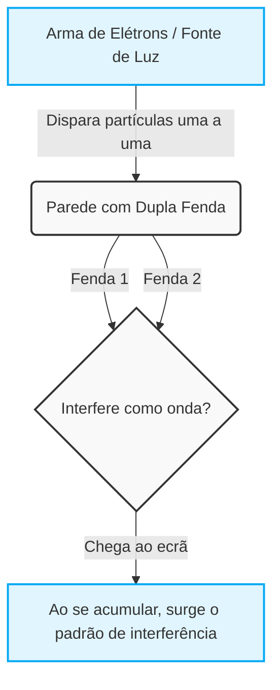
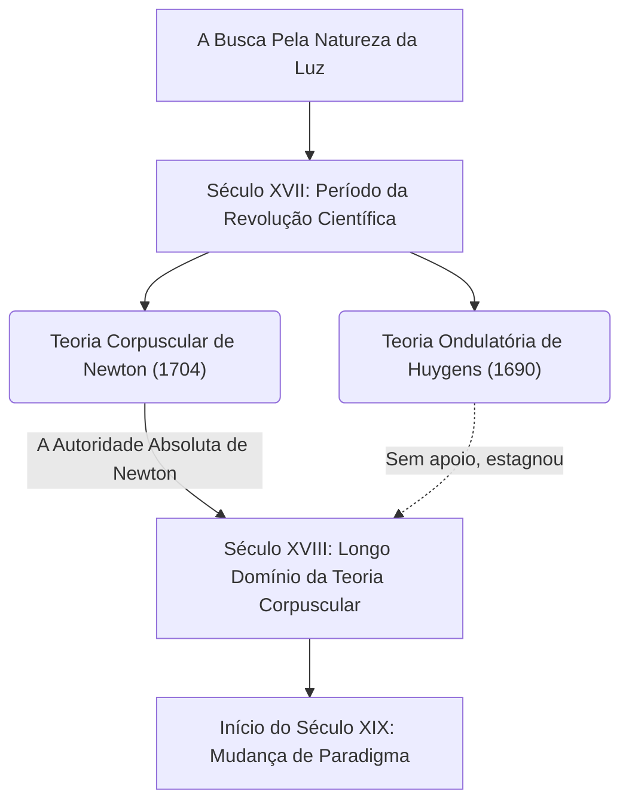
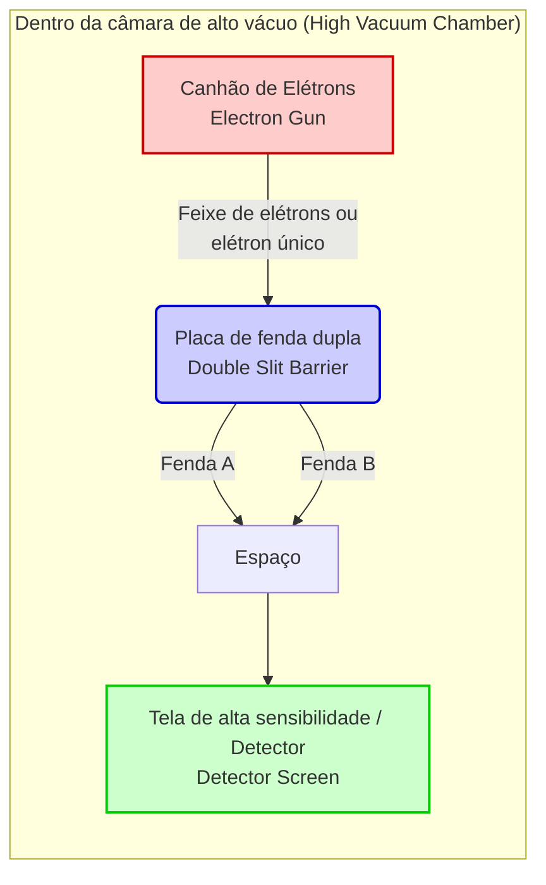

---
title: '[Guia Completo] Entenda o ''Experimento da Dupla Fenda'', o Maior Mistério da Mecânica Quântica'
slug: "double-slit-experiment-ultimate-guide"
date: "2026-09-08T01:00:00+09:00"
tags: ["Física", "Mecânica Quântica", "Experiência da Dupla Fenda", "Equação de Schrödinger"]
categories: ["Física e Ciência"]
math: true
mermaid: true
image: "cover.webp"
description: 'Uma análise detalhada sobre o ''Experimento da Dupla Fenda'', frequentemente considerado o experimento mais bonito da história da física. Resumimos de forma clara e acessível aos iniciantes as anomalias do mundo microscópico, onde o senso comum macroscópico falha, e os profundos mistérios da mecânica quântica.'
---
## 1. [Introdução] O Que É a Experiência da Dupla Fenda?

O mundo em que vivemos parece ser governado por regras firmes. Uma bola lançada ao ar desenha uma parábola ao cair, e ao atirar uma pedra na água, ondulações se espalham. Este é o senso comum do "mundo macroscópico" descrito pela física clássica, incluindo a mecânica newtoniana, e está perfeitamente alinhado com a nossa intuição. No entanto, no momento em que entramos no "mundo microscópico" da unidade mínima fundamental que compõe a matéria, como os átomos, elétrons ou partículas de luz (fótons), esse senso comum desmorona ruidosamente. É um domínio onde os nossos sentidos e intuições quotidianas não têm qualquer utilidade, governado por regras extremamente bizarras e incompreensíveis.

O que nos confronta com a anormalidade desse mundo microscópico da forma mais simples e chocante é a "Experiência da Dupla Fenda (Double-slit experiment)". Richard Feynman, um genial físico que representou o século XX, disse sobre esta experiência que é "o único mistério da mecânica quântica" e ainda comentou que "todos os mistérios da mecânica quântica estão contidos nesta experiência". Além disso, muitos físicos de renome não param de chamá-la de "a experiência mais bela da história da física". Então, por que uma experiência tão simples, que consiste em fazer apenas duas fendas (frestas) em uma placa, é tratada como algo tão especial e continua a fascinar os cientistas?

### O Mundo Macroscópico e Microscópico Que Desafiam a Intuição

Em primeiro lugar, imaginemos os fenómenos do mundo macroscópico onde a nossa intuição funciona de forma precisa.
Por exemplo, suponhamos que existe uma máquina que dispara sucessivamente pequenas bolas pintadas com tinta (ou podem ser balas de metralhadora) em direção a uma parede. À sua frente, encontra-se uma placa de ferro com duas fendas (frestas) finas e verticais alinhadas. Ao disparar as bolas aleatoriamente, apenas aquelas que passam por uma das fendas atingem a parede ao fundo, deixando uma marca de tinta. Como resultado, deverão surgir na parede marcas de "duas linhas verticais" com a mesma forma das duas fendas na frente. Este é o comportamento como uma "partícula" com uma trajetória definida da bola, sendo um resultado natural que qualquer pessoa pode prever intuitivamente.

De seguida, consideremos o caso de uma "onda". Colocamos um biombo com duas fendas num tanque de água e provocamos ondas a partir de um dos lados. Quando as ondas chegam às duas fendas, passam através delas e, usando cada fenda como uma nova fonte de ondas, espalham-se em direção ao fundo como duas ondas semicirculares. Então, quando estas duas ondas colidem uma com a outra, ocorre um fenómeno chamado "interferência". Nos locais onde as cristas das ondas se sobrepõem, formam-se ondas mais altas, e nos locais onde as cristas e os vales se sobrepõem, eles anulam-se mutuamente, tornando a superfície plana. Como resultado, na parede de trás (ou margem), forma-se um belo padrão de riscas alternadas onde a onda atinge com força e onde não atinge de todo, chamado "padrão de interferência". Esta é também uma propriedade básica das ondas que pode ser observada no quotidiano, seja na superfície da água ou com ondas sonoras.

Até aqui não há nada de estranho. Atirar partículas cria "duas linhas", e enviar ondas cria um "padrão de interferência". Este é o senso comum do mundo em que vivemos e a premissa da física clássica.

### Resumo da Experiência e a Razão Pela Qual é Chamada de "A Experiência Mais Bela"

No entanto, ao realizar uma experiência com exatamente a mesma estrutura usando entidades microscópicas como luz e elétrons, a situação sofre uma reviravolta repentina e a intuição humana é completamente traída.
Olhando para a história, em 1801, o físico inglês Thomas Young realizou esta experiência da dupla fenda pela primeira vez usando luz solar (Experiência de Young). Naquela época, a teoria proposta por Newton de que a luz era uma "partícula" era dominante, mas como resultado da experiência de Young, um belo "padrão de interferência" apareceu no ecrã. Com isso, foi apresentada uma prova conclusiva de que "a luz é uma onda", e parecia que um longo debate tinha sido resolvido de uma vez por todas.

O verdadeiro mistério e a maior mudança de paradigma na física começam aqui. Entrando no século XX, com o extraordinário avanço das técnicas experimentais, tornou-se possível disparar luz ou elétrons "um a um". O elétron tem massa e ocupa uma posição específica no espaço, sendo sem dúvida uma "partícula" definida. Dispara-se apenas um elétron a partir de uma arma de elétrons, passando pela dupla fenda, fazendo com que chegue como um único ponto isolado (ponto luminoso) em algum lugar no ecrã. Neste ponto, ao observar o vestígio no ecrã, o elétron está inequivocamente a comportar-se como uma partícula.
E então, este "disparo de elétrons um a um" é repetido milhares e dezenas de milhares de vezes, um número de vezes de perder a cabeça. Dado que os elétrons estão sempre a voar apenas um de cada vez, é fisicamente impossível colidirem com outros elétrons no ar e interferirem como ondas. Naturalmente, todos pensaram que deveriam aparecer no ecrã "duas linhas" correspondentes à forma das fendas, exatamente como quando se atiram as bolas.

No entanto, à medida que inúmeros pontos de elétrons se acumulavam no ecrã, o que emergiu foi um padrão inacreditável. Era o "padrão de interferência", que só deveria aparecer quando as ondas colidem umas com as outras.

Os elétrons, que são "partículas" que supostamente foram disparadas uma a uma, de alguma forma comportam-se como uma "onda" no seu todo, interferindo consigo mesmos e desenhando um padrão de riscas. Afinal, o que significa isto? É como se um único elétron disparado se espalhasse pelo espaço como uma onda, passasse por ambas as fendas ao mesmo tempo, causasse auto-interferência, e no instante em que atinge o ecrã, reaparecesse como uma única partícula.
Ainda mais bizarro, assim que os cientistas instalaram um detetor (como se fosse uma câmara) ao lado da fenda para tentar verificar "por qual fenda o elétron passou", os elétrons subitamente perdem as suas propriedades como onda e, no ecrã, em vez de um padrão de interferência, aparecem apenas "duas linhas". Este fenómeno de mudar de comportamento ao ser "observado" arrastou os físicos para um vórtice de confusão ainda maior.

A maior razão pela qual a experiência da dupla fenda é chamada de "a experiência mais bela da física" é porque, sem o uso de aceleradores de grande escala ou fórmulas matemáticas extremamente complexas, ela realça os mistérios fundamentais do universo com uma configuração extremamente simples e elegante de apenas duas frestas e um ecrã. Ela mostra-nos de forma vívida e visual o momento em que o senso comum do mundo macroscópico desmorona de forma espetacular. Não se limita a uma mera confirmação de um fenómeno físico, mas continua a colocar-nos questões filosóficas e epistemológicas extremamente profundas, tais como "O que é a realidade?" e "Será que este mundo que 'vemos' existe realmente de forma objetiva?". Dentro desta única e simples experiência, estão condensados os limites do intelecto humano e o infinito romance da ciência que tenta superá-los.

## 2. [História] A Luz é Onda ou Partícula? A Trajetória de um Debate Sem Fim

Desde que a humanidade reconheceu a existência da "luz", a busca pela sua verdadeira natureza nunca cessou. Desde a época da Grécia Antiga, filósofos e matemáticos como Empédocles e Euclides ponderaram sobre os mecanismos da luz e da visão, mas foi no século XVII que começou uma abordagem séria como ciência moderna. O debate que se iniciou nessa época, sobre se "a luz é uma partícula ou uma onda", dividiu a comunidade da física por mais de 300 anos, tornando-se, por fim, a força motriz que abriu as portas para uma física inteiramente nova chamada mecânica quântica. Nesta secção, traçaremos detalhadamente a trajetória desta grandiosa história da ciência.

### 2.1 A Teoria Corpuscular de Newton vs A Teoria Ondulatória de Huygens: O Choque do Século XVII

No final do século XVII, em plena Revolução Científica, foram apresentadas duas teorias poderosas sobre a verdadeira natureza da luz. Tratam-se da "Teoria Corpuscular (Corpuscular theory)" de Isaac Newton e da "Teoria Ondulatória (Wave theory)" de Christiaan Huygens.

#### A Teoria Corpuscular de Newton

Isaac Newton, a estrela gigante da física moderna, conhecido pela lei da gravitação universal e outras, considerava que a luz era um conjunto de partículas minúsculas (corpúsculos). Num artigo de 1672 e na sua obra principal de 1704, "Óptica (Opticks)", Newton explicou de forma brilhante a propriedade de propagação retilínea da luz e as leis da reflexão nos espelhos, usando um modelo mecânico no qual partículas saltam contra uma parede. Além disso, sobre o fenómeno em que a luz branca é separada em sete cores por um prisma (espetroscopia), ele argumentou que diferentes cores de luz eram partículas de massas diferentes, e que isso se devia às diferentes taxas de refração ao passar por um meio.
Em relação à teoria ondulatória, Newton assinalou que "se a luz fosse uma onda como o som, ela deveria contornar obstáculos e alcançar a sua parte traseira (fenómeno de difração), mas a luz viaja em linha reta e cria uma sombra bem definida", refutando assim a ideia de que era uma onda.

#### A Teoria Ondulatória de Huygens

Por outro lado, o proeminente físico neerlandês Christiaan Huygens argumentou, no seu "Tratado Sobre a Luz (Treatise on Light)" publicado em 1690, que a luz era uma onda (onda longitudinal) propagando-se através de um meio elástico que preenche o espaço sideral chamado "éter". Huygens propôs o famoso "Princípio de Huygens (Huygens' Principle)", no qual "cada ponto numa frente de onda torna-se a fonte de uma nova onda secundária", e explicou brilhantemente as leis da propagação retilínea, reflexão e refração da luz de forma geométrica.
Particularmente em relação à refração, enquanto Newton previu que "quando a luz entra num meio denso como a água ou o vidro, a partícula acelera devido à atração gravitacional e, portanto, a velocidade da luz aumenta", a teoria ondulatória de Huygens concluiu que "num meio denso, a velocidade de propagação da onda torna-se mais lenta", colocando os dois em oposição direta.

No entanto, devido à autoridade e influência absolutas de Newton na comunidade científica da época, a teoria ondulatória de Huygens gradualmente recuou para as sombras, e a teoria corpuscular de Newton continuou a reinar como predominante ao longo do século XVIII.

## 2.2 O experimento da dupla fenda de Thomas Young (1801) e a vitória da teoria ondulatória da luz

No início do século XIX, ocorreu um evento decisivo que desmoronou o reduto da teoria corpuscular que havia dominado por muito tempo. O protagonista foi o polímata britânico Thomas Young. Médico e alguém que contribuiu para a decifração dos hieróglifos egípcios (Pedra de Roseta), Young realizou em 1801 um experimento que brilha na história da física: o "Experimento de interferência de Young (posteriormente conhecido como experimento da dupla fenda)".

#### A descoberta das franjas de interferência

A configuração experimental de Young era extremamente simples e engenhosa. Ele passou a luz solar por um orifício (ou fenda) muito fino para criar uma fonte de luz pontual e, em seguida, fez essa luz passar por duas fendas estreitas muito próximas uma da outra (dupla fenda), projetando-a em uma tela ao fundo.

Se a luz fosse puramente "partícula", como dizia Newton, deveriam ser projetadas na tela duas linhas brilhantes correspondentes à forma das fendas. No entanto, o que Young viu na tela foi um padrão de listras alternadas brilhantes e escuras, ou seja, "franjas de interferência (Interference fringes)".

Esse fenômeno era absolutamente inexplicável a menos que se considerasse a luz como uma onda. Quando duas ondas se encontram na superfície da água, ocorre um fenômeno onde as cristas das ondas se sobrepõem e ficam mais altas (interferência construtiva), e onde uma crista e um vale se sobrepõem elas se anulam e ficam planas (interferência destrutiva). Young concluiu que as ondas de luz que saíam das duas fendas estavam interferindo da mesma maneira.

#### Fundamentação matemática e o estabelecimento da teoria ondulatória

As condições para essa interferência construtiva e destrutiva são determinadas pela diferença no comprimento do trajeto (diferença de caminho óptico $\Delta L$) das duas fendas até um ponto na tela. Considerando o espaçamento das fendas como $d$, o ângulo para a tela como $\theta$, e o comprimento de onda da luz como $\lambda$, a diferença de caminho óptico é expressa da seguinte forma:

$$ \Delta L = d \sin \theta $$

* **Linhas brilhantes (condição de interferência construtiva)**: $\Delta L = m\lambda \quad (m = 0, \pm1, \pm2, \dots)$
* **Linhas escuras (condição de interferência destrutiva)**: $\Delta L = \left(m + \frac{1}{2}\right)\lambda$

O anúncio de Young enfrentou inicialmente críticas severas e zombaria dos seguidores de Newton na Grã-Bretanha. No entanto, mais tarde, em 1815, o francês Augustin-Jean Fresnel formulou a difração e a interferência da luz como uma rigorosa teoria matemática. Além disso, em um concurso da Academia Francesa de Ciências em 1818, o juiz Siméon Denis Poisson (um oponente da teoria ondulatória) apontou que "se a teoria de Fresnel estivesse correta, deveria haver um ponto brilhante no centro da sombra de um obstáculo circular. Um absurdo assim é impossível". No entanto, quando François Arago (Dominique-François-Jean Arago) realmente realizou o experimento e observou perfeitamente esse "ponto de Poisson" (ponto de Arago), a validade da teoria ondulatória tornou-se indiscutível.

Em 1850, Léon Foucault e outros provaram experimentalmente que a velocidade da luz na água é mais lenta do que no ar, negando completamente a previsão de Newton. E em 1864, James Clerk Maxwell, como a culminação do eletromagnetismo, estabeleceu a teoria de que "a luz é um tipo de onda eletromagnética", com a qual a "teoria ondulatória" da luz obteve uma vitória completa, e o debate pareceu ter chegado ao fim.

### 2.3 O renascimento da teoria corpuscular através da hipótese do quantum de luz de Einstein (1905)

A teoria de Maxwell de que a luz é uma onda eletromagnética era tão bela que os físicos do final do século XIX acreditavam que "a física está quase completa, restando apenas medir valores precisos". No entanto, entre o final do século XIX e o início do século XX, surgiu um fenômeno bizarro que a teoria ondulatória de forma alguma conseguia explicar. Tratava-se do "efeito fotoelétrico (Photoelectric effect)".

#### O mistério do efeito fotoelétrico

O efeito fotoelétrico é um fenômeno no qual elétrons (fotoelétrons) são ejetados de um metal quando a luz incide sobre sua superfície. De acordo com o senso comum da teoria ondulatória da época, a energia da luz (onda) deveria ser proporcional à sua amplitude (brilho). Portanto, pensava-se que "se uma luz forte (brilhante) for aplicada, os elétrons deveriam ser ejetados vigorosamente, não importa a cor da luz".

No entanto, os resultados experimentais contrariaram completamente as previsões da teoria ondulatória.

1. **Existência de uma frequência de corte**: Para luz com frequência menor (uma cor) do que um certo valor específico (por exemplo, luz vermelha), por mais forte (brilhante) que fosse ou por mais tempo que incidisse, os elétrons simplesmente não eram ejetados.
2. **Imediatismo**: Por outro lado, se a luz estivesse acima da frequência de corte (por exemplo, luz ultravioleta), por mais fraca que fosse, os elétrons eram ejetados imediatamente no momento da incidência.
3. **Dependência da energia**: A energia cinética dos elétrons ejetados dependia exclusivamente da frequência (cor) da luz, e não da sua intensidade (brilho).

#### A solução dramática de Einstein: O quantum de luz (fóton)

Quem desvendou esse mistério desesperador foi um jovem desconhecido que trabalhava no escritório de patentes da Suíça, Albert Einstein. Em 1905, conhecido como o "ano miraculoso", ele aplicou a "hipótese do quantum de energia", proposta por Max Planck em seu estudo da radiação térmica (1900), à própria luz, anunciando a "hipótese do quantum de luz (Light quantum hypothesis)".

Einstein assumiu ousadamente que a luz, que se pensava ser uma onda contínua, era, na verdade, um conjunto de partículas de pacotes de energia, isto é, "quanta de luz (fótons: Photon)". A energia $E$ de um único quantum de luz é proporcional à frequência $\nu$ da luz e é expressa pela seguinte fórmula de Planck-Einstein:

$$ E = h\nu $$

(Onde $h$ é a constante de Planck, $6.626 \times 10^{-34} \, \text{J}\cdot\text{s}$)

Usando essa hipótese, o mistério do efeito fotoelétrico foi resolvido como num passe de mágica.
O efeito fotoelétrico era um fenômeno parecido com o bilhar, onde "um único quantum de luz" colide com "um único elétron" no metal, transferindo toda a sua energia. Se a energia mínima necessária para o elétron superar a atração do metal for a "função trabalho ($W$)", a energia cinética máxima $E_k$ do elétron ejetado é expressa pela seguinte e magnífica equação:

$$ E_k = h\nu - W $$

Se a energia do quantum de luz $h\nu$ for menor do que a função trabalho $W$ (luz de baixa frequência), por mais que uma grande quantidade de quanta de luz colida (mesmo aumentando a intensidade da luz), os elétrons não conseguirão escapar do metal. Esta é a razão para a existência de uma frequência de corte.

#### Rumo a um mundo incompreensível de "ser onda e ser partícula"

A hipótese do quantum de luz de Einstein foi completamente comprovada em 1914 por um experimento preciso de Robert Millikan, o que rendeu a Einstein o Prêmio Nobel de Física de 1921 por essa conquista. (O próprio Millikan inicialmente não acreditava na teoria de Einstein e, ironicamente, acabou provando sua validade por meio dos experimentos que ele conduziu na tentativa de refutá-la). Além disso, em 1923, Arthur Compton descobriu o "espalhamento Compton", no qual o comprimento de onda dos raios-X muda quando eles colidem com elétrons, confirmando que a luz se comporta como uma "partícula" com momento   $p = \frac{h}{\lambda}$.

A "teoria corpuscular", que deveria ter sido completamente derrotada pelo experimento de Young, alcançou um renascimento milagroso 100 anos depois, sob a forma mais refinada do "quantum".
No entanto, isso criou uma contradição profunda. A luz passa a ter claramente as propriedades de uma onda, como a "interferência" mostrada no experimento da dupla fenda de Young, e simultaneamente possui as propriedades de uma "partícula", como mostrado no efeito fotoelétrico.

A luz é uma onda ou uma partícula?
A resposta final da física para esta pergunta foi violentamente contra a intuição humana: "A luz é ambas as coisas e nenhuma delas. A luz é uma entidade quântica que possui tanto as 'propriedades de onda' quanto as 'propriedades de partícula'". Esse foi o nascimento da "dualidade onda-partícula (Wave-particle duality)".
E este conceito de dualidade passou a ser aplicado não apenas à luz, mas também à própria matéria, como os elétrons (ondas de matéria de de Broglie), levando a física a adentrar em um abismo sem precedentes: o mundo estranho e fascinante da "mecânica quântica". O palco mais simbólico de tudo isso é o "experimento quântico da dupla fenda", atualizado para a versão moderna.

## 3. [Ponto de virada] A matéria também é uma onda? Ondas de de Broglie e o experimento da dupla fenda com elétrons

Com a hipótese do quantum de luz de Einstein (1905) sugerindo que a luz "é uma onda e, ao mesmo tempo, uma partícula", o mundo da física encontrava-se em meio a um grande turbilhão de confusão e mudança de paradigma. Apesar de ter se acreditado por muitos anos que "a luz é absolutamente uma onda", devido ao experimento de interferência de Young e ao eletromagnetismo de Maxwell, fenômenos como o efeito fotoelétrico só podiam ser explicados se a luz fosse considerada como "partículas (fótons)". Inicialmente, acreditava-se que essa propriedade bizarra da "dualidade onda-partícula" era uma peculiaridade exclusiva da luz. No entanto, na década de 1920, esse conceito de dualidade não se restringiria ao mundo da luz, mas mostraria suas presas para a própria "matéria" que compõe os nossos corpos.

### 3.1. A proposta das ondas de matéria de Louis de Broglie: Um salto a partir da bela simetria

Em 1924, Louis de Broglie, um jovem estudante de pós-graduação francês, propôs em sua tese de doutorado uma hipótese extremamente ousada que abalaria a história da física desde as suas fundações. A hipótese era: "Se a luz (considerada uma onda) possui propriedades de partícula, então, inversamente, a matéria, como os elétrons (considerada partícula), também não possuiria propriedades de onda?".

A intuição filosófica de de Broglie de que a natureza sempre favorece a simetria estava na raiz dessa hipótese. Ele aplicou a relação entre energia e momento, derivada por Einstein na teoria da relatividade restrita e na hipótese do quantum de luz, também para partículas materiais com massa. O momento $p$ de um fóton é expresso como $p = h / \lambda$, utilizando a constante de Planck $h$ e o comprimento de onda $\lambda$. De Broglie inverteu isso e expressou o comprimento de onda $\lambda$ da onda associada a uma partícula com massa $m$ e que se move com velocidade $v$ (momento $p = mv$) com uma fórmula muito simples, como a seguinte:

$$ \lambda = \frac{h}{p} = \frac{h}{mv} $$

Esta é a famosa fórmula do "comprimento de onda de de Broglie (comprimento de onda da onda de matéria)". Esta equação significa que tudo o que se move, desde bolas de beisebol e carros que vemos em nosso cotidiano até minúsculos elétrons, possui a propriedade de "onda". Então, por que não vemos bolas de beisebol interferirem ou difratarem como ondas na vida diária? A razão é que a constante de Planck $h$ (aproximadamente $6.626 \times 10^{-34} \text{ J}\cdot\text{s}$) é incrivelmente pequena. Para objetos macroscópicos, a massa $m$ é muito grande, de modo que o comprimento de onda de de Broglie $\lambda$ se torna tão pequeno que pode ser praticamente considerado zero, ocultando completamente o comportamento ondulatório. No entanto, no mundo dos elétrons, cuja massa é extremamente pequena, esse comprimento de onda atinge uma escala comparável à dos raios-X (ondas eletromagnéticas) (aproximadamente $0.1 \text{ nm}$, por exemplo), manifestando-se em um tamanho que não pode ser ignorado.

O artigo de de Broglie estava tão fora do senso comum que deixou os examinadores da época muito perplexos. No entanto, quando um dos examinadores, Paul Langevin, enviou o trabalho para Einstein, este o elogiou muito, dizendo: "Ele levantou a ponta de um grande véu". Com isso, o conceito de "onda de matéria (matter wave)" de de Broglie atraiu a atenção mundial, levando diretamente à posterior formulação da mecânica ondulatória por Schrödinger.

### 3.2. O experimento de Davisson-Germer: A prova da natureza ondulatória da matéria

Embora a hipótese de de Broglie fosse bela como teoria, restava aguardar a comprovação experimental para saber se ela de fato descrevia a natureza real. Sob a crença de que "se o elétron for realmente uma onda, ele deve produzir fenômenos característicos das ondas, como 'difração' e 'interferência'", físicos do mundo todo começaram a realizar experimentos para capturar o comportamento ondulatório dos elétrons.

E em 1927, uma evidência conclusiva finalmente foi revelada. Foi o "experimento de Davisson-Germer", conduzido por Clinton Davisson e Lester Germer, físicos do Bell Labs nos Estados Unidos.

Eles estavam inicialmente conduzindo o experimento com outro propósito, o de investigar a dispersão de um feixe de elétrons disparado contra um cristal de níquel. No entanto, na tentativa de recuperar um acidente durante o experimento (oxidação da superfície de níquel devido à quebra de um tubo de vácuo), aqueceram o níquel a altas temperaturas, e tiveram a sorte de que, acidentalmente, o níquel formou um monocristal. Ao incidir novamente o feixe de elétrons sobre este níquel monocristalizado, um fenômeno notável foi observado. A intensidade dos elétrons espalhados apresentou um padrão claro de "difração", atingindo um valor máximo em um ângulo específico.

O espaçamento em que os átomos estão dispostos regularmente no cristal (constante de rede) está na mesma escala de grandeza que o comprimento de onda de de Broglie dos elétrons. Ou seja, o próprio cristal de níquel atuou como uma "rede de difração natural" para os elétrons. O resultado retrocalculado por Davisson e Germer do comprimento de onda dos elétrons a partir deste padrão de difração coincidiu perfeitamente com o valor previsto pela equação de de Broglie, $\lambda = h/p$. No mesmo ano, George Paget Thomson, do Reino Unido (filho de J.J. Thomson, o descobridor do elétron), também conseguiu observar anéis de difração (anéis de Debye-Scherrer) produzidos pela passagem de um feixe de elétrons através de uma fina folha metálica.

Esses resultados experimentais confrontaram a comunidade de física com o fato indubitável de que a matéria possui as propriedades de uma onda. O elétron, que deveria ser uma partícula, se comporta como uma onda. Este foi o momento em que a profunda verdade da natureza foi revelada, e também foi a fanfarra que anunciou a alvorada da mecânica quântica. De Broglie recebeu o Prêmio Nobel de Física em 1929, enquanto Davisson e Thomson o receberam em 1937.

### 3.3. O experimento definitivo da dupla fenda pela Hitachi (Akira Tonomura e colegas) (1989)

Mesmo após provar que os elétrons são ondas, a busca dos físicos não parou. Era a tentativa de executar na realidade, e com extrema precisão, o "experimento da dupla fenda com elétrons" que vinha sendo discutido como um experimento mental.

Assim como no experimento da dupla fenda com luz (experimento de Young), se elétrons forem disparados em direção a uma dupla fenda, franjas de interferência deveriam aparecer na tela ao fundo. No entanto, é aqui que o paradoxo mais incompreensível da mecânica quântica se revela: "E se os elétrons não fossem disparados todos de uma vez em grande quantidade, mas sim disparados **1 de cada vez**?"

Um único elétron é uma partícula indivisível. Portanto, ele só deveria ser capaz de passar por uma das fendas, a da esquerda ou a da direita. Os elétrons que chegam à tela um por um deixarão apenas um ponto luminoso nela. Quando isso for repetido dezenas de milhares de vezes, o aglomerado de pontos formará apenas a sombra das duas fendas (duas linhas) ou se tornará um padrão de franjas de interferência que mostra as propriedades de uma onda?

Para essa questão definitiva, foi a equipe de pesquisadores do Laboratório de Pesquisa Básica da Hitachi no Japão (Dr. Akira Tonomura e colegas) que superou as limitações técnicas e apresentou a resposta mais bela e perfeita do mundo. Em 1989, eles usaram a tecnologia de holografia de elétrons e a tecnologia de microscópio eletrônico de ultra-alto vácuo e temperaturas criogênicas para ter sucesso brilhante no "experimento de interferência de biprisma de elétron único".

A configuração experimental foi espantosa. Eles reduziram ao máximo o número de elétrons emitidos pelo canhão de elétrons, criando um estado onde "havia sempre apenas um elétron dentro do dispositivo" enquanto o elétron voava pelo espaço. A velocidade do elétron alcança cerca de 150 mil quilômetros por segundo, e o tempo necessário para voar a distância da fonte de luz até o detector é apenas de um instante. O próximo elétron só seria disparado muito tempo depois que o elétron anterior tivesse atingido a tela.

Quando o experimento começou, pontos luminosos indicando a chegada dos elétrons começaram a aparecer no detector (monitor), um a um. Nas etapas iniciais de apenas alguns, ou algumas centenas de pontos, parecia haver apenas pontos espalhados aleatoriamente pela tela. Parecia não haver ordem alguma ali, como as estrelas no céu noturno.

No entanto, à medida que milhares e dezenas de milhares de elétrons se acumulavam, uma cena surpreendente e óbvia para os olhos de qualquer um começou a emergir. O aglomerado de pontos que parecia desordenado foi gradualmente formando um padrão regular de listras claras e escuras — inequivocamente, "franjas de interferência".

O significado desse resultado contradizia fortemente a intuição. O elétron indubitavelmente atinge a tela como "uma única partícula" (e é por isso que um único ponto é registrado). Mas o fato de formar um padrão de interferência como um todo só pode ser interpretado como se esse elétron único "tivesse atravessado simultaneamente ambas as fendas (ambos os lados do biprisma) como uma onda e interferido consigo mesmo". Um elétron solitário que não interage com mais nada cria interferência consigo mesmo. O mesmo princípio descrito por Dirac quando ele disse que "cada fóton interfere apenas com ele mesmo" foi perfeitamente demonstrado também para o elétron, que é uma partícula material com massa.

Este experimento pelo Dr. Akira Tonomura e sua equipe foi aclamado no mundo inteiro como a demonstração mais visual e direta da estranheza da mecânica quântica, ou seja, a "dualidade onda-partícula". Não é surpresa que este "experimento da dupla fenda com elétrons" tenha sido eleito de forma retumbante como o número 1 na votação de leitores do "experimento mais belo da história da física", conduzida pela revista científica britânica "Physics World" em 2002.

Assim, a hipótese excêntrica de de Broglie de que "a matéria é uma onda" revelou sua verdadeira forma diante de nossos olhos mais de 60 anos depois, como as misteriosas franjas de interferência traçadas por elétrons individuais. No entanto, embora este experimento tenha resolvido os mistérios da mecânica quântica, ele também abriu as portas para um mistério ainda mais profundo, a saber, o "problema da medição". "Se tentarmos observar por qual fenda ele passou, as franjas de interferência desaparecem" — no próximo capítulo, vamos adentrar ainda mais nas profundezas deste estranho mundo quântico.
## 4. [Métodos e Resultados do Experimento] O que exatamente está acontecendo

(Para chegar ao cerne do experimento de fenda dupla e perscrutar o abismo da mecânica quântica, vamos focar a explicação aqui em experimentos usando "elétrons" em vez de luz. O mesmo fenômeno foi confirmado com fótons e outras partículas elementares, e até mesmo com moléculas relativamente grandes como o fulereno, mas usar elétrons, que têm massa e que reconhecemos como "claramente partículas materiais", faz com que o paradoxo e a estranheza desse fenômeno se destaquem ainda mais.)

### 4.1 Configuração do equipamento do experimento: O palco para capturar o mundo microscópico

Primeiro, vamos analisar em detalhes como é montado o palco (a configuração) onde ocorre este experimento histórico e inovador. A estrutura conceitual do experimento de fenda dupla é surpreendentemente simples, mas para torná-lo bem-sucedido como um experimento físico real, exige-se tecnologia altamente avançada e controle ambiental extremamente rigoroso.

O equipamento do experimento é composto por três componentes principais descritos a seguir. Todos eles são dispostos hermeticamente selados em uma câmara de alto vácuo avançada, para evitar o espalhamento de elétrons devido a colisões com moléculas de ar.

1. **Canhão de Elétrons (Electron Gun)**:
   É o dispositivo para disparar "elétrons", os protagonistas do experimento. Utilizando o princípio de aquecer um filamento para emitir elétrons termiônicos ou usar um forte campo elétrico para extraí-los, dispara-se elétrons com energia cinética constante em uma direção determinada. O que é de extrema importância neste experimento é que os elétrons podem ser disparados continuamente como uma cachoeira na forma de um poderoso "feixe" ou, surpreendentemente, a saída pode ser reduzida ao limite extremo para dispará-los de modo controlado, "com segurança, um a um". Esta "tecnologia de emissão de elétron único" é uma das tecnologias sofisticadas indispensáveis em experimentos modernos de mecânica quântica.

2. **Fenda Dupla (Double Slit)**:
   É uma placa de blindagem (parede) com duas fendas (frestas) extremamente estreitas e dispostas paralelamente a uma distância muito curta, por onde passam os elétrons disparados pelo canhão de elétrons. Como o comprimento de onda da "onda de matéria (onda de de Broglie)" do elétron é muito curto, a largura dessas fendas e a distância entre elas devem ser fabricadas com precisão em tamanho microscópico na escala de nanômetros (bilionésimos de metro) a micrômetros. Se a largura das fendas ou o espaçamento entre elas forem muito grandes em relação ao comprimento de onda do elétron, não será possível observar claramente a "interferência", que é uma propriedade ondulatória. A própria tecnologia para fabricar essa fenda dupla minúscula é a cristalização da tecnologia de microfabricação de ponta, como os equipamentos de litografia por feixe de elétrons.

3. **Tela (Detector, Screen / Detector)**:
   É uma tela de observação na qual os elétrons que passaram com sucesso pela fenda dupla chegam, para que sua posição final seja registrada. Antigamente, utilizavam-se chapas fotográficas sensíveis à luz, mas hoje em dia são usadas câmeras CCD de alta sensibilidade, telas fluorescentes e detectores especiais de pixels semicondutores. Isso permite que se registre "onde o elétron chegou (atingiu)" como uma coordenada bidimensional extremamente precisa a cada disparo. Quando um elétron atinge a tela, ele emite um minúsculo brilho ou gera um sinal elétrico, deixando um traço claro (um ponto) de que "sem dúvida, chegou ali como uma única partícula".

A figura abaixo ilustra esquematicamente a disposição geral deste equipamento experimental e a trajetória dos elétrons.

### 4.2 Ao atingir com um grande número de elétrons: O comportamento como onda que desafia a intuição (formação do padrão de interferência)

Bem, vamos finalmente iniciar o experimento. Como primeiro passo, aumenta-se a potência do canhão de elétrons para disparar "um grande número de elétrons" em sucessão, como um jato ou uma metralhadora, em direção à fenda dupla.

De acordo com o nosso senso comum baseado na física clássica do dia a dia, o elétron é uma "partícula" com massa (como uma pequena bala). Portanto, seria de se esperar que os muitos elétrons que atravessaram as duas fendas concentrassem suas colisões em duas áreas da tela situadas na extensão linear de cada fenda, formando um padrão similar a "duas listras verticais". Imagine pulverizar tinta com um spray sobre uma placa de estêncil (molde) com duas aberturas. A tinta que passa pelas frestas deve desenhar duas linhas na parede com a mesma forma das aberturas.

Contudo, o padrão que realmente aparece na tela trai completamente a nossa intuição e previsão. Na tela, em vez de duas listras verticais simples, forma-se claramente **várias faixas de listras claras e escuras (padrão de interferência: Interference Pattern)** .

Este "padrão de interferência" tem as mesmas características geométricas do padrão formado pelas ondulações superpostas que surgem quando se jogam duas pedras simultaneamente na superfície da água de um lago, ou dos padrões vistos em experimentos de interferência da luz.
- **Nos locais onde as cristas das ondas ou os vales das ondas se sobrepõem (interferência construtiva)** , forma-se uma listra "clara" (com alta densidade de colisão de elétrons), onde um grande número de elétrons chega.
- **Nos locais onde a crista e o vale das ondas se sobrepõem (interferência destrutiva)** , as ondas se anulam mutuamente, formando uma listra "escura" (com densidade de colisões quase nula), onde praticamente não chegam elétrons.

Apenas uma conclusão é possível a partir deste resultado: **"os elétrons estão se comportando como ondas"** . O enxame de elétrons disparado do canhão se propaga pelo espaço como ondas em uma superfície de água e passa pelas duas fendas "simultaneamente". A única interpretação cabível é que a onda difratada espalhada a partir da fenda A e a onda difratada espalhada a partir da fenda B se sobrepõem no espaço em frente à tela, causando interferência e criando esse distinto padrão de faixas claras e escuras.

O elétron, que se acreditava firmemente ser uma "partícula", na verdade tem também as propriedades de uma "onda" (a dualidade onda-partícula). Este fato por si só já é uma descoberta histórica e grandiosa na física, e suficientemente surpreendente. Mas o verdadeiro mistério da mecânica quântica, que vira de cabeça para baixo o nosso senso comum, aprofunda-se ainda mais a partir daqui.

### 4.3 Ao disparar elétrons "um por um": A verdadeira natureza da "onda de probabilidade" exposta por um experimento extremo

"Será que disparar muitos elétrons de uma vez faz com que eles colidam no ar ou se repilam pela força elétrica (força de Coulomb) e isso, no final, acabe criando um padrão semelhante a uma onda?"
É muito natural pensar assim como cientista. Na verdade, quando o padrão de interferência foi descoberto, muitos físicos pensaram dessa forma e tentaram interpretar o fenômeno pela óptica clássica.

Para pôr um fim definitivo a essa dúvida, a tecnologia experimental foi aperfeiçoada para a realização de um experimento decisivo. (No Japão, o experimento realizado em 1989 pelo grupo de Akira Tonomura, da Hitachi, é extremamente famoso e aclamado mundialmente como um dos experimentos mais belos já feitos).
Trata-se de um experimento em que a potência do canhão de elétrons é reduzida ao extremo, de modo a **disparar os elétrons "com total certeza, um de cada vez"** .

Especificamente, assegura-se que o elétron anterior tenha sido disparado, atingido a tela e desaparecido (ou sido absorvido) completamente antes que o próximo elétron seja disparado. Isso é repetido um número formidável de vezes: dezenas a centenas de milhares. Sob essa configuração, fica garantido que "há apenas um único elétron a qualquer momento" dentro do equipamento experimental. Portanto, é 100% fisicamente impossível que os elétrons colidam ou interfiram uns com os outros durante o voo.

Vamos seguir o desenrolar desse experimento de elétron único em condições extremas conforme o tempo avança (à medida que os elétrons se acumulam).

**Passo 1: Logo após o início do experimento (dezenas a centenas de elétrons)**
Na tela, os pontos começam a ser marcados um a um, em posições completamente aleatórias. No momento em que chega à tela, o elétron exibe claramente as propriedades de uma "partícula", marcando um único ponto em uma microcoordenada específica. Nesta fase, não é possível notar qualquer regularidade no padrão da tela, parecendo apenas um amontoado caótico e aleatório de pontos. É como atirar dardos totalmente ao acaso, de olhos vendados.

**Passo 2: Após a chegada de milhares a dezenas de milhares de elétrons**
Conforme o tempo passa e o experimento se repete, com a acumulação de alguns milhares a dezenas de milhares de pontos, um fenômeno estranho começa a ocorrer. Dentro da distribuição de pontos que parecia totalmente aleatória, começam a emergir gradualmente "viés" e "tonalidades". As áreas onde os pontos se concentram densamente começam a se diferenciar vagamente daquelas onde quase não há pontos.

**Passo 3: No fim do experimento (após a chegada de centenas de milhares ou mais elétrons)**
Depois de transcorrer um tempo bem longo e de se continuar atirando meticulosamente um número gigantesco de elétrons (centenas de milhares a milhões) um por um, ao olhar para a imagem completa acumulada na tela... vê-se exatamente o mesmo magnífico **"padrão de interferência"** que surgiu quando os elétrons foram disparados aos montes!

Esse é, na história da física, um dos resultados que mais causam arrepios e desafiam a intuição, e ao mesmo tempo é um dos mais belos e profundos.

Isso porque os elétrons foram disparados "absolutamente um por um". É totalmente impossível que um elétron interaja com o anterior ou o sucessor. Apesar disso, o fato de o resultado final ser um padrão de listras evidenciando a interferência de ondas nos leva a aceitar uma única conclusão inacreditável: **"um único elétron está interferindo consigo mesmo"** .

Se tentarmos explicar esse fenômeno usando a lógica, nosso senso comum diário de espaço e matéria entra em colapso completo.
Depois de disparado do canhão, 1 elétron único se espalha pelo espaço como se fosse uma "onda", **passa por ambas as fendas (a direita e a esquerda) "simultaneamente"** , interfere com "a sua própria onda" diante da tela e, no momento em que chega e é observado, se contrai novamente em um único ponto, apresentando-se como "uma partícula".

Mas afinal, qual é a verdadeira natureza dessa "onda" transmitida pelo espaço por 1 único elétron?
Na mecânica quântica, não se trata de uma onda tangível onde um meio físico como a água ou o ar flutua. De acordo com a interpretação de Max Born, esta é **"uma onda que representa a 'probabilidade' de o elétron existir naquele local específico no espaço (onda de probabilidade)"** . Matematicamente, ela é chamada de "função de onda".

Os elétrons não viajam em linha reta, ao longo de uma trajetória (rota) específica, como bolinhas de pinball. Do disparo até a chegada na tela, o elétron se espalha pelo espaço num estado "sobreposto" (superposição), onde "o estado de passar pela fenda da direita", "o estado de passar pela fenda da esquerda" e "estados de passar por qualquer outra via do espaço" se misturam em diferentes probabilidades.

E no instante em que ele se choca com o dispositivo de observação (a tela) e mede-se "onde ele chegou", a onda de probabilidade espalhada pelo espaço se contrai instantaneamente em um único ponto (o colapso da função de onda), determinando-se, pela primeira vez, a posição física real da partícula ("foi ali que ela bateu").

A "parte brilhante" (a parte onde, no fim, muitos pontos se reúnem) do padrão de interferência significa um local onde a probabilidade da presença do elétron foi aumentada através da interferência das ondas, e a "parte escura" (onde os pontos não se reúnem) significa um local onde as ondas de probabilidade se cancelaram mutuamente e chegaram a zero. Da mesma forma que, ao lançar um dado diversas vezes, a probabilidade de cair de cada lado se aproxima de um valor teórico (1/6), o "comportamento probabilístico" de cada elétron é repetido dezenas de milhares de vezes, fazendo emergir no padrão real o formato das ondas de probabilidade (o padrão de interferência).

"Um único elétron passa por duas fendas ao mesmo tempo", "o seu estado não é determinado até ser observado, existindo apenas como uma onda probabilística com inúmeras possibilidades sobrepostas".
Esses fatos experimentais frios que o experimento da fenda dupla joga em nossa cara nos levam a questionamentos filosóficos profundos que extrapolam a física: "o que fundamentalmente significa existir" e "o que é exatamente a realidade que nós reconhecemos?".

## 5. [Problema da Medição] O quantum altera o comportamento ao ser observado

A razão pela qual o experimento da fenda dupla da mecânica quântica influenciou profundamente não apenas a física, mas também os domínios da filosofia e do pensamento – sendo chamado de experimento mais belo e também o mais assustador da história da ciência – encontra-se justamente aqui. É o fato estarrecedor de que o simples ato de "observar (medir)" determina ou altera por completo o desfecho de um fenômeno físico.

No mundo macroscópico do dia a dia, ou seja, no mundo governado pela física clássica, "ver" é um mero ato passivo. Quer estejamos ou não olhando a lua brilhar no céu noturno, ela simplesmente existe lá, firmemente traçando sua órbita ditada pela mecânica newtoniana. Olhar não muda sua rota. O fato de que a existência do observador não causa impacto sobre a realidade objetiva de seu alvo observado é um pilar do nosso firme senso comum.

No entanto, no mundo microscópico quântico, esse senso comum é revirado de ponta-cabeça. "Ver (observar)" não se trata de uma mera aquisição passiva de informação, mas sim um processo ativo capaz de impor ao alvo influências determinantes e irreversíveis. No exato instante que o observador introduz sua pergunta à natureza, a natureza altera seu comportamento. Nesta seção, nos aprofundaremos em detalhes sobre o maior mistério do experimento da fenda dupla — um problema no qual o debate permanece fervoroso até os dias de hoje por parte da física contemporânea, o chamado "Problema da Medição (Measurement Problem)".

### O que acontece ao "observar" por qual fenda ele passou

Imaginemos o processo de disparar elétrons ou fótons (ou moléculas gigantes como o fulereno C60) um a um, fazendo-os atravessar as duas fendas até que alcancem a tela. Como explicado anteriormente, mesmo enviando o alvo individualmente com intervalos de tempo, uma bela franja de interferência (evidência de uma natureza ondulatória) é formada quando os pontos de brilho acumulados na tela ao longo de um extenso período são observados. Isso é interpretado como o resultado do alvo quântico se espalhar ao longo do espaço com uma superposição (Superposition) de dois estados, "a possibilidade de passar pela fenda direita" e "a possibilidade de passar pela fenda esquerda", fazendo com que sua própria onda de probabilidade interfira consigo mesma.

Entretanto, aqui, os físicos levantaram uma dúvida natural, porém "demoníaca" no mundo quântico. Eles questionaram: "Os quanta realmente atravessam 'ambas as fendas ao mesmo tempo'? Ou eles estão 'na verdade atravessando apenas uma fenda, mas nós não sabemos disso'? Vamos colocar uma câmera perto da fenda para investigar."

Para responder a essa questão, uma única alteração é feita no equipamento do experimento. Um "detector (dispositivo de observação)" altamente sensível é alocado logo ao lado das fendas. O propósito deste detector é "observar" e registrar se o elétron passou pela fenda da direita ou pela fenda da esquerda. A configuração experimental permanece completamente a mesma, exceto pela adição desse detector. Os elétrons são disparados um a um. O detector opera perfeitamente, fornecendo dados exatos da trajetória do elétron (Which-path information), acusando com precisão se "passou pela direita" ou "passou pela esquerda". Como esperado, os registros confirmaram que metade dos elétrons passou pela direita e a outra metade passou pela esquerda. Com isso, nossa intuição estava satisfeita: "Viu? No fim das contas os elétrons viajavam apenas através de um dos furos como partículas. Aquela história de superposição não passava de uma ilusão".

No entanto, os físicos que finalmente verificaram o padrão de distribuição dos elétrons que chegaram à tela ficaram sem palavras. O que estava desenhado ali não era mais um belo padrão de interferência evidenciando propriedades ondulatórias, mas simplesmente "duas linhas (ou dois picos)". É exatamente o mesmo padrão que se forma quando se jogam partículas clássicas, como bolas de beisebol ou pedrinhas, contra as fendas. A "interferência de ondas", indispensável para a formação das franjas de interferência, havia desaparecido completamente.

No instante em que tentamos observar "por qual caminho passou", o elétron abandona sua propriedade ondulatória (estado de superposição) e passa a se comportar puramente como uma partícula clássica. Se você desligar o detector, as franjas de interferência reaparecerão, e se você o ligar, elas desaparecerão sem deixar rastros. Mais surpreendente ainda, foi demonstrado em experimentos posteriores (experimentos de apagador quântico) que as franjas de interferência retornam mesmo nos casos em que "os dados observacionais são gravados, mas apagados sem que ninguém os veja". O quantum age como se "soubesse" que estamos observando, ou se há informações de sua rota deixadas em algum lugar do universo. Isso é conhecido como "destruição da interferência pela obtenção de informações de caminho", servindo como a prova definitiva de quão distante o mundo quântico está da nossa intuição.

### Interpretação de Copenhague (Colapso do pacote de ondas)

Como devemos interpretar esse fenômeno extremamente incompreensível? A "Interpretação de Copenhague", estabelecida na década de 1920 centralizada em figuras como Niels Bohr, Werner Heisenberg e Max Born, é a interpretação mais padrão e ortodoxa da mecânica quântica.

Na Interpretação de Copenhague, considera-se que o quantum, antes de ser observado, existe apenas como uma "onda de probabilidade (função de onda)" que se espalha pelo espaço. A própria função de onda (geralmente expressa como $\Psi$) não é uma entidade física real, mas uma ferramenta matemática que representa a "amplitude de probabilidade" de encontrar o quantum em um determinado local. Essa onda de probabilidade evolui no tempo (muda) de maneira suave e determinística de acordo com a Equação de Schrödinger. No experimento da fenda dupla, a onda de probabilidade do elétron passa pelas fendas esquerda e direita, e ambas interferem uma na outra na frente da tela. Até aqui, trata-se de um mundo governado pelas propriedades das ondas, sendo um processo determinístico.

Porém, no instante em que ocorre o processo físico de "observação", essa função de onda sofre uma mudança drástica e descontínua. A isso dá-se o nome de "colapso do pacote de ondas (colapso da função de onda: Wavefunction Collapse)". No momento em que o detector capta que "o elétron passou pela fenda da direita", a onda de possibilidades, que se estendia por todo o espaço ("poderia passar pela esquerda", "poderia passar pelo meio"), desaparece instantaneamente, mais rápido do que a velocidade da luz, contraindo-se em uma única realidade (um ponto): "uma partícula que passou pela fenda da direita".

A afirmação mais radical e importante da Interpretação de Copenhague é que "antes da observação, o local e o estado do quantum 'não estão definidos'". Ela defende que não é o caso de haver algo lá e apenas não sabermos disso (isso é chamado de "teoria das variáveis ocultas"). Literalmente, afirma que "o próprio estado de probabilidade espalhado pelo espaço é a realidade", e a interação com um sistema macroscópico, como no caso da observação, "seleciona" aleatoriamente e "determina" apenas uma realidade dentre as inúmeras possibilidades.

Albert Einstein opôs-se veementemente a essa ideia ambígua e probabilística por toda a sua vida. A famosa frase "Deus não joga dados com o universo (God does not play dice with the universe)" expressa sua crítica a essa interpretação probabilística. Ele também ironizou, questionando: "Você está me dizendo que a lua não existe se eu não estiver olhando para ela?", afirmando continuamente que a mecânica quântica seria uma teoria incompleta (como exemplificado pelo Paradoxo EPR). Contudo, devido a testes experimentais posteriores das desigualdades de Bell (como os experimentos de Aspect), as teorias de variáveis ocultas locais almejadas por Einstein foram negadas, e até os dias atuais, incontáveis resultados de medições precisas continuam a apoiar a exatidão dessa assustadora Interpretação de Copenhague (ou modelos não locais e probabilísticos associados a ela, como a interpretação dos muitos mundos).

### Relação com o Princípio da Incerteza de Heisenberg

Por que o ato da observação altera inevitavelmente o estado do quantum e destrói o padrão de interferência? O mistério se elucida brilhantemente a partir de princípios mais fundamentais da física pelo "Princípio da Incerteza (Uncertainty Principle)", proposto por Werner Heisenberg em 1927.

O Princípio da Incerteza estabelece que, no mundo microscópico, é teoricamente impossível medir grandezas conjugadas simultaneamente (propriedades emparelhadas) de uma partícula, por exemplo, a "posição (onde está localizada)" e o "momento (qual é a massa e quão rápida está a partícula rumando para determinada direção)", com uma precisão infinita. Trata-se de uma lei elementar do universo.

A representação matemática disso é dada pela famosa desigualdade a seguir:

$$ \Delta x \cdot \Delta p \ge \frac{\hbar}{2} $$

Onde os respectivos símbolos indicam o que se segue:
- $\Delta x$ : "Incerteza da posição (o desvio padrão na medição posicional, ou espalhamento do erro)"
- $\Delta p$ : "Incerteza do momento (o desvio padrão na aferição do momento)"
- $\hbar$ : "Constante de Dirac (h cortado, constante reduzida de Planck)". Equivale à Constante de Planck $h$ dividida por $2\pi$, tendo um valor extraordinariamente pequeno de aproximadamente $1.054 \times 10^{-34} \mathrm{J\cdot s}$.

Essa fórmula determina que a multiplicação entre a "incerteza na posição" e a "incerteza no momento" será sempre maior ou igual a um valor fixo minúsculo ( $\hbar / 2$ ). Quer dizer, quanto mais apurada for a tentativa de apontar o local da partícula (fazer com que $\Delta x$ tenda a zero), de modo inversamente proporcional a incerteza no seu momento ( $\Delta p$ ) sofrerá divergência disparando rumo ao infinito. Isso causará com que fique incognoscível prever a rota do instante seguido. O oposto também vale: caso se tente aferir fielmente o momento, a sua posição ficará imprecisa, esfumaçada sobre todo o espaço.

O ponto vital é que isso não é um "erro originado pela má qualidade do aparelho de medição criado pelos humanos", mas sim a "natureza da flutuação fundamental no mundo natural" que é intrínseca ao próprio quantum. Ao quantum não é permitido possuir concomitantemente definidos números de posição fixos e momentos exatos de forma simultânea.

Vamos desvendar o "problema da medição" no experimento da fenda dupla usando a óptica do Princípio da Incerteza.
Ao utilizar detectores para tentar descobrir "se o elétron passou pela fenda direita ou pela fenda esquerda", estamos na verdade tentando "medir e especificar com alta precisão a posição vertical do elétron ( $x$ ) no plano das fendas" (fazendo com que $\Delta x$ seja consideravelmente menor que a distância entre as fendas).

A fim de possibilitar observarmos a posição desse elétron, devemos induzir certa interação com ele. Por exemplo, consideremos o caso de iluminar o elétron com luz (fótons) e ver a luz espalhada usando um microscópio (o experimento mental do microscópio de Heisenberg). Para distinguir se ele cruzou a fenda direita ou esquerda, teríamos de lançar luz com um comprimento de onda muito mais curto que o espaço da fenda, o que indica lançar luz com uma energia extremamente alta.

No entanto, ao fazer colidir fótons de alta energia em elétrons, de maneira comparável ao impacto da bola branca do bilhar em outras bolas; o fóton aplica um grande impacto (mudança no momento) sobre o elétron. Em consequência, o momento vertical ( $p$ ) do elétron fica de forma severa e aleatoriamente bagunçado (segundo o Princípio da Incerteza, em virtude do sacrifício imposto ao estreitar $\Delta x$, $\Delta p$ dispara amplamente).

O fato de que o momento do elétron, logo após cruzar a fenda, sofra perturbações aleatórias significa que a posição onde ele chegará em seguida na tela ficará completamente e caoticamente espalhada em todas as direções. Originalmente, a precisa franja de interferência em que a probabilidade se acumularia - ao manter a fase conservada em sua condição rítmica ondulatória superposta em um progresso propagado espalhado - é inteiramente destruída por esta perturbação (randomização das fases = decoerência). E assim, com as propriedades de interferência ondulada anuladas, o que irá se mostrar são apenas as duas linhas traçadas na tela pelas partículas clássicas dispersas ao cruzarem os dois orifícios.

Dessa forma, o Princípio da Incerteza prova através de fórmulas frias o cruel fato de que "é impossível adquirir informações da rota sem exercer nenhuma influência sobre o alvo (ou seja, preservando intactas suas propriedades ondulatórias e interferência)". O ato da observação é uma ação violenta em que, ao extrairmos uma informação determinante (a posição) do alvo, simultaneamente perturbamos outras informações cruciais que o alvo possui (o momento e a fase de sua natureza ondulatória), arrebatando-as para sempre aos recônditos incognoscíveis do universo. O experimento da fenda dupla pode ser considerado a demonstração suprema da mecânica quântica, ilustrando de forma inegável aos olhos de qualquer um o quanto esse Princípio da Incerteza e o colapso do pacote de ondas governam e imperam no mundo microscópico.
## 6. [Vanguarda] Fundamentos e Interpretação Moderna da Mecânica Quântica

O fato bizarro apresentado pelo experimento da dupla fenda, "é uma onda até ser observada, e no momento da observação torna-se uma partícula", lançou aos físicos profundas questões sobre a natureza fundamental do universo. Neste capítulo, mergulharemos no tema mais profundo da mecânica quântica: como descrever matematicamente esse fenômeno incompreensível e como devemos interpretá-lo. Aqui nos aguardam teorias e experimentos de vanguarda que subvertem fundamentalmente o nosso senso comum. As leis da física no micromundo operam sob princípios completamente diferentes do macromundo que experimentamos no nosso dia a dia.

### Equação de Schrödinger e Amplitude de Probabilidade

O mundo da mecânica quântica é dominado matematicamente pela "equação de Schrödinger", deduzida pelo físico austríaco Erwin Schrödinger em 1926. Assim como a equação de movimento na mecânica newtoniana ($F = ma$) descreve deterministicamente o movimento de objetos macroscópicos, a equação de Schrödinger descreve rigorosamente como o estado de uma partícula microscópica evolui ao longo do tempo (evolução temporal).

A equação de Schrödinger dependente do tempo mais fundamental, para uma única partícula de massa $m$ movendo-se em um espaço unidimensional, é expressa da seguinte forma:

$$ i\hbar \frac{\partial}{\partial t} \Psi(x, t) = \left[ -\frac{\hbar^2}{2m} \frac{\partial^2}{\partial x^2} + V(x, t) \right] \Psi(x, t) $$

Cada parte dessa equação diferencial parcial aparentemente complexa contém significados físicos importantes que caracterizam a mecânica quântica.

*   ** $i$ **: Unidade imaginária ($i^2 = -1$). Uma das maiores características da equação de Schrödinger é que a equação fundamental contém um número imaginário. Na mecânica quântica, os números complexos não são uma mera conveniência matemática, mas desempenham um papel essencial na descrição da natureza.
*   ** $\hbar$ ** (Constante de Dirac): O valor da constante de Planck $h$ dividida por $2\pi$ (aproximadamente $1.054 \times 10^{-34} \mathrm{J \cdot s}$). É a constante natural fundamental que determina a escala quântica e define a fronteira entre o micro e o macro.
*   ** $\frac{\partial}{\partial t}$ **: Derivada parcial em relação ao tempo $t$. É parte do "operador de evolução temporal", que representa como o estado do sistema muda ao longo do tempo.
*   ** $\Psi(x, t)$ ** (Função de onda): É uma função de valores complexos que representa o estado do sistema na posição $x$ e no tempo $t$. Este é o elemento mais importante e contém toda a informação sobre o estado da partícula (posição, momento, energia, etc.).
*   ** $m$ **: A massa da partícula.
*   ** $-\frac{\hbar^2}{2m} \frac{\partial^2}{\partial x^2}$ **: Operador de energia cinética. Contém a derivada de segunda ordem em relação à posição e corresponde à energia cinética da partícula.
*   ** $V(x, t)$ **: Energia potencial. Representa o ambiente no qual a partícula se encontra (um campo de força como um campo eletromagnético ou campo gravitacional).
*   ** Todo o lado direito (Operador Hamiltoniano $\hat{H}$ ) **: O operador que representa a energia total do sistema (energia cinética + energia potencial). Em outras palavras, a equação como um todo mostra a relação em que "a energia total determina a variação temporal da função de onda".

Ao fornecer as condições iniciais e de contorno e resolver a equação de Schrödinger, podemos encontrar a função de onda $\Psi(x, t)$. No entanto, esse próprio $\Psi$ é um número complexo e não é uma grandeza física diretamente observável. O físico alemão Max Born propôs uma interpretação revolucionária sobre o significado físico dessa função de onda. Trata-se da "interpretação probabilística (Regra de Born)".

De acordo com a regra de Born, o quadrado do valor absoluto da função de onda, ou seja, $|\Psi(x, t)|^2$, representa a "densidade de probabilidade" de encontrar a partícula na posição $x$ no tempo $t$. A função de onda em si é chamada de "amplitude de probabilidade" e não é uma probabilidade propriamente dita, mas, ao ser elevada ao quadrado, torna-se uma probabilidade real.

O padrão de interferência no experimento da dupla fenda é compreendido precisamente como um padrão de variação na densidade de probabilidade (intensidade da onda) que surge como resultado da interferência dessas amplitudes de probabilidade, seguindo o princípio da superposição. Quanto mais alta a onda (maior a densidade de probabilidade) em um local, maior a probabilidade de a partícula ser observada na tela. Em outras palavras, o elétron não voa seguindo uma trajetória definida, mas se comporta como uma "onda de probabilidade de existência que se espalha por todo o espaço", e o ponto exato da tela que ele atingirá é determinado apenas de forma probabilística, até o momento exato em que a atinge. O fato de Einstein ter protestado dizendo que "Deus não joga dados" foi também uma resistência a essa probabilidade fundamental.

### Interpretação de Muitos Mundos e Teoria da Onda Piloto

A interpretação de Copenhague (a interpretação ortodoxa centrada em Niels Bohr, que afirma que a função de onda entra em colapso instantaneamente através da observação e um único resultado é escolhido aleatoriamente) consegue prever perfeitamente todos os resultados experimentais até hoje. No entanto, ela abriga problemas filosóficos profundos chamados de "problema da medição (ou observação)", tais como "por que o ato de observar altera as leis da física?", "o que é afinal um observador?" e "onde fica a fronteira entre o aparelho de medição macroscópico e o sistema microscópico?". Para evitar esse problema e tentar entender o mundo bizarro da mecânica quântica sem contradições, a partir de outros ângulos, existem várias interpretações. Os exemplos mais representativos são a "Interpretação de Muitos Mundos" e a "Teoria da Onda Piloto".

#### Interpretação de Muitos Mundos (Interpretação de Everett)

A "Interpretação de Muitos Mundos" (Many-Worlds Interpretation), proposta por Hugh Everett III em 1957, é um conceito familiar no mundo da ficção científica, mas na física é uma teoria extremamente séria. Everett negou completamente o processo de "colapso da função de onda pela observação", que é a parte mais antinatural da interpretação de Copenhague, e considerou que a equação de Schrödinger se aplica invariavelmente e sem exceção a todo o universo.

De acordo com a interpretação de muitos mundos, quando observamos um sistema em um estado de superposição quântica (por exemplo, uma superposição do estado de passar pela fenda direita e do estado de passar pela fenda esquerda), a função de onda não colapsa para se tornar um ou outro; em vez disso, considera-se que o próprio universo se ramifica (dividindo-se em estados independentes por meio de um processo físico chamado de decoerência).

Em outras palavras, cada vez que um elétron é disparado no experimento da dupla fenda, um "universo em que o elétron passou pela fenda direita" e um "universo em que o elétron passou pela fenda esquerda" se ramificam infinitamente e passam a existir paralelamente. Como nós, os observadores, também somos parte do universo, nós mesmos nos ramificamos junto com a observação, e em cada universo o "eu que observou na direita" e o "eu que observou na esquerda" reconhecem resultados diferentes. Cada "eu" sente que está em um único universo. Embora elimine o mecanismo misterioso do colapso da onda e preserve a elegância matemática, ela exige uma mudança de paradigma que vai fortemente contra a nossa intuição: ter que aceitar a realidade de infinitos universos paralelos (multiverso).

#### Teoria da Onda Piloto (Teoria de De Broglie-Bohm)

A "Teoria da Onda Piloto" (Pilot-Wave Theory) ou "Mecânica Bohmiana", concebida por Louis de Broglie e desenvolvida em 1952 por David Bohm, adota uma abordagem completamente diferente da interpretação de muitos mundos.

Esta teoria é a representante típica das "teorias de variáveis ocultas", que afirma que a partícula tem sempre uma posição e trajetória bem definidas (ou seja, tem existência real, mesmo quando não a estamos observando). No entanto, a diferença para a mecânica clássica comum é a consideração de que existe uma onda invisível, chamada de "onda piloto" (campo potencial quântico), que se espalha por todo o espaço, e que essa onda guia deterministicamente o movimento da partícula.

Aplicando isso ao experimento da dupla fenda, o próprio elétron disparado passa de forma definida sempre por uma das duas fendas. No entanto, a onda piloto que guia o elétron atravessa ambas as fendas como as ondas na superfície da água e sofre interferência. O elétron é transportado pegando carona no fluxo dessa onda piloto que sofreu interferência, de modo que a posição em que finalmente atinge a tela fica enviesada, formando um padrão de interferência como resultado. A trajetória exata seguida é totalmente determinada pela sua posição inicial no momento do disparo (a variável oculta).

A teoria da onda piloto possui a grande atração de manter uma visão de mundo determinística, sem necessitar nem do assustador colapso da função de onda, nem de universos paralelos que se multiplicam infinitamente. Contudo, devido à estrutura da teoria, ela carrega intrinsecamente a "não localidade" (Non-locality), em que a onda piloto afeta o espaço inteiro instantaneamente, superando a velocidade da luz; o que acarreta um novo problema: torna-se difícil uma integração elegante com a teoria da relatividade restrita de Einstein.

### Experimento da Borracha Quântica de Escolha Atrasada (O Tempo Retrocede?)

No meio dos debates sobre a interpretação da mecânica quântica, existem um experimento mental e um experimento real que são os mais misteriosos e que abalam pela raiz nossos conceitos de "tempo" e "causalidade". São o "Experimento de Escolha Atrasada", proposto por John Wheeler em 1978, e o "Experimento da Borracha Quântica de Escolha Atrasada" (Delayed-Choice Quantum Eraser Experiment), efetivamente testado e comprovado por Kim e colaboradores em 1999.

Em um experimento de dupla fenda comum, quando observamos a informação do trajeto (Which-way information), ou seja, "por qual fenda" o elétron ou fóton passou, a sua característica como onda se perde, e o padrão de interferência desaparece, resultando em duas faixas. Então, o que aconteceria se decidíssemos se queremos ou não observar a informação do trajeto exatamente no intervalo de tempo **após** a partícula ter atravessado a fenda e **antes** de atingir a tela? Esta é a ideia básica do experimento de escolha atrasada de Wheeler.

Surpreendentemente, mesmo quando escolhemos observar a informação do trajeto após a partícula ter passado pela fenda, o padrão de interferência não aparece. Reciprocamente, se escolhermos não observar, o padrão de interferência aparece. É como se a escolha de observar no futuro determinasse de forma retroativa o comportamento da partícula no passado (se ela se comportou como uma onda ou como uma partícula no momento de passar pela fenda).

No "experimento da borracha quântica de escolha atrasada", que foi desenvolvido a partir disso, cria-se uma situação ainda mais bizarra utilizando o emaranhamento quântico (quantum entanglement). Com um cristal especial, produz-se um par formado pelo fóton A, que passará pelas fendas, e pelo fóton B, que se encontra em estado de emaranhamento quântico com o A. O fóton A viaja imediatamente para uma tela próxima (detector), enquanto o fóton B viaja por um trajeto mais longo até um sistema óptico distante e complexo (uma rede de espelhos semirrefletores e detectores).

1.  Quando o arranjo é configurado para que se possa saber indiretamente a informação do trajeto do fóton A verificando em qual detector o fóton B entrou, o fóton A não cria um padrão de interferência na tela.
2.  Contudo, suponha que, antes do fóton B chegar aos detectores, inserimos um aparelho (borracha) que propositalmente apaga (embaralha até tornar indiscernível) a informação do trajeto do fóton B. Então, a informação do trajeto do fóton A não será mais conhecida por ninguém e, assombrosamente, o fóton A forma um padrão de interferência na tela.

O mais chocante aqui é o timing. Ajustando o comprimento dos trajetos dos fótons A e B, escolhe-se "observar ou apagar" as informações do fóton B, que está voando longe, **muito depois** do fóton A ter atingido a tela e os dados terem sido registrados. Mesmo neste caso, se optarmos no futuro por apagar a informação do fóton B e analisarmos posteriormente o conjunto de dados do fóton A que já havia alcançado a tela e sido fixado no passado, um padrão de interferência emerge neles (mais precisamente, o padrão de interferência pode ser extraído ao correlacionar com o resultado da observação do fóton B emaranhado).

Isso significa literalmente que "uma escolha de observação no futuro alterou um evento físico no passado"? A causalidade colapsou?

Muitos físicos modernos são extremamente cautelosos em interpretar que "a causalidade foi revertida" ou "o tempo literalmente retrocedeu". Em vez disso, isso sugere que, na mecânica quântica, "um evento objetivo firme no passado (como por qual fenda passou)", tal como normalmente pensamos no nosso dia a dia, não existe até que o processo de observação seja realmente concluído e a informação extraída. Somente tratando o conjunto como um único estado quântico gigantesco (um estado emaranhado), que inclui o fóton A e o fóton B, e também o equipamento de medição e o ambiente, é que este fenômeno pode ser explicado matematicamente sem contradições.

O experimento da borracha quântica de escolha atrasada impõe-nos fortemente a possibilidade de que os conceitos em que acreditamos como naturais, tais como "tempo absoluto", "inevitabilidade de causa e efeito" e "uma realidade objetiva independente da observação", sejam meras ilusões que não funcionam no mundo quântico microscópico. O paradoxo da medição, que começou com o gato de Schrödinger, continua a lançar-nos questões filosóficas que se aprofundam cada vez mais através da sofisticada tecnologia experimental moderna, aproximando-se da própria essência do universo.

## 7. [Conclusão] A Realidade que o Experimento da Dupla Fenda nos Impõe

O experimento da dupla fenda não é um mero experimento histórico do passado listado em livros didáticos de física. Ele continua a abalar os fundamentos do que chamamos de "realidade" e a ser a porta de entrada definitiva na busca da verdade do universo. O fato de que habitantes de mundos microscópicos, como a luz ou os elétrons, se espalham pelo espaço como ondas quando não estão sendo observados, e se definem como uma única partícula no momento em que são observados, é um comportamento mágico e difícil de acreditar do ponto de vista do nosso senso comum diário. No entanto, mais de um século de inúmeros experimentos precisos e verificações teóricas provou que esta previsão da mecânica quântica, que desafia a intuição, é um fato incontestável do universo. Como conclusão deste artigo, vamos refletir profundamente, mais uma vez, sobre que inovações este experimento simples, mas profundo, está trazendo à sociedade moderna, e como ele transforma nossa própria percepção da "realidade".

### Aplicações na Ciência da Informação Quântica: Computadores Quânticos e Criptografia Quântica

As bizarras propriedades da mecânica quântica, que se originaram no experimento da dupla fenda — a "superposição" (superposition) e o "emaranhamento quântico" (entanglement) —, não são mais apenas objeto de debates filosóficos numa torre de marfim, mas tornaram-se o núcleo da tecnologia de ponta do século XXI. O principal exemplo disso é o computador quântico, que é alvo de uma acirrada competição de desenvolvimento em todo o mundo. Enquanto os computadores clássicos realizam cálculos usando bits que têm um estado definido de "0" ou "1" como unidade básica, os computadores quânticos usam "bits quânticos (qubits)", que possuem um estado de superposição onde são "tanto 0 quanto 1". Isso equivale exatamente a aproveitar diretamente, como recurso computacional, o fenômeno no qual um único elétron passa pelas fendas esquerda e direita "simultaneamente". O poder de processamento paralelo gerado pelo emaranhamento de múltiplos qubits atinge escalas astronômicas e tem o potencial de resolver certos tipos de problemas computacionais (por exemplo, fatoração de números gigantescos, simulações moleculares complexas para o desenvolvimento de novos medicamentos e problemas de otimização de redes de trânsito) num mero instante, mesmo em uma escala que levaria a idade do universo para os supercomputadores atuais.

Além disso, a criptografia quântica (especialmente a distribuição de chaves quânticas), que é a tecnologia de segurança da próxima geração, também está enraizada diretamente no "problema da medição" da mecânica quântica. No experimento da dupla fenda, o simples fato de tentar observar "por qual fenda o elétron passou" fez com que o padrão de interferência desaparecesse, alterando o comportamento da partícula. A criptografia quântica utiliza precisamente este princípio — ou seja, a lei fundamental da física que dita que "se você observar (ou interceptar) um estado quântico desconhecido, esse estado mudará irreversivelmente, deixando um rastro infalível" — como garantia de segurança. Não importa a sofisticação da técnica de hacking matemático ou o poder computacional esmagador empregado, é impossível burlar as próprias leis fundamentais da natureza. Com isso, redes de comunicação de próxima geração com segurança máxima e teoricamente inquebráveis, estão sendo desenvolvidas ativamente neste momento.

As maravilhas do mundo microscópico sobre as quais Einstein, Bohr e outros outrora debateram vigorosamente em frente a um quadro-negro, estão agora sendo postas em uso prático em enormes data centers e redes de fibra óptica, prometendo reescrever desde as fundações as infraestruturas da nossa sociedade. A "dualidade onda-partícula" e o "colapso de estado pela observação" sugeridos pelo experimento da dupla fenda respiram hoje por toda a sociedade como a principal força motriz da revolução tecnológica moderna.

### A Questão Definitiva de "O Que É a Realidade?"

No entanto, mais do que seus aspectos práticos em aplicações tecnológicas, o tema mais importante e também mais difícil que o experimento da dupla fenda nos impõe é justamente a profunda questão filosófica de "o que é afinal a realidade?". Normalmente, acreditamos inconscientemente que, estejamos nós a olhar para ela ou não, a Lua está lá, e o mundo existe como uma entidade objetiva e sólida (realismo local). Trata-se da visão de mundo de que o universo existia antes de os humanos estarem lá e se move como um mecanismo de relógio, de acordo com as leis da física. Contudo, o experimento da dupla fenda, juntamente com as subsequentes verificações do Teorema de Bell e os experimentos de escolha atrasada, negaram frontalmente essa visão de realidade ingênua.

O mundo revelado pela mecânica quântica não é uma coleção de "coisas" predeterminadas, mas um mundo que flutua como uma "onda de probabilidade", com inúmeras possibilidades sobrepostas até ser observado. Essa é a visão de mundo demonstrada pela interpretação padrão da mecânica quântica (interpretação de Copenhague). O próprio ato de "ver", ou o processo de "extrair informações" pela interação com o ambiente, tornou-se o elemento crucial que molda o mundo. Somente quando o observador intervém em um sistema físico como parte do universo é que os dados são jogados, e uma única realidade é escolhida dentre inúmeras possibilidades e gravada na história. Einstein expressou profunda frustração dizendo: "Acaso você acha que a Lua não existe se ninguém estiver olhando para ela?", mas a física moderna já chegou ao ponto em que se vê obrigada a responder a esta pergunta afirmando que "o estado da Lua quando não é vista é fundamentalmente diferente do seu estado quando está sendo vista".

Este fato gerou também uma visão ainda mais surpreendente: a interpretação de muitos mundos (interpretação de Everett). É a ideia de que a cada escolha, tal como um elétron passar pela direita ou pela esquerda, não ocorre o colapso do pacote de ondas, mas o próprio universo se divide e inúmeros universos paralelos (parallel worlds) onde todas as possibilidades se concretizam têm existência real. Esta interpretação, que à primeira vista parece ficção científica, está sendo discutida com extrema seriedade pelos principais físicos da atualidade e tem atraído defensores. Qualquer que seja a interpretação escolhida, o que o experimento da dupla fenda revelou é o fato de que este mundo sólido que nós chamamos de "realidade" é, na verdade, extremamente delicado e se baseia num equilíbrio miraculoso que está intimamente ligado à observação e à informação.

### Rumo a uma Exploração Sem Fim

Ao longo deste artigo, vimos detalhadamente como o experimento extremamente simples de passar um único feixe de luz, ou um único elétron, através de duas pequenas fendas, demoliu o senso comum da física clássica desde Newton, e abriu um paradigma inteiramente novo de conhecimento chamado de mecânica quântica. Desde o gato de Schrödinger, passando pelo Princípio da Incerteza de Heisenberg e pelas palavras de Einstein "Deus não joga dados", até o moderno experimento da borracha quântica de escolha atrasada, o experimento da dupla fenda esteve sempre no centro de todos os debates físicos e filosóficos.

Hoje nos encontramos na porta de entrada do segundo ato da revolução quântica. Por mais que a ciência e a tecnologia avancem, o profundo mistério das "ondas de probabilidade" e da "definição pela observação", que se espalha para além daquelas duas fendas, ainda não foi completamente desvendado. Como o universo começou? O que consciência e observação significam fisicamente? Como a mecânica quântica microscópica e a teoria da relatividade geral macroscópica se unificam (estudos da teoria da gravitação quântica)? As chaves para desvendar esses enigmas supremos também podem estar escondidas no fenômeno tão simples e profundo do experimento da dupla fenda.

Em meio à correria do dia a dia, quando de repente você vir a luz entrando por uma janela, ou olhar para as estrelas piscando no céu noturno, por favor se lembre disto. Inúmeros fótons, que constituem aquela luz, foram ondas ocultando infinitas possibilidades, atravessando simultaneamente cada rota imaginável no universo, até o momento em que chegaram aos seus olhos — os "detectores" —, ao fim de uma longa viagem. Essa realidade que testemunhamos não é mais que uma ínfima parte da dança grandiosa e eterna onde o universo continua observando a si mesmo e definindo a si mesmo. O que o experimento da dupla fenda nos apresenta não é nem o medo nem o niilismo face à incerteza do mundo. É o espanto e a reverência avassaladores perante o quão místico, inimaginavelmente rico e profundamente ligado à nossa própria existência este universo é. Este pode ser considerado o maior presente que o experimento da dupla fenda deu à humanidade.
