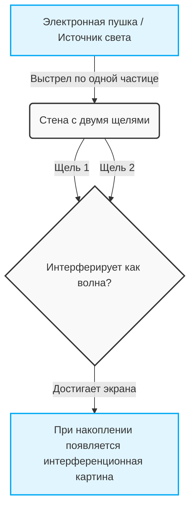
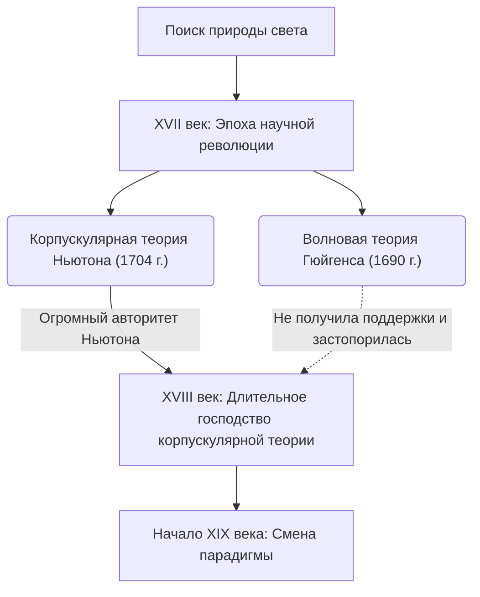
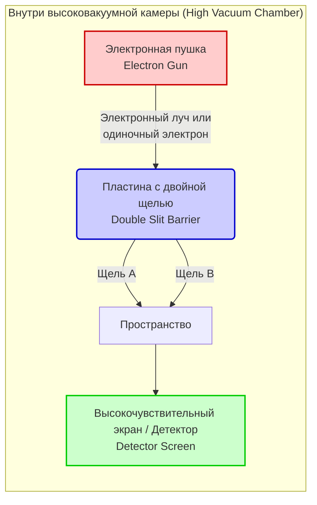

---
title: '【Полный обзор】Понятное и подробное объяснение «Опыта Юнга» — величайшей загадки квантовой механики'
slug: "double-slit-experiment-ultimate-guide"
date: "2026-09-08T01:00:00+09:00"
tags: ["Физика", "Квантовая механика", "Эксперимент с двумя щелями", "Уравнение Шредингера"]
categories: ["Физика и наука"]
math: true
mermaid: true
image: "cover.webp"
description: 'Подробно разбираем «Опыт с двумя щелями» (Опыт Юнга), который называют самым красивым экспериментом в истории физики. Мы в доступной для новичков форме подытожили аномалии микромира, где не работают законы макромира, и глубокие тайны квантовой механики.'
---
## 1. 【Введение】Что такое эксперимент с двумя щелями?

Мир, в котором мы живем, кажется, подчиняется незыблемым правилам. Подброшенный мяч падает по параболе, а брошенный в воду камень пускает круги. Все это — здравый смысл «макромира», описываемый классической физикой, включая ньютоновскую механику, и он полностью совпадает с нашей интуицией. Однако, как только мы ступаем в «микромир» — мир предельно малых единиц материи, таких как атомы, электроны или частицы света (фотоны), — этот здравый смысл с грохотом рушится. Это царство, где наши повседневные ощущения и интуиция совершенно не работают, и где правят чрезвычайно странные и непостижимые правила.

Аномальность этого микромира наиболее просто и шокирующе демонстрирует нам «Эксперимент с двумя щелями» (Double-slit experiment). Ричард Фейнман, гениальный физик XX века, сказал об этом эксперименте: «Это единственная тайна квантовой механики», и добавил: «В этом эксперименте кроются все загадки квантовой механики». Кроме того, многие известные физики неустанно называют его «самым красивым экспериментом в истории физики». Так почему же такой предельно простой эксперимент — просто две щели, проделанные в пластине — считается настолько особенным и продолжает очаровывать ученых?

### Макро- и микромиры, противоречащие интуиции

Сначала давайте представим явления в макромире, где наша интуиция работает безупречно.
Допустим, существует машина, которая одну за другой выстреливает в стену маленькими шариками в краске (или пулями из пулемета — неважно). Перед ней стоит железная пластина с двумя вертикальными узкими щелями. Если стрелять шариками случайным образом, то только те из них, которые пройдут через одну из щелей, ударятся о заднюю стену и оставят след от краски. В результате на стене должны появиться две «вертикальные линии», по форме совпадающие с двумя щелями впереди. Это поведение шариков как «частиц» с четкой траекторией, естественный результат, который каждый может предсказать интуитивно.

Теперь давайте рассмотрим случай с «волной». Поместим в резервуар с водой перегородку с двумя щелями и создадим волну с одной стороны. Когда волна достигнет двух щелей, она пройдет сквозь них, и каждая щель станет новым источником волн, которые будут распространяться дальше в виде двух полукруглых волн. Когда эти две волны сталкиваются, возникает явление, называемое «интерференцией». В тех местах, где гребень волны совпадает с другим гребнем, образуется еще более высокая волна, а там, где гребень встречается со впадиной, они гасят друг друга, и поверхность становится плоской. В результате на задней стенке (или берегу) формируется красивый полосатый узор из чередующихся мест, куда волна бьет сильно, и мест, куда она не доходит вообще. Этот узор называется «интерференционной картиной». И это тоже фундаментальное свойство волн, которое мы повседневно наблюдаем на поверхности воды или в звуковых волнах.

До этого момента нет ничего удивительного. Бросаем частицы — получаем «две линии», посылаем волну — получаем «интерференционную картину». Это здравый смысл мира, в котором мы живем, и предпосылка классической физики.

### Обзор эксперимента и почему его называют «самым красивым»

Однако, если провести точно такой же по структуре эксперимент с использованием микроскопических объектов, таких как свет или электроны, ситуация кардинально меняется, и человеческая интуиция терпит полное фиаско.
Оглядываясь в прошлое, в 1801 году британский физик Томас Юнг впервые провел этот эксперимент с двумя щелями, используя солнечный свет (эксперимент Юнга). В то время преобладала предложенная Ньютоном теория о том, что свет состоит из «частиц», но в результате эксперимента Юнга на экране появилась красивая «интерференционная картина». Это стало решающим доказательством того, что «свет — это волна», и казалось, что в долгом споре была наконец-то поставлена точка.

Истинная загадка и величайшая смена парадигм в физике начинаются именно здесь. В XX веке экспериментальные технологии совершили невероятный скачок, позволив излучать свет и электроны «по одному». Электрон обладает массой и занимает определенное положение в пространстве, это, несомненно, четкая «частица». Из электронной пушки выстреливается всего один электрон, который проходит через две щели и достигает экрана в виде одинокой точки (светящейся точки). На данном этапе, судя по следу на экране, электрон, несомненно, ведет себя как частица.
Затем этот «выстрел по одному электрону» повторяется тысячи, десятки тысяч раз — умопомрачительное количество раз. Поскольку электрон всегда летит только один, физически невозможно, чтобы он столкнулся в воздухе с другим электроном и интерферировал как волна. Естественно, все думали, что на экране появятся «две линии», соответствующие форме щелей, точно так же, как при бросании шариков.

Однако по мере того, как бесчисленные точки от электронов накапливались на экране, на нем стал вырисовываться невероятный узор. Это была «интерференционная картина», которая должна появляться только тогда, когда волны сталкиваются друг с другом.

Электроны, будучи «частицами», которые, казалось бы, выстреливались по одному, почему-то в целом ведут себя как «волна», интерферируя сами с собой и рисуя полосатый узор. Что же это значит? Как будто один-единственный выпущенный электрон распространяется в пространстве подобно волне, проходит через обе щели одновременно, вызывает самоинтерференцию и в момент столкновения с экраном вновь предстает в виде одиночной частицы.
Еще более странным является то, что как только ученые установили возле щелей детектор (что-то вроде камеры), чтобы выяснить, «через какую щель прошел электрон», электрон внезапно потерял свои волновые свойства, и на экране появилась не интерференционная картина, а просто «две линии». Этот феномен, когда объект меняет свое поведение из-за того, что за ним «наблюдают», вверг физиков в пучину еще большего замешательства.

Главная причина, по которой эксперимент с двумя щелями называют «самым красивым экспериментом в физике», заключается в том, что он без использования гигантских ускорителей или чрезвычайно сложных формул, с помощью лишь предельно простой и элегантной установки из двух щелей и экрана, высвечивает фундаментальную загадку Вселенной. Он визуально и ярко демонстрирует момент, когда блестяще рушится здравый смысл макромира. И это не просто констатация физического явления — эксперимент продолжает задавать нам глубочайшие философские и эпистемологические вопросы: «Что такое реальность?», «Действительно ли этот мир, который мы «видим», существует объективно?». В этом одном единственном простой эксперименте сконцентрированы пределы человеческого интеллекта и бесконечная романтика науки, стремящейся эти пределы превзойти.
## 2. 【История】Свет — это волна или частица? Траектория бесконечного спора

С тех пор как человечество осознало существование «света», поиск его истинной природы никогда не прекращался. Со времен Древней Греции такие философы и математики, как Эмпедокл и Евклид, размышляли о механизмах света и зрения, но по-настоящему серьезный подход с позиций современной науки начался лишь в XVII веке. Спор «свет — это частица или волна?», начавшийся в ту эпоху, на протяжении более 300 лет раскалывал физическое сообщество надвое и, в конечном итоге, стал движущей силой, открывшей двери в совершенно новую физику — квантовую механику. В этом разделе мы подробно проследим траекторию этой грандиозной научной истории.

### 2.1 Корпускулярная теория Ньютона vs волновая теория Гюйгенса: столкновение XVII века

Во второй половине XVII века, в самый разгар научной революции, были выдвинуты две мощные теории относительно природы света. Это были «корпускулярная теория» (Corpuscular theory) Исаака Ньютона (Isaac Newton) и «волновая теория» (Wave theory) Христиана Гюйгенса (Christiaan Huygens).

#### Корпускулярная теория Ньютона
Исаак Ньютон, звезда современной физики, известный, помимо прочего, законом всемирного тяготения, считал, что свет — это скопление чрезвычайно мелких частиц (корпускул). В своей статье 1672 года и в своем главном труде «Оптика» (Opticks) в 1704 году Ньютон блестяще объяснил свойство света двигаться по прямой и закон отражения от зеркала с помощью механической модели отскока частиц от стены. Кроме того, явление разделения белого света на семь цветов с помощью призмы (дисперсия) он объяснял тем, что свет разных цветов состоит из частиц разной массы, которые имеют различные показатели преломления при прохождении через среду.
Возражая волновой теории, Ньютон указывал: «Если бы свет был волной, подобно звуку, он должен был бы огибать препятствия (явление дифракции), но свет распространяется прямолинейно и отбрасывает четкие тени», тем самым отрицая его волновую природу.

#### Волновая теория Гюйгенса
С другой стороны, выдающийся голландский физик Христиан Гюйгенс в своем «Трактате о свете» (Treatise on Light), опубликованном в 1690 году, утверждал, что свет — это волны (продольные волны), распространяющиеся в упругой среде, заполняющей космическое пространство и называемой «эфиром». Гюйгенс предложил знаменитый «принцип Гюйгенса» (Huygens' Principle), согласно которому «каждая точка волнового фронта становится источником новых вторичных волн», и блестяще геометрически объяснил прямолинейное распространение света, а также законы отражения и преломления.
В особенности что касается преломления: Ньютон предсказывал, что «когда свет попадает в более плотную среду, такую как вода или стекло, частицы испытывают притяжение и ускоряются, поэтому скорость света возрастает», в то время как волновая теория Гюйгенса пришла к выводу, что «в плотной среде скорость распространения волны снижается», — и эти две позиции оказались в прямом противоречии.

Однако из-за абсолютного авторитета и влияния Ньютона в научном сообществе того времени волновая теория Гюйгенса постепенно ушла в тень, и на протяжении всего XVIII века корпускулярная теория Ньютона продолжала безраздельно господствовать как мейнстрим.

## 2.2 Эксперимент Томаса Юнга с двойной щелью для света (1801 г.) и триумф волновой теории

В начале 19 века произошло решающее событие, разрушившее твердыню долгое время господствовавшей корпускулярной теории. Главным героем стал английский эрудит Томас Юнг (Thomas Young). Врач, также внесший вклад в расшифровку египетских иероглифов (Розеттский камень), Юнг в 1801 году провел блестящий эксперимент, вошедший в историю физики. Это был «опыт Юнга по интерференции» (позднее известный как эксперимент с двойной щелью).

#### Открытие интерференционных полос
Установка Юнга была чрезвычайно простой и гениальной. Он пропускал солнечный свет через очень тонкое отверстие (или щель), создавая точечный источник света, а затем пропускал этот свет через две тонкие щели (двойную щель), расположенные на очень близком расстоянии друг от друга, и проецировал его на экран позади них.
Если бы свет был исключительно «частицами», как утверждал Ньютон, то на экране должны были бы отобразиться две яркие линии, соответствующие форме щелей. Однако то, что Юнг увидел на экране, было полосатым узором, состоящим из чередующихся светлых и темных полос — то есть «интерференционной картиной (Interference fringes)».

Это явление невозможно было бы объяснить, не признав, что свет является волной. Когда две волны сталкиваются на поверхности воды, в местах, где их гребни накладываются друг на друга, они становятся выше (конструктивная интерференция), а там, где гребень совпадает со впадиной, они гасят друг друга, и поверхность становится плоской (деструктивная интерференция). Юнг пришел к выводу, что световые волны, исходящие из двух щелей, интерферируют точно таким же образом.

#### Математическое обоснование и утверждение волновой теории
Условия конструктивной и деструктивной интерференции определяются разностью длин путей от двух щелей до точки на экране (разностью хода лучей $\Delta L$). Если расстояние между щелями равно $d$, угол к экрану — $\theta$, а длина волны света — $\lambda$, то разность хода лучей выражается следующим образом:

$$ \Delta L = d \sin \theta $$

* **Светлые линии (условие усиления)**: $\Delta L = m\lambda \quad (m = 0, \pm1, \pm2, \dots)$
* **Темные линии (условие гашения)**: $\Delta L = \left(m + \frac{1}{2}\right)\lambda$

Это заявление Юнга первоначально вызвало яростную критику и насмешки со стороны последователей Ньютона в Великобритании. Однако впоследствии, в 1815 году, француз Огюстен Жан Френель (Augustin-Jean Fresnel) построил строгую математическую теорию дифракции и интерференции света. Более того, на конкурсе Французской академии наук в 1818 году член жюри Симеон Дени Пуассон (противник волновой теории) отметил: «Если теория Френеля верна, то в центре тени от круглого препятствия должно образоваться светлое пятно. Такая нелепость невозможна». Однако Доминик Франсуа Жан Араго, фактически проведший эксперимент, безупречно наблюдал это «пятно Пуассона (пятно Араго)», благодаря чему правильность волновой теории стала неоспоримой.

В 1850 году Леон Фуко и другие экспериментально доказали, что скорость света в воде ниже, чем в воздухе, полностью опровергнув предсказание Ньютона. А в 1864 году Джеймс Клерк Максвелл в качестве кульминации развития электромагнетизма обосновал теорию о том, что «свет является разновидностью электромагнитных волн», чем ознаменовал полную победу «волновой теории» света. Казалось, спор был разрешен.

### 2.3 Возрождение корпускулярной теории благодаря гипотезе световых квантов Эйнштейна (1905 г.)

Теория Максвелла о том, что свет является электромагнитной волной, была настолько прекрасна, что в конце 19 века физики верили: «Физика почти завершена, остается лишь измерить некоторые точные значения». Однако на рубеже 19 и 20 веков ученые столкнулись со странным явлением, которое никак не могла объяснить волновая теория. Это был «фотоэлектрический эффект (Photoelectric effect)».

#### Загадка фотоэлектрического эффекта
Фотоэлектрический эффект — это явление, при котором электроны (фотоэлектроны) вылетают из металла при освещении его поверхности светом. Согласно здравому смыслу волновой теории того времени, энергия света (волны) должна быть пропорциональна его амплитуде (яркости). Поэтому считалось, что «если направить сильный (яркий) свет, электроны должны будут стремительно вылетать независимо от цвета света».
Однако результаты экспериментов полностью опровергли предсказания волновой теории.

1. **Существование пороговой частоты**: При облучении светом с частотой (цветом) ниже определенного значения (например, красным светом) электроны вообще не вылетали, независимо от того, насколько сильным (ярким) был свет и как долго продолжалось облучение.
2. **Мгновенность**: И наоборот, если свет имел частоту выше пороговой (например, ультрафиолетовый свет), электроны вылетали мгновенно в момент облучения, даже если свет был очень слабым.
3. **Зависимость энергии**: Кинетическая энергия вылетающих электронов зависела исключительно от частоты (цвета) света, а не от его интенсивности (яркости).

#### Драматическое решение Эйнштейна: световой квант (фотон)
Эту безнадежную загадку разгадал Альберт Эйнштейн (Albert Einstein), тогда еще малоизвестный молодой человек, работавший в швейцарском патентном бюро. В 1905 году, названном «годом чудес», он применил «гипотезу квантов энергии», выдвинутую Максом Планком в исследовании теплового излучения (1900 г.), к самому свету и опубликовал «гипотезу световых квантов (Light quantum hypothesis)».

Эйнштейн сделал смелое предположение о том, что свет, который считался непрерывной волной, на самом деле представляет собой скопление энергетических сгустков, то есть частиц, называемых «световыми квантами (фотонами: Photon)». Энергия $E$ одного светового кванта пропорциональна частоте света $\nu$ и выражается следующей формулой Планка-Эйнштейна:

$$ E = h\nu $$

(Здесь $h$ — постоянная Планка, $6.626 \times 10^{-34} \, \text{J}\cdot\text{s}$)

С помощью этой гипотезы загадка фотоэлектрического эффекта была решена, словно по волшебству.
Оказалось, что фотоэлектрический эффект подобен бильярду: «один световой квант» сталкивается с «одним электроном» в металле и полностью передает ему свою энергию. Если минимальную энергию, необходимую для того, чтобы электрон вырвался из оков металла, назвать «работой выхода ($W$)», то максимальная кинетическая энергия вылетевшего электрона $E_k$ описывается следующим изящным уравнением:

$$ E_k = h\nu - W $$

Если энергия светового кванта $h\nu$ меньше работы выхода $W$ (свет низкой частоты), то электрон не сможет вырваться из металла, сколько бы световых квантов мы ни направляли (насколько бы ярким ни был свет). В этом и заключается причина существования пороговой частоты.

#### В непостижимый мир того, что является «и волной, и частицей»
Гипотеза световых квантов Эйнштейна была полностью подтверждена точными экспериментами Роберта Милликена в 1914 году, за что Эйнштейн в 1921 году был удостоен Нобелевской премии по физике. (Сам Милликен изначально не верил в теорию Эйнштейна и ставил эксперименты, чтобы ее опровергнуть, но по иронии судьбы его результаты доказали ее правильность). Кроме того, в 1923 году Артур Комптон открыл «эффект Комптона», при котором длина волны рентгеновского излучения изменяется при столкновении с электроном, что окончательно подтвердило: свет ведет себя как «частица», обладающая импульсом $p = \frac{h}{\lambda}$.

«Корпускулярная теория», которая, казалось бы, была полностью разгромлена экспериментами Юнга, спустя 100 лет совершила чудесное воскрешение в более утонченной форме — в виде «квантов».
Однако это породило серьезное противоречие. Свет обладает явными свойствами волны, такими как «интерференция», продемонстрированная в эксперименте Юнга с двойной щелью, и одновременно — свойствами «частицы», проявившимися в фотоэлектрическом эффекте.

Чем же является свет: волной или частицей?
Окончательный ответ физики на этот вопрос резко противоречил человеческой интуиции: «Свет является и тем, и другим, и ни тем, ни другим. Свет — это квантовая сущность, сочетающая в себе «свойства волны» и «свойства частицы». Так зародилась «корпускулярно-волновая дуальность (Wave-particle duality)».
Концепция этого дуализма вскоре стала применяться не только к свету, но и к самой материи, например к электронам (волны материи де Бройля), и физика шагнула в невиданную доселе бездну — в странный и завораживающий мир «квантовой механики». Самой знаковой ареной для этого стал обновленный до современной версии «квантово-механический эксперимент с двойной щелью».

## 3. [Поворот] Материя тоже является волной? Волны де Бройля и эксперимент с двойной щелью для электронов

Благодаря гипотезе световых квантов Эйнштейна (1905 г.), утверждавшей, что свет является «и волной, и частицей», мир физики оказался в водовороте великой неразберихи и смены парадигм. Несмотря на то, что долгие годы, благодаря интерференционному опыту Юнга и электромагнетизму Максвелла, все верили, что «свет абсолютно точно является волной», такие явления, как фотоэлектрический эффект, невозможно было объяснить иначе как рассматривая свет в виде «частиц (фотонов)». Изначально считалось, что это странное свойство, «корпускулярно-волновой дуализм», является уникальной особенностью одного лишь света. Однако с наступлением 1920-х годов эта концепция дуализма вышла за рамки мира света и нацелилась на саму «материю», из которой состоят наши тела.

### 3.1. Выдвижение Луи де Бройлем идеи волн материи: скачок от прекрасной симметрии

В 1924 году молодой французский аспирант Луи де Бройль (Louis de Broglie) в своей докторской диссертации выдвинул чрезвычайно смелую гипотезу, которая в корне перевернула историю физики. Она заключалась в следующем: «Если свет (считавшийся волной) обладает свойствами частицы, то не может ли быть так, что и материя, такая как электроны (считавшаяся частицами), тоже обладает свойствами волны?»

В основе этой гипотезы лежала философская интуиция де Бройля о том, что природа всегда предпочитает симметрию. Он применил уравнения связи между энергией и импульсом, выведенные Эйнштейном в специальной теории относительности и гипотезе световых квантов, к частицам материи, обладающим массой. Импульс фотона $p$ выражается через постоянную Планка $h$ и длину волны $\lambda$ как $p = h / \lambda$. Де Бройль перевернул это соотношение и выразил длину волны $\lambda$, сопутствующую частице массой $m$, движущейся со скоростью $v$ (импульс $p = mv$), с помощью следующей очень простой формулы:

$$ \lambda = \frac{h}{p} = \frac{h}{mv} $$

Это знаменитая формула «длины волны де Бройля (длины волны материи)». Эта формула означает, что все движущиеся объекты, от бейсбольных мячей и автомобилей, которые мы видим в повседневной жизни, до мельчайших электронов, обладают волновой природой. Тогда почему же в повседневной жизни мы не замечаем, чтобы бейсбольный мяч интерферировал или дифрагировал, как волна? Это связано с тем, что постоянная Планка $h$ (около $6.626 \times 10^{-34} \text{ J}\cdot\text{s}$) чрезвычайно мала. Для макроскопических объектов масса $m$ слишком велика, поэтому длина волны де Бройля $\lambda$ становится настолько малой, что ее можно считать практически равной нулю, и волновые свойства полностью скрываются. Однако в мире электронов, масса которых крайне мала, эта длина волны достигает масштабов, сопоставимых с длиной волны рентгеновского излучения (электромагнитных волн) (например, около $0.1 \text{ nm}$), и предстает в виде величины, которой ни в коем случае нельзя пренебречь.

Эта диссертация де Бройля настолько выходила за рамки здравого смысла, что привела тогдашних экзаменаторов в глубокое замешательство. Однако когда один из членов жюри, Поль Ланжевен, отправил эту работу Эйнштейну, тот высоко оценил ее, заявив: «Он приподнял краешек великого занавеса». Благодаря этому концепция «волн материи (matter wave)» де Бройля привлекла внимание всего мира, что впоследствии напрямую привело к созданию волновой механики Шрёдингером.

### 3.2. Эксперимент Дэвиссона — Джермера: доказательство волновой природы материи

Несмотря на то, что гипотеза де Бройля была красива как теория, требовалось экспериментальное доказательство того, описывает ли она реальную природу. «Если электрон действительно является волной, то он должен демонстрировать такие характерные для волн явления, как «дифракция» и «интерференция»». С этим убеждением физики всего мира приступили к экспериментам, пытаясь зафиксировать волновую природу электрона.

И вот в 1927 году, наконец, было получено решающее доказательство. Это был «эксперимент Дэвиссона — Джермера», проведенный американскими физиками из Лабораторий Белла Клинтоном Дэвиссоном (Clinton Davisson) и Лестером Джермером (Lester Germer).

Первоначально они проводили эксперимент с другой целью: облучали кристалл никеля электронным пучком и изучали характер его рассеяния. Однако, чтобы исправить последствия аварии во время эксперимента (окисления поверхности никеля из-за поломки вакуумной трубки), они нагрели никель до высокой температуры, и им посчастливилось случайно получить монокристалл никеля. Когда они снова направили электронный пучок на этот монокристаллический никель, наблюдалось удивительное явление. Интенсивность рассеянных электронов демонстрировала четкую «дифракционную картину», достигая локальных максимумов под определенными углами.

Расстояние между атомами, регулярно выстроенными в кристалле (постоянная решетки), по масштабу почти совпадает с длиной волны де Бройля для электрона. Иными словами, сам кристалл никеля сработал как «естественная дифракционная решетка» для электронов. Результат обратного расчета длины волны электрона, произведенного Дэвиссоном и Джермером на основе этой дифракционной картины, блестяще совпал со значением, предсказанным формулой де Бройля $\lambda = h/p$. В том же году английский физик Джордж Пэджет Томсон (сын Дж. Дж. Томсона, открывшего электрон) также успешно наблюдал дифракционные кольца (кольца Дебая-Шеррера), образующиеся при прохождении электронного пучка сквозь тонкую металлическую фольгу.

Результаты этих экспериментов представили физическому сообществу неоспоримый факт: материя обладает волновыми свойствами. Электрон, который должен быть частицей, ведет себя как волна. Это был момент раскрытия глубокой истины природы и фанфары, возвестившие о заре квантовой механики. Де Бройль получил Нобелевскую премию по физике в 1929 году, а Дэвиссон и Томсон — в 1937 году.

### 3.3. Решающий эксперимент с двойной щелью компании Hitachi (Акира Тономура и др.) (1989 г.)

Даже после того, как было доказано, что электрон является волной, поиски физиков не прекратились. Это была попытка в реальности, да еще и с предельной точностью, осуществить «эксперимент с двойной щелью для электронов», о котором до этого говорили лишь как о мысленном эксперименте.

Точно так же, как и в эксперименте с двойной щелью для света (эксперименте Юнга), если выстрелить электронами в сторону двойной щели, на экране позади нее должны появиться интерференционные полосы. Однако здесь возникает самый непостижимый парадокс квантовой механики: «А что, если выстреливать электронами не массово за один раз, а **по одному**?»

Один электрон является неделимой частицей. Следовательно, он может пройти только через одну щель: либо левую, либо правую. Электроны, достигающие экрана по одному, оставляют на нем лишь одиночные светящиеся точки. Если повторить это десятки тысяч раз, станет ли скопление точек просто тенью двух щелей (двумя линиями), или же оно образует интерференционную картину, демонстрирующую волновые свойства?

Самый красивый и совершенный ответ на этот фундаментальный вопрос дала исследовательская группа из Лаборатории фундаментальных исследований японской компании Hitachi (под руководством доктора Акиры Тономуры), преодолевшая технологические барьеры. В 1989 году они блестяще и успешно провели «эксперимент по интерференции одиночных электронов на бипризме», применив технологию электронной голографии и электронную микроскопию сверхвысокого вакуума и сверхнизких температур.

Установка эксперимента была поразительной. Они до предела сократили количество электронов, испускаемых электронной пушкой, создав состояние, при котором, пока электрон летит в пространстве, «внутри установки всегда находится только один электрон». Скорость электрона достигала примерно 150 000 километров в секунду, и время, необходимое для того, чтобы пролететь расстояние от источника до детектора, составляло всего лишь мгновение. Следующий электрон выпускался намного позже того, как предыдущий достигал экрана.

Когда начался эксперимент, на детекторе (мониторе) стали одна за другой появляться светящиеся точки, указывающие на попадание электронов. На этапе первых нескольких штук и даже нескольких сотен казалось, что точки разбросаны по экрану совершенно случайным образом. Словно звезды в ночном небе, они, казалось, не имели никакого порядка.

Однако по мере накопления нескольких тысяч и десятков тысяч электронов, перед глазами стало вырисовываться поразительное зрелище, очевидное для каждого. Скопление точек, казавшееся беспорядочным, постепенно сформировало регулярный узор из светлых и темных полос — несомненную «интерференционную картину».

То, что означал этот результат, резко противоречило интуиции. Электрон определенно достигает экрана как «одна частица» (именно поэтому регистрируется одна точка). Однако тот факт, что в целом образуется интерференционная картина, можно интерпретировать только так: этот единственный электрон «сам, будучи волной, одновременно прошел через обе щели (через обе стороны бипризмы) и проинтерферировал сам с собой». Одиночный электрон, не взаимодействующий ни с кем другим, вызывает интерференцию с самим собой. Тот же принцип, о котором говорил Дирак: «фотон интерферирует только сам с собой», был безупречно доказан и для электрона, материальной частицы, обладающей массой.

Этот эксперимент доктора Акиры Тономуры и его команды получил мировое признание как самое наглядное и прямое доказательство загадочности квантовой механики, а именно — «корпускулярно-волнового дуализма». Вполне естественно, что в опросе читателей, проведенном британским научным журналом «Physics World» в 2002 году на тему «Самый красивый эксперимент в истории физики», этот «эксперимент с двойной щелью для электронов» заслуженно занял 1-е место.

Таким образом, спустя более 60 лет безумная гипотеза де Бройля о том, что «материя является волной», предстала перед нашими глазами в своем истинном виде — как мистическая интерференционная картина, нарисованная одиночными электронами. Однако, разгадав одну загадку квантовой механики, этот эксперимент одновременно открыл дверь к еще более глубокой тайне — «проблеме измерения (наблюдателя)». «Если попытаться посмотреть, через какую щель прошел электрон, интерференционная картина исчезает» — в следующей главе мы шагнем в еще более глубокую бездну этого странного квантового мира.
## 4. 【Методы и результаты эксперимента】 Что именно происходит

(Чтобы добраться до сути эксперимента с двумя щелями и заглянуть в бездну квантовой механики, здесь мы сосредоточимся на объяснении эксперимента с использованием «электронов» вместо света. Аналогичные явления наблюдались у фотонов и других элементарных частиц, и даже у относительно крупных молекул, таких как фуллерены, но использование электронов, которые имеют массу и воспринимаются нами как «явно материальные частицы», делает парадокс и странность этого явления еще более очевидными.)

### 4.1 Установка экспериментального оборудования: подготовка сцены для захвата микромира

Прежде всего, давайте подробно рассмотрим, на каком оборудовании проводится этот исторический и революционный эксперимент и как выглядит эта сцена (установка). Концептуальная структура эксперимента с двумя щелями удивительно проста, но физический успех эксперимента требует передовых технологий и чрезвычайно строгого контроля окружающей среды.

Экспериментальная установка состоит из трех основных компонентов. Все они помещаются в строго герметичную вакуумную камеру высокого уровня (вакуумный сосуд), чтобы предотвратить рассеяние электронов из-за столкновений с молекулами воздуха.

1. **Электронная пушка (Electron Gun)**:
   Это устройство для испускания «электронов», главных героев эксперимента. Используя принципы нагрева нити накала для высвобождения термоэлектронов или применения сильного электрического поля для их извлечения, она выстреливает электроны с определенной кинетической энергией в заданном направлении. В этом эксперименте крайне важно то, что электроны можно испускать как в виде непрерывного потока, подобно водопаду мощного «луча», так и, что удивительно, снизить мощность до предела и контролируемо испускать их «строго по одному». Эта «технология испускания одиночных электронов» является одной из важнейших и сложнейших технологий в современных экспериментах по квантовой механике.

2. **Двойная щель (Double Slit)**:
   Это экранирующая пластина (стена) с двумя очень узкими и расположенными параллельно на крайне близком расстоянии щелями, через которые проходят электроны, испущенные электронной пушкой. Поскольку длина «волны материи (волны де Бройля)» электрона очень мала, ширина этих щелей и расстояние между ними должны быть изготовлены с предельной точностью в микро- или нанометровом (одна миллиардная метра) масштабе. Если ширина щелей или расстояние между ними слишком велики по отношению к длине волны электрона, будет невозможно четко наблюдать «интерференцию», которая является волновым свойством. Саму технологию создания этой крошечной двойной щели можно назвать вершиной технологий микрообработки, таких как современное оборудование для электронно-лучевой литографии.

3. **Экран (детектор, Screen / Detector)**:
   Это экран для наблюдений, который фиксирует положение электронов, успешно прошедших через двойную щель и в конечном итоге достигших его. В прошлых экспериментах использовались светочувствительные фотопластинки и тому подобное, но сегодня применяются высокочувствительные ПЗС-камеры, флуоресцентные экраны, специальные полупроводниковые пиксельные детекторы и так далее. Это позволяет крайне точно, в виде двумерных координат, фиксировать «где именно приземлился (ударился)» каждый отдельный электрон. При столкновении с экраном электрон испускает крошечный свет или генерирует электрический сигнал, оставляя четкий след (точку), говорящий: «без сомнения, он прибыл сюда как одна частица».

На следующей схеме показано общее расположение этого экспериментального оборудования и траектории электронов.

### 4.2 Случай попадания большого количества электронов: волновое поведение, противоречащее интуиции (образование интерференционных полос)

Теперь мы наконец начинаем эксперимент. В качестве первого шага мы увеличиваем мощность электронной пушки и непрерывно, подобно душу или пулемету, направляем «большое количество электронов» в сторону двойной щели.

Согласно нашему обыденному здравому смыслу, основанному на классической физике, электрон — это «частица» (нечто вроде маленькой пули), обладающая массой. Следовательно, ожидается, что множество электронов, прошедших через две щели, сконцентрированно столкнутся с экраном в двух местах на продолжении прямых линий от каждой щели, в результате чего образуется узор в виде «двух вертикальных полос». Представьте себе распыление краски из баллончика на трафарет с двумя прорезями. Краска, прошедшая через прорези, должна нарисовать на стене две линии, повторяющие форму прорезей.

Однако узор, который на самом деле появляется на экране, полностью противоречит нашей интуиции и ожиданиям. На экране четко формируются не две простые вертикальные полосы, а **множество светлых и темных чередующихся полос (интерференционная картина: Interference Pattern)**.

Эта «интерференционная картина» имеет абсолютно такие же геометрические характеристики, как узор, образующийся при наложении ряби от двух камней, брошенных одновременно в пруд, или узор, наблюдаемый в экспериментах по интерференции света.
- **В местах, где гребни волн совпадают с гребнями или впадины с впадинами (конструктивная интерференция)**, полоса становится «светлой (с высокой плотностью попаданий электронов)», куда прибывает много электронов.
- **В местах, где гребень волны совпадает со впадиной (деструктивная интерференция)**, волны гасят друг друга, и полоса становится «темной (с плотностью электронов, близкой к нулю)», куда электроны практически не попадают.

Единственный вывод, который следует из этого результата, заключается в следующем: **«электрон ведет себя как волна»**. Поток электронов, выпущенный из электронной пушки, распространяется в пространстве как волны на воде и «одновременно» проходит через обе щели. Затем волна, дифрагировавшая и расширившаяся от щели A, и волна, дифрагировавшая и расширившаяся от щели B, накладываются друг на друга в пространстве перед экраном, создавая этот характерный узор из светлых и темных полос в результате интерференции — это единственное возможное объяснение.

Тот факт, что электроны, в которые твердо верили как в «частицы», на самом деле обладают также свойствами «волн» (корпускулярно-волновой дуализм), сам по себе является историческим открытием в физике и достаточно удивителен, но истинная загадка квантовой механики и явление, которое в корне переворачивает наш здравый смысл, отсюда усугубляется еще на один уровень.

### 4.3 Случай выстреливания электронов «строго по одному»: экстремальный эксперимент, раскрывающий истинную природу «волны вероятности»

«Разве это не тот случай, когда мы просто выпускаем большое количество электронов одновременно, поэтому электроны сталкиваются в воздухе или отталкиваются из-за электрической силы (кулоновской силы), и в результате это просто создает волнообразный узор?»
Это очень естественный вопрос для ученого. Фактически, когда интерференционная картина была впервые открыта, многие физики думали именно так и пытались интерпретировать явление классически.

Чтобы полностью разрешить этот вопрос, экспериментальные методы были усовершенствованы, и был проведен еще более решающий эксперимент. (В Японии очень известен эксперимент, проведенный в 1989 году группой Акиры Тономуры из Hitachi, который превозносится как один из самых красивых экспериментов в мире).
Это эксперимент, в котором **мощность электронной пушки снижается до предела, и электроны испускаются «абсолютно по одному»**.

В частности, после того, как испускается первый электрон и исследователи убеждаются, что он достиг экрана и полностью исчез (или был поглощен), испускается следующий новый электрон. Это повторяется безумное количество раз — десятки и сотни тысяч раз. При таких настройках гарантируется, что в пространстве внутри экспериментальной установки «всегда находится только один электрон». Следовательно, физически на 100% невозможно, чтобы электроны сталкивались друг с другом в воздухе или интерферировали друг с другом.

Давайте проследим за результатами эксперимента с одиночными электронами в этих экстремальных условиях по мере течения времени (накопления количества электронов).

**Шаг 1: Сразу после начала эксперимента (десятки – сотни электронов)**
На экране тут и там появляются точки в совершенно случайных позициях. В момент достижения экрана электрон явно демонстрирует свойства «одной частицы» и регистрирует одну точку в определенных микроскопических координатах. На данном этапе в узоре на экране не видно никаких закономерностей, он выглядит просто как хаотичное и случайное скопление точек. Это похоже на то, как если бы кто-то бросал дротики наугад с завязанными глазами.

**Шаг 2: После того, как достигли несколько тысяч – десятков тысяч электронов**
По мере того, как проходит время, эксперимент повторяется, и на экране накапливаются тысячи или десятки тысяч точек, начинает происходить странное явление. В распределении точек, которое считалось совершенно случайным, постепенно начинают проглядывать «отклонения» и «оттенки». Области, где точки концентрируются и ударяют часто, и области, где точки почти не попадают, начинают слегка разделяться.

**Шаг 3: По окончании эксперимента (когда достигли сотни тысяч электронов и более)**
Потратив достаточно много времени и продолжая эту умопомрачительную работу по выстреливанию гигантского количества (от сотен тысяч до миллионов) электронов строго по одному, мы смотрим на общее накопленное изображение на экране... и четко видим те же самые великолепные **«интерференционные полосы»**, что и при запуске большого количества электронов разом!

Это один из самых пугающих, противоречащих интуиции, но в то же время самых красивых и глубоких результатов в истории физики.

Ведь электроны запускались «абсолютно по одному». Взаимодействие с предыдущим или последующим электроном абсолютно невозможно. И тем не менее, тот факт, что в конечном итоге образуются полосы, демонстрирующие волновую интерференцию, означает, что мы вынуждены принять невероятный вывод: **«Один электрон интерферирует сам с собой»**.

Если попытаться логически объяснить это явление, наше повседневное восприятие пространства и материи полностью рушится.
Один электрон после выстрела из электронной пушки как будто распространяется по всему пространству подобно «волне», **проходит через правую и левую щели «одновременно»**, интерферирует со «своей собственной волной» перед экраном, и в момент, когда он достигает экрана и наблюдается, он снова коллапсирует (определяется) в одну точку как «одна частица».

Так какова же истинная природа этой «волны», по которой один электрон передается через пространство?
В квантовой механике это не материальная волна, где колеблется физическая среда, такая как поверхность воды или воздух. Согласно интерпретации, предложенной Максом Борном, это **«волна, представляющая 'вероятность' того, что электрон существует в определенном месте пространства (волна вероятности)»**. Математически это называется «волновой функцией».

Электроны не летят по определенной траектории (маршруту) по прямой линии, как шарики в патинко. С момента выстрела до достижения экрана электрон распространяется в пространстве как «наложение (суперпозиция)» различных вероятностей: «состояние прохождения через правую щель», «состояние прохождения через левую щель» и даже «состояние прохождения по каждому возможному пути в пространстве».

Затем, в момент столкновения с устройством наблюдения (экраном), когда измеряется «где он оказался», волна вероятности, распространявшаяся в пространстве, мгновенно коллапсирует в одну точку (коллапс волновой функции), и впервые фиксируется положение реальной частицы со словами «он был здесь».

«Светлая часть» интерференционной картины (где в конечном итоге собирается много точек) — это место, где вероятность нахождения электрона увеличилась за счет интерференции волн, а «темная часть» (где точки не собираются) означает место, где волны вероятности погасили друг друга и стали равными нулю. Точно так же, как при многократном бросании кубика вероятность выпадения каждого числа приближается к теоретическому значению (1/6), благодаря повторению «вероятностного поведения» одиночного электрона сотни тысяч раз, форма волны вероятности (интерференционная картина) проявляется как реальный узор.

«Один электрон проходит через две щели одновременно». «До момента наблюдения состояние не определено, и он существует лишь как волна вероятности, в которой перекрываются бесконечные возможности».
Холодные экспериментальные факты, представленные этим экспериментом с двойной щелью, ставят перед нами глубокие философские вопросы, выходящие за рамки физики: «Что вообще значит 'существовать'?» и «Что такое на самом деле та реальность, которую мы воспринимаем?».

## 5. 【Проблема измерения】 Квант, меняющий свое поведение под наблюдением

Именно здесь кроется суть того, почему эксперимент с двумя щелями в квантовой механике оказал столь огромное влияние не только на физику, но и на сферы философии и мысли, и почему его называют самым красивым и одновременно самым жутким экспериментом в истории науки. Это поразительный факт, что сам акт «наблюдения (измерения)» решающим образом меняет исход физического явления.

В макромире, в котором мы живем, то есть в мире, подчиняющемся законам классической физики, «наблюдение» — это просто пассивный акт. Независимо от того, смотрим мы на Луну в ночном небе или нет, Луна твердо существует там и движется по определенной орбите в соответствии с ньютоновской механикой. Орбита Луны не меняется только из-за того, что мы на нее смотрим. Наш твердый здравый смысл говорит о том, что присутствие наблюдателя не оказывает никакого влияния на объективную реальность наблюдаемого объекта.

Однако в микроскопическом мире квантов этот здравый смысл переворачивается с ног на голову. «Наблюдение (измерение)» — это не просто получение информации, а активный процесс, который оказывает необратимое и определяющее влияние на объект. В тот момент, когда наблюдатель задает вопрос природе, природа меняет свое поведение. В этом разделе мы чрезвычайно подробно рассмотрим «проблему измерения (Measurement Problem)», величайшую загадку эксперимента с двумя щелями, которая до сих пор обсуждается в современной физике.

### Что происходит, если «наблюдать», через какую щель он прошел?

Представьте себе процесс испускания квантов по одному — будь то электроны, фотоны или даже крупные молекулы, такие как фуллерен (C60) — и то, как они проходят через две щели и достигают экрана. В предыдущем объяснении мы подтвердили, что даже если кванты выпускаются по одному с интервалом, при длительном наблюдении за яркими точками, накапливающимися на экране, мы увидим формирование красивых интерференционных полос (доказательство свойств волны). Это интерпретируется как результат того, что один квант распространяется в пространстве как суперпозиция двух состояний: «возможность пройти через правую щель» и «возможность пройти через левую щель», и его собственные волны вероятности интерферируют друг с другом.

Однако здесь физиков посетил вполне естественный, но в мире квантов дьявольский вопрос: «Действительно ли квант проходит 'через обе щели одновременно'? Или 'на самом деле он проходит только через одну из щелей, а мы просто этого не знаем'? Давайте поставим камеру рядом со щелью и проверим это».

Чтобы ответить на этот вопрос, в экспериментальную установку вносится одно изменение. Прямо рядом со щелью устанавливается высокочувствительный «детектор (прибор наблюдения)». Этот детектор предназначен для «наблюдения» и записи того, через какую щель прошел электрон: через правую или через левую. Настройка эксперимента полностью идентична предыдущей, за исключением добавленного детектора. Электроны испускаются по одному. Детектор работает безотказно и точно сообщает нам информацию о пути электрона (Which-path information): «прошел справа» или «прошел слева». Как и ожидалось, подтверждается, что половина электронов проходит справа, а другая половина — слева. Наша интуиция удовле চরমтворена: «Ну вот, в конце концов, электрон как частица просто проходил через одно из отверстий. Суперпозиция — это иллюзия».

Однако физики, проверившие картину распределения электронов, в конечном итоге достигших экрана, потеряли дар речи. Там были нарисованы уже не красивые интерференционные полосы, указывающие на волновую природу, а просто «две линии (или два пика)». Это точно такой же узор, который получается, если бросать в щель классические частицы, вроде бейсбольных мячей или гальки. «Волновая интерференция», необходимая для формирования интерференционной картины, полностью исчезла.

В тот момент, когда мы попытались «пронаблюдать», какой путь он прошел, электрон отказался от своей волновой природы (состояния суперпозиции) и начал вести себя как чисто классическая частица. Выключите детектор — и интерференционные полосы появятся снова, включите его — и полосы исчезнут без следа. Что еще более удивительно, последующие эксперименты (эксперименты по квантовому ластику) даже показали, что если «данные наблюдений были записаны, но уничтожены до того, как их кто-либо просмотрел», интерференционные полосы восстанавливаются. Кванты ведут себя так, как будто «знают», что за ними наблюдают или что информация об их пути где-то сохранена во Вселенной. Это было названо «разрушением интерференции путем получения информации о пути», и стало решающим доказательством того, насколько квантовый мир далек от нашей интуиции.

### Копенгагенская интерпретация (Коллапс волнового пакета)

Как же нам следует трактовать это в высшей степени загадочное явление? В 1920-х годах наиболее стандартной и ортодоксальной интерпретацией квантовой механики стала «Копенгагенская интерпретация», разработанная в первую очередь Нильсом Бором, Вернером Гейзенбергом, Максом Борном и другими.

Копенгагенская интерпретация полагает, что до наблюдения квант существует лишь как «волна вероятности (волновая функция)», распространяющаяся в пространстве. Сама волновая функция (обычно обозначается как $\Psi$) является не физической сущностью, а математическим инструментом, выражающим «амплитуду вероятности» обнаружения кванта в определенном месте. Эта волна вероятности эволюционирует (изменяется) во времени гладко и детерминированно в соответствии с уравнением Шредингера. В эксперименте с двойной щелью волна вероятности электрона проходит как через правую, так и через левую щели, и интерферирует сама с собой перед экраном. До этого момента это мир, управляемый волновой природой, и детерминированный процесс.

Однако в тот момент, когда происходит физический процесс «наблюдения», эта волновая функция претерпевает драматическое и скачкообразное изменение. Это называется «коллапсом волнового пакета (коллапс волновой функции: Wavefunction Collapse)». В то самое мгновение, когда детектор фиксирует, что «электрон прошел через правую щель», все волны вероятности, распространившиеся по пространству — «мог пройти слева», «мог пройти посередине», — мгновенно исчезают со скоростью, превышающей скорость света, и сжимаются в единую реальность (точку): «частица, прошедшая через правую щель».

Самое радикальное и важное утверждение Копенгагенской интерпретации заключается в том, что «до наблюдения не определено, где находится квант и в каком состоянии он пребывает». Она утверждает, что он не скрывается где-то, а мы просто об этом не знаем (это называется «теорией скрытых параметров»), а буквально «само состояние вероятности существования, распространенное в пространстве, и есть реальность», и что взаимодействие с макроскопической системой (наблюдение) случайным образом «выбирает» и «определяет» одну реальность из бесчисленного множества возможностей.

Альберт Эйнштейн на протяжении всей своей жизни решительно сопротивлялся этой двусмысленной и вероятностной концепции. Его знаменитая фраза «Бог не играет в кости со Вселенной (God does not play dice with the universe)» была критикой этой вероятностной интерпретации. Он также иронизировал: «Неужели вы думаете, что Луна не существует, когда я на нее не смотрю?», и продолжал утверждать, что квантовая механика является неполной теорией (ЭПР-парадокс и др.). Однако последующие эксперименты по проверке неравенств Белла (такие как эксперимент Аспе) опровергли локальную теорию скрытых параметров, к которой стремился Эйнштейн, и вплоть до наших дней результаты многочисленных точных экспериментов продолжают подтверждать правильность этой жутковатой Копенгагенской интерпретации (или связанных с ней нелокальных и вероятностных моделей, таких как многомировая интерпретация).

### Связь с принципом неопределенности Гейзенберга

Почему же акт наблюдения неизбежно изменяет состояние кванта и разрушает интерференционные полосы? Эту загадку элегантно объясняет, исходя из более фундаментальных принципов физики, «принцип неопределенности (Uncertainty Principle)», предложенный Вернером Гейзенбергом в 1927 году.

Принцип неопределенности — это фундаментальный закон Вселенной, гласящий, что в микромире принципиально невозможно измерить две сопряженные физические величины (парные свойства) частицы одновременно и с бесконечной точностью, например, «положение (где она находится)» и «импульс (какова её масса и с какой скоростью и в каком направлении она летит)».

Математическим выражением этого является следующее знаменитое неравенство:

$$ \Delta x \cdot \Delta p \ge \frac{\hbar}{2} $$

Где каждый символ означает следующее:
- $\Delta x$ : «Неопределенность положения (стандартное отклонение при измерении положения, разброс погрешности)»
- $\Delta p$ : «Неопределенность импульса (стандартное отклонение при измерении импульса)»
- $\hbar$ : «Постоянная Дирака (редуцированная постоянная Планка, h с чертой)». Это постоянная Планка $h$, деленная на $2\pi$, что является чрезвычайно малым значением — около $1.054 \times 10^{-34} \mathrm{J\cdot s}$.

Эта формула означает, что произведение «неопределенности положения» на «неопределенности импульса» всегда должно быть больше или равно определенному минимальному значению ($\hbar / 2$). Иными словами, чем точнее мы пытаемся определить местоположение частицы (чем ближе к нулю мы делаем $\Delta x$), тем больше неопределенность её импульса ($\Delta p$) будет стремиться к бесконечности в обратной пропорции, делая совершенно непредсказуемым то, куда частица полетит в следующее мгновение. И наоборот, если мы попытаемся точно измерить импульс, положение частицы станет размытым по всему пространству.

Важно отметить, что это не «ошибка, возникающая из-за низкой производительности измерительных приборов, созданных человеком», а «фундаментальное свойство флуктуации в природе», изначально присущее самому кванту. Квантам просто не позволено иметь одновременно точные значения и положения, и импульса.

Давайте рассмотрим «проблему измерения» в эксперименте с двумя щелями через призму этого принципа неопределенности.
Наша попытка использовать детектор, чтобы узнать, «прошел ли электрон через правую или через левую щель», иными словами, означает не что иное, как «очень точное измерение и определение положения электрона ($x$) в вертикальном направлении в плоскости щели» (сделать $\Delta x$ значительно меньше расстояния между щелями).

Чтобы увидеть положение электрона, нам необходимо вызвать какое-то взаимодействие с ним. Например, представьте, что мы направляем свет (фотоны) на электрон и смотрим на рассеянный свет в микроскоп (мысленный эксперимент с микроскопом Гейзенберга). Чтобы различить, через какую щель прошел электрон, мы должны использовать свет с длиной волны короче, чем расстояние между щелями, а значит, свет с очень высокой энергией.

Однако, если фотон с высокой энергией сталкивается с электроном, подобно бильярдным шарам, он передаст электрону сильный удар (изменение импульса). Из-за этого вертикальный импульс электрона ($p$) будет случайным образом и сильно возмущен (в соответствии с принципом неопределенности, в качестве компенсации за уменьшение $\Delta x$ увеличится $\Delta p$).

То, что импульс электрона сразу после прохождения щели случайным образом возмущается, означает, что позиции на экране, в которые электроны впоследствии попадут, будут полностью разбросаны. Тонкий интерференционный узор, который должен был сформироваться за счет концентрации вероятности в определенных местах, когда волна продвигалась в пространстве в состоянии суперпозиции с сохранением фазы, полностью разрушается этим возмущением (рандомизация фазы = декогеренция). В результате волновая интерференция исчезает, и появляются лишь две классические линии, образованные частицами, прошедшими через две щели и рассеявшимися.

Таким образом, принцип неопределенности с помощью холодных математических формул доказывает жестокий факт: «невозможно провести измерение, извлекающее информацию о пути, не оказав абсолютно никакого влияния на объект (сохранив интерференцию)». Акт наблюдения — это жестокий акт, при котором мы, с одной стороны, определенно извлекаем информацию об объекте (его положение), но в то же время перемешиваем другую важную информацию об объекте (импульс и фазу волновых свойств), навсегда отбирая её и отправляя в непознаваемые глубины Вселенной. Можно сказать, что эксперимент с двумя щелями является абсолютной демонстрацией квантовой механики, наглядно показывающей каждому, как принцип неопределенности и коллапс волнового пакета управляют микромиром.
## 6. [Передовые рубежи] Основы и современные интерпретации квантовой механики

Странный факт, продемонстрированный в эксперименте с двумя щелями — «до момента наблюдения это волна, а в момент наблюдения она становится частицей», — заставил физиков задаться глубокими вопросами о фундаментальной природе Вселенной. В этой главе мы углубимся в самые сокровенные темы квантовой механики: как математически описать это непостижимое явление и как его следует интерпретировать. Здесь нас ждут передовые теории и эксперименты, которые в корне переворачивают наш здравый смысл. Физические законы в микромире действуют по совершенно иным принципам, нежели в макромире, с которым мы сталкиваемся в повседневной жизни.

### Уравнение Шрёдингера и амплитуда вероятности

Математически миром квантовой механики управляет «уравнение Шрёдингера», выведенное австрийским физиком Эрвином Шрёдингером в 1926 году. Подобно тому, как уравнение движения в ньютоновской механике ($F = ma$) детерминированно описывает движение макроскопических объектов, уравнение Шрёдингера строго описывает, как состояние микроскопических частиц изменяется со временем (эволюция во времени).

Самое базовое, зависящее от времени уравнение Шрёдингера для одной частицы массой $m$, движущейся в одномерном пространстве, выражается следующим образом:

$$ i\hbar \frac{\partial}{\partial t} \Psi(x, t) = \left[ -\frac{\hbar^2}{2m} \frac{\partial^2}{\partial x^2} + V(x, t) \right] \Psi(x, t) $$

Каждая часть этого на первый взгляд сложного дифференциального уравнения в частных производных несет в себе важный физический смысл, характеризующий квантовую механику.

*   ** $i$ **: мнимая единица ($i^2 = -1$). Одной из главных особенностей уравнения Шрёдингера является присутствие мнимых чисел в базовом уравнении. В квантовой механике комплексные числа — это не просто математический прием, они играют фундаментальную роль в описании природы.
*   ** $\hbar$ ** (постоянная Дирака): значение постоянной Планка $h$, деленное на $2\pi$ (около $1.054 \times 10^{-34} \mathrm{J \cdot s}$). Это фундаментальная природная константа, определяющая квантово-механический масштаб и устанавливающая границу между микро- и макромиром.
*   ** $\frac{\partial}{\partial t}$ **: частная производная по времени $t$. Это часть «оператора эволюции во времени», который показывает, как состояние системы изменяется с течением времени.
*   ** $\Psi(x, t)$ ** (волновая функция): комплекснозначная функция, представляющая состояние системы в позиции $x$ в момент времени $t$. Это самый важный элемент, содержащий всю информацию о состоянии частицы (положение, импульс, энергия и т.д.).
*   ** $m$ **: масса частицы.
*   ** $-\frac{\hbar^2}{2m} \frac{\partial^2}{\partial x^2}$ **: оператор кинетической энергии. Включает вторую производную по координате и соответствует кинетической энергии частицы.
*   ** $V(x, t)$ **: потенциальная энергия. Представляет собой среду (силовые поля, такие как электромагнитное или гравитационное), в которой находится частица.
*   ** Вся правая часть (оператор Гамильтона $\hat{H}$) **: оператор, представляющий полную энергию системы (кинетическая энергия + потенциальная энергия). То есть все уравнение показывает связь: «полная энергия определяет изменение волновой функции во времени».

Решая уравнение Шрёдингера с заданными начальными и граничными условиями, можно найти волновую функцию $\Psi(x, t)$. Однако сама эта функция $\Psi$ является комплексным числом и не представляет собой физическую величину, которую можно непосредственно наблюдать. Немецкий физик Макс Борн предложил новаторскую интерпретацию физического смысла этой волновой функции. Она получила название «вероятностная интерпретация (правило Борна)».

Согласно правилу Борна, квадрат модуля волновой функции, то есть $|\Psi(x, t)|^2$, представляет собой «плотность вероятности» обнаружить частицу в позиции $x$ в момент времени $t$. Сама волновая функция называется «амплитудой вероятности» и вероятностью не является, но возведение её в квадрат дает реальную вероятность.

Интерференционная картина в эксперименте с двумя щелями понимается именно как узор распределения плотности вероятности (интенсивности волны), возникающий в результате интерференции этих амплитуд вероятности в соответствии с принципом суперпозиции. Чем выше волна (больше плотность вероятности) в определенном месте, тем выше вероятность того, что частица будет обнаружена на экране в этом месте. Иными словами, электрон не летит по четко определенной траектории, а ведет себя как «волна вероятности существования, распространяющаяся по всему пространству», и то, куда он попадет на экране, определяется лишь вероятностно вплоть до самого момента попадания. То, что Эйнштейн возражал: «Бог не играет в кости», было сопротивлением именно этой фундаментальной вероятностной природе.

### Многомировая интерпретация и теория волны-пилота

Копенгагенская интерпретация (ортодоксальная интерпретация, сосредоточенная вокруг Нильса Бора, согласно которой наблюдение вызывает мгновенный коллапс волновой функции и случайный выбор одного результата) может идеально предсказать все результаты экспериментов на сегодняшний день. Однако она сталкивается с глубокой философской загадкой, называемой «проблемой измерения»: «почему акт наблюдения меняет законы физики?», «что такое наблюдатель вообще?» и «где проходит граница между макроскопическим измерительным устройством и микроскопической системой?». Существуют различные интерпретации, которые пытаются обойти эту проблему и непротиворечиво понять странный мир квантовой механики с другой точки зрения. Типичными примерами являются «многомировая интерпретация» и «теория волны-пилота».

#### Многомировая интерпретация (интерпретация Эверетта)

«Многомировая интерпретация» (Many-Worlds Interpretation), предложенная Хью Эвереттом III в 1957 году, — знакомая концепция в мире научной фантастики, но в физике это исключительно серьезная теория. Эверетт полностью отверг процесс «коллапса волновой функции при наблюдении», самую неестественную часть копенгагенской интерпретации, и полагал, что уравнение Шрёдингера всегда и без исключений применимо ко всей Вселенной.

Согласно многомировой интерпретации, когда происходит наблюдение системы, находящейся в состоянии квантовой суперпозиции (например, суперпозиции состояний прохождения через правую и левую щель), волновая функция не коллапсирует в одно из них, а разветвляется сама Вселенная (разделяясь на независимые состояния посредством физического процесса, называемого декогеренцией).

То есть каждый раз, когда в эксперименте с двумя щелями испускается один электрон, «вселенная, где электрон прошел через правую щель» и «вселенная, где электрон прошел через левую щель», бесчисленно разветвляются и существуют параллельно. Поскольку мы, наблюдатели, также являемся частью вселенной, одновременно с наблюдением мы сами разветвляемся, и в каждой вселенной «я, наблюдавший справа» и «я, наблюдавший слева» осознают разные результаты. Каждое «я» чувствует, что находится в единственной вселенной. Устраняя загадочный механизм коллапса волны и сохраняя математическую красоту, она требует сдвига парадигмы, который сильно противоречит нашей интуиции, — мы должны принять реальное существование бесчисленных параллельных вселенных (мультивселенной).

#### Теория волны-пилота (теория де Бройля — Бома)

«Теория волны-пилота» (Pilot-Wave Theory), или «бомовская механика», предложенная Луи де Бройлем и развитая в 1952 году Дэвидом Бомом, использует совершенно иной подход, нежели многомировая интерпретация.

Эта теория является типичной «теорией скрытых параметров», утверждающей, что частицы всегда имеют определенное положение и траекторию (то есть существуют реально, даже если мы за ними не наблюдаем). Однако отличие от обычной классической механики заключается в предположении о существовании невидимой волны, распространяющейся по всему пространству и называемой «волной-пилотом (квантовым потенциальным полем)», которая детерминированно направляет (ведет) движение частиц.

Если применить это к эксперименту с двумя щелями, то сам испущенный электрон всегда достоверно проходит через одну из щелей. Однако направляющая его волна-пилот, подобно волне на поверхности воды, проходит через обе щели и вызывает интерференцию. Электрон переносится потоком этой интерферировавшей волны-пилота, поэтому места его попадания на экран распределяются неравномерно, в результате чего формируется интерференционная картина. То, по какой траектории он пойдет, полностью определяется его начальным положением при испускании (скрытый параметр).

Теория волны-пилота обладает огромной привлекательностью, так как позволяет сохранить детерминированную картину мира, не требуя ни жуткого коллапса волновой функции, ни бесконечно размножающихся параллельных вселенных. Однако из-за структуры теории в ней заложена «нелокальность» (Non-locality), при которой волна-пилот мгновенно влияет на все пространство со скоростью, превышающей скорость света, что создает новую проблему: ее становится сложно красиво объединить со специальной теорией относительности Эйнштейна.

### Эксперимент с квантовым ластиком и отложенным выбором (Течет ли время вспять?)

Среди дискуссий об интерпретации квантовой механики существуют мысленные и реальные эксперименты, которые являются самыми непостижимыми и в корне сотрясают наши концепции «времени» и «причинности». Это «эксперимент с отложенным выбором», предложенный Джоном Уилером в 1978 году, и «эксперимент с квантовым ластиком и отложенным выбором» (Delayed-Choice Quantum Eraser Experiment), который был практически проверен Кимом и его коллегами в 1999 году.

В обычном эксперименте с двумя щелями наблюдение за путевой информацией (Which-way information) — «через какую щель прошел» электрон или фотон — приводит к потере волновых свойств, и интерференционная картина исчезает, оставляя две полосы. Что же произойдет, если мы решим, наблюдать ли за путевой информацией, в тот момент ** после ** прохождения частицы через щели, но ** до ** её попадания на экран? В этом заключается основная идея эксперимента Уилера с отложенным выбором.

Удивительно, но даже если мы решим наблюдать за путевой информацией после того, как частица прошла через щели, интерференционная картина не появится. И наоборот, если мы решим не наблюдать, интерференционная картина появится. Выглядит это так, словно выбор наблюдения в будущем ретроактивно определяет поведение частицы в прошлом (вела ли она себя как волна или как частица при прохождении через щели).

В получившем дальнейшее развитие «эксперименте с квантовым ластиком и отложенным выбором» используется квантовая запутанность (квантовое сцепление) для создания еще более странной ситуации. С помощью специального кристалла создается пара фотонов: фотон A, проходящий через щели, и фотон B, находящийся с ним в состоянии квантовой запутанности. Фотон A сразу направляется к близлежащему экрану (детектору), а фотон B отправляется по более длинному пути к отдаленной сложной оптической системе (сети полупрозрачных зеркал и детекторов).

1.  Если система настроена так, что можно косвенно узнать путевую информацию фотона A, проверив, в какой детектор попал фотон B, то фотон A не образует интерференционной картины на экране.
2.  Однако предположим, что до того, как фотон B достигнет детектора, мы вставляем устройство («ластик»), которое намеренно стирает (перемешивает до неузнаваемости) путевую информацию фотона B. Тогда путевая информация фотона A становится неизвестной кому-либо, и, что поразительно, фотон A формирует интерференционную картину на экране.

Самое шокирующее здесь — это время происходящего. Регулируя длины путей фотонов A и B, выбор «наблюдать или стереть» информацию далеко летящего фотона B делается ** намного позже ** того, как фотон A достигнет экрана и его данные будут записаны. Даже в этом случае, если в будущем принимается решение стереть информацию фотона B, при последующем анализе набора данных фотона A, который, казалось бы, уже достиг экрана и был зафиксирован в прошлом, в нем проявляется интерференционная картина (точнее, интерференционную картину можно извлечь, сопоставив результаты с наблюдениями запутанного фотона B).

Означает ли это буквально, что «выбор наблюдения в будущем изменил физическое событие в прошлом»? Разрушилась ли причинно-следственная связь?

Многие современные физики крайне осторожны в интерпретациях типа «причинность обратилась вспять» или «время буквально пошло назад». Скорее, это говорит о том, что в квантовой механике «твердые объективные события прошлого (например, через какую щель прошел)», как мы их себе обычно представляем, не существуют до тех пор, пока процесс наблюдения не будет завершен и информация не будет извлечена. Это явление можно математически непротиворечиво объяснить только рассматривая всю систему — фотон A, фотон B, измерительные приборы и окружающую среду — как одно гигантское квантовое (запутанное) состояние.

Эксперимент с квантовым ластиком и отложенным выбором жестко сталкивает нас с возможностью того, что такие понятия, как «абсолютное время», «неизбежность причины и следствия» и «объективная реальность, независимая от наблюдения», в которые мы верим как в само собой разумеющееся, являются всего лишь иллюзиями, не работающими в микроскопическом квантовом мире. Парадокс наблюдения, начавшийся с кота Шрёдингера, благодаря современным точным экспериментальным технологиям продолжает ставить перед нами все более глубокие философские вопросы, затрагивающие саму суть Вселенной.

## 7. [Заключение] Реальность, с которой нас сталкивает эксперимент с двумя щелями

Эксперимент с двумя щелями — это не просто исторический эксперимент из учебников по физике. Он продолжает оставаться главным вратами, потрясающими основы того, что мы называем «реальностью», и приближающими нас к истинам Вселенной. Тот факт, что обитатели микромира, такие как свет и электроны, распространяются в пространстве как волны, когда за ними не наблюдают, и фиксируются в виде единственной частицы в момент наблюдения, с точки зрения наших повседневных чувств кажется почти невероятным, магическим поведением. Однако бесчисленные точные эксперименты и теоретические проверки, проводившиеся на протяжении более чем столетия, доказали, что эти противоречащие интуиции предсказания квантовой механики являются неоспоримым фактом Вселенной. В завершение этой статьи давайте еще раз глубоко задумаемся над тем, какие инновации этот простой, но глубокий эксперимент приносит в современное общество, и как он меняет наше собственное восприятие «реальности».

### Применение в квантовой информатике: квантовые компьютеры и квантовая криптография

Странные свойства квантовой механики, берущие начало в эксперименте с двумя щелями — «суперпозиция» (superposition) и «квантовая запутанность» (entanglement), — больше не являются лишь предметом философских дискуссий в башне из слоновой кости, а стали ядром передовых технологий XXI века. В первую очередь это квантовые компьютеры, за разработку которых сейчас идет ожесточенная конкуренция по всему миру. В то время как классические компьютеры выполняют вычисления, используя в качестве базовой единицы бит, имеющий определенное состояние «0» или «1», квантовые компьютеры используют «квантовые биты (кубиты)», находящиеся в состоянии суперпозиции «и 0, и 1 одновременно». Это не что иное, как прямое использование явления, при котором один электрон проходит через левую и правую щели «одновременно», в качестве вычислительного ресурса. Мощность параллельных вычислений, порождаемая запутанностью множества кубитов, достигает астрономических масштабов и обладает потенциалом мгновенно решать определенные типы вычислительных задач (например, факторизация огромных чисел, сложное молекулярное моделирование для разработки новых лекарств, задачи оптимизации транспортных сетей и т.д.), на решение которых у современных суперкомпьютеров ушло бы время, равное возрасту Вселенной.

Кроме того, технология безопасности следующего поколения — квантовая криптография (в частности, квантовое распределение ключей) — это также технология, непосредственно уходящая корнями в «проблему измерения» квантовой механики. Попытка пронаблюдать, «через какую щель прошел электрон» в эксперименте с двумя щелями, сама по себе приводила к исчезновению интерференционной картины и изменению поведения частицы. Квантовая криптография использует именно этот принцип в качестве гарантии безопасности, а именно фундаментальный физический закон: «наблюдение (или перехват) неизвестного квантового состояния всегда необратимо меняет его и оставляет явный след». Независимо от того, насколько продвинутые математические методы хакерства или подавляющая вычислительная мощность используются, фундаментальные законы самой природы обмануть невозможно. Благодаря этому в настоящее время идет построение коммуникационных сетей следующего поколения, обладающих абсолютной, теоретически невзламываемой безопасностью.

Чудеса микромира, о которых когда-то яростно спорили у доски Эйнштейн, Бор и другие, теперь применяются на практике в гигантских дата-центрах и оптоволоконных сетях, готовясь в корне переписать нашу социальную инфраструктуру. «Корпускулярно-волновой дуализм» и «коллапс состояния при наблюдении», на которые указал эксперимент с двумя щелями, живут повсюду в обществе как главные движущие силы современной технологической революции.

### Окончательный вопрос: «Что такое реальность?»

Однако важнее, чем практический аспект технологического применения, та самая важная и самая сложная тема, с которой нас сталкивает эксперимент с двумя щелями, — это не что иное, как философский вопрос: «Что же такое реальность на самом деле?». Обычно мы бессознательно верим, что Луна находится там независимо от того, смотрим мы на нее или нет, и что мир существует как объективная и прочная сущность (локальный реализм). Это мировоззрение, в котором Вселенная существовала еще до появления человека и работает как часовой механизм по законам физики. Но эксперимент с двумя щелями, последующая проверка теоремы Белла, а также эксперимент с отложенным выбором — всё это категорически отвергло такой наивный взгляд на реальность.

Мир, раскрытый квантовой механикой, — это не набор заранее определенных «вещей», а мир, колеблющийся как «волны вероятности», где бесчисленные возможности накладываются друг на друга до тех пор, пока их не пронаблюдают. Именно такое мировоззрение предлагает стандартная (копенгагенская) интерпретация квантовой механики. Сам акт «смотрения» или процесс «извлечения информации» через взаимодействие с окружающей средой становится решающим фактором, формирующим мир. Только когда наблюдатель вмешивается в физическую систему как часть Вселенной, бросаются кости, из бесчисленных возможностей выбирается одна реальность и запечатлевается как история. Эйнштейн с глубоким раздражением спрашивал: «Неужели вы думаете, что Луны не существует, когда на нее никто не смотрит?», но современная физика дошла до той точки, когда на этот вопрос приходится отвечать: «Состояние Луны, когда на нее не смотрят, фундаментально отличается от ее состояния, когда на нее смотрят».

Этот факт также породил еще более поразительное видение — многомировую интерпретацию (интерпретацию Эверетта). Идея заключается в том, что каждый раз, когда происходит выбор — пройдет электрон справа или слева, — волновой пакет не коллапсирует, а разветвляется сама Вселенная, и реально существуют бесчисленные параллельные вселенные (параллельные миры), где реализуются все возможности. На первый взгляд похожая на научную фантастику, эта интерпретация в настоящее время на полном серьезе обсуждается ведущими физиками и собирает сторонников. Какую бы интерпретацию вы ни выбрали, эксперимент с двумя щелями ясно показал: тот прочный мир, который мы называем «реальностью», на самом деле невероятно хрупок и опирается на чудесный баланс, тесно связанный с наблюдением и информацией.

### К бесконечному поиску

В этой статье мы подробно рассмотрели, как чрезвычайно простой эксперимент — пропускание луча света или одиночного электрона через две щели — разрушил здравый смысл классической физики со времен Ньютона и открыл совершенно новую парадигму знания, называемую квантовой механикой. От кота Шрёдингера, принципа неопределенности Гейзенберга и слов Эйнштейна «Бог не играет в кости» вплоть до современного эксперимента с квантовым ластиком и отложенным выбором, эксперимент с двумя щелями всегда находился в центре всех физических и философских дискуссий.

Сейчас мы стоим на пороге второго акта квантовой революции. Как бы ни продвинулась наука и техника, глубокая тайна «волны вероятности» и «фиксации через наблюдение», простирающаяся по ту сторону этих двух щелей, до сих пор до конца не разгадана. Как возникла Вселенная? Какое физическое значение имеют сознание и наблюдение? Как объединить микроскопическую квантовую механику и макроскопическую общую теорию относительности (исследования в области теории квантовой гравитации)? Возможно, ключ к разгадке этих величайших тайн также кроется в простом, но бездонном феномене эксперимента с двумя щелями.

В суете повседневной жизни, когда вы случайно заметите свет, проникающий через окно, или посмотрите на мерцающие в ночном небе звезды, обязательно вспомните об этом. О том, что бесчисленные фотоны, составляющие этот свет, вплоть до того самого момента, когда они достигли «детектора» — ваших глаз — после долгого путешествия, были волной с бесконечным потенциалом одновременно проходить по всем путям во Вселенной. Реальность, свидетелями которой мы являемся, — это лишь малая часть грандиозного и вечного танца, в котором Вселенная продолжает наблюдать и фиксировать саму себя. То, с чем нас сталкивает эксперимент с двумя щелями, — это не страх или нигилизм перед неопределенностью мира. Это ошеломляющее чувство удивления и трепета перед тем, насколько эта Вселенная таинственна, невообразимо богата и глубоко связана с самим нашим существованием. Можно сказать, что это и есть величайший подарок, который эксперимент с двумя щелями преподнес человечеству.
