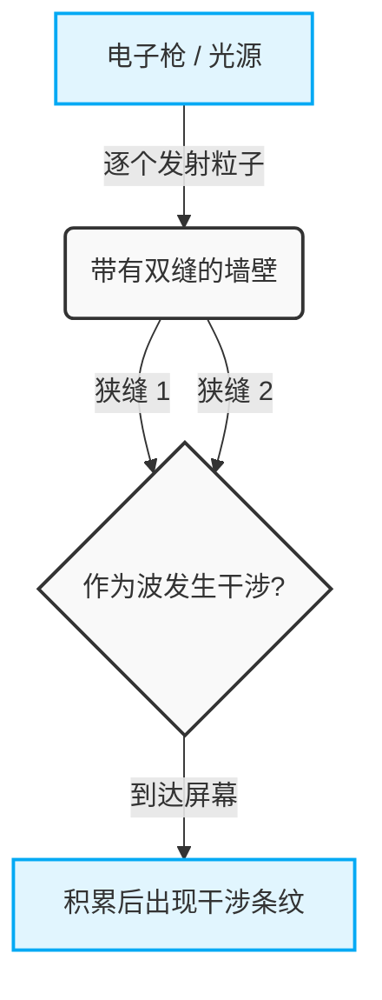
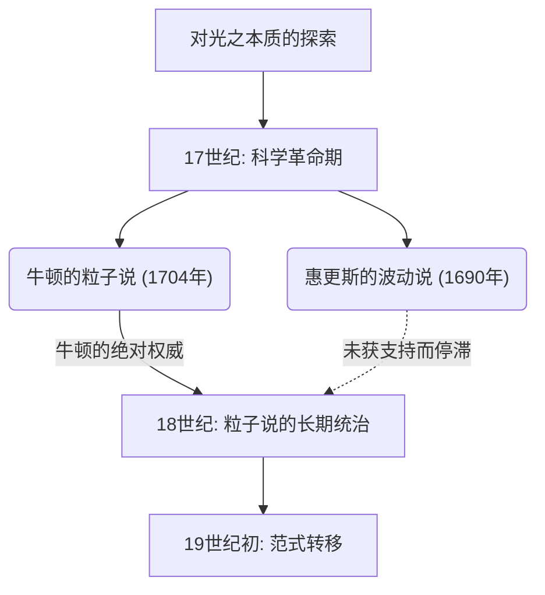
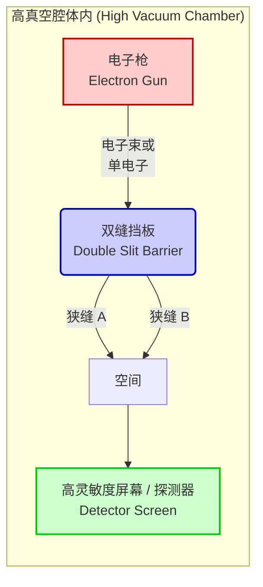

## 1. 【导入】什么是双缝实验？

我们生活的这个世界，似乎被坚如磐石的规则所支配。抛起的球会画出抛物线落下，向水面投掷石块会泛起层层涟漪。这些是由以牛顿力学为首的经典物理学所描述的“宏观世界”的常识，与我们的直觉完全一致。然而，一旦踏入由构成物质的终极最小单位——原子、电子，或者是光粒子（光子）等组成的“微观世界”，这些常识便会轰然坍塌。那里是一个我们日常感觉和直觉完全行不通、被极其诡异和不可思议的规则所支配的领域。

将这种微观世界的异常性以最简单、最震撼的方式呈现在我们面前的，正是“双缝实验（Double-slit experiment）”。20世纪杰出的天才物理学家理查德·费曼（Richard Feynman）曾评价这个实验是“量子力学中唯一的谜团”，甚至说“这个实验包含了量子力学的所有奥秘”。此外，许多著名的物理学家也对这个实验赞不绝口，称其为“物理学史上最美的实验”。那么，为什么仅仅在一块板上开两条缝隙（狭缝）的极其简单的实验，会被如此特殊对待，并持续令科学家们着迷呢？

### 违背直觉的宏观与微观世界

首先，让我们想象一下在我们的直觉能准确发挥作用的宏观世界中的现象。
例如，假设有一台向墙壁连续发射沾满颜料的小球（或者说是机关枪的子弹也可以）的机器。在它前面，放置着一块开有两个纵向细长狭缝（缝隙）的铁板。如果随机发射小球，只有穿过其中一个狭缝的小球才会撞击到后面的墙壁，留下墨迹。结果，墙壁上应该会浮现出与前面的两个狭缝形状相同的“两条竖线”印记。这是小球作为具有明确轨迹的“粒子”的行为，是任何人都能直观预测出的理所当然的结果。

接下来，我们来考虑“波”的情况。在水槽中放置一个带有两条狭缝的屏障，从一侧产生波浪。当波到达两条狭缝时，它会穿过那里，并以每个狭缝作为新的波源，形成两个半圆形的波向深处扩展。当这两个波相遇时，就会发生被称为“干涉”的现象。波峰与波峰重叠的地方会形成更高的波，波峰与波谷重叠的地方则会相互抵消变得平坦。结果，在后面的墙壁（或者岸边）上，会出现波浪强烈拍打的地方和完全没有波浪的地方交替出现的迷人条纹，这被称为“干涉条纹”。这也是在水面或声波等日常生活中可以观察到的波的基本性质。

到这里为止没有任何不可思议的地方。投掷粒子会产生“两条线”，发送波会产生“干涉条纹”。这就是我们所居住世界的常识，也是经典物理学的前提。

### 实验概述与被称为“最美实验”的理由

然而，当我们使用像光或电子这样的微观存在进行完全相同结构的实验时，情况发生了急剧变化，人类的直觉被彻底颠覆。
回顾历史，1801年，英国物理学家托马斯·杨（Thomas Young）首次使用太阳光进行了这个双缝实验（杨氏双缝实验）。当时，由牛顿提出的光是“粒子”的学说占据主导地位，但在杨的实验结果中，屏幕上却出现了美丽的“干涉条纹”。这提供了“光是波”的决定性证据，漫长的争论似乎终于尘埃落定。

真正的谜团，以及物理学上最大的范式转移，正是从这里开始的。进入20世纪，随着实验技术的惊人进步，人们能够“一个一个地”发射光或电子。电子具有质量，占据空间的特定位置，毫无疑问是明确的“粒子”。从电子枪中只发射一个电子，穿过双缝后作为屏幕上的一个点（亮点）到达某处。在这一刻，仅从撞击屏幕的痕迹来看，电子毫无疑问是作为粒子在行动。
然后，我们将这种“逐个发射电子”的过程重复几千、几万次，次数多得令人眼花缭乱。因为电子始终是每次只飞出一个，所以它们在空中与其他电子相撞并像波一样发生干涉在物理上是不可能的。自然地，每个人都认为，屏幕上应该会像投掷小球时一样，浮现出与狭缝形状相对应的“两条线”。

然而，随着无数电子点在屏幕上积累，浮现出来的却是一个令人难以置信的图案。那是只有当波相互碰撞时才应该出现的“干涉条纹”。

本应是逐个发射的“粒子”的电子，为何在整体上表现得像“波”一样，与自身发生干涉并描绘出条纹图案？这到底是怎么回事？就好像，发射出的一个电子像波一样在空间中扩散，同时穿过两条狭缝，产生自我干涉，然后在撞击屏幕的瞬间再次以一个粒子的形态出现。
更奇妙的是，当科学家们为了确认“电子到底穿过了哪条狭缝”，而在狭缝旁边安装了观测器（类似摄像机的东西）的瞬间，电子突然失去了作为波的性质，屏幕上出现的不再是干涉条纹，而是简单的“两条线”。这种“被观测时”改变行为的现象，将物理学家们卷入了更深的混乱旋涡之中。

双缝实验之所以被称为“物理学中最美的实验”，最大的原因在于，无需使用庞大的加速器或极其晦涩的数学公式，仅仅通过两个缝隙和一块屏幕这样极其简单优雅的装置，就能将宇宙的根本谜团展露无遗。它让我们极其直观地目睹了宏观世界常识彻底崩溃的瞬间。这不仅仅停留在确认物理现象的层面上，更是向我们持续抛出极其深刻的哲学和认识论问题：“现实究竟是什么”、“我们所‘看到’的这个世界真的客观存在吗”。在这个极其简单的小小实验中，浓缩了人类智慧的极限，以及试图超越极限的科学那无尽的浪漫。

## 2. 【历史】光是波，还是粒子？无休止的争论轨迹

自从人类认识到“光”这种存在以来，对其真面目的探索就从未停止过。从古希腊时代起，恩培多克勒（Empedocles）和欧几里得（Euclid）等哲学家、数学家们就开始思考光和视觉的机制，但作为近代科学的正式探索则始于17世纪。在这个时代拉开帷幕的“光是粒子，还是波？”这一争论，在随后的300多年里将物理学界一分为二，最终成为开启量子力学这扇全新物理学大门的原动力。本节将详细追溯这段波澜壮阔的科学史轨迹。

### 2.1 牛顿的粒子说 vs 惠更斯的波动说：17世纪的碰撞

17世纪后半叶，在科学革命的鼎盛时期，提出了两种关于光之本质的强大理论。那便是艾萨克·牛顿（Isaac Newton）的“粒子说（微粒说：Corpuscular theory）”与克里斯蒂安·惠更斯（Christiaan Huygens）的“波动说（Wave theory）”。

#### 牛顿的粒子说
以万有引力定律等闻名于世的近代物理学巨星艾萨克·牛顿，认为光是由极小的颗粒（微粒）集合而成的。牛顿在1672年的论文以及1704年的主要著作《光学（Opticks）》中，用粒子被墙壁弹开的力学模型，生动地解释了光直线传播的性质和在镜面上的反射定律。此外，关于白色光通过棱镜分散成七色光（色散）的现象，他主张这是因为不同颜色的光是具有不同质量的粒子，通过介质时的折射率不同所致。
对于波动说，牛顿指出了“如果光是像声音一样的波，它应该会绕到障碍物的背面（衍射现象），但光是直线传播并形成清晰阴影的”，以此否定了光是波。

#### 惠更斯的波动说
另一方面，荷兰杰出的物理学家克里斯蒂安·惠更斯在1690年发表的《光论（Treatise on Light）》中主张，光是在充满宇宙空间的被称为“以太（Aether）”的弹性介质中传播的波（纵波）。惠更斯提出了著名的“惠更斯原理（Huygens' Principle）”，即“波面上的所有点，都会成为新的次级波的波源”，并用几何学完美地解释了光的直线传播、反射以及折射定律。
特别是在折射方面，牛顿预言“当光进入水或玻璃等密度较大的介质时，粒子会受到引力而加速，因此光速会变快”，但在惠更斯的波动说中得出的结论是“在密度较大的介质中波的传播速度会变慢”，两者形成了正面冲突。

然而，由于当时牛顿在科学界拥有绝对的权威和影响力，惠更斯的波动说逐渐黯然失色，整个18世纪，牛顿的粒子说作为主流一直占据着统治地位。

## 2.2 托马斯·杨的光的双缝干涉实验（1801年）与波动说的胜利

进入19世纪，发生了一件决定性的事件，打破了长期占据主导地位的微粒说的堡垒。这场变革的主角是英国博学家托马斯·杨（Thomas Young）。作为一名医生，且曾为破译埃及象形文字（罗塞塔石碑）做出贡献的杨，在1801年进行了一项在物理学史上熠熠生辉的实验。这就是“杨氏干涉实验（后来的双缝实验）”。

#### 干涉条纹的发现
杨的实验装置极其简单而巧妙。他让太阳光穿过一个非常细小的针孔（或狭缝）以产生点光源，然后让这束光进一步穿过两个距离非常近的细小狭缝（双缝），并将其投影在后面的屏幕上。

如果光像牛顿所说的那样是纯粹的“粒子”，那么屏幕上应该会投射出与狭缝形状相对应的两条亮线。然而，杨在屏幕上看到的却是明暗交替排列的条纹图案，即“干涉条纹（Interference fringes）”。

这一现象，如果不仅把光看作波，是绝对无法解释的。当水面上的两列波相遇时，波峰与波峰重叠的地方会变得更高（相长干涉），波峰与波谷重叠的地方则会相互抵消变平（相消干涉）。杨得出结论，从两个狭缝发出的光波正是像这样发生了干涉。

#### 数学证明与波动说的确立
这种相长与相消的条件，由从两个狭缝到屏幕上某点的路径长度之差（光程差 $\Delta L$）来决定。假设狭缝间距为 $d$，到屏幕的夹角为 $\theta$，光波长为 $\lambda$，则光程差可以表示如下：

$$ \Delta L = d \sin \theta $$

* **明线（相长干涉条件）**: $\Delta L = m\lambda \quad (m = 0, \pm1, \pm2, \dots)$
* **暗线（相消干涉条件）**: $\Delta L = \left(m + \frac{1}{2}\right)\lambda$

杨的这项发表最初在英国国内遭到了牛顿信徒们的猛烈批评与嘲笑。然而，此后的1815年，法国的奥古斯丁·让·菲涅耳（Augustin-Jean Fresnel）将光的衍射与干涉构建为了严密的数学理论。更在1818年的法国科学院竞赛中，评审委员西莫恩·德尼·泊松（波动说反对派）指出：“如果菲涅耳的理论是正确的，那么在圆形障碍物阴影的中心应该会出现一个亮斑。这种荒谬的事情是不可能的。”但是，实际进行实验的多米尼克·弗朗索瓦·让·阿拉戈完美地观测到了那个“泊松亮斑（阿拉戈亮斑）”，从而使波动说的正确性变得毋庸置疑。

在1850年，莱昂·傅科等人通过实验证明了光在水中的速度慢于在空气中的速度，彻底否定了牛顿的预测。到了1864年，詹姆斯·克拉克·麦克斯韦作为电磁学的集大成者，确立了“光是一种电磁波”的理论。至此，光的“波动说”取得了完全的胜利，这场争论似乎已经尘埃落定。

### 2.3 爱因斯坦的光量子假说（1905年）与微粒说的复活

麦克斯韦关于光是电磁波的理论实在太过优美，以至于19世纪末的物理学家们相信：“物理学已基本完成，剩下的就只是测量一些精确的数值了。”然而，在19世纪末到20世纪初，出现了一种用波动说无论如何都无法解释的奇妙现象。这就是“光电效应（Photoelectric effect）”。

#### 光电效应之谜
光电效应是指，当光照射在金属表面时，电子（光电子）会从金属中逸出的现象。根据当时波动说的常识，光（波）的能量应该与其振幅（亮度）成正比。因此，人们认为：“只要照射强烈（明亮）的光，无论什么颜色的光，电子都应该会猛烈地飞出。”

然而，实验结果完全背离了波动说的预测。

1. **极限频率的存在**: 对于低于某个特定频率（颜色）的光（例如红光），无论照射得多么强烈（明亮），照射时间多么长，电子都完全不会飞出。
2. **瞬时性**: 相反，如果是高于极限频率的光（例如紫外光），哪怕光线再微弱，在照射的瞬间也会立即有电子飞出。
3. **能量的依赖性**: 飞出的电子的动能，并不取决于光的强度（亮度），而仅仅取决于光的频率（颜色）。

#### 爱因斯坦的戏剧性解决方案：光量子（光子）
解开这个令人绝望的谜团的，是在瑞士专利局工作的一位默默无闻的青年——阿尔伯特·爱因斯坦（Albert Einstein）。在被称为“奇迹之年”的1905年，他将马克斯·普朗克在热辐射研究（1900年）中提出的“能量子假说”应用于光本身，发表了“光量子假说（Light quantum hypothesis）”。

爱因斯坦大胆地假设，被认为是连续波的光，实际上是能量的团块，即被称为“光量子（光子：Photon）”的粒子集合。一个光量子所具有的能量 $E$ 与光的频率 $\nu$ 成正比，可以用以下普朗克-爱因斯坦公式来表示：

$$ E = h\nu $$

（此处，$h$ 为普朗克常数，$6.626 \times 10^{-34} \, \text{J}\cdot\text{s}$）

利用这个假说，光电效应之谜就像魔法一样被解开了。

光电效应实际上是一个像台球一样的现象：“1个光量子”与金属中的“1个电子”发生碰撞，并将其能量毫无保留地传递给电子。如果将电子摆脱金属束缚所需的最低能量称为“逸出功（$W$）”，那么飞出的电子的最大动能 $E_k$ 可以用下面这个漂亮的方程式来表示：

$$ E_k = h\nu - W $$

如果光量子的能量 $h\nu$ 小于逸出功 $W$（低频率的光），那么无论用多少大量的光量子去碰撞（即使增强光强），电子也无法从金属中飞出。这就是极限频率存在的原因。

#### 走向“既是波，又是粒子”的不可思议的世界
爱因斯坦的光量子假说，在1914年通过罗伯特·密立根精密的实验得到了完全证明，爱因斯坦也因此成就荣获1921年的诺贝尔物理学奖。（密立根最初并不相信爱因斯坦的理论，他本打算通过实验来反驳它，却具有讽刺意味地证明了其正确性）。此外，在1923年，阿瑟·康普顿发现了X射线与电子碰撞时波长发生改变的“康普顿散射”，这确凿地证明了光表现出具有动量   $p = \frac{h}{\lambda}$   的“粒子”特性。

原本已在杨氏实验中被彻底击败的“微粒说”，在经历了100年的岁月后，以更加洗练的“量子”形式实现了奇迹般的复活。
然而，这产生了一个严重的矛盾。这意味着光既具有像在杨氏双缝实验中展现出的“干涉”这种明显的波动性质，同时又兼具像在光电效应中展现出的“粒子”性质。

光究竟是波，还是粒子？
对于这个问题，物理学的最终答案是：“光既是两者，又都不是两者。光是同时兼具‘波动性’与‘粒子性’的量子实体。”这是一个强烈违背人类直觉的结论。这就是“波粒二象性（Wave-particle duality）”的诞生。
而这种二象性的概念，不再局限于光，开始被应用于电子等物质本身（德布罗意的物质波），物理学随之迈入了一个前所未有的深渊——那个名为“量子力学”的奇异而迷人的世界。其最具象征意义的舞台，正是升级为现代版的“量子力学双缝实验”。

## 3. 【转变】物质也是波？德布罗意波与电子的双缝实验

由于爱因斯坦的光量子假说（1905年）提出光“既是波，又是粒子”，物理学界陷入了巨大的混乱与范式转变的漩涡之中。尽管多年来，凭借杨氏干涉实验和麦克斯韦的电磁学，人们一直坚信“光绝对是波”，但如果不把光看作“粒子（光子）”，就无法解释光电效应等现象。这种被称为“波粒二象性”的奇异性质，最初被认为是只有光才具有的特异性质。然而，进入20世纪20年代后，这种二象性的概念不再局限于光的世界，而是向构成我们身体的“物质”本身露出了獠牙。

### 3.1. 路易·德布罗意提出物质波：源自完美对称性的飞跃

1924年，法国年轻的研究生路易·德布罗意（Louis de Broglie）在他的博士论文中，提出了一个极其大胆、从根本上颠覆了物理学历史的假说。那就是：“如果光（曾被认为是波）具有粒子的性质，那么反过来，像电子这样的物质（曾被认为是粒子）是不是也具有波的性质呢？”

自然界总是偏爱对称性，德布罗意的这一哲学直觉正是该假说的根基。他将爱因斯坦在狭义相对论和光量子假说中推导出的能量与动量的关系式，试着应用到了具有质量的物质粒子上。光子的动量 $p$，利用普朗克常数 $h$ 和波长 $\lambda$，可以表示为 $p = h / \lambda$。德布罗意将其反转，把伴随质量为 $m$ 、以速度 $v$ 运动的粒子（动量 $p = mv$）的波长 $\lambda$，用如下极其简单的数学公式表示了出来：

$$ \lambda = \frac{h}{p} = \frac{h}{mv} $$

这就是著名的“德布罗意波长（物质波的波长）”公式。这个公式意味着，从我们日常看到的棒球、汽车，一直到微小的电子，所有运动的物体都带有作为“波”的性质。那么，为什么我们在日常生活中看不到棒球像波一样发生干涉或衍射呢？这是因为普朗克常数 $h$ （约 $6.626 \times 10^{-34} \text{ J}\cdot\text{s}$）极其微小。对于宏观物体来说，质量 $m$ 实在太大了，导致德布罗意波长 $\lambda$ 小到实质上可以被视为零，波动性也就被完全隐藏了起来。然而，在质量极其微小的电子世界中，这个波长达到了与X射线（电磁波）波长同等的尺度（约 $0.1 \text{ nm}$ 等），作为绝对不可忽视的大小显现了出来。

德布罗意的这篇论文实在太不符合常理，以至于让当时的评审委员们大为困惑。但是，当评审委员之一的保罗·朗之万将这篇论文寄给爱因斯坦后，爱因斯坦对其赞不绝口：“他掀开了巨大面纱的一角。”由此，德布罗意的“物质波（matter wave）”概念引起了世界性的关注，并直接促成了后来薛定谔波动学的完成。

### 3.2. 戴维森-革末实验：物质波动性的证明

德布罗意的假说作为理论虽然十分优美，但它是否真正描述了现实中的自然界，还需要等待实验的证明。“如果电子真的是波，那么它应该会产生波特有的现象——‘衍射’和‘干涉’。”在这种信念的驱使下，世界各地的物理学家们开始进行实验，试图捕捉电子的波动性。

终于在1927年，决定性的证据出现了。这就是由美国贝尔实验室的物理学家克林顿·戴维森（Clinton Davisson）和莱斯特·革末（Lester Germer）进行的“戴维森-革末实验”。

最初，他们是出于另一个目的进行实验的：将电子束照射在镍晶体上，以研究其散射情况。然而，为了挽救实验中的一次事故（真空管破裂导致镍表面氧化），他们将镍置于高温下加热，却意外地幸运获得了镍的单晶体。当再次用电子束照射这块单晶化的镍时，他们观测到了令人惊讶的现象。散射出的电子强度在特定角度出现了极大值，呈现出了明确的“衍射图案”。

晶体内原子规则排列的间距（晶格常数），与电子的德布罗意波长几乎处于同一尺度。也就是说，镍晶体本身成为了电子的“天然衍射光栅”。戴维森和革末从这个衍射图案反向计算出的电子波长结果，与德布罗意公式 $\lambda = h/p$ 预测的值完美一致。同年，英国的乔治·佩吉特·汤姆孙（电子发现者 J.J. 汤姆孙的儿子）也成功观测到了穿透薄金属箔的电子束所产生的衍射环（德拜-谢乐环）。

这些实验结果，将物质具有波动性质这一毋庸置疑的事实摆在了物理学界的核心位置。本应是粒子的电子，却表现得像波一样。这是自然界深渊般的真理被揭示的瞬间，也是宣告量子力学黎明到来的号角。德布罗意在1929年，戴维森和汤姆孙在1937年，分别荣获了诺贝尔物理学奖。

### 3.3. 日立制作所（外村彰等人）的决定性双缝实验（1989年）

即使在证明了电子是波之后，物理学家们的探索也并未停止。他们试图将一直被当作思想实验来探讨的“电子双缝实验”在现实中，以极限的精度付诸实施。

就像光的双缝实验（杨氏实验）一样，如果向双缝发射电子，后面的屏幕上应该会出现干涉条纹。然而，在这里，量子力学中最令人费解的悖论显露了出来：“如果不是一次性大量发射电子，而是 **每次1个** 地发射，会发生什么呢？”

一个电子是不可分割的粒子。因此，它应该只能穿过左边或右边的其中一个狭缝。逐个到达屏幕的电子，只会在屏幕上留下一个亮点。当将这个过程重复几万次时，这些点的集合，究竟是仅仅形成两个狭缝的阴影（两条线），还是会形成显示波动性质的干涉条纹呢？

面对这个终极问题，突破技术极限并给出世界上最美丽、最完美答案的，是日本日立制作所基础研究所的研究团队（外村彰博士等人）。1989年，他们充分利用电子全息摄影技术以及超高真空、极低温的电子显微镜技术，出色地完成了“单电子双棱镜干涉实验”。

实验装置令人惊叹。他们将从电子枪发射出的电子数量减少到极限，创造出在电子在空间中飞行的时间里，始终保持“装置内只有一个电子存在”的状态。电子的速度达到约每秒15万公里，飞越从光源到探测器的距离所需的时间只需一瞬间。而下一个电子的发射，会在前一个电子到达屏幕之后的很久才进行。

实验开始后，探测器（监视器）上开始零零星星地出现显示电子到达的亮点。在最初几个、几百个的阶段，看起来就像是屏幕上随机散布着一些点。就如同夜空中的星星一样，似乎没有任何秩序可言。

然而，随着几千个、几万个电子的不断累积，一幅令所有人都一目了然的惊愕景象浮现了出来。原本看似无序的点集，逐渐形成了规则的明暗相间的条纹图案——这毫无疑问就是“干涉条纹”。

这一结果所意味着的内容，是极其违背直觉的。电子确确实实是作为“1个粒子”到达屏幕的（正因为如此才会记录下1个点）。但是，作为整体却能产生干涉条纹，这意味着对于那1个电子，只能解释为：“它自身作为波同时穿过了两道狭缝（双棱镜的两侧），并与自身发生了干涉。”没有与任何事物发生相互作用的单个电子，竟然与自己发生了干涉。狄拉克曾说过“光子只与自己发生干涉”，而同样的原理，在具有质量的物质粒子——电子身上也得到了完美的证实。

外村彰博士等人的这项实验，作为对量子力学之奇妙——即“波粒二象性”的最直观且直接的证明，在世界范围内受到了极高的赞誉。英国科学杂志《物理世界》（Physics World）在2002年举行的“物理学史上最美实验”的读者投票中，这项“电子双缝实验”堂堂正正地被选为第1名，这也称得上是理所当然了。

就这样，德布罗意那看似荒诞不经的“物质即是波”的假说，在经历了60多年的时光后，作为由1个电子所描绘出的神秘干涉条纹，在我们眼前展现出了它真实的样貌。然而，这项实验在解开量子力学之谜的同时，也开启了一扇通往更深层次谜团的大门，那就是“观测问题”。“一旦试图去看它穿过了哪条狭缝，干涉条纹就会消失”——在下一章中，我们将进一步踏入这个奇异量子世界的更深渊之中。
## 4. 【实验方法与结果】究竟发生了什么

（为了深入双缝实验的核心，一窥量子力学的深渊，这里我们将不使用光，而是聚焦于使用“电子”的实验来进行解说。虽然在光子或其他基本粒子，甚至像富勒烯这样相对较大的分子中也确认了同样的现象，但使用有质量、被我们认知为“明显是物质粒子”的电子，能让这种现象的悖论与不可思议之处更加凸显。）

### 4.1 实验装置的设置：捕捉极微世界的舞台布置

首先，让我们详细看看这个具有历史性和革命性的实验是在什么样的装置中进行的，也就是它的舞台布置（设置）。双缝实验的概念结构惊人地简单，但要实际上将其作为物理实验取得成功，背后需要高度的技术和极其严格的环境控制。

实验装置主要由以下3个核心组件构成。为了防止电子与空气分子碰撞而发生散射，它们全部被严密地密封放置在一个高度真空的腔体（真空容器）中。

1. **电子枪（Electron Gun）**:
   这是用于发射实验主角“电子”的装置。它利用加热灯丝释放热电子，或使用强电场提取电子的原理，将具有一定动能的电子朝着特定的方向发射。在这个实验中极其重要的一点是，它不仅能像瀑布一样连续发射强大的电子“束”，甚至令人惊叹的是，还能将输出降低到极限，实现“确确实实地每次一个”地控制发射。这种“单电子发射技术”是现代量子力学实验中不可或缺的精密技术之一。

2. **双缝（Double Slit）**:
   这是供电子枪发射出的电子穿过的挡板（墙），上面开有两个非常细且距离极近的平行狭缝（缝隙）。由于电子的“物质波（德布罗意波）”波长极短，因此这个狭缝的宽度以及狭缝之间的距离，也必须极其精密地制造在纳米（十亿分之一米）到微米尺度的微小尺寸上。如果狭缝的宽度或间距相对于电子的波长太宽，就无法清晰地观测到作为波动性质的“干涉”。这种极小双缝的制造技术本身，可以说是最先进的电子束光刻机等微细加工技术的结晶。

3. **屏幕（探测器，Screen / Detector）**:
   这是用于让安全穿过双缝的电子最终到达，并记录其位置的观测屏幕。在过去的实验中，人们使用感光照相底片等，而现在则使用高灵敏度的CCD相机、荧光板、特殊的半导体像素探测器等。由此，可以将电子“到达（击中）了哪里”每一次都极其准确地记录为二维坐标。当电子碰撞到屏幕时，会发出微弱的光，或者产生电信号，从而留下“毫无疑问作为一个粒子到达了这里”的清晰痕迹（点）。

下图是该实验装置的整体布局和电子轨迹的模式图。

### 4.2 照射大量电子的情况：违背直觉的波动行为（干涉条纹的形成）

那么，实验终于要开始了。作为第一步，我们调高电子枪的输出，将“大量的电子”如同阵雨或机关枪一样，朝着双缝齐射而出。

如果用我们日常所拥有的经典物理学常识来思考，电子是具有质量的“粒子（类似于小小的子弹）”。因此，穿过两条狭缝的大量电子，应该会集中碰撞在屏幕上位于各狭缝直行方向延长线上的两个位置，预计结果会形成类似“两条竖条纹”的图案。想象一下，将油漆喷雾喷向一个开有两个缝隙的模板。穿过缝隙的油漆应该会按照缝隙的形状在墙上画出两条线。

然而，屏幕上实际出现的图案，完全违背了我们的直觉和预测。屏幕上呈现的不是两条简单的竖条纹，而是清晰地形成了 **许多条明暗相间的条纹图案（干涉条纹：Interference Pattern）** 。

这种“干涉条纹”，与向池塘水面同时投入两块石头时产生的水波纹重叠形成的图案，或者在光的干涉实验中看到的图案，具有完全相同的几何特征。
- **在波峰与波峰、或波谷与波谷重叠的地方（相长干涉）** ，会变成有许多电子到达的“明亮（电子碰撞密度高）”的条纹。
- **在波峰与波谷重叠的地方（相消干涉）** ，波会相互抵消，变成几乎没有电子到达的“暗淡（电子碰撞密度接近零）”的条纹。

这一结果所意味的结论只有一个。那就是， **“电子表现出了波的性质”** 。从电子枪发射出的电子群，像水面波一样在空间中传播，“同时”穿过了两条狭缝。然后，从狭缝A衍射散开的波，与从狭缝B衍射散开的波，在屏幕前方的空间中相互重叠，发生干涉，我们只能将其解释为是它们创造出了那种特征性的明暗条纹。

被人们坚信为“粒子”的电子，竟然也同时具备“波”的性质（波粒二象性）。单是这一事实，就是物理学上历史性的重大发现，足以令人震惊，但量子力学真正的谜团，以及从根本上颠覆我们常识的现象，从这里开始还要再深化一个层次。

### 4.3 “每次1个”发射电子的情况：极限实验揭开“概率波”的真面目

“既然是同时发射大量电子，那会不会只是电子之间在空中发生了碰撞，或者因为电力（库仑力）相互排斥，结果才形成了类似波的图案呢？”
作为科学家，产生这样的疑问是非常自然的。实际上，在干涉条纹刚被发现时，许多物理学家也是这么想的，试图用经典力学来解释这种现象。

为了彻底解决这个疑问，实验技术得到了进步，进行了更具决定性的实验。（在日本，1989年日立制作所的外村彰等人组成的团队进行的实验非常著名，被誉为世界上最美丽的实验之一）。
那就是， **将电子枪的输出降低到极限，进行“确确实实每次只发射1个”电子** 的实验。

具体来说，是在确认前一个发射的电子已经到达屏幕并完全消失（或被吸收）之后，才发射下一个新的电子。这需要重复几万次、几十万次这样惊人的次数。在这个设定下，保证了实验装置内的空间里“始终只存在1个电子”。因此，电子之间在空中相撞，或者相互干涉的情况在物理上是100%不可能发生的。

让我们随着时间推移（电子积累的数量），来追踪这个处于极限状态下的单电子实验结果。

**步骤1：实验刚开始（数十～数百个电子）**
屏幕上，只是星星点点地、在完全随机的位置上打下了一个个点。电子在到达屏幕的瞬间，显然表现出了作为“一个粒子”的性质，在一个特定的微小坐标上记录下了一个点。此时，屏幕上的图案看不出任何规律性，看起来只是一堆无序而随机的点的集合。就像是蒙上眼睛随便扔飞镖一样。

**步骤2：数千～数万个电子到达之后**
随着时间的推移，实验不断重复，当屏幕上积累了数千到数万个点时，奇妙的现象开始发生了。原本以为完全随机的点的分布中，渐渐开始显现出“偏移”和“浓淡”。密集打入许多点的区域，和几乎没有点打入的区域，开始隐约分离。

**步骤3：实验结束时（数十万个以上电子到达）**
花费足够长的时间，用令人发指的操作，每次1个地持续发射了庞大数量（数十万到数百万个）的电子之后，当我们观看屏幕整体的累积图像时……那里竟然清晰地浮现出了与一次性发射大量电子时完全相同的、令人惊叹的 **“干涉条纹”** ！

这是物理学史上最令人不寒而栗、最违背直觉，但同时也是最美丽、最深奥的结果之一。

因为，电子是“完完全全每次只发射1个”的。它绝对不可能与前后的电子发生相互作用。尽管如此，最终却形成了显示波的干涉的条纹，那么我们只能接受一个难以置信的结论： **“1个电子，在与它自己发生干涉”** 。

试图合乎逻辑地解释这种现象，会让我们日常的空间和物质感觉完全崩溃。
1个电子，在从电子枪发射出来之后，就仿佛像“波”一样扩散到整个空间， **“同时”穿过右边的狭缝和左边的狭缝** ，在屏幕前与“自己的波”相互干涉，然后，在到达屏幕被观测到的瞬间，又再次作为“1个粒子”收缩（决定）在某一点上。

那么，这1个电子在空间中传播的“波”的实体到底是什么呢？
在量子力学中，这并不是像水面或空气那样物理介质在波动的实体波。根据马克斯·玻恩提出的解释，这是 **“表示电子存在于该空间特定位置的『概率』的波（概率波）”** 。在数学上，这被称为“波函数”。

电子并不是像弹珠一样沿着特定轨道（路线）直飞过去的。从发射出来到到达屏幕之间，电子以“穿过右边狭缝的状态”和“穿过左边狭缝的状态”，甚至“穿过空间中所有路径的状态”，以各种不同的概率“重叠在一起的状态（叠加态）”在空间中传播开来。

然后，当它撞击到被称为屏幕的观测器上，“到达了哪里”被测量的那一瞬间，原本弥散在空间中的概率波就在一瞬间收缩于一点（波函数的坍缩），现实中粒子的位置才第一次确定为“在这里”。

干涉条纹的“明亮部分（最终点聚集较多的部分）”，是电子存在的概率因波的干涉而被提高的地方；而“暗淡部分（点没有聚集的部分）”，则意味着概率波相互抵消变为零的地方。就像多次掷骰子，每个点数出现的概率会趋近于理论值（1/6）一样，每个电子“概率性的行为”重复几十万次之后，概率波的形状（干涉条纹）就作为现实的图案浮现出来了。

“1个电子同时穿过两条狭缝”，“在被观测到之前状态并未确定，仅作为无数种可能性重叠在一起的概率波存在”。
这种双缝实验所摆出的冷酷实验事实，向我们提出了超越物理学范畴的深奥的哲学层面的问题：“存在本身到底意味着什么？”、“我们所认知的现实究竟是什么？”。

## 5. 【观测问题】一看就改变行为的量子

量子力学中的双缝实验，不仅对物理学，甚至对哲学和思想领域都产生了巨大的影响，它被称为科学史上最美丽，同时也是最诡异的实验，其理由的核心就在于此。那就是，“观测（测量）”这个行为本身，决定性地改变了物理现象结局这一惊人事实。

在我们生活的日常（宏观）世界中，也就是经典物理学支配的世界里，“观看”只不过是一种单纯的被动行为。无论我们是否看着夜空中悬挂的月亮，月亮都确实存在于那里，并遵循牛顿力学描绘出固定的轨道运动。不会因为我们看着它，月亮的轨道就发生改变。观察者的存在对被观察对象的客观现实不产生任何影响，这是我们拥有的坚固常识。

然而，在量子的微观世界里，这种常识被从根本上颠覆了。“观看（观测）”不仅仅是接收信息，而是对对象产生不可逆转和决定性影响的能动过程。在观察者向自然抛出问题的瞬间，自然就改变了它的行为。在这一节中，我们将极其深入地探讨双缝实验中最大的谜团，也是现代物理学中至今仍在争论的“观测问题（Measurement Problem）”。

### 观测“穿过了哪条狭缝”会发生什么

想象一下，从电子、光子，甚至到富勒烯（C60）这样的大分子，每次发射一个量子，让其穿过两条狭缝并到达屏幕的过程。在之前的解说中，我们已经确认，即使拉开间隔每次只发射一个量子，如果长时间持续观察屏幕上积累的亮点，那里会形成美丽的干涉条纹（显示出波的性质的证据）。这被解释为一个量子以“穿过右边狭缝的可能性”和“穿过左边狭缝的可能性”这两种状态的叠加态（Superposition）在空间中传播，其自身的概率波相互干涉的结果。

但是，此时物理学家们产生了一个自然的、但在量子世界中却如恶魔般的疑问：“量子真的『同时穿过两条狭缝』了吗？还是说『其实它只穿过了其中一条，只是我们不知道而已』？让我们在狭缝旁边放个相机来确认一下吧。”

为了回答这个疑问，我们在实验装置上加上一个改变。在狭缝旁边，设置一个灵敏度极高的“探测器（观测装置）”。这个探测器是为了“观测”并记录电子究竟是穿过了右边的狭缝，还是穿过了左边的狭缝。实验的设置除了增加探测器之外，其余完全相同。逐个发射电子。探测器确实工作了，它准确地告诉我们“穿过了右边”、“穿过了左边”等电子的路径信息（Which-path information）。正如预料的那样，有一半的电子穿过了右边，另一半的电子穿过了左边。这下我们的直觉满足了：“什么嘛，果然电子还是作为粒子，只穿过了其中一个洞而已。叠加态什么的都是幻觉。”

可是，当物理学家们确认最终到达屏幕的电子分布图案时，他们说不出话来了。那里描绘的，不再是显示波动性质的美丽干涉条纹，而仅仅是“两条线（或者说两座山）”而已。这与把棒球或小石头等经典粒子扔向狭缝时形成的图案完全相同。形成干涉条纹不可或缺的“波的干涉”，完全消失了。

就在我们试图观测电子“穿过了哪边”的那一瞬间，电子舍弃了波的性质（叠加态），开始表现为纯粹的经典粒子。如果关掉观测器的电源，干涉条纹又会重新出现；一旦打开电源，干涉条纹就消失得无影无踪。更令人惊讶的是，即使是“记录了观测数据，但没有任何人看就把数据删除了”的情况，后来的实验（量子擦除实验）表明干涉条纹甚至会复活。量子简直就像是“知道”我们正在看着它，或者路径信息被留在了宇宙的某个角落一样地做出反应。这被称为“由于获取路径信息而导致的干涉破坏”，成为了证明量子世界与我们的直觉相差多远的决定性证据。

### 哥本哈根诠释（波包坍缩）

对于这种极其不可思议的现象，我们到底该如何解释呢？在20世纪20年代，以尼尔斯·玻尔、维尔纳·海森堡、马克斯·玻恩等人为核心构建的量子力学中最标准、最正统的解释，就是“哥本哈根诠释”。

在哥本哈根诠释中，人们认为被观测之前的量子，仅作为弥散在空间中的“概率波（波函数）”存在。波函数（通常用 $\Psi$ 表示）本身并不是物理实体，而是一种数学工具，表示在某处发现量子的“概率幅”。这种概率波遵循薛定谔方程，以决定论的且平滑的方式随时间演化（变化）。在双缝实验中，电子的概率波穿过右狭缝和左狭缝，并在屏幕前相互干涉。到此为止，这是一个由波的性质支配的世界，是一个决定论的过程。

然而，就在进行“观测”这一物理过程的瞬间，这个波函数发生了剧烈且不连续的变化。这被称为“波包坍缩（波函数坍缩：Wavefunction Collapse）”。在观测器检测到“电子穿过了右边狭缝”的那一瞬间，原本弥散在整个空间中的“可能穿过左边”、“可能穿过中间”等所有可能性的波，以超光速瞬间消散，坍缩成“穿过了右边狭缝的粒子”这唯一的一个现实（点）。

哥本哈根诠释中最激进、最重要的主张是，“在观测之前，量子在哪里、处于什么状态，是『未确定的』”。并不是说它其实在某处只是我们不知道（这被称为“隐变量理论”），而是字面意义上的“存在概率弥散在空间中的状态本身就是现实”，是观测这种与宏观系统的相互作用，从无数的可能性中随机地“选择”并“决定”了一个现实。

阿尔伯特·爱因斯坦一生都强烈反对这种模糊的、概率论的观点。“上帝不掷骰子（God does not play dice with the universe）”这句名言，就是对这种概率性解释的批评。他还讥讽道：“难道我没看月亮的时候，月亮就不存在了吗？”，并一直坚持主张量子力学是不完备的理论（例如EPR悖论）。但是，后来的贝尔不等式验证实验（如阿斯佩实验）否定了爱因斯坦所期望的局域性隐变量理论，直到现在，无数精密的实验结果仍在持续支持这种诡异的哥本哈根诠释（以及与其相关的多世界诠释等非局域的、概率性模型）的正确性。

### 与海森堡不确定性原理的关系

为什么观测这个行为必然会改变当前量子的状态，并破坏干涉条纹呢？维尔纳·海森堡在1927年提出的“不确定性原理（Uncertainty Principle）”，从更根本的物理学原理出发，精彩地解释了这个谜团。

不确定性原理指出，在微观世界中，从原理上讲，是不可能同时以无限的精度准确测量某个粒子的共轭物理量（成对的性质）的，例如“位置（在哪里）”和“动量（以多少质量，朝哪个方向以多快速度飞行）”。这就是宇宙的根本法则。

将其用数学表达式表示，就是以下著名的不等式：

$$ \Delta x \cdot \Delta p \ge \frac{\hbar}{2} $$

在这里，各个符号的含义如下：
- $\Delta x$ ：“位置的不确定度（位置测量中的标准差，误差的分布范围）”
- $\Delta p$ ：“动量的不确定度（动量测量中的标准差）”
- $\hbar$ ：“狄拉克常数（约化普朗克常数）”。它是普朗克常数 $h$ 除以 $2\pi$ 得到的值，约为 $1.054 \times 10^{-34} \mathrm{J\cdot s}$ ，是一个极其微小的值。

这个公式的意思是，“位置的不确定度”和“动量的不确定度”的乘积，必须始终大于或等于一个固定的极小值（$\hbar / 2$）。也就是说，你越是想极其准确地确定粒子的位置（让 $\Delta x$ 极度逼近零），成反比地，动量的不确定度（$\Delta p$）就会发散向无穷大，导致粒子下一瞬间会飞向哪里变得完全无法预测。反之亦然，如果想精确测量动量，那么该粒子位于哪里就会在整个空间变得模糊不清。

重要的是，这并不是“因为人类制造的测量仪器性能不好而产生的误差”，而是量子本身所内含的“自然界根本的涨落性质”。量子本身就不被允许同时拥有确定的位置和动量的值。

让我们透过这个不确定性原理的镜头，来解开双缝实验中的“观测问题”。
我们试图用探测器得知“电子是穿过了右边狭缝还是左边狭缝”，换句话说，这无异于“高精度地测量并确定电子在狭缝平面垂直方向上的位置（$x$）”（使 $\Delta x$ 充分小于狭缝的间距）。

为了看到电子的位置，必须让电子与某种事物发生相互作用。例如，考虑用光（光子）照射电子，然后用显微镜观察其散射光（海森堡的显微镜思想实验）。为了区分电子到底穿过了哪条狭缝，必须照射波长比狭缝间距还要短，也就是能量非常高的光。

但是，当高能量的光子与电子碰撞时，就像台球碰撞一样，光子会给电子带来巨大的冲击（动量变化）。由此，电子在垂直方向上的动量（$p$）就会被随机而剧烈地扰乱（根据不确定性原理，作为减小 $\Delta x$ 的代价，$\Delta p$ 会增大）。

穿过狭缝后电子的动量被随机扰乱，这意味着电子随后到达屏幕的位置会变得完全零散。本来，作为叠加的波，应该保持着相位在空间中推进，从而在特定位置概率汇聚形成精密的干涉图案，但这种扰动彻底破坏了干涉图案（相位的随机化＝退相干）。结果，波的干涉消失了，取而代之的是仅仅穿过两条狭缝的粒子发生散射所形成的经典的两条线。

就像这样，不确定性原理通过冷酷的数学公式证明了一个残酷的事实：“不给对象带来任何影响（保持干涉）而提取路径信息的观测是不可能的”。观测这种行为，是在我们从对象中确定性地提取出一个信息（位置）的同时，扰乱了对象所拥有的另一个重要信息（动量或波动的相位），将其永远地夺走至宇宙不可知彼岸的暴力行为。双缝实验，可以说是以任何人都能看懂的形式，清晰地描绘出这种不确定性原理和波包坍缩是如何支配微观世界的，它是量子力学的终极演示。
## 6. 【最前沿】量子力学的基础与现代诠释

双缝实验所揭示的“在观测之前是波，观测的瞬间变成粒子”这一奇异事实，让物理学家们对宇宙的根本性质产生了深深的疑问。在本章中，我们将用数学来描述这一不可思议的现象，并探讨该如何诠释它，从而深入到量子力学最深奥的主题之中。在这里，等待着我们的是能够彻底颠覆我们常识的最前沿的理论与实验。微观世界中的物理定律，正以与我们日常经验的宏观世界完全不同的原理运行着。

### 薛定谔方程与概率幅

在数学上支配量子力学世界的，是奥地利物理学家埃尔温·薛定谔（Erwin Schrödinger）于1926年推导出的“薛定谔方程”。正如牛顿力学中的运动方程（ $F = ma$ ）以决定论的方式描述宏观物体的运动一样，薛定谔方程严格地描述了微观粒子的状态如何随时间发生变化（时间演化）。

对于在最基本的一维空间中运动的、质量为 $m$ 的单个粒子，其含时薛定谔方程表示如下：

$$ i\hbar \frac{\partial}{\partial t} \Psi(x, t) = \left[ -\frac{\hbar^2}{2m} \frac{\partial^2}{\partial x^2} + V(x, t) \right] \Psi(x, t) $$

这个看似复杂的偏微分方程的各个部分，都蕴含着代表量子力学特征的重要物理意义。

*   ** $i$ **: 虚数单位（ $i^2 = -1$ ）。薛定谔方程最大的特征之一，就是基础方程中包含了虚数。在量子力学中，复数不仅仅是一种数学上的权宜之计，更在描述自然方面发挥着本质性的作用。
*   ** $\hbar$ **（狄拉克常数）: 普朗克常数 $h$ 除以 $2\pi$ 的值（约 $1.054 \times 10^{-34} \mathrm{J \cdot s}$ ）。它是决定量子力学尺度、划定微观与宏观边界的根本自然常数。
*   ** $\frac{\partial}{\partial t}$ **: 关于时间 $t$ 的偏导数。它是表示系统状态如何随时间变化的“时间演化算符”的一部分。
*   ** $\Psi(x, t)$ **（波函数）: 表示系统在位置 $x$ 和时间 $t$ 状态的复数值函数。这是最重要的要素，包含了关于粒子状态的所有信息（位置、动量、能量等）。
*   ** $m$ **: 粒子的质量。
*   ** $-\frac{\hbar^2}{2m} \frac{\partial^2}{\partial x^2}$ **: 动能算符。包含关于位置的二阶导数，对应于粒子的动能。
*   ** $V(x, t)$ **: 势能。表示粒子所处的环境（如电磁场或引力场等力场）。
*   **右边整体**（哈密顿算符 ** $\hat{H}$ **）: 表示系统总能量（动能 ＋ 势能）的算符。也就是说，整个方程表明了“总能量决定波函数的时间变化”这一关系。

通过给定初始条件和边界条件来求解薛定谔方程，我们可以求出波函数 $\Psi(x, t)$ 。但是，这个 $\Psi$ 本身是复数，并不是可以直接观测到的物理量。德国物理学家马克斯·玻恩（Max Born）针对这个波函数的物理意义提出了革命性的诠释。这就是“概率诠释（玻恩定则）”。

根据玻恩定则，波函数绝对值的平方，即 $|\Psi(x, t)|^2$ ，表示在时间 $t$ 于位置 $x$ 处找到粒子的“概率密度”。波函数本身被称为“概率幅”，它本身并不是概率，只有对其取平方后，才会成为现实的概率。

双缝实验中的干涉条纹，正是这种概率幅根据叠加原理相互干涉所产生的，它可以被理解为概率密度的浓淡（波的强弱）分布模式。波越高的（概率密度越大的）地方，在屏幕上观测到粒子的概率就越高。也就是说，电子并不是沿着确定的轨迹飞行的，而是表现为“扩散到整个空间的存在概率之波”，它究竟会到达屏幕的哪里，直到到达的那个瞬间都只能以概率来决定。爱因斯坦反驳说“上帝不掷骰子”，正是出自对这种根本性的概率属性的抵触。

### 多世界诠释与导航波理论

哥本哈根诠释（以尼尔斯·玻尔为中心的代表性正统诠释，认为通过观测波函数会瞬间坍缩，并随机选出一个结果）能够完美地预测迄今为止所有的实验结果。然而，它却面临着被称为“观测问题”的深刻哲学难题，例如：“为什么观测这一行为会改变物理定律？”、“观测者究竟是什么？”、“宏观的观测装置与微观系统的边界到底在哪里？”。为了避开这些问题，并试图从其他角度自洽地理解量子力学这一奇异世界，人们提出了各种各样的诠释。其中的代表就是“多世界诠释”与“导航波理论”。

#### 多世界诠释（埃弗里特诠释）

由休·埃弗里特三世（Hugh Everett III）于1957年提出的“多世界诠释（Many-Worlds Interpretation）”，虽然在科幻小说中是令人熟悉的概念，但在物理学中却是极其严肃的理论。埃弗里特完全否定了哥本哈根诠释中最不自然的部分——“因观测导致波函数坍缩”的过程，他认为薛定谔方程对整个宇宙始终适用，毫无例外。

根据多世界诠释，当观测处于量子力学叠加态的系统（例如，穿过右狭缝状态与穿过左狭缝状态的叠加）时，波函数并没有坍缩为其中一种状态，而是宇宙本身发生了分支（通过称为退相干的物理过程分离成独立的状态）。

也就是说，在双缝实验中每发射一个电子，宇宙就会无数次地分支出“电子穿过右狭缝的宇宙”和“电子穿过左狭缝的宇宙”，并平行存在。由于我们观测者也是宇宙的一部分，在观测的同时我们自身也发生了分支，在各自的宇宙中，“观测到右边的我”和“观测到左边的我”分别认识到了不同的结果。每一个“我”都感觉自己处于唯一的宇宙之中。这种诠释排除了波坍缩这种神秘的机制，保持了数学上的美感，但另一方面，它要求我们必须接受无数平行宇宙（多元宇宙）真实存在，这是一种极大违背我们直觉的范式转变。

#### 导航波理论（德布罗意-玻姆理论）

由路易·德布罗意（Louis de Broglie）构想，并于1952年由大卫·玻姆（David Bohm）发展而来的“导航波理论（Pilot-Wave Theory）”或称“玻姆力学”，采取了与多世界诠释完全不同的路径。

该理论是“隐变量理论”的代表，它认为粒子始终具有明确的位置和轨迹（即，即使我们不进行观测，它们也是真实存在的）。然而，它与通常的经典力学的不同之处在于，它认为存在一种弥漫于整个空间的被称为“导航波（量子势场）”的不可见波，并且正是这种波以决定论的方式引导着粒子的运动。

如果将其应用于双缝实验中，发射出的电子本身总是确切地穿过其中一条狭缝。但是，引导电子的导航波却像水面波一样同时穿过两条狭缝，并产生干涉。电子乘着这股发生干涉的导航波洪流被运送，因此最终到达屏幕的位置会发生偏移，结果就形成了干涉条纹。电子究竟会沿着哪条轨迹运行，完全由发射时的初始位置（隐变量）所决定。

导航波理论的一大魅力在于，它既不需要令人毛骨悚然的波函数坍缩，也不需要无限增殖的平行宇宙，就能维持一种决定论的世界观。但是，在理论结构上，它内含了“非定域性（Non-locality）”，即导航波能够超光速地瞬间影响整个空间，这就带来了难以与爱因斯坦的狭义相对论实现优美统一的新问题。

### 延迟选择量子擦除实验（时间会倒流吗？）

在围绕量子力学诠释的争论中，有一些思想实验和实际实验是最为不可思议的，并且从根本上动摇了我们对“时间”和“因果律”的概念。那就是约翰·惠勒（John Wheeler）于1978年提出的“延迟选择实验”，以及1999年由金（Kim）等人实际验证的“延迟选择量子擦除实验（Delayed-Choice Quantum Eraser Experiment）”。

在普通的双缝实验中，如果我们观测电子或光子“穿过了哪条狭缝”这一路径信息（Which-way information），其波的性质就会消失，干涉条纹也会消失，只留下两条条纹。那么，如果在粒子穿过狭缝 **之后** ，到达屏幕 **之前** 的时间点，决定是否去观测路径信息，结果会怎样呢？这就是惠勒延迟选择实验的基本构想。

令人惊奇的是，即使在粒子通过狭缝之后才选择观测路径信息，干涉条纹也不会出现。反之，如果选择不观测，干涉条纹就会出现。这看起来简直就像是未来对观测的选择，追溯并决定了过去粒子的行为（在穿过狭缝时是作为波来表现，还是作为粒子来表现）。

在进一步发展的“延迟选择量子擦除实验”中，利用量子纠缠（Entanglement）创造出了更加奇异的状况。实验中使用特殊晶体生成一对相互纠缠的光子：穿过狭缝的光子 A，以及与它处于量子纠缠状态的光子 B。光子 A 会立刻飞向附近的屏幕（探测器），而光子 B 则会经过更长的路径，飞向远处复杂的光学系统（由半透半反镜和探测器组成的网络）。

1.  如果设定为通过调查光子 B 进入了哪个探测器，就能间接得知光子 A 的路径信息，那么光子 A 就不会在屏幕上产生干涉条纹。
2.  但是，如果在光子 B 到达探测器之前，插入一个有意抹去（进行打乱使其无法辨别）光子 B 路径信息的装置（擦除器）。那么，再也没有人能知道光子 A 的路径信息，令人震惊的是，光子 A 此时便会在屏幕上形成干涉条纹。

这里最令人震撼的是时间顺序。通过调整光子 A 和光子 B 的路径长度，在光子 A 已经到达屏幕并记录下数据 **很久之后** ，才去选择“观测还是擦除”正在远处飞行的光子 B 的信息。即便在这种情况下，如果在未来选择了擦除光子 B 的信息，事后再去分析过去本应已经到达屏幕并固定下来的光子 A 的数据集时，干涉条纹就会从中浮现出来（更准确地说，通过与纠缠光子 B 的观测结果进行关联分析，就能提取出干涉条纹）。

这是否就字面意义上地意味着“未来的观测选择改变了过去的物理事件”呢？因果律难道已经崩溃了吗？

许多现代物理学家对于“因果律发生了逆转”或者“字面意义上的时间倒流”的诠释是极其谨慎的。相反，这在量子力学中暗示了：我们日常所认为的“确凿的过去客观事件（如到底穿过了哪条狭缝等）”，在实际的观测过程完成并提取出信息之前，是不存在的。只有将光子 A 和光子 B，以及包括测量装置和环境在内的整体视为一个巨大的量子态（纠缠态）来处理，才能在数学上自洽地解释这一现象。

延迟选择量子擦除实验强烈地向我们表明，我们理所当然地深信不疑的“绝对时间”、“因果必然性”、“独立于观测的客观现实”等概念，在微观量子世界中可能仅仅是行不通的幻觉。从薛定谔的猫开始的观测悖论，借助现代精密的实验技术，正不断地向我们抛出越来越深邃、直逼宇宙本质本身的哲学追问。

## 7. 【结语】双缝实验摆在我们面前的现实

双缝实验并不仅仅是物理学教科书上一项过去的、历史性的实验。它一直以来都在动摇着我们称之为“现实”的根基，并且始终是我们逼近宇宙真理的终极入口。光和电子这些极微小世界里的存在，在未被观测时像波一样扩散在空间中，而在被观测的瞬间则确定为一个粒子，从我们日常的感觉来看，这一事实令人难以置信，宛如魔法一般。然而，在一个多世纪以来无数精密的实验与理论验证中，量子力学这些违背直觉的预言，已经被证明是确凿无疑的宇宙事实。作为本文的结尾，让我们再次深入思考一下：这个既简单又深奥的实验，正在给现代社会带来怎样的创新，以及它将如何改变我们自身对“现实”的认知。

### 在量子信息科学中的应用：量子计算机与量子密码

发端于双缝实验的量子力学的奇异性质——“叠加（Superposition）”与“量子纠缠（Entanglement）”——已不再仅仅是象牙塔内哲学讨论的对象，而是成为了21世纪最前沿科技的核心。首当其冲，正在世界范围内展开激烈研发竞争的便是量子计算机。经典计算机以具有“0”或“1”明确状态的比特为基本单位进行计算，而量子计算机使用的则是处于“既是0又是1”的叠加态的“量子比特（Qubit）”。这实际上就等同于直接将一个电子“同时”穿过左右两条狭缝的现象作为计算资源加以利用。多个量子比特相互纠缠所产生的并行计算能力将达到天文数字级别，对于特定类型的计算问题（例如，巨大数字的质因数分解、用于新药研发的复杂分子模拟、交通网络的优化问题等），即使现有超级计算机需要耗费宇宙年龄般漫长的时间，量子计算机也拥有在转瞬之间将其解开的潜力。

此外，作为下一代安全技术的量子密码（尤其是量子密钥分发），也是直接扎根于量子力学“观测问题”的一项技术。在双缝实验中，只要试图观测“电子穿过了哪条狭缝”，干涉条纹就会因此消失，粒子的行为也会发生改变。量子密码正是利用了这一原理，即将“只要观测（或窃听）未知的量子态，该状态就必定发生不可逆的变化，并留下确凿的痕迹”这一物理基本定律作为其安全性的保障。无论使用多么高超的数学黑客技术或拥有多么压倒性的计算能力，都不可能战胜自然界的基本法则本身。基于此，理论上绝对无法被破解的、具备终极安全性的下一代通信网络的建设正在进行中。

过去爱因斯坦和玻尔等人在黑板前展开激烈争论的微观奇妙现象，如今已经开始在巨大的数据中心和光纤网络中投入实用，并正试图从根本上重写我们的社会基础设施。双缝实验所暗示的“波粒二象性”和“观测导致的状态坍缩”，正作为现代技术革命的最大原动力，在社会的各个角落焕发着生机。

### “现实究竟是什么”的终极之问

然而，超越了技术应用这一实用层面的，是双缝实验摆在我们面前的最为重要、也是最为艰难的主题——这无非就是“现实究竟是什么”的哲学追问。我们平时在无意识中都坚信，不管我们看没看，月亮都存在于那里，世界作为一个客观且确凿的实体而存在（定域实在论）。这种世界观认为，在人类存在之前宇宙就已经存在，并如同钟表机械一般遵循着物理定律运行。然而，双缝实验以及随后的贝尔定理验证，乃至延迟选择实验等，都在正面否定了这种朴素的实在观。

量子力学所揭示的世界，并非是由预先决定好的“事物”组成的集合，而是一个在被观测之前，无数的可能性相互叠加、作为“概率之波”不断摇曳的世界。这就是量子力学的标准诠释（哥本哈根诠释）所展现的世界观。“看”这一行为，或者通过与环境发生相互作用来“提取信息”的这个过程本身，成为了塑造世界的决定性因素。只有当观测者作为宇宙的一部分介入物理系统时，骰子才会被掷出，无数的可能性中才会被选出一个现实，并作为历史被铭刻下来。爱因斯坦曾深表恼怒地质问：“难道在没有人看的时候，月亮就不存在吗？”但现代物理学面对这一问题，已经走到了不得不回答“没看月亮时的状态，与看着月亮时的状态有着根本的不同”的地步。

这一事实也孕育出了多世界诠释（埃弗里特诠释）这一更为惊人的图景。这种观点认为，每当面临电子穿过右边还是左边的选择时，波包并未坍缩，而是宇宙本身发生了分支，所有可能性都得以实现的无数平行宇宙（Parallel World）是真实存在的。这种乍看之下宛如科幻小说般的诠释，如今也正被一流的物理学家们极为严肃地讨论着，并吸引了众多的支持者。无论采取哪种诠释，双缝实验所揭示的事实都是：我们称之为“现实”的这个确凿无疑的世界，实际上极其微妙，它与观测和信息紧密相连，并建立在奇迹般的平衡之上。

### 迈向无止境的探索

通过本文，我们详细地回顾了：将一束光或是一个电子穿过两条缝隙这样极其简单的实验，是如何击碎自牛顿以来的经典物理学常识，并开辟出量子力学这一全新知识范式的。从薛定谔的猫、海森堡的不确定性原理、爱因斯坦的“上帝不掷骰子”这句话，一直到现代的延迟选择量子擦除实验，双缝实验始终处于所有物理学和哲学争论的中心。

现在，我们正站在量子革命第二幕的入口处。无论科学技术取得多么巨大的进步，在那两条缝隙另一侧延展开来的“概率之波”与“由观测而确定”的深邃谜团，至今仍未被彻底解开。宇宙是如何诞生的？意识和观测在物理学上究竟具有怎样的意义？微观的量子力学与宏观的广义相对论将如何实现统一（量子引力理论的研究）？解开这些终极之谜的钥匙，或许也正隐藏在双缝实验这一既简单又深奥的现象之中。

在日常的忙碌之中，当您偶然看到透过窗户照射进来的光芒，或是仰望夜空中星星的闪烁时，请务必想一想。构成那些光芒的无数光子，在经历了漫长的旅途，直到抵达您的瞳孔这一“观测器”的那个瞬间为止，都还是蕴含着同时穿越宇宙中所有路径的无限可能性的波。我们所目击到的这个现实，只不过是宇宙持续对自己进行观测和确定这一宏大而永恒舞蹈中的一小部分罢了。双缝实验摆在我们面前的，并非是对世界不确定性的恐惧或虚无。而是一种压倒性的惊奇与敬畏之情——那是对这个宇宙是何等神秘、丰富得超乎想象，以及它与我们的存在本身联系得如此紧密的惊奇与敬畏。可以说，这正是双缝实验赋予人类最伟大的礼物。
