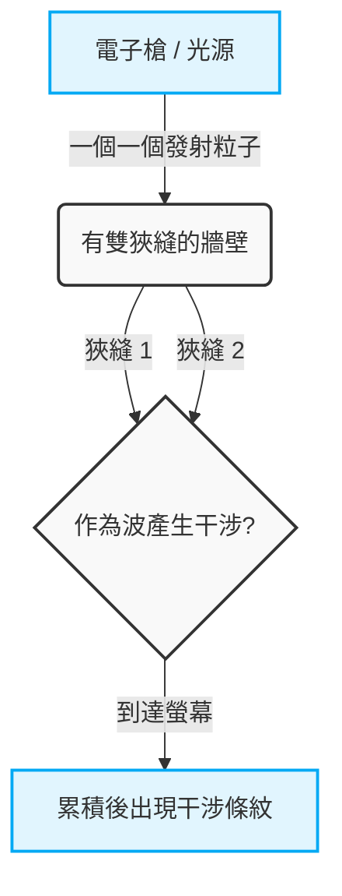
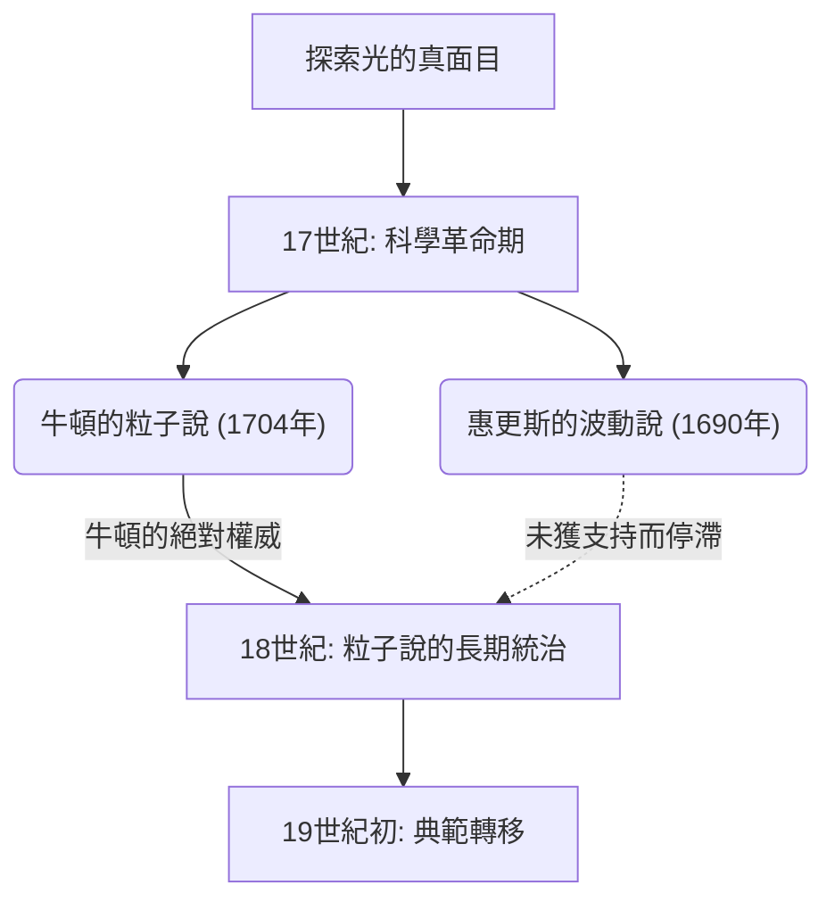
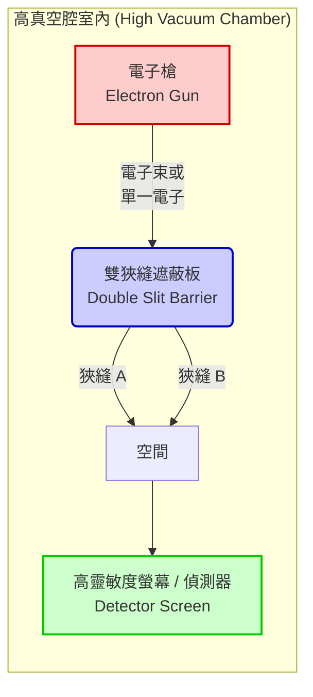

---
title: '【完全網羅】量子力學最大謎團「雙狹縫實驗」徹底白話解說'
slug: "double-slit-experiment-ultimate-guide"
date: "2026-09-08T01:00:00+09:00"
tags: ["物理學", "量子力學", "雙狹縫實驗", "薛丁格方程式"]
categories: ["物理・科學"]
math: true
mermaid: true
image: "cover.webp"
description: '為您徹底解說被稱為物理學史上最優美實驗的「雙狹縫實驗」。針對巨觀世界常識無法套用的微觀世界之異常性，以及量子力學深奧的謎團，為初學者進行了淺顯易懂的整理。'
---
## 1. 【前言】什麼是雙狹縫實驗？

我們所生活的這個世界，似乎被明確的規則所支配。往上拋的球會劃出拋物線落下，將石頭投入水面便會擴散出漣漪。這些是以牛頓力學為首的古典物理學所描述的「巨觀世界」的常識，且與我們的直覺完全一致。然而，一旦踏入構成物質的終極最小單位——原子、電子，或是光粒子（光子）等「微觀世界」，那些常識便會應聲瓦解。那是一個我們日常的感覺與直覺完全無法派上用場，由極其奇妙且令人費解的規則所支配的領域。

將這個微觀世界的異常性，以最簡單且最具衝擊性的方式呈現在我們面前的，就是「雙狹縫實驗（Double-slit experiment）」。代表20世紀的天才物理學家理查·費曼（Richard Feynman）在談到這個實驗時曾說：「這是量子力學中唯一的謎團」，並進一步評論道：「這個實驗包含了量子力學所有的奧秘。」此外，許多著名的物理學家都對這個實驗讚不絕口，稱之為「物理學史上最美麗的實驗」。那麼，為什麼只是一個在一塊板子上開了兩個縫隙（狹縫）的極其簡單的實驗，會被如此特別看待，並持續讓科學家們為之著迷呢？

### 違反直覺的巨觀與微觀世界

首先，讓我們想像一下在我們的直覺能準確發揮作用的巨觀世界中的現象。
例如，假設有一台機器，正對著牆壁不斷發射塗了油漆的小球（或是機關槍的子彈也可以）。在它前方放置了一塊開有兩個並排的直條細縫（狹縫）的鐵板。當隨機發射小球時，只有穿過其中一個狹縫的小球會撞擊到後方的牆壁上，並留下墨水標記。結果在牆上，應該會浮現出與前方兩個狹縫形狀相同的「兩條垂直線」標記。這是小球作為具有明確軌跡的「粒子」的行為，也是任何人都能直覺預測到的理所當然的結果。

接著，讓我們來思考「波」的情況。在水槽中放置一個帶有兩個狹縫的擋板，並從一側製造波浪。當波浪到達兩個狹縫時，會穿過它們，並以各自的狹縫作為新的波源，形成兩個半圓形的波向後方擴散。然後，當這兩個波相互碰撞時，就會發生稱為「干涉（interference）」的現象。波峰與波峰重疊的地方會變成更高的波，而波峰與波谷重疊的地方則會互相抵消變得平坦。結果，在後方的牆上（或岸邊），會交替出現波浪強烈拍打和完全無法拍打到的地方，形成被稱為「干涉條紋（interference pattern）」的美麗條紋圖案。這也是在水面或聲波等日常中可以觀察到的波的基本性質。

到目前為止，沒有任何不可思議的地方。投擲粒子會產生「兩條線」，發送波則會產生「干涉條紋」。這就是我們所居住世界的常識，也是古典物理學的前提。

### 實驗的概要與被稱為「最美麗的實驗」的理由

然而，如果使用像光或電子這樣的微觀存在進行完全相同結構的實驗，情況就會發生劇變，人類的直覺將會被徹底顛覆。
回顧歷史，在1801年，英國物理學家托馬斯·楊（Thomas Young）首次使用太陽光進行了這個雙狹縫實驗（楊氏實驗）。當時，牛頓提出的「光是粒子」的學說佔據主導地位，但楊的實驗結果顯示，螢幕上出現了美麗的「干涉條紋」。這提供了「光是波」的決定性證據，似乎為長久以來的爭論暫時畫下了句點。

真正的謎團，以及物理學上最大的典範轉移，正是從這裡開始的。進入20世紀後，隨著實驗技術的驚人進步，將光或電子「一個一個」地發射已經成為可能。電子具有質量，並佔據空間中特定的位置，毫無疑問是明確的「粒子」。從電子槍只發射一個電子，讓它穿過雙狹縫，以一個亮點的形式到達螢幕的某個位置。在這個階段，單從撞擊螢幕的痕跡來看，電子的行為毫無疑問就像一個粒子。
然後，將這種「一個一個發射電子」的過程重複幾千次、幾萬次，次數多到令人難以置信。因為電子總是一個一個地飛行，所以它們在空中與其他電子相撞並像波一樣產生干涉，在物理上是不可能的。理所當然地，大家都認為螢幕上應該會像投擲小球時一樣，浮現出與狹縫形狀相對應的「兩條線」。

然而，隨著無數的電子亮點在螢幕上逐漸累積，浮現出來的卻是令人難以置信的圖案。那是只有在波與波相互碰撞時才會出現的「干涉條紋」。

明明是一個個發射出來的「粒子」電子，為什麼整體卻表現得像「波」一樣，並與自己產生干涉而畫出條紋圖案呢？這到底是怎麼回事？就好像發射出的一個電子，像波一樣在空間中擴散，同時穿過了兩個狹縫，產生自我干涉，然後在撞擊螢幕的瞬間又再次以一個粒子的姿態現身。
更奇妙的是，當科學家們為了確認「電子到底穿過了哪一個狹縫」，而在狹縫旁邊安裝了觀測器（類似相機的裝置）的瞬間，電子竟然突然失去了作為波的性質，螢幕上出現的不再是干涉條紋，而是單純的「兩條線」。「被觀看」就會改變行為的這個現象，將物理學家們捲入了更深的混亂漩渦中。

雙狹縫實驗被稱為「物理學中最美麗的實驗」的最大原因，在於它不需要大型加速器或極度艱澀的數學公式，僅憑兩個縫隙和一個螢幕這樣極其簡單優雅的設置，就能突顯出宇宙最根本的謎團。它在視覺上清晰生動地展現了巨觀世界常識徹底崩潰的瞬間。這不僅僅是確認物理現象而已，它更持續向我們拋出極度深奧的哲學與認識論問題：「真實是什麼？」、「我們『看見』的這個世界，真的客觀存在嗎？」。在這個唯一且簡單的實驗中，凝聚了人類智力的極限，以及試圖超越極限的科學無限浪漫。
## 2. 【歷史】光是波還是粒子？無止境爭論的軌跡

自從人類認識到「光」的存在以來，對其真面目的探索就從未停止過。從古希臘時代開始，恩培多克勒（Empedocles）和歐幾里得（Euclid）等哲學家與數學家們，就一直對光與視覺的機制進行思考，但真正作為近代科學展開正式研究，則是從17世紀開始的。在這個時代揭開序幕的「光是粒子還是波」的爭論，在之後的300多年裡將物理學界一分為二，最終成為開啟量子力學這門全新物理學大門的原動力。在本節中，我們將詳細追溯這段壯麗科學史的軌跡。

### 2.1 牛頓的粒子說 vs 惠更斯的波動說：17世紀的激烈衝突

17世紀後半，在科學革命的鼎盛時期，關於光的真面目出現了兩種強有力的理論。那就是由艾薩克·牛頓（Isaac Newton）提出的「粒子說（微粒子說：Corpuscular theory）」，以及由克里斯蒂安·惠更斯（Christiaan Huygens）提出的「波動說（Wave theory）」。

#### 牛頓的粒子說
以萬有引力定律等聞名的近代物理學巨擘艾薩克·牛頓，認為光是極小顆粒（微粒子）的集合。牛頓在1672年的論文以及1704年的主要著作《光學（Opticks）》中，將光直線傳播的性質，以及在鏡面上反射的定律，利用粒子被牆壁彈開的力學模型進行了生動的解釋。此外，關於白光通過稜鏡後會分散成七種顏色的現象（分光），他也主張這是因為不同顏色的光是不同質量的粒子，在穿過介質時的折射率不同所致。
牛頓針對波動說提出反駁：「如果光是像聲音一樣的波，那就應該會繞到障礙物的背面（繞射現象），但光卻是直線前進並形成清晰的影子」，以此否定了光是波的說法。

#### 惠更斯的波動說
另一方面，荷蘭傑出的物理學家克里斯蒂安·惠更斯在1690年發表的《光論（Treatise on Light）》中主張，光是在充滿宇宙空間、被稱為「乙太（aether）」的彈性介質中傳播的波（縱波）。惠更斯提出了著名的「惠更斯原理（Huygens' Principle）」，即「波前上的所有點都是新的次級波的波源」，並完美地以幾何學解釋了光直線傳播、反射以及折射的定律。
特別是關於折射，牛頓預言：「當光進入水或玻璃等密度較大的介質時，粒子會受到引力而加速，因此光速會變快」，但惠更斯的波動說則得出「在密度較大的介質中，波的傳播速度會變慢」的結論，雙方形成了正面的對立。

然而，由於當時科學界中牛頓的絕對權威與影響力，惠更斯的波動說逐漸銷聲匿跡，在整個18世紀中，牛頓的粒子說持續作為主流學說稱霸學界。

## 2.2 湯瑪斯·楊的雙狹縫實驗（1801年）與波動說的勝利

進入19世紀後，發生了打破長期佔據主導地位的粒子說堡壘的決定性事件。這其中的核心人物是英國博學家湯瑪斯·楊（Thomas Young）。身為醫師且對解讀埃及聖書體（羅塞塔石碑）有所貢獻的楊，在1801年進行了在物理學史上熠熠生輝的實驗。那就是「楊氏干涉實驗（即後來的雙狹縫實驗）」。

#### 干涉條紋的發現
楊的實驗裝置極為簡單且巧妙。他讓太陽光穿過非常細小的針孔（或狹縫）以產生點光源，並讓該光線進一步通過兩個距離極近的細小狹縫（雙狹縫），投影在後方的螢幕上。
如果光如牛頓所言是純粹的「粒子」，螢幕上應該會出現與狹縫形狀相對應的兩條亮線。然而，楊在螢幕上看到的是明暗交替排列的條紋圖案，亦即「干涉條紋（Interference fringes）」。

這個現象，除非將光視為波，否則絕對無法解釋。當水面上的兩個波相遇時，波峰與波峰重疊的地方會變得更高（建設性干涉），而波峰與波谷重疊的地方則會相互抵消變平（破壞性干涉）。楊得出結論：從兩個狹縫射出的光波，正如同水波一樣產生了干涉。

#### 數學證明與波動說的確立
這種建設性與破壞性干涉的條件，取決於從兩個狹縫到螢幕上一點的路徑長度差異（光程差 $\Delta L$）。若狹縫間距為 $d$，指向螢幕的角度為 $\theta$，光波長為 $\lambda$，則光程差可表示如下：

$$ \Delta L = d \sin \theta $$

* **明線（建設性干涉條件）**: $\Delta L = m\lambda \quad (m = 0, \pm1, \pm2, \dots)$
* **暗線（破壞性干涉條件）**: $\Delta L = \left(m + \frac{1}{2}\right)\lambda$

楊的這項發表，最初在英國國內遭到了牛頓信徒們的猛烈批評與嘲笑。然而，隨後在1815年，法國的奧古斯丁·讓·菲涅耳（Augustin-Jean Fresnel）將光的繞射與干涉建構為嚴密的數學理論。接著在1818年法國科學院的競賽中，評審西莫恩·德尼·帕松（反對波動說）指出：「如果菲涅耳的理論是正確的，那麼在圓形障礙物陰影的中心應該會出現一個亮斑。這種荒謬的事情是不可能發生的。」可是，實際進行實驗的多明尼克·弗朗索瓦·讓·阿拉戈卻完美地觀測到了那個「帕松亮斑（阿拉戈亮斑）」，這使得波動說的正確性變得毋庸置疑。

1850年，萊昂·傅科等人透過實驗證明水中光速慢於空氣中，徹底否定了牛頓的預測。接著在1864年，詹姆斯·克拉克·馬克士威作為電磁學的集大成者，確立了「光是一種電磁波」的理論；至此，光的「波動說」獲得了完全的勝利，這場爭論似乎已畫下句點。

### 2.3 愛因斯坦的光量子假說（1905年）促成粒子說的復興

馬克士威關於光是電磁波的理論過於優美，使得19世紀末的物理學家們相信：「物理學已近乎完成，剩下的只是測量一些微小的數值而已。」然而，在19世紀末至20世紀初，出現了一個波動說無論如何都無法解釋的奇特現象。那就是「光電效應（Photoelectric effect）」。

#### 光電效應之謎
光電效應是指當光照射在金屬表面時，會有電子（光電子）從金屬中飛出的現象。按照當時波動說的常識，光（波）的能量應該與其振幅（亮度）成正比。因此，當時的人們認為：「只要照射夠強（夠亮）的光，無論什麼顏色的光，電子都應該會猛烈地飛出。」
然而，實驗結果卻完全背離了波動說的預測。

1. **極限頻率的存在**: 對於低於某個特定頻率（顏色）的光（例如紅光），無論照射得再強（再亮），或是照射再長的時間，電子都完全不會飛出。
2. **即時性**: 相反地，只要是高於極限頻率的光（例如紫外線），無論光線多麼微弱，在照射的瞬間都會立刻有電子飛出。
3. **能量的依賴性**: 飛出電子的動能不取決於光的強度（亮度），而僅取決於光的頻率（顏色）。

#### 愛因斯坦的戲劇性解決方案：光量子（光子）
解開這個令人絕望的謎團的，是在瑞士專利局工作的無名青年——阿爾伯特·愛因斯坦（Albert Einstein）。在被稱為「奇蹟之年」的1905年，他將馬克斯·普朗克在熱輻射研究（1900年）中提出的「能量量子假說」應用於光本身，發表了「光量子假說（Light quantum hypothesis）」。

愛因斯坦大膽地假設，一直被認為是連續波的光，其實是能量區塊的集合，亦即名為「光量子（光子：Photon）」的粒子集合。單一光量子所具有的能量 $E$ 與光的頻率 $\nu$ 成正比，並可由以下普朗克-愛因斯坦公式表示：

$$ E = h\nu $$
（此處 $h$ 為普朗克常數，$6.626 \times 10^{-34} \, \text{J}\cdot\text{s}$）

運用這個假說，光電效應的謎團彷彿像施了魔法般被解開了。
光電效應其實就像撞球一樣，是「一個光量子」撞擊金屬中的「一個電子」，並將其能量完整傳遞過去的現象。若將電子掙脫金屬束縛所需的最低能量稱為「功函數（$W$）」，那麼飛出電子的最大動能 $E_k$ 便可以用以下漂亮方程式來表示：

$$ E_k = h\nu - W $$

如果光量子的能量 $h\nu$ 小於功函數 $W$（低頻率的光），那麼無論碰撞多少光量子（光再怎麼強），電子也無法從金屬中飛出。這就是極限頻率存在的理由。

#### 邁向「既是波，也是粒子」這不可思議的世界
愛因斯坦的光量子假說在1914年被羅伯特·密立根的精密實驗完全證實，愛因斯坦也因這項成就榮獲1921年的諾貝爾物理學獎。（諷刺的是，密立根最初並不相信愛因斯坦的理論，本想透過實驗來反駁它，卻反而證明了其正確性）。此外，在1923年，阿瑟·康普頓發現了X射線撞擊電子時波長會發生改變的「康普頓散射」，這確立了光確實表現得像帶有動量 $p = \frac{h}{\lambda}$ 的「粒子」。

原本在楊氏實驗中被徹底擊敗的「粒子說」，歷經百年之後，竟以更精鍊的「量子」形式實現了奇蹟般的復興。
然而，這也產生了嚴重的矛盾。這意味著光同時具備了楊氏雙狹縫實驗中所展現出的明顯的波動「干涉」性質，以及光電效應中所展現出的「粒子」性質。

光到底是波，還是粒子？
物理學對這個問題的最終答案是：「光兩者皆是，也兩者皆非。光是兼具『波的性質』與『粒子性質』的量子實體。」這是一個強烈違背人類直覺的結論。這便是「波粒二象性（Wave-particle duality）」的誕生。
而這個二象性的概念不僅限於光，也開始應用於電子等物質本身（德布羅意物質波），物理學自此踏入了前所未有的深淵——名為「量子力學」這個奇特又迷人的世界。其最具象徵性的舞台，正是升級為現代版的「量子力學雙狹縫實驗」。

## 3. 【轉折】物質也是波？德布羅意波與電子的雙狹縫實驗

由於愛因斯坦提出光「既是波也是粒子」的光量子假說（1905年），物理學界陷入了巨大的混亂與典範轉移的漩渦之中。儘管長年來，受到楊氏干涉實驗與馬克士威電磁學的影響，人們堅信「光絕對是波」，但光電效應等現象卻又必須將光視為「粒子（光子）」才能解釋。起初，這種名為「波粒二象性」的奇特屬性，被認為只有光才具備的特異性質。然而，進入1920年代後，這個二象性的概念不再僅限於光的世界，而是開始將其影響力伸向構成我們身體的「物質」本身。

### 3.1. 路易·德布羅意提出物質波：來自美麗對稱性的飛躍

1924年，法國年輕的研究生路易·德布羅意（Louis de Broglie）在他的博士論文中，提出了一個從根本上顛覆物理學歷史、極其大膽的假說。那就是：「如果（一直被認為是波的）光具有粒子的性質，那麼反過來，（一直被認為是粒子的）電子等物質，是否也同樣具有波的性質呢？」

德布羅意這項假說的根基，來自於他「大自然總是偏好對稱性」的哲學直覺。他將愛因斯坦在狹義相對論與光量子假說中推導出的能量與動量關係式，應用到了具有質量的物質粒子上。光子的動量 $p$ 可以用普朗克常數 $h$ 與波長 $\lambda$ 表示為 $p = h / \lambda$。德布羅意將此公式反轉，把具有質量 $m$ 且以速度 $v$ 運動的粒子（動量 $p = mv$）所伴隨的波的波長 $\lambda$，用以下非常簡單的數學式表達出來：

$$ \lambda = \frac{h}{p} = \frac{h}{mv} $$

這就是著名的「德布羅意波長（物質波波長）」公式。這個數學式意味著，從我們日常所見的棒球或汽車，到微小的電子，所有運動中的物體都帶有「波」的性質。那麼，為什麼我們在日常生活中不會看到棒球像波一樣產生干涉或繞射呢？那是因為普朗克常數 $h$（約 $6.626 \times 10^{-34} \text{ J}\cdot\text{s}$）極為微小。對於巨觀物體來說，由於質量 $m$ 過大，德布羅意波長 $\lambda$ 會小到實質上可視為零，使得波動性被完全隱藏。然而，在質量極其微小的電子世界中，這個波長的尺度會變得與X射線（電磁波）的波長相當（例如約 $0.1 \text{ nm}$），成為絕對無法忽視的大小。

德布羅意的這篇論文由於過度顛覆常識，讓當時的評審們大感困惑。然而，當評審之一的保羅·朗之萬將這篇論文寄給愛因斯坦時，愛因斯坦卻對其讚譽有加，稱「他掀起了一角巨大的面紗」。這使得德布羅意的「物質波（matter wave）」概念受到了全世界的矚目，並直接促成了後來薛丁格完成波動力學。

### 3.2. 戴維森-革末實驗：物質波動性的證明

儘管德布羅意的假說在理論上非常優美，但它是否真能描述現實的大自然，仍有待實驗來證明。「如果電子真的是波，那麼它應該會產生波特有的現象——『繞射』與『干涉』。」基於這個信念，世界各地的物理學家開始進行實驗，試圖捕捉電子的波動性。

隨後在1927年，決定性的證據終於出現。那就是由美國貝爾實驗室的物理學家柯林頓·戴維森（Clinton Davisson）與萊斯特·革末（Lester Germer）所進行的「戴維森-革末實驗」。

他們起初是出於另一個目的進行實驗：將電子束照射在鎳晶體上，以研究其散射的狀況。然而，為了補救實驗中的意外（真空管破損導致鎳表面氧化），他們將鎳進行高溫加熱，卻幸運地意外讓鎳形成了單晶體。當他們再次將電子束照射在這塊單晶化的鎳上時，觀測到了驚人的現象。散射電子的強度在特定角度呈現了極大值，展示出明確的「繞射圖樣」。

晶體內原子規則排列的間距（晶格常數），與電子的德布羅意波長大約處於同一尺度。也就是說，鎳晶體本身對電子而言，發揮了「天然繞射光柵」的作用。戴維森與革末從這個繞射圖樣反推電子波長的結果，與德布羅意公式 $\lambda = h/p$ 預測的值完美吻合。同年，英國的喬治·佩吉特·湯姆森（電子發現者 J.J. 湯姆森的兒子）也成功觀測到了電子束穿透薄金屬箔所產生的繞射環（德拜-謝林環）。

這些實驗結果將「物質具備波的性質」作為毋庸置疑的事實，呈現在物理學界面前。本應是粒子的電子，竟然像波一樣表現。這是自然界深邃真理被揭露的瞬間，也是宣告量子力學黎明到來的號角。德布羅意在1929年、戴維森與湯姆森則在1937年，分別榮獲了諾貝爾物理學獎。

### 3.3. 日立製作所（外村彰等人）進行的決定性雙狹縫實驗（1989年）

在證明了電子是波之後，物理學家們的探索並未停止。他們試圖將一直被當作思想實驗來討論的「電子雙狹縫實驗」，在現實中以極限的精度實際執行。

如同光的雙狹縫實驗（楊氏實驗）一樣，如果將電子朝著雙狹縫發射，後方的螢幕上應該會出現干涉條紋。然而，量子力學中最令人費解的悖論在此浮現了：「如果我們不是一次發射大量電子，而是 **一次發射一個** 呢？」

一個電子是不可分割的粒子。因此，它理應只能穿過左邊的狹縫，或是右邊的狹縫。一個一個到達螢幕的電子，只會在螢幕上留下一個個亮點。當這個過程重複幾萬次時，這些點的集合，究竟會變成單純的兩個狹縫陰影（兩條線），還是展現出波性質的干涉條紋呢？

對於這個終極的問題，突破技術極限並給出世界上最美麗且完美解答的，是日本日立製作所基礎研究所的研究團隊（外村彰博士等人）。在1989年，他們運用電子束全像術，以及超高真空與極低溫的電子顯微鏡技術，出色地成功完成了「單電子雙稜鏡干涉實驗」。

實驗裝置令人驚嘆。他們將電子槍發射的電子數量減少到極限，使得在電子飛越空間的期間，始終保持「裝置內只有一個電子存在」的狀態。電子的速度高達每秒約15萬公里，飛過從光源到偵測器距離所需的時間僅在一瞬之間。直到前一個電子到達螢幕很久之後，才會發射下一個電子。

實驗開始後，偵測器（顯示器）上開始零星地出現表示電子到達的亮點。在最初的幾個、幾百個階段，畫面上看起來只像是點被隨機散布著。就如同夜空中的星星一般，那裡似乎沒有任何秩序可言。

然而，隨著電子累積到數千個、數萬個，一個令所有人都能清楚看見的驚愕景象浮現了。原本看似無序的點的集合，逐漸形成了規則的明暗條紋——這毫無疑問正是「干涉條紋」。

這個結果所代表的意義，強烈違背了直覺。電子確實是作為「一個粒子」到達螢幕（所以才會記錄下一個點）。然而，整體而言會產生干涉條紋，這就只能解釋為：那一個單一電子「以波的型態同時穿過了兩邊的狹縫（雙稜鏡的兩側），並且自己與自己產生了干涉」。沒有與任何事物產生交互作用的單獨電子，竟然與自己發生干涉。狄拉克曾說過「光子只會與自己干涉」，這個相同的原理，在具備質量的物質粒子——電子身上，也得到了完美的證實。

外村彰博士等人的這項實驗，作為最視覺化且最直接證明量子力學不可思議之處——即「波粒二象性」——的實驗，在全世界受到了極高的讚譽。英國科學雜誌《Physics World》在2002年舉辦的「物理學史上最美麗的實驗」讀者投票中，這項「電子的雙狹縫實驗」能夠光榮地獲選為第一名，可說是實至名歸。

就這樣，德布羅意那突發奇想的「物質是波」假說，歷經60年以上的歲月，終於化作單一電子所描繪出的神秘干涉條紋，在我們眼前展現了其真實的面貌。不過，這項實驗在解開量子力學謎團的同時，也開啟了通往更深層謎團——即「測量問題（觀測問題）」的大門。「一旦試圖去觀看它穿過哪個狹縫，干涉條紋就會消失」——在下一章中，我們將繼續踏入這個奇異量子世界的更深淵。
## 4. 【實驗方法與結果】具體發生了什麼事

（為了逼近雙狹縫實驗的核心並窺探量子力學的深淵，這裡我們不使用光，而是聚焦於使用「電子」的實驗來進行解說。雖然光子或其他基本粒子，甚至像富勒烯這樣較大的分子也被確認有同樣的現象，但是使用具有質量、且被我們認知為「明顯是物質粒子」的電子，能讓這個現象的悖論與不可思議之處更加凸顯。）

### 4.1 實驗裝置的設置：捕捉極微世界的舞台準備

首先，讓我們詳細看看這項歷史性且具革命性的實驗是在什麼樣的裝置中進行的，也就是它的舞台準備（設置）。雙狹縫實驗的物理概念結構驚人地簡單，但要讓它在實際的物理實驗中取得成功，背後需要高度的技術以及極其嚴格的環境控制。

實驗裝置大致可以分為以下 3 個主要組件。為了防止電子因與空氣分子碰撞而發生散射，這些組件全都被嚴密地密封並放置在一個高度真空的腔室（真空容器）內。

1. **電子槍（Electron Gun）**:
   這是用來發射實驗主角「電子」的裝置。它利用加熱燈絲釋放熱電子，或是使用強電場將電子拉出的原理，將具有一定動能的電子朝固定方向發射。在這項實驗中極其重要的一點是，它既能像瀑布一樣連續發射強大的電子「束」，令人驚訝的是，它也能將輸出功率縮減至極限，達到「確實地一次一顆」的精準控制發射。這種「單電子發射技術」是現代量子力學實驗中不可或缺的精密技術之一。

2. **雙狹縫（Double Slit）**:
   這是一塊遮蔽板（牆壁），上面開有兩條非常細且距離極近的平行狹縫（縫隙），用來讓電子槍發射出的電子穿過。由於電子的「物質波（德布羅意波）」波長非常短，因此這些狹縫的寬度以及狹縫之間的距離，也必須精確地製作成奈米（十億分之一公尺）到微米等級的微小尺寸。如果狹縫的寬度或間距相對於電子的波長來說太寬，就無法清晰地觀測到作為波動性質的「干涉」。製作這種極小雙狹縫的技術本身，可以說是結合了最先進電子束微影設備等微細加工技術的結晶。

3. **螢幕（偵測器，Screen / Detector）**:
   這是用來記錄順利穿過雙狹縫的電子最終到達位置的觀測螢幕。在過去的實驗中，人們會使用感光相片底片等材料，而現在則使用高靈敏度的 CCD 相機、螢光板或特殊的半導體像素偵測器等。這樣一來，就能將電子「到達了哪裡（擊中哪裡）」極其準確地記錄為每一發的二維座標。當電子撞擊螢幕時，會在那裡發出微弱的光或是產生電子訊號，從而留下「毫無疑問地作為一個粒子到達了這裡」的明確痕跡（點）。

下圖是這個實驗裝置的整體配置與電子軌跡的模式圖。

### 4.2 照射大量電子時：違背直覺的波動行為（干涉條紋的形成）

現在，我們終於要開始進行實驗了。作為第一步，我們先提高電子槍的輸出功率，將「大量的電子」宛如陣雨或機關槍般，連續且齊發地朝雙狹縫發射。

如果用我們日常所擁有的古典物理學常識來思考，電子是具有質量的「粒子（像小顆子彈一樣的東西）」。因此，多數穿過兩條狹縫的電子，應該會集中撞擊在螢幕上兩條狹縫直線延長線的兩個區域，並預期結果會形成「兩條直條紋」般的圖案。想像一下，將噴漆噴向開有兩條縫隙的模板。穿過縫隙的油漆，應該會按照縫隙的形狀在牆上畫出兩條線。

然而，實際在螢幕上出現的圖案，卻完全違背了我們的直覺與預測。螢幕上形成的不是兩條簡單的直條紋，而是清晰地呈現出 **好幾條明暗相間的條紋（干涉條紋：Interference Pattern）** 。

這種「干涉條紋」，與同時向池塘水面投入兩顆石頭時所產生的波紋重疊圖案，或是光干涉實驗中所見到的圖案，具有完全相同的幾何特徵。
- **波峰與波峰，或是波谷與波谷重疊的地方（建設性干涉）** ，會形成電子大量到達的「明亮（電子撞擊密度高）」條紋。
- **波峰與波谷重疊的地方（破壞性干涉）** ，波會互相抵消，形成電子幾乎完全無法到達的「暗淡（電子撞擊密度接近零）」條紋。

這個結果所意味的結論只有一個。那就是， **「電子表現出了波的行為」** 。從電子槍發射出來的電子群，像水波一樣在空間中傳遞，並且「同時」穿過了兩條狹縫。然後，從狹縫 A 繞射擴散開來的波，與從狹縫 B 繞射擴散開來的波，在螢幕前方的空間中互相重疊並產生干涉，我們只能將其解釋為這正是造就那種特徵性明暗條紋的原因。

被堅信是「粒子」的電子，實際上也同時具有「波」的性質（波粒二象性）。單憑這個事實就已經是物理學上歷史性的大發現，足以令人驚訝，但量子力學真正的謎團，以及從根本上顛覆我們常識的現象，將從這裡進一步加深。

### 4.3 「一次一顆」發射電子時：極限實驗揭露的「機率波」真面目

「會不會是因為同時發射大量電子，導致電子之間在空中發生碰撞，或是因為電力（庫侖力）互相排斥，結果才製造出像波一樣的圖案呢？」
作為一名科學家，產生這樣的想法是非常自然的疑問。事實上，在剛發現干涉條紋時，許多物理學家也是這麼想的，並試圖用古典物理學來解釋這個現象。

為了徹底解決這個疑問，實驗技術得到了進步，並且進行了更具決定性的實驗。（在日本，1989 年由日立製作所的外村彰等人所組成的團隊進行的實驗非常有名，被譽為世界上最美麗的實驗之一）。
那就是 **將電子槍的輸出功率縮減至極限，並「確實地一次一顆」發射電子** 的實驗。

具體來說，是確認前一顆電子發射、到達螢幕並完全消失（或被吸收）之後，才發射下一顆新的電子。將這個過程重複幾萬次、幾十萬次等令人難以置信的次數。在這種設定下，可以保證實驗裝置內的空間中「始終只有一顆電子存在」。因此，電子之間在空中碰撞或互相干涉在物理上是 100% 不可能的。

讓我們隨著時間的推移（電子的累積數量），來追蹤這個在極限狀態下由單一電子所產生的實驗結果。

**步驟 1：實驗剛開始時（幾十到幾百顆電子）**
螢幕上開始出現一點、一點散落在完全隨機位置上的點。電子在到達螢幕的瞬間，明顯展現出作為「一個粒子」的性質，並在特定的微小座標上記錄下一個點（dot）。在這個階段，螢幕上的圖案看不出任何規律性，看起來只是一堆無序且隨機的點。就像是蒙上眼睛隨意投擲飛鏢一樣。

**步驟 2：幾千到幾萬顆電子到達之後**
隨著時間流逝、實驗不斷重複，當螢幕上累積了幾千到幾萬個點時，奇妙的現象開始發生。在原本以為完全隨機的點分布中，漸漸開始出現了「偏移」和「濃淡」。點密集出現的區域，與幾乎沒有點出現的區域，開始隱約地分開。

**步驟 3：實驗結束時（幾十萬顆以上的電子到達）**
花費足夠長的時間，以令人感到漫長且繁瑣的操作，將龐大數量（幾十萬到幾百萬顆）的電子一顆接著一顆發射後，觀察整個螢幕的累積圖像……在那裡，清晰地浮現出了與一次性發射大量電子時完全相同的、令人驚嘆的 **「干涉條紋」** ！

這是物理學史上最令人毛骨悚然、違反直覺，卻也是最美麗且深奧的結果之一。

這是因為，電子是「完全一次一顆」被發射出來的。它絕對不可能與前後發射的電子發生交互作用。儘管如此，最終卻還是形成了顯示出波的干涉的條紋圖案，我們只能接受 **「一顆電子，與它自己產生了干涉」** 這個令人難以置信的結論。

當我們試圖用邏輯來解釋這個現象時，我們對日常空間與物質的感覺將會徹底崩潰。
一顆電子在從電子槍發射後，宛如「波」一樣擴散到整個空間，並 **「同時」穿過了右邊的狹縫與左邊的狹縫** ，在螢幕前與「自己的波」互相干涉，接著在到達螢幕並被觀測到的瞬間，再次收縮（決定）為「一個粒子」落在某一個點上。

那麼，這顆在空間中傳遞的電子，「波」的真面目到底是什麼呢？
在量子力學中，這並不像水面或空氣那樣，是由物理介質波動所產生的實體波。根據馬克斯·玻恩所提出的解釋，這其實是 **「代表電子存在於該空間特定位置之『機率』的波（機率波）」** 。在數學上，這被稱為「波函數」。

電子並不像柏青哥鋼珠那樣，沿著特定軌道（路線）呈一直線飛行。從發射後到到達螢幕為止的這段期間，電子是以「穿過右邊狹縫的狀態」與「穿過左邊狹縫的狀態」，甚至「穿過空間中所有路徑的狀態」，以各種不同的機率作為「互相重疊的狀態（疊加態）」在空間中擴散。

然後，在撞擊螢幕這個觀測器、並測量出「到達了哪裡」的瞬間，擴散在空間中的機率波會在一瞬間收縮為一點（波函數塌縮），這才首次確定了「它曾在這裡」的現實粒子位置。

干涉條紋中的「明亮部分（最終聚集了大量點的部分）」，是因為波的干涉而提高了電子存在機率的位置；而「暗淡部分（點無法聚集的部分）」，則意味著機率波互相抵消而歸零的位置。就像擲骰子許多次後，每個點數出現的機率會逐漸接近理論值（1/6）一樣，每一顆電子的「機率性行為」在重複幾十萬次之後，機率波的形狀（干涉條紋）就會作為現實的圖案浮現出來。

「一顆電子同時穿過了兩條狹縫」、「在被觀測之前狀態無法確定，僅作為無數可能性重疊的機率波而存在」。
這個雙狹縫實驗所帶來的冷酷實驗事實，向我們拋出了一個超越物理學範疇的深奧哲學問題：「所謂的存在，究竟是什麼意思？」以及「我們所認知的現實，到底又是什麼？」

## 5. 【觀測問題】被看著就會改變行為的量子

量子力學中的雙狹縫實驗，不僅對物理學，甚至對哲學與思想領域都產生了巨大的影響，而它被稱為科學史上最美麗同時也是最令人毛骨悚然的實驗，其核心原因就在這裡。那就是，「觀測（測量）」這個行為本身，會決定性地改變物理現象結果的驚人事實。

在我們生活的日常（巨觀）世界，也就是由古典物理學所支配的世界中，「看」只不過是一種純粹被動的行為。無論我們有沒有看著夜空中的月亮，月亮都確實存在於那裡，並遵循著牛頓力學沿著特定的軌道運動。並不會因為我們看著它，月亮的軌道就會改變。觀察者的存在，對被觀察對象的客觀現實不會造成任何影響，這是我們所擁有的一種根深蒂固的常識。

然而，在量子的微觀世界中，這個常識被徹底顛覆了。「看（觀測）」不僅僅是接收資訊，而是一個會對對象產生不可逆且決定性影響的主動過程。在觀測者向自然拋出問題的瞬間，自然就會改變它的行為。在這個章節中，我們將極其詳細地深入探討雙狹縫實驗中最大的謎團，這也是在現代物理學中仍持續被爭論的「觀測問題（Measurement Problem）」。

### 「觀測」它穿過了哪條狹縫時會發生什麼事

想像一下將電子、光子，甚至像富勒烯（C60）這樣的大分子等量子，一次一顆地發射出去，讓它們穿過兩條狹縫並到達螢幕的過程。在之前的說明中我們確認過，即使每次間隔發射一顆量子，經過長時間持續觀察螢幕上累積的光點，也能看到形成了美麗的干涉條紋（顯示出其作為波的性質證據）。這被解釋為一顆量子以「穿過右邊狹縫的可能性」與「穿過左邊狹縫的可能性」這兩種狀態的疊加態（Superposition）在空間中傳遞，並且與自己的機率波互相干涉的結果。

然而，物理學家們在這裡產生了一個自然，但在量子世界中卻猶如惡魔般的疑問：「量子真的『同時穿過了兩條狹縫』嗎？還是『其實它只穿過了其中一條狹縫，只是我們不知道而已』？不如在狹縫旁邊放個相機來確認一下吧」。

為了解答這個疑問，我們在實驗裝置上做了一個改變。在狹縫的旁邊，設置一個極高靈敏度的「偵測器（觀測裝置）」。這個偵測器是用來「觀測」並記錄電子到底是穿過了右邊的狹縫，還是左邊的狹縫。除了增加了偵測器之外，實驗的設置完全相同。一次發射一顆電子。偵測器確實地運作，並準確地告訴我們電子的路徑資訊（Which-path information），顯示「穿過了右邊」或「穿過了左邊」。正如預期的那樣，確認有一半的電子穿過了右邊，另一半則穿過了左邊。這樣一來，我們的直覺就得到滿足了：「什麼嘛，電子果然只是作為粒子穿過了其中一個洞而已啊。疊加態什麼的根本是幻覺」。

然而，當物理學家們確認最終到達螢幕的電子分布圖案時，卻驚訝得說不出話來。在那裡所描繪出的，不再是顯示出波性質的美麗干涉條紋，而只是單純的「兩條線（或者是兩座山）」。這跟將棒球或小石頭等古典粒子丟向狹縫時所產生的圖案完全一樣。形成干涉條紋不可或缺的「波的干涉」，竟然徹底消失了。

在我們試圖觀測「它穿過了哪邊」的瞬間，電子就拋棄了作為波的性質（疊加態），轉而表現得像一顆純粹的古典粒子。如果關閉觀測器的電源，干涉條紋就會再次出現；打開電源，干涉條紋就會消失得無影無蹤。更令人驚訝的是，後來的實驗（量子擦除實驗）甚至顯示出，在「記錄了觀測數據，但沒有任何人去看這些數據並將其刪除的情況下」，干涉條紋會重新復活。量子就好像「知道」我們在看著它，或是路徑資訊被保留在宇宙某處一樣地改變行為。這被稱為「透過獲取路徑資訊破壞干涉」，成為了顯示量子世界與我們的直覺相差有多遠的決定性證據。

### 哥本哈根詮釋（波包塌縮）

我們究竟該如何解釋這個極度不可思議的現象呢？在 1920 年代，由尼爾斯·波耳、維爾納·海森堡、馬克斯·玻恩等人為核心所建立的量子力學中最標準、最正統的解釋，就是「哥本哈根詮釋」。

在哥本哈根詮釋中，認為在被觀測之前的量子，僅作為擴散在空間中的「機率波（波函數）」而存在。波函數（通常標記為 $\Psi$）本身並不是物理實體，而是一個代表在某個位置發現量子之「機率幅」的數學工具。這個機率波會遵循薛丁格方程式，進行決定性且平滑的時間演化（變化）。在雙狹縫實驗中，電子的機率波同時穿過了右邊與左邊的狹縫，並在螢幕前方互相干涉。到此為止，都是由波的性質所支配的世界，是一個決定性的過程。

然而，在進行「觀測」這個物理過程的瞬間，這個波函數會發生劇烈且不連續的變化。這被稱為「波包塌縮（波函數塌縮：Wavefunction Collapse）」。在觀測器檢測到「電子穿過了右邊狹縫」的那一瞬間，擴散在整個空間中像是「可能會穿過左邊」、「可能會穿過中間」等所有可能性的波，會以超越光速的速度瞬間消失，並塌縮成「穿過了右邊狹縫的粒子」這唯一的一個現實（點）。

哥本哈根詮釋中最激進且最重要的主張在於，「在觀測之前，量子在哪裡、處於什麼狀態都是『尚未決定』的」。並不是因為我們不知道而它其實存在於某處（這被稱為「隱變數理論」），而是字面意義上的「存在機率擴散在空間中的狀態本身就是現實」，並主張是透過觀測這種與巨觀系統的交互作用，從無數的可能性中隨機「選擇」並「決定」了一個現實。

阿爾伯特·愛因斯坦終其一生都強烈反對這種模糊且具機率性的想法。「上帝不擲骰子（God does not play dice with the universe）」這句名言，正是對這種機率性解釋的批評。此外，他也諷刺道「難道說當我不看月亮時，月亮就不存在了嗎」，並持續主張量子力學是一個未完成的理論（例如 EPR 悖論）。然而，隨後透過貝爾不等式的驗證實驗（如阿斯佩實驗等），否定了愛因斯坦所期望的定域性隱變數理論，時至今日，無數精密的實驗結果仍持續支持著這個令人毛骨悚然的哥本哈根詮釋（或是與之相關的多世界詮釋等非定域、機率性模型）的正確性。

### 與海森堡不確定性原理的關係

為什麼觀測這個行為會必然改變量子的狀態，並破壞干涉條紋呢？能從更根本的物理學原理清晰地解釋這個謎團的，就是維爾納·海森堡在 1927 年所提出的「不確定性原理（Uncertainty Principle）」。

不確定性原理是宇宙的一項基本法則，它指出在微觀世界中，想要同時以無限的精確度準確測量某個粒子的共軛物理量（成對的性質），例如「位置（在哪裡）」與「動量（具有多少質量，正以多快的速度朝哪個方向飛行）」這兩者，在原理上是不可能的。

將其以數學方式表達出來的，就是以下這個著名的不等式：

$$ \Delta x \cdot \Delta p \ge \frac{\hbar}{2} $$

在這裡，各個符號代表以下意義：
- $\Delta x$ ： 「位置的不確定性（位置測量時的標準差，誤差的範圍）」
- $\Delta p$ ： 「動量的不確定性（動量測量時的標準差）」
- $\hbar$ ： 「狄拉克常數（h-bar，約化普朗克常數）」。是將普朗克常數 $h$ 除以 $2\pi$ 的結果，大約是 $1.054 \times 10^{-34} \mathrm{J\cdot s}$ ，這是一個極小的數值。

這個數學公式代表的意思是，「位置的不確定性」與「動量的不確定性」兩者的乘積，必須永遠大於等於一個固定的極小值（$\hbar / 2$）。也就是說，如果越是試圖極其準確地確定粒子的位置（讓 $\Delta x$ 逼近極限的零），動量的不確定性（$\Delta p$）就會成反比地發散向無限大，使得粒子下一瞬間究竟會飛往哪裡變得完全無法預測。反之亦然，如果想要精密地測量動量，那麼該粒子在哪裡就會在整個空間中變得模糊不清。

重要的是，這並不是因為「人類製造的測量儀器性能不好所產生的誤差」，而是量子本身所包含的「自然界根本的漲落性質」。量子本身就不被允許同時擁有一組確定的位置與動量數值。

讓我們透過不確定性原理的視角，來解開雙狹縫實驗中的「觀測問題」。
當我們使用偵測器來試圖得知「電子是穿過右邊還是左邊的狹縫」時，換句話說，就是在「高精度地測量並確定狹縫面上電子垂直方向的位置（$x$）」（讓 $\Delta x$ 足夠小於狹縫的間距）。

為了觀察電子的位置，必須與電子產生某種交互作用。例如，考慮用光（光子）照射電子，並用顯微鏡觀察其散射光（海森堡的顯微鏡思想實驗）。為了分辨電子穿過了哪一條狹縫，必須照射波長比狹縫間距更短，也就是能量非常高的光。

然而，如果讓高能量的光子與電子發生碰撞，就會像撞擊撞球一樣，光子會給予電子巨大的衝擊（動量改變）。這會導致電子垂直方向的動量（$p$）被隨機且劇烈地打亂（根據不確定性原理，作為縮小 $\Delta x$ 的代價，$\Delta p$ 會隨之增加）。

在剛穿過狹縫後，電子的動量被隨機打亂，這意味著電子隨後會到達螢幕的哪個位置將完全散亂。原本應該作為疊加的波保持相位在空間中前進，並在特定位置累積機率的精細干涉圖案，會因為這種擾動而被徹底破壞（相位的隨機化＝去相干）。結果，波的干涉消失了，只剩下單純穿過兩條狹縫的粒子因為散射而產生的兩條古典線條。

就這樣，不確定性原理透過冷酷的數學公式，證明了「在不對對象產生任何影響（保持干涉）的情況下提取路徑資訊的觀測，是不可能的」這項殘酷的事實。觀測這個行為，是當我們確定地從對象身上提取出一項資訊（位置）的同時，也打亂了對象所擁有的另一項重要資訊（動量或波動性的相位），並將其永遠奪走，送入宇宙中不可知彼端的一種暴力行為。可以說，雙狹縫實驗就是一場量子力學的終極示範，以任何人都能清楚看見的方式，描繪了不確定性原理與波包塌縮是如何支配著微觀世界的。
## 6. 【最先端】量子力學的基礎與現代詮釋

雙狹縫實驗所提示的「在觀測之前是波，觀測的瞬間就變成粒子」這個奇異的事實，讓物理學家們對宇宙的根本性質提出了深刻的疑問。在本章中，我們將深入探討量子力學中最深奧的主題：如何用數學來描述這種不可思議的現象，以及我們該如何詮釋它。在這裡，將有顛覆我們常識的最前沿理論與實驗等著我們。微觀世界裡的物理定律，是以與我們日常經歷的巨觀世界完全不同的原理在運作的。

### 薛丁格方程式與機率幅

在數學上主宰量子力學世界的，是奧地利物理學家埃爾溫·薛丁格（Erwin Schrödinger）於1926年推導出的「薛丁格方程式」。就像牛頓力學中的運動方程式（$F = ma$）決定論性地描述了巨觀物體的運動一樣，薛丁格方程式嚴格地描述了微觀粒子的狀態如何隨時間演進（時間演化）。

最基本、針對在一維空間中運動的單一質量為 $m$ 的粒子，其含時薛丁格方程式表示如下：

$$ i\hbar \frac{\partial}{\partial t} \Psi(x, t) = \left[ -\frac{\hbar^2}{2m} \frac{\partial^2}{\partial x^2} + V(x, t) \right] \Psi(x, t) $$

這個看似複雜的偏微分方程式的每個部分，都蘊含著象徵量子力學特徵的重要物理意義。

*   **$i$**：虛數單位（$i^2 = -1$）。薛丁格方程式最大的特徵之一，就是在基礎方程式中包含了虛數。在量子力學中，複數不單純只是數學上的權宜之計，而是扮演了描述自然本質的角色。
*   **$\hbar$（狄拉克常數）**：普朗克常數 $h$ 除以 $2\pi$ 的值（約 $1.054 \times 10^{-34} \mathrm{J \cdot s}$）。它是決定量子力學尺度、劃定微觀與巨觀邊界的根本自然常數。
*   **$\frac{\partial}{\partial t}$**：對時間 $t$ 的偏微分。它表示系統狀態如何隨時間變化的「時間演化算符」的一部分。
*   ** $\Psi(x, t)$ **（波函數）：表示在位置 $x$ 和時間 $t$ 下系統狀態的複數值函數。這是最重要的元素，包含了關於粒子狀態的所有資訊（位置、動量、能量等）。
*   **$m$**：粒子的質量。
*   **$-\frac{\hbar^2}{2m} \frac{\partial^2}{\partial x^2}$**：動能算符。包含對位置的二階微分，對應於粒子的動能。
*   **$V(x, t)$**：位能（勢能）。表示粒子所處的環境（電磁場或重力場等力場）。
*   **右邊整體（哈密頓算符 $\hat{H}$）**：表示系統總能量（動能＋位能）的算符。也就是說，整個方程式展示了「總能量決定波函數的時間變化」這樣的關係。

透過給定初始條件與邊界條件來求解薛丁格方程式，我們就能求出波函數 $\Psi(x, t)$。然而，這個 $\Psi$ 本身是個複數，並不是可以直接觀測到的物理量。德國物理學家馬克斯·玻恩（Max Born）對於這個波函數的物理意義提出了劃時代的詮釋。那就是「機率詮釋（玻恩定則）」。

根據玻恩定則，波函數絕對值的平方，即 $|\Psi(x, t)|^2$，表示在時間 $t$ 於位置 $x$ 找到粒子的「機率密度」。波函數本身被稱為「機率幅」，它自身並不是機率，而是取其平方後才首次成為現實的機率。

雙狹縫實驗中的干涉條紋，正是這個機率幅依照重疊原理相互干涉的結果，而產生機率密度深淺（波的強弱）模式而被理解。波越高（機率密度越大）的地方，在螢幕上觀測到粒子的機率就越高。也就是說，電子並不是描繪著確定的軌道飛行，而是作為「蔓延在整個空間的存在機率之波」來行事，至於它究竟會到達螢幕的哪裡，直到到達的那一瞬間為止，都只能以機率來決定。愛因斯坦反駁「上帝不擲骰子」，正是出自對這種根本性機率性的抗拒。

### 多世界詮釋與導引波理論

哥本哈根詮釋（以尼爾斯·波耳為中心的這派正統詮釋認為，波函數會因觀測而瞬間塌縮，並隨機選出一個結果）能夠完美預測迄今為止所有的實驗結果。然而，它卻包含了被稱為「觀測問題」的深刻哲學難題，例如「為什麼觀測這個行為會改變物理定律？」、「到底什麼是觀測者？」、「巨觀觀測儀器與微觀系統的邊界在哪裡？」。為了迴避這個問題，並試圖從其他角度毫無矛盾地理解量子力學的奇異世界，存在著各種不同的詮釋。其中的代表例就是「多世界詮釋」與「導引波理論」。

#### 多世界詮釋（艾弗雷特詮釋）

由休·艾弗雷特三世（Hugh Everett III）於1957年提出的「多世界詮釋（Many-Worlds Interpretation）」，雖然在科幻世界中是個耳熟能詳的概念，但在物理學中卻是一個極為嚴肅的理論。艾弗雷特完全否定了哥本哈根詮釋中最不自然的部分，即「因觀測導致的波函數塌縮」這個過程，他認為薛丁格方程式對於整個宇宙來說，始終是毫無例外地成立的。

根據多世界詮釋，當我們觀測一個處於量子力學重疊狀態的系統（例如，通過右狹縫狀態與通過左狹縫狀態的重疊）時，波函數並不會塌縮成其中之一，而是宇宙本身會發生分岔（透過稱為量子去相干的物理過程，分離成獨立的狀態）。

也就是說，在雙狹縫實驗中，每發射一個電子，「電子通過右狹縫的宇宙」和「電子通過左狹縫的宇宙」就會無數次地分岔並平行存在著。因為我們觀測者也是宇宙的一部分，所以在觀測的同時，我們自己也分岔了，在各自的宇宙中，「在右邊觀測到的我」和「在左邊觀測到的我」各自認知到了不同的結果。每一個「我」，都會覺得自己處在唯一的宇宙中。這種詮釋雖然排除了波塌縮這種神秘機制並保持了數學上的優美，但另一方面，卻要求我們接受無數平行宇宙（多重宇宙）的實體存在，這是一種極大違反我們直覺的典範轉移。

#### 導引波理論（德布羅意-玻姆理論）

由路易·德布羅意（Louis de Broglie）發想，並在1952年由大衛·玻姆（David Bohm）發展出來的「導引波理論（Pilot-Wave Theory）」或稱「玻姆力學」，採取了與多世界詮釋完全不同的途徑。

這個理論是「隱變量理論」的代表，該理論認為粒子始終擁有明確的位置和軌道（也就是說，即使我們沒有觀測它，它也是真實存在的）。然而，它與一般古典力學不同之處在於，它認為存在著一種蔓延在整個空間、看不見的波，稱為「導引波（量子位能場）」，這股波決定論性地引導（導引）著粒子的運動。

套用到雙狹縫實驗中，被發射的電子本身始終確定地只通過其中一條狹縫。然而，引導電子的導引波卻像水波一樣穿過兩條狹縫，並產生干涉。電子乘著這干涉後的導引波流動而被運送，導致最終到達螢幕的位置產生偏向，結果便形成了干涉條紋。它究竟會遵循哪條軌道，完全取決於發射時的初始位置（隱變量）。

導引波理論的巨大魅力在於，它既不需要波函數詭異的塌縮，也不需要無限增殖的平行宇宙，就能維持一個決定論的世界觀。但是，在理論結構上，它包含了導引波會超光速瞬間對整個空間產生影響的「非定域性（Non-locality）」，這就產生了一個新問題：它很難與愛因斯坦的狹義相對論進行優美的統一。

### 延遲選擇量子擦除實驗（時間會倒流嗎？）

在圍繞量子力學詮釋的討論中，存在著一個最不可思議，且從根本上動搖了我們對「時間」和「因果律」概念的思想實驗與實際實驗。那就是約翰·惠勒（John Wheeler）在1978年提出的「延遲選擇實驗」，以及1999年由金滿錫（Yoon-Ho Kim）等人實際驗證的「延遲選擇量子擦除實驗（Delayed-Choice Quantum Eraser Experiment）」。

在一般的雙狹縫實驗中，如果我們觀測電子或光子「究竟通過了哪條狹縫」這種路徑資訊（Which-way information），它就會失去作為波的性質，干涉條紋會消失而變成兩條線。那麼，如果在粒子通過狹縫**之後**，但在到達螢幕**之前**的時間點，我們才決定是否要觀測路徑資訊，結果會如何呢？這就是惠勒延遲選擇實驗的基本構想。

令人驚訝的是，即使選擇在粒子通過狹縫後觀測路徑資訊，干涉條紋也不會出現。反之，如果選擇不觀測，干涉條紋就會出現。這看起來簡直就像是，未來對於觀測的選擇，溯及既往地決定了粒子在過去的行為（在通過狹縫時是表現為波，還是表現為粒子）。

在進一步發展的「延遲選擇量子擦除實驗」中，利用量子糾纏（量子纏結）創造出了更奇異的情況。透過特殊的晶體，產生一對處於量子糾纏狀態的光子A和光子B。光子A立刻飛向附近的螢幕（探測器），而光子B則通過較長的路徑飛向遠處複雜的光學系統（由半透鏡和探測器的網路組成）。

1.  如果在設定上，我們可以藉由調查光子B進入哪個探測器來間接得知光子A的路徑資訊，那麼光子A就不會在螢幕上產生干涉條紋。
2.  然而，假設在光子B到達探測器之前，我們插入一個裝置（擦除器），刻意將光子B的路徑資訊擦除（攪亂使其無法判別）。那麼，再也沒有人能知道光子A的路徑資訊，令人驚訝的是，光子A就會在螢幕上形成干涉條紋。

這裡最令人震驚的是時間點。調整光子A與光子B的路徑長度，在光子A到達螢幕且數據已被記錄的**很久之後**，我們才對飛在遠處的光子B的資訊選擇「觀測」還是「擦除」。在這種情況下，如果在未來選擇擦除光子B的資訊，事後再去分析那早已到達螢幕且固定下來的光子A資料集時，干涉條紋就會浮現出來（更準確地說，是透過與糾纏光子B的觀測結果建立關聯，就能提取出干涉條紋）。

這是否意味著字面上的「未來的觀測選擇改變了過去的物理事件」？因果律崩潰了嗎？

許多現代物理學家對於將其詮釋為「因果律倒轉」或「字面上的時間倒流」抱持著極為謹慎的態度。相反地，它暗示了在量子力學中，我們日常所想的「確鑿過去的客觀事件（比如通過哪條狹縫）」，在觀測過程實際完成且資訊被提取出來之前，是不存在的。只有將光子A、光子B以及包含測量儀器與環境在內的整體，當作一個巨大的量子狀態（糾纏狀態）來處理，這種現象在數學上才能得到沒有矛盾的解釋。

延遲選擇量子擦除實驗強烈地向我們拋出了一個可能性：我們信以為理所當然的「絕對時間」、「原因與結果的必然性」、「獨立於觀測之外的客觀現實」等概念，在微觀的量子世界中不過是行不通的幻想。始於薛丁格的貓的觀測悖論，正透過現代精密的實驗技術，持續向我們提出越來越深刻、直逼宇宙本質的哲學叩問。

## 7. 【結語】雙狹縫實驗向我們揭示的現實

雙狹縫實驗不僅僅是刊載在物理學教科書上的過去歷史實驗。它持續作為動搖我們所謂「現實」之根基、並逼近宇宙真理的終極入口而存在。光或電子這些極小世界的居民，在未被觀測時像波一樣蔓延在空間中，而在被觀測的瞬間就確定為一個粒子的這個事實，從我們的日常感覺來看，是令人難以置信的、猶如魔法般的行為。然而，一個多世紀以來無數精密的實驗和理論驗證，證明了這個違反直覺的量子力學預言，是無庸置疑的宇宙事實。作為本文的總結，讓我們再次深刻思考：這個既簡單又深奧的實驗，正為現代社會帶來什麼樣的革新，而它又將如何改變我們自身對「現實」的認知。

### 在量子資訊科學上的應用：量子電腦與量子密碼

源於雙狹縫實驗的量子力學奇異性質——「重疊（疊加態）」與「量子糾纏」——已經不再僅限於象牙塔裡的哲學討論對象，而是開始擔綱21世紀最前沿科技的核心。其中首屈一指，在全世界引發激烈開發競爭的，就是量子電腦。古典電腦是以擁有「0」或「1」確定狀態的位元作為基本單位進行計算，而量子電腦使用的是擁有「既是0也是1」重疊狀態的「量子位元（Qubit）」。這無非是直接將一顆電子「同時」通過左狹縫與右狹縫的現象，活用為計算資源。眾多量子位元糾纏在一起所產生的平行運算能力可達天文數字的規模，有潛力能在轉眼間解開特定類型的計算問題（例如，巨大數字的質因數分解、新藥開發所需的複雜分子模擬、交通網路的最佳化問題等），即使是現在的超級電腦也要花上宇宙年齡般的時間才能解開。

此外，次世代的安全技術——量子密碼（特別是量子金鑰分發），也是一項直接根植於量子力學「觀測問題」的技術。在雙狹縫實驗中，只要試圖觀測「電子通過了哪條狹縫」，干涉條紋就會隨即消失，粒子的行為就會發生改變。量子密碼正是利用了這個原理，也就是「一旦觀測（或竊聽）未知的量子狀態，該狀態必定會發生不可逆的改變，並留下明確的痕跡」這一物理學基本定律，來作為安全性的擔保。無論使用多麼高超的數學駭客技術或壓倒性的計算能力，都無法凌駕自然界的基本定律本身。藉此，一項理論上絕對無法被破解、具備終極安全性的次世代通訊網建設，正在如火如荼地進行中。

曾經是愛因斯坦和波耳等人在黑板前激辯的微觀奧秘，如今已在巨大的資料中心和光纖網路中被實用化，正試圖從根本上改寫我們的社會基礎設施。雙狹縫實驗所暗示的「波粒二象性」與「因觀測導致的狀態塌縮」，作為現代科技革命中最大的原動力，正在社會的各個角落蓬勃發展。

### 「現實是什麼」的終極提問

然而，比起科技應用這種實用的層面，雙狹縫實驗向我們拋出的最重要、也最困難的主題，莫過於「現實究竟是什麼」這個哲學式的提問。我們平時在無意識中，都相信無論自己是否看著，月亮都在那裡，世界是作為客觀且確鑿的實體而存在的（局域實在論）。這是一種認為在人類存在之前宇宙就已經存在，並遵循著物理定律像發條鐘錶般運作的世界觀。可是，雙狹縫實驗以及隨後貝爾定理的驗證，甚至是延遲選擇實驗等，都從正面否定了這種樸素的實在觀。

量子力學所揭示的世界，並非預先決定好的「物體」集合，而是直到被觀測為止，無數可能性交疊在一起、作為「機率波」在搖曳的世界。這就是量子力學標準詮釋（哥本哈根詮釋）所展現的世界觀。「看」這個行為，或是透過與環境相互作用來「提取資訊」的過程本身，正是形塑世界的一個決定性要素。只有當觀測者作為宇宙的一部分介入物理系統時，骰子才首次被擲出，並從無數的可能性中選擇出一個現實，刻劃為歷史。愛因斯坦曾深表焦躁地問道：「難道當沒人看著的時候，月亮就不存在了嗎？」，但現代物理學對於這個問題，已經走到不得不回答「沒人看著時的月亮狀態，與有人看著時的狀態是有根本不同的」的地步。

這個事實也催生了多世界詮釋（艾弗雷特詮釋）這個更令人驚奇的願景。它認為，在每一次面臨電子通過右邊或左邊的選擇時，波包並沒有塌縮，而是宇宙本身發生了分岔，實現所有可能性的無數平行宇宙（平行世界）是真實存在的。這個乍看之下宛如科幻小說般的詮釋，目前也受到一流物理學家們嚴肅的討論，並吸引了許多支持者。無論採取哪種詮釋，雙狹縫實驗所揭露的，正是我們稱之為「現實」的這個確鑿世界，其實是極其微妙的，並且與觀測、資訊緊密相連，建立在一種奇蹟般的平衡之上。

### 邁向永無止境的探索

透過本文，我們已經詳細探討了一個將一束光、或是一顆電子通過兩條縫隙這般極其簡單的實驗，是如何擊碎自牛頓以來的古典物理學常識，並開創出量子力學這個全新知識典範的。從薛丁格的貓、海森堡的不確定性原理、愛因斯坦那句「上帝不擲骰子」，一直到現代的延遲選擇量子擦除實驗為止，雙狹縫實驗始終處於所有物理學與哲學討論的中心。

我們現在正站在量子革命第二幕的入口。無論科學技術進步到什麼程度，那兩條狹縫彼端所蔓延的「機率波」與「因觀測而確定」的深邃謎團，至今仍未被完全解開。宇宙是如何開始的？意識與觀測在物理學上具有什麼樣的意義？微觀的量子力學與巨觀的廣義相對論該如何統一（量子重力理論的研究）？解開這些終極謎團的鑰匙，或許也同樣隱藏在雙狹縫實驗這個既簡單又深奧的現象之中。

在日常的忙碌中，當您偶然看見從窗外灑入的陽光，或是仰望夜空中閃爍的繁星時，請務必回想一下。構成那道光的無數光子們，在經過漫長的旅程、最終到達您的瞳孔這個「觀測器」的那一瞬間為止，它們都是蘊含著無限可能性的波，同時穿梭於宇宙的所有路徑之中。我們所目擊的這個現實，不過是宇宙不斷自我觀測、自我確定這場宏大且永恆舞蹈的一小部分罷了。雙狹縫實驗向我們揭示的，並非對世界不確定性的恐懼或虛無。那是一種壓倒性的驚嘆與敬畏，讓我們體認到這個宇宙是多麼神祕、豐富得超乎想像，並且與我們的存在本身緊密相連。這可以說是雙狹縫實驗賦予人類的最大禮物吧。
