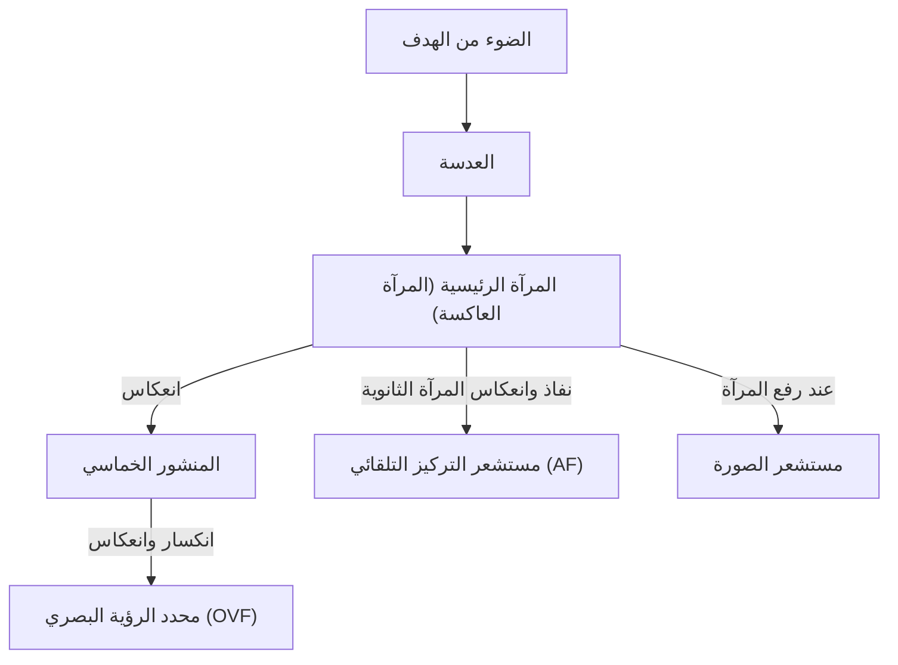
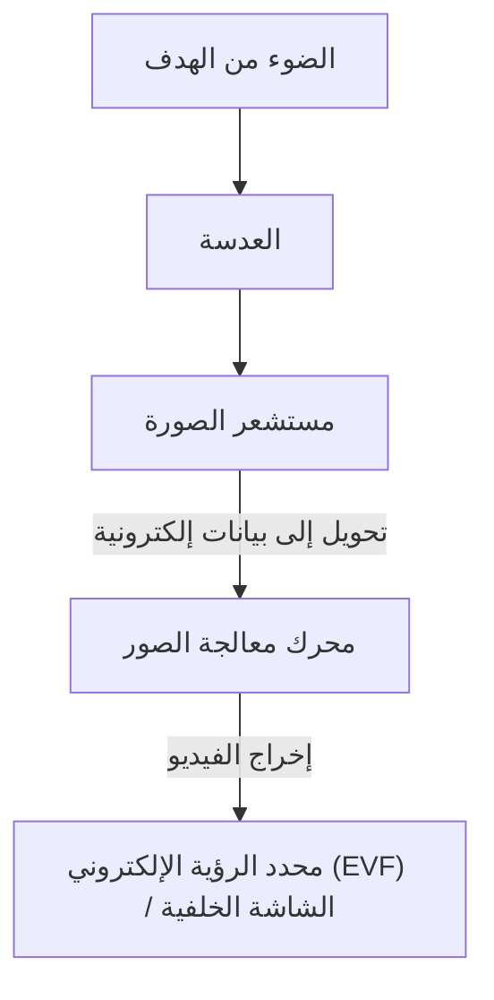

# الفرق بين الكاميرات ذات العدسة الأحادية العاكسة (DSLR) والكاميرات بدون مرآة (Mirrorless): هيكل الكاميرا وكيفية التقاط الضوء

تاريخ التصوير الفوتوغرافي هو أيضاً تاريخ تقنيات التقاط الضوء. طالما حظيت "الكاميرات ذات العدسة الأحادية العاكسة (DSLR)" بشعبية واسعة بين المحترفين والهواة على حد سواء لفترة طويلة، وفي السنوات الأخيرة، استحوذت "الكاميرات بدون مرآة (Mirrorless)" بسرعة على حصة كبيرة من السوق لتصبح المعيار الجديد. تشترك هاتان الكاميرتان في ميزة العدسات القابلة للتبديل، ولكنهما تختلفان بشكل جذري في الهيكل الداخلي وكيفية التقاط الضوء.

في هذا المقال، سنتعمق في هذه الآليات من وجهات نظر فيزيائية وتقنية وتاريخية، بدءاً من آلية عمل محدد الرؤية البصري (OVF) الذي يستخدم المنشور الخماسي، وصولاً إلى أحدث تقنيات معالجة الصور التي تدعم محدد الرؤية الإلكتروني (EVF).

## 1. الهيكل الأساسي للكاميرا ومسار الضوء

الوظيفة الأساسية والأهم للكاميرا هي "توجيه الضوء الذي يمر عبر العدسة إلى المستشعر (أو الفيلم) وتسجيله". كيف يتم التحكم في مسار الضوء هذا هو ما يخلق الفرق الأكبر بين كاميرات DSLR والكاميرات بدون مرآة.

### 1.1 آلية عمل الكاميرا ذات العدسة الأحادية العاكسة (DSLR)

كاميرا DSLR (Digital Single-Lens Reflex) تمتلك هيكلاً يستخدم، كما يوحي اسمها، "عدسة واحدة (Single-Lens)" و"مرآة عاكسة (Reflex)".

الميزة الأبرز في كاميرا DSLR هي "المرآة" الموجودة بداخلها. ينعكس الضوء الداخل من العدسة إلى الأعلى بواسطة هذه المرآة، ويدخل في مكون بصري يُعرف باسم المنشور الخماسي (أو المرآة الخماسية). يقوم المنشور الخماسي بتصحيح الصورة المعكوسة (أعلى-أسفل ويمين-يسار) إلى صورة معتدلة وصحيحة من خلال انعكاسات معقدة، ويوجهها إلى محدد الرؤية البصري (OVF).

ميزة هذا الهيكل هي "القدرة على رؤية الضوء الفعلي الذي تلتقطه العدسة بالعين المجردة دون أي تأخير زمني". في التصوير الذي تعتمد فيه اللحظة على أجزاء من الثانية، مثل الألعاب الرياضية أو الحيوانات البرية، كان من المزايا الكبيرة القدرة على رؤية الهدف مباشرة كما يصله الضوء بسرعة الضوء.

ومع ذلك، في لحظة الضغط على زر الغالق، يجب رفع هذه المرآة (Mirror Up). تؤدي هذه الحركة إلى اختفاء صورة محدد الرؤية للحظة، وهو ما يعرف بـ "التعتيم" (Blackout)، وفي الوقت نفسه، تنتج اهتزازات طفيفة تسمى "صدمة المرآة".

### 1.2 آلية عمل الكاميرا بدون مرآة (Mirrorless)

من ناحية أخرى، تتمتع الكاميرا بدون مرآة بهيكل يزيل "صندوق المرآة" و"المنشور الخماسي" من كاميرا DSLR.

في الكاميرا بدون مرآة، يسقط الضوء الداخل من العدسة دائماً مباشرة على مستشعر الصورة. يقوم المستشعر بتحويل الضوء المستقبل إلى إشارات كهربائية في الوقت الفعلي، ويقوم محرك معالجة الصور بمعالجتها كبيانات فيديو. ثم يتم عرض هذا الفيديو على محدد الرؤية الإلكتروني (EVF) أو شاشة LCD الخلفية.

الميزة الكبرى لهذا الهيكل هي "القدرة على تأكيد الصورة التي سيتم التقاطها فعلياً (بما في ذلك التعريض الضوئي وتوازن اللون الأبيض) قبل التصوير". بالإضافة إلى ذلك، نظراً لعدم وجود صندوق المرآة، لا يمكن فقط تصغير حجم الكاميرا وجعلها أخف وزناً، بل أصبح من الممكن أيضاً تقريب العدسة الخلفية من المستشعر (تقصير مسافة الحافة الخلفية أو Flange Back)، مما أدى إلى تحسن هائل في حرية تصميم العدسات.

## 2. محدد الرؤية البصري (OVF) مقابل محدد الرؤية الإلكتروني (EVF)

يؤدي الاختلاف في هيكل الكاميرا مباشرة إلى اختلافات في طبيعة محدد الرؤية. يعتمد كل من OVF و EVF على فلسفات وتقنيات مختلفة.

### 2.1 التفوق الفيزيائي لمحدد الرؤية البصري (OVF)

يعد OVF نظاماً بصرياً بحتاً يستفيد من انكسار الضوء وانعكاسه. نظراً لعدم وجود معالجة رقمية، فإن تأخير العرض (Time Lag) يكون فعلياً صفراً. بالإضافة إلى ذلك، نظراً لأنه يمكنه الاستفادة من النطاق الديناميكي للعين البشرية كما هو، فإنه يتميز بالقدرة على التعرف بسهولة على تفاصيل الهدف حتى في الأماكن الساطعة جداً أو المظلمة جداً.

علاوة على ذلك، نظراً لأن OVF لا يستهلك طاقة كهربائية، فإنه يسمح بتشغيل البطارية لفترات طويلة. بالنسبة لمصوري الطبيعة الذين لا يستطيعون تأمين مصدر طاقة لأيام في بيئات طبيعية قاسية، كانت هذه مسألة حياة أو موت.

### 2.2 الابتكار التقني لمحدد الرؤية الإلكتروني (EVF)

يعد EVF آلية تنظر من خلالها إلى شاشة صغيرة وعالية الدقة (OLED أو LCD) عبر عدسة عينية. كانت شاشات EVF المبكرة تعاني من دقة منخفضة، وتأخير ملحوظ في العرض، وكانت مليئة بالضوضاء في الأماكن المظلمة، مما جعلها أقل شأناً من OVF في العديد من الجوانب.

ومع ذلك، بفضل التطور التكنولوجي، حققت شاشات EVF تقدماً هائلاً:
- **وظيفة المحاكاة**: يتم عرض نتائج الإعدادات مثل تعويض التعريض، وتوازن اللون الأبيض، وأنماط الصورة في الوقت الفعلي. أدى هذا إلى تقليل حالة عدم اليقين في التصوير الفوتوغرافي بشكل كبير، حيث كان المصور قديماً "لا يعرف النتيجة إلا بعد التقاط الصورة".
- **تراكب المعلومات**: يمكن عرض مجموعة متنوعة من المعلومات المساعدة في محدد الرؤية، مثل المدرج التكراري (Histogram)، والميزان المائي (Level)، وذروة التركيز (Focus Peaking)، ونمط الحمار الوحشي (Zebra Pattern).
- **تحسين الأداء في الإضاءة المنخفضة**: بفضل الأداء العالي الحساسية للمستشعر ومعالجة الصور، من الممكن تضخيم الإضاءة وعرض صورة ساطعة حتى في الأماكن المظلمة تماماً بالنسبة للعين المجردة. هذا إنجاز مستحيل بالنسبة لـ OVF، خاصة في أمور مثل ضبط التكوين في تصوير النجوم.
- **التصوير بدون تعتيم (Blackout-Free)**: في الكاميرات الرائدة المزودة بأحدث مستشعرات CMOS المكدسة، يتم قراءة البيانات من المستشعر بسرعات عالية جداً، مما يتيح "التصوير بدون تعتيم" حيث لا تختفي صورة محدد الرؤية حتى أثناء التصوير المستمر السريع. نتيجة لذلك، تفوق EVF على OVF في القدرة على "تتبع الهدف باستمرار"، والتي كانت الميزة الأكبر لـ OVF.

## 3. تطور أنظمة التركيز التلقائي (AF)

كان للاختلاف بين DSLR والكاميرات بدون مرآة تأثير كبير على تطور تقنية التركيز (التركيز التلقائي).

### 3.1 التركيز التلقائي باكتشاف الطور (Phase-Detection AF) في DSLR

تستخدم كاميرات DSLR بشكل أساسي "مستشعرات التركيز التلقائي باكتشاف الطور المخصصة". يتم استخدام مرآة ثانوية خلف المرآة الرئيسية لتوجيه جزء من الضوء إلى الأسفل، حيث يتم قياس التركيز بواسطة مستشعر AF موجود هناك. كانت هذه الطريقة سريعة جداً وممتازة في تتبع الأهداف المتحركة. ومع ذلك، بسبب قيود المساحة لترتيب مستشعرات AF، كانت نقاط التركيز تميل إلى التركز بالقرب من وسط الشاشة. بالإضافة إلى ذلك، كانت الأخطاء الميكانيكية في المرآة والعدسات قادرة على التسبب في انحرافات في التركيز (التركيز الأمامي أو الخلفي).

### 3.2 التركيز التلقائي باكتشاف الطور على المستشعر واكتشاف التباين (الكاميرات بدون مرآة)

في الكاميرات بدون مرآة، يعمل مستشعر الصورة نفسه كمستشعر للتركيز التلقائي. استخدمت الكاميرات بدون مرآة المبكرة "التركيز التلقائي باكتشاف التباين" للبحث عن ذروة التركيز من تباين الصورة، ورغم دقتها العالية، إلا أنها عانت من بطء السرعة.

في الوقت الحاضر، أصبح "التركيز التلقائي باكتشاف الطور على المستشعر (On-Sensor Phase-Detection AF)"، الذي يستخدم بعض وحدات البكسل على مستشعر الصورة لاكتشاف الطور، هو السائد. حقق هذا توازناً بين التركيز التلقائي السريع والدقة العالية. علاوة على ذلك، نظراً لأنه يمكن قياس التركيز على كامل مساحة المستشعر، فمن الممكن وضع نقاط التركيز من حافة الشاشة إلى الحافة الأخرى.
كما أنه، نظراً لعدم وجود أخطاء ميكانيكية متدخلة، لا تحدث انحرافات في التركيز من حيث المبدأ.

في السنوات الأخيرة، تم دمج تقنية التعرف على الأهداف باستخدام الذكاء الاصطناعي (التعلم العميق)، مما يمكّن الكاميرا من التعرف تلقائياً على عيون البشر، والحيوانات، والطيور، والسيارات، والطائرات، والقطارات، وتتبعها باستمرار. هذا جعل التصوير الذي كان ممكناً فقط للمحترفين ذوي الخبرة في الماضي متاحاً لأي شخص الآن.

## 4. التأثيرات الاقتصادية والتقنية لقاعدة العدسة (Mount) ومسافة الحافة الخلفية

أحدث التغيير في هيكل الكاميرا ثورة أيضاً في قواعد العدسات. في كاميرات DSLR، كان يجب أن تكون مسافة الحافة الخلفية (المسافة من سطح قاعدة العدسة إلى المستشعر) طويلة حتماً (حوالي 40 مم أو أكثر) بسبب وجود صندوق المرآة.

في الكاميرات بدون مرآة، يمكن تقصير مسافة الحافة الخلفية هذه إلى أقصى حد (حوالي 15 إلى 20 مم). أدى ذلك إلى الفوائد التالية:

1. **جودة صورة أعلى للعدسات واسعة الزاوية**: نظراً لأنه يمكن تقريب العدسة الخلفية من المستشعر، لم تعد هناك حاجة لثني الضوء بشكل غير طبيعي، مما سهل تصميم عدسات واسعة الزاوية تحافظ على جودة صورة عالية حتى في الأطراف.
2. **التغلب على المفاضلة بين القطر الكبير والحجم الصغير**: من خلال تكبير قطر القاعدة وتقصير مسافة الحافة الخلفية، أصبح من الممكن توفير عدسات بفتحات ساطعة لم يكن من الممكن تصورها سابقاً (مثل F1.2 و F1.0) بحجم ووزن عمليين.
3. **الاستفادة من محولات القاعدة (Mount Adapters)**: نظراً لقصر مسافة الحافة الخلفية، إذا تم استخدام محول قاعدة لضبط السماكة، يصبح من الممكن فيزيائياً تركيب عدسات DSLR السابقة، والعدسات القديمة، وحتى العدسات من الشركات المصنعة الأخرى. جلب هذا فائدة اقتصادية للمستخدمين من خلال السماح لهم بالاستفادة من أصول عدساتهم الحالية.

## 5. الطريق إلى تصوير الفيديو والكاميرات الهجينة

ما عزز بشكل كبير من انتشار الكاميرات بدون مرآة هو الطلب المتزايد على تصوير الفيديو. عند تصوير الفيديو بكاميرا DSLR، لا يمكن استخدام OVF لأن المرآة تظل مرفوعة، ويجب التصوير أثناء النظر إلى الشاشة الخلفية. علاوة على ذلك، نظراً لأن الضوء لم يعد يصل إلى مستشعر التركيز التلقائي المخصص لاكتشاف الطور، كانت هناك مشكلة تتمثل في انخفاض أداء التركيز التلقائي بشكل كبير أثناء تصوير الفيديو (قامت بعض الشركات المصنعة بحل هذه المشكلة باستخدام تقنيات مثل Dual Pixel CMOS AF، لكن القيود الهيكلية الأساسية ظلت موجودة).

الكاميرات بدون مرآة يمكنها الانتقال بسلاسة بين الصور الثابتة ومقاطع الفيديو، لأن كلاهما يتم معالجته من بيانات المستشعر بنفس الطريقة. حتى أثناء تصوير الفيديو، يعمل التركيز التلقائي باكتشاف الطور على المستشعر عالي الأداء، ومن الممكن أيضاً تصوير مقاطع فيديو بوضعية ثابتة أثناء النظر من خلال EVF. في الوقت الحاضر، أثبتت الكاميرات بدون مرآة مكانتها كـ "كاميرات هجينة" تجمع بين الصور الثابتة والفيديو بمستويات عالية.

## الخلاصة: مستقبل آلات التصوير

الانتقال من كاميرات DSLR إلى الكاميرات بدون مرآة ليس مجرد تغيير في طريقة محدد الرؤية. إنه يعني أن الكاميرا قد تطورت بشكل أساسي من "أداة بصرية نقية" إلى "جهاز متقدم لمعالجة المعلومات الرقمية".

الجمال الخام للضوء الساطع الذي يُرى من خلال المنشور الخماسي هو متعة التصوير الأساسية التي لا يمكن تجربتها إلا باستخدام كاميرا DSLR. يمنحك الصوت الميكانيكي للغالق والاهتزاز الذي ينتقل إلى يديك الشعور الحقيقي بأنك تلتقط صورة.

من ناحية أخرى، أدت موجة التحول الإلكتروني التي جلبتها الكاميرات بدون مرآة إلى توسيع حدود التعبير الفوتوغرافي بشكل كبير. التصوير بدون تعتيم، والتصوير المستمر فائق السرعة، والتعرف على الأهداف بواسطة الذكاء الاصطناعي، وتطور آليات تثبيت الصورة هي أشياء أصبحت ممكنة فقط لأننا تحررنا من القيود الهيكلية.

فهم آليات الكاميرا يعني معرفة كيف يتم اقتطاع الضوء ليصبح صورة واحدة. بغض النظر عن مدى تطور التكنولوجيا، في النهاية، إرادة المصور هي التي تتحكم في الكاميرا وتلتقط الضوء.
