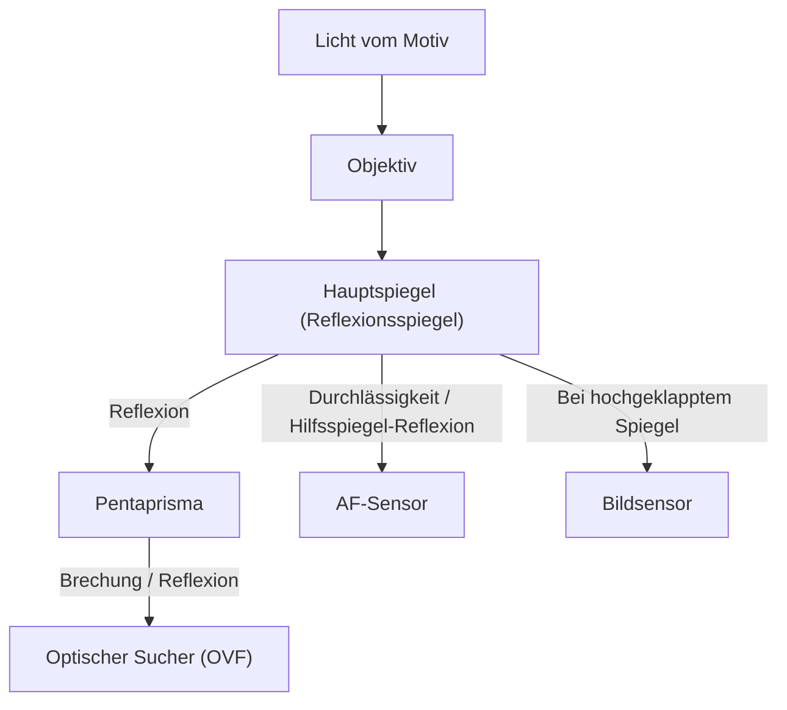
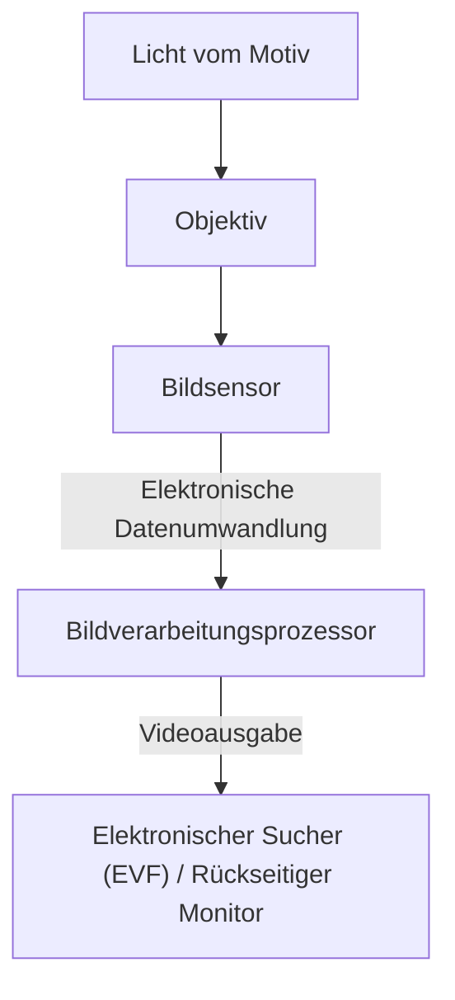

# Der Unterschied zwischen DSLR und spiegellosen Kameras: Kamerastruktur und wie sie Licht einfangen

Die Geschichte der Fotografie ist auch die Geschichte der Technik, Licht einzufangen. Die "Spiegelreflexkamera (DSLR)", die lange Zeit von Profis bis hin zu Amateuren weit verbreitet und beliebt war, und die "spiegellose Kamera", die in den letzten Jahren rasant an Marktanteilen gewonnen hat und zum neuen Standard geworden ist. Beide Kameras haben gemeinsam, dass sie über austauschbare Objektive verfügen, weisen jedoch grundlegende Unterschiede in ihrer inneren Struktur und der Art und Weise auf, wie sie Licht einfangen.

In diesem Artikel werden wir die Mechanismen von optischen Suchern (OVF) mit Pentaprisma bis hin zu den neuesten Bildverarbeitungstechnologien, die elektronische Sucher (EVF) unterstützen, aus physikalischer, technischer und historischer Perspektive tiefgehend untersuchen.

## 1. Grundstruktur der Kamera und Lichtweg

Die grundlegendste Funktion einer Kamera besteht darin, "das durch das Objektiv einfallende Licht auf einen Sensor (oder Film) zu leiten und aufzuzeichnen". Wie dieser Lichtweg gesteuert wird, macht den größten Unterschied zwischen DSLR- und spiegellosen Kameras aus.

### 1.1 Der Mechanismus der Spiegelreflexkamera (DSLR)

Die digitale Spiegelreflexkamera (Digital Single-Lens Reflex) hat, wie der Name schon sagt, eine Struktur, die ein "einziges Objektiv (Single-Lens)" und einen "Spiegel (Reflex)" verwendet.

Das Hauptmerkmal einer DSLR ist der im Inneren der Kamera platzierte "Spiegel". Das durch das Objektiv einfallende Licht wird von diesem Spiegel nach oben reflektiert und tritt in ein optisches Bauteil namens Pentaprisma (oder Pentaspiegel) ein. Das Pentaprisma korrigiert durch komplexe Reflexionen das seitenverkehrte und auf dem Kopf stehende Bild zu einem aufrechten und seitenrichtigen Bild und leitet es an den optischen Sucher (OVF) weiter.

Der Vorteil dieser Struktur liegt darin, dass "das vom Objektiv eingefangene Licht selbst ohne Zeitverzögerung mit dem bloßen Auge gesehen werden kann". Bei Aufnahmen, bei denen der Bruchteil einer Sekunde entscheidend ist, wie bei Sport- oder Wildtierfotografie, war es ein großer Vorteil, das Motiv, das mit Lichtgeschwindigkeit ankommt, direkt betrachten zu können.

Im Moment des Auslösens muss dieser Spiegel jedoch hochgeklappt werden (Mirror-Up). Durch diese Aktion verschwindet das Sucherbild für einen kurzen Moment, was als "Blackout" bezeichnet wird, und gleichzeitig entsteht eine winzige Vibration, die "Spiegelschlag" genannt wird.

### 1.2 Der Mechanismus der spiegellosen Kamera

Andererseits haben spiegellose Kameras eine Struktur, bei der der "Spiegelkasten" und das "Pentaprisma" aus der DSLR entfernt wurden.

Bei einer spiegellosen Kamera trifft das durch das Objektiv einfallende Licht immer direkt auf den Bildsensor. Der Sensor wandelt das empfangene Licht in Echtzeit in elektrische Signale um, und der Bildverarbeitungsprozessor verarbeitet sie als Videodaten. Dieses Bild wird dann auf dem elektronischen Sucher (EVF) oder dem LCD-Monitor auf der Rückseite angezeigt.

Der größte Vorteil dieser Struktur besteht darin, dass "das tatsächlich aufgenommene Bild (mit angewendeter Belichtung und Weißabgleich) vor der Aufnahme überprüft werden kann". Da kein Spiegelkasten vorhanden ist, kann nicht nur das Kameragehäuse kleiner und leichter gemacht werden, sondern es ist auch möglich, die hintere Linse des Objektivs näher an den Sensor zu bringen (das Auflagemaß zu verkürzen), was die Freiheit beim Objektivdesign drastisch erhöht.

## 2. Optischer Sucher (OVF) vs. Elektronischer Sucher (EVF)

Der Unterschied in der Kamerastruktur führt direkt zu unterschiedlichen Eigenschaften der Sucher. OVF und EVF basieren auf jeweils unterschiedlichen Philosophien und Technologien.

### 2.1 Die physikalische Überlegenheit des optischen Suchers (OVF)

Der OVF ist ein rein optisches System, das die Brechung und Reflexion von Licht nutzt. Da keine digitale Verarbeitung stattfindet, ist die Anzeigeverzögerung physikalisch null. Darüber hinaus kann der Dynamikumfang des menschlichen Auges so genutzt werden, wie er ist, wodurch es einfach ist, die Details des Motivs selbst an extrem hellen oder dunklen Orten zu erkennen.

Außerdem verbraucht der OVF keinen Strom, was einen langen Batteriebetrieb ermöglicht. Für Naturfotografen, die tagelang in rauen natürlichen Umgebungen ohne Stromversorgung auskommen müssen, war dies eine Frage von Leben und Tod.

### 2.2 Die technologische Innovation des elektronischen Suchers (EVF)

Der EVF ist ein System, bei dem ein kleines, hochauflösendes Display (OLED oder LCD) durch ein Okular betrachtet wird. Frühe EVFs waren den OVFs in vielerlei Hinsicht unterlegen, da sie eine niedrige Auflösung aufwiesen, merkliche Verzögerungen bei der Anzeige hatten und an dunklen Orten voller Bildrauschen waren.

Mit der Entwicklung der Technologie haben EVFs jedoch dramatische Fortschritte gemacht.
- **Simulationsfunktion**: Einstellungsergebnisse wie Belichtungskorrektur, Weißabgleich und Bildstile werden in Echtzeit wiedergegeben. Die Unsicherheit in der Fotografie, "dass man es erst nach der Aufnahme weiß", wurde erheblich reduziert.
- **Informations-Overlay**: Eine Vielzahl von Informationen zur Unterstützung der Aufnahme, wie Histogramme, elektronische Wasserwaagen, Focus Peaking und Zebramuster, können im Sucher angezeigt werden.
- **Verbesserte Leistung bei schlechten Lichtverhältnissen**: Dank der hohen Empfindlichkeit des Sensors und der Bildverarbeitung ist es möglich, das Bild hell und verstärkt anzuzeigen, selbst an Orten, die für das bloße Auge stockdunkel sind. Dies ist ein Kunststück, das mit OVF unmöglich ist, etwa beim Einstellen der Bildkomposition in der Astrofotografie.
- **Blackout-freies Fotografieren**: Flaggschiffmodelle, die mit den neuesten Stacked-CMOS-Sensoren ausgestattet sind, lesen Daten aus dem Sensor extrem schnell aus und ermöglichen so ein "Blackout-freies Fotografieren", bei dem das Sucherbild auch bei Serienaufnahmen nicht verschwindet. Dadurch übertrifft der EVF nun den OVF in der Fähigkeit, "das Motiv im Auge zu behalten", was zuvor der größte Vorteil des OVF war.

## 3. Die Entwicklung des Autofokus (AF) -Systems

Der Unterschied zwischen DSLR und spiegellosen Kameras hatte auch große Auswirkungen auf die Entwicklung der Fokussiertechnologie (Autofokus).

### 3.1 Phasen-AF (DSLR)

DSLRs verwenden hauptsächlich "dedizierte Phasen-AF-Sensoren". Ein Hilfsspiegel hinter dem Hauptspiegel leitet einen Teil des Lichts nach unten, wo der AF-Sensor platziert ist, um den Fokus zu messen. Diese Methode ist sehr schnell und bietet eine hervorragende Verfolgung von sich bewegenden Motiven. Aufgrund der Platzbeschränkungen für den AF-Sensor konzentrierten sich die Fokuspunkte jedoch tendenziell in der Mitte des Bildschirms. Außerdem konnten mechanische Fehler im Spiegel oder Objektiv zu Fokusverschiebungen (Frontfokus / Backfokus) führen.

### 3.2 Sensor-Phasen-AF und Kontrast-AF (Spiegellos)

Bei spiegellosen Kameras fungiert der Bildsensor selbst auch als AF-Sensor. Frühe spiegellose Kameras verwendeten einen "Kontrast-AF", der den Fokuspunkt aus dem Kontrast des Bildes sucht. Obwohl die Genauigkeit hoch ist, gab es Probleme mit der Geschwindigkeit.

Heute ist der "Sensor-Phasen-AF", der einen Teil der Pixel auf dem Bildsensor zur Phasenerkennung verwendet, der Mainstream. Dadurch werden sowohl ein schneller AF als auch eine hohe Genauigkeit erreicht. Da der Fokus über die gesamte Sensorfläche gemessen werden kann, können Fokuspunkte von einer Kante des Bildschirms zur anderen platziert werden.
Da keine mechanischen Fehler auftreten, kommt es im Prinzip nicht zu Fokusverschiebungen.

In den letzten Jahren wurden Motiverkennungstechnologien unter Einsatz von KI (Deep Learning) integriert. Kameras können nun automatisch menschliche Augen, Tiere, Vögel, Autos, Flugzeuge und Züge erkennen und verfolgen, was Aufnahmen, die früher nur erfahrenen Profis möglich waren, für jedermann zugänglich macht.

## 4. Wirtschaftliche und technische Auswirkungen von Bajonett und Auflagemaß

Die strukturellen Veränderungen von Kameras haben auch eine Revolution bei Objektivanschlüssen (Bajonetten) bewirkt. Das Auflagemaß (der Abstand von der Bajonettauflage bis zum Sensor) musste bei DSLRs aufgrund des vorhandenen Spiegelkastens zwangsläufig lang sein (etwa 40 mm oder mehr).

Bei spiegellosen Kameras kann dieses Auflagemaß extrem kurz gehalten werden (etwa 15 bis 20 mm). Dies brachte folgende Vorteile mit sich:

1. **Höhere Bildqualität bei Weitwinkelobjektiven**: Da die hintere Linse des Objektivs näher an den Sensor gebracht werden kann, muss das Licht nicht unnatürlich gebogen werden, was die Entwicklung von Weitwinkelobjektiven mit hoher Bildqualität bis in die Randbereiche erleichtert.
2. **Überwindung des Kompromisses zwischen großer Blendenöffnung und Miniaturisierung**: Durch die Vergrößerung des Bajonettdurchmessers bei gleichzeitiger Verkürzung des Auflagemaßes können lichtstarke Objektive (wie f/1.2 oder f/1.0), die früher undenkbar waren, in praktischer Größe und Gewicht realisiert werden.
3. **Nutzung von Objektivadaptern**: Da das Auflagemaß kurz ist, können durch die Verwendung von Objektivadaptern zur Anpassung der Dicke ältere DSLR-Objektive, Altglas und sogar Objektive von Drittanbietern physisch montiert werden. Dies brachte den Anwendern den wirtschaftlichen Vorteil, ihre vorhandenen Objektivbestände weiter nutzen zu können.

## 5. Videoaufnahmen und der Weg zu Hybridkameras

Die wachsende Nachfrage nach Videoaufnahmen hat die Verbreitung spiegelloser Kameras stark vorangetrieben. Wenn man Videos mit einer DSLR aufnimmt, muss der Spiegel hochgeklappt bleiben, sodass der OVF nicht verwendet werden kann und man während der Aufnahme auf den Monitor auf der Rückseite schauen muss. Da außerdem kein Licht mehr auf den dedizierten Phasen-AF-Sensor fällt, verschlechtert sich die AF-Leistung während der Videoaufnahme erheblich (einige Hersteller haben dieses Problem mit Dual Pixel CMOS AF usw. gelöst, aber grundlegende strukturelle Einschränkungen blieben bestehen).

Da spiegellose Kameras die Daten des Sensors sowohl für Fotos als auch für Videos auf die gleiche Weise verarbeiten, ist ein nahtloser Übergang möglich. Selbst bei Videoaufnahmen funktioniert der hochleistungsfähige Sensor-Phasen-AF, und es ist möglich, Videos in einer stabilen Haltung aufzunehmen, während man durch den EVF schaut. Heute haben sich spiegellose Kameras als "Hybridkameras" etabliert, die sowohl Fotografie als auch Videografie auf hohem Niveau vereinen.

## Fazit: Die Zukunft der Fotokamera

Der Übergang von der DSLR zur spiegellosen Kamera ist nicht nur eine Änderung des Suchersystems. Er bedeutet, dass sich die Kamera grundlegend von einem "reinen optischen Instrument" zu einem "fortschrittlichen digitalen Informationsverarbeitungsgerät" entwickelt hat.

Die Schönheit des hellen, rohen Lichts, das man durch ein Pentaprisma sieht, ist eine ursprüngliche Freude an der Fotografie, die man nur mit einer DSLR erleben kann. Das mechanische Geräusch des Auslösers und die Vibrationen in den Händen geben einem das Gefühl, wirklich zu fotografieren.

Andererseits hat die Welle der Elektronik, die von spiegellosen Kameras gebracht wurde, die Grenzen des fotografischen Ausdrucks stark erweitert. Blackout-freie Serienaufnahmen, extrem schnelle Serienbildgeschwindigkeiten, KI-gesteuerte Motiverkennung und die Weiterentwicklung von Bildstabilisierungsmechanismen wurden nur möglich, weil wir uns von strukturellen Einschränkungen befreit haben.

Den Mechanismus einer Kamera zu verstehen bedeutet zu wissen, wie Licht eingefangen und in ein Foto verwandelt wird. Egal, wie sehr sich die Technologie weiterentwickelt, letztendlich ist es die Absicht des Fotografen, die Kamera zu bedienen und das Licht einzufangen.
