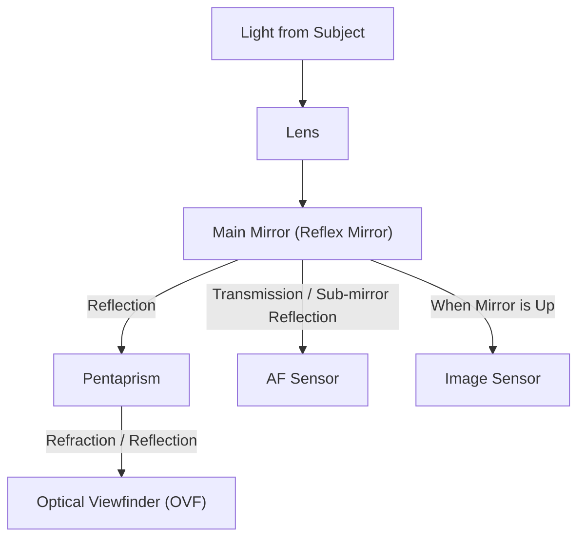
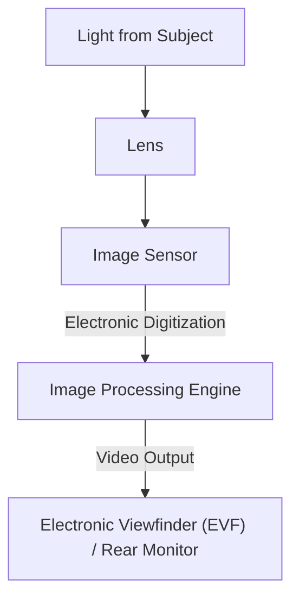

# DSLR vs Mirrorless: Camera Mechanics and Capturing Light

The history of photography is also the history of technology that captures light. "DSLR (Digital Single-Lens Reflex)" cameras have long been widely loved by professionals and amateurs alike, and "Mirrorless cameras" have rapidly expanded their market share in recent years to become the new standard. While both of these cameras share the common feature of interchangeable lenses, they have fundamental differences in their internal structures and how they capture light.

In this article, we will delve deeply into these mechanisms from physical, technical, and historical perspectives, ranging from the structure of the Optical Viewfinder (OVF) using a pentaprism to the latest image processing technologies supporting the Electronic Viewfinder (EVF).

## 1. Basic Camera Structure and Light Path

The most fundamental function of a camera is to "guide the light passing through the lens to the sensor (or film) and record it." How this light path is controlled creates the biggest difference between DSLRs and mirrorless cameras.

### 1.1 DSLR Mechanism

As the name suggests, a DSLR (Digital Single-Lens Reflex) camera has a structure utilizing a "Single-Lens" and a "Reflex" mirror.

The most prominent feature of a DSLR is the "mirror" placed inside the camera. The light entering from the lens is reflected upward by this mirror and enters an optical component called a pentaprism (or pentamirror). By repeating complex reflections, the pentaprism corrects the vertically and horizontally inverted image into an upright, laterally correct image and guides it to the optical viewfinder (OVF).

The advantage of this structure is that "you can see the light captured by the lens itself with the naked eye without any time lag." In photography where a split-second timing is critical, such as sports or wildlife, being able to directly confirm the appearance of the subject arriving at the speed of light was a massive advantage.

However, at the moment of pressing the shutter, it is necessary to flip this mirror up (mirror up). This action causes a "blackout" where the viewfinder image momentarily disappears, and at the same time, a minute vibration known as mirror shock occurs.

### 1.2 Mirrorless Camera Mechanism

On the other hand, mirrorless cameras have a structure that eliminates the "mirror box" and "pentaprism" from the DSLR.

In a mirrorless camera, the light entering from the lens is constantly hitting the image sensor directly. The sensor converts the received light into electrical signals in real-time, and the image processing engine processes it as video data. Then, this video is displayed on the Electronic Viewfinder (EVF) or the rear LCD monitor.

The biggest advantage of this structure is that "you can check the image that will actually be captured (reflecting exposure and white balance) before shooting." Also, without a mirror box, not only can the camera body be made smaller and lighter, but it also becomes possible to bring the rear element of the lens closer to the sensor (shorten the flange back), dramatically improving the degree of freedom in lens design.

## 2. Optical Viewfinder (OVF) vs Electronic Viewfinder (EVF)

Differences in camera structure directly lead to differences in the nature of the viewfinder. OVF and EVF are backed by different philosophies and technologies respectively.

### 2.1 Physical Superiority of Optical Viewfinders (OVF)

An OVF is a pure optical system utilizing the refraction and reflection of light. Because it does not involve digital processing, the display delay (time lag) is physically zero. Also, since it fully utilizes the dynamic range of the human eye, it has the characteristic of making it easy to recognize the details of the subject even in extremely bright or dark places.

Furthermore, OVFs do not consume power, allowing for long periods of battery operation. For nature photographers who cannot secure power for days in harsh natural environments, this was a matter of life and death.

### 2.2 Technological Innovation of Electronic Viewfinders (EVF)

An EVF is a system where you look at a small, high-definition display (OLED or LCD) through an eyepiece lens. Early EVFs had many disadvantages compared to OVFs, such as low resolution, noticeable display delay, and becoming noisy in dark places.

However, with technological advancement, EVFs have made dramatic progress.
- **Simulation Function**: Setting results such as exposure compensation, white balance, and picture style are reflected in real-time. It has significantly reduced the uncertainty of photography, where "you don't know until you take the shot."
- **Information Overlay**: Various information assisting the shoot, such as histograms, spirit levels, focus peaking, and zebra patterns, can be displayed in the viewfinder.
- **Improved Low-Light Performance**: Through the sensor's high-sensitivity performance and image processing, it is possible to brighten and display places that are pitch black to the naked eye. This is a feat impossible with an OVF, such as aligning the composition in astrophotography.
- **Blackout-Free Shooting**: Flagship models equipped with the latest stacked CMOS sensors achieve "blackout-free shooting" where the viewfinder image does not disappear even during continuous shooting by reading data from the sensor extremely quickly. As a result, the EVF has come to surpass the OVF in the ability to "continue tracking the subject," which was the greatest advantage of the OVF.

## 3. Evolution of Autofocus (AF) Systems

The difference between DSLRs and mirrorless cameras has also had a major impact on the evolution of focusing technology (autofocus).

### 3.1 Phase-Detection AF (DSLR)

DSLRs primarily use a "dedicated phase-detection AF sensor." Using a sub-mirror located behind the main mirror, a portion of the light is guided downward, and the AF sensor placed there measures the focus. This method is very fast and excellent at tracking moving subjects. However, due to constraints on the placement space of the AF sensor, autofocus points (points where focus can be achieved) tended to concentrate near the center of the screen. Also, mechanical errors in mirrors and lenses could cause focus shifts (front focus, back focus).

### 3.2 On-Sensor Phase-Detection AF and Contrast AF (Mirrorless)

In mirrorless cameras, the image sensor itself doubles as the AF sensor. Early mirrorless cameras adopted "Contrast AF," which searches for the peak of focus from the contrast of the video; although highly accurate, it struggled with speed.

Currently, "On-Sensor Phase-Detection AF," which uses some of the pixels on the image sensor for phase-detection, is mainstream. This achieves both high-speed AF and high accuracy. Furthermore, because focus can be measured across the entire sensor, it is possible to place autofocus points from edge to edge of the screen.
Also, since mechanical errors do not intervene, focus shifts theoretically do not occur.

In recent years, combined with subject recognition technology utilizing AI (deep learning), cameras can automatically recognize and continuously track human eyes, animals, birds, cars, airplanes, trains, etc. Photography that was once impossible without being a skilled professional is becoming possible for anyone.

## 4. Economic and Technical Impact of Mounts and Flange Back

The structural changes in cameras have also brought a revolution to lens mounts. The flange back (the distance from the mount surface to the sensor) inevitably had to be long (about 40mm or more) in a DSLR due to the presence of the mirror box.

In mirrorless cameras, this flange back can be shortened to the limit (about 15 to 20mm). This has created the following benefits:

1. **Higher Image Quality in Wide-Angle Lenses**: Because the rear element of the lens can be brought closer to the sensor, it is no longer necessary to forcibly bend the light, making it easier to design wide-angle lenses with high image quality all the way to the periphery.
2. **Overcoming the Trade-off Between Large Aperture and Miniaturization**: By increasing the mount diameter while shortening the flange back, bright lenses with f-numbers that were once unthinkable (such as F1.2 or F1.0) can now be realized in practical sizes and weights.
3. **Utilization of Mount Adapters**: Because the flange back is short, using a mount adapter that adjusts the thickness makes it physically possible to attach past DSLR lenses, vintage lenses, and even lenses made by other companies. This brought an economic advantage to users in that they could utilize their existing lens assets.

## 5. The Path to Video Recording and Hybrid Cameras

What strongly boosted the popularization of mirrorless cameras was the growing need for video recording. When shooting video with a DSLR, the mirror must be kept up, meaning the OVF cannot be used, resulting in shooting while looking at the rear monitor. Also, light no longer reaches the dedicated phase-detection AF sensor, causing a significant drop in AF performance during video shooting (some manufacturers solved this issue with Dual Pixel CMOS AF, etc., but fundamental structural constraints remained).

Mirrorless cameras can seamlessly transition between still images and videos because both are done via data processing from the sensor in the same way. High-performance on-sensor phase-detection AF functions even during video shooting, and it is possible to shoot video in a stable posture while looking through the EVF. Today, mirrorless cameras have established their position as "hybrid cameras" that balance still images and video at a high level.

## Conclusion: The Future of Photography

The transition from DSLRs to mirrorless cameras is not just a change in the viewfinder system. It signifies that the camera has fundamentally evolved from a "pure optical instrument" to an "advanced digital information processing device."

The beauty of raw, shining light seen through a pentaprism is a primal joy of photography that can only be experienced with a DSLR. The mechanical sound of the shutter and the vibration transmitted to your hands give a real sense that you are taking a photograph.

On the other hand, the wave of electronization brought about by mirrorless cameras has greatly expanded the limits of photographic expression. Blackout-free shooting, ultra-high-speed continuous shooting, AI-based subject recognition, and the evolution of image stabilization mechanisms were realized exactly because they were freed from structural constraints.

To understand the mechanics of a camera is to know how light is cropped and becomes a single photograph. No matter how technology evolves, ultimately, it is none other than the intention of the photographer who operates the camera and captures the light.
