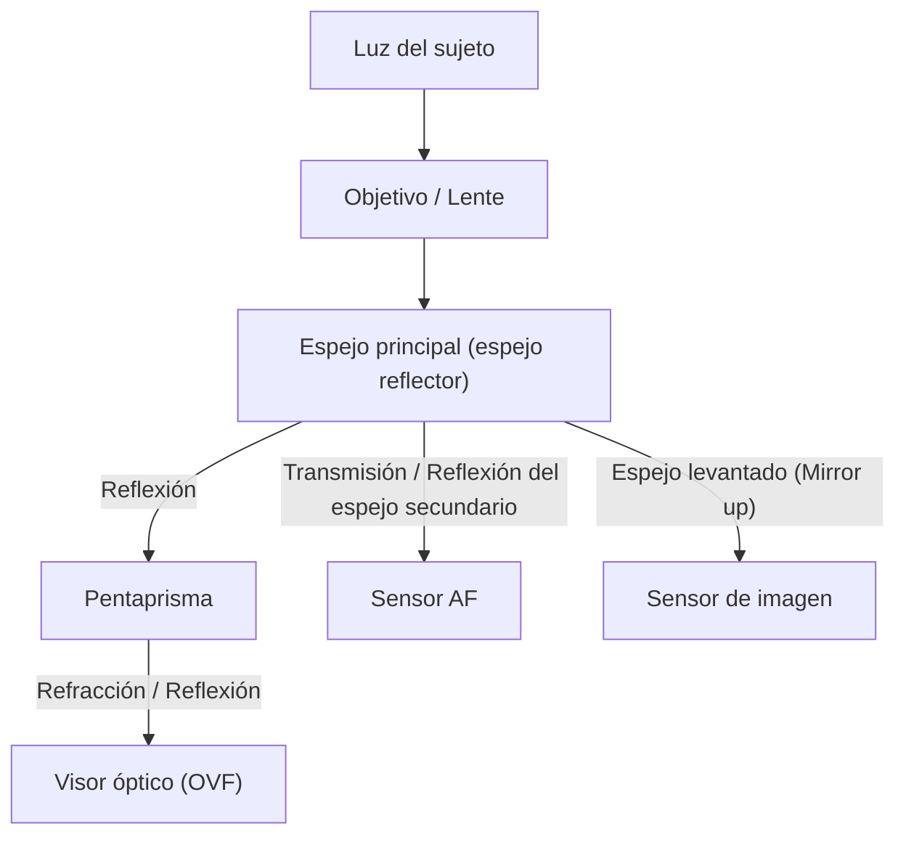
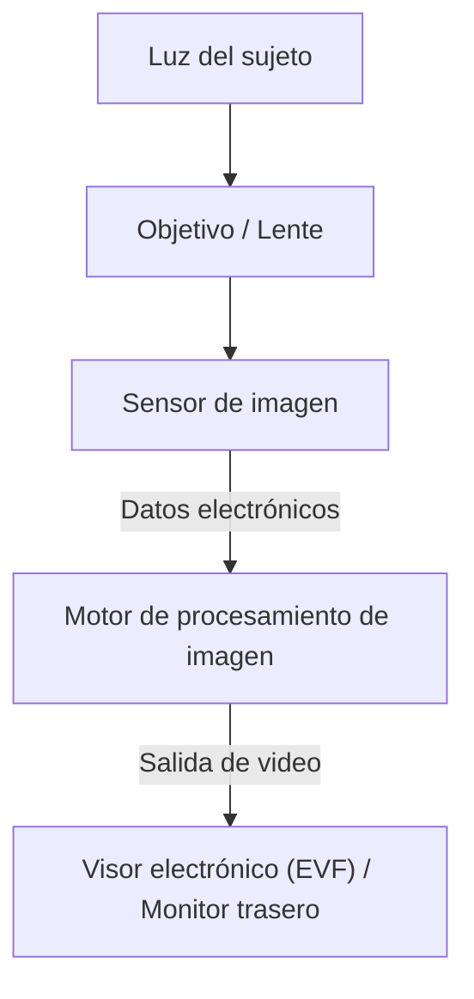

# Diferencias entre DSLR y Mirrorless: Mecanismos de la cámara y captura de la luz

La historia de la fotografía es también la historia de la tecnología para capturar la luz. Las "cámaras réflex digitales de un solo objetivo (DSLR)", amadas durante mucho tiempo por profesionales y aficionados, y las "cámaras sin espejo (Mirrorless)", que han expandido rápidamente su cuota de mercado en los últimos años para convertirse en el nuevo estándar. Ambas cámaras comparten la característica de tener lentes intercambiables, pero tienen diferencias fundamentales en su estructura interna y en la forma en que capturan la luz.

En este artículo, profundizaremos en sus mecanismos desde una perspectiva física, técnica e histórica, desde el funcionamiento del visor óptico (OVF) utilizando un pentaprisma hasta la última tecnología de procesamiento de imágenes que respalda al visor electrónico (EVF).

## 1. Estructura básica de la cámara y la trayectoria de la luz

La función más básica de una cámara es "guiar la luz que pasa a través del objetivo hacia el sensor (o película) y registrarla". Cómo se controla esta trayectoria de la luz (ruta óptica) crea la mayor diferencia entre las DSLR y las Mirrorless.

### 1.1 Mecanismo de la cámara réflex digital (DSLR)

Las cámaras DSLR (Digital Single-Lens Reflex), como su nombre indica, tienen una estructura que utiliza "un solo objetivo (Single-Lens)" y un "espejo reflector (Reflex)".

La característica más importante de una DSLR es el "espejo" colocado dentro de la cámara. La luz que entra por el objetivo es reflejada hacia arriba por este espejo y entra en un componente óptico llamado pentaprisma (o pentaespejo). Al repetir reflejos complejos, el pentaprisma corrige la imagen invertida a una imagen erecta y la guía hacia el visor óptico (OVF).

La ventaja de esta estructura es que "puedes ver la luz exacta capturada por el objetivo con tus propios ojos sin ningún retraso". En situaciones donde el momento es crucial, como en deportes o fotografía de vida silvestre, poder ver directamente al sujeto llegando a la velocidad de la luz era una gran ventaja.

Sin embargo, en el momento de soltar el obturador, este espejo debe levantarse (mirror up). Esta acción provoca un "apagón (blackout)" donde la imagen del visor desaparece por un instante, y al mismo tiempo genera una pequeña vibración conocida como el golpe del espejo (mirror shock).

### 1.2 Mecanismo de la cámara sin espejo (Mirrorless)

Por otro lado, las cámaras sin espejo tienen una estructura que elimina la "caja del espejo" y el "pentaprisma" de la DSLR.

En una cámara sin espejo, la luz que entra por el objetivo golpea directamente y de manera constante el sensor de imagen. El sensor convierte la luz recibida en señales eléctricas en tiempo real, y el motor de procesamiento de imagen lo procesa como datos de video. Luego, este video se muestra en el visor electrónico (EVF) o en el monitor LCD trasero.

La mayor ventaja de esta estructura es que "puedes confirmar la imagen que se capturará realmente (con la exposición y el balance de blancos reflejados) antes de disparar". Además, dado que no hay caja de espejo, el cuerpo de la cámara puede hacerse más pequeño y ligero, y es posible acercar el elemento trasero del objetivo al sensor (acortar la distancia de brida o flange back), lo que mejora drásticamente la libertad en el diseño de objetivos.

## 2. Visor Óptico (OVF) vs Visor Electrónico (EVF)

La diferencia en la estructura de la cámara está directamente relacionada con la diferencia en la naturaleza del visor. El OVF y el EVF están respaldados por diferentes filosofías y tecnologías.

### 2.1 Superioridad física del visor óptico (OVF)

El OVF es un sistema óptico puro que utiliza la refracción y reflexión de la luz. Como no implica procesamiento digital, el retraso de la visualización (lag) es físicamente cero. Además, al aprovechar el rango dinámico del ojo humano tal cual, tiene la característica de facilitar el reconocimiento de los detalles del sujeto incluso en lugares extremadamente brillantes u oscuros.

Además, como el OVF no consume energía, permite el funcionamiento de la batería durante largos períodos. Para los fotógrafos de naturaleza que no pueden asegurar una fuente de alimentación durante días en entornos naturales hostiles, esto era una cuestión de vida o muerte.

### 2.2 Innovación técnica del visor electrónico (EVF)

El EVF funciona mirando a través del ocular a una pequeña pantalla de alta definición (OLED o LCD). Los primeros EVF tenían baja resolución, retrasos de visualización notables y estaban llenos de ruido en lugares oscuros, siendo inferiores al OVF en muchos aspectos.

Sin embargo, debido a la evolución tecnológica, el EVF ha logrado avances espectaculares.
- **Función de simulación**: Los resultados de configuraciones como la compensación de exposición, el balance de blancos y los estilos de imagen se reflejan en tiempo real. Ha reducido significativamente la incertidumbre fotográfica de "no saber hasta tomar la foto".
- **Superposición de información**: Se pueden mostrar diversas informaciones de asistencia al disparo dentro del visor, como histogramas, niveles electrónicos, focus peaking y patrones de cebra.
- **Mejora del rendimiento en lugares oscuros**: Gracias al rendimiento de alta sensibilidad del sensor y al procesamiento de imágenes, es posible mostrar imágenes más brillantes y amplificadas incluso en lugares completamente oscuros para el ojo humano. Esta es una hazaña imposible con el OVF, útil al encuadrar fotografías de paisajes estrellados.
- **Disparo sin apagones (Blackout-free)**: Los modelos insignia equipados con los últimos sensores CMOS apilados logran un "disparo sin apagones" al leer datos del sensor a una velocidad extremadamente alta, de modo que la imagen del visor no desaparece ni siquiera durante disparos continuos (ráfaga). Gracias a esto, en la capacidad de "seguir rastreando al sujeto", que era la mayor ventaja del OVF, el EVF ahora supera al OVF.

## 3. Evolución del sistema de enfoque automático (AF)

La diferencia entre las DSLR y las sin espejo también tuvo un gran impacto en la evolución de la tecnología de enfoque (enfoque automático).

### 3.1 AF por detección de fase (DSLR)

Las DSLR utilizan principalmente un "sensor AF dedicado por detección de fase". Se usa un espejo secundario detrás del espejo principal para guiar parte de la luz hacia abajo, donde el sensor AF allí ubicado mide el enfoque. Este método es muy rápido y tiene un excelente seguimiento de sujetos en movimiento. Sin embargo, debido a restricciones de espacio para colocar el sensor AF, los puntos de enfoque automático tendían a concentrarse cerca del centro de la pantalla. Además, los errores mecánicos del espejo o del objetivo podían causar desviaciones de enfoque (front focus o back focus).

### 3.2 AF de detección de fase en el sensor y AF de contraste (Mirrorless)

En las cámaras sin espejo, el propio sensor de imagen también actúa como sensor AF. Las primeras cámaras sin espejo adoptaron el "AF de contraste", que busca el pico de enfoque a partir del contraste del video, y aunque era altamente preciso, tenía problemas de velocidad.

Hoy en día, el sistema dominante es el "AF de detección de fase en el sensor (Phase-Detection AF)", que utiliza parte de los píxeles en el sensor de imagen para la detección de fase. Esto logra tanto un AF de alta velocidad como una alta precisión. Además, como el enfoque se puede medir en toda la superficie del sensor, es posible colocar puntos de enfoque de un extremo a otro de la pantalla.
Además, dado que no hay errores mecánicos involucrados, en principio, no ocurren desviaciones de enfoque.

En los últimos años, combinadas con tecnologías de reconocimiento de sujetos que utilizan IA (aprendizaje profundo), estas cámaras reconocen y siguen automáticamente ojos humanos, animales, pájaros, coches, aviones y trenes. Lo que alguna vez solo era posible para profesionales altamente cualificados ahora se está volviendo posible para cualquiera.

## 4. Impacto económico y técnico de las monturas y la distancia de brida

Los cambios estructurales en las cámaras también han provocado una revolución en las monturas de los objetivos. La distancia de brida o distancia focal de brida (la distancia desde la superficie de la montura hasta el sensor) tenía que ser inevitablemente larga (unos 40 mm o más) en las DSLR debido a la presencia de la caja del espejo.

En las cámaras sin espejo, esta distancia de brida se puede acortar al extremo (alrededor de 15 a 20 mm). Esto ha generado las siguientes ventajas:

1. **Alta calidad de imagen en objetivos gran angular**: Como el elemento trasero del objetivo puede acercarse al sensor, ya no es necesario doblar forzadamente la luz, lo que facilita el diseño de objetivos gran angular de alta calidad incluso en los bordes.
2. **Superar el compromiso entre grandes aperturas y compacidad**: Al aumentar el diámetro de la montura mientras se acorta la distancia de brida, objetivos muy luminosos con números f antes impensables (como f/1.2 o f/1.0) ahora se pueden realizar en tamaños y pesos prácticos.
3. **Uso de adaptadores de montura**: Como la distancia de brida es corta, utilizando un adaptador de montura para ajustar el grosor, es físicamente posible colocar objetivos de DSLR antiguos, objetivos clásicos e incluso objetivos de otros fabricantes. Esto aportó un beneficio económico a los usuarios al permitirles aprovechar sus activos de objetivos existentes.

## 5. El camino hacia la grabación de video y las cámaras híbridas

La popularización de las cámaras sin espejo se vio fuertemente impulsada por la creciente demanda de grabación de video. Al grabar video con una DSLR, no se puede usar el OVF porque el espejo debe mantenerse levantado, por lo que la grabación se hace mirando el monitor trasero. Además, como la luz ya no llega al sensor AF de detección de fase dedicado, había un problema de disminución significativa en el rendimiento del AF durante la grabación de video (aunque algunos fabricantes resolvieron esto con Dual Pixel CMOS AF, etc., persistían restricciones estructurales fundamentales).

Las cámaras sin espejo pueden hacer una transición perfecta ya que procesan datos desde el sensor de la misma manera tanto para imágenes fijas como para video. El AF por detección de fase en el sensor de alto rendimiento funciona incluso durante la grabación de video, y es posible grabar video en una postura estable mirando a través del EVF. Actualmente, las cámaras sin espejo se han establecido como "cámaras híbridas" que equilibran un alto nivel en imágenes fijas y video.

## Conclusión: El futuro de la cámara fotográfica

La transición de las DSLR a las sin espejo no es simplemente un cambio en el sistema del visor. Significa que la cámara ha evolucionado fundamentalmente de ser un "instrumento óptico puro" a un "dispositivo avanzado de procesamiento de información digital".

La belleza de la luz pura y brillante vista a través de un pentaprisma es un placer fotográfico primitivo que solo se puede experimentar con una DSLR. El sonido mecánico del obturador y las vibraciones que se transmiten a tus manos te dan la sensación real de estar tomando una fotografía.

Por otro lado, la ola de digitalización traída por las cámaras sin espejo ha ampliado enormemente los límites de la expresión fotográfica. El disparo sin apagones, las ráfagas a ultra alta velocidad, el reconocimiento de sujetos por IA y la evolución de los mecanismos de estabilización de imagen se lograron precisamente al liberarse de las restricciones estructurales.

Comprender el mecanismo de la cámara es saber cómo se recorta la luz para convertirse en una sola fotografía. No importa cómo evolucione la tecnología, en última instancia, no es otro que la voluntad del fotógrafo quien opera la cámara y captura la luz.
