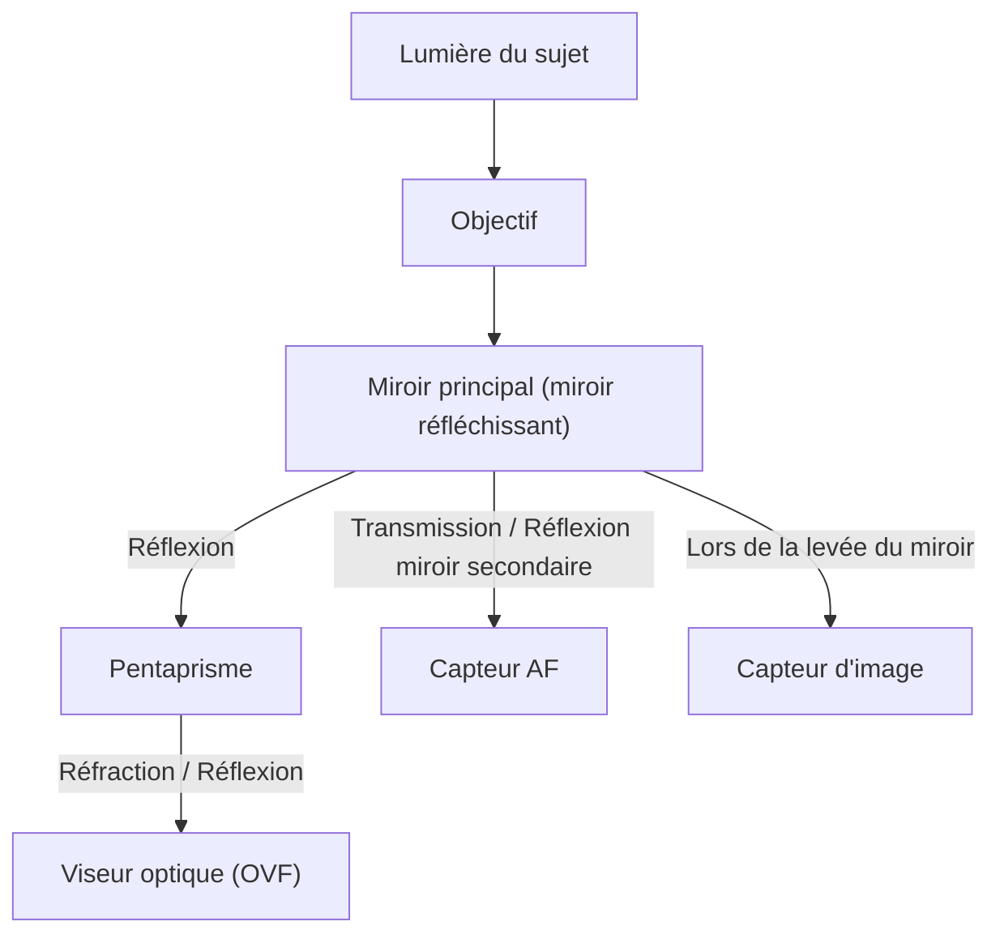
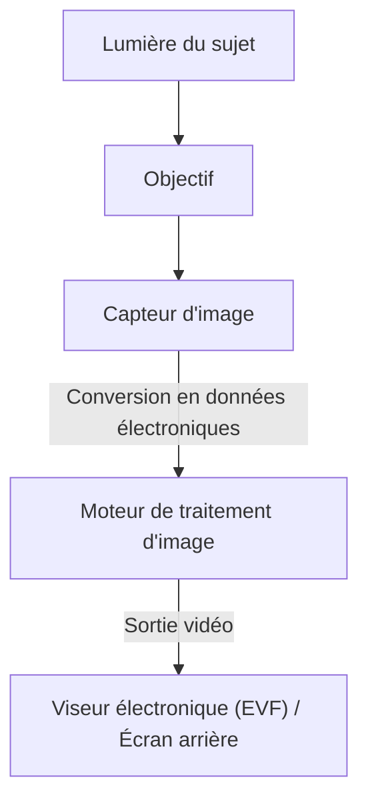

# Différence entre reflex et hybride : mécanisme de l'appareil et capture de la lumière

L'histoire de la photographie est aussi celle des technologies de capture de la lumière. Pendant longtemps, l'« appareil photo reflex (DSLR) » a été largement plébiscité par les professionnels comme par les amateurs. Ces dernières années, l'« appareil photo hybride (sans miroir) » a rapidement étendu sa part de marché pour devenir le nouveau standard. Si ces deux types d'appareils partagent la particularité d'être à objectifs interchangeables, ils présentent des différences fondamentales dans leur structure interne et leur façon de capter la lumière.

Dans cet article, nous explorerons en profondeur ces mécanismes d'un point de vue physique, technique et historique, depuis le fonctionnement du viseur optique (OVF) utilisant un pentaprisme, jusqu'aux dernières technologies de traitement d'image qui sous-tendent le viseur électronique (EVF).

## 1. Structure de base de l'appareil photo et trajet de la lumière

La fonction la plus fondamentale d'un appareil photo est de « guider la lumière passant à travers l'objectif vers le capteur (ou le film) et de l'enregistrer ». La façon dont ce trajet de la lumière (chemin optique) est contrôlé crée la plus grande différence entre les reflex et les hybrides.

### 1.1 Le mécanisme de l'appareil photo reflex (DSLR)

L'appareil photo reflex (Digital Single-Lens Reflex) possède, comme son nom l'indique, une structure utilisant « un seul objectif (Single-Lens) » et un « miroir réfléchissant (Reflex) ».

La caractéristique majeure du reflex est le « miroir » placé à l'intérieur de l'appareil. La lumière entrant par l'objectif est réfléchie vers le haut par ce miroir et pénètre dans un composant optique appelé pentaprisme (ou pentamiroir). Grâce à de multiples réflexions complexes, le pentaprisme redresse l'image inversée verticalement et horizontalement pour la rendre droite, et la guide vers le viseur optique (OVF).

L'avantage de cette structure réside dans le fait de « pouvoir voir à l'œil nu, sans aucun décalage temporel, la lumière exacte captée par l'objectif ». Pour des prises de vue où une fraction de seconde est cruciale, comme le sport ou la photographie animalière, pouvoir observer directement le sujet tel qu'il apparaît à la vitesse de la lumière constituait un avantage majeur.

Cependant, au moment de déclencher l'obturateur, il est nécessaire de relever ce miroir. Ce mouvement provoque un « blackout », un instant où l'image du viseur disparaît, et génère simultanément une légère vibration appelée « choc du miroir ».

### 1.2 Le mécanisme de l'appareil photo hybride

D'un autre côté, l'appareil photo hybride (littéralement « sans miroir » en anglais) possède une structure dépourvue de la « chambre de miroir » et du « pentaprisme » présents dans les reflex.

Dans un appareil photo hybride, la lumière entrant par l'objectif frappe toujours directement le capteur d'image. Le capteur convertit la lumière reçue en signaux électriques en temps réel, et le moteur de traitement d'image traite ces signaux en tant que données vidéo. Cette vidéo est ensuite affichée dans le viseur électronique (EVF) ou sur l'écran LCD arrière.

Le plus grand avantage de cette structure est de « pouvoir vérifier l'image qui sera réellement capturée (reflétant l'exposition et la balance des blancs) avant même de prendre la photo ». De plus, l'absence de la chambre de miroir permet non seulement de réduire la taille et le poids du boîtier de l'appareil, mais aussi de rapprocher la lentille arrière de l'objectif du capteur (raccourcir le tirage mécanique), ce qui a considérablement amélioré la liberté de conception des objectifs.

## 2. Viseur optique (OVF) vs Viseur électronique (EVF)

La différence de structure de l'appareil photo se traduit directement par des différences dans les propriétés du viseur. L'OVF et l'EVF reposent chacun sur des philosophies et des technologies distinctes.

### 2.1 La supériorité physique du viseur optique (OVF)

L'OVF est un système purement optique utilisant la réfraction et la réflexion de la lumière. N'impliquant aucun traitement numérique, le retard d'affichage (décalage) est physiquement nul. De plus, puisqu'il exploite directement la plage dynamique de l'œil humain, il permet de distinguer facilement les détails du sujet même dans des environnements extrêmement lumineux ou sombres.

En outre, l'OVF ne consommant pas d'électricité, il permet une très longue autonomie de la batterie. Pour les photographes de nature opérant dans des environnements extrêmes où l'alimentation électrique est indisponible pendant des jours, c'était une question de survie.

### 2.2 L'innovation technique du viseur électronique (EVF)

L'EVF fonctionne en regardant un petit écran haute définition (OLED ou LCD) à travers un oculaire. Les premiers EVF présentaient de nombreux défauts par rapport à l'OVF : faible résolution, retard d'affichage notable et apparition de bruit dans l'obscurité.

Toutefois, grâce aux avancées technologiques, l'EVF a fait des progrès spectaculaires.
- **Fonction de simulation** : Les résultats des réglages tels que la correction d'exposition, la balance des blancs ou le style d'image sont reflétés en temps réel. Cela a considérablement réduit l'incertitude de la photographie du type « on ne sait pas avant d'avoir pris la photo ».
- **Superposition d'informations** : Diverses informations d'aide à la prise de vue peuvent être affichées dans le viseur, telles que l'histogramme, le niveau électronique, le focus peaking ou le motif zébra.
- **Amélioration des performances en basse lumière** : Grâce aux performances de haute sensibilité du capteur et au traitement d'image, il est possible d'amplifier la luminosité pour afficher une scène même dans des endroits d'une obscurité totale à l'œil nu. Lors de la composition de photos de paysages étoilés, c'est une prouesse impossible avec un OVF.
- **Prise de vue sans blackout** : Les appareils phares équipés des derniers capteurs CMOS empilés réalisent une lecture des données du capteur extrêmement rapide, permettant une « prise de vue sans blackout » où l'image du viseur ne disparaît pas même en rafale. Ainsi, la capacité de « suivre un sujet en continu », qui était le plus grand avantage de l'OVF, est désormais surpassée par l'EVF.

## 3. L'évolution du système autofocus (AF)

La différence entre les reflex et les hybrides a également eu un impact majeur sur l'évolution de la technologie de mise au point (autofocus).

### 3.1 L'AF à détection de phase (Reflex)

Le reflex utilise principalement un « capteur AF dédié à détection de phase ». Une partie de la lumière est guidée vers le bas à l'aide d'un miroir secondaire situé derrière le miroir principal, pour mesurer la mise au point avec le capteur AF qui s'y trouve. Cette méthode est extrêmement rapide et excellente pour suivre des sujets en mouvement. Cependant, en raison des contraintes d'espace pour placer le capteur AF, les collimateurs autofocus (points de mise au point) avaient tendance à se concentrer au centre du cadre. De plus, des erreurs mécaniques du miroir ou de l'objectif pouvaient provoquer des décalages de mise au point (front focus / back focus).

### 3.2 L'AF à détection de phase sur capteur et l'AF par contraste (Hybride)

Dans les appareils hybrides, le capteur d'image lui-même sert également de capteur AF. Les premiers hybrides adoptaient « l'AF par contraste », qui recherchait le pic de mise au point à partir du contraste de l'image ; bien que précis, ce système manquait de vitesse.

Aujourd'hui, « l'AF à détection de phase sur capteur », qui utilise certains pixels du capteur d'image pour détecter la phase, est devenu la norme. Cela permet d'allier un AF ultra-rapide à une grande précision. De plus, la mise au point pouvant être mesurée sur toute la surface du capteur, il est possible de placer des collimateurs d'un bord à l'autre du cadre.
En outre, l'absence d'erreurs mécaniques évite théoriquement tout décalage de mise au point.

Ces dernières années, grâce à l'intégration de technologies de reconnaissance de sujet basées sur l'IA (deep learning), l'appareil peut détecter et suivre automatiquement les yeux humains, les animaux, les oiseaux, les voitures, les avions, les trains, etc., rendant accessible à tous une prise de vue qui n'était autrefois possible que pour les professionnels expérimentés.

## 4. Impact économique et technique de la monture et du tirage mécanique

Le changement structurel de l'appareil a également révolutionné la monture d'objectif. En raison de la présence de la chambre du miroir, le tirage mécanique (la distance entre la surface de la monture et le capteur) des reflex devait inévitablement être long (environ 40 mm ou plus).

Sur les appareils hybrides, ce tirage mécanique peut être considérablement réduit (environ 15 à 20 mm). Cela a engendré les avantages suivants :

1. **Amélioration de la qualité d'image des objectifs grand angle** : La lentille arrière pouvant être rapprochée du capteur, il n'est plus nécessaire de forcer la courbure de la lumière, facilitant ainsi la conception d'objectifs grand angle de haute qualité jusqu'aux bords de l'image.
2. **Surmonter le compromis entre grande ouverture et compacité** : En élargissant le diamètre de la monture tout en réduisant le tirage mécanique, des objectifs avec des ouvertures très lumineuses (comme f/1.2 ou f/1.0), autrefois inconcevables, peuvent désormais être fabriqués avec une taille et un poids pratiques.
3. **Utilisation de bagues d'adaptation** : Grâce au court tirage mécanique, l'utilisation de bagues d'adaptation pour ajuster l'épaisseur permet de monter physiquement d'anciens objectifs reflex, des objectifs vintage, voire des objectifs d'autres marques. Cela a apporté un avantage économique considérable aux utilisateurs, qui peuvent ainsi rentabiliser leur parc optique existant.

## 5. Prise de vue vidéo et chemin vers les appareils hybrides

L'essor des besoins en prise de vue vidéo a fortement propulsé la popularisation des appareils photo hybrides. Pour filmer avec un reflex, il faut maintenir le miroir relevé, ce qui rend l'OVF inutilisable, forçant ainsi à filmer en regardant l'écran arrière. De plus, la lumière n'atteignant plus le capteur AF à détection de phase dédié, la performance de l'AF pendant la vidéo chutait de manière significative (bien que certains fabricants aient résolu ce problème avec l'AF CMOS Dual Pixel, etc., la contrainte structurelle fondamentale persistait).

Les appareils sans miroir traitent les images fixes et les vidéos de la même manière via les données du capteur, ce qui permet une transition fluide. Même pendant l'enregistrement vidéo, l'AF performant à détection de phase sur capteur fonctionne, et il est possible de filmer de manière stable tout en regardant dans l'EVF. Aujourd'hui, les « mirrorless » ont fermement établi leur statut d'« appareils hybrides » alliant avec brio la photographie et la vidéographie à un haut niveau.

## Conclusion : L'avenir de l'appareil photo

La transition du reflex à l'hybride n'est pas un simple changement de méthode de visée. Elle signifie que l'appareil photo a fondamentalement évolué d'un « pur instrument optique » vers un « dispositif avancé de traitement de l'information numérique ».

La beauté de la lumière brute et éclatante perçue à travers un pentaprisme est un plaisir photographique originel qui ne peut être apprécié qu'avec un reflex. Le son mécanique de l'obturateur et la vibration transmise à la main donnent l'impression réelle de prendre une photo.

D'un autre côté, la vague d'électronisation apportée par les appareils hybrides a considérablement repoussé les limites de l'expression photographique. La prise de vue sans blackout, la rafale ultra-rapide, la reconnaissance de sujet par l'IA et l'évolution de la stabilisation d'image sont autant de réalisations rendues possibles précisément parce que les appareils se sont affranchis de leurs contraintes structurelles.

Comprendre la mécanique d'un appareil photo, c'est comprendre comment la lumière est découpée pour devenir une photographie. Quelle que soit l'évolution des technologies, manipuler l'appareil et capter la lumière reste, en fin de compte, la volonté du photographe.
