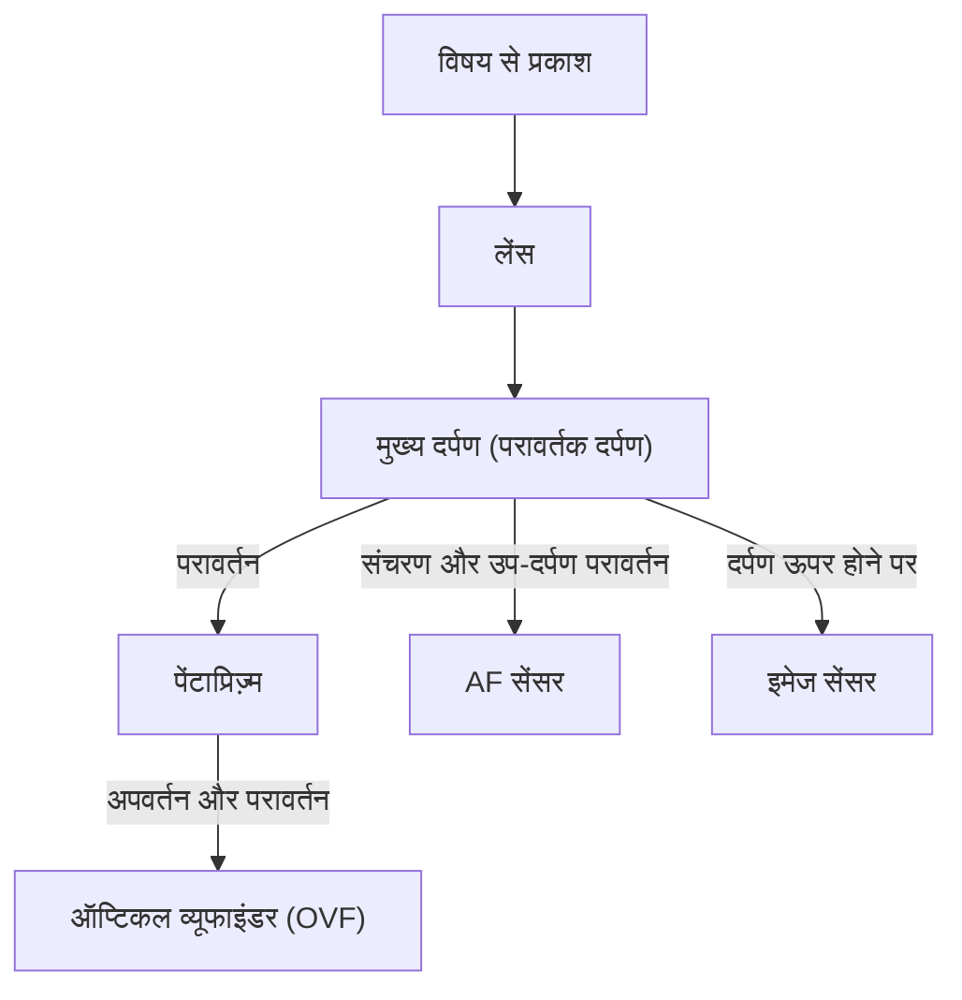
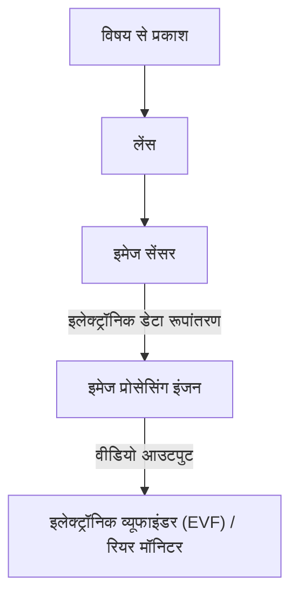

# डीएसएलआर और मिररलेस में अंतर: कैमरे की संरचना और प्रकाश को पकड़ने का तरीका

फोटोग्राफी का इतिहास प्रकाश को कैद करने की तकनीक का भी इतिहास है। लंबे समय से पेशेवरों से लेकर शौकिया फोटोग्राफरों द्वारा व्यापक रूप से पसंद किया जाने वाला "डीएसएलआर कैमरा (DSLR)", और हाल के वर्षों में तेजी से अपनी बाजार हिस्सेदारी का विस्तार करते हुए नया मानक बन चुका "मिररलेस कैमरा"। ये दोनों कैमरे विनिमेय लेंस (interchangeable lens) प्रणाली को साझा करते हुए भी, अपनी आंतरिक संरचना और प्रकाश को पकड़ने के तरीके में मौलिक अंतर रखते हैं।

इस लेख में, हम पेंटाप्रिज़्म का उपयोग करने वाले ऑप्टिकल व्यूफाइंडर (OVF) के तंत्र से लेकर इलेक्ट्रॉनिक व्यूफाइंडर (EVF) का समर्थन करने वाली नवीनतम इमेज प्रोसेसिंग तकनीक तक, इस तंत्र की भौतिक, तकनीकी और ऐतिहासिक दृष्टिकोण से गहराई से जांच करेंगे।

## 1. कैमरे की मूल संरचना और प्रकाश का मार्ग

कैमरे का सबसे बुनियादी कार्य "लेंस से होकर आने वाले प्रकाश को सेंसर (या फिल्म) तक ले जाना और रिकॉर्ड करना" है। इस प्रकाश के मार्ग (optical path) को कैसे नियंत्रित किया जाता है, यही डीएसएलआर और मिररलेस के बीच का सबसे बड़ा अंतर पैदा करता है।

### 1.1 डीएसएलआर कैमरा (DSLR) का तंत्र

डीएसएलआर (Digital Single-Lens Reflex) कैमरे की संरचना, जैसा कि नाम से ही स्पष्ट है, "एकल लेंस (Single-Lens)" और "परावर्तक दर्पण (Reflex)" का उपयोग करके बनाई गई है।

डीएसएलआर की सबसे बड़ी विशेषता कैमरे के अंदर स्थित "दर्पण" है। लेंस से प्रवेश करने वाला प्रकाश इस दर्पण द्वारा ऊपर की ओर परावर्तित होता है और पेंटाप्रिज़्म (या पेंटामिरर) नामक एक ऑप्टिकल घटक में प्रवेश करता है। पेंटाप्रिज़्म जटिल परावर्तनों को दोहराकर, उल्टी छवि को सीधी और सही छवि में सुधारता है, और इसे ऑप्टिकल व्यूफाइंडर (OVF) की ओर ले जाता है।

इस संरचना का लाभ यह है कि "आप नग्न आंखों से उसी प्रकाश को बिना किसी समय की देरी के देख सकते हैं जिसे लेंस ने पकड़ा है।" खेल या वन्यजीव जैसी फोटोग्राफी में, जहाँ एक पल का समय भी महत्वपूर्ण होता है, प्रकाश की गति से आने वाले विषय को सीधे देख पाना एक बड़ा फायदा था।

हालांकि, शटर दबाते समय, इस दर्पण को ऊपर उठाने (मिरर अप) की आवश्यकता होती है। इस क्रिया के कारण, व्यूफाइंडर की छवि क्षण भर के लिए गायब हो जाती है, जिसे "ब्लैकआउट" कहा जाता है, और साथ ही मिरर शॉक नामक सूक्ष्म कंपन उत्पन्न होता है।

### 1.2 मिररलेस कैमरे का तंत्र

दूसरी ओर, मिररलेस कैमरे की संरचना ऐसी है जिसमें डीएसएलआर से "मिरर बॉक्स" और "पेंटाप्रिज़्म" को हटा दिया गया है।

मिररलेस कैमरे में, लेंस से आने वाला प्रकाश हमेशा सीधे इमेज सेंसर पर पड़ता है। सेंसर प्राप्त प्रकाश को वास्तविक समय में विद्युत संकेतों में परिवर्तित करता है, और इमेज प्रोसेसिंग इंजन इसे वीडियो डेटा के रूप में प्रोसेस करता है। फिर, इस वीडियो को इलेक्ट्रॉनिक व्यूफाइंडर (EVF) या पीछे की एलसीडी मॉनिटर पर प्रदर्शित किया जाता है।

इस संरचना का सबसे बड़ा लाभ यह है कि "शूटिंग से पहले आप उस छवि की जांच कर सकते हैं जिसे वास्तव में कैप्चर किया जाएगा (जिसमें एक्सपोज़र और व्हाइट बैलेंस जैसी सेटिंग्स लागू होती हैं)।" इसके अलावा, मिरर बॉक्स के न होने से न केवल कैमरा बॉडी को छोटा और हल्का बनाया जा सकता है, बल्कि लेंस के पिछले हिस्से को सेंसर के करीब लाना (निकला हुआ किनारा/फ्लेंज बैक को छोटा करना) संभव हो जाता है, जिससे लेंस डिजाइन की स्वतंत्रता में काफी सुधार हुआ है।

## 2. ऑप्टिकल व्यूफाइंडर (OVF) बनाम इलेक्ट्रॉनिक व्यूफाइंडर (EVF)

कैमरे की संरचना में अंतर सीधे व्यूफाइंडर की प्रकृति में अंतर से जुड़ा है। OVF और EVF दोनों अलग-अलग दर्शन और प्रौद्योगिकियों पर आधारित हैं।

### 2.1 ऑप्टिकल व्यूफाइंडर (OVF) की भौतिक श्रेष्ठता

OVF एक शुद्ध ऑप्टिकल प्रणाली है जो प्रकाश के अपवर्तन और परावर्तन का उपयोग करती है। चूंकि इसमें कोई डिजिटल प्रोसेसिंग शामिल नहीं है, इसलिए प्रदर्शन में कोई देरी (टाइम लैग) भौतिक रूप से शून्य होती है। इसके अलावा, मानव आंख की गतिशील सीमा (डायनामिक रेंज) का पूरी तरह से उपयोग किया जा सकता है, जिससे अत्यधिक उज्ज्वल या अंधेरे स्थानों में भी विषय के विवरण को पहचानना आसान हो जाता है।

इसके अतिरिक्त, OVF बिजली की खपत नहीं करता है, इसलिए यह लंबी बैटरी लाइफ प्रदान कर सकता है। उन प्रकृति फोटोग्राफरों के लिए यह जीवन-मरण का प्रश्न हुआ करता था जो कठोर प्राकृतिक वातावरण में कई दिनों तक बिजली प्राप्त नहीं कर सकते थे।

### 2.2 इलेक्ट्रॉनिक व्यूफाइंडर (EVF) का तकनीकी नवाचार

EVF एक ऐसी प्रणाली है जहाँ आप एक ऐपिस (eyepiece) के माध्यम से एक छोटे, उच्च-रिज़ॉल्यूशन वाले डिस्प्ले (OLED या LCD) को देखते हैं। शुरुआती EVF का रिज़ॉल्यूशन कम था, उनमें ध्यान देने योग्य देरी थी, और अंधेरे में वे शोर (noise) से भरे होते थे, जिससे वे कई मायनों में OVF से कमतर थे।

हालांकि, प्रौद्योगिकी में प्रगति के साथ, EVF ने जबरदस्त छलांग लगाई है।
- **सिमुलेशन फ़ंक्शन**: एक्सपोज़र मुआवजा, व्हाइट बैलेंस, और पिक्चर स्टाइल जैसी सेटिंग्स का परिणाम वास्तविक समय में परिलक्षित होता है। इसने फोटोग्राफी की उस अनिश्चितता को काफी कम कर दिया है कि "जब तक आप तस्वीर नहीं लेते, आपको पता नहीं चलता कि यह कैसी दिखेगी।"
- **जानकारी का ओवरले**: हिस्टोग्राम, इलेक्ट्रॉनिक स्तर, फोकस पीकिंग, और ज़ेबरा पैटर्न जैसी विभिन्न प्रकार की जानकारी जो शूटिंग में सहायता करती है, व्यूफाइंडर के अंदर प्रदर्शित की जा सकती है।
- **कम रोशनी के प्रदर्शन में सुधार**: सेंसर के उच्च संवेदनशीलता प्रदर्शन और इमेज प्रोसेसिंग के कारण, अब उन जगहों को भी चमकीला करके प्रदर्शित करना संभव है जो नग्न आंखों को पूरी तरह से अंधेरे लगते हैं। एस्ट्रोफोटोग्राफी में रचना (composition) को एडजस्ट करने जैसे काम OVF के साथ असंभव थे।
- **ब्लैकआउट-मुक्त शूटिंग**: नवीनतम स्टैक्ड CMOS सेंसर से लैस फ्लैगशिप कैमरों में सेंसर से डेटा बहुत तेज़ी से पढ़ा जाता है, जिससे लगातार शूटिंग के दौरान भी व्यूफाइंडर छवि गायब नहीं होती है - इसे "ब्लैकआउट-मुक्त शूटिंग" कहते हैं। इसके कारण, EVF ने "विषय को ट्रैक करते रहने" की क्षमता में OVF को पार कर लिया है, जो पहले OVF का सबसे बड़ा लाभ था।

## 3. ऑटोफोकस (AF) प्रणाली का विकास

डीएसएलआर और मिररलेस के बीच के अंतर का फ़ोकसिंग तकनीक (ऑटोफोकस) के विकास पर भी बहुत बड़ा प्रभाव पड़ा है।

### 3.1 फेज़-डिटेक्शन AF (डीएसएलआर)

डीएसएलआर मुख्य रूप से "समर्पित फेज़-डिटेक्शन AF सेंसर" का उपयोग करते हैं। मुख्य दर्पण के पीछे स्थित उप-दर्पण प्रकाश के एक हिस्से को नीचे की ओर निर्देशित करता है, जहां रखे AF सेंसर द्वारा फोकस मापा जाता है। यह विधि बहुत तेज़ थी और चलते हुए विषयों को ट्रैक करने में उत्कृष्ट थी। हालांकि, AF सेंसर के लिए उपलब्ध सीमित स्थान के कारण, फोकस बिंदु (वे बिंदु जहाँ कैमरा फोकस कर सकता है) अक्सर स्क्रीन के केंद्र के आसपास केंद्रित होते थे। इसके अलावा, दर्पण और लेंस की यांत्रिक अशुद्धियों के कारण फोकस शिफ्ट (फ्रंट फोकस या बैक फोकस) होने की संभावना थी।

### 3.2 ऑन-सेंसर फेज़-डिटेक्शन AF और कंट्रास्ट AF (मिररलेस)

मिररलेस कैमरों में, इमेज सेंसर स्वयं AF सेंसर के रूप में कार्य करता है। शुरुआती मिररलेस कैमरे "कंट्रास्ट AF" का उपयोग करते थे, जो वीडियो के कंट्रास्ट से फोकस का शिखर ढूंढता था। यद्यपि इसकी सटीकता अधिक थी, लेकिन इसकी गति एक समस्या थी।

आजकल, "ऑन-सेंसर फेज़-डिटेक्शन AF" मुख्यधारा बन गया है, जो फेज़ डिटेक्शन के लिए इमेज सेंसर पर कुछ पिक्सेल का उपयोग करता है। यह तेज़ AF और उच्च सटीकता दोनों को जोड़ता है। इसके अतिरिक्त, चूँकि फोकस पूरे सेंसर पर मापा जा सकता है, इसलिए फोकस बिंदुओं को स्क्रीन के एक किनारे से दूसरे किनारे तक रखना संभव हो गया है। 
साथ ही, क्योंकि इसमें कोई यांत्रिक त्रुटि शामिल नहीं है, सिद्धांत रूप में कोई फोकस शिफ्ट नहीं होता है।

हाल के वर्षों में, AI (डीप लर्निंग) का उपयोग करने वाली विषय पहचान तकनीक को एकीकृत किया गया है, जिससे कैमरे मानव की आँखों, जानवरों, पक्षियों, कारों, हवाई जहाजों, और ट्रेनों को स्वचालित रूप से पहचानने और ट्रैक करने में सक्षम हो गए हैं। इस तरह की शूटिंग जो कभी केवल अनुभवी पेशेवरों के लिए ही संभव थी, अब हर किसी के लिए संभव होती जा रही है।

## 4. माउंट और फ्लेंज बैक का आर्थिक और तकनीकी प्रभाव

कैमरे की संरचना में बदलाव से लेंस माउंट में भी क्रांति आई। डीएसएलआर में मिरर बॉक्स होने के कारण फ्लेंज बैक (माउंट सतह से सेंसर तक की दूरी) को लंबा (लगभग 40 मिमी या अधिक) रखना अपरिहार्य था।

मिररलेस कैमरों में, इस फ्लेंज बैक को अत्यंत छोटा (लगभग 15 से 20 मिमी) किया जा सकता है। इससे निम्नलिखित लाभ उत्पन्न हुए हैं:

1. **वाइड-एंगल लेंस की उच्च छवि गुणवत्ता**: क्योंकि लेंस के पिछले हिस्से को सेंसर के करीब लाया जा सकता है, प्रकाश को ज़बरदस्ती मोड़ने की आवश्यकता नहीं होती, जिससे किनारों तक उच्च छवि गुणवत्ता वाले वाइड-एंगल लेंस डिजाइन करना आसान हो गया।
2. **बड़े अपर्चर और कॉम्पैक्टनेस के बीच के ट्रेड-ऑफ पर विजय**: बड़े माउंट व्यास को बनाए रखते हुए फ्लेंज बैक को छोटा करने से, व्यावहारिक आकार और वजन में उज्ज्वल अपर्चर लेंस (जैसे F1.2 या F1.0) का निर्माण संभव हो गया है, जिसकी पहले कल्पना भी नहीं की जा सकती थी।
3. **माउंट एडेप्टर का उपयोग**: छोटे फ्लेंज बैक के कारण, मोटाई को समायोजित करने वाले माउंट एडेप्टर का उपयोग करके भौतिक रूप से पुराने डीएसएलआर लेंस, विंटेज लेंस, और यहां तक कि अन्य कंपनियों के लेंस को भी जोड़ना संभव है। इससे उपयोगकर्ताओं को उनके मौजूदा लेंस एसेट का उपयोग करने का आर्थिक लाभ मिला है।

## 5. वीडियो शूटिंग और हाइब्रिड कैमरे की ओर मार्ग

मिररलेस कैमरों को अपनाने के पीछे वीडियो शूटिंग की बढ़ती मांग एक बड़ा कारण रही है। जब डीएसएलआर से वीडियो शूट किया जाता है, तो दर्पण ऊपर उठा हुआ होता है, जिससे OVF अनुपयोगी हो जाता है और उपयोगकर्ताओं को पीछे के मॉनिटर पर निर्भर रहना पड़ता है। इसके अलावा, समर्पित फेज़-डिटेक्शन AF सेंसर तक प्रकाश नहीं पहुंचने के कारण, वीडियो शूटिंग के दौरान AF प्रदर्शन में काफी गिरावट आती है (हालांकि कुछ निर्माताओं ने डुअल पिक्सेल CMOS AF के साथ इस समस्या को हल किया, लेकिन मौलिक संरचनात्मक सीमाएं बनी रहीं)।

मिररलेस कैमरे वीडियो और स्थिर छवियों (still images) दोनों के लिए सीधे सेंसर से डेटा प्रोसेस करते हैं, इसलिए उनके बीच सहज रूप से स्विच करना आसान होता है। वीडियो शूटिंग के दौरान उच्च प्रदर्शन वाला ऑन-सेंसर फेज़-डिटेक्शन AF काम करता है, और EVF से देखते हुए स्थिर मुद्रा में वीडियो शूट करना भी संभव है। आज, मिररलेस कैमरों ने खुद को "हाइब्रिड कैमरे" के रूप में स्थापित कर लिया है जो एक उच्च स्तर पर स्थिर छवियों और वीडियो दोनों को शानदार ढंग से संभालते हैं।

## निष्कर्ष: कैमरे का भविष्य

डीएसएलआर से मिररलेस में संक्रमण केवल व्यूफाइंडर के प्रकार में बदलाव नहीं है। इसका मतलब है कि कैमरा एक "शुद्ध ऑप्टिकल उपकरण" से एक "उन्नत डिजिटल सूचना प्रसंस्करण उपकरण" के रूप में मौलिक रूप से विकसित हुआ है।

पेंटाप्रिज़्म के माध्यम से देखी जाने वाली कच्ची रोशनी की चमक डीएसएलआर में पाई जाने वाली फोटोग्राफी की एक प्रारंभिक खुशी है। शटर की यांत्रिक ध्वनि और हाथ में महसूस होने वाले कंपन एक एहसास देते हैं कि आप वास्तव में एक तस्वीर ले रहे हैं।

दूसरी ओर, मिररलेस कैमरों द्वारा लाए गए डिजिटलीकरण की लहर ने फोटोग्राफिक अभिव्यक्ति की सीमाओं को काफी बढ़ा दिया है। ब्लैकआउट-मुक्त शूटिंग, अल्ट्रा-हाई-स्पीड निरंतर शूटिंग, AI-संचालित विषय पहचान, और इन-बॉडी इमेज स्टेबिलाइज़ेशन का विकास इसलिए संभव हुआ क्योंकि संरचनात्मक बाधाओं को दूर कर दिया गया था।

कैमरे के तंत्र को समझने का अर्थ यह जानना है कि प्रकाश को कैसे कैप्चर किया जाता है और वह एक तस्वीर में कैसे बदलता है। तकनीक चाहे कितनी भी विकसित क्यों न हो, अंततः यह फोटोग्राफर का इरादा ही है जो कैमरे को नियंत्रित करता है और प्रकाश को पकड़ता है।
