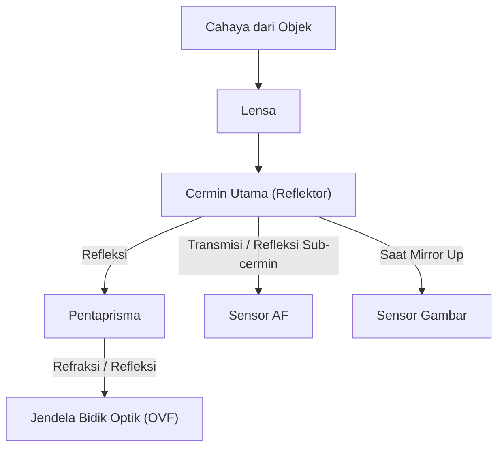
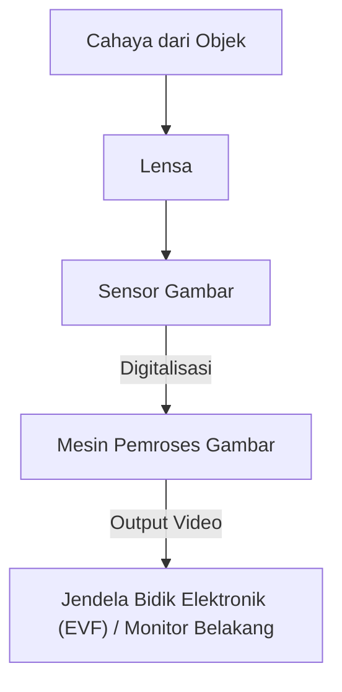

# Perbedaan DSLR dan Mirrorless: Mekanisme Kamera dan Cara Menangkap Cahaya

Sejarah fotografi adalah sejarah teknologi penangkapan cahaya. "Kamera DSLR (Digital Single-Lens Reflex)", yang telah lama dicintai oleh para profesional maupun amatir, dan "Kamera Mirrorless", yang dengan cepat memperluas pangsa pasarnya dalam beberapa tahun terakhir dan menjadi standar baru. Meskipun keduanya sama-sama memiliki sistem lensa yang dapat diganti, mereka memiliki perbedaan mendasar dalam struktur internal dan cara menangkap cahaya.

Artikel ini membahas secara mendalam mekanisme keduanya dari sudut pandang fisik, teknis, dan historis, mulai dari cara kerja jendela bidik optik (OVF) yang menggunakan pentaprisma hingga teknologi pemrosesan gambar terbaru yang mendukung jendela bidik elektronik (EVF).

## 1. Struktur Dasar Kamera dan Jalur Cahaya

Fungsi paling dasar dari sebuah kamera adalah "mengarahkan cahaya yang melewati lensa ke sensor (atau film) dan merekamnya". Bagaimana jalur cahaya ini dikendalikan adalah hal yang menciptakan perbedaan terbesar antara DSLR dan mirrorless.

### 1.1 Mekanisme Kamera DSLR

Kamera DSLR (Digital Single-Lens Reflex) secara harfiah memiliki struktur yang menggunakan "satu lensa (Single-Lens)" dan "cermin pantul (Reflex)".

Ciri khas terbesar dari DSLR adalah "cermin" yang ditempatkan di dalam kamera. Cahaya yang masuk melalui lensa dipantulkan ke atas oleh cermin ini dan masuk ke komponen optik yang disebut pentaprisma (atau pentamirror). Melalui serangkaian pantulan kompleks, pentaprisma mengubah bayangan yang terbalik secara vertikal dan horizontal menjadi bayangan tegak yang benar, lalu mengarahkannya ke jendela bidik optik (OVF).

Keuntungan dari struktur ini adalah "kemampuan untuk melihat cahaya sebenarnya yang ditangkap oleh lensa dengan mata telanjang tanpa jeda waktu". Dalam pemotretan seperti olahraga atau satwa liar, di mana pengaturan waktu yang tepat dalam sepersekian detik sangat penting, kemampuan untuk melihat subjek yang masuk pada kecepatan cahaya secara langsung merupakan keuntungan besar.

Namun, pada saat Anda menekan tombol rana, cermin ini harus dilipat ke atas (mirror up). Tindakan ini menyebabkan "blackout" dimana gambar di jendela bidik menghilang sejenak, dan pada saat yang sama menghasilkan getaran kecil yang disebut mirror shock.

### 1.2 Mekanisme Kamera Mirrorless

Di sisi lain, kamera mirrorless memiliki struktur yang menghilangkan "kotak cermin (mirror box)" dan "pentaprisma" dari DSLR.

Pada kamera mirrorless, cahaya yang masuk melalui lensa selalu langsung mengenai sensor gambar. Sensor mengubah cahaya yang diterima menjadi sinyal listrik secara real-time, dan mesin pemroses gambar memprosesnya sebagai data video. Video ini kemudian ditampilkan pada jendela bidik elektronik (EVF) atau monitor LCD belakang.

Keuntungan terbesar dari struktur ini adalah "kemampuan untuk mengkonfirmasi gambar yang sebenarnya akan direkam (mencerminkan pencahayaan dan keseimbangan putih) sebelum memotret". Selain itu, tanpa kotak cermin, bodi kamera tidak hanya dapat dibuat lebih kecil dan lebih ringan, tetapi juga memungkinkan elemen lensa belakang ditempatkan lebih dekat ke sensor (jarak flange back lebih pendek), sehingga secara dramatis meningkatkan fleksibilitas desain lensa.

## 2. Jendela Bidik Optik (OVF) vs Jendela Bidik Elektronik (EVF)

Perbedaan struktur kamera berkaitan langsung dengan perbedaan karakteristik jendela bidik. OVF dan EVF didukung oleh filosofi dan teknologi yang berbeda.

### 2.1 Keunggulan Fisik Jendela Bidik Optik (OVF)

OVF adalah sistem optik murni yang memanfaatkan pembiasan dan pemantulan cahaya. Karena tidak melibatkan pemrosesan digital, keterlambatan tampilan (lag) secara fisik adalah nol. Selain itu, OVF dapat memanfaatkan jangkauan dinamis (dynamic range) mata manusia secara langsung, sehingga memudahkan untuk mengenali detail subjek bahkan di lokasi yang sangat terang atau gelap.

Lebih lanjut, karena OVF tidak mengkonsumsi daya listrik, kamera dapat beroperasi dengan baterai untuk waktu yang lama. Bagi fotografer alam yang bekerja di lingkungan yang keras dan tidak memiliki akses listrik selama berhari-hari, hal ini sangatlah penting.

### 2.2 Inovasi Teknologi Jendela Bidik Elektronik (EVF)

EVF adalah sistem di mana Anda melihat layar resolusi tinggi kecil (OLED atau LCD) melalui lensa okuler. EVF generasi awal memiliki banyak kekurangan dibandingkan OVF, seperti resolusi yang rendah, jeda tampilan yang nyata, dan dipenuhi gangguan gambar (noise) di tempat gelap.

Namun, seiring dengan kemajuan teknologi, EVF telah membuat lompatan besar.
- **Fungsi Simulasi**: Hasil pengaturan seperti kompensasi pencahayaan, white balance, dan picture style tercermin secara real-time. Hal ini secara signifikan mengurangi ketidakpastian dalam fotografi, yaitu anggapan bahwa "Anda tidak akan tahu sampai Anda mengambil fotonya".
- **Overlay Informasi**: Berbagai informasi untuk membantu pemotretan, seperti histogram, tingkat presisi horizon (waterpas), focus peaking, dan pola zebra, dapat ditampilkan di dalam jendela bidik.
- **Peningkatan Kinerja di Tempat Gelap**: Melalui performa sensitivitas tinggi pada sensor dan pemrosesan gambar, EVF mampu menampilkan gambar dengan terang, meskipun berada di tempat yang tampak gelap gulita bagi mata telanjang. Saat menyusun komposisi astrofotografi, ini adalah kemampuan yang tidak mungkin dilakukan dengan OVF.
- **Pemotretan Tanpa Blackout**: Pada kamera flagship yang dilengkapi sensor CMOS bertumpuk (stacked CMOS) terbaru, dengan membaca data dari sensor pada kecepatan yang sangat tinggi, pengambilan gambar tanpa blackout (jendela bidik tidak padam) telah direalisasikan bahkan selama pemotretan beruntun (burst). Akibatnya, EVF kini mulai melampaui OVF dalam kemampuan "terus melacak subjek", yang sebelumnya merupakan keunggulan terbesar OVF.

## 3. Evolusi Sistem Fokus Otomatis (AF)

Perbedaan antara DSLR dan mirrorless juga berdampak besar pada evolusi teknologi pemfokusan (autofokus).

### 3.1 AF Deteksi Fase (Phase-Detection AF pada DSLR)

Kamera DSLR terutama menggunakan "sensor AF deteksi fase khusus". Sebagian cahaya diarahkan ke bawah menggunakan sub-cermin yang terletak di belakang cermin utama, lalu diukur fokusnya oleh sensor AF yang ditempatkan di sana. Metode ini sangat cepat dan sangat baik dalam melacak subjek yang bergerak. Namun, karena keterbatasan ruang untuk meletakkan sensor AF, titik fokus cenderung terkonsentrasi di dekat bagian tengah layar. Selain itu, kesalahan mekanis pada cermin atau lensa dapat menyebabkan pergeseran fokus (front focus atau back focus).

### 3.2 AF Deteksi Fase di Bidang Gambar (On-Sensor Phase-Detection) dan AF Kontras (Mirrorless)

Pada kamera mirrorless, sensor gambar itu sendiri juga berfungsi sebagai sensor AF. Kamera mirrorless generasi awal mengadopsi "AF kontras", yang mencari puncak fokus dari kontras video. Meskipun presisinya tinggi, metode ini memiliki kelemahan dalam hal kecepatan.

Saat ini, metode yang paling umum digunakan adalah "AF deteksi fase di bidang gambar (on-sensor phase-detection AF)", yang menggunakan sebagian piksel pada sensor gambar untuk pendeteksian fase. Hal ini memungkinkan kombinasi AF berkecepatan tinggi dengan presisi tinggi. Selain itu, karena fokus dapat diukur di seluruh permukaan sensor, titik AF dapat disebar dari ujung ke ujung layar.
Dan juga, karena tidak ada gangguan mekanis, secara prinsip pergeseran fokus tidak akan terjadi.

Dalam beberapa tahun terakhir, dengan menggabungkan teknologi pengenalan subjek berbasis AI (deep learning), kamera dapat secara otomatis mengenali dan melacak mata manusia, hewan, burung, mobil, pesawat terbang, kereta api, dll. Hal ini membuat gaya pemotretan yang dulunya hanya bisa dilakukan oleh profesional berpengalaman menjadi mungkin untuk dilakukan oleh siapa saja.

## 4. Dampak Ekonomi dan Teknis dari Dudukan Lensa (Mount) dan Flange Back

Perubahan struktur kamera juga membawa revolusi pada dudukan lensa (lens mount). Jarak flange back (jarak dari permukaan dudukan lensa ke sensor) pada DSLR harus panjang (sekitar 40mm atau lebih) karena keberadaan kotak cermin.

Pada kamera mirrorless, flange back ini dapat dipersingkat secara maksimal (menjadi sekitar 15 hingga 20mm). Hal ini telah melahirkan keuntungan berikut:

1. **Peningkatan Kualitas Gambar pada Lensa Sudut Lebar**: Karena elemen lensa belakang dapat didekatkan ke sensor, cahaya tidak perlu dibelokkan secara berlebihan, sehingga memudahkan desain lensa sudut lebar beresolusi tinggi hingga ke area tepi.
2. **Mengatasi Trade-off Antara Bukaan Besar dan Ukuran Ringkas**: Dengan memperbesar diameter mount sambil memendekkan flange back, lensa yang sangat terang (seperti F1.2 atau F1.0), yang dulu tak terbayangkan, kini dapat direalisasikan dengan ukuran dan berat yang praktis.
3. **Pemanfaatan Adaptor Dudukan (Mount Adapter)**: Karena flange back-nya pendek, menggunakan adaptor mount yang dapat menyesuaikan ketebalan secara fisik memungkinkan penggunaan lensa DSLR lama, lensa klasik (old lens), atau bahkan lensa buatan merek lain. Ini memberikan keuntungan ekonomi bagi pengguna, karena mereka dapat memanfaatkan koleksi lensa yang sudah ada.

## 5. Perekaman Video dan Jalan Menuju Kamera Hybrid

Dorongan kuat di balik popularitas kamera mirrorless adalah meningkatnya kebutuhan untuk perekaman video. Saat merekam video dengan DSLR, cermin harus dibiarkan terbuka sehingga OVF tidak dapat digunakan, dan pengambilan gambar harus dilakukan sambil melihat monitor belakang. Selain itu, karena cahaya tidak lagi mencapai sensor AF deteksi fase khusus, kinerja AF menurun drastis saat merekam video (beberapa produsen menyelesaikan masalah ini dengan Dual Pixel CMOS AF, namun kendala struktural dasar tetap ada).

Kamera mirrorless memproses gambar diam (foto) maupun video menggunakan pemrosesan data yang sama dari sensor, sehingga memungkinkan transisi yang mulus. AF deteksi fase on-sensor berkinerja tinggi juga berfungsi saat merekam video, dan memungkinkan merekam video dengan postur stabil sambil melihat ke EVF. Saat ini, kamera mirrorless telah mengukuhkan posisinya sebagai "kamera hybrid" yang unggul dalam hal fotografi dan videografi pada tingkat tinggi.

## Kesimpulan: Masa Depan Kamera Fotografi

Transisi dari DSLR ke mirrorless bukan sekadar perubahan metode jendela bidik. Hal ini menandakan evolusi mendasar kamera dari "peralatan optik murni" menjadi "perangkat pemrosesan informasi digital tingkat lanjut".

Keindahan cahaya mentah yang bersinar saat dilihat melalui pentaprisma adalah kenikmatan dasar fotografi yang hanya dapat dirasakan melalui DSLR. Suara mekanis rana dan getaran yang merambat ke tangan memberikan sensasi nyata bahwa Anda sedang mengambil sebuah foto.

Di sisi lain, gelombang elektronisasi yang dibawa oleh kamera mirrorless telah sangat memperluas batas ekspresi fotografi. Pemotretan tanpa blackout, pemotretan burst berkecepatan ultra tinggi, pengenalan subjek melalui AI, dan evolusi mekanisme stabilisasi gambar, semuanya terealisasi tepat karena telah terlepas dari batasan struktural.

Memahami mekanisme kamera berarti mengetahui bagaimana cahaya ditangkap untuk menjadi sebuah foto. Seberapa jauh pun teknologi berkembang, pada akhirnya niat sang fotograferlah yang mengendalikan kamera dan menangkap cahaya.
