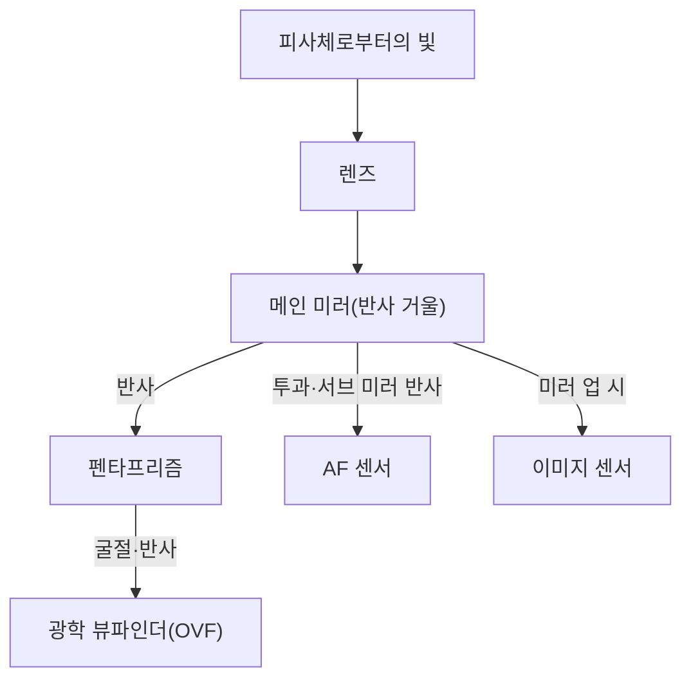
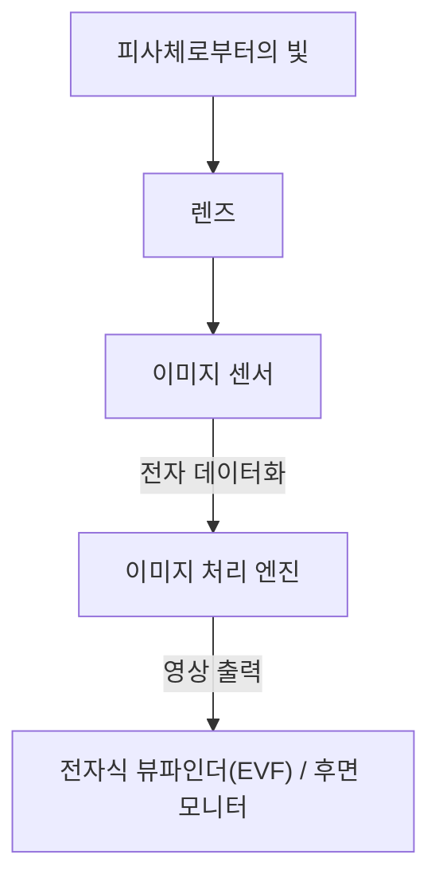

# DSLR과 미러리스의 차이: 카메라의 구조와 빛을 포착하는 방법

사진의 역사는 빛을 포착하는 기술의 역사이기도 합니다. 오랫동안 전문가부터 아마추어까지 널리 사랑받아 온 '일안 반사식 카메라(DSLR)'와 최근 빠르게 점유율을 확대하며 새로운 표준으로 자리 잡은 '미러리스 카메라'. 이 두 카메라는 모두 렌즈 교환식이라는 공통점을 가지면서도, 내부 구조와 빛을 포착하는 방식에서 근본적인 차이를 가지고 있습니다.

본 기사에서는 펜타프리즘을 사용한 광학식 뷰파인더(OVF)의 원리부터 전자식 뷰파인더(EVF)를 뒷받침하는 최신 이미지 처리 기술까지, 그 메커니즘을 물리적, 기술적, 그리고 역사적인 관점에서 깊이 파헤쳐 봅니다.

## 1. 카메라의 기본 구조와 빛의 경로

카메라의 가장 기본적인 기능은 '렌즈를 통과한 빛을 센서(또는 필름)로 안내하여 기록하는' 것입니다. 이 빛의 경로(광로)를 어떻게 제어하느냐가 DSLR과 미러리스의 가장 큰 차이를 만들어 냅니다.

### 1.1 일안 반사식 카메라(DSLR)의 메커니즘

일안 반사식 카메라(Digital Single-Lens Reflex)는 말 그대로 '하나의 렌즈(Single-Lens)'와 '반사 거울(Reflex)'을 사용한 구조를 가지고 있습니다.

DSLR의 가장 큰 특징은 카메라 내부에 배치된 '미러'입니다. 렌즈로 들어온 빛은 이 미러에 의해 위로 반사되어 펜타프리즘(또는 펜타미러)이라는 광학 부품으로 들어갑니다. 펜타프리즘은 복잡한 반사를 반복함으로써 상하좌우가 반전된 상을 정립 정상으로 바로잡아 광학 뷰파인더(OVF)로 안내합니다.

이 구조의 장점은 '렌즈가 포착한 빛 자체를 타임래그 없이 육안으로 볼 수 있다'는 점에 있습니다. 스포츠나 야생 동물 등 찰나의 타이밍이 생명인 촬영에서 빛의 속도로 도달하는 피사체의 모습을 직접 확인할 수 있다는 것은 큰 이점이었습니다.

하지만 셔터를 누르는 순간에는 이 미러를 위로 젖혀야(미러 업) 합니다. 이 동작으로 인해 뷰파인더의 상이 순식간에 사라지는 '블랙아웃'이 발생하고, 동시에 미러 쇼크라고 불리는 미세한 진동이 생깁니다.

### 1.2 미러리스 카메라의 메커니즘

반면, 미러리스 카메라는 DSLR에서 '미러 박스'와 '펜타프리즘'을 제거한 구조를 가지고 있습니다.

미러리스 카메라에서는 렌즈로 들어온 빛이 항상 이미지 센서에 직접 닿고 있습니다. 센서는 받은 빛을 실시간으로 전기 신호로 변환하고, 이미지 처리 엔진이 이를 영상 데이터로 처리합니다. 그리고 그 영상을 전자식 뷰파인더(EVF)나 후면 LCD 모니터에 표시합니다.

이 구조의 가장 큰 장점은 '실제로 촬영되는 이미지(노출이나 화이트 밸런스가 반영된 상태)를 촬영 전에 확인할 수 있다'는 것입니다. 또한, 미러 박스가 없기 때문에 카메라 바디를 소형·경량화할 수 있을 뿐만 아니라, 렌즈의 뒷면을 센서에 가깝게(플랜지 백을 짧게) 할 수 있어 렌즈 설계의 자유도가 비약적으로 향상되었습니다.

## 2. 광학 뷰파인더(OVF) vs 전자식 뷰파인더(EVF)

카메라 구조의 차이는 뷰파인더 특성의 차이로 직결됩니다. OVF와 EVF는 각각 다른 철학과 기술을 바탕으로 하고 있습니다.

### 2.1 광학 뷰파인더(OVF)의 물리적 우위성

OVF는 빛의 굴절과 반사를 이용한 순수한 광학계입니다. 디지털 처리를 거치지 않기 때문에 표시 지연(타임래그)이 물리적으로 제로입니다. 또한, 인간 눈의 다이내믹 레인지를 그대로 활용할 수 있어 극단적으로 밝거나 어두운 곳에서도 피사체의 디테일을 인식하기 쉽다는 특징이 있습니다.

게다가 OVF는 전력을 소비하지 않아 장시간 배터리 구동이 가능합니다. 가혹한 자연환경 속에서 며칠 동안 전원을 확보할 수 없는 자연 사진가들에게 이는 사활이 걸린 문제였습니다.

### 2.2 전자식 뷰파인더(EVF)의 기술적 혁신

EVF는 작고 고화질인 디스플레이(OLED나 LCD)를 접안렌즈 너머로 보는 방식입니다. 초기 EVF는 해상도가 낮고, 표시 지연이 눈에 띄며, 어두운 곳에서는 노이즈 투성이가 되는 등 OVF에 뒤처지는 점이 많았습니다.

하지만 기술의 발전으로 EVF는 비약적인 진보를 이루었습니다.
- **시뮬레이션 기능**: 노출 보정, 화이트 밸런스, 픽처 스타일 등의 설정 결과가 실시간으로 반영됩니다. '찍어보지 않으면 모른다'는 사진의 불확실성을 크게 줄였습니다.
- **정보의 오버레이**: 히스토그램, 수평계, 포커스 피킹, 지브라 패턴 등 촬영을 보조하는 다양한 정보를 뷰파인더 내에 표시할 수 있습니다.
- **암소 성능 향상**: 센서의 고감도 성능과 이미지 처리를 통해 육안으로는 새카만 곳에서도 밝게 증감하여 표시할 수 있습니다. 별 사진의 구도를 맞출 때 등 OVF에서는 불가능한 묘기입니다.
- **블랙아웃 프리 촬영**: 최신 적층형 CMOS 센서를 탑재한 플래그십 기종에서는 센서에서 데이터 읽어오기를 극도로 빠르게 수행함으로써 연사 시에도 뷰파인더 상이 사라지지 않는 '블랙아웃 프리 촬영'을 구현했습니다. 이로 인해 OVF의 가장 큰 장점이었던 '피사체를 계속 쫓아가는' 능력에서 EVF가 OVF를 능가하게 되었습니다.

## 3. 오토포커스(AF) 시스템의 진화

DSLR과 미러리스의 차이는 초점을 맞추는 기술(오토포커스)의 진화에도 큰 영향을 미쳤습니다.

### 3.1 위상차 AF (DSLR)

DSLR은 주로 '전용 위상차 AF 센서'를 사용합니다. 메인 미러 안쪽에 있는 서브 미러를 사용해 빛의 일부를 아래로 이끌고, 그곳에 배치된 AF 센서로 초점을 측정합니다. 이 방식은 매우 빠르며, 움직이는 피사체에 대한 추적 성능이 뛰어났습니다. 하지만 AF 센서의 배치 공간 제약 때문에 측거점(초점을 맞출 수 있는 포인트)이 화면 중앙 부근에 집중되는 경향이 있었습니다. 또한 미러나 렌즈의 기계적인 오차가 초점 어긋남(전핀, 후핀)을 유발할 가능성이 있었습니다.

### 3.2 상면 위상차 AF와 콘트라스트 AF (미러리스)

미러리스 카메라에서는 이미지 센서 자체가 AF 센서의 역할을 겸합니다. 초기의 미러리스는 영상의 대비(콘트라스트)에서 초점이 맞는 곳을 찾는 '콘트라스트 AF'를 채택하여, 정확도는 높지만 속도에 아쉬움이 있었습니다.

현재는 이미지 센서 위 화소의 일부를 위상차 검출용으로 사용하는 '상면 위상차 AF'가 주류를 이루고 있습니다. 이를 통해 고속 연사 시에도 빠르고 정확하게 초점을 맞출 수 있게 되었습니다. 나아가 센서 전체 영역에서 초점을 측정할 수 있어 화면의 끝에서 끝까지 측거점을 배치할 수 있습니다.
또한 기계적인 오차가 개입되지 않기 때문에 원리적으로 초점 어긋남이 발생하지 않습니다.

최근에는 AI(딥러닝)를 활용한 피사체 인식 기술이 결합되어 인물의 눈동자, 동물, 새, 자동차, 비행기, 기차 등을 카메라가 자동으로 인식하고 계속 추적하는, 과거에는 숙련된 전문가가 아니면 불가능했던 촬영이 누구에게나 가능해지고 있습니다.

## 4. 마운트와 플랜지 백의 경제적·기술적 영향

카메라 구조의 변화는 렌즈 마운트에도 혁명을 가져왔습니다. 플랜지 백(마운트 면에서 센서까지의 거리)은 DSLR에서는 미러 박스가 존재하기 때문에 어쩔 수 없이 길게(약 40mm 이상) 될 수밖에 없었습니다.

미러리스 카메라에서는 이 플랜지 백을 극한까지 짧게(약 15~20mm) 할 수 있습니다. 이로 인해 다음과 같은 장점이 생겼습니다.

1. **광각 렌즈의 고화질화**: 렌즈의 뒷면을 센서에 가깝게 할 수 있어 빛을 무리하게 꺾을 필요가 없어졌고, 주변부까지 고화질인 광각 렌즈의 설계가 쉬워졌습니다.
2. **대구경화와 소형화 사이의 트레이드오프 극복**: 마운트 구경을 키우면서 플랜지 백을 짧게 함으로써, 과거에는 생각할 수 없었던 F값이 밝은 렌즈(F1.2나 F1.0 등)를 실용적인 크기와 무게로 구현할 수 있게 되었습니다.
3. **마운트 어댑터의 활용**: 플랜지 백이 짧기 때문에 두께를 조절하는 마운트 어댑터를 사용하면 과거의 DSLR용 렌즈나 올드 렌즈, 심지어 타사의 렌즈까지 물리적으로 장착할 수 있습니다. 이는 사용자에게 기존의 렌즈 자산을 활용할 수 있다는 경제적인 이점을 가져다주었습니다.

## 5. 동영상 촬영과 하이브리드 카메라로의 길

미러리스 카메라의 보급을 강력하게 뒷받침한 것은 동영상 촬영에 대한 니즈 증가입니다. DSLR로 동영상을 찍을 경우, 미러를 계속 올려두어야 하므로 OVF를 사용할 수 없고 후면 모니터를 보며 촬영하게 됩니다. 또한, 전용 위상차 AF 센서에 빛이 닿지 않게 되어 동영상 촬영 시 AF 성능이 현저히 떨어진다는 문제가 있었습니다 (일부 제조사는 듀얼 픽셀 CMOS AF 등으로 이 문제를 해결했지만, 근본적인 구조상의 제약은 남았습니다).

미러리스 카메라는 정지 화상도 동영상도 똑같이 센서로부터의 데이터 처리로 수행하기 때문에 매끄럽게 전환할 수 있습니다. 동영상 촬영 시에도 고성능인 상면 위상차 AF가 기능하며, EVF를 들여다보면서 안정된 자세로 동영상을 찍는 것도 가능합니다. 현재 미러리스 카메라는 정지 화상과 동영상을 높은 수준으로 양립시킨 '하이브리드 카메라'로서의 지위를 확립하고 있습니다.

## 요약: 사진기의 미래

DSLR에서 미러리스로의 전환은 단순한 뷰파인더 방식의 변경이 아닙니다. 이는 카메라가 '순수한 광학 기기'에서 '고도의 디지털 정보 처리 디바이스'로 근본적으로 진화했음을 의미합니다.

펜타프리즘을 통해 보는, 빛나는 날것 그대로의 빛의 아름다움은 DSLR에서만 맛볼 수 있는 원초적인 사진의 기쁨입니다. 셔터의 기계적인 울림과 손에 전해지는 진동은 사진을 찍고 있다는 실감을 줍니다.

한편으로, 미러리스 카메라가 가져온 전자화의 물결은 사진 표현의 한계를 크게 넓혔습니다. 블랙아웃 프리, 초고속 연사, AI에 의한 피사체 인식, 손떨림 보정 기구의 진화 등은 구조상의 제약에서 풀려났기 때문에 비로소 실현된 것들입니다.

카메라의 메커니즘을 이해하는 것은 빛이 어떻게 잘려나가 한 장의 사진이 되는지 아는 것입니다. 기술이 어떻게 진화하든 최종적으로 카메라를 조작하고 빛을 포착하는 것은 촬영자의 의지일 수밖에 없습니다.
