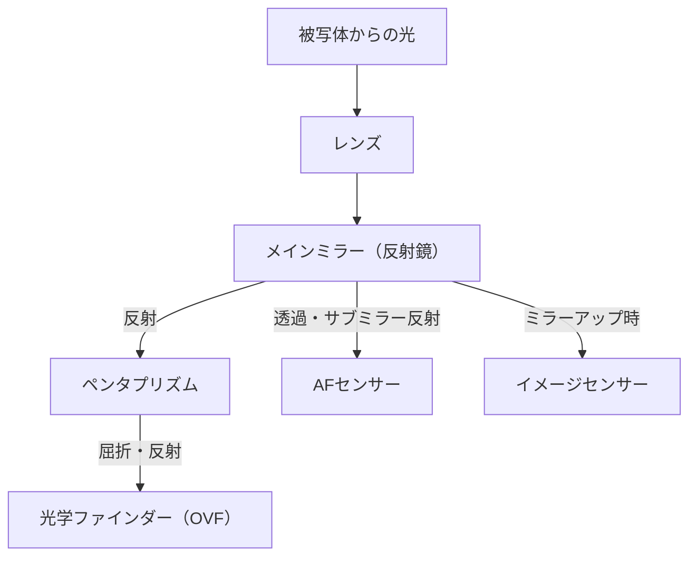
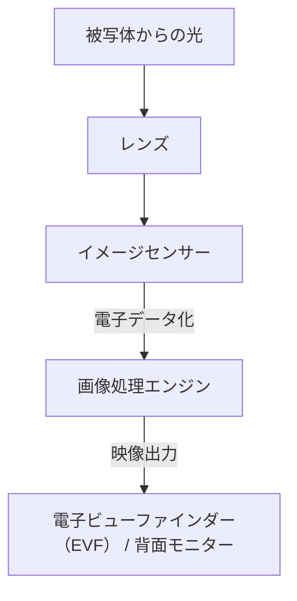

# 一眼レフとミラーレスの違い：カメラの構造と光の捉え方

写真の歴史は光を捉える技術の歴史でもあります。長らくプロフェッショナルからアマチュアまで広く愛されてきた「一眼レフカメラ（DSLR）」と、近年急速にシェアを拡大し、新たなスタンダードとなった「ミラーレスカメラ」。この2つのカメラは、どちらもレンズ交換式という共通点を持ちながら、内部の構造と光の捉え方において根本的な違いを持っています。

本記事では、ペンタプリズムを用いた光学式ファインダー（OVF）の仕組みから、電子ビューファインダー（EVF）を支える最新の画像処理技術まで、そのメカニズムを物理的、技術的、そして歴史的な観点から深く掘り下げます。

## 1. カメラの基本構造と光の経路

カメラの最も基本的な機能は、「レンズを通ってきた光をセンサー（またはフィルム）に導き、記録する」ことです。この光の経路（光路）をどのようにコントロールするかが、一眼レフとミラーレスの最大の違いを生み出しています。

### 1.1 一眼レフカメラ（DSLR）のメカニズム

一眼レフカメラ（Digital Single-Lens Reflex）は、文字通り「一つのレンズ（Single-Lens）」と「反射鏡（Reflex）」を用いた構造を持っています。

一眼レフの最大の特徴は、カメラ内部に配置された「ミラー」です。レンズから入ってきた光は、このミラーによって上方に反射され、ペンタプリズム（またはペンタミラー）と呼ばれる光学部品に入ります。ペンタプリズムは複雑な反射を繰り返すことで、上下左右が反転した像を正立正像に直し、光学ファインダー（OVF）へと導きます。

この構造の利点は、「レンズが捉えた光そのものを、タイムラグなしで肉眼で見ることができる」点にあります。スポーツや野生動物など、一瞬のタイミングが命となる撮影において、光速で届く被写体の姿を直接確認できることは大きなアドバンテージでした。

しかし、シャッターを切る瞬間には、このミラーを跳ね上げる（ミラーアップ）必要があります。この動作により、ファインダー像が一瞬消失する「ブラックアウト」が発生し、同時にミラーショックと呼ばれる微小な振動が生じます。

### 1.2 ミラーレスカメラのメカニズム

一方、ミラーレスカメラは、一眼レフから「ミラーボックス」と「ペンタプリズム」を排除した構造を持っています。

ミラーレスカメラでは、レンズから入ってきた光は常に直接イメージセンサーに当たっています。センサーは受け取った光をリアルタイムで電気信号に変換し、画像処理エンジンがそれを映像データとして処理します。そして、その映像を電子ビューファインダー（EVF）や背面液晶モニターに表示します。

この構造の最大の利点は、「実際に撮影される画像（露出やホワイトバランスが反映された状態）を、撮影前に確認できる」ことです。また、ミラーボックスがないため、カメラボディを小型・軽量化できるだけでなく、レンズの後玉をセンサーに近づける（フランジバックを短くする）ことが可能になり、レンズ設計の自由度が飛躍的に向上しました。

## 2. 光学ファインダー（OVF） vs 電子ビューファインダー（EVF）

カメラの構造の違いは、ファインダーの性質の違いに直結します。OVFとEVFは、それぞれ異なる哲学と技術に裏打ちされています。

### 2.1 光学ファインダー（OVF）の物理的優位性

OVFは、光の屈折と反射を利用した純粋な光学系です。デジタル処理を介さないため、表示の遅延（タイムラグ）は物理的にゼロです。また、人間の目のダイナミックレンジをそのまま活かせるため、極端に明るい場所や暗い場所でも被写体のディテールを認識しやすいという特徴があります。

さらに、OVFは電力を消費しないため、長時間のバッテリー駆動が可能です。過酷な自然環境下で何日も電源を確保できないネイチャーフォトグラファーにとって、これは死活問題でした。

### 2.2 電子ビューファインダー（EVF）の技術的革新

EVFは、小さな高精細ディスプレイ（有機ELや液晶）を接眼レンズ越しに見る仕組みです。初期のEVFは解像度が低く、表示の遅延が目立ち、暗所ではノイズだらけになるなど、OVFに劣る点が多くありました。

しかし、技術の進化によりEVFは飛躍的な進歩を遂げました。
- **シミュレーション機能**: 露出補正、ホワイトバランス、ピクチャースタイルなどの設定結果がリアルタイムで反映されます。「撮ってみないとわからない」という写真の不確実性を大幅に減らしました。
- **情報のオーバーレイ**: ヒストグラム、水準器、フォーカスピーキング、ゼブラパターンなど、撮影を補助する多彩な情報をファインダー内に表示できます。
- **暗所性能の向上**: センサーの高感度性能と画像処理により、肉眼では真っ暗な場所でも明るく増感して表示することが可能です。星景写真の構図合わせなどにおいて、OVFでは不可能な芸当です。
- **ブラックアウトフリー撮影**: 最新の積層型CMOSセンサーを搭載したフラッグシップ機では、センサーからのデータ読み出しを極めて高速に行うことで、連写時でもファインダー像が消失しない「ブラックアウトフリー撮影」を実現しています。これにより、OVFの最大の利点であった「被写体を追い続ける」能力において、EVFがOVFを凌駕するようになりました。

## 3. オートフォーカス（AF）システムの進化

一眼レフとミラーレスの違いは、ピントを合わせる技術（オートフォーカス）の進化にも大きな影響を与えました。

### 3.1 位相差AF（一眼レフ）

一眼レフは主に「専用位相差AFセンサー」を使用します。メインミラーの奥にあるサブミラーを使って光の一部を下方に導き、そこに配置されたAFセンサーでピントを測ります。この方式は非常に高速で、動く被写体への追従性に優れていました。しかし、AFセンサーの配置スペースの制約から、測距点（ピントを合わせられるポイント）が画面の中央付近に集中しがちでした。また、ミラーやレンズの機械的な誤差がピントのズレ（前ピン・後ピン）を引き起こす可能性がありました。

### 3.2 像面位相差AFとコントラストAF（ミラーレス）

ミラーレスカメラでは、イメージセンサー自体がAFセンサーの役割を兼ねます。初期のミラーレスはピントの山を映像のコントラストから探す「コントラストAF」を採用しており、精度は高いものの速度に難がありました。

現在では、イメージセンサー上の画素の一部を位相差検出用に使用する「像面位相差AF」が主流となっています。これにより、高速なAFと高い精度を両立させました。さらに、センサー全面でピントを測れるため、画面の端から端まで測距点を配置することが可能です。
また、機械的な誤差が介在しないため、原理的にピントズレが発生しません。

近年では、AI（ディープラーニング）を活用した被写体認識技術が組み合わされ、人物の瞳、動物、鳥、車、飛行機、列車などをカメラが自動的に認識し、追尾し続けるという、かつては熟練のプロフェッショナルでなければ不可能だった撮影が誰にでも可能になりつつあります。

## 4. マウントとフランジバックの経済的・技術的影響

カメラの構造変化は、レンズマウントにも革命をもたらしました。フランジバック（マウント面からセンサーまでの距離）は、一眼レフではミラーボックスが存在するため、どうしても長く（約40mm以上）ならざるを得ませんでした。

ミラーレスカメラでは、このフランジバックを極限まで短く（約15〜20mm）することができます。これにより、以下のようなメリットが生まれました。

1. **広角レンズの高画質化**: レンズの後玉をセンサーに近づけられるため、光を無理に曲げる必要がなくなり、周辺部まで高画質な広角レンズの設計が容易になりました。
2. **大口径化と小型化のトレードオフの克服**: マウント口径を大きくしつつフランジバックを短くすることで、かつては考えられなかったようなF値の明るいレンズ（F1.2やF1.0など）が、実用的なサイズと重さで実現できるようになりました。
3. **マウントアダプターの活用**: フランジバックが短いため、厚みを調整するマウントアダプターを使用すれば、過去の一眼レフ用レンズやオールドレンズ、さらには他社製のレンズまで物理的に装着することが可能です。これは、ユーザーにとって既存のレンズ資産を活かせるという経済的なメリットをもたらしました。

## 5. 動画撮影とハイブリッドカメラへの道

ミラーレスカメラの普及を強力に後押ししたのは、動画撮影ニーズの高まりです。一眼レフで動画を撮る場合、ミラーを上げっぱなしにするためOVFが使えず、背面モニターを見ながらの撮影になります。また、専用の位相差AFセンサーに光が届かなくなるため、動画撮影時のAF性能が著しく低下するという課題がありました（一部のメーカーはデュアルピクセルCMOS AFなどでこの課題を解決しましたが、根本的な構造上の制約は残りました）。

ミラーレスカメラは、静止画も動画も同じようにセンサーからのデータ処理で行うため、シームレスに移行できます。動画撮影時でも高性能な像面位相差AFが機能し、EVFを覗きながら安定した姿勢で動画を撮ることも可能です。現在では、ミラーレスカメラは静止画と動画を高レベルで両立させた「ハイブリッドカメラ」としての地位を確立しています。

## まとめ：写真機の未来

一眼レフからミラーレスへの移行は、単なるファインダーの方式の変更ではありません。それは、カメラが「純粋な光学機器」から「高度なデジタル情報処理デバイス」へと根本的に進化したことを意味しています。

ペンタプリズムを通して見る、光り輝く生の光の美しさは、一眼レフでしか味わえない原初的な写真の喜びです。シャッターの機械的な響きと手に伝わる振動は、写真を撮っているという実感を与えてくれます。

一方で、ミラーレスカメラがもたらした電子化の波は、写真表現の限界を大きく押し広げました。ブラックアウトフリー、超高速連写、AIによる被写体認識、手ブレ補正機構の進化などは、構造上の制約から解き放たれたからこそ実現したものです。

カメラのメカニズムを理解することは、光がどのように切り取られ、一枚の写真となるのかを知ることです。技術がどのように進化しようとも、最終的にカメラを操り、光を捉えるのは撮影者の意思に他なりません。
