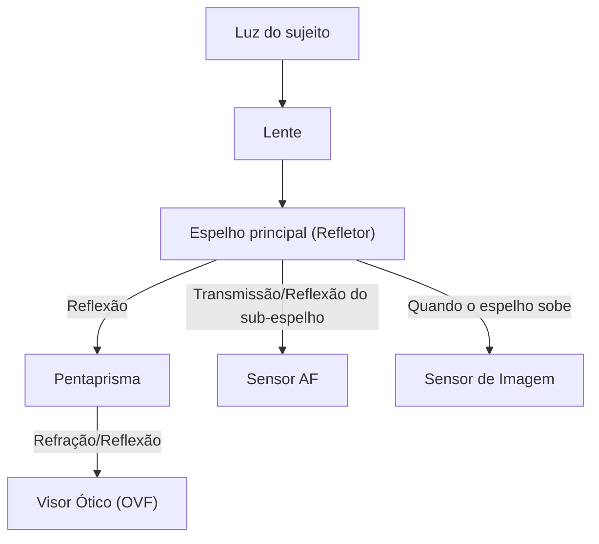
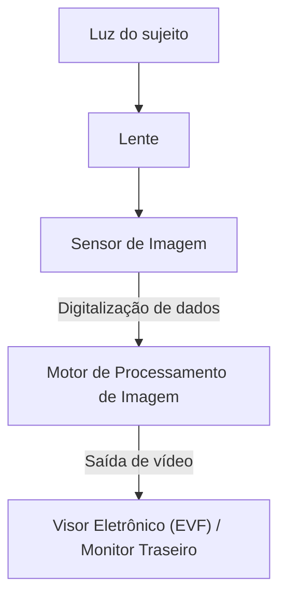

# A Diferença entre DSLR e Mirrorless: Estrutura da Câmera e Captura de Luz

A história da fotografia é também a história da tecnologia de captura de luz. A câmera reflex de lente única ("DSLR"), amada por muito tempo por profissionais e amadores, e a "câmera mirrorless", que expandiu rapidamente sua participação no mercado nos últimos anos e se tornou o novo padrão. Embora ambas compartilhem a característica de ter lentes intercambiáveis, elas têm diferenças fundamentais em sua estrutura interna e na forma como capturam a luz.

Neste artigo, vamos explorar profundamente o mecanismo a partir de perspectivas físicas, tecnológicas e históricas, desde a estrutura do visor ótico (OVF) usando um pentaprisma até a mais recente tecnologia de processamento de imagem que suporta o visor eletrônico (EVF).

## 1. Estrutura Básica da Câmera e Caminho da Luz

A função mais básica de uma câmera é "guiar a luz que passa pela lente até o sensor (ou filme) e registrá-la". A forma como esse caminho da luz é controlado cria a maior diferença entre as câmeras DSLR e as mirrorless.

### 1.1 Mecanismo da Câmera DSLR

A câmera DSLR (Digital Single-Lens Reflex) possui literalmente uma estrutura que usa "uma única lente (Single-Lens)" e um "espelho refletor (Reflex)".

A maior característica da DSLR é o "espelho" localizado dentro da câmera. A luz que entra pela lente é refletida para cima por este espelho e entra em um componente ótico chamado pentaprisma (ou penta-espelho). O pentaprisma repete reflexões complexas para corrigir a imagem, que está invertida de cima para baixo e da esquerda para a direita, em uma imagem correta (direita) e a guia para o visor ótico (OVF).

A vantagem dessa estrutura está no fato de que "você pode ver a própria luz capturada pela lente com seus próprios olhos, sem qualquer atraso". Na fotografia de esportes ou de vida selvagem, onde o momento é fundamental, ser capaz de ver diretamente o sujeito que chega à velocidade da luz era uma grande vantagem.

No entanto, no momento em que o obturador é acionado, esse espelho precisa ser levantado (mirror up). Essa ação causa um "blackout", onde a imagem do visor desaparece por um instante, e ao mesmo tempo produz uma vibração minúscula chamada de "choque do espelho".

### 1.2 Mecanismo da Câmera Mirrorless

Por outro lado, as câmeras mirrorless têm uma estrutura que elimina a "caixa do espelho" e o "pentaprisma" da DSLR.

Em uma câmera mirrorless, a luz que entra pela lente está sempre atingindo diretamente o sensor de imagem. O sensor converte a luz recebida em sinais elétricos em tempo real, e o motor de processamento de imagem os processa como dados de vídeo. E exibe esse vídeo no visor eletrônico (EVF) ou no monitor LCD traseiro.

A maior vantagem dessa estrutura é que "a imagem que será efetivamente capturada (com exposição e balanço de branco aplicados) pode ser confirmada antes da filmagem". Além disso, por não ter a caixa do espelho, não apenas o corpo da câmera pode ser menor e mais leve, mas também a parte traseira da lente pode ser aproximada do sensor (encurtando a distância focal da flange - flange back), o que melhora drasticamente a flexibilidade no design das lentes.

## 2. Visor Ótico (OVF) vs Visor Eletrônico (EVF)

As diferenças na estrutura da câmera estão diretamente ligadas às diferenças nas características dos visores. OVF e EVF são sustentados por diferentes filosofias e tecnologias.

### 2.1 Vantagem Física do Visor Ótico (OVF)

O OVF é um sistema ótico puro que usa a refração e o reflexo da luz. Como não passa por processamento digital, o atraso de exibição (time lag) é fisicamente nulo. Além disso, por poder aproveitar a faixa dinâmica dos olhos humanos como ela é, é fácil reconhecer os detalhes do sujeito mesmo em lugares extremamente claros ou escuros.

Além disso, como o OVF não consome energia, é possível operar a bateria por longos períodos. Para fotógrafos de natureza que muitas vezes não conseguem energia por dias em ambientes naturais severos, isso era uma questão de vida ou morte.

### 2.2 Inovação Tecnológica do Visor Eletrônico (EVF)

O EVF é um mecanismo onde uma pequena tela de alta definição (OLED ou LCD) é vista através de uma lente ocular. Os primeiros EVFs tinham muitas desvantagens em relação ao OVF, como baixa resolução, atraso de exibição notável e muito ruído no escuro.

No entanto, com os avanços tecnológicos, o EVF deu saltos enormes.
- **Função de simulação**: Resultados de configurações como compensação de exposição, balanço de branco e estilo de imagem são refletidos em tempo real. A incerteza da fotografia de "não saber como vai ficar até tirar a foto" foi muito reduzida.
- **Sobreposição de informações**: Várias informações para auxiliar a fotografia, como histograma, nível eletrônico, focus peaking e padrão zebra, podem ser exibidas dentro do visor.
- **Melhoria do desempenho em pouca luz**: Graças ao desempenho de alta sensibilidade do sensor e ao processamento de imagem, é possível aumentar o brilho e exibir a imagem em lugares que são completamente escuros a olho nu. Essa é uma façanha impossível no OVF para coisas como compor fotografias de paisagens noturnas.
- **Filmagem sem blackout**: Nas câmeras flagship equipadas com os mais recentes sensores CMOS empilhados (stacked), os dados são lidos do sensor tão rapidamente que permitem "filmagem sem blackout", onde a imagem do visor não desaparece mesmo durante o disparo contínuo. Com isso, o EVF superou o OVF em sua maior vantagem, a capacidade de "continuar acompanhando o sujeito".

## 3. Evolução do Sistema de Foco Automático (AF)

As diferenças entre a DSLR e a mirrorless também tiveram um grande impacto na evolução da tecnologia de foco (foco automático).

### 3.1 AF de Detecção de Fase (DSLR)

A DSLR usa principalmente um "sensor AF de detecção de fase dedicado". Uma parte da luz é direcionada para baixo através de um sub-espelho atrás do espelho principal, e o foco é medido pelo sensor AF localizado ali. Este método é muito rápido e tinha excelente capacidade de rastreamento para assuntos em movimento. No entanto, devido às restrições de espaço para colocar o sensor AF, os pontos de foco tendiam a se concentrar perto do centro da tela. Além disso, erros mecânicos de espelhos e lentes podiam causar deslocamento do foco (foco frontal / foco traseiro).

### 3.2 AF de Detecção de Fase no Plano Focal e AF de Contraste (Mirrorless)

Nas câmeras mirrorless, o próprio sensor de imagem também serve como sensor AF. As primeiras mirrorless adotavam o "AF de contraste", que busca o pico do foco no contraste da imagem; embora preciso, a velocidade era um problema.

Atualmente, o método principal é o "AF de detecção de fase no plano focal", que usa alguns pixels no sensor de imagem para detecção de fase. Com isso, eles alcançaram tanto AF de alta velocidade quanto alta precisão. Além disso, como o foco pode ser medido em toda a superfície do sensor, é possível posicionar os pontos de foco de ponta a ponta na tela.
E por não haver erro mecânico envolvido, erros de foco não ocorrem em princípio.

Nos últimos anos, ao combinar com a tecnologia de reconhecimento de assunto usando IA (deep learning), câmeras agora podem reconhecer e rastrear automaticamente os olhos das pessoas, animais, pássaros, carros, aviões, trens, etc., tornando acessível a qualquer pessoa a fotografia que antes só era possível para profissionais experientes.

## 4. Impactos Econômicos e Tecnológicos dos Montares (Mounts) e Distância Focal da Flange (Flange Back)

A mudança na estrutura da câmera também trouxe uma revolução nos encaixes das lentes (mount). A distância focal da flange (a distância da superfície de montagem ao sensor) tinha que ser longa (mais de cerca de 40 mm) em uma DSLR por causa da existência da caixa do espelho.

Em câmeras mirrorless, essa distância pode ser reduzida ao limite (cerca de 15-20 mm). Isso trouxe as seguintes vantagens:

1. **Maior qualidade de imagem das lentes grande-angulares**: Como o elemento traseiro da lente pode ser aproximado do sensor, não há necessidade de dobrar a luz forçadamente, tornando mais fácil projetar lentes grande-angulares de alta qualidade até as bordas.
2. **Superando o trade-off de grandes aberturas e tamanho compacto**: Aumentando o diâmetro da montagem e diminuindo a distância da flange, as lentes com valores F muito claros (como F1.2 ou F1.0), que antes eram impensáveis, tornaram-se possíveis de se concretizar com tamanhos e pesos práticos.
3. **Uso de adaptadores de montagem**: Como a distância focal da flange é curta, adaptadores que ajustam a espessura permitem usar fisicamente lentes de DSLR do passado, lentes vintage e até lentes de outras marcas. Isso trouxe um benefício econômico para o usuário por poder aproveitar os ativos de lentes existentes.

## 5. Fotografia de Vídeo e o Caminho para as Câmeras Híbridas

O que impulsionou fortemente a difusão das câmeras mirrorless foi o aumento da necessidade por gravação de vídeos. Ao gravar vídeos com uma DSLR, o espelho é mantido para cima, então o OVF não pode ser usado e a filmagem é feita olhando o monitor traseiro. Além disso, como a luz não alcança o sensor AF de detecção de fase dedicado, o desempenho do AF caía consideravelmente (algumas fabricantes resolveram isso com tecnologias como Dual Pixel CMOS AF, mas as limitações estruturais fundamentais permaneceram).

As câmeras mirrorless processam os dados do sensor da mesma forma para fotos e vídeos, podendo mudar perfeitamente. O AF de detecção de fase no plano focal de alto desempenho funciona até durante gravações de vídeo, e também é possível gravar vídeos em uma postura estável olhando pelo EVF. Hoje, as câmeras mirrorless se estabeleceram como "câmeras híbridas" que combinam perfeitamente imagens estáticas e vídeos em um alto nível.

## Conclusão: O Futuro das Máquinas Fotográficas

A transição das DSLRs para as mirrorless não é apenas uma mudança no sistema de visor. Significa que a câmera evoluiu fundamentalmente de um "dispositivo ótico puro" para um "dispositivo avançado de processamento de informação digital".

A beleza da luz crua e brilhante vista através de um pentaprisma é a alegria primordial da fotografia que só pode ser vivida com uma DSLR. O som mecânico do obturador e a vibração transmitida às mãos dão a sensação de se estar tirando fotos.

Por outro lado, a onda da digitalização trazida pelas câmeras mirrorless expandiu muito os limites da expressão fotográfica. A fotografia sem blackout, disparo contínuo de altíssima velocidade, reconhecimento de sujeitos por IA e a evolução do sistema de estabilização de imagem, só se tornaram possíveis porque nos libertamos das restrições estruturais.

Compreender o mecanismo da câmera é saber como a luz é cortada e transformada em uma única fotografia. Por mais que a tecnologia evolua, no fim, é a intenção do fotógrafo quem manipula a câmera e captura a luz.
