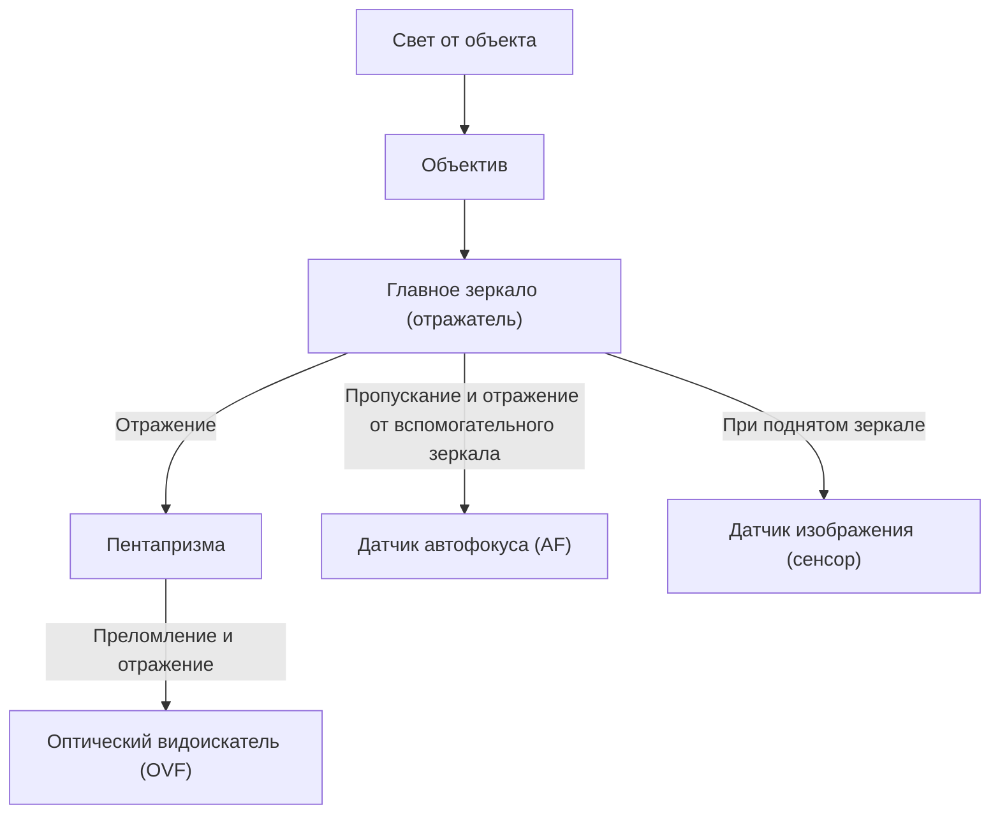
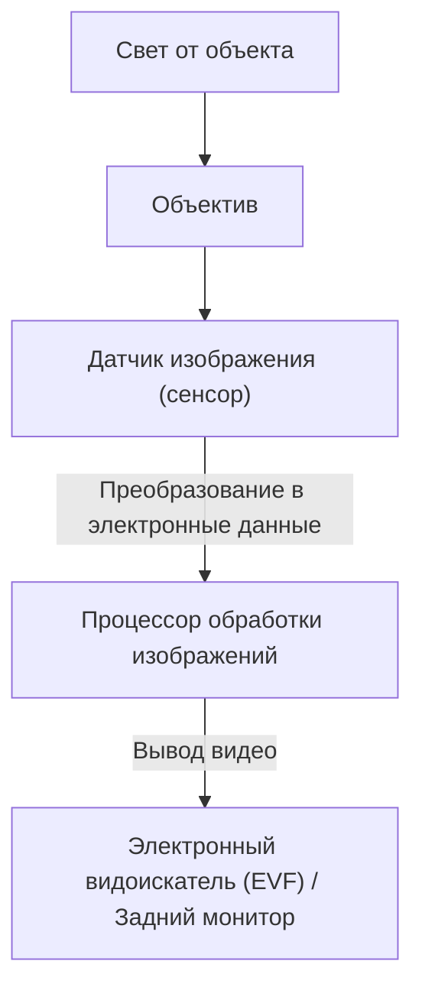

# Разница между зеркальными и беззеркальными камерами: устройство камер и восприятие света

История фотографии — это также история технологий улавливания света. «Зеркальные камеры (DSLR)», которые долгое время пользовались широкой популярностью как среди профессионалов, так и среди любителей, и «беззеркальные камеры», доля которых в последние годы стремительно растет и становится новым стандартом. Обе эти камеры имеют общую черту — сменные объективы, но они принципиально различаются по внутреннему устройству и способу восприятия света.

В этой статье мы глубоко погрузимся в их механизмы с физической, технической и исторической точек зрения: от работы оптического видоискателя (OVF) с использованием пентапризмы до новейших технологий обработки изображений, на которых базируется электронный видоискатель (EVF).

## 1. Базовое устройство камеры и путь света

Самая базовая функция камеры — это «направить свет, прошедший через объектив, на сенсор (или пленку) и записать его». То, как управляется этот путь света (оптический путь), порождает самое большое различие между зеркальными и беззеркальными камерами.

### 1.1 Механизм зеркальной камеры (DSLR)

Зеркальная камера (Digital Single-Lens Reflex), как следует из названия, имеет конструкцию с использованием «одного объектива (Single-Lens)» и «отражающего зеркала (Reflex)».

Главной особенностью зеркальной камеры является «зеркало», расположенное внутри корпуса. Свет, попадающий через объектив, отражается этим зеркалом вверх и попадает в оптический элемент, называемый пентапризмой (или пентазеркалом). Пентапризма путем многократных сложных отражений превращает перевернутое по вертикали и горизонтали изображение в прямое и направляет его в оптический видоискатель (OVF).

Преимущество этой конструкции заключается в том, что «свет, уловленный объективом, можно увидеть невооруженным глазом без задержек по времени». В съемке спорта или дикой природы, где решающее значение имеет каждое мгновение, возможность напрямую видеть объект со скоростью света была огромным преимуществом.

Однако в момент нажатия на кнопку спуска затвора необходимо поднять это зеркало («подъем зеркала»). Из-за этого действия происходит «блэкаут» (затемнение), когда изображение в видоискателе на мгновение исчезает, и одновременно возникает микровибрация, называемая «шоком зеркала».

### 1.2 Механизм беззеркальной камеры

С другой стороны, беззеркальная камера имеет конструкцию, в которой из зеркальной камеры исключены «блок зеркала» и «пентапризма».

В беззеркальной камере свет, проходящий через объектив, всегда попадает напрямую на датчик изображения. Сенсор преобразует полученный свет в электрические сигналы в режиме реального времени, а процессор обработки изображений обрабатывает их как видеоданные. Затем это изображение отображается в электронном видоискателе (EVF) или на заднем ЖК-мониторе.

Самое большое преимущество этой конструкции заключается в том, что «изображение, которое будет фактически снято (с отражением экспозиции и баланса белого), можно увидеть перед съемкой». Кроме того, поскольку нет зеркального блока, корпус камеры можно сделать не только меньше и легче, но и приблизить заднюю линзу объектива к сенсору (уменьшить рабочий отрезок), что значительно повышает свободу в проектировании объективов.

## 2. Оптический видоискатель (OVF) против Электронного видоискателя (EVF)

Различия в устройстве камер напрямую связаны с различиями в свойствах видоискателей. OVF и EVF опираются на разные философии и технологии.

### 2.1 Физические преимущества оптического видоискателя (OVF)

OVF — это чистая оптическая система, использующая преломление и отражение света. Поскольку она не требует цифровой обработки, задержка отображения физически равна нулю. Кроме того, поскольку он в полной мере использует динамический диапазон человеческого глаза, его особенность в том, что легко различать детали объекта даже в очень ярких или очень темных местах.

Кроме того, OVF не потребляет электроэнергию, что позволяет камере работать от батареи в течение длительного времени. Для фотографов дикой природы, которые могут днями находиться в суровых природных условиях без доступа к электричеству, это был вопрос жизни и смерти.

### 2.2 Технологические инновации электронного видоискателя (EVF)

EVF представляет собой систему, в которой вы смотрите на небольшой дисплей высокого разрешения (OLED или ЖК) через окуляр. Ранние EVF имели много недостатков по сравнению с OVF: низкое разрешение, заметную задержку отображения и обилие шумов в темноте.

Однако благодаря развитию технологий EVF совершил качественный скачок.
- **Функция симуляции**: результаты настроек, таких как компенсация экспозиции, баланс белого и стили изображения, отражаются в реальном времени. Это значительно уменьшило неопределенность в фотографии в стиле «пока не снимешь, не узнаешь».
- **Наложение информации**: в видоискателе можно отображать разнообразную вспомогательную информацию для съемки, такую как гистограмма, электронный уровень, фокус-пикинг и зебра.
- **Улучшение производительности в темноте**: благодаря высокой чувствительности сенсора и обработке изображений, можно выводить яркое и усиленное изображение даже в тех местах, где невооруженному глазу совершенно темно. Это то, что невозможно для OVF, например, при кадрировании астрофотографии.
- **Съемка без блэкаута**: во флагманских моделях, оснащенных новейшими многослойными CMOS-сенсорами, невероятно быстрое считывание данных с сенсора обеспечивает «съемку без блэкаута», когда изображение в видоискателе не исчезает даже при серийной съемке. В результате EVF превзошел OVF в его главном преимуществе — способности «непрерывно следить за объектом».

## 3. Эволюция систем автофокуса (AF)

Разница между зеркальными и беззеркальными камерами также оказала большое влияние на эволюцию технологии фокусировки (автофокус).

### 3.1 Фазовый автофокус (зеркальные камеры)

Зеркальные камеры в основном используют «специализированные датчики фазового автофокуса». Часть света направляется вниз с помощью вспомогательного зеркала, расположенного за главным зеркалом, и там измеряется фокус расположенным датчиком AF. Этот метод был очень быстрым и отлично подходил для отслеживания движущихся объектов. Однако из-за ограничений в пространстве для размещения датчиков AF, точки автофокусировки имели тенденцию концентрироваться в центре кадра. Кроме того, механические погрешности зеркал и объективов могли вызывать смещение фокуса (фронт-фокус, бэк-фокус).

### 3.2 Гибридный (фазовый на матрице) и контрастный автофокус (беззеркальные камеры)

В беззеркальных камерах сам датчик изображения выполняет роль датчика AF. Ранние беззеркальные камеры использовали «контрастный автофокус», который ищет пик резкости по контрасту изображения, и хотя точность была высокой, скорость оставляла желать лучшего.

В настоящее время основным направлением является «фазовый автофокус на матрице», при котором часть пикселей на датчике изображения используется для определения фазы. Это позволило совместить высокоскоростную автофокусировку с высокой точностью. Кроме того, поскольку фокус можно измерять по всей поверхности сенсора, точки автофокусировки можно размещать от края до края кадра.
А поскольку в процесс не вмешиваются механические погрешности, смещение фокуса принципиально не возникает.

В последние годы в сочетании с технологией распознавания объектов с использованием ИИ (глубокое обучение) камеры стали автоматически распознавать и отслеживать глаза людей, животных, птиц, автомобили, самолеты, поезда и т.д., что сделало доступной каждому такую съемку, которая раньше была возможна только для опытных профессионалов.

## 4. Экономические и технические последствия для байонета и рабочего отрезка

Изменение конструкции камеры привело к революции и в креплении объектива (байонете). Рабочий отрезок (расстояние от поверхности байонета до сенсора) в зеркальных камерах из-за наличия зеркального блока неизбежно должен был быть длинным (около 40 мм и более).

В беззеркальных камерах этот рабочий отрезок может быть предельно коротким (около 15–20 мм). Это дало следующие преимущества:

1. **Повышение качества изображения широкоугольных объективов**: поскольку заднюю линзу объектива можно приблизить к сенсору, отпадает необходимость принудительно преломлять свет, что облегчило проектирование широкоугольных объективов с высоким качеством изображения вплоть до краев.
2. **Преодоление компромисса между большой светосилой и компактностью**: за счет увеличения диаметра байонета и уменьшения рабочего отрезка стало возможным создавать сверхсветосильные объективы (например, F1.2 или F1.0), которые ранее считались невозможными, сохраняя их практичный размер и вес.
3. **Использование адаптеров для объективов**: поскольку рабочий отрезок короткий, с помощью адаптера (переходника), регулирующего толщину, можно физически устанавливать объективы от старых зеркальных камер, мануальные объективы и даже объективы других производителей. Это принесло пользователям экономическую выгоду от возможности использования существующего парка оптики.

## 5. Путь к съемке видео и гибридным камерам

Популярность беззеркальных камер была в значительной степени обусловлена растущей потребностью в съемке видео. При съемке видео на зеркальную камеру зеркало остается поднятым, поэтому OVF использовать нельзя, и съемка ведется по заднему монитору. Кроме того, поскольку свет больше не достигает специализированного датчика фазового автофокуса, возникала проблема значительного снижения производительности AF во время видеосъемки (некоторые производители решили эту проблему с помощью Dual Pixel CMOS AF и т. д., но фундаментальные структурные ограничения оставались).

Беззеркальные камеры могут плавно переключаться между режимами, так как и фото, и видео обрабатываются на основе данных с датчика одинаковым образом. Высокопроизводительный фазовый автофокус на матрице работает и при видеосъемке, а также можно снимать видео в стабильном положении, глядя в EVF. В настоящее время беззеркальные камеры утвердились в статусе «гибридных камер», которые на высоком уровне сочетают в себе возможности фото- и видеосъемки.

## Заключение: Будущее фотокамер

Переход от зеркальных к беззеркальным камерам — это не просто смена типа видоискателя. Это означает фундаментальную эволюцию камеры от «чисто оптического инструмента» к «высокотехнологичному устройству обработки цифровой информации».

Красота сияющего, живого света, увиденного через пентапризму, — это первозданная радость фотографии, которую можно испытать только с зеркальной камерой. Механический звук затвора и вибрация, передающаяся в руки, дают реальное ощущение того, что вы снимаете фотографию.

С другой стороны, волна электроники, принесенная беззеркальными камерами, значительно расширила границы фотографического самовыражения. Съемка без блэкаута, сверхскоростная серийная съемка, распознавание объектов с помощью ИИ, эволюция систем стабилизации изображения — все это стало возможным именно благодаря освобождению от структурных ограничений.

Понимание механизмов камеры — это понимание того, как свет улавливается и превращается в одну фотографию. Независимо от того, как развиваются технологии, в конечном итоге именно воля фотографа управляет камерой и улавливает свет.
