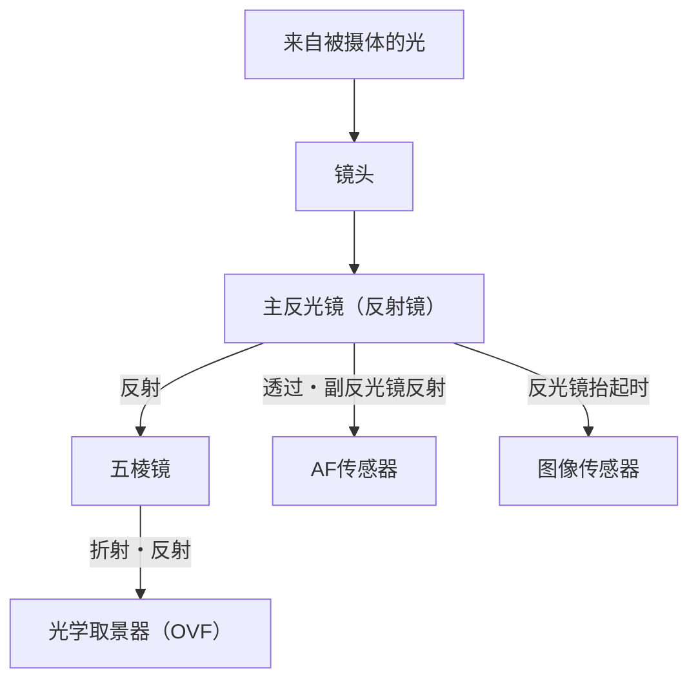
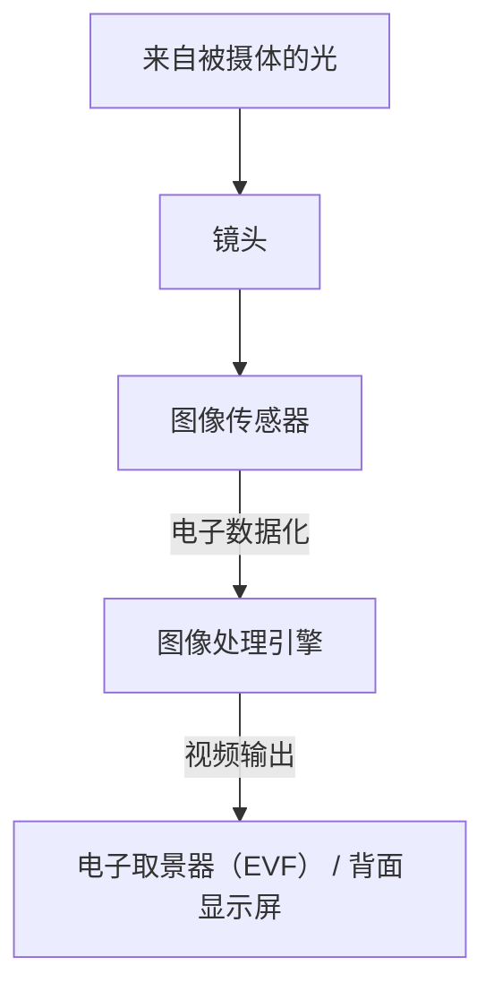

# 单反与无反的区别：相机的结构与光的捕捉方式

摄影的历史也是捕捉光的技术的历史。长期以来从专业人士到业余爱好者都广泛喜爱的“单反相机（DSLR）”，以及近年来市场份额迅速扩大、成为新标准的“无反相机”。这两款相机虽然都具备可更换镜头的共同点，但在内部结构和光的捕捉方式上却有着根本的区别。

本文将从物理、技术和历史的角度深入探讨其机制，从使用五棱镜的光学取景器（OVF）的工作原理，到支撑电子取景器（EVF）的最新图像处理技术。

## 1. 相机的基本结构与光路

相机最基本的功能是“将通过镜头的光引导至传感器（或胶片）并进行记录”。如何控制这条光路，构成了单反和无反最大的区别。

### 1.1 单反相机（DSLR）的机制

单反相机（Digital Single-Lens Reflex），顾名思义，拥有“单镜头（Single-Lens）”和“反光镜（Reflex）”的结构。

单反最大的特点是配置在相机内部的“反光镜”。从镜头进入的光线被这面反光镜向上反射，进入称为五棱镜（或五面镜）的光学部件。五棱镜通过复杂的反复反射，将上下左右颠倒的图像纠正为正立正像，并引导至光学取景器（OVF）。

这种结构的优点在于“可以毫无延迟地用肉眼直接看到镜头捕捉到的光线”。在体育或野生动物等瞬间决定成败的拍摄中，能够直接确认以光速传来的被摄体姿态是一个巨大的优势。

然而，在按下快门的瞬间，必须将这面反光镜抬起（反光镜抬起）。这个动作会导致取景器图像瞬间消失，产生“黑屏”，同时也会产生称为反光镜震动的微小振动。

### 1.2 无反相机的机制

另一方面，无反相机拥有从单反中去除了“反光镜箱”和“五棱镜”的结构。

在无反相机中，从镜头进入的光线始终直接照射在图像传感器上。传感器将接收到的光线实时转换为电信号，图像处理引擎将其作为视频数据进行处理。然后，将该视频显示在电子取景器（EVF）或背面液晶显示屏上。

这种结构最大的优点是“可以在拍摄前确认实际拍摄的图像（反映了曝光和白平衡的状态）”。此外，由于没有反光镜箱，不仅可以使相机机身更加小巧轻便，还能让镜头的后镜片更靠近传感器（缩短法兰距），从而极大地提高了镜头设计的自由度。

## 2. 光学取景器（OVF） vs 电子取景器（EVF）

相机结构的不同直接导致了取景器性质的不同。OVF和EVF各自有着不同的哲学和技术支撑。

### 2.1 光学取景器（OVF）的物理优势

OVF是利用光的折射和反射的纯光学系统。由于不经过数字处理，显示延迟在物理上为零。此外，由于能够直接利用人眼的动态范围，因此在极亮或极暗的地方也能很容易地识别被摄体的细节。

更进一步，由于OVF不消耗电力，因此可以实现长时间的电池续航。对于在严酷的自然环境下可能几天都无法确保电源的自然摄影师来说，这是一个生死攸关的问题。

### 2.2 电子取景器（EVF）的技术革新

EVF是通过接目镜观看微小的高清显示屏（OLED或液晶）的机制。早期的EVF分辨率低，显示延迟明显，在暗处布满噪点等，在许多方面都不如OVF。

然而，随着技术的进步，EVF取得了飞跃性的发展。
- **模拟功能**: 曝光补偿、白平衡、照片风格等设置结果会实时反映出来。大幅减少了“不拍不知道”的摄影不确定性。
- **信息叠加**: 可以在取景器内显示直方图、水平仪、峰值对焦、斑马纹等丰富多彩的辅助拍摄信息。
- **暗处性能提升**: 凭借传感器的高感光性能和图像处理，即使在肉眼看来漆黑一片的地方，也能增亮显示。在星空摄影的构图对齐等方面，这是OVF无法做到的绝技。
- **无黑屏连拍**: 搭载最新堆栈式CMOS传感器的旗舰机型，通过以极高的速度从传感器读取数据，实现了即使在连拍时取景器图像也不会消失的“无黑屏连拍”。由此，在追踪被摄体这一OVF最大的优势上，EVF也开始超越OVF。

## 3. 自动对焦（AF）系统的进化

单反与无反的区别也对对焦技术（自动对焦）的进化产生了巨大影响。

### 3.1 相位差AF（单反）

单反主要使用“专用相位差AF传感器”。它利用主反光镜后面的副反光镜将一部分光线向下引导，用配置在那里的AF传感器测量焦点。这种方式速度非常快，对移动被摄体的追踪性能非常出色。但是，受限于AF传感器配置空间的制约，测距点（可以对焦的点）往往集中在画面中央附近。此外，反光镜和镜头的机械误差可能会导致焦点偏移（跑焦）。

### 3.2 像面相位差AF与对比度AF（无反）

在无反相机中，图像传感器本身兼具AF传感器的作用。早期的无反相机采用了从视频对比度中寻找焦点峰值的“对比度AF”，虽然精度高但速度欠佳。

现在，将图像传感器上的部分像素用于相位差检测的“像面相位差AF”已成为主流。由此兼顾了高速AF和高精度。此外，由于可以在传感器整个表面测量焦点，因此能够在画面的各个角落配置测距点。
同时，由于没有机械误差的介入，原理上不会发生跑焦。

近年来，结合利用AI（深度学习）的被摄体识别技术，相机能够自动识别并持续追踪人物的眼睛、动物、鸟类、汽车、飞机、火车等，这种曾经只有熟练的专业人士才能完成的拍摄，现在正变得任何人都触手可及。

## 4. 卡口和法兰距的经济与技术影响

相机结构的改变也给镜头卡口带来了革命。法兰距（从卡口面到传感器的距离）在单反中由于存在反光镜箱，无论如何也不得不做得较长（约40mm以上）。

而在无反相机中，可以将这个法兰距缩短到极限（约15～20mm）。由此产生了以下优势：

1. **广角镜头的高画质化**: 由于镜头的后镜片可以更靠近传感器，因此不需要勉强改变光路，从而更容易设计出连边缘部分也具备高画质的广角镜头。
2. **克服大光圈化与小型化的权衡**: 通过在增大卡口直径的同时缩短法兰距，过去难以想象的大光圈镜头（如F1.2或F1.0等），现在可以以实用的尺寸和重量得以实现。
3. **卡口适配器的应用**: 由于法兰距短，只要使用调整厚度的卡口适配器，就可以在物理上安装过去的单反镜头、老镜头，甚至其他品牌的镜头。这为用户带来了能够利用现有镜头资产的经济优势。

## 5. 视频拍摄与混合相机的道路

强烈推动无反相机普及的是对视频拍摄需求的日益增长。在使用单反拍摄视频时，由于反光镜需要保持抬起状态，无法使用OVF，只能一边看着背面显示屏一边拍摄。此外，由于光线无法到达专用的相位差AF传感器，导致视频拍摄时的AF性能显著下降（部分厂商虽然通过全像素双核CMOS AF等技术解决了这个问题，但根本的结构制约依然存在）。

无反相机在拍摄静态照片和视频时，同样是通过处理来自传感器的数据，因此可以无缝切换。即使在视频拍摄时，高性能的像面相位差AF也能发挥作用，并且可以一边看着EVF一边以稳定的姿势拍摄视频。现在，无反相机已经确立了兼顾高水平静态照片和视频拍摄的“混合相机”地位。

## 总结：照相机的未来

从单反向无反的过渡，不仅仅是取景器方式的改变。它意味着相机已经从“纯粹的光学仪器”根本进化为“高度的数字信息处理设备”。

透过五棱镜看到的、闪耀的原始光线之美，是只有单反才能体会到的最原始的摄影乐趣。快门的机械回声和传到手上的震动，赋予了正在拍照的真实感。

另一方面，无反相机带来的电子化浪潮，极大地拓展了摄影表现的极限。无黑屏连拍、超高速连拍、AI被摄体识别、防抖机构的进化等，正是因为摆脱了结构上的制约才得以实现。

了解相机的机制，就是了解光线是如何被截取并成为一张照片的。无论技术如何进化，最终操纵相机、捕捉光线的，终究是拍摄者的意志。
