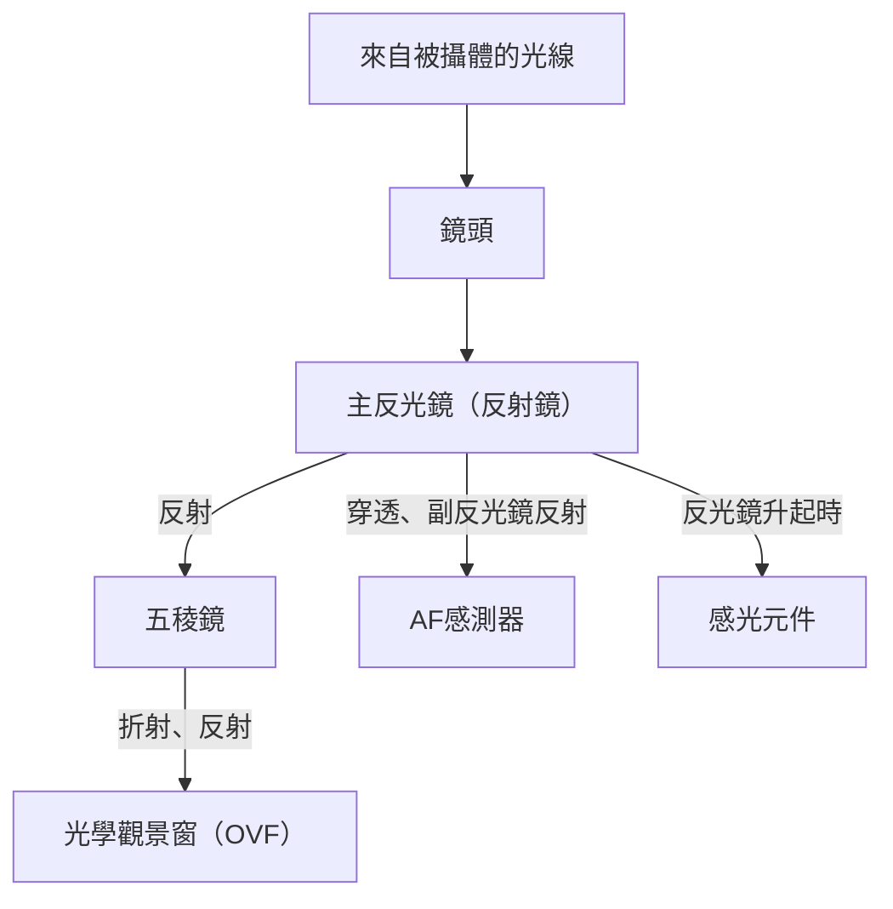
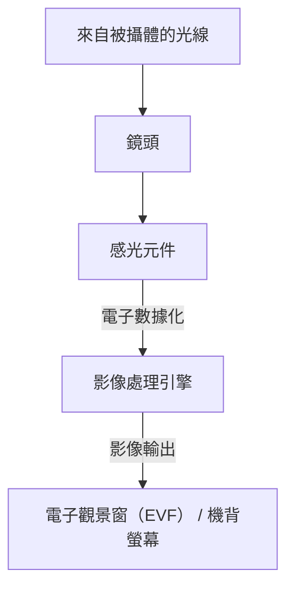

# 單反與無反相機的差異：相機結構與捕捉光線的方式

攝影的歷史也是捕捉光線技術的歷史。長久以來，深受從專業人士到業餘愛好者廣泛喜愛的「單眼反光相機（DSLR，簡稱單反）」，與近年來市佔率迅速擴大、成為新標準的「無反光鏡相機（Mirrorless）」。這兩種相機雖然都有可交換鏡頭的共同點，但在內部結構和捕捉光線的方式上卻有著根本的差異。

本文將從物理、技術以及歷史的觀點，深入探討相機的運作機制，從使用五稜鏡的光學觀景窗（OVF）原理，到支撐電子觀景窗（EVF）的最新影像處理技術。

## 1. 相機的基本結構與光線路徑

相機最基本的功能是「將穿過鏡頭的光線引導至感光元件（或底片）並記錄下來」。如何控制這條光線路徑（光路），造就了單反與無反相機之間最大的差異。

### 1.1 單眼反光相機（DSLR）的機制

單眼反光相機（Digital Single-Lens Reflex），顧名思義具有「單一鏡頭（Single-Lens）」與「反光鏡（Reflex）」的結構。

單反相機最大的特徵在於配置於相機內部的「反光鏡」。從鏡頭進入的光線，會被這面反光鏡向上反射，進入稱為五稜鏡（或五面鏡）的光學元件。五稜鏡透過複雜的重複反射，將上下左右顛倒的影像修正為正立正像，並引導至光學觀景窗（OVF）。

這種結構的優勢在於「能夠無延遲地用肉眼直接看到鏡頭所捕捉到的光線本身」。在運動或野生動物等瞬間時機決定一切的攝影中，能夠直接確認以光速傳遞的被攝體姿態，是一大優勢。

然而，在按下快門的瞬間，必須將這面反光鏡彈起（反光鏡升起）。這個動作會造成觀景窗影像瞬間消失的「黑屏（Blackout）」現象，同時也會產生稱為反光鏡震動的微小震動。

### 1.2 無反光鏡相機的機制

另一方面，無反光鏡相機則是排除了單反相機中「反光鏡箱」與「五稜鏡」的結構。

在無反光鏡相機中，從鏡頭進入的光線總是直接照射在感光元件上。感光元件將接收到的光線即時轉換為電子訊號，由影像處理引擎將其處理成影像數據。然後，將該影像顯示在電子觀景窗（EVF）或機背液晶螢幕上。

這種結構最大的優勢在於「能在拍攝前確認實際拍攝出的影像（已反映曝光和白平衡的狀態）」。此外，由於沒有反光鏡箱，不僅能使相機機身變得更小巧輕量，還能讓鏡頭的後玉更靠近感光元件（縮短法蘭距），大幅提升了鏡頭設計的自由度。

## 2. 光學觀景窗（OVF） vs 電子觀景窗（EVF）

相機結構的差異，直接關係到觀景窗性質的差異。OVF與EVF各自具備不同的設計理念與技術基礎。

### 2.1 光學觀景窗（OVF）的物理優勢

OVF是利用光線折射與反射的純光學系統。由於不經過數位處理，顯示的延遲（Time lag）在物理上為零。此外，因為能直接發揮人眼的動態範圍，所以在極亮或極暗的地方也容易辨識被攝體的細節。

再者，OVF不消耗電力，因此可實現長時間的電池續航。對於在嚴酷的自然環境下、連續數天無法取得電源的自然攝影師來說，這是生死攸關的問題。

### 2.2 電子觀景窗（EVF）的技術革新

EVF是透過接目鏡觀看小型高解析度顯示器（OLED或LCD）的機制。早期的EVF解析度低、顯示延遲明顯，在暗處甚至會充滿雜訊，有許多不如OVF的地方。

然而，隨著技術的進化，EVF取得了飛躍性的進步。
- **模擬功能**：曝光補償、白平衡、相片風格等設定結果會即時反映。大幅減少了「拍了才知道」的攝影不確定性。
- **資訊覆蓋**：直方圖、水平儀、峰值對焦、斑馬紋等輔助攝影的多樣資訊，都能顯示在觀景窗內。
- **暗處性能的提升**：藉由感光元件的高感光性能與影像處理，即使在肉眼看來漆黑一片的地方，也能透過增感明亮地顯示出來。在星空攝影的構圖對位等方面，這是OVF無法辦到的絕技。
- **無黑屏拍攝**：搭載最新堆疊式CMOS感光元件的旗艦機種，透過極高速地讀取感光元件的數據，實現了即使在連拍時觀景窗影像也不會消失的「無黑屏拍攝」。這使得EVF在「持續追蹤被攝體」這個OVF最大優勢的能力上，已經超越了OVF。

## 3. 自動對焦（AF）系統的進化

單反與無反相機的差異，也對對焦技術（自動對焦）的進化產生了重大影響。

### 3.1 相位差AF（單反）

單反相機主要使用「專用相位差AF感測器」。利用主反光鏡後方的副反光鏡將部分光線引導至下方，並由配置在那裡的AF感測器進行測距。這種方式速度極快，對移動被攝體的追蹤性能優異。然而，受限於AF感測器的配置空間限制，測距點（可對焦的位置）往往集中在畫面中央附近。此外，反光鏡或鏡頭的機械誤差可能會導致焦點偏移（移焦）。

### 3.2 像面相位差AF與對比AF（無反）

在無反光鏡相機中，感光元件本身也兼具AF感測器的作用。早期的無反相機採用從影像對比度尋找焦點峰值的「對比AF」，雖然精準度高，但速度是一大課題。

現在，將感光元件上的部分畫素用於相位差檢測的「像面相位差AF」已成為主流。這實現了高速AF與高精準度的兩全其美。此外，因為可以在感光元件的整個範圍內測距，所以能夠將測距點分佈在畫面的各個角落。
另外，由於沒有機械誤差的介入，原理上不會發生焦點偏移。

近年來，結合運用AI（深度學習）的被攝體辨識技術，相機能自動辨識並持續追蹤人物的眼睛、動物、鳥類、汽車、飛機、火車等，這種過去只有熟練的專業人士才能辦到的攝影，現在正變得任何人都能輕鬆實現。

## 4. 接環與法蘭距的經濟與技術影響

相機結構的變化也為鏡頭接環帶來了革命。單反相機由於存在反光鏡箱，其法蘭距（從接環面到感光元件的距離）必然較長（約40mm以上）。

而無反光鏡相機可以將這個法蘭距縮短到極限（約15〜20mm）。這帶來了以下的好處：

1. **廣角鏡頭的高畫質化**：因為鏡頭的後玉可以更靠近感光元件，不需要勉強改變光線折射，使得設計出直到邊緣都具備高畫質的廣角鏡頭變得更加容易。
2. **克服大光圈化與小型化的權衡**：在增大接環口徑的同時縮短法蘭距，使得過去無法想像的大光圈鏡頭（如F1.2或F1.0等），能以實用的尺寸和重量得以實現。
3. **轉接環的活用**：由於法蘭距短，只要使用調整厚度的轉接環，就能在物理上安裝過去的單反用鏡頭、老鏡頭，甚至是其他廠牌的鏡頭。這為使用者帶來了能活化現有鏡頭資產的經濟效益。

## 5. 邁向錄影與混合型相機之路

強烈推動無反光鏡相機普及的因素，是錄影需求的增加。用單反相機錄影時，為了讓反光鏡保持升起狀態，無法使用OVF，只能看著機背螢幕拍攝。此外，由於光線無法到達專用的相位差AF感測器，存在著錄影時AF性能顯著下降的課題（部分廠商透過雙像素CMOS AF等技術解決了這個問題，但根本的結構限制依然存在）。

無反光鏡相機無論是拍攝靜態照片或動態影片，都是同樣透過感光元件的數據處理來進行，因此能無縫切換。即使在錄影時，高性能的像面相位差AF也能發揮作用，並能一邊看著EVF一邊以穩定的姿勢錄影。現在，無反光鏡相機已經確立了在高水準上兼顧靜態與動態攝影的「混合型相機（Hybrid Camera）」地位。

## 總結：相機的未來

從單反向無反光鏡的過渡，不僅僅是觀景窗方式的改變。這意味著相機已經從「純粹的光學儀器」根本性地進化為「高度的數位資訊處理設備」。

透過五稜鏡看見的，那閃耀的原生光線之美，是只有單反相機才能體會到的最原始的攝影喜悅。快門的機械聲響與傳遞到手上的震動，給予了人們正在拍照的實感。

另一方面，無反光鏡相機帶來的電子化浪潮，大幅拓展了攝影表現的極限。無黑屏、超高速連拍、AI被攝體辨識、防手震機制的進化等，正是因為擺脫了結構上的限制才得以實現。

理解相機的機制，就是了解光線是如何被截取、並成為一張照片的。無論技術如何進化，最終操控相機、捕捉光線的，無非是拍攝者的意志。
