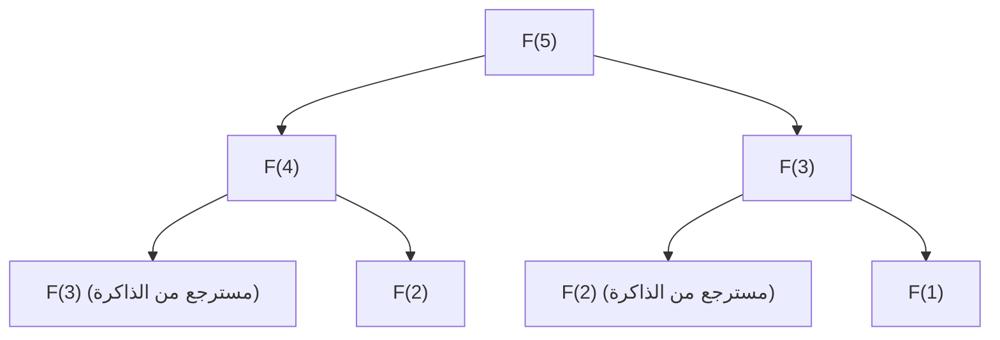

## مقدمة: لماذا تعتبر البرمجة الديناميكية مهمة؟

في علوم الكمبيوتر وتصميم الخوارزميات، نواجه العديد من المشكلات المعقدة كل يوم. من تحسين المسارات، وتخصيص الموارد، ومحاذاة التسلسل في معالجة اللغات الطبيعية، إلى أحدث تقنيات التعلم المعزز، يعد العثور على الحل الأمثل بكفاءة أولوية قصوى.

تؤدي العديد من هذه المشكلات إلى "انفجار توافقي" حيث يزداد وقت الحساب بشكل أسي مع نهج القوة الغاشمة (Brute-force) البسيط، مما يجعله غير قابل للحل حتى لو استغرق وقتًا يعادل عمر الكون. واحدة من أقوى الأسلحة لكسر هذا الجدار اليائس من التعقيد الحسابي هي **البرمجة الديناميكية (Dynamic Programming, DP)**.

في هذا المقال، سنتعمق في جوهر البرمجة الديناميكية وصولاً إلى ركيزتها النظرية، **معادلة بيلمان (Bellman Equation)**. سنبدأ بأمثلة ملموسة سهلة الفهم للمبتدئين، ونشرح بدقة الخصائص الأساسية مثل البنية التحتية المثلى والمشاكل الفرعية المتداخلة، والاختلافات بين نهج التنفيذ من أعلى إلى أسفل (Top-down) ومن أسفل إلى أعلى (Bottom-up)، وحتى تطبيقاتها في التعلم المعزز وعمليات اتخاذ القرار الماركوڤية (MDP).

---

## 1. تاريخ البرمجة الديناميكية وأصل التسمية

تم اقتراح البرمجة الديناميكية في الخمسينيات من القرن الماضي من قبل عالم الرياضيات الأمريكي **ريتشارد بيلمان (Richard Bellman)**. في مؤسسة راند (RAND Corporation) حيث كان يعمل، كانوا يدرسون حينها مشاكل التحسين العسكري وعمليات اتخاذ القرار متعددة المراحل.

من المثير للاهتمام أن مصطلح "Dynamic Programming" نفسه لم يكن يحمل في الأصل دلالة "برمجة الكمبيوتر (الترميز)" بالمعنى الحديث. في ذلك الوقت، كان مصطلح "Programming" يعني "التخطيط (Planning) أو إنشاء الجداول (Tabular method)"، وهو نفس الاستخدام كما في "البرمجة الخطية (Linear Programming)". بالإضافة إلى ذلك، تُروى قصة شهيرة مفادها أن بيلمان اختار كلمة "Dynamic" للتأكيد على عملية اتخاذ القرار متعددة المراحل (multi-stage) حيث تتغير الظروف بمرور الوقت، ولأنها "كلمة قوية تبدو جذابة لممولي الأبحاث (خاصة وزير الدفاع في ذلك الوقت) ويصعب دحضها".

ومع ذلك، فإن الأساس الرياضي المخفي وراء هذا الاسم الجذاب حقيقي، ولاحقًا مع انتشار أجهزة الكمبيوتر، أسس لنفسه مكانة راسخة كواحد من أهم النماذج في تصميم الخوارزميات.

---

## 2. "الشرطان" الأساسيان لتحقيق البرمجة الديناميكية

لحل مشكلة بكفاءة باستخدام البرمجة الديناميكية، يجب أن تستوفي المشكلة الخاصيتين المهمتين التاليتين:

### 2.1. البنية التحتية المثلى (Optimal Substructure)

**البنية التحتية المثلى** هي خاصية تعني أن "الحل الأمثل للمشكلة ككل يتكون من الحلول المثلى للمشاكل الفرعية التي تم تقسيم المشكلة إليها".

على سبيل المثال، لنفترض أنك تبحث عن أقصر مسار من المدينة أ (A) إلى المدينة ج (C). إذا كنت تعلم أنك ستمر عبر المدينة ب (B) في الطريق، فإن أقصر مسار من أ إلى ج سيكون مجموع "أقصر مسار من أ إلى ب" و "أقصر مسار من ب إلى ج". إذا كان هناك طريق آخر أقصر من أ إلى ب، فإن استخدامه سيجعل المسار من أ إلى ج أقصر أيضًا. لذلك، من أجل تحسين الكل، يجب أيضًا تحسين المسارات الجزئية.

### 2.2. المشاكل الفرعية المتداخلة (Overlapping Subproblems)

**المشاكل الفرعية المتداخلة** هي خاصية تعني أنه "أثناء عملية تقسيم المشكلة وحلها، تظهر نفس المشكلة الفرعية تمامًا مرارًا وتكرارًا".

مثال نموذجي هو تسلسل فيبوناتشي. عند تعريف الدالة لإيجاد الحد النوني ($n$) من تسلسل فيبوناتشي كـ $F(n) = F(n-1) + F(n-2)$، لحساب $F(5)$، نحتاج إلى $F(4)$ و $F(3)$. علاوة على ذلك، لحساب $F(4)$، نحتاج إلى $F(3)$ و $F(2)$.
ما يجب ملاحظته هنا هو أن حساب $F(3)$ يظهر عدة مرات في فروع مختلفة. إذا قمنا بالحساب باستخدام القوة الغاشمة، فإن تداخل العمليات الحسابية سيستغرق وقتًا أسيًا. تقلل البرمجة الديناميكية بشكل كبير من وقت الحساب عن طريق "تذكر (حفظ) المشكلة التي تم حلها مرة واحدة وإعادة استخدامها في المرات اللاحقة".

---

## 3. الاختلافات في النهج: الحفظ (من أعلى إلى أسفل) مقابل الجدولة (من أسفل إلى أعلى)

يمكن تقسيم تطبيق البرمجة الديناميكية إلى نهجين رئيسيين. الفكرة الأساسية في كليهما هي "إعادة استخدام نتائج الحساب"، لكن الاتجاه الذي يتقدم فيه الحساب يختلف.

### 3.1. نهج من أعلى إلى أسفل (العودية مع الحفظ)

في النهج من أعلى إلى أسفل (Top-down approach)، نبدأ من المشكلة الكبيرة الأصلية ونحلها بشكل متكرر (عوديًا) بينما نقسمها إلى مشاكل أصغر. في هذا الوقت، يتم حفظ إجابات المشاكل الصغيرة التي تم حسابها مرة واحدة في هياكل البيانات مثل المصفوفات أو خرائط التجزئة (Hash maps). يُطلق على هذا اسم **الحفظ (Memoization)**.

ميزة هذا النهج هي أنه يمكن كتابة هيكل المشكلة الأصلية كما هو كدالة عودية، مما يجعل الكود بديهيًا وغالبًا أسهل للفهم. بالإضافة إلى ذلك، نظرًا لأنه يتم حساب المشاكل الفرعية الضرورية فعليًا فقط من مساحة الحالة عند الطلب، يمكن التخلص من الحسابات غير الضرورية.

### 3.2. نهج من أسفل إلى أعلى (طريقة الجدولة)

في النهج من أسفل إلى أعلى (Bottom-up approach)، نبدأ الحساب من أصغر مشكلة فرعية (بديهية)، ونستخدم النتائج لحساب إجابات المشاكل الأكبر تدريجيًا، لنصل في النهاية إلى إجابة المشكلة التي نريد حلها. بشكل عام، يتم إعداد مصفوفة (جدول DP)، ويتم ملء القيم بالترتيب من البداية باستخدام التكرار (الحلقات). يُطلق على هذا أيضًا اسم **الجدولة (Tabulation)**.

أكبر ميزة للنهج من أسفل إلى أعلى هي عدم وجود عبء استدعاء الدالة (مثل استهلاك مكدس الاستدعاءات بسبب عمق العودية)، لذا فإن سرعة التنفيذ تكون سريعة ومن السهل تحسين كفاءة الذاكرة (على سبيل المثال، إذا كنت تحتاج فقط إلى الاحتفاظ بآخر قيمتين، فقد يمكن تقليل تعقيد المساحة إلى $O(1)$).

---

## 4. دراسة حالة من خلال مثال محدد: مشكلة حقيبة الظهر (Knapsack Problem)

لفهم قوة البرمجة الديناميكية، دعونا نفكر في مشكلة كلاسيكية وعملية وهي "مشكلة حقيبة الظهر 0-1" (0-1 Knapsack Problem).

### إعداد المشكلة
لص لديه حقيبة ظهر بسعة $W$. أمامه $n$ من العناصر، ولكل عنصر $i$ وزن $w_i$ وقيمة $v_i$. يريد اللص اختيار العناصر في حدود سعة حقيبة الظهر لتعظيم القيمة الإجمالية التي يمكنه أخذها. كل عنصر إما أن يتم "اختياره (1)" أو "عدم اختياره (0)".

### الصياغة باستخدام البرمجة الديناميكية (DP)
لحل هذه المشكلة، نقوم بتعريف "الحالة" و "علاقة التكرار (معادلة انتقال الحالة)".

**تعريف الحالة:**
نُعرّف `DP[i][w]` على أنه "القيمة القصوى الممكنة عند الاختيار من أول $i$ عناصر بحيث لا يتجاوز الوزن الإجمالي $w$".

**بناء علاقة التكرار:**
عند التفكير في العنصر $i$، هناك خياران.
1. **في حالة عدم اختيار العنصر $i$:**
   القيمة لا تتغير، والمساحة المتاحة للوزن لا تتغير أيضًا.
   `DP[i][w] = DP[i-1][w]`
2. **في حالة اختيار العنصر $i$ (فقط إذا كان $w \ge w_i$):**
   تُضاف قيمة العنصر $i$ التي هي $v_i$، وتصبح السعة المتبقية $w - w_i$. نجمع القيمة القصوى التي يمكن الحصول عليها من العناصر حتى $i-1$ للسعة المتبقية.
   `DP[i][w] = DP[i-1][w - w_i] + v_i`

لذلك، من بين هذين الخيارين، يجب أن نختار الخيار الذي يعطي القيمة الأكبر.

$$ DP[i][w] = \max( DP[i-1][w], DP[i-1][w - w_i] + v_i ) $$

هذه العلاقة التكرارية هي بالضبط التعبير الرياضي عن **البنية التحتية المثلى** في مشكلة حقيبة الظهر. يتكون الحل الأمثل الإجمالي من المشكلة الفرعية "الحل الأمثل للسعة المتبقية بعد إضافة العنصر $i$".

---

## 5. الارتقاء إلى معادلة بيلمان (Bellman Equation)

نهج علاقة التكرار الذي رأيناه حتى الآن هو في الواقع ليس سوى تطبيق محدد لـ **معادلة بيلمان**.
قام ريتشارد بيلمان بتجريد المبدأ الكامن وراء هذه البرمجة الديناميكية وصاغه كـ **مبدأ الأمثلية (Principle of Optimality)**.

> "السياسة المثلى لها الخاصية التالية: مهما كانت الحالة الأولية والقرار الأولي، يجب أن تشكل القرارات المتبقية سياسة مثلى فيما يتعلق بالحالة الناتجة عن القرار الأول."

هذا المفهوم الموصوف رياضيًا هو معادلة بيلمان. بشكل عام، في نماذج انتقال الحالة ذات الزمن المتقطع، تُعرّف دالة القيمة المثلى $V^*(s)$ في الحالة $s$ على النحو التالي:

$$ V^*(s) = \max_{a} \left\{ R(s, a) + \gamma V^*(s') \right\} $$

معاني الرموز هي كما يلي:
- $V^*(s)$ : القيمة القصوى لإجمالي المكافآت المستقبلية (القيمة المتوقعة) إذا بدأنا من الحالة $s$.
- $a$ : الإجراء (Action) الذي يمكن اتخاذه في الحالة $s$.
- $R(s, a)$ : المكافأة الفورية (Reward) التي يتم الحصول عليها عند اتخاذ الإجراء $a$ في الحالة $s$.
- $\gamma$ : عامل الخصم (Discount factor, $0 \le \gamma < 1$). معلمة تشير إلى مقدار قيمة المكافآت المستقبلية المقدرة كقيمة حالية.
- $s'$ : الحالة التالية التي يتم الانتقال إليها نتيجة لاتخاذ الإجراء $a$.

### ما تعنيه معادلة بيلمان

ما تدعيه هذه المعادلة هو حقيقة بسيطة وقوية للغاية: **"القيمة المثلى للحالة الحالية هي الحد الأقصى، من بين جميع الإجراءات الممكنة، لمجموع المكافأة التي يمكن الحصول عليها الآن والقيمة المثلى للحالة التالية"**.

هذا له نفس الهيكل الأساسي كعلاقة التكرار لمشكلة حقيبة الظهر السابقة. بعبارة أخرى، تقوم بتقسيم مشكلة التحسين المعقدة متعددة المراحل إلى "الخطوة الحالية الواحدة" و "جميع الخطوات اللاحقة (هيكل عودي)".

---

## 6. التطبيق في التعلم المعزز وعمليات اتخاذ القرار الماركوڤية (MDP)

في الذكاء الاصطناعي الحديث، وخاصة **التعلم المعزز (Reinforcement Learning, RL)**، تلعب معادلة بيلمان دورًا نظريًا مركزيًا.
وراء الذكاء الاصطناعي مثل AlphaGo الذي هزم بطل العالم في لعبة Go، والروبوتات التي تتعلم المشي، يوجد إطار احتمالي يسمى عمليات اتخاذ القرار الماركوڤية (MDP) ومعادلة بيلمان لحلها.

في مشاكل العالم الحقيقي، الحالة التالية $s'$ بعد اتخاذ الإجراء $a$ لا يتم تحديدها دائمًا بشكل حتمي (قد تهب الرياح ويتحرك الروبوت في اتجاه غير متوقع). لأخذ عدم اليقين هذا في الاعتبار، يتم استخدام **معادلة توقع بيلمان (Bellman Expectation Equation)** و **معادلة بيلمان المثلى (Bellman Optimality Equation)** اللتين تقدمان احتمالية انتقال الحالة $P(s' | s, a)$.

$$ V^*(s) = \max_{a} \sum_{s'} P(s' | s, a) \left[ R(s, a, s') + \gamma V^*(s') \right] $$

الخوارزميات الرئيسية في التعلم المعزز مثل **Q-Learning** و **تكرار القيمة (Value Iteration)** هي بالضبط عملية الحصول على أفضل توجيهات سلوكية (سياسة) عن طريق حساب معادلة بيلمان هذه بشكل متكرر وحلها تقريبيًا.

---

## الخلاصة: "فَرِّق تَسُد" وجماليات الذاكرة

البرمجة الديناميكية ومعادلة بيلمان ليست مجرد تقنيات برمجة. يمكن القول إنها "فلسفة" لتقسيم الأنظمة الضخمة والمعقدة، واتخاذ القرارات بشأن المستقبل غير المؤكد، إلى وحدات عقلانية وقابلة للحساب.

1. تقسيم المشكلة باستخدام **البنية التحتية المثلى**،
2. تذكر (الحفظ / الجدولة) وإعادة استخدام نتائج حساب **المشاكل الفرعية المتداخلة**،
3. ربط القيم الحالية والمستقبلية بشكل عودي باستخدام **معادلة بيلمان**.

الفهم العميق لهذه المفاهيم لن ينمي فقط القدرة على تصميم خوارزميات أكثر كفاءة، بل سيوفر أيضًا طريقة تفكير عامة (نموذج عقلي) يمكن تطبيقها لحل التحديات المعقدة في الأعمال والحياة اليومية.

عندما تواجه عقبة في البرمجة أو تعاني من تصميم خوارزميات معقدة، يرجى التوقف لحظة وطرح الأسئلة: "ألا يمكن التعبير عن هذه المشكلة كمجموعة من المشاكل الأصغر؟" و "هل نسيت المشاكل التي حللتها بالفعل وأقوم بتكرار نفس الحسابات؟" هناك، يجب أن تجد المفتاح الذي يفتح أبواب البرمجة الديناميكية.
