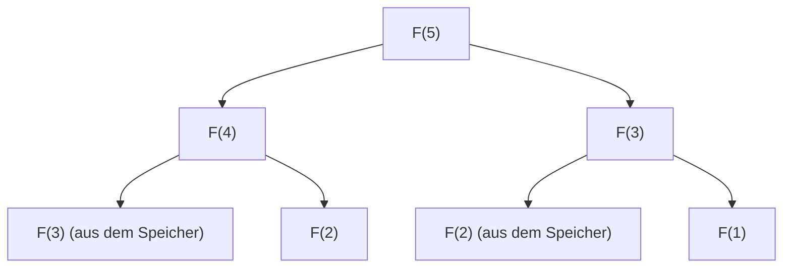

## Einführung: Warum ist dynamische Programmierung wichtig?

In der Informatik und beim Entwurf von Algorithmen stehen wir täglich vor verschiedenen komplexen Problemen. Von der Routenoptimierung über die Ressourcenzuweisung, das Sequenz-Alignment in der Verarbeitung natürlicher Sprache bis hin zum modernsten Reinforcement Learning (Bestärkendes Lernen) ist das effiziente Finden optimaler Lösungen von höchster Priorität.

Viele dieser Probleme verursachen bei einem einfachen Brute-Force-Ansatz eine "kombinatorische Explosion", bei der die Rechenzeit exponentiell ansteigt und sie selbst in der Lebensdauer des Universums nicht gelöst werden können. Eine der mächtigsten Waffen, um diese scheinbar unüberwindbare Wand der Rechenkomplexität zu durchbrechen, ist die **dynamische Programmierung (Dynamic Programming, DP)**.

In diesem Artikel werden wir tief in das Wesen der dynamischen Programmierung und ihre theoretische Säule, die **Bellman-Gleichung (Bellman Equation)**, eintauchen. Wir beginnen mit konkreten, auch für Anfänger leicht verständlichen Beispielen und erklären ausführlich die Kerneigenschaften wie optimale Teilstruktur (Optimal Substructure) und überlappende Teilprobleme (Overlapping Subproblems), die Unterschiede zwischen Top-Down- und Bottom-Up-Implementierungsansätzen sowie die Anwendung in Reinforcement Learning und Markow-Entscheidungsprozessen (MDP).

---

## 1. Die Geschichte der dynamischen Programmierung und der Ursprung des Namens

Die dynamische Programmierung wurde in den 1950er Jahren von dem amerikanischen Mathematiker **Richard Bellman** vorgeschlagen. Bei der RAND Corporation, wo er arbeitete, erforschte man damals militärische Optimierungsprobleme und mehrstufige Entscheidungsprozesse.

Interessanterweise hatte der Begriff "Dynamic Programming" anfangs keine Bedeutung im Sinne der modernen "Computerprogrammierung (Coding)". Damals bedeutete "Programming" eher "Planung (Planning) oder die Erstellung von Tabellen (Tabular method)", was auf dieselbe Weise wie bei der "Linearen Programmierung (Linear Programming)" verwendet wurde. Das Wort "Dynamic" wurde gewählt, um den mehrstufigen (Multi-Stage) Entscheidungsprozess zu betonen, bei dem sich die Situation im Laufe der Zeit ändert. Es gibt zudem eine berühmte Anekdote, dass Bellman den Begriff wählte, weil er "für die Sponsoren der Forschungsgelder (insbesondere den damaligen Verteidigungsminister) attraktiv klang und ein kraftvolles Wort war, dem man schwer widersprechen konnte."

Doch die mathematische Grundlage, die sich hinter diesem eingängigen Namen verbarg, war echt. Mit der zunehmenden Verbreitung von Computern etablierte sie sich später als eines der wichtigsten Paradigmen im Algorithmenentwurf.

---

## 2. Die "2 Bedingungen", die dynamische Programmierung ermöglichen

Damit ein Problem effizient durch dynamische Programmierung gelöst werden kann, muss es die folgenden zwei wichtigen Eigenschaften aufweisen:

### 2.1. Optimale Teilstruktur (Optimal Substructure)

**Optimale Teilstruktur** bedeutet, dass sich die optimale Lösung für das Gesamtproblem aus den optimalen Lösungen seiner Teilprobleme zusammensetzt.

Angenommen, wir suchen nach dem kürzesten Weg von Stadt A nach Stadt C. Wenn wir wissen, dass wir unterwegs über Stadt B fahren, ist der kürzeste Weg von A nach C die Summe aus dem "kürzesten Weg von A nach B" und dem "kürzesten Weg von B nach C". Gäbe es einen noch kürzeren Weg von A nach B, würden wir diesen nehmen und der Weg von A nach C wäre noch kürzer. Um also das Ganze zu optimieren, müssen auch die Teilwege optimiert sein.

### 2.2. Überlappende Teilprobleme (Overlapping Subproblems)

**Überlappende Teilprobleme** bedeutet, dass beim Aufteilen und Lösen des Problems exakt dieselben Teilprobleme immer wieder auftreten.

Ein typisches Beispiel ist die Fibonacci-Folge. Wenn wir die Funktion zur Berechnung des $n$-ten Glieds der Fibonacci-Folge als $F(n) = F(n-1) + F(n-2)$ definieren, benötigen wir zur Berechnung von $F(5)$ sowohl $F(4)$ als auch $F(3)$. Um $F(4)$ zu berechnen, benötigen wir wiederum $F(3)$ und $F(2)$.
Auffällig ist hierbei, dass die Berechnung von $F(3)$ mehrmals in verschiedenen Zweigen auftaucht. Wenn wir dies mit Brute-Force berechnen, führt die Duplizierung der Berechnungen zu einem exponentiellen Zeitaufwand. Die dynamische Programmierung reduziert die Berechnungskomplexität drastisch, indem sie "einmal gelöste Probleme speichert (Memoization) und ab dem zweiten Mal wiederverwendet".

---

## 3. Unterschiede im Ansatz: Memoization (Top-Down) vs. Tabulation (Bottom-Up)

Es gibt im Wesentlichen zwei Ansätze zur Implementierung der dynamischen Programmierung. Beide basieren auf der Grundidee der "Wiederverwendung von Berechnungsergebnissen", unterscheiden sich jedoch in der Richtung, in der die Berechnung durchgeführt wird.

### 3.1. Top-Down-Ansatz (Rekursion mit Memoization)

Beim Top-Down-Ansatz beginnen wir mit dem ursprünglichen großen Problem und lösen es rekursiv, indem wir es in kleinere Probleme aufteilen. Dabei speichern wir die Antworten auf die einmal berechneten kleinen Probleme in einer Datenstruktur wie einem Array oder einer Hash-Map. Dies wird **Memoization** genannt.

Der Vorteil dieses Ansatzes ist, dass die Struktur des ursprünglichen Problems oft direkt als rekursive Funktion geschrieben werden kann, was den Code intuitiver macht. Außerdem werden im Zustandsraum nur die tatsächlich benötigten Teilprobleme "on-demand" berechnet, wodurch unnötige Berechnungen vermieden werden.

### 3.2. Bottom-Up-Ansatz (Tabulation)

Beim Bottom-Up-Ansatz beginnen wir mit dem kleinsten (trivialen) Teilproblem, verwenden dessen Ergebnis, um schrittweise die Antworten auf größere Probleme zu berechnen, und gelangen schließlich zur Antwort des gewünschten Problems. Im Allgemeinen wird ein Array (DP-Tabelle) vorbereitet, und die Werte werden in einer Schleife (Iterativ) der Reihe nach ausgefüllt. Dies wird auch **Tabulation** genannt.

Der größte Vorteil von Bottom-Up ist, dass es keinen Overhead durch Funktionsaufrufe gibt (wie z. B. den Verbrauch des Call-Stacks durch die Rekursionstiefe), wodurch die Ausführungsgeschwindigkeit hoch ist und die Speichereffizienz leichter optimiert werden kann (wenn z. B. nur die letzten beiden Werte aufbewahrt werden müssen, kann die Speicherkomplexität oft auf $O(1)$ reduziert werden).

---

## 4. Betrachtung an einem konkreten Beispiel: Das Rucksackproblem

Um die Leistungsfähigkeit der dynamischen Programmierung zu verstehen, betrachten wir das klassische und praktische "0-1 Rucksackproblem".

### Problemstellung
Ein Dieb hat einen Rucksack mit der Kapazität $W$. Vor ihm liegen $n$ Gegenstände, und für jeden Gegenstand $i$ sind ein Gewicht $w_i$ und ein Wert $v_i$ festgelegt. Der Dieb möchte Gegenstände auswählen, ohne die Kapazität des Rucksacks zu überschreiten, um den Gesamtwert der Beute zu maximieren. Für jeden Gegenstand gibt es nur die Wahl: "auswählen (1)" oder "nicht auswählen (0)".

### Formulierung mittels DP
Um dieses Problem zu lösen, definieren wir einen "Zustand" und eine "Rekursionsgleichung (Zustandsübergangsgleichung)".

**Definition des Zustands:**
Wir definieren `DP[i][w]` als "den maximalen Wert, wenn wir aus den ersten $i$ Gegenständen so auswählen, dass das Gesamtgewicht $w$ nicht überschreitet".

**Aufbau der Rekursionsgleichung:**
Wenn wir den Gegenstand $i$ betrachten, gibt es zwei Möglichkeiten.
1. **Wenn Gegenstand $i$ nicht ausgewählt wird:**
   Der Wert ändert sich nicht, und die verbleibende Kapazität bleibt gleich.
   `DP[i][w] = DP[i-1][w]`
2. **Wenn Gegenstand $i$ ausgewählt wird (nur wenn $w \ge w_i$):**
   Der Wert $v_i$ des Gegenstands $i$ kommt hinzu, und die verbleibende Kapazität wird $w - w_i$. Zu dieser verbleibenden Kapazität addieren wir den maximalen Wert, der bis zum Gegenstand $i-1$ erreicht werden kann.
   `DP[i][w] = DP[i-1][w - w_i] + v_i`

Wir müssen also einfach diejenige der beiden Optionen wählen, die den größeren Wert ergibt.

$$ DP[i][w] = \max( DP[i-1][w], DP[i-1][w - w_i] + v_i ) $$

Genau diese Rekursionsgleichung stellt die **optimale Teilstruktur** des Rucksackproblems als mathematische Formel dar. Die optimale Gesamtlösung setzt sich aus dem Teilproblem "die optimale Lösung für die restliche Kapazität nach dem Hinzufügen von Gegenstand $i$" zusammen.

---

## 5. Die Erhebung zur Bellman-Gleichung (Bellman Equation)

Der Ansatz der Rekursionsgleichungen, den wir bisher gesehen haben, ist tatsächlich nichts anderes als ein konkretes Anwendungsbeispiel der **Bellman-Gleichung**.
Richard Bellman abstrahierte das Prinzip hinter dieser Art von dynamischer Programmierung und formulierte es als das **Prinzip der Optimalität (Principle of Optimality)**.

> "Eine optimale Politik hat die Eigenschaft, dass, unabhängig von dem anfänglichen Zustand und der anfänglichen Entscheidung, die verbleibenden Entscheidungen eine optimale Politik in Bezug auf den Zustand bilden müssen, der aus der ersten Entscheidung resultiert."

Die mathematische Beschreibung dieses Konzepts ist die Bellman-Gleichung. Im Allgemeinen ist in einem zeitdiskreten Zustandsübergangsmodell die optimale Wertfunktion $V^*(s)$ in Zustand $s$ wie folgt definiert:

$$ V^*(s) = \max_{a} \left\{ R(s, a) + \gamma V^*(s') \right\} $$

Die Bedeutungen der einzelnen Symbole sind wie folgt:
- $V^*(s)$ : Der maximale Wert (Erwartungswert) der zukünftigen Gesamtbelohnung, wenn man vom Zustand $s$ ausgeht.
- $a$ : Eine Aktion (Action), die im Zustand $s$ ausgeführt werden kann.
- $R(s, a)$ : Die sofortige Belohnung (Reward), wenn im Zustand $s$ die Aktion $a$ ausgeführt wird.
- $\gamma$ : Der Diskontierungsfaktor (Discount factor, $0 \le \gamma < 1$). Ein Parameter, der angibt, wie sehr zukünftige Belohnungen als aktueller Wert eingeschätzt werden.
- $s'$ : Der Folgezustand, der als Ergebnis der Aktion $a$ erreicht wird.

### Was die Bellman-Gleichung bedeutet

Was diese Gleichung aussagt, ist die extrem einfache, aber kraftvolle Tatsache: **"Der optimale Wert des aktuellen Zustands ist das Maximum (über alle möglichen Aktionen) aus der sofortigen Belohnung plus dem optimalen Wert des nächsten Zustands."**

Dies hat im Wesentlichen dieselbe Struktur wie die Rekursionsgleichung des Rucksackproblems von vorhin. Das bedeutet, dass komplexe mehrstufige Optimierungsprobleme in den "aktuellen einzelnen Schritt" und "alle nachfolgenden Schritte (rekursive Struktur)" unterteilt werden.

---

## 6. Anwendung in Reinforcement Learning und Markow-Entscheidungsprozessen (MDP)

In der modernen Künstlichen Intelligenz, insbesondere im **Reinforcement Learning (RL, Bestärkendes Lernen)**, spielt die Bellman-Gleichung die theoretische Hauptrolle.
Hinter KI wie AlphaGo, die Weltmeister im Go schlägt, oder Robotern, die das Laufen lernen, verbergen sich ein stochastischer Rahmen namens Markow-Entscheidungsprozess (MDP) und die Bellman-Gleichung, um ihn zu lösen.

In realen Problemen ist der nächste Zustand $s'$ nach der Aktion $a$ nicht immer deterministisch bestimmt (der Wind könnte wehen und den Roboter in eine unerwartete Richtung drängen). Um diese Unsicherheit zu berücksichtigen, werden die **Bellman-Erwartungsgleichung (Bellman Expectation Equation)** und die **Bellman-Optimalitätsgleichung (Bellman Optimality Equation)** verwendet, die eine Zustandsübergangswahrscheinlichkeit $P(s' | s, a)$ einführen.

$$ V^*(s) = \max_{a} \sum_{s'} P(s' | s, a) \left[ R(s, a, s') + \gamma V^*(s') \right] $$

Die wichtigsten Algorithmen des Reinforcement Learnings wie **Q-Learning** oder **Value Iteration** sind genau jene Prozesse, in denen durch wiederholte Berechnung dieser Bellman-Gleichung und deren approximative Lösung die optimale Handlungsrichtlinie (Policy) erlernt wird.

---

## Fazit: Die Ästhetik von "Teile und Herrsche" und der Erinnerung

Die dynamische Programmierung und die Bellman-Gleichung sind nicht nur reine Programmiertechniken. Sie können auch als eine "Philosophie" betrachtet werden, um Entscheidungen in riesigen und komplexen Systemen oder einer ungewissen Zukunft in rationale und berechenbare Einheiten zu zerlegen.

1. Das Problem mithilfe der **optimalen Teilstruktur** zerlegen,
2. Die Berechnungsergebnisse **überlappender Teilprobleme** speichern (Memoization, Tabulation) und wiederverwenden,
3. Gegenwärtige und zukünftige Werte durch die **Bellman-Gleichung** rekursiv miteinander verbinden.

Ein tiefes Verständnis dieser Konzepte fördert nicht nur die Fähigkeit, effizientere Algorithmen zu entwerfen, sondern bietet auch ein universelles Denkmodell (Mentales Modell), das zur Lösung komplexer Aufgaben in der Wirtschaft und im Alltag angewendet werden kann.

Wenn Sie beim Programmieren auf eine Mauer stoßen oder sich bei der Entwicklung eines komplexen Algorithmus den Kopf zerbrechen, halten Sie doch einmal inne und fragen Sie sich: "Lässt sich dieses Problem nicht als eine Ansammlung kleinerer Probleme darstellen?" oder "Habe ich bereits gelöste Probleme vergessen und wiederhole ich dieselben Berechnungen?". Genau dort liegt der Schlüssel, der die Tür zur dynamischen Programmierung öffnet.
