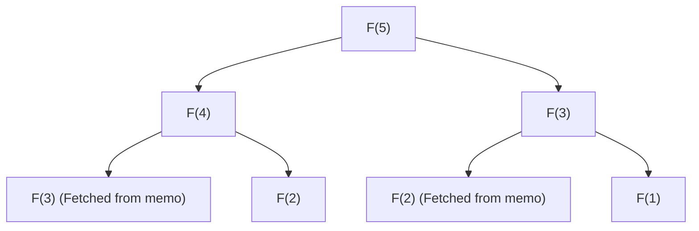

## Introduction: Why is Dynamic Programming Important?

In computer science and algorithm design, we face various complex problems every day. From route optimization, resource allocation, and sequence alignment in natural language processing to cutting-edge reinforcement learning, finding optimal solutions efficiently is a supreme imperative.

Many of these problems suffer from a "combinatorial explosion" when approached with a simple brute-force method, where computation time increases exponentially and cannot be solved even over the lifetime of the universe. One of the most powerful weapons to break through this desperate wall of computational complexity is **Dynamic Programming (DP)**.

In this article, we will delve deeply into the essence of dynamic programming up to its theoretical pillar, the **Bellman Equation**. We will thoroughly explain everything, starting with concrete examples easy for beginners to understand, core properties like optimal substructure and overlapping subproblems, the differences between top-down and bottom-up implementation approaches, and applications to reinforcement learning and Markov Decision Processes (MDP).

---

## 1. History of Dynamic Programming and the Origin of its Name

Dynamic programming was proposed in the 1950s by the American mathematician **Richard Bellman**. At the RAND Corporation where he worked, they were studying military optimization problems and multi-stage decision-making processes at the time.

Interestingly, the term "Dynamic Programming" itself did not originally carry the modern connotation of "computer programming (coding)." At the time, "Programming" meant "planning or creating a tabular method," used in the same way as in "Linear Programming." Also, there is a famous anecdote that Bellman chose the word "Dynamic" to emphasize a multi-stage decision-making process where situations change over time, and because it "sounded appealing to research funding sponsors (especially the Secretary of Defense at the time) and was a powerful word that was hard to argue against."

However, the mathematical backing hidden behind its catchy name was genuine, and as computers became more widespread, it firmly established its position as one of the most important paradigms in algorithm design.

---

## 2. The "Two Conditions" that Make Dynamic Programming Work

In order to solve a problem efficiently with dynamic programming, the problem must satisfy the following two important properties.

### 2.1. Optimal Substructure

**Optimal substructure** is the property that "the optimal solution to the overall problem is constructed from the optimal solutions of the subproblems into which it is divided."

For example, suppose you are looking for the shortest path from City A to City C. If you know you will pass through City B along the way, the shortest path from A to C is the sum of the "shortest path from A to B" and the "shortest path from B to C." If there is a shorter alternate route from A to B, you should use it to make the route from A to C even shorter. Therefore, to optimize the whole, the partial routes must also be optimized.

### 2.2. Overlapping Subproblems

**Overlapping subproblems** is the property that "in the process of dividing and solving the problem, the exact same subproblems appear repeatedly."

A typical example is the Fibonacci sequence. When the function to find the $n$-th term of the Fibonacci sequence is defined as $F(n) = F(n-1) + F(n-2)$, calculating $F(5)$ requires $F(4)$ and $F(3)$. Furthermore, calculating $F(4)$ requires $F(3)$ and $F(2)$.
What should be noted here is that the calculation for $F(3)$ appears multiple times across different branches. If calculated by brute force, this duplication of calculations takes exponential time. Dynamic programming dramatically reduces computational complexity by "remembering (memoizing) the problems once solved and reusing them from the second time onward."

---

## 3. Differences in Approaches: Memoization (Top-Down) vs. Tabulation (Bottom-Up)

There are broadly two approaches to implementing dynamic programming. While the underlying idea for both is "reusing calculation results," they differ in the direction in which calculations proceed.

### 3.1. Top-Down Approach (Memoized Recursion)

In the top-down approach, you start from the original large problem and solve it recursively while dividing it into smaller problems. At this time, the answers to the small problems once calculated are saved in a data structure such as an array or hash map. This is called **Memoization**.

The advantage of this approach is that the structure of the original problem can be written as-is as a recursive function, making the code more intuitive. Also, since only the subproblems actually needed within the state space are calculated on-demand, unnecessary calculations can be omitted.

### 3.2. Bottom-Up Approach (Tabulation)

In the bottom-up approach, you start calculating from the smallest (trivial) subproblems, and use those results to gradually calculate the answers to larger problems, ultimately reaching the answer to the problem you want to solve. Generally, you prepare an array (DP table) and fill in the values in order from the edge using a loop (iteration) process. This is also called **Tabulation**.

The greatest advantage of bottom-up is that there is no function call overhead (such as call stack consumption due to recursion depth), so execution speed is fast, and memory efficiency is easy to optimize (for example, if you only need to keep the two most recent values, spatial complexity can sometimes be reduced to $O(1)$).

---

## 4. Analysis with a Concrete Example: The Knapsack Problem

To understand the power of dynamic programming, let's consider the "0-1 Knapsack Problem," a classic and practical problem.

### Problem Setting
A thief has a knapsack with capacity $W$. In front of them are $n$ items, and each item $i$ has a weight $w_i$ and a value $v_i$. The thief wants to choose items within the capacity of the knapsack to maximize the total value brought back. Each item is either "chosen (1)" or "not chosen (0)".

### Formulation with DP
To solve this problem, we define a "state" and a "recurrence relation (state transition equation)".

**Definition of State:**
Let `DP[i][w]` be defined as "the maximum value when choosing from the first $i$ items such that the total weight does not exceed $w$".

**Building the Recurrence Relation:**
When considering item $i$, there are two choices.
1. **When item $i$ is not chosen:**
   The value does not change, and the remaining weight capacity does not change.
   `DP[i][w] = DP[i-1][w]`
2. **When item $i$ is chosen (only if $w \ge w_i$):**
   The value $v_i$ of item $i$ is added, and the remaining capacity becomes $w - w_i$. For this remaining capacity, add the maximum value obtainable up to item $i-1$.
   `DP[i][w] = DP[i-1][w - w_i] + v_i`

Therefore, between these two choices, you just need to adopt the one that yields the larger value.

$$ DP[i][w] = \max( DP[i-1][w], DP[i-1][w - w_i] + v_i ) $$

This recurrence relation is exactly the mathematical expression of the **optimal substructure** in the knapsack problem. The overall optimal solution consists of the subproblem of "the optimal solution for the remaining capacity after putting in item $i$".

---

## 5. Sublimation to the Bellman Equation

The recurrence relation approach we have seen so far is, in fact, nothing but a concrete application example of the **Bellman Equation**.
Richard Bellman abstracted the principles behind such dynamic programming and formulated it as the **Principle of Optimality**.

> "An optimal policy has the property that whatever the initial state and initial decision are, the remaining decisions must constitute an optimal policy with regard to the state resulting from the first decision."

The mathematical description of this concept is the Bellman Equation. In general, in a discrete-time state transition model, the optimal value function $V^*(s)$ at state $s$ is defined as follows:

$$ V^*(s) = \max_{a} \left\{ R(s, a) + \gamma V^*(s') \right\} $$

The meanings of each symbol are as follows:
- $V^*(s)$ : The maximum total (expected) future reward obtainable when starting from state $s$.
- $a$ : The action that can be taken in state $s$.
- $R(s, a)$ : The immediate reward obtained when taking action $a$ in state $s$.
- $\gamma$ : The discount factor ($0 \le \gamma < 1$). A parameter indicating how much future rewards are valued in the present.
- $s'$ : The next state transitioned to as a result of taking action $a$.

### What the Bellman Equation Means

What this equation asserts is an extremely simple and powerful fact: **"The optimal value of the current state is the immediate reward plus the optimal value of the next state, maximized over all possible actions."**

This has essentially the same structure as the recurrence relation of the knapsack problem earlier. In other words, it divides a complex multi-stage optimization problem into "the current single step" and "all subsequent steps (recursive structure)."

---

## 6. Applications to Reinforcement Learning and Markov Decision Processes (MDP)

In modern artificial intelligence, particularly **Reinforcement Learning (RL)**, the Bellman Equation plays a core theoretical role.
Behind an AI like AlphaGo defeating a Go world champion, or a robot learning to walk, lies a probabilistic framework called the Markov Decision Process (MDP) and the Bellman Equation to solve it.

In real-world problems, the next state $s'$ after taking action $a$ is not always determined deterministically (a gust of wind might blow the robot in an unexpected direction). To account for this uncertainty, the **Bellman Expectation Equation** and the **Bellman Optimality Equation** are used, which introduce a state transition probability $P(s' | s, a)$.

$$ V^*(s) = \max_{a} \sum_{s'} P(s' | s, a) \left[ R(s, a, s') + \gamma V^*(s') \right] $$

Major reinforcement learning algorithms like **Q-Learning** and **Value Iteration** are exactly the processes of iteratively calculating and approximately solving this Bellman Equation to acquire an optimal policy (guideline for action).

---

## Conclusion: Divide and Conquer, and the Aesthetics of Memory

Dynamic programming and the Bellman Equation are not mere programming techniques. They can be called a "philosophy" for breaking down decision-making for huge, complex systems and uncertain futures into rational, computable units.

1. Using **optimal substructure** to divide problems,
2. Remembering (memoization/tabulation) and reusing the calculation results of **overlapping subproblems**, and
3. Recursively connecting present and future values through the **Bellman Equation**.

Deeply understanding these concepts will not only cultivate the ability to design more efficient algorithms but will also provide a versatile way of thinking (mental model) that can be applied to solving complex problems in business and daily life.

When you hit a wall in programming or struggle with designing a complex algorithm, please stop for a moment and ask yourself, "Can this problem be expressed as a set of smaller problems?" and "Am I forgetting previously solved problems and repeating the same calculations?" The key to opening the door to dynamic programming should be right there.
