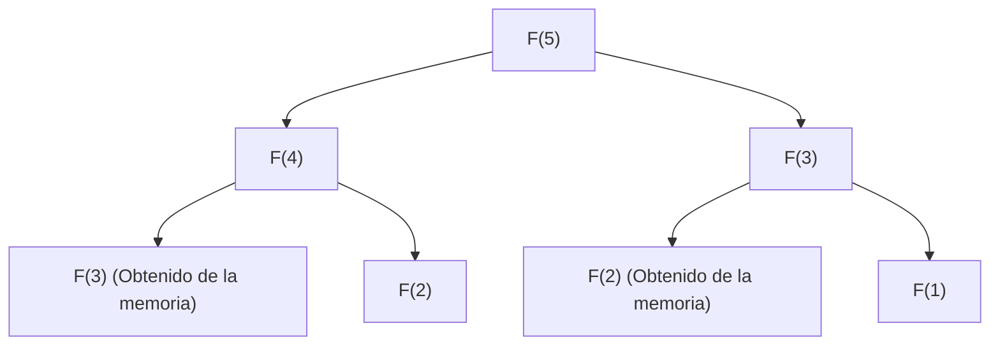

## Introducción: ¿Por qué es importante la Programación Dinámica?

En la ciencia de la computación y el diseño de algoritmos, nos enfrentamos a diario con diversos problemas complejos. Desde la optimización de rutas, la asignación de recursos, la alineación de secuencias en el procesamiento del lenguaje natural, hasta el aprendizaje por refuerzo más avanzado; encontrar la solución óptima de manera eficiente es un objetivo primordial.

Muchos de estos problemas causan una "explosión combinatoria" si se resuelven mediante un enfoque de fuerza bruta (Brute-force), donde el tiempo de cálculo aumenta exponencialmente, hasta el punto de no poder resolverse incluso tomando tanto tiempo como la vida del universo. Una de las armas más poderosas para romper este muro de complejidad computacional desesperante es la **Programación Dinámica (Dynamic Programming, DP)**.

En este artículo, profundizaremos desde la esencia de la programación dinámica hasta su pilar teórico, la **Ecuación de Bellman (Bellman Equation)**. Explicaremos todo detalladamente, comenzando con ejemplos concretos fáciles de entender incluso para principiantes, las propiedades centrales como la subestructura óptima y la superposición de subproblemas, las diferencias entre los enfoques de implementación de arriba hacia abajo (top-down) y de abajo hacia arriba (bottom-up), y sus aplicaciones en el aprendizaje por refuerzo y los Procesos de Decisión de Markov (MDP).

---

## 1. Historia de la Programación Dinámica y el origen de su nombre

La programación dinámica fue propuesta en la década de 1950 por el matemático estadounidense **Richard Bellman**. En la RAND Corporation donde trabajaba, en ese momento, se investigaban problemas de optimización militar y procesos de toma de decisiones de múltiples etapas.

Curiosamente, el término "Dynamic Programming" no tenía inicialmente el significado moderno de "programación de computadoras (codificación)". En aquella época, "Programming" significaba "planificar (Planning) o crear tablas (Tabular method)", de la misma manera que se usa, por ejemplo, en la "Programación Lineal (Linear Programming)". Además, existe la famosa anécdota de que Bellman eligió la palabra "Dynamic" para enfatizar el proceso de toma de decisiones de múltiples etapas donde la situación cambia a medida que pasa el tiempo, y porque era "una palabra poderosa que sonaría atractiva para los patrocinadores de la investigación (especialmente el Secretario de Defensa de entonces) y sería difícil de refutar".

Sin embargo, el respaldo matemático oculto detrás de su nombre pegadizo era real, y más tarde, a medida que las computadoras se generalizaron, establecería una posición firme como uno de los paradigmas más importantes del diseño de algoritmos.

---

## 2. Las "2 condiciones" que hacen posible la Programación Dinámica

Para resolver un problema de manera eficiente utilizando programación dinámica, el problema debe satisfacer las siguientes dos propiedades importantes.

### 2.1. Subestructura Óptima (Optimal Substructure)

La **Subestructura Óptima** es la propiedad de que "la solución óptima del problema general se compone de las soluciones óptimas de los subproblemas en los que se ha dividido".

Por ejemplo, supongamos que estamos buscando la ruta más corta desde la ciudad A hasta la ciudad C. Si sabemos que pasaremos por la ciudad B en el camino, la ruta más corta de A a C será la suma de "la ruta más corta de A a B" y "la ruta más corta de B a C". Si existiera un camino más corto de A a B, usarlo haría que la ruta de A a C fuera aún más corta. Por lo tanto, para optimizar el conjunto, las rutas parciales también deben estar optimizadas.

### 2.2. Superposición de Subproblemas (Overlapping Subproblems)

La **Superposición de Subproblemas** es la propiedad de que "en el proceso de dividir y resolver el problema, aparece exactamente el mismo subproblema repetidamente".

Un ejemplo típico es la secuencia de Fibonacci. Al definir la función que calcula el $n$-ésimo término de la secuencia de Fibonacci como $F(n) = F(n-1) + F(n-2)$, para calcular $F(5)$ necesitamos $F(4)$ y $F(3)$. Además, para calcular $F(4)$ necesitamos $F(3)$ y $F(2)$.
Lo que debemos notar aquí es que el cálculo de $F(3)$ aparece múltiples veces en diferentes ramas. Si calculamos esto por fuerza bruta, tomaría tiempo exponencial debido a la duplicación de cálculos. La programación dinámica reduce drásticamente la cantidad de cálculo al "memorizar el problema una vez resuelto y reutilizarlo la segunda vez y en las siguientes".

---

## 3. Diferencias de enfoques: Memorización (Top-down) vs Tabulación (Bottom-up)

La implementación de la programación dinámica se divide en general en dos enfoques. La idea subyacente de ambos es la "reutilización de los resultados de los cálculos", pero difieren en la dirección en que avanzan los cálculos.

### 3.1. Enfoque Top-down (Recursión con Memorización)

En el enfoque top-down, comenzamos con el gran problema original y lo resolvemos de forma recursiva mientras lo dividimos en problemas más pequeños. En este momento, las respuestas de los problemas pequeños una vez calculadas se guardan en una estructura de datos como un array o un hash map. A esto se le llama **Memorización (Memoization)**.

La ventaja de este enfoque es que la estructura del problema original se puede describir directamente como una función recursiva, lo que facilita que el código sea intuitivo. Además, dado que solo los subproblemas realmente necesarios dentro del espacio de estados se calculan bajo demanda, se pueden evitar cálculos innecesarios.

### 3.2. Enfoque Bottom-up (Tabulación)

En el enfoque bottom-up, los cálculos comienzan desde el subproblema más pequeño (y trivial), y utilizando esos resultados se calculan poco a poco las respuestas a problemas más grandes, llegando finalmente a la respuesta del problema deseado. En general, se prepara un array (tabla DP) y se rellenan los valores en orden desde un extremo mediante un proceso de bucle (iteración). A esto también se le llama **Tabulación (Tabulation)**.

La mayor ventaja del enfoque bottom-up es que no hay sobrecarga de llamadas a funciones (como el consumo de la pila de llamadas debido a la profundidad de la recursión), por lo que la velocidad de ejecución es rápida y la eficiencia de la memoria es más fácil de optimizar (por ejemplo, si solo necesitamos retener los dos últimos valores, la complejidad espacial a menudo se puede reducir a $O(1)$).

---

## 4. Análisis a través de un ejemplo concreto: El Problema de la Mochila

Para entender el poder de la programación dinámica, consideremos el problema clásico y práctico "Problema de la mochila 0-1 (0-1 Knapsack Problem)".

### Configuración del Problema
Un ladrón tiene una mochila con una capacidad $W$. Frente a él hay $n$ artículos, y cada artículo $i$ tiene un peso $w_i$ y un valor $v_i$. El ladrón quiere maximizar el valor total que se lleva a casa seleccionando artículos sin exceder la capacidad de la mochila. Para cada artículo solo puede "elegirlo (1)" o "no elegirlo (0)".

### Formulación mediante DP
Para resolver este problema, definiremos el "estado" y la "relación de recurrencia (ecuación de transición de estado)".

**Definición del estado:**
Definimos `DP[i][w]` como "el valor máximo de entre los primeros $i$ artículos, elegidos de manera que el peso total no exceda $w$".

**Construcción de la relación de recurrencia:**
Al considerar el artículo $i$, hay dos opciones.
1. **Si no elegimos el artículo $i$:**
   El valor no cambia y el margen de peso tampoco.
   `DP[i][w] = DP[i-1][w]`
2. **Si elegimos el artículo $i$ (solo si $w \ge w_i$):**
   Se añade el valor $v_i$ del artículo $i$, y la capacidad restante se convierte en $w - w_i$. A esta capacidad restante le sumamos el valor máximo que se puede obtener con hasta el artículo $i-1$.
   `DP[i][w] = DP[i-1][w - w_i] + v_i`

Por lo tanto, entre estas dos opciones, simplemente adoptamos la que proporcione el mayor valor.

$$ DP[i][w] = \max( DP[i-1][w], DP[i-1][w - w_i] + v_i ) $$

Esta relación de recurrencia no es más que la expresión matemática de la **subestructura óptima** en el problema de la mochila. La solución óptima general se compone del subproblema de "la solución óptima para la capacidad restante después de haber puesto el artículo $i$".

---

## 5. Elevación a la Ecuación de Bellman (Bellman Equation)

El enfoque de relación de recurrencia que hemos visto hasta ahora, de hecho, no es más que un ejemplo de aplicación específica de la **Ecuación de Bellman**.
Richard Bellman abstrajo el principio detrás de la programación dinámica de esta manera y lo formuló como el **Principio de Optimalidad (Principle of Optimality)**.

> "Una política óptima tiene la propiedad de que, sean cuales sean el estado inicial y la decisión inicial, las decisiones restantes deben constituir una política óptima con respecto al estado que resulta de la primera decisión."

La descripción matemática de este concepto es la Ecuación de Bellman. En general, en un modelo de transición de estados de tiempo discreto, la función de valor óptimo $V^*(s)$ en el estado $s$ se define de la siguiente manera:

$$ V^*(s) = \max_{a} \left\{ R(s, a) + \gamma V^*(s') \right\} $$

El significado de cada símbolo es el siguiente:
- $V^*(s)$ : El valor máximo de la suma de recompensas futuras (valor esperado) obtenidas al comenzar desde el estado $s$.
- $a$ : La acción (Action) que se puede tomar en el estado $s$.
- $R(s, a)$ : La recompensa inmediata (Reward) obtenida al tomar la acción $a$ en el estado $s$.
- $\gamma$ : El factor de descuento (Discount factor, $0 \le \gamma < 1$). Un parámetro que indica cuánto valoramos las recompensas futuras como valor presente.
- $s'$ : El estado siguiente al que se transiciona como resultado de tomar la acción $a$.

### Lo que significa la Ecuación de Bellman

Lo que esta ecuación sostiene es un hecho extremadamente simple pero poderoso: **"El valor óptimo del estado actual es el máximo, entre todas las acciones posibles, de la suma de la recompensa inmediata y el valor óptimo del estado siguiente"**.

Esto tiene esencialmente la misma estructura que la relación de recurrencia del problema de la mochila visto anteriormente. Es decir, divide un problema de optimización complejo de múltiples etapas en "un solo paso actual" y "todos los pasos posteriores (una estructura recursiva)".

---

## 6. Aplicaciones en el Aprendizaje por Refuerzo y los Procesos de Decisión de Markov (MDP)

En la inteligencia artificial moderna, especialmente en el **Aprendizaje por Refuerzo (Reinforcement Learning, RL)**, la ecuación de Bellman juega un papel teórico central.
Detrás de IA como AlphaGo derrotando al campeón mundial de Go o de robots aprendiendo a caminar, existe un marco probabilístico llamado Proceso de Decisión de Markov (MDP) y la Ecuación de Bellman para resolverlo.

En problemas del mundo real, el estado siguiente $s'$ después de tomar la acción $a$ no siempre se determina de manera determinista (por ejemplo, puede soplar viento y hacer que el robot avance en una dirección inesperada). Para tener en cuenta esta incertidumbre, se utilizan la **Ecuación de Expectativa de Bellman (Bellman Expectation Equation)** y la **Ecuación de Optimalidad de Bellman (Bellman Optimality Equation)**, que introducen probabilidades de transición de estado $P(s' | s, a)$.

$$ V^*(s) = \max_{a} \sum_{s'} P(s' | s, a) \left[ R(s, a, s') + \gamma V^*(s') \right] $$

Los principales algoritmos de aprendizaje por refuerzo, como el **Q-Learning** y la **Iteración de Valor (Value Iteration)**, son exactamente procesos para adquirir la política de comportamiento óptimo (política) resolviendo aproximadamente esta ecuación de Bellman calculándola repetidamente.

---

## Conclusión: La estética de divide y vencerás y la memorización

La programación dinámica y la ecuación de Bellman no son solo técnicas de programación. Se podría decir que son una "filosofía" para desglosar la toma de decisiones para sistemas enormes y complejos y un futuro incierto en unidades racionales y computables.

1. Se utiliza la **subestructura óptima** para dividir los problemas,
2. Los resultados de los cálculos de la **superposición de subproblemas** se memorizan (memorización, tabulación) para su reutilización, y
3. El valor presente y futuro están unidos recursivamente mediante la **Ecuación de Bellman**.

Entender profundamente estos conceptos no solo cultivará su capacidad para diseñar algoritmos más eficientes, sino que también le dará un método de pensamiento de propósito general (modelo mental) que se puede aplicar para resolver problemas complejos en los negocios y en la vida cotidiana.

Cuando se enfrente a un muro en la programación o se preocupe por el diseño de un algoritmo complejo, por favor, deténgase un momento y pregúntese: "¿No se puede expresar este problema como un conjunto de problemas más pequeños?" "¿Estoy olvidando los problemas que ya he resuelto y repitiendo los mismos cálculos?". Ahí, seguramente, estará la clave para abrir la puerta de la programación dinámica.
