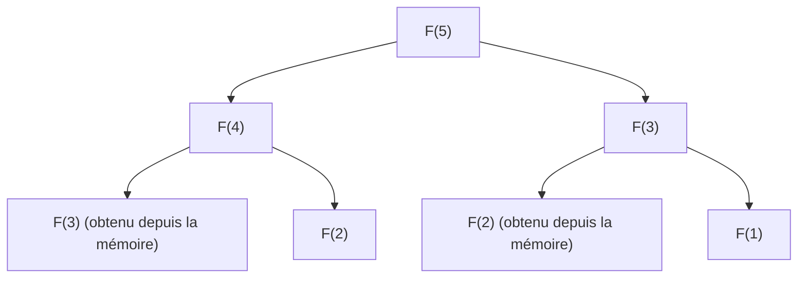

## Introduction : Pourquoi la programmation dynamique est-elle importante ?

Dans la conception d'algorithmes et en informatique, nous sommes quotidiennement confrontés à divers problèmes complexes. De l'optimisation d'itinéraires à l'allocation des ressources, en passant par l'alignement de séquences en traitement du langage naturel, jusqu'à l'apprentissage par renforcement de pointe, trouver efficacement la solution optimale est un impératif absolu.

La plupart de ces problèmes, s'ils sont abordés par une simple approche de force brute (Brute-force), voient leur temps de calcul augmenter de façon exponentielle, provoquant une "explosion combinatoire" impossible à résoudre même si l'on y consacrait toute la durée de vie de l'univers. L'une des armes les plus puissantes pour surmonter ce mur de calcul désespérant est la **programmation dynamique (Dynamic Programming, DP)**.

Dans cet article, nous explorerons en profondeur l'essence de la programmation dynamique jusqu'à son pilier théorique, l'**équation de Bellman (Bellman Equation)**. Nous commencerons par des exemples concrets faciles à comprendre pour les débutants, puis nous expliquerons de manière exhaustive les propriétés fondamentales telles que la sous-structure optimale et les sous-problèmes chevauchants, la différence entre les approches d'implémentation descendante (top-down) et ascendante (bottom-up), ainsi que ses applications à l'apprentissage par renforcement et au processus de décision markovien (MDP).

---

## 1. L'histoire de la programmation dynamique et l'origine de son nom

La programmation dynamique a été proposée dans les années 1950 par le mathématicien américain **Richard Bellman**. À la RAND Corporation, où il travaillait, on étudiait alors des problèmes d'optimisation militaire et des processus de prise de décision à étapes multiples.

Fait intéressant, le terme "Dynamic Programming" lui-même n'avait initialement aucune connotation de "programmation informatique (codage)" au sens moderne. À l'époque, "Programming" signifiait "planifier (Planning) ou créer des tableaux (Tabular method)", utilisé par exemple de la même manière que dans "programmation linéaire (Linear Programming)". De plus, on raconte que Bellman a choisi le mot "Dynamic" pour souligner le processus de prise de décision multi-étapes où la situation évolue avec le temps, et parce que c'était un "terme puissant, séduisant pour les sponsors de recherche (en particulier le secrétaire à la Défense de l'époque) et difficile à contredire".

Cependant, le fondement mathématique caché derrière ce nom accrocheur était bien réel et, avec la démocratisation des ordinateurs, il allait établir sa position en tant que l'un des paradigmes les plus importants de la conception d'algorithmes.

---

## 2. Les "2 conditions" pour que la programmation dynamique soit applicable

Pour résoudre efficacement un problème avec la programmation dynamique, ce problème doit satisfaire aux deux propriétés importantes suivantes.

### 2.1. Sous-structure optimale (Optimal Substructure)

La **sous-structure optimale** est la propriété selon laquelle "la solution optimale du problème global est constituée des solutions optimales des sous-problèmes dans lesquels il a été divisé".

Par exemple, supposons que nous cherchions le chemin le plus court pour aller de la ville A à la ville C. Si nous savons que nous devons passer par la ville B en cours de route, le chemin le plus court de A à C sera la somme du "chemin le plus court de A à B" et du "chemin le plus court de B à C". S'il existait un autre chemin plus court de A à B, nous l'utiliserions et le chemin de A à C serait encore plus court. Par conséquent, pour optimiser l'ensemble, les chemins partiels doivent également être optimisés.

### 2.2. Sous-problèmes chevauchants (Overlapping Subproblems)

Les **sous-problèmes chevauchants** désignent la propriété selon laquelle "lors du processus de division et de résolution du problème, les mêmes sous-problèmes apparaissent de manière répétée".

L'exemple typique est la suite de Fibonacci. Si nous définissons la fonction pour calculer le $n$-ième terme de la suite de Fibonacci comme $F(n) = F(n-1) + F(n-2)$, pour calculer $F(5)$, nous avons besoin de $F(4)$ et $F(3)$. De plus, pour calculer $F(4)$, nous avons besoin de $F(3)$ et $F(2)$.
Ce qu'il faut noter ici, c'est que le calcul de $F(3)$ apparaît plusieurs fois dans différentes branches. Si nous le calculons par force brute, cette duplication des calculs prendra un temps exponentiel. La programmation dynamique réduit considérablement la complexité de calcul en "mémorisant (memoization) les problèmes une fois résolus, et en les réutilisant les fois suivantes".

---

## 3. Différence d'approches : Mémoïsation (Top-down) vs Tabulation (Bottom-up)

Il y a globalement deux approches pour implémenter la programmation dynamique. Bien que l'idée sous-jacente des deux soit la "réutilisation des résultats de calcul", elles diffèrent dans la direction de progression du calcul.

### 3.1. Approche descendante (Mémoïsation récursive)

Dans l'approche descendante (top-down), nous partons du grand problème initial et le résolvons récursivement en le divisant en problèmes plus petits. Ce faisant, nous sauvegardons les réponses des petits problèmes déjà calculés dans une structure de données comme un tableau ou une table de hachage. C'est ce qu'on appelle la **mémoïsation (Memoization)**.

L'avantage de cette approche est que la structure du problème original peut être écrite telle quelle sous forme de fonction récursive, rendant le code généralement plus intuitif. De plus, comme nous ne calculons à la demande que les sous-problèmes réellement nécessaires de l'espace d'états, cela permet d'éviter des calculs inutiles.

### 3.2. Approche ascendante (Tabulation)

Dans l'approche ascendante (bottom-up), nous commençons le calcul par le sous-problème le plus petit (trivial), et utilisons ce résultat pour calculer progressivement la réponse à des problèmes plus grands, jusqu'à atteindre la réponse au problème que nous voulons résoudre. En général, on prépare un tableau (table DP) et on remplit les valeurs dans l'ordre avec une boucle (itération). C'est ce qu'on appelle la **tabulation (Tabulation)**.

Le plus grand avantage de l'approche bottom-up est l'absence de surcoût lié aux appels de fonction (comme la consommation de la pile d'appels due à la profondeur de la récursion), ce qui permet une exécution plus rapide et facilite l'optimisation de l'efficacité de la mémoire (par exemple, si l'on a besoin de conserver seulement les deux dernières valeurs, la complexité spatiale peut être réduite à $O(1)$).

---

## 4. Étude via un exemple concret : Le problème du sac à dos

Pour comprendre la puissance de la programmation dynamique, considérons le problème classique et pratique du "problème du sac à dos 0-1" (0-1 Knapsack problem).

### Définition du problème
Un voleur possède un sac à dos d'une capacité $W$. Devant lui se trouvent $n$ objets, et pour chaque objet $i$ sont définis un poids $w_i$ et une valeur $v_i$. Le voleur souhaite maximiser la valeur totale rapportée en choisissant des objets sans dépasser la capacité de son sac à dos. Chaque objet peut soit être "choisi (1)" soit "non choisi (0)".

### Formulation par DP
Pour résoudre ce problème, nous définissons un "état" et une "relation de récurrence (équation de transition d'état)".

**Définition de l'état :**
Nous définissons `DP[i][w]` comme "la valeur maximale obtenue en choisissant parmi les premiers $i$ objets de sorte que le poids total ne dépasse pas $w$".

**Construction de la relation de récurrence :**
Lorsqu'on considère l'objet $i$, il y a deux choix possibles.
1. **Si l'on ne choisit pas l'objet $i$ :**
   La valeur ne change pas et la capacité restante du poids ne change pas non plus.
   `DP[i][w] = DP[i-1][w]`
2. **Si l'on choisit l'objet $i$ (seulement si $w \ge w_i$) :**
   La valeur $v_i$ de l'objet $i$ s'ajoute, et la capacité restante devient $w - w_i$. À cette capacité restante, nous ajoutons la valeur maximale obtenue jusqu'à l'objet $i-1$.
   `DP[i][w] = DP[i-1][w - w_i] + v_i`

Par conséquent, il suffit de choisir celle de ces deux options qui donne la plus grande valeur.

$$ DP[i][w] = \max( DP[i-1][w], DP[i-1][w - w_i] + v_i ) $$

Cette relation de récurrence est l'expression mathématique même de la **sous-structure optimale** dans le problème du sac à dos. La solution optimale globale est composée du sous-problème de "la solution optimale pour la capacité restante après avoir ajouté l'objet $i$".

---

## 5. Sublimation vers l'Équation de Bellman (Bellman Equation)

L'approche de la relation de récurrence que nous avons vue jusqu'à présent n'est en réalité qu'une application concrète de l'**équation de Bellman**.
Richard Bellman a abstrait le principe sous-jacent à cette programmation dynamique et l'a formalisé en tant que **principe d'optimalité (Principle of Optimality)**.

> "Une politique optimale a la propriété que quels que soient l'état initial et la décision initiale, les décisions restantes doivent constituer une politique optimale par rapport à l'état résultant de la première décision."

La description mathématique de ce concept est l'équation de Bellman. En général, dans un modèle de transition d'état à temps discret, la fonction de valeur optimale $V^*(s)$ à l'état $s$ est définie comme suit.

$$ V^*(s) = \max_{a} \left\{ R(s, a) + \gamma V^*(s') \right\} $$

La signification de chaque symbole est la suivante :
- $V^*(s)$ : La valeur maximale de la somme des récompenses (espérance) que l'on peut obtenir à l'avenir en partant de l'état $s$.
- $a$ : L'action (Action) qui peut être entreprise à l'état $s$.
- $R(s, a)$ : La récompense (Reward) immédiate obtenue en effectuant l'action $a$ à l'état $s$.
- $\gamma$ : Le facteur de dépréciation (Discount factor, $0 \le \gamma < 1$). Un paramètre indiquant à quel point les récompenses futures sont évaluées à leur valeur actuelle.
- $s'$ : L'état suivant résultant de l'action $a$.

### Ce que signifie l'équation de Bellman

Ce que cette équation affirme est un fait extrêmement simple et puissant : **"La valeur optimale de l'état actuel est le maximum, parmi toutes les actions possibles, de la somme de la récompense obtenue immédiatement et de la valeur optimale de l'état suivant."**

Ceci possède fondamentalement la même structure que la relation de récurrence du problème du sac à dos vu précédemment. En d'autres termes, elle divise un problème d'optimisation multi-étapes complexe en "l'étape actuelle" et "toutes les étapes suivantes (structure récursive)".

---

## 6. Applications à l'apprentissage par renforcement et au processus de décision markovien (MDP)

Dans l'intelligence artificielle moderne, en particulier dans l'**apprentissage par renforcement (Reinforcement Learning, RL)**, l'équation de Bellman joue un rôle théorique central.
Derrière le fait qu'une IA comme AlphaGo ait vaincu le champion du monde de Go ou qu'un robot apprenne à marcher, il y a un cadre probabiliste appelé Processus de Décision Markovien (MDP) et l'équation de Bellman pour le résoudre.

Dans les problèmes du monde réel, l'état suivant $s'$ après avoir entrepris une action $a$ n'est pas toujours déterminé de manière déterministe (le vent peut souffler et le robot peut aller dans une direction inattendue). Pour tenir compte de cette incertitude, on utilise l'**équation d'espérance de Bellman (Bellman Expectation Equation)** ou l'**équation d'optimalité de Bellman (Bellman Optimality Equation)** qui introduisent la probabilité de transition d'état $P(s' | s, a)$.

$$ V^*(s) = \max_{a} \sum_{s'} P(s' | s, a) \left[ R(s, a, s') + \gamma V^*(s') \right] $$

Les algorithmes majeurs de l'apprentissage par renforcement, tels que le **Q-learning** et l'**itération de valeur (Value Iteration)**, sont précisément le processus d'acquisition d'une politique optimale (policy) en calculant de manière répétée cette équation de Bellman pour la résoudre de façon approchée.

---

## Conclusion : L'esthétique de diviser pour régner et de la mémoire

La programmation dynamique et l'équation de Bellman ne sont pas de simples techniques de programmation. On pourrait dire que c'est une "philosophie" pour décomposer la prise de décision face à des systèmes énormes et complexes ou à un avenir incertain, en unités rationnelles et calculables.

1. Diviser le problème en utilisant la **sous-structure optimale**,
2. Mémoriser (mémoïsation, tabulation) et réutiliser les résultats de calcul des **sous-problèmes chevauchants**, et
3. Relier récursivement la valeur présente et future via l'**équation de Bellman**.

Comprendre profondément ces concepts ne vous aidera pas seulement à concevoir des algorithmes plus efficaces, mais vous fournira également un modèle mental polyvalent qui peut être appliqué à la résolution de problèmes complexes dans les affaires et la vie quotidienne.

Lorsque vous vous heurtez à un mur en programmation ou que vous luttez avec la conception d'un algorithme complexe, arrêtez-vous un instant et demandez-vous : "Ce problème peut-il être exprimé comme un ensemble de problèmes plus petits ?" ou "Ne suis-je pas en train d'oublier des problèmes déjà résolus et de répéter les mêmes calculs ?". C'est là que se trouve la clé pour ouvrir la porte de la programmation dynamique.
