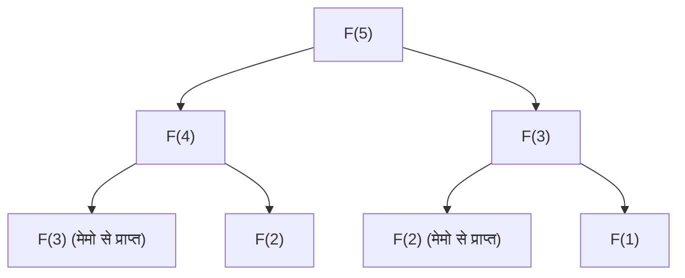

## परिचय: डायनेमिक प्रोग्रामिंग क्यों महत्वपूर्ण है?

कंप्यूटर विज्ञान और एल्गोरिदम डिज़ाइन में, हम हर दिन विभिन्न जटिल समस्याओं का सामना करते हैं। रूट ऑप्टिमाइज़ेशन, रिसोर्स एलोकेशन, नेचुरल लैंग्वेज प्रोसेसिंग में सीक्वेंस अलाइनमेंट और यहाँ तक कि अत्याधुनिक सुदृढीकरण शिक्षा (reinforcement learning) तक, सर्वोत्तम समाधान को कुशलतापूर्वक ढूँढना एक सर्वोच्च प्राथमिकता है।

इनमें से कई समस्याओं के लिए, एक सरल ब्रूट-फोर्स (Brute-force) दृष्टिकोण से गणना के समय में घातीय (exponential) वृद्धि होती है, जो "कॉम्बिनेटोरियल विस्फोट (combinatorial explosion)" का कारण बनती है, जिसे ब्रह्मांड के जीवनकाल जितना समय देकर भी हल नहीं किया जा सकता है। गणना की इस निराशाजनक दीवार को तोड़ने के लिए सबसे शक्तिशाली हथियारों में से एक **डायनेमिक प्रोग्रामिंग (Dynamic Programming, DP)** है।

इस लेख में, हम डायनेमिक प्रोग्रामिंग के सार से लेकर इसके सैद्धांतिक स्तंभ **बेलमैन समीकरण (Bellman Equation)** तक गहराई से चर्चा करेंगे। हम शुरुआती लोगों के लिए समझने में आसान ठोस उदाहरणों से शुरू करेंगे, और इष्टतम उपसंरचना (optimal substructure) और अतिव्यापी उपसमस्याओं (overlapping subproblems) जैसी मुख्य विशेषताओं, टॉप-डाउन और बॉटम-अप कार्यान्वयन दृष्टिकोणों के बीच के अंतर, और सुदृढीकरण शिक्षा (reinforcement learning) और मार्कोव निर्णय प्रक्रियाओं (MDP) में उनके अनुप्रयोगों को विस्तार से समझाएंगे।

---

## 1. डायनेमिक प्रोग्रामिंग का इतिहास और नाम की उत्पत्ति

डायनेमिक प्रोग्रामिंग को 1950 के दशक में अमेरिकी गणितज्ञ **रिचर्ड बेलमैन (Richard Bellman)** द्वारा प्रस्तावित किया गया था। उस समय वह रैंड कॉर्पोरेशन (RAND Corporation) में काम कर रहे थे, जहाँ वे सैन्य अनुकूलन (optimization) समस्याओं और बहु-चरणीय (multi-stage) निर्णय प्रक्रियाओं पर शोध कर रहे थे।

दिलचस्प बात यह है कि "Dynamic Programming" शब्द का अर्थ शुरू में आधुनिक अर्थों में "कंप्यूटर प्रोग्रामिंग (कोडिंग)" नहीं था। उस समय "Programming" का अर्थ "योजना बनाना (Planning) या सारणीबद्ध विधि (Tabular method) बनाना" था, और इसका उपयोग "लीनियर प्रोग्रामिंग (Linear Programming)" के समान किया जाता था। इसके अलावा, एक प्रसिद्ध किस्सा है कि बेलमैन ने "Dynamic" शब्द को बहु-चरणीय निर्णय प्रक्रिया पर ज़ोर देने के लिए चुना, जहाँ स्थिति समय के साथ बदलती है, और क्योंकि यह "अनुसंधान के प्रायोजकों (विशेष रूप से तत्कालीन रक्षा सचिव) को आकर्षक लगता था, और यह एक ऐसा शक्तिशाली शब्द था जिसका विरोध करना कठिन था।"

हालांकि, इस आकर्षक नाम के पीछे का गणितीय आधार वास्तविक है, और जैसे-जैसे कंप्यूटर अधिक व्यापक होते गए, इसने एल्गोरिदम डिज़ाइन के सबसे महत्वपूर्ण प्रतिमानों (paradigms) में से एक के रूप में खुद को मजबूती से स्थापित किया।

---

## 2. डायनेमिक प्रोग्रामिंग को स्थापित करने वाली "2 शर्तें"

डायनेमिक प्रोग्रामिंग का उपयोग करके किसी समस्या को कुशलतापूर्वक हल करने के लिए, समस्या को निम्नलिखित दो महत्वपूर्ण गुणों को पूरा करना चाहिए।

### 2.1. इष्टतम उपसंरचना (Optimal Substructure)

**इष्टतम उपसंरचना** का अर्थ है कि "समस्या के लिए एक इष्टतम समाधान में इसके उपसमस्याओं के इष्टतम समाधान शामिल हैं।"

उदाहरण के लिए, मान लें कि आप शहर A से शहर C तक का सबसे छोटा रास्ता खोज रहे हैं। यदि आप जानते हैं कि आप रास्ते में शहर B से होकर गुजरेंगे, तो A से C तक का सबसे छोटा मार्ग "A से B का सबसे छोटा मार्ग" और "B से C का सबसे छोटा मार्ग" का योग होगा। यदि A से B तक कोई अन्य छोटा रास्ता है, तो उसका उपयोग करने से A से C तक का रास्ता भी छोटा हो जाएगा। इसलिए, समग्र रूप से अनुकूलित करने के लिए, आंशिक मार्गों को भी अनुकूलित किया जाना चाहिए।

### 2.2. अतिव्यापी उपसमस्याएँ (Overlapping Subproblems)

**अतिव्यापी उपसमस्याएँ** इस गुण को संदर्भित करती हैं कि "समस्या को उपसमस्याओं में विभाजित करने और हल करने की प्रक्रिया में बिल्कुल वैसी ही उपसमस्याएँ बार-बार प्रकट होती हैं।"

एक विशिष्ट उदाहरण फाइबोनैचि अनुक्रम (Fibonacci sequence) है। यदि हम फाइबोनैचि अनुक्रम के $n$-वें पद को खोजने के लिए फ़ंक्शन को $F(n) = F(n-1) + F(n-2)$ के रूप में परिभाषित करते हैं, तो $F(5)$ की गणना करने के लिए $F(4)$ और $F(3)$ की आवश्यकता होती है। इसके अतिरिक्त, $F(4)$ की गणना करने के लिए $F(3)$ और $F(2)$ की आवश्यकता होती है।
यहां ध्यान देने योग्य बात यह है कि $F(3)$ की गणना विभिन्न शाखाओं (branches) में कई बार होती है। यदि हम इसे ब्रूट-फोर्स द्वारा गणना करते हैं, तो इस दोहराव के कारण घातीय समय (exponential time) लगेगा। डायनेमिक प्रोग्रामिंग "एक बार हल की गई समस्याओं को याद रखकर (मेमोइज़ेशन) और बाद में उनका पुन: उपयोग करके" गणनाओं को नाटकीय रूप से कम कर देती है।

---

## 3. दृष्टिकोण में अंतर: मेमोइज़ेशन (टॉप-डाउन) बनाम टेबुलेशन (बॉटम-अप)

डायनेमिक प्रोग्रामिंग को लागू करने के मुख्य रूप से दो दृष्टिकोण हैं। दोनों का मूल विचार "गणना परिणामों का पुन: उपयोग" है, लेकिन जिस दिशा में गणना आगे बढ़ती है, उसमें अंतर होता है।

### 3.1. टॉप-डाउन दृष्टिकोण (मेमोइज़ेशन के साथ रिकर्सन)

टॉप-डाउन दृष्टिकोण में, हम मूल बड़ी समस्या से शुरू करते हैं और इसे छोटी समस्याओं में विभाजित करते हुए पुनरावर्ती (recursively) रूप से हल करते हैं। इस समय, एक बार गणना की गई छोटी समस्याओं के उत्तरों को एरे या हैश मैप जैसी डेटा संरचनाओं में सहेजा जाता है। इसे **मेमोइज़ेशन (Memoization)** कहा जाता है।

इस दृष्टिकोण का लाभ यह है कि कोड सहज (intuitive) होता है क्योंकि मूल समस्या की संरचना को पुनरावर्ती फ़ंक्शन (recursive function) के रूप में सीधे वर्णित किया जा सकता है। इसके अलावा, चूँकि स्टेट स्पेस में केवल वास्तव में आवश्यक उपसमस्याओं की गणना ऑन-डिमांड की जाती है, इसलिए अनावश्यक गणनाओं से बचा जा सकता है।

### 3.2. बॉटम-अप दृष्टिकोण (टेबुलेशन विधि)

बॉटम-अप दृष्टिकोण में, गणना सबसे छोटी (तुच्छ) उपसमस्या से शुरू होती है, और इसके परिणामों का उपयोग थोड़ी बड़ी समस्या के उत्तर की गणना करने के लिए किया जाता है, और अंततः उस समस्या के उत्तर तक पहुँचते हैं जिसे हम ढूँढना चाहते हैं। आम तौर पर, एक एरे (DP टेबल) तैयार की जाती है और लूप (iteration) प्रोसेसिंग का उपयोग करके किनारों से एक-एक करके मान भरे जाते हैं। इसे **टेबुलेशन (Tabulation)** भी कहा जाता है।

बॉटम-अप का सबसे बड़ा लाभ यह है कि इसमें फ़ंक्शन कॉल ओवरहेड नहीं होता है (जैसे रिकर्सन की गहराई के कारण कॉल स्टैक की खपत), इसलिए निष्पादन की गति तेज होती है, और मेमोरी दक्षता को अनुकूलित करना आसान होता है (उदाहरण के लिए, यदि आपको केवल पिछले दो मानों को रखने की आवश्यकता है, तो स्पेस जटिलता को $O(1)$ तक कम किया जा सकता है)।

---

## 4. एक ठोस उदाहरण के साथ विचार: नैपसैक समस्या (Knapsack Problem)

डायनेमिक प्रोग्रामिंग की शक्ति को समझने के लिए, आइए एक क्लासिक और व्यावहारिक समस्या, "0-1 नैपसैक समस्या" पर विचार करें।

### समस्या की सेटिंग
एक चोर के पास $W$ क्षमता वाला एक नैपसैक (knapsack) है। उसके सामने $n$ वस्तुएं (items) हैं, और प्रत्येक वस्तु $i$ का वजन $w_i$ और मूल्य $v_i$ है। चोर नैपसैक की क्षमता को पार किए बिना वस्तुओं को चुनना चाहता है ताकि ले जाए जाने वाले कुल मूल्य को अधिकतम किया जा सके। प्रत्येक वस्तु को या तो "चुनना है (1)" या "नहीं चुनना है (0)"।

### DP का उपयोग करके निर्माण (Formulation)
इस समस्या को हल करने के लिए, हम "स्थिति (State)" और "पुनरावृत्ति संबंध (Recurrence relation / State transition equation)" को परिभाषित करेंगे।

**स्थिति की परिभाषा:**
हम `DP[i][w]` को "पहली $i$ वस्तुओं में से इस तरह से चुनने पर अधिकतम मूल्य ताकि कुल वजन $w$ से अधिक न हो" के रूप में परिभाषित करते हैं।

**पुनरावृत्ति संबंध का निर्माण:**
वस्तु $i$ पर विचार करते समय, दो विकल्प होते हैं।
1. **यदि वस्तु $i$ नहीं चुनी जाती है:**
   मूल्य नहीं बदलता है, और वजन की क्षमता भी नहीं बदलती है।
   `DP[i][w] = DP[i-1][w]`
2. **यदि वस्तु $i$ चुनी जाती है (केवल जब $w \ge w_i$):**
   वस्तु $i$ का मूल्य $v_i$ जुड़ जाता है, और शेष क्षमता $w - w_i$ हो जाती है। इस शेष क्षमता के लिए, वस्तु $i-1$ तक प्राप्त किए जा सकने वाले अधिकतम मूल्य को जोड़ दिया जाता है।
   `DP[i][w] = DP[i-1][w - w_i] + v_i`

इसलिए, हमें बस इन दो विकल्पों में से वह विकल्प अपनाना है जो अधिक मूल्य देता है।

$$ DP[i][w] = \max( DP[i-1][w], DP[i-1][w - w_i] + v_i ) $$

यह पुनरावृत्ति संबंध वास्तव में नैपसैक समस्या में **इष्टतम उपसंरचना** को गणितीय सूत्र (mathematical formula) के रूप में व्यक्त करता है। समग्र इष्टतम समाधान "वस्तु $i$ को शामिल करने के बाद शेष क्षमता के लिए इष्टतम समाधान" के उपसमस्या (subproblem) से बना है।

---

## 5. बेलमैन समीकरण (Bellman Equation) का विकास

हमने अब तक जो पुनरावृत्ति संबंध दृष्टिकोण देखा है, वह वास्तव में **बेलमैन समीकरण** का एक ठोस अनुप्रयोग (application) है।
रिचर्ड बेलमैन ने इस प्रकार की डायनेमिक प्रोग्रामिंग के पीछे के सिद्धांत को सारगर्भित (abstract) किया और इसे **इष्टतमता का सिद्धांत (Principle of Optimality)** के रूप में तैयार किया।

> "एक इष्टतम नीति (optimal policy) में यह गुण होता है: प्रारंभिक स्थिति और प्रारंभिक निर्णय जो भी हों, शेष निर्णयों को पहले निर्णय के परिणामस्वरूप होने वाली स्थिति के संबंध में एक इष्टतम नीति का गठन करना चाहिए।"

इस अवधारणा का गणितीय वर्णन बेलमैन समीकरण है। आम तौर ক্যাম तौर पर, एक असतत-समय (discrete-time) राज्य संक्रमण मॉडल (state transition model) में, किसी राज्य (state) $s$ पर इष्टतम मूल्य फ़ंक्शन $V^*(s)$ को निम्नानुसार परिभाषित किया जाता है:

$$ V^*(s) = \max_{a} \left\{ R(s, a) + \gamma V^*(s') \right\} $$

प्रत्येक प्रतीक का अर्थ इस प्रकार है:
- $V^*(s)$ : यदि हम राज्य $s$ से शुरू करते हैं तो भविष्य में प्राप्त होने वाले पुरस्कारों (rewards) के कुल (अपेक्षित मूल्य) का अधिकतम मान।
- $a$ : वह क्रिया (Action) जो राज्य $s$ में की जा सकती है।
- $R(s, a)$ : राज्य $s$ में क्रिया $a$ करने पर तुरंत प्राप्त होने वाला पुरस्कार (Reward)।
- $\gamma$ : छूट दर (Discount factor, $0 \le \gamma < 1$)। यह पैरामीटर दर्शाता है कि वर्तमान मूल्य के रूप में भविष्य के पुरस्कारों का कितना अनुमान लगाया जाए।
- $s'$ : वह अगली स्थिति जो क्रिया $a$ करने के परिणामस्वरूप परिवर्तित (transition) होती है।

### बेलमैन समीकरण का अर्थ

यह समीकरण क्या दावा करता है, वह यह अत्यंत सरल और शक्तिशाली तथ्य है कि **"वर्तमान स्थिति का इष्टतम मूल्य तुरंत प्राप्त होने वाले पुरस्कार और अगले स्थिति के इष्टतम मूल्य के योग को सभी संभावित क्रियाओं में अधिकतम करना है।"**

यह अनिवार्य रूप से पहले नैपसैक समस्या के पुनरावृत्ति संबंध के समान ही संरचना है। दूसरे शब्दों में, यह एक जटिल बहु-चरणीय अनुकूलन समस्या को "वर्तमान 1 चरण" और "बाद के सभी चरणों (पुनरावर्ती संरचना)" में विभाजित कर रहा है।

---

## 6. सुदृढीकरण शिक्षा (Reinforcement Learning) और मार्कोव निर्णय प्रक्रिया (MDP) में अनुप्रयोग

आधुनिक कृत्रिम बुद्धिमत्ता (Artificial Intelligence), विशेष रूप से **सुदृढीकरण शिक्षा (Reinforcement Learning, RL)** में, बेलमैन समीकरण एक सैद्धांतिक कोर (theoretical core) के रूप में कार्य करता है।
अल्फागो (AlphaGo) जैसे एआई (AI) द्वारा गो (Go) के विश्व चैंपियन को हराने, या रोबोट द्वारा चलना सीखने के पीछे, मार्कोव डिसीजन प्रोसेस (MDP) नामक एक संभाव्य ढांचा (probabilistic framework) और इसे हल करने के लिए बेलमैन समीकरण मौजूद है।

वास्तविक दुनिया की समस्याओं में, यह हमेशा निश्चित नहीं होता है कि कोई कार्रवाई $a$ करने के बाद अगली स्थिति $s'$ नियतात्मक (deterministically) रूप से तय की जाएगी (हवा चल सकती है और रोबोट अप्रत्याशित दिशा में जा सकता है)। इस अनिश्चितता को ध्यान में रखने के लिए, राज्य संक्रमण संभावना $P(s' | s, a)$ को शामिल करने वाले **बेलमैन एक्सपेक्टेशन इक्वेशन (Bellman Expectation Equation)** और **बेलमैन ऑप्टिमेलिटी इक्वेशन (Bellman Optimality Equation)** का उपयोग किया जाता है।

$$ V^*(s) = \max_{a} \sum_{s'} P(s' | s, a) \left[ R(s, a, s') + \gamma V^*(s') \right] $$

सुदृढीकरण शिक्षा के मुख्य एल्गोरिदम, **क्यू-लर्निंग (Q-Learning)** और **वैल्यू इटरेशन (Value Iteration)**, इष्टतम कार्रवाई दिशानिर्देश (नीतियां) प्राप्त करने की प्रक्रियाएं हैं जो इस बेलमैन समीकरण की बार-बार गणना करके और इसे लगभग हल करके प्राप्त की जाती हैं।

---

## निष्कर्ष: फूट डालो और राज करो (Divide and Conquer) और स्मृति का सौंदर्यशास्त्र

डायनेमिक प्रोग्रामिंग और बेलमैन समीकरण केवल प्रोग्रामिंग तकनीक नहीं हैं। उन्हें बड़े, जटिल प्रणालियों और अनिश्चित वायदों के लिए निर्णय लेने को तर्कसंगत और गणना योग्य इकाइयों में विभाजित करने के "दर्शन" के रूप में भी माना जा सकता है।

1. समस्याओं को विभाजित करने के लिए **इष्टतम उपसंरचना** का उपयोग करें,
2. **अतिव्यापी उपसमस्याओं** के गणना परिणामों को याद रखें (मेमोइज़ेशन / टेबुलेशन) और पुन: उपयोग करें,
3. **बेलमैन समीकरण** द्वारा वर्तमान और भविष्य के मूल्यों को पुनरावर्ती (recursively) रूप से जोड़ें।

इन अवधारणाओं को गहराई से समझने से न केवल अधिक कुशल एल्गोरिदम डिजाइन करने की क्षमता विकसित होगी, बल्कि यह एक बहुमुखी सोच विधि (मानसिक मॉडल) भी प्रदान करेगा जिसे व्यवसाय और दैनिक जीवन में जटिल समस्या समाधान के लिए लागू किया जा सकता है।

जब आप प्रोग्रामिंग की दीवार से टकराते हैं या किसी जटिल एल्गोरिदम को डिज़ाइन करने के बारे में चिंता करते हैं, तो कृपया रुकें और खुद से पूछें: "क्या इस समस्या को छोटी समस्याओं के संग्रह के रूप में व्यक्त किया जा सकता है?" और "क्या मैं उन समस्याओं को भूल रहा हूँ जिन्हें मैंने पहले ही हल कर लिया है और उसी गणना को दोहरा रहा हूँ?"। डायनेमिक प्रोग्रामिंग का द्वार खोलने की कुंजी निश्चित रूप से वहीं होगी।
