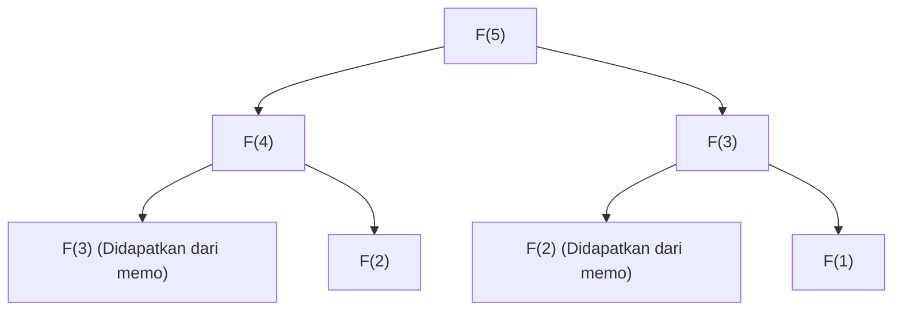

## Pendahuluan: Mengapa Pemrograman Dinamis Penting?

Dalam ilmu komputer dan desain algoritma, kita menghadapi berbagai masalah kompleks setiap harinya. Dari optimasi rute, alokasi sumber daya, penyelarasan urutan dalam pemrosesan bahasa alami, hingga pembelajaran penguatan (reinforcement learning) mutakhir, menemukan solusi optimal secara efisien adalah prioritas utama.

Banyak dari masalah ini yang jika diselesaikan dengan pendekatan *brute-force* sederhana, waktu komputasinya akan meningkat secara eksponensial, menyebabkan "ledakan kombinasi" yang bahkan jika memakan waktu seumur alam semesta pun tidak akan dapat diselesaikan. Salah satu senjata paling ampuh untuk menembus dinding batas komputasi yang putus asa ini adalah **Pemrograman Dinamis (Dynamic Programming, DP)**.

Dalam artikel ini, kita akan menggali lebih dalam mulai dari esensi pemrograman dinamis, hingga pilar teoretisnya, yaitu **Persamaan Bellman (Bellman Equation)**. Kita akan menjelaskan secara menyeluruh mulai dari contoh konkret yang mudah dipahami pemula, sifat-sifat inti seperti substruktur optimal (optimal substructure) dan masalah tumpang tindih (overlapping subproblems), perbedaan antara pendekatan implementasi *top-down* dan *bottom-up*, serta aplikasinya pada pembelajaran penguatan dan Proses Keputusan Markov (Markov Decision Process, MDP).

---

## 1. Sejarah Pemrograman Dinamis dan Asal Usul Namanya

Pemrograman Dinamis diusulkan pada tahun 1950-an oleh ahli matematika Amerika, **Richard Bellman**. Di RAND Corporation tempat ia bekerja, pada saat itu mereka sedang meneliti masalah optimasi militer dan proses pengambilan keputusan multi-tahap.

Menariknya, kata "Dynamic Programming" itu sendiri pada awalnya tidak memiliki konotasi "pemrograman komputer (coding)" dalam arti modern. "Programming" pada saat itu berarti "membuat rencana (Planning) atau membuat metode tabular (Tabular method)", penggunaannya sama seperti pada "Linear Programming" (Pemrograman Linear). Selain itu, terdapat anekdot terkenal bahwa kata "Dynamic" dipilih oleh Bellman sendiri untuk menekankan proses pengambilan keputusan multi-tahap (multi-stage) di mana situasi berubah seiring berjalannya waktu, dan sebagai "kata yang kuat yang terdengar menarik dan sulit dibantah oleh sponsor dana penelitian (terutama Menteri Pertahanan saat itu)".

Namun, landasan matematis yang tersembunyi di balik nama yang menarik itu adalah nyata, dan seiring dengan populernya komputer, ia membangun posisi yang kokoh sebagai salah satu paradigma paling penting dalam desain algoritma.

---

## 2. "Dua Syarat" yang Menjadikan Pemrograman Dinamis Bekerja

Untuk memecahkan suatu masalah secara efisien menggunakan pemrograman dinamis, masalah tersebut harus memenuhi dua sifat penting berikut.

### 2.1. Substruktur Optimal (Optimal Substructure)

**Substruktur Optimal** adalah sifat di mana "solusi optimal dari masalah secara keseluruhan terbentuk dari solusi optimal sub-masalah yang dibagi dari masalah tersebut".

Misalnya, mari kita asumsikan kita sedang mencari rute terpendek dari kota A ke kota C. Jika diketahui bahwa kita akan melewati kota B di tengah jalan, rute terpendek dari A ke C akan menjadi penjumlahan dari "rute terpendek dari A ke B" dan "rute terpendek dari B ke C". Jika ada rute lain yang lebih pendek dari A ke B, maka dengan menggunakan rute tersebut, rute dari A ke C juga seharusnya menjadi lebih pendek. Oleh karena itu, untuk mengoptimalkan keseluruhan, rute parsial juga harus dioptimalkan.

### 2.2. Sub-masalah yang Tumpang Tindih (Overlapping Subproblems)

**Sub-masalah yang Tumpang Tindih** adalah sifat di mana "dalam proses membagi dan memecahkan masalah, sub-masalah yang persis sama muncul berulang kali".

Contoh klasiknya adalah deret Fibonacci. Ketika kita mendefinisikan fungsi untuk mencari suku ke-$n$ dari deret Fibonacci sebagai $F(n) = F(n-1) + F(n-2)$, untuk menghitung $F(5)$ kita memerlukan $F(4)$ dan $F(3)$. Lebih lanjut, untuk menghitung $F(4)$ kita memerlukan $F(3)$ dan $F(2)$.
Yang perlu diperhatikan di sini adalah bahwa komputasi $F(3)$ muncul berulang kali di berbagai cabang yang berbeda. Jika dihitung menggunakan *brute-force*, duplikasi perhitungan ini akan memakan waktu eksponensial. Pemrograman dinamis secara drastis mengurangi waktu komputasi dengan cara "mengingat (memo) masalah yang telah diselesaikan sekali, dan menggunakannya kembali di waktu berikutnya".

---

## 3. Perbedaan Pendekatan: Memoization (Top-down) vs Tabulation (Bottom-up)

Implementasi pemrograman dinamis secara luas dibagi menjadi dua pendekatan. Ide dasar keduanya adalah "penggunaan kembali hasil komputasi", tetapi ada perbedaan dalam arah perhitungannya.

### 3.1. Pendekatan Top-down (Rekursi Memoization)

Pada pendekatan *top-down*, kita mulai dari masalah awal yang besar dan menyelesaikannya secara rekursif sambil membaginya menjadi masalah-masalah kecil. Pada saat ini, jawaban dari masalah kecil yang telah dihitung sekali disimpan dalam struktur data seperti array atau *hash map*. Hal ini disebut **Memoization**.

Keuntungan dari pendekatan ini adalah karena struktur dari masalah aslinya dapat dituliskan langsung sebagai fungsi rekursif, kodenya cenderung menjadi intuitif. Selain itu, dari seluruh ruang keadaan (state space), hanya sub-masalah yang benar-benar dibutuhkan yang dihitung *on-demand*, sehingga dapat menghemat komputasi yang sia-sia.

### 3.2. Pendekatan Bottom-up (Metode Tabulation)

Pada pendekatan *bottom-up*, perhitungan dimulai dari sub-masalah yang paling kecil (trivial), dan menggunakan hasilnya untuk menghitung jawaban dari masalah yang sedikit lebih besar langkah demi langkah, hingga akhirnya mencapai jawaban dari masalah yang ingin diselesaikan. Secara umum, ini melibatkan penyiapan array (tabel DP) dan mengisi nilainya secara berurutan dari ujung menggunakan pemrosesan perulangan (iterasi). Ini juga disebut **Tabulation**.

Keuntungan terbesar dari *bottom-up* adalah tidak adanya *overhead* dari pemanggilan fungsi (seperti konsumsi *call stack* akibat kedalaman rekursi), sehingga kecepatan eksekusinya cepat dan efisiensi memori mudah dioptimalkan (misalnya, jika kita hanya perlu menyimpan dua nilai terakhir, kompleksitas ruang (space complexity) dapat dikurangi menjadi $O(1)$).

---

## 4. Analisis Melalui Contoh Konkret: Masalah Knapsack (Knapsack Problem)

Untuk memahami kekuatan pemrograman dinamis, mari kita pertimbangkan "0-1 Knapsack Problem", sebuah masalah klasik dan praktis.

### Formulasi Masalah
Seorang pencuri membawa ransel (knapsack) dengan kapasitas $W$. Di depannya terdapat $n$ buah barang, dan masing-masing barang $i$ memiliki bobot $w_i$ dan nilai $v_i$. Pencuri ingin memilih barang sedemikian rupa sehingga total nilai barang yang dibawa pulang maksimal, tanpa melebihi kapasitas ransel. Setiap barang dapat "dipilih (1)" atau "tidak dipilih (0)".

### Formulasi dengan DP
Untuk menyelesaikan masalah ini, kita mendefinisikan "state (keadaan)" dan "relasi rekurensi (persamaan transisi keadaan)".

**Definisi State:**
`DP[i][w]` didefinisikan sebagai "nilai maksimum ketika memilih dari $i$ barang pertama sedemikian rupa sehingga total berat tidak melebihi $w$".

**Membangun Relasi Rekurensi:**
Ketika mempertimbangkan barang $i$, ada 2 pilihan.
1. **Jika barang $i$ tidak dipilih:**
   Nilai tidak berubah, dan sisa berat juga tidak berubah.
   `DP[i][w] = DP[i-1][w]`
2. **Jika barang $i$ dipilih (hanya jika $w \ge w_i$):**
   Nilai $v_i$ dari barang $i$ ditambahkan, dan kapasitas yang tersisa menjadi $w - w_i$. Untuk kapasitas yang tersisa ini, kita tambahkan nilai maksimum yang bisa diperoleh hingga barang ke $i-1$.
   `DP[i][w] = DP[i-1][w - w_i] + v_i`

Oleh karena itu, dari 2 pilihan ini, kita cukup mengambil salah satu yang menghasilkan nilai lebih besar.

$$ DP[i][w] = \max( DP[i-1][w], DP[i-1][w - w_i] + v_i ) $$

Relasi rekurensi inilah yang merupakan representasi matematis dari **substruktur optimal** dalam masalah knapsack. Solusi optimal keseluruhan terdiri dari sub-masalah "solusi optimal untuk sisa kapasitas setelah memasukkan barang $i$".

---

## 5. Sublimasi ke Persamaan Bellman (Bellman Equation)

Pendekatan relasi rekurensi yang telah kita lihat sejauh ini sebenarnya merupakan contoh aplikasi spesifik dari **Persamaan Bellman**.
Richard Bellman mengabstraksi prinsip yang mendasari pemrograman dinamis ini dan memformulasikannya sebagai **Prinsip Optimalitas (Principle of Optimality)**.

> "Kebijakan optimal memiliki sifat berikut: Apapun keadaan awal dan keputusan awalnya, keputusan yang tersisa harus membentuk kebijakan optimal sehubungan dengan keadaan yang dihasilkan dari keputusan pertama."

Representasi matematis dari konsep ini adalah Persamaan Bellman. Secara umum, dalam model transisi keadaan waktu-diskrit (discrete-time state transition model), fungsi nilai optimal $V^*(s)$ pada keadaan $s$ didefinisikan sebagai berikut:

$$ V^*(s) = \max_{a} \left\{ R(s, a) + \gamma V^*(s') \right\} $$

Arti dari setiap simbol adalah sebagai berikut:
- $V^*(s)$ : Nilai maksimum dari total hadiah (nilai harapan) yang akan diperoleh di masa depan jika dimulai dari keadaan $s$.
- $a$ : Aksi (Action) yang dapat diambil pada keadaan $s$.
- $R(s, a)$ : Hadiah (Reward) yang diperoleh seketika ketika mengambil aksi $a$ pada keadaan $s$.
- $\gamma$ : Faktor diskon (Discount factor, $0 \le \gamma < 1$). Parameter yang menunjukkan seberapa besar hadiah di masa depan dinilai sebagai nilai saat ini.
- $s'$ : Keadaan selanjutnya yang bertransisi sebagai hasil dari mengambil aksi $a$.

### Apa yang Dimaksud oleh Persamaan Bellman

Apa yang ditegaskan oleh persamaan ini adalah fakta yang sangat sederhana namun kuat: **"Nilai optimal dari keadaan saat ini adalah nilai maksimum (di antara semua aksi yang mungkin) dari penjumlahan hadiah yang diterima segera dan nilai optimal dari keadaan berikutnya."**

Ini secara esensial memiliki struktur yang sama dengan relasi rekurensi masalah knapsack yang disebutkan sebelumnya. Dengan kata lain, ia memecah masalah optimasi multi-tahap yang kompleks menjadi "satu langkah saat ini" dan "semua langkah setelahnya (struktur rekursif)".

---

## 6. Aplikasi pada Pembelajaran Penguatan (Reinforcement Learning) dan Proses Keputusan Markov (MDP)

Dalam kecerdasan buatan (AI) modern, khususnya **Pembelajaran Penguatan (Reinforcement Learning, RL)**, Persamaan Bellman memainkan peran teoretis sentral.
Di balik keberhasilan AI seperti AlphaGo dalam mengalahkan juara dunia Go, atau robot yang belajar berjalan, terdapat kerangka probabilitas yang disebut Proses Keputusan Markov (MDP) dan Persamaan Bellman untuk menyelesaikannya.

Pada masalah dunia nyata, keadaan selanjutnya $s'$ setelah mengambil aksi $a$ tidak selalu dapat ditentukan secara pasti (mungkin saja angin bertiup dan robot bergerak ke arah yang tak terduga). Untuk memperhitungkan ketidakpastian ini, digunakan probabilitas transisi keadaan $P(s' | s, a)$ dalam **Persamaan Harapan Bellman (Bellman Expectation Equation)** dan **Persamaan Optimalitas Bellman (Bellman Optimality Equation)**.

$$ V^*(s) = \max_{a} \sum_{s'} P(s' | s, a) \left[ R(s, a, s') + \gamma V^*(s') \right] $$

Algoritma utama dalam pembelajaran penguatan, seperti **Q-Learning** dan **Value Iteration**, merupakan proses memperoleh pedoman tindakan optimal (kebijakan) dengan menghitung persamaan Bellman ini secara berulang dan memecahkannya secara aproksimasi.

---

## Kesimpulan: Keindahan Divide and Conquer dan Mengingat

Pemrograman dinamis dan persamaan Bellman bukan sekadar teknik pemrograman. Ini juga dapat dikatakan sebagai sebuah "filosofi" untuk memecah sistem yang sangat besar dan kompleks, atau pengambilan keputusan menuju masa depan yang tidak pasti, ke dalam unit-unit yang rasional dan dapat dihitung.

1. Memecah masalah dengan memanfaatkan **substruktur optimal**,
2. Mengingat (memoization/tabulation) dan menggunakan kembali hasil perhitungan dari **sub-masalah yang tumpang tindih**,
3. Menghubungkan nilai saat ini dan nilai di masa depan secara rekursif melalui **Persamaan Bellman**.

Memahami konsep-konsep ini secara mendalam tidak hanya memupuk kemampuan untuk merancang algoritma yang lebih efisien, tetapi juga akan memberikan cara berpikir serbaguna (model mental) yang dapat diterapkan dalam pemecahan masalah kompleks dalam bisnis maupun kehidupan sehari-hari.

Ketika Anda menemui hambatan dalam pemrograman atau kesulitan dalam merancang algoritma yang kompleks, cobalah berhenti sejenak dan bertanya pada diri sendiri: "Bisakah masalah ini direpresentasikan sebagai kumpulan masalah yang lebih kecil?" "Apakah saya telah melupakan masalah yang sudah saya selesaikan dan mengulangi perhitungan yang sama?". Di situlah kunci untuk membuka pintu pemrograman dinamis berada.
