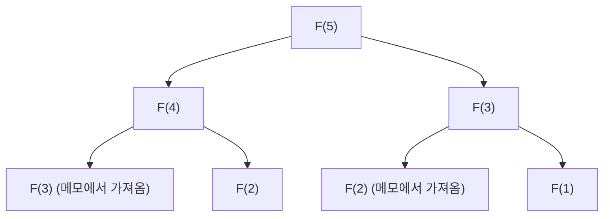

## 들어가며: 왜 동적 계획법이 중요한가?

컴퓨터 과학이나 알고리즘 설계에 있어서, 우리는 매일 다양한 복잡한 문제에 직면합니다. 경로 최적화, 자원 할당, 자연어 처리의 시퀀스 정렬, 그리고 최첨단 강화 학습에 이르기까지, 최적해를 효율적으로 찾아내는 것은 지상 과제입니다.

이러한 문제의 대부분은 단순한 무차별 대입(Brute-force) 접근법으로는 계산 시간이 지수함수적으로 증가하여, 우주의 수명만큼의 시간을 들여도 풀 수 없는 '조합 폭발'을 일으킵니다. 이 절망적인 계산량의 벽을 허물기 위한 가장 강력한 무기 중 하나가 **동적 계획법(Dynamic Programming, DP)**입니다.

본 문서에서는 동적 계획법의 본질부터, 그 이론적 지주인 **벨만 방정식(Bellman Equation)**까지 깊이 파고듭니다. 초보자도 알기 쉬운 구체적인 예부터 시작하여, 부분 구조 최적성이나 중복되는 부분 문제와 같은 핵심적인 성질, 하향식(Top-down)과 상향식(Bottom-up) 구현 접근법의 차이, 그리고 강화 학습과 마르코프 결정 과정(MDP)으로의 응용까지 철저하게 해설합니다.

---

## 1. 동적 계획법의 역사와 이름의 유래

동적 계획법은 1950년대에 미국의 수학자 **리처드 벨만(Richard Bellman)**에 의해 제창되었습니다. 그가 일하던 랜드 연구소(RAND Corporation)에서는 당시 군사적인 최적화 문제나 다단계 의사 결정 과정을 연구하고 있었습니다.

흥미롭게도, 'Dynamic Programming'이라는 단어 자체에는 현대적인 의미의 '컴퓨터 프로그래밍(코딩)'이라는 뉘앙스는 당초 없었습니다. 당시의 'Programming'은 '계획을 세우는 것(Planning)이나 표를 작성하는 것(Tabular method)'을 의미했으며, 예를 들어 '선형 계획법(Linear Programming)'과 같은 쓰임새였습니다. 또한, 'Dynamic'이라는 단어는 시간이 지남에 따라 상황이 변하는 다단계(멀티 스테이지) 의사 결정 과정을 강조하기 위해, 그리고 벨만 자신이 "연구 자금 스폰서(특히 당시의 국방 장관)에게 매력적으로 들리고, 또 반박하기 어려운 강력한 단어"로 선택했다는 유명한 일화가 남아 있습니다.

그러나 그 캐치한 이름에 숨겨진 수학적 뒷받침은 진짜였으며, 훗날 컴퓨터가 보급됨에 따라 알고리즘 설계의 가장 중요한 패러다임 중 하나로 확고한 지위를 구축하게 됩니다.

---

## 2. 동적 계획법을 성립시키는 '2가지 조건'

어떤 문제를 동적 계획법으로 효율적으로 풀기 위해서는, 그 문제가 다음의 두 가지 중요한 성질을 만족해야 합니다.

### 2.1. 부분 구조 최적성 (Optimal Substructure)

**부분 구조 최적성**이란, '문제 전체의 최적해가 그 문제를 분할한 부분 문제의 최적해로 구성된다'는 성질입니다.

예를 들어, 도시 A에서 도시 C로 가는 최단 경로를 찾고 있다고 가정합시다. 도중에 도시 B를 거친다는 것을 알고 있다면, A에서 C로의 최단 경로는 'A에서 B로의 최단 경로'와 'B에서 C로의 최단 경로'를 더한 것이 됩니다. 만약 A에서 B로 가는 더 짧은 다른 길이 존재한다면, 그것을 사용하면 A에서 C로의 경로도 더 짧아질 것입니다. 따라서 전체를 최적화하려면 부분적인 경로도 최적화되어 있어야 합니다.

### 2.2. 중복되는 부분 문제 (Overlapping Subproblems)

**중복되는 부분 문제**란, '문제를 분할하여 풀어가는 과정에서, 완전히 같은 부분 문제가 여러 번 반복해서 출현한다'는 성질입니다.

전형적인 예가 피보나치 수열입니다. 피보나치 수열의 제$n$항을 구하는 함수를 $F(n) = F(n-1) + F(n-2)$ 로 정의했을 때, $F(5)$ 를 계산하기 위해서는 $F(4)$ 와 $F(3)$ 이 필요합니다. 또한 $F(4)$ 를 계산하기 위해서는 $F(3)$ 과 $F(2)$ 가 필요합니다.
여기서 주목해야 할 점은, $F(3)$ 이라는 계산이 다른 분기 속에서 여러 번 나타난다는 점입니다. 무차별 대입으로 계산하면, 이 계산의 중복으로 인해 지수함수적인 시간이 걸려버립니다. 동적 계획법은 이 '한 번 푼 문제를 기억(메모)해두고, 두 번째부터는 재사용한다'는 것을 통해 계산량을 획기적으로 줄입니다.

---

## 3. 접근법의 차이: 메모이제이션(하향식) vs 표 채우기(상향식)

동적 계획법의 구현에는 크게 나누어 두 가지 접근법이 있습니다. 둘 다 근저에 있는 아이디어는 '계산 결과의 재사용'이지만, 계산을 진행하는 방향에 차이가 있습니다.

### 3.1. 하향식 접근법 (메모이제이션 재귀)

하향식 접근법에서는 원래의 큰 문제에서 출발하여, 그것을 작은 문제로 분할하면서 재귀적으로 풀어갑니다. 이때 한 번 계산한 작은 문제의 답을 배열이나 해시 맵 등의 자료 구조에 저장해 둡니다. 이것을 **메모이제이션(Memoization)**이라고 부릅니다.

이 접근법의 장점은, 원래 문제의 구조를 그대로 재귀 함수로 기술할 수 있기 때문에 코드가 직관적이 되기 쉽다는 것입니다. 또한 상태 공간 중 실제로 필요한 부분 문제만 온디맨드로 계산하기 때문에, 쓸데없는 계산을 생략할 수 있습니다.

### 3.2. 상향식 접근법 (표 채우기법)

상향식 접근법에서는 가장 작은(자명한) 부분 문제부터 계산을 시작하고, 그 결과를 사용하여 조금씩 큰 문제의 답을 계산하여, 최종적으로 구하고자 하는 문제의 답에 도달합니다. 일반적으로 배열(DP 테이블)을 준비하고, 루프(반복) 처리로 끝에서부터 순서대로 값을 채워갑니다. 이것을 **Tabulation(표 채우기)**이라고도 부릅니다.

상향식의 최대 장점은 함수 호출의 오버헤드(재귀 깊이에 따른 콜 스택 소비 등)가 없기 때문에 실행 속도가 빠르고, 메모리 효율도 최적화하기 쉽다는 것입니다 (예를 들어 직전의 두 값만 유지하면 되는 경우, 공간 복잡도를 $O(1)$ 로 줄일 수 있는 경우가 있습니다).

---

## 4. 구체적인 예에 의한 고찰: 배낭 문제

동적 계획법의 위력을 이해하기 위해, 고전적이면서도 실용적인 문제인 '0-1 배낭 문제'를 생각해 봅시다.

### 문제 설정
도둑이 용량 $W$ 의 배낭을 가지고 있습니다. 눈앞에는 $n$ 개의 물건이 있고, 각각의 물건 $i$ 에는 무게 $w_i$ 와 가치 $v_i$ 가 설정되어 있습니다. 도둑은 배낭의 용량을 초과하지 않는 범위에서 물건을 선택하여, 가져갈 가치의 합계를 최대화하고자 합니다. 각 물건은 '선택한다(1)' 거나 '선택하지 않는다(0)' 둘 중 하나입니다.

### DP에 의한 정식화
이 문제를 해결하기 위해 '상태'와 '점화식(상태 전이 방정식)'을 정의합니다.

**상태의 정의:**
`DP[i][w]` 를 '처음 $i$ 개의 물건 중에서 총 무게가 $w$ 를 초과하지 않도록 선택했을 때의 가치의 최댓값'으로 정의합니다.

**점화식의 구축:**
물건 $i$ 를 고려할 때, 2가지 선택지가 있습니다.
1. **물건 $i$ 를 선택하지 않는 경우:**
   가치는 변하지 않으며, 무게의 여유도 변하지 않습니다.
   `DP[i][w] = DP[i-1][w]`
2. **물건 $i$ 를 선택하는 경우 (단, $w \ge w_i$ 인 경우만):**
   물건 $i$ 의 가치 $v_i$ 가 더해지고, 남은 용량은 $w - w_i$ 가 됩니다. 이 남은 용량에 대해 물건 $i-1$ 까지로 얻을 수 있는 최대 가치를 더합니다.
   `DP[i][w] = DP[i-1][w - w_i] + v_i`

따라서 이 2가지 선택지 중 더 가치가 커지는 쪽을 채택하면 됩니다.

$$ DP[i][w] = \max( DP[i-1][w], DP[i-1][w - w_i] + v_i ) $$

이 점화식이야말로 배낭 문제에 있어서의 **부분 구조 최적성**을 수식으로 표현한 것입니다. 전체의 최적해는 '물건 $i$ 를 넣은 후 남은 용량에 대한 최적해'라는 부분 문제로 이루어져 있습니다.

---

## 5. 벨만 방정식(Bellman Equation)으로의 승화

지금까지 살펴본 점화식의 접근법은 실은 **벨만 방정식**의 구체적인 응용 예에 다름 아닙니다.
리처드 벨만은 이러한 동적 계획법의 배후에 있는 원리를 추상화하여 **최적성의 원리(Principle of Optimality)**로 정식화했습니다.

> "최적 정책은 다음과 같은 성질을 갖는다: 초기 상태와 초기 결정이 무엇이든 간에, 나머지 결정들은 첫 번째 결정에서 비롯된 상태에 관하여 최적 정책을 구성해야만 한다."

이 개념을 수학적으로 기술한 것이 벨만 방정식입니다. 일반적으로 이산 시간의 상태 전이 모델에서, 상태 $s$ 에서의 최적 가치 함수 $V^*(s)$ 는 다음과 같이 정의됩니다.

$$ V^*(s) = \max_{a} \left\{ R(s, a) + \gamma V^*(s') \right\} $$

각 기호의 의미는 다음과 같습니다.
- $V^*(s)$ : 상태 $s$ 에서 출발했을 경우 장래에 얻을 수 있는 보상의 합계(기댓값)의 최댓값.
- $a$ : 상태 $s$ 에서 취할 수 있는 행동(Action).
- $R(s, a)$ : 상태 $s$ 에서 행동 $a$ 를 취했을 때 즉시 얻어지는 보상(Reward).
- $\gamma$ : 할인율(Discount factor, $0 \le \gamma < 1$). 장래의 보상을 현재의 가치로 얼마나 어림잡을지 나타내는 매개변수.
- $s'$ : 행동 $a$ 를 취한 결과로 전이하는 다음 상태.

### 벨만 방정식이 의미하는 것

이 방정식이 주장하는 것은, **"현재 상태의 최적의 가치는 지금 당장 받을 수 있는 보상과 다음 상태의 최적의 가치의 합을, 모든 가능한 행동 중에서 최대화한 것이다"**라는 지극히 단순하면서도 강력한 사실입니다.

이것은 앞서 본 배낭 문제의 점화식과 본질적으로 같은 구조를 가지고 있습니다. 즉, 복잡한 다단계의 최적화 문제를 '현재의 1스텝'과 '그 이후의 모든 스텝(재귀적인 구조)'으로 분할하고 있는 것입니다.

---

## 6. 강화 학습과 마르코프 결정 과정(MDP)으로의 응용

현대의 인공지능, 특히 **강화 학습(Reinforcement Learning, RL)**에 있어서 벨만 방정식은 이론적인 중핵을 담당하고 있습니다.
AlphaGo와 같은 AI가 바둑 세계 챔피언을 무찌르거나 로봇이 보행을 학습하는 배후에는, 마르코프 결정 과정(MDP)이라는 확률적인 틀과 그것을 풀기 위한 벨만 방정식이 존재합니다.

현실 세계의 문제에서는 행동 $a$ 를 취한 후의 다음 상태 $s'$ 이 확정적으로 결정된다고 할 수 없습니다 (바람이 불어 로봇이 예상치 못한 방향으로 나아갈 수도 있습니다). 이 불확실성을 고려하기 위해 상태 전이 확률 $P(s' | s, a)$ 를 도입한 **벨만 기대 방정식(Bellman Expectation Equation)**이나 **벨만 최적 방정식(Bellman Optimality Equation)**이 이용됩니다.

$$ V^*(s) = \max_{a} \sum_{s'} P(s' | s, a) \left[ R(s, a, s') + \gamma V^*(s') \right] $$

강화 학습의 주요 알고리즘인 **Q 학습(Q-Learning)**이나 **가치 반복법(Value Iteration)**은 바로 이 벨만 방정식을 반복해서 계산하고, 근사적으로 푸는 것을 통해 최적의 행동 지침(정책)을 획득해 나가는 과정입니다.

---

## 요약: 분할 정복과 기억의 미학

동적 계획법과 벨만 방정식은 단순한 프로그래밍 테크닉이 아닙니다. 그것은 거대하고 복잡한 시스템이나 불확실한 미래에 대한 의사 결정을 합리적이고 계산 가능한 단위로까지 분해하기 위한 '철학'이라고도 할 수 있습니다.

1. **부분 구조 최적성**을 이용하여 문제를 분할하고,
2. **중복되는 부분 문제**의 계산 결과를 기억(메모이제이션, 표 채우기)하여 재사용하고,
3. **벨만 방정식**을 통해 현재와 미래의 가치를 재귀적으로 연결한다.

이러한 개념을 깊이 이해하는 것은 더 효율적인 알고리즘을 설계하는 힘을 기를 뿐만 아니라, 비즈니스나 일상생활에 있어서의 복잡한 과제 해결에도 응용할 수 있는 범용적인 사고법(멘탈 모델)을 제공해 줄 것입니다.

프로그래밍의 벽에 부딪혔을 때나 복잡한 알고리즘의 설계로 고민할 때는 꼭 한 번 멈춰 서서 "이 문제는 더 작은 문제의 집합으로 표현할 수 없는가?", "이미 푼 문제를 잊어버리고 같은 계산을 반복하고 있지는 않은가?"라고 자문해 보십시오. 그곳에 동적 계획법의 문을 여는 열쇠가 있을 것입니다.
