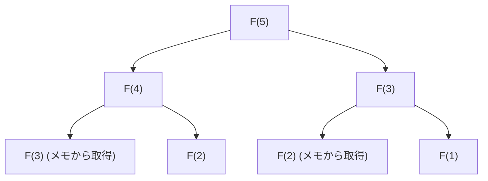

## はじめに：なぜ動的計画法は重要なのか？

コンピュータサイエンスやアルゴリズム設計において、私たちは日々様々な複雑な問題に直面します。ルート最適化、リソース割り当て、自然言語処理におけるシーケンスアライメント、そして最先端の強化学習に至るまで、最適解を効率的に見つけ出すことは至上命題です。

これらの問題の多くは、単純な総当たり（Brute-force）アプローチでは計算時間が指数関数的に増大し、宇宙の寿命ほどの時間をかけても解けない「組み合わせ爆発」を引き起こします。この絶望的な計算量の壁を打ち破るための最も強力な武器の一つが、**動的計画法（Dynamic Programming, DP）**です。

本記事では、動的計画法の本質から、その理論的支柱である**ベルマン方程式（Bellman Equation）**までを深く掘り下げます。初心者にもわかりやすい具体例から始め、部分構造最適性や重複する部分問題といった核心的な性質、トップダウンとボトムアップの実装アプローチの違い、そして強化学習やマルコフ決定過程（MDP）への応用まで、徹底的に解説します。

---

## 1. 動的計画法の歴史と名前の由来

動的計画法は、1950年代にアメリカの数学者**リチャード・ベルマン（Richard Bellman）**によって提唱されました。彼が働いていたランド研究所（RAND Corporation）では、当時、軍事的な最適化問題や多段階の意思決定プロセスを研究していました。

興味深いことに、「Dynamic Programming」という言葉自体には、現代的な意味での「コンピュータプログラミング（コーディング）」の意味合いは当初ありませんでした。当時の「Programming」は「計画を立てること（Planning）や表を作成すること（Tabular method）」を意味しており、例えば「線形計画法（Linear Programming）」と同じ使われ方です。また、「Dynamic」という言葉は、時間が経過するにつれて状況が変化する多段階（マルチステージ）の意思決定プロセスを強調するため、そしてベルマン自身が「研究資金のスポンサー（特に当時の国防長官）にとって魅力的に響き、かつ反論しにくいパワフルな言葉」として選んだという有名な逸話が残されています。

しかし、そのキャッチーな名前に隠された数学的な裏付けは本物であり、後にコンピュータが普及するにつれて、アルゴリズム設計の最も重要なパラダイムの一つとして確固たる地位を築くことになります。

---

## 2. 動的計画法を成立させる「2つの条件」

ある問題を動的計画法で効率的に解くためには、その問題が以下の2つの重要な性質を満たしている必要があります。

### 2.1. 部分構造最適性 (Optimal Substructure)

**部分構造最適性**とは、「問題全体の最適解が、その問題を分割した部分問題の最適解から構成される」という性質です。

たとえば、都市Aから都市Cへ向かう最短経路を探しているとします。途中で都市Bを経由することがわかっている場合、AからCへの最短経路は、「AからBへの最短経路」と「BからCへの最短経路」を足し合わせたものになります。もしAからBへもっと短い別の道が存在するなら、それを使えばAからCへの経路もさらに短くなるはずです。したがって、全体を最適化するには、部分的な経路も最適化されていなければなりません。

### 2.2. 重複する部分問題 (Overlapping Subproblems)

**重複する部分問題**とは、「問題を分割して解いていく過程で、全く同じ部分問題が何度も繰り返し出現する」という性質です。

典型的な例がフィボナッチ数列です。フィボナッチ数列の第$n$項を求める関数を $F(n) = F(n-1) + F(n-2)$ と定義したとき、$F(5)$ を計算するためには $F(4)$ と $F(3)$ が必要です。さらに $F(4)$ を計算するには $F(3)$ と $F(2)$ が必要です。
ここで注目すべきは、$F(3)$ という計算が、異なる分岐の中で何度も現れる点です。総当たりで計算すると、この計算の重複により指数関数的な時間がかかってしまいます。動的計画法は、この「一度解いた問題を記憶（メモ）しておき、二度目以降は再利用する」ことによって、計算量を劇的に削減します。

---

## 3. アプローチの違い：メモ化（トップダウン） vs 表埋め（ボトムアップ）

動的計画法の実装には、大きく分けて2つのアプローチがあります。どちらも根底にあるアイデアは「計算結果の再利用」ですが、計算を進める方向に違いがあります。

### 3.1. トップダウン・アプローチ（メモ化再帰）

トップダウン・アプローチでは、元の大きな問題から出発し、それを小さな問題に分割しながら再帰的に解いていきます。このとき、一度計算した小さな問題の答えを配列やハッシュマップなどのデータ構造に保存しておきます。これを**メモ化（Memoization）**と呼びます。

このアプローチの利点は、元の問題の構造をそのまま再帰関数として記述できるため、コードが直感的になりやすいことです。また、状態空間のうち、実際に必要となる部分問題だけをオンデマンドで計算するため、無駄な計算を省くことができます。

### 3.2. ボトムアップ・アプローチ（表埋め法）

ボトムアップ・アプローチでは、最も小さな（自明な）部分問題から計算を始め、その結果を使って少しずつ大きな問題の答えを計算し、最終的に求めたい問題の答えに到達します。一般に、配列（DPテーブル）を用意して、ループ（反復）処理で端から順番に値を埋めていきます。これを**Tabulation（表埋め）**とも呼びます。

ボトムアップの最大の利点は、関数呼び出しのオーバーヘッド（再帰の深さによるコールスタックの消費など）がないため、実行速度が速く、メモリ効率も最適化しやすいことです（たとえば直近の2つの値だけを保持すればよい場合、空間計算量を $O(1)$ に減らせることがあります）。

---

## 4. 具体例による考察：ナップサック問題

動的計画法の威力を理解するために、古典的かつ実用的な問題である「0-1 ナップサック問題」を考えてみましょう。

### 問題設定
泥棒が、容量 $W$ のナップサックを持っています。目の前には $n$ 個の品物があり、それぞれの品物 $i$ には重さ $w_i$ と価値 $v_i$ が設定されています。泥棒はナップサックの容量を超えない範囲で品物を選び、持ち帰る価値の合計を最大化したいと考えています。各品物は「選ぶ（1）」か「選ばない（0）」のどちらかです。

### DPによる定式化
この問題を解決するために、「状態」と「漸化式（状態遷移方程式）」を定義します。

**状態の定義：**
`DP[i][w]` を、「最初の $i$ 個の品物の中から、総重量が $w$ を超えないように選んだときの価値の最大値」と定義します。

**漸化式の構築：**
品物 $i$ を考えるとき、2つの選択肢があります。
1. **品物 $i$ を選ばない場合：**
   価値は変わらず、重量の余裕も変わりません。
   `DP[i][w] = DP[i-1][w]`
2. **品物 $i$ を選ぶ場合（ただし $w \ge w_i$ の場合のみ）：**
   品物 $i$ の価値 $v_i$ が加わり、残りの容量は $w - w_i$ になります。この残りの容量について、品物 $i-1$ までで得られる最大価値を足し合わせます。
   `DP[i][w] = DP[i-1][w - w_i] + v_i`

したがって、これら2つの選択肢のうち、より価値が大きくなる方を採用すればよいのです。

$$ DP[i][w] = \max( DP[i-1][w], DP[i-1][w - w_i] + v_i ) $$

この漸化式こそが、ナップサック問題における**部分構造最適性**を数式として表現したものです。全体の最適解は、「品物 $i$ を入れたあとの残りの容量に対する最適解」という部分問題から成り立っています。

---

## 5. ベルマン方程式（Bellman Equation）への昇華

ここまで見てきた漸化式のアプローチは、実は**ベルマン方程式**の具体的な応用例に他なりません。
リチャード・ベルマンは、このような動的計画法の背後にある原理を抽象化し、**最適性の原理（Principle of Optimality）**として定式化しました。

> 「最適政策は次のような性質を持つ：初期状態と初期決定が何であれ、残りの決定は、最初の決定から生じた状態に関する最適政策を構成しなければならない。」

この概念を数学的に記述したものがベルマン方程式です。一般に、離散時間の状態遷移モデルにおいて、状態 $s$ における最適価値関数 $V^*(s)$ は次のように定義されます。

$$ V^*(s) = \max_{a} \left\{ R(s, a) + \gamma V^*(s') \right\} $$

各記号の意味は以下の通りです。
- $V^*(s)$ : 状態 $s$ から出発した場合に将来得られる報酬の合計（期待値）の最大値。
- $a$ : 状態 $s$ で取ることができる行動（Action）。
- $R(s, a)$ : 状態 $s$ で行動 $a$ を取ったときに即座に得られる報酬（Reward）。
- $\gamma$ : 割引率（Discount factor, $0 \le \gamma < 1$）。将来の報酬をどれくらい現在の価値として見積もるかを示すパラメータ。
- $s'$ : 行動 $a$ を取った結果として遷移する次の状態。

### ベルマン方程式の意味するもの

この方程式が主張しているのは、**「現在の状態の最適な価値は、今すぐもらえる報酬と、次の状態の最適な価値の合計を、すべての可能な行動の中で最大化したものである」**という極めてシンプルかつ強力な事実です。

これは先ほどのナップサック問題の漸化式と本質的に同じ構造を持っています。つまり、複雑な多段階の最適化問題を、「現在の1ステップ」と「それ以降のすべてのステップ（再帰的な構造）」に分割しているのです。

---

## 6. 強化学習とマルコフ決定過程（MDP）への応用

現代の人工知能、特に**強化学習（Reinforcement Learning, RL）**において、ベルマン方程式は理論的な中核を担っています。
AlphaGoのようなAIが囲碁の世界チャンピオンを打ち破ったり、ロボットが歩行を学習したりする背後には、マルコフ決定過程（MDP）という確率的な枠組みと、それを解くためのベルマン方程式が存在します。

現実世界の問題では、行動 $a$ を取ったあとの次の状態 $s'$ が確定的に決まるとは限りません（風が吹いてロボットが予想外の方向に進むかもしれません）。この不確実性を考慮するために、状態遷移確率 $P(s' | s, a)$ を導入した**ベルマン期待方程式（Bellman Expectation Equation）**や**ベルマン最適方程式（Bellman Optimality Equation）**が用いられます。

$$ V^*(s) = \max_{a} \sum_{s'} P(s' | s, a) \left[ R(s, a, s') + \gamma V^*(s') \right] $$

強化学習の主要なアルゴリズムである **Q学習（Q-Learning）** や **価値反復法（Value Iteration）** は、まさにこのベルマン方程式を繰り返し計算し、近似的に解くことによって最適な行動指針（ポリシー）を獲得していくプロセスなのです。

---

## まとめ：分割統治と記憶の美学

動的計画法とベルマン方程式は、単なるプログラミングのテクニックではありません。それは、巨大で複雑なシステムや不確実な未来に対する意思決定を、合理的かつ計算可能な単位にまで分解するための「哲学」とも言えます。

1. **部分構造最適性**を利用して問題を分割し、
2. **重複する部分問題**の計算結果を記憶（メモ化・表埋め）して再利用し、
3. **ベルマン方程式**によって現在と未来の価値を再帰的に結びつける。

これらの概念を深く理解することは、より効率的なアルゴリズムを設計する力を養うだけでなく、ビジネスや日常生活における複雑な課題解決にも応用できる汎用的な思考法（メンタルモデル）を与えてくれるでしょう。

プログラミングの壁にぶつかったときや、複雑なアルゴリズムの設計に悩んだときは、ぜひ一度立ち止まって「この問題はより小さな問題の集合として表現できないか？」「すでに解いた問題を忘れて、同じ計算を繰り返していないか？」と問いかけてみてください。そこに、動的計画法の扉を開く鍵があるはずです。
