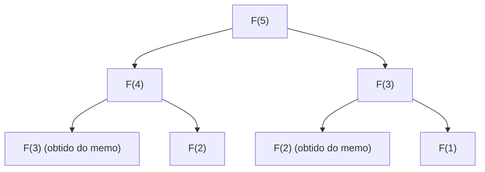

## Introdução: Por que a Programação Dinâmica é importante?

Na ciência da computação e no design de algoritmos, enfrentamos vários problemas complexos diariamente. Desde otimização de rotas, alocação de recursos, alinhamento de sequências no processamento de linguagem natural, até o aprendizado por reforço de ponta, encontrar a solução ideal de forma eficiente é um objetivo supremo.

Muitos desses problemas, ao utilizar uma abordagem simples de força bruta (Brute-force), causam uma "explosão combinatória", onde o tempo de computação cresce exponencialmente, tornando impossível resolvê-los mesmo que levássemos o tempo de vida do universo. Uma das armas mais poderosas para quebrar essa desesperadora barreira de complexidade computacional é a **Programação Dinâmica (Dynamic Programming, DP)**.

Neste artigo, aprofundaremos desde a essência da programação dinâmica até o seu pilar teórico, a **Equação de Bellman (Bellman Equation)**. Começaremos com exemplos concretos fáceis de entender para iniciantes, e explicaremos detalhadamente propriedades centrais como subestrutura ótima e subproblemas sobrepostos, as diferenças entre as abordagens de implementação top-down e bottom-up, e suas aplicações no aprendizado por reforço e nos Processos de Decisão de Markov (MDP).

---

## 1. História e origem do nome da Programação Dinâmica

A programação dinâmica foi proposta na década de 1950 pelo matemático americano **Richard Bellman**. Na RAND Corporation, onde trabalhava, ele pesquisava problemas de otimização militar e processos de tomada de decisão em múltiplas etapas.

Curiosamente, a palavra "Dynamic Programming" em si não tinha, inicialmente, o sentido moderno de "programação de computadores (codificação)". Na época, "Programming" significava "planejamento (Planning) ou criação de tabelas (Tabular method)", o mesmo uso encontrado em "Programação Linear (Linear Programming)". Além disso, há uma anedota famosa de que Bellman escolheu a palavra "Dynamic" para enfatizar o processo de tomada de decisão em múltiplas etapas (multi-stage) onde as situações mudam com o passar do tempo, e também porque era uma "palavra poderosa que soava atraente para os patrocinadores de fundos de pesquisa (especialmente o Secretário de Defesa da época) e era difícil de contestar".

No entanto, a fundamentação matemática escondida por trás desse nome chamativo era genuína e, posteriormente, com a popularização dos computadores, estabeleceu firmemente a sua posição como um dos paradigmas mais importantes no design de algoritmos.

---

## 2. As "duas condições" que estabelecem a Programação Dinâmica

Para resolver um problema de forma eficiente com a programação dinâmica, o problema deve satisfazer as duas propriedades importantes a seguir.

### 2.1. Subestrutura Ótima (Optimal Substructure)

**Subestrutura ótima** é a propriedade em que "a solução ótima de todo o problema é composta pelas soluções ótimas dos subproblemas em que o problema foi dividido".

Por exemplo, suponha que estamos procurando a rota mais curta da cidade A para a cidade C. Se soubermos que passaremos pela cidade B no meio do caminho, a rota mais curta de A para C será a soma da "rota mais curta de A para B" e da "rota mais curta de B para C". Se existisse um caminho mais curto alternativo de A para B, deveríamos usá-lo, pois isso tornaria a rota de A para C ainda mais curta. Portanto, para otimizar o todo, as rotas parciais também devem ser otimizadas.

### 2.2. Subproblemas Sobrepostos (Overlapping Subproblems)

**Subproblemas sobrepostos** é a propriedade em que "no processo de dividir e resolver o problema, o exato mesmo subproblema aparece repetidamente várias vezes".

Um exemplo clássico é a sequência de Fibonacci. Quando definimos a função para encontrar o $n$-ésimo termo da sequência de Fibonacci como $F(n) = F(n-1) + F(n-2)$, para calcular $F(5)$, precisamos de $F(4)$ e $F(3)$. Além disso, para calcular $F(4)$, precisamos de $F(3)$ e $F(2)$.
O ponto a notar aqui é que o cálculo de $F(3)$ aparece várias vezes em diferentes ramificações. Se calcularmos por força bruta, essa sobreposição de cálculos levará a um tempo exponencial. A programação dinâmica reduz drasticamente o tempo de computação ao "memorizar (memoization) o problema uma vez resolvido e reutilizá-lo nas vezes seguintes".

---

## 3. Diferença de abordagem: Memoization (Top-down) vs Tabulação (Bottom-up)

A implementação da programação dinâmica pode ser dividida em duas abordagens principais. A ideia fundamental de ambas é a "reutilização dos resultados dos cálculos", mas há uma diferença na direção em que os cálculos prosseguem.

### 3.1. Abordagem Top-down (Memoization Recursiva)

Na abordagem top-down, partimos do problema original maior e o resolvemos recursivamente enquanto o dividimos em problemas menores. Nesse momento, salvamos a resposta do problema menor calculado uma vez em uma estrutura de dados como um array ou hash map. Isso é chamado de **Memoização (Memoization)**.

A vantagem desta abordagem é que a estrutura do problema original pode ser descrita exatamente como uma função recursiva, tornando o código frequentemente mais intuitivo. Além disso, ela evita cálculos desnecessários, pois apenas os subproblemas do espaço de estados que são realmente necessários são calculados sob demanda.

### 3.2. Abordagem Bottom-up (Método de Tabulação)

Na abordagem bottom-up, iniciamos o cálculo a partir dos subproblemas menores (triviais) e, utilizando seus resultados, calculamos gradualmente as respostas para os problemas maiores, até alcançarmos finalmente a resposta do problema que desejamos resolver. Geralmente, preparamos um array (tabela DP) e preenchemos os valores em ordem, a partir da extremidade, através de um processo de loop (iteração). Isso também é chamado de **Tabulação (Tabulation)**.

A maior vantagem do bottom-up é a ausência do overhead de chamadas de função (como o consumo da pilha de chamadas devido à profundidade da recursão), o que resulta em velocidades de execução mais rápidas e maior facilidade para otimizar a eficiência da memória (por exemplo, se precisarmos manter apenas os dois valores mais recentes, a complexidade de espaço pode por vezes ser reduzida para $O(1)$).

---

## 4. Estudo de caso: O Problema da Mochila (Knapsack Problem)

Para compreender o poder da programação dinâmica, consideremos um problema clássico e prático, o "Problema da Mochila 0-1".

### Configuração do Problema
Um ladrão tem uma mochila com capacidade $W$. À sua frente estão $n$ itens, onde cada item $i$ tem um peso $w_i$ e um valor $v_i$. O ladrão deseja escolher itens sem exceder a capacidade da mochila e maximizar o valor total a ser levado. Para cada item, ele pode "escolher (1)" ou "não escolher (0)".

### Formulação por DP
Para resolver esse problema, definimos o "estado" e a "relação de recorrência (equação de transição de estado)".

**Definição de Estado:**
Definimos `DP[i][w]` como "o valor máximo quando escolhemos entre os primeiros $i$ itens de forma que o peso total não exceda $w$".

**Construção da Relação de Recorrência:**
Ao considerar o item $i$, existem duas opções:
1. **Se não escolhermos o item $i$:**
   O valor não muda, e a capacidade restante de peso também não muda.
   `DP[i][w] = DP[i-1][w]`
2. **Se escolhermos o item $i$ (apenas se $w \ge w_i$):**
   Adiciona-se o valor $v_i$ do item $i$, e a capacidade restante passa a ser $w - w_i$. Para esta capacidade restante, somamos o valor máximo obtido até o item $i-1$.
   `DP[i][w] = DP[i-1][w - w_i] + v_i`

Portanto, basta adotarmos a opção que resulta em um valor maior entre essas duas alternativas.

$$ DP[i][w] = \max( DP[i-1][w], DP[i-1][w - w_i] + v_i ) $$

Esta relação de recorrência é justamente a expressão matemática da **subestrutura ótima** no problema da mochila. A solução ótima geral é composta pelo subproblema de "a solução ótima para a capacidade restante após inserir o item $i$".

---

## 5. A Elevação à Equação de Bellman (Bellman Equation)

A abordagem da relação de recorrência que vimos até aqui nada mais é do que um exemplo específico de aplicação da **Equação de Bellman**.
Richard Bellman abstraiu o princípio por trás desse tipo de programação dinâmica e o formulou como o **Princípio da Otimidade (Principle of Optimality)**.

> "Uma política ótima tem a propriedade de que, independentemente do estado e da decisão iniciais, as decisões restantes devem constituir uma política ótima no que diz respeito ao estado resultante da primeira decisão."

A descrição matemática deste conceito é a Equação de Bellman. Em geral, num modelo de transição de estado em tempo discreto, a função de valor ótimo $V^*(s)$ no estado $s$ é definida da seguinte forma:

$$ V^*(s) = \max_{a} \left\{ R(s, a) + \gamma V^*(s') \right\} $$

O significado de cada símbolo é o seguinte:
- $V^*(s)$ : O valor máximo do total (valor esperado) das recompensas futuras se partirmos do estado $s$.
- $a$ : A ação (Action) que pode ser tomada no estado $s$.
- $R(s, a)$ : A recompensa (Reward) obtida imediatamente ao tomar a ação $a$ no estado $s$.
- $\gamma$ : Fator de desconto (Discount factor, $0 \le \gamma < 1$). Um parâmetro que indica o quanto as recompensas futuras são valorizadas em relação ao valor presente.
- $s'$ : O próximo estado para o qual se transita como resultado da ação $a$.

### O significado da Equação de Bellman

O que esta equação afirma é o fato extremamente simples e poderoso de que **"o valor ótimo do estado atual é o máximo, entre todas as ações possíveis, da soma da recompensa recebida imediatamente com o valor ótimo do estado seguinte"**.

Isto possui essencialmente a mesma estrutura da relação de recorrência do problema da mochila visto anteriormente. Ou seja, ela divide um problema complexo de otimização em múltiplas etapas em "um passo atual" e "todos os passos subsequentes (uma estrutura recursiva)".

---

## 6. Aplicação ao Aprendizado por Reforço e aos Processos de Decisão de Markov (MDP)

Na inteligência artificial moderna, especialmente no **Aprendizado por Reforço (Reinforcement Learning, RL)**, a Equação de Bellman desempenha um papel teórico central.
Por trás de IAs como o AlphaGo derrotando o campeão mundial de Go, ou robôs aprendendo a andar, existe um modelo probabilístico chamado Processo de Decisão de Markov (MDP) e a Equação de Bellman para resolvê-lo.

Em problemas do mundo real, o próximo estado $s'$ após a ação $a$ nem sempre é determinado de forma determinística (o vento pode soprar e o robô pode se mover em uma direção inesperada). Para considerar essa incerteza, utiliza-se a **Equação de Expectativa de Bellman (Bellman Expectation Equation)** ou a **Equação de Otimidade de Bellman (Bellman Optimality Equation)**, que introduzem a probabilidade de transição de estado $P(s' | s, a)$.

$$ V^*(s) = \max_{a} \sum_{s'} P(s' | s, a) \left[ R(s, a, s') + \gamma V^*(s') \right] $$

Os principais algoritmos de aprendizado por reforço, como o **Q-Learning** e a **Iteração de Valor (Value Iteration)**, são exatamente processos para adquirir as diretrizes de ação ótimas (políticas) calculando repetidamente essa Equação de Bellman e resolvendo-a de forma aproximada.

---

## Conclusão: Divisão para Conquistar e a Estética da Memória

A Programação Dinâmica e a Equação de Bellman não são apenas técnicas de programação. Podem ser consideradas uma "filosofia" para decompor a tomada de decisões sobre sistemas vastos e complexos ou futuros incertos em unidades racionais e computáveis.

1. Utilizando a **subestrutura ótima** para dividir o problema,
2. Memorizando (memoization/tabulação) e reutilizando os resultados computacionais de **subproblemas sobrepostos**, e
3. Conectando recursivamente o valor do presente e do futuro através da **Equação de Bellman**.

Entender profundamente esses conceitos não apenas cultivar a capacidade de projetar algoritmos mais eficientes, mas também fornecerá um modelo mental (modo de pensar genérico) que pode ser aplicado na resolução de desafios complexos nos negócios e na vida cotidiana.

Quando você se deparar com uma barreira na programação, ou estiver com dificuldades no design de um algoritmo complexo, pare por um momento e pergunte a si mesmo: "Esse problema não pode ser expresso como um conjunto de problemas menores?" ou "Eu não estou esquecendo os problemas que já resolvi e repetindo os mesmos cálculos?". Lá deve estar a chave para abrir a porta da programação dinâmica.
