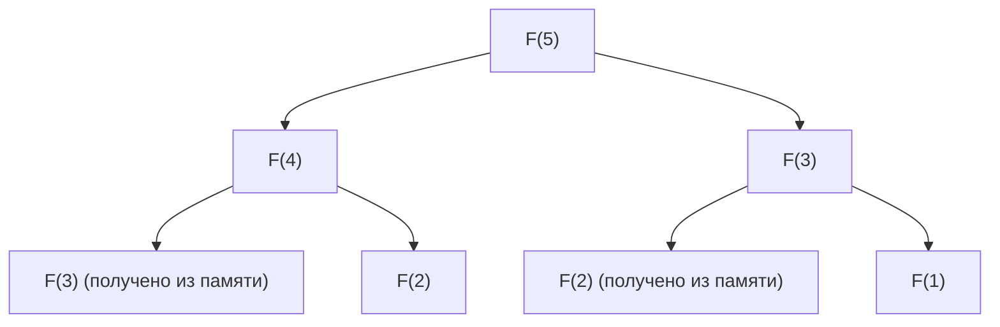

## Введение: Почему динамическое программирование так важно?

В информатике и разработке алгоритмов мы ежедневно сталкиваемся с различными сложными задачами. От оптимизации маршрутов, распределения ресурсов и выравнивания последовательностей в обработке естественного языка до передового обучения с подкреплением — эффективный поиск оптимального решения является первоочередной задачей.

Многие из этих проблем вызывают «комбинаторный взрыв», при котором время вычислений при простом методе полного перебора (Brute-force) растет экспоненциально, делая задачу нерешаемой даже за время, равное возрасту Вселенной. Одним из самых мощных орудий для преодоления этой безнадежной стены вычислительной сложности является **динамическое программирование (Dynamic Programming, DP)**.

В этой статье мы глубоко погрузимся в суть динамического программирования, вплоть до его теоретической основы — **уравнения Беллмана (Bellman Equation)**. Мы начнем с понятных новичкам конкретных примеров и детально разберем такие ключевые свойства, как оптимальная подструктура и перекрывающиеся подзадачи, различия между подходами реализации «сверху вниз» и «снизу вверх», а также применение в обучении с подкреплением и марковских процессах принятия решений (MDP).

---

## 1. История и происхождение названия динамического программирования

Динамическое программирование было предложено в 1950-х годах американским математиком **Ричардом Беллманом (Richard Bellman)**. В корпорации RAND, где он работал, в то время исследовались военные задачи оптимизации и многоэтапные процессы принятия решений.

Интересно, что изначально термин «Dynamic Programming» не имел отношения к «компьютерному программированию (написанию кода)» в современном понимании. В то время «Programming» означало «планирование (Planning) или составление таблиц (Tabular method)», и использовалось так же, как в термине «линейное программирование (Linear Programming)». Кроме того, существует известная история о том, что слово «Dynamic» было выбрано Беллманом для того, чтобы подчеркнуть многоэтапный процесс принятия решений, в котором ситуация меняется со временем, а также потому, что это было «мощное слово, которое звучало привлекательно для спонсоров исследований (особенно для министра обороны того времени) и с которым было трудно спорить».

Однако математическое обоснование, скрытое за этим броским названием, было подлинным, и позже, с распространением компьютеров, оно прочно заняло место одной из важнейших парадигм в разработке алгоритмов.

---

## 2. «Два условия» для применимости динамического программирования

Чтобы задачу можно было эффективно решить с помощью динамического программирования, она должна удовлетворять следующим двум важным свойствам.

### 2.1. Оптимальная подструктура (Optimal Substructure)

**Оптимальная подструктура** — это свойство, при котором «оптимальное решение всей задачи состоит из оптимальных решений ее подзадач».

Например, предположим, мы ищем кратчайший путь из города A в город C. Если известно, что маршрут проходит через город B, то кратчайший путь от A до C будет суммой «кратчайшего пути от A до B» и «кратчайшего пути от B до C». Если бы существовал более короткий путь от A до B, то, используя его, мы могли бы сделать путь от A до C еще короче. Следовательно, для оптимизации всего маршрута необходимо, чтобы его части также были оптимизированы.

### 2.2. Перекрывающиеся подзадачи (Overlapping Subproblems)

**Перекрывающиеся подзадачи** — это свойство, при котором «в процессе разбиения и решения задачи одни и те же подзадачи возникают снова и снова».

Типичным примером является последовательность Фибоначчи. Если определить функцию для нахождения $n$-го члена последовательности Фибоначчи как $F(n) = F(n-1) + F(n-2)$, то для вычисления $F(5)$ нам потребуются $F(4)$ и $F(3)$. Далее, для вычисления $F(4)$ потребуются $F(3)$ и $F(2)$.

Здесь важно отметить, что вычисление $F(3)$ встречается несколько раз в разных ветвях. При вычислении полным перебором это дублирование вычислений приводит к экспоненциальным затратам времени. Динамическое программирование радикально сокращает объем вычислений благодаря тому, что «однажды решенная задача запоминается (кэшируется) и при повторном обращении ее результат используется снова».

---

## 3. Различия в подходах: Мемоизация (сверху вниз) vs Табуляция (снизу вверх)

В реализации динамического программирования можно выделить два основных подхода. В основе обоих лежит идея «повторного использования результатов вычислений», но они отличаются направлением, в котором производятся вычисления.

### 3.1. Подход сверху вниз (Мемоизация с рекурсией)

При подходе сверху вниз мы начинаем с исходной большой задачи и рекурсивно решаем ее, разбивая на более мелкие. При этом ответы на уже решенные мелкие задачи сохраняются в структурах данных, таких как массивы или хеш-таблицы. Это называется **мемоизацией (Memoization)**.

Преимущество этого подхода заключается в том, что структуру исходной задачи можно напрямую описать в виде рекурсивной функции, что делает код более интуитивно понятным. Кроме того, вычисляются только те подзадачи из пространства состояний, которые действительно необходимы по запросу, что позволяет избежать лишних вычислений.

### 3.2. Подход снизу вверх (Табуляция)

При подходе снизу вверх вычисления начинаются с самых маленьких (тривиальных) подзадач, и их результаты используются для постепенного вычисления ответов на более крупные задачи, пока в конечном итоге не будет получен ответ на исходную задачу. Как правило, подготавливается массив (таблица ДП), и значения заполняются по порядку с края с помощью циклов (итераций). Это также называется **табуляцией (Tabulation)**.

Главное преимущество подхода снизу вверх в том, что отсутствует накладной расход на вызов функций (например, потребление стека вызовов из-за глубины рекурсии), поэтому скорость выполнения выше, а эффективность использования памяти легче оптимизировать (например, если нужно хранить только два последних значения, пространственную сложность можно уменьшить до $O(1)$).

---

## 4. Рассмотрение на конкретном примере: Задача о рюкзаке

Чтобы понять мощь динамического программирования, давайте рассмотрим классическую и практическую «задачу о рюкзаке 0-1 (0-1 Knapsack Problem)».

### Постановка задачи

Вор имеет рюкзак вместимостью $W$. Перед ним находится $n$ предметов, и для каждого предмета $i$ заданы его вес $w_i$ и ценность $v_i$. Вор хочет выбрать предметы таким образом, чтобы не превысить вместимость рюкзака и максимизировать общую ценность уносимой добычи. Каждый предмет можно либо «взять (1)», либо «не взять (0)».

### Формулировка с помощью ДП

Для решения этой задачи мы определим «состояние» и «рекуррентное соотношение (уравнение перехода состояний)».

**Определение состояния:**
Определим `DP[i][w]` как «максимальную ценность, которую можно получить, выбирая из первых $i$ предметов так, чтобы их общий вес не превышал $w$».

**Построение рекуррентного соотношения:**
При рассмотрении предмета $i$ есть два варианта:
1. **Если предмет $i$ не выбран:**
   Ценность не меняется, и оставшаяся вместимость также не меняется.
   `DP[i][w] = DP[i-1][w]`
2. **Если предмет $i$ выбран (только если $w \ge w_i$):**
   К общей ценности добавляется ценность $v_i$ предмета $i$, а оставшаяся вместимость становится равной $w - w_i$. К этой оставшейся вместимости прибавляется максимальная ценность, которую можно получить из предыдущих $i-1$ предметов.
   `DP[i][w] = DP[i-1][w - w_i] + v_i`

Следовательно, из этих двух вариантов нужно выбрать тот, который дает бóльшую ценность.

$$ DP[i][w] = \max( DP[i-1][w], DP[i-1][w - w_i] + v_i ) $$

Это рекуррентное соотношение как раз и представляет собой математическое выражение **оптимальной подструктуры** в задаче о рюкзаке. Оптимальное решение всей задачи состоит из подзадачи: «оптимальное решение для оставшейся вместимости после добавления предмета $i$».

---

## 5. Возведение в степень: Уравнение Беллмана (Bellman Equation)

Подход с использованием рекуррентного соотношения, который мы рассматривали до сих пор, на самом деле является не чем иным, как конкретным примером применения **уравнения Беллмана**.

Ричард Беллман абстрагировал принципы, лежащие в основе такого динамического программирования, и сформулировал их как **принцип оптимальности (Principle of Optimality)**.

> «Оптимальная стратегия обладает следующим свойством: каковы бы ни были начальное состояние и начальное решение, последующие решения должны составлять оптимальную стратегию по отношению к состоянию, возникшему в результате первого решения.»

Математическим описанием этой концепции и является уравнение Беллмана. В общем случае, в модели переходов состояний с дискретным временем, оптимальная функция ценности $V^*(s)$ в состоянии $s$ определяется следующим образом:

$$ V^*(s) = \max_{a} \left\{ R(s, a) + \gamma V^*(s') \right\} $$

Значения каждого символа следующие:
- $V^*(s)$ : максимальное значение суммы будущих вознаграждений (математическое ожидание) при старте из состояния $s$.
- $a$ : действие (Action), которое можно предпринять в состоянии $s$.
- $R(s, a)$ : вознаграждение (Reward), получаемое немедленно при совершении действия $a$ в состоянии $s$.
- $\gamma$ : коэффициент дисконтирования (Discount factor, $0 \le \gamma < 1$). Параметр, показывающий, насколько будущие вознаграждения ценятся в настоящем времени.
- $s'$ : следующее состояние, в которое происходит переход в результате действия $a$.

### Что означает уравнение Беллмана

Это уравнение утверждает крайне простой, но мощный факт: **«Оптимальная ценность текущего состояния — это сумма немедленного вознаграждения и оптимальной ценности следующего состояния, максимизированная по всем возможным действиям»**.

По сути, оно имеет ту же структуру, что и рекуррентное соотношение в задаче о рюкзаке. То есть, сложная многоэтапная задача оптимизации разбивается на «текущий 1 шаг» и «все последующие шаги (рекурсивная структура)».

---

## 6. Применение в обучении с подкреплением и марковских процессах принятия решений (MDP)

В современном искусственном интеллекте, особенно в **обучении с подкреплением (Reinforcement Learning, RL)**, уравнение Беллмана является теоретическим ядром.

За тем, как ИИ вроде AlphaGo побеждает чемпионов мира по го или роботы учатся ходить, скрывается вероятностная структура под названием марковский процесс принятия решений (MDP) и уравнение Беллмана для его решения.

В реальных задачах следующее состояние $s'$ после совершения действия $a$ не всегда определяется детерминированно (порыв ветра может сдвинуть робота в неожиданном направлении). Чтобы учесть эту неопределенность, используются **уравнение ожидания Беллмана (Bellman Expectation Equation)** и **уравнение оптимальности Беллмана (Bellman Optimality Equation)**, в которые введена вероятность перехода состояния $P(s' | s, a)$.

$$ V^*(s) = \max_{a} \sum_{s'} P(s' | s, a) \left[ R(s, a, s') + \gamma V^*(s') \right] $$

Основные алгоритмы обучения с подкреплением, такие как **Q-обучение (Q-Learning)** и **итерация по ценности (Value Iteration)**, представляют собой процесс получения оптимальной стратегии поведения (политики) именно путем многократного вычисления и приближенного решения этого уравнения Беллмана.

---

## Заключение: Разделяй и властвуй, и эстетика памяти

Динамическое программирование и уравнение Беллмана — это не просто методы программирования. Это можно назвать «философией» разбиения решений для огромных, сложных систем и неопределенного будущего на рациональные и вычислимые единицы.

1. Разделение задачи с использованием **оптимальной подструктуры**,
2. Запоминание (мемоизация/табуляция) и повторное использование результатов вычислений **перекрывающихся подзадач**,
3. Рекурсивное связывание текущей и будущей ценности с помощью **уравнения Беллмана**.

Глубокое понимание этих концепций не только разовьет вашу способность проектировать более эффективные алгоритмы, но и даст вам универсальный образ мышления (ментальную модель), который можно применять для решения сложных проблем в бизнесе и повседневной жизни.

Когда вы сталкиваетесь с препятствиями в программировании или затрудняетесь с разработкой сложного алгоритма, обязательно остановитесь на мгновение и спросите себя: «Можно ли представить эту проблему как совокупность более мелких задач?» или «Не забыл ли я уже решенную задачу, повторяя одни и те же вычисления?». Именно там кроется ключ, открывающий дверь к динамическому программированию.
