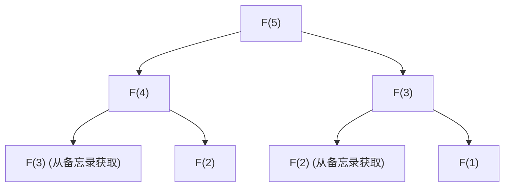

## 引言：为什么动态规划如此重要？

在计算机科学和算法设计中，我们每天都会面临各种复杂的问题。从路线优化、资源分配、自然语言处理中的序列对齐，到最前沿的强化学习，高效地找到最优解是我们的首要任务。

其中许多问题，如果采用简单的暴力（Brute-force）方法，计算时间将呈指数级增长，引发即使耗尽宇宙寿命也无法解决的“组合爆炸”。为了打破这令人绝望的计算量壁垒，我们拥有的最强大的武器之一就是**动态规划（Dynamic Programming, DP）**。

在本文中，我们将深入探讨动态规划的本质，以及其理论支柱**贝尔曼方程（Bellman Equation）**。从初学者也能轻松理解的具体例子开始，彻底解析最优子结构和重叠子问题等核心性质、自顶向下与自底向上实现方法的区别，以及在强化学习和马尔可夫决策过程（MDP）中的应用。

---

## 1. 动态规划的历史与名称由来

动态规划在20世纪50年代由美国数学家**理查德·贝尔曼（Richard Bellman）**提出。当时他在兰德公司（RAND Corporation）工作，研究军事优化问题和多阶段决策过程。

有趣的是，“Dynamic Programming”这个词本身最初并没有现代意义上的“计算机编程（编码）”的含义。当时的“Programming”指的是“制定计划（Planning）或制表（Tabular method）”，例如与“线性规划（Linear Programming）”中的用法相同。此外，“Dynamic”这个词是为了强调随着时间推移情况会发生变化的多阶段（多步）决策过程。还有一个著名的轶事，贝尔曼自己选择这个词是因为它“对研究资金的赞助商（特别是当时的国防部长）听起来很有吸引力，且是一个难以反驳的强有力的词”。

然而，在这个引人注目的名字背后，其数学基础是真实的。后来随着计算机的普及，它确立了作为算法设计中最重要范式之一的坚实地位。

---

## 2. 成立动态规划的“两个条件”

为了能够用动态规划高效地解决某个问题，该问题必须满足以下两个重要性质。

### 2.1. 最优子结构 (Optimal Substructure)

**最优子结构**是指“整个问题的最优解由该问题划分出的子问题的最优解构成”的性质。

例如，假设我们正在寻找从城市A到城市C的最短路径。如果已知中途必须经过城市B，那么从A到C的最短路径就是“从A到B的最短路径”加上“从B到C的最短路径”。如果存在另一条从A到B更短的路径，那么使用它就能让从A到C的路径更短。因此，要优化整体，部分路径也必须是优化的。

### 2.2. 重叠子问题 (Overlapping Subproblems)

**重叠子问题**是指“在将问题拆分并求解的过程中，完全相同的子问题会多次重复出现”的性质。

一个典型的例子是斐波那契数列。当我们定义求斐波那契数列第$n$项的函数为 $F(n) = F(n-1) + F(n-2)$ 时，为了计算 $F(5)$，我们需要 $F(4)$ 和 $F(3)$。为了进一步计算 $F(4)$，我们需要 $F(3)$ 和 $F(2)$。
这里值得注意的是，$F(3)$ 这个计算在不同的分支中多次出现。如果用暴力方法计算，这种计算的重叠会导致指数级的时间消耗。动态规划通过“将解决过的问题记忆（备忘录）下来，第二次及以后再次使用”的方式，大幅减少了计算量。

---

## 3. 方法的区别：记忆化（自顶向下） vs 制表法（自底向上）

动态规划的实现大致可以分为两种方法。虽然它们底层的思想都是“计算结果的复用”，但在推进计算的方向上有所不同。

### 3.1. 自顶向下方法（记忆化递归）

在自顶向下的方法中，从最初的大问题出发，将其拆分为小问题并递归地求解。此时，将计算过的小问题的答案保存在数组或哈希表等数据结构中。这被称为**记忆化（Memoization）**。

这种方法的优点是，由于原问题的结构可以直接用递归函数来描述，代码往往更直观。此外，在状态空间中，只按需计算实际需要的子问题，从而省去多余的计算。

### 3.2. 自底向上方法（制表法）

在自底向上的方法中，从最小的（平凡的）子问题开始计算，利用其结果逐步计算出更大问题的答案，最终得出想要解决的问题的答案。通常，准备一个数组（DP表），通过循环（迭代）处理从一端按顺序填入数值。这也被称为**制表法（Tabulation）**。

自底向上的最大优势在于没有函数调用的开销（如递归深度带来的调用栈消耗），因此执行速度快，且容易优化内存效率（例如在只需要保留最近两个值的情况下，有时能将空间复杂度降至 $O(1)$）。

---

## 4. 通过具体例子进行考察：背包问题

为了理解动态规划的威力，让我们来考虑一个经典且实用的问题：“0-1 背包问题”。

### 问题设定
一个小偷有一个容量为 $W$ 的背包。他面前有 $n$ 个物品，每个物品 $i$ 都有重量 $w_i$ 和价值 $v_i$。小偷希望在不超过背包容量的范围内选择物品，使得带走的物品总价值最大化。每个物品要么“选（1）”，要么“不选（0）”。

### DP公式化
为了解决这个问题，我们定义“状态”和“递推关系式（状态转移方程）”。

**状态的定义：**
将 `DP[i][w]` 定义为“从前 $i$ 个物品中选择，在总重量不超过 $w$ 的情况下的最大价值”。

**构建递推关系式：**
当考虑物品 $i$ 时，有两个选择。
1. **不选物品 $i$ 时：**
   价值不变，剩余重量也不变。
   `DP[i][w] = DP[i-1][w]`
2. **选择物品 $i$ 时（仅当 $w \ge w_i$ 时）：**
   加上物品 $i$ 的价值 $v_i$，剩余容量变为 $w - w_i$。对于这个剩余容量，加上前 $i-1$ 个物品能获得的最大价值。
   `DP[i][w] = DP[i-1][w - w_i] + v_i`

因此，只要在这两个选择中，采用价值更大的那一个即可。

$$ DP[i][w] = \max( DP[i-1][w], DP[i-1][w - w_i] + v_i ) $$

这个递推关系式正是背包问题中**最优子结构**作为数学公式的体现。整体的最优解是由“放入物品 $i$ 后剩余容量的最优解”这个子问题构成的。

---

## 5. 升华至贝尔曼方程（Bellman Equation）

到目前为止我们看到的递推关系方法，实际上正是**贝尔曼方程**的具体应用实例。
理查德·贝尔曼抽象了这种动态规划背后的原理，将其公式化为**最优化原理（Principle of Optimality）**。

> “最优策略具有这样的性质：无论初始状态和初始决策是什么，剩余的决策必须构成相对于初始决策所产生状态的最优策略。”

将这个概念用数学方法描述出来的就是贝尔曼方程。通常，在离散时间的状态转移模型中，状态 $s$ 的最优价值函数 $V^*(s)$ 被定义如下。

$$ V^*(s) = \max_{a} \left\{ R(s, a) + \gamma V^*(s') \right\} $$

各符号的含义如下。
- $V^*(s)$ : 从状态 $s$ 出发，未来能获得的总回报（期望值）的最大值。
- $a$ : 在状态 $s$ 下可以采取的动作（Action）。
- $R(s, a)$ : 在状态 $s$ 下采取动作 $a$ 时立即获得的奖励（Reward）。
- $\gamma$ : 折扣因子（Discount factor, $0 \le \gamma < 1$）。表示将未来的回报评估为当前价值的程度的参数。
- $s'$ : 采取动作 $a$ 之后转移到的下一个状态。

### 贝尔曼方程的含义

这个方程主张的是一个极其简单但又非常强大的事实：**“当前状态的最优价值，是立即获得的奖励，加上下一个状态的最优价值，在所有可能动作中取最大值。”**

这本质上与前面背包问题的递推式具有相同的结构。也就是说，它将复杂的多阶段优化问题分成了“当前的1步”和“之后的所有步（递归结构）”。

---

## 6. 在强化学习与马尔可夫决策过程（MDP）中的应用

在现代人工智能，尤其是**强化学习（Reinforcement Learning, RL）**中，贝尔曼方程扮演着核心理论的角色。
在像AlphaGo这样的人工智能击败围棋世界冠军，或者机器手学习行走的背后，存在着马尔可夫决策过程（MDP）这一概率框架，以及为了解决它而使用的贝尔曼方程。

在现实世界的问题中，采取动作 $a$ 之后的下一个状态 $s'$ 并不总是确定性的（比如可能一阵风刮过，机器人朝着意想不到的方向前进）。为了考虑这种不确定性，引入了状态转移概率 $P(s' | s, a)$ 的**贝尔曼期望方程（Bellman Expectation Equation）**和**贝尔曼最优方程（Bellman Optimality Equation）**。

$$ V^*(s) = \max_{a} \sum_{s'} P(s' | s, a) \left[ R(s, a, s') + \gamma V^*(s') \right] $$

强化学习的主要算法，如 **Q学习（Q-Learning）** 和 **价值迭代法（Value Iteration）**，正是通过反复计算这个贝尔曼方程，以近似求解来获得最优行为策略的过程。

---

## 总结：分治与记忆的美学

动态规划和贝尔曼方程不仅仅是编程技巧。可以说它们是一种“哲学”，用来将巨大而复杂的系统以及对不确定未来的决策，分解为合理且可计算的单元。

1. 利用**最优子结构**分割问题，
2. 记忆化（制表法）并复用**重叠子问题**的计算结果，
3. 通过**贝尔曼方程**将现在与未来的价值递归地联系起来。

深入理解这些概念，不仅能培养设计更高效算法的能力，还会为你提供一种通用的思维方法（心智模型），可应用于解决商业和日常生活中的复杂课题。

当你在编程遇到瓶颈，或者为复杂算法设计而苦恼时，请务必停下来问问自己：“这个问题能不能表示为更小问题的集合？”“我是不是忘记了已经解决的问题，在重复相同的计算？”在那里，应该有一把开启动态规划之门的钥匙。
