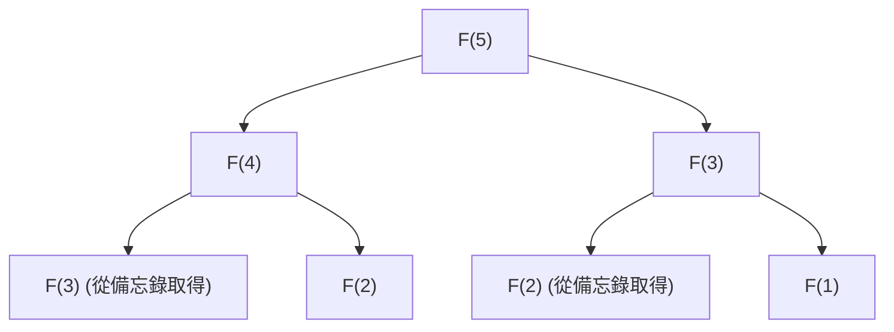

## 前言：為什麼動態規劃如此重要？

在電腦科學與演算法設計中，我們每天都會面臨各種複雜的問題。從路徑最佳化、資源分配、自然語言處理中的序列比對，一直到最先進的強化學習，有效率地找出最佳解是首要任務。

這些問題當中，有許多如果採用單純的暴力法（Brute-force），計算時間將呈指數級增長，甚至引發花上宇宙壽命的時間也無法解開的「組合爆炸」。要突破這道令人絕望的計算量高牆，最強大的武器之一就是**動態規劃（Dynamic Programming, DP）**。

本文將深入探討動態規劃的本質，直到作為其理論支柱的**貝爾曼方程式（Bellman Equation）**為止。我們將從初學者也能輕鬆理解的具體例子開始，徹底解說最佳子結構與重疊子問題等核心性質、由上而下（Top-down）與由下而上（Bottom-up）實作方式的差異，以及在強化學習與馬可夫決策過程（MDP）中的應用。

---

## 1. 動態規劃的歷史與名稱由來

動態規劃是在 1950 年代由美國數學家**理查·貝爾曼（Richard Bellman）**所提出。他當時任職於蘭德公司（RAND Corporation），從事軍事最佳化問題及多階段決策過程的研究。

有趣的是，「Dynamic Programming」這個詞本身，最初並沒有現代意義上的「電腦程式設計（Coding）」的意思。當時的「Programming」意指「制定計畫（Planning）或製作表格（Tabular method）」，就如同「線性規劃（Linear Programming）」中的用法一樣。此外，「Dynamic」一詞則是為了強調隨著時間流逝而改變狀況的多階段決策過程；同時，還有一個著名的軼事是，貝爾曼本人選擇這個詞是因為它「對研究資金的贊助者（特別是當時的國防部長）聽起來很有吸引力，且是一個難以反駁的強而有力的詞彙」。

然而，隱藏在這個響亮名稱背後的數學基礎是貨真價實的，後來隨著電腦的普及，它也在演算法設計的最重要典範中確立了堅不可摧的地位。

---

## 2. 讓動態規劃成立的「兩個條件」

為了能用動態規劃有效率地解決某個問題，該問題必須滿足以下兩個重要的性質。

### 2.1. 最佳子結構 (Optimal Substructure)

**最佳子結構**指的是「整體問題的最佳解，是由分割後子問題的最佳解所構成」的性質。

舉例來說，假設我們正在尋找從城市 A 到城市 C 的最短路徑。如果我們知道中途會經過城市 B，那麼從 A 到 C 的最短路徑，就會是「從 A 到 B 的最短路徑」與「從 B 到 C 的最短路徑」的總和。如果 A 到 B 有另一條更短的路存在，那麼走那條路的話，A 到 C 的路徑應該也會變得更短。因此，為了讓整體最佳化，局部的路徑也必須是最佳化的。

### 2.2. 重疊子問題 (Overlapping Subproblems)

**重疊子問題**指的是「在將問題分割並求解的過程中，完全相同的子問題會一再重複出現」的性質。

最典型的例子就是費氏數列（Fibonacci sequence）。當我們將求費氏數列第 $n$ 項的函數定義為 $F(n) = F(n-1) + F(n-2)$ 時，為了計算 $F(5)$，我們需要 $F(4)$ 與 $F(3)$。而為了計算 $F(4)$，又需要 $F(3)$ 與 $F(2)$。
在此值得注意的是，$F(3)$ 這個計算在不同的分支中出現了許多次。如果用暴力法來計算，這種重複計算將會耗費指數級的時間。動態規劃則是藉由「將解過一次的問題記憶（備忘）下來，第二次之後便重複使用」，從而大幅減少計算量。

---

## 3. 實作方法的差異：備忘錄法（Top-down） vs 建表法（Bottom-up）

動態規劃的實作大致上可分為兩種方法。兩者的根本概念都是「重複使用計算結果」，但計算進行的方向有所不同。

### 3.1. 由上而下法（備忘錄遞迴）

由上而下法（Top-down）是從原本的大問題出發，將其分割成小問題的同時，以遞迴的方式進行求解。這時候，會將已經計算過的小問題答案，儲存在陣列或雜湊表（Hash map）等資料結構中。這稱之為**備忘錄法（Memoization）**。

這種方法的優點在於，可以將原問題的結構直接描述為遞迴函數，程式碼往往較為直觀。此外，在狀態空間中，它只會視需求（On-demand）計算實際需要的子問題，因此能省去不必要的計算。

### 3.2. 由下而上法（建表法）

由下而上法（Bottom-up）是從最小（最簡單）的子問題開始計算，並利用這些結果一點一滴地計算出較大問題的答案，最終抵達我們想求出的問題答案。一般來說，會準備一個陣列（DP 表格），並透過迴圈（反覆）處理從頭開始依序填入數值。這也被稱為 **Tabulation（建表法）**。

由下而上法的最大優點在於，沒有函數呼叫的額外負擔（例如遞迴過深所導致的呼叫堆疊消耗等），因此執行速度快，記憶體效率也較容易最佳化（例如若只需保留最近的兩個值，空間複雜度有時可降至 $O(1)$）。

---

## 4. 透過具體例子來探討：背包問題

為了理解動態規劃的威力，讓我們來思考一個經典且實用的問題：「0-1 背包問題（0-1 Knapsack Problem）」。

### 問題設定
一個小偷帶著一個容量為 $W$ 的背包。他面前有 $n$ 個物品，每個物品 $i$ 都有設定好的重量 $w_i$ 與價值 $v_i$。小偷希望在不超過背包容量的範圍內挑選物品，使帶走的總價值最大化。對於每個物品，他只能選擇「拿取（1）」或「不拿（0）」。

### 使用 DP 進行公式化
為了解決這個問題，我們需要定義「狀態」與「遞迴式（狀態轉移方程式）」。

**狀態的定義：**
我們將 `DP[i][w]` 定義為「從前 $i$ 個物品中，在總重量不超過 $w$ 的情況下挑選時的最大價值」。

**遞迴式的建構：**
當考慮物品 $i$ 時，有兩個選擇。
1. **不選物品 $i$ 的情況：**
   價值不變，重量空間也不變。
   `DP[i][w] = DP[i-1][w]`
2. **選取物品 $i$ 的情況（僅限 $w \ge w_i$ 時）：**
   加上物品 $i$ 的價值 $v_i$，剩餘容量變為 $w - w_i$。對於這個剩餘容量，我們將截至物品 $i-1$ 為止能獲得的最大價值加上去。
   `DP[i][w] = DP[i-1][w - w_i] + v_i`

因此，只要在這兩個選擇中，採用價值較大的一方即可。

$$ DP[i][w] = \max( DP[i-1][w], DP[i-1][w - w_i] + v_i ) $$

這個遞迴式，正是將背包問題中的**最佳子結構**以數學式表現出來的結果。整體的最佳解，是由「放入物品 $i$ 後，針對剩餘容量的最佳解」這個子問題所構成的。

---

## 5. 昇華至貝爾曼方程式（Bellman Equation）

到目前為止我們看到的遞迴式方法，實際上就是**貝爾曼方程式**的具體應用實例。
理查·貝爾曼將這種動態規劃背後的原理進行了抽象化，並將其公式化為**最佳化原理（Principle of Optimality）**。

> 「最佳策略具有以下性質：無論初始狀態與初始決策為何，剩餘的決策必須構成一個針對由初始決策所產生之狀態的最佳策略。」

將這個概念以數學方式描述出來的，就是貝爾曼方程式。一般而言，在離散時間的狀態轉移模型中，狀態 $s$ 下的最佳價值函數 $V^*(s)$ 被定義如下：

$$ V^*(s) = \max_{a} \left\{ R(s, a) + \gamma V^*(s') \right\} $$

各個符號的意義如下：
- $V^*(s)$ : 從狀態 $s$ 出發時，未來可獲得報酬總和（期望值）的最大值。
- $a$ : 在狀態 $s$ 可以採取的行動（Action）。
- $R(s, a)$ : 在狀態 $s$ 採取行動 $a$ 時立即獲得的報酬（Reward）。
- $\gamma$ : 折扣因子（Discount factor, $0 \le \gamma < 1$）。表示將未來的報酬估算為當前價值時的參數。
- $s'$ : 採取行動 $a$ 後轉移到的下一個狀態。

### 貝爾曼方程式所代表的意義

這個方程式所主張的，是一個極為簡單卻強大的事實：**「當前狀態的最佳價值，是『現在馬上能獲得的報酬』與『下一個狀態的最佳價值』之和，在所有可能行動中的最大值」**。

這與前面提到的背包問題的遞迴式在本質上擁有相同的結構。也就是說，它將複雜的多階段最佳化問題，分割成了「當前的這一步」以及「之後所有的步驟（遞迴結構）」。

---

## 6. 在強化學習與馬可夫決策過程（MDP）上的應用

在現代人工智慧中，特別是**強化學習（Reinforcement Learning, RL）**，貝爾曼方程式扮演了理論核心的角色。
AlphaGo 這樣的 AI 能夠擊敗圍棋世界冠軍，或是機器人能學習行走，其背後存在著一個名為馬可夫決策過程（MDP）的機率框架，以及用來解開它的貝爾曼方程式。

在現實世界的問題中，採取行動 $a$ 之後的下一個狀態 $s'$ 未必是確定性的（可能因為吹了一陣風，機器人就往意料之外的方向前進）。為了將這種不確定性考量進去，我們會引入狀態轉移機率 $P(s' | s, a)$，並使用**貝爾曼期望方程式（Bellman Expectation Equation）**或**貝爾曼最佳方程式（Bellman Optimality Equation）**。

$$ V^*(s) = \max_{a} \sum_{s'} P(s' | s, a) \left[ R(s, a, s') + \gamma V^*(s') \right] $$

作為強化學習主要演算法的 **Q-Learning** 或是 **價值迭代法（Value Iteration）**，正是透過反覆計算這個貝爾曼方程式並求出近似解，藉此獲得最佳行動方針（策略）的過程。

---

## 總結：分治法與記憶的美學

動態規劃與貝爾曼方程式不僅僅是程式設計的技巧。它們可以說是一種「哲學」，用來將針對巨大複雜系統或不確定未來的決策，分解為合理且可計算的單位。

1. 利用**最佳子結構**來分割問題，
2. 記憶（備忘錄法、建表法）並重複使用**重疊子問題**的計算結果，
3. 透過**貝爾曼方程式**遞迴地將現在與未來的價值連結起來。

深入理解這些概念，不僅能培養設計出更有效率演算法的能力，還能賦予我們一種通用的思考方法（心智模型），可應用於解決商業或日常生活中的複雜課題。

當你在程式設計上遇到瓶頸，或是為了複雜演算法的設計而煩惱時，請務必停下腳步問問自己：「這個問題能不能表示成更小問題的集合？」、「我是不是忘記了已經解過的問題，而在重複相同的計算？」。打開動態規劃大門的鑰匙，一定就在那裡。
