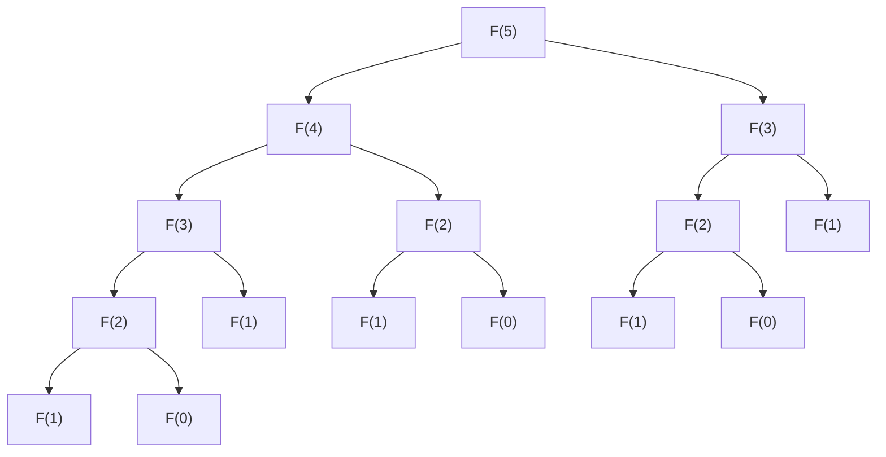

# 1. مقدمة

مع تقدمك في تعلم البرمجة والخوارزميات، هناك عقبة كبيرة يواجهها العديد من المتعلمين. وهي **البرمجة الديناميكية** (Dynamic Programming، أو باختصار **DP**). بمجرد سماع الاسم، قد تشعر بالرهبة وتفكر، 'يبدو هذا صعباً' أو 'هل يتطلب معرفة متخصصة في الرياضيات؟'. ومع ذلك، بمجرد فهمك للجوهر، ستدرك أن DP هي تقنية لحل المشكلات قوية جداً وبديهية.

في هذا المقال، سننطلق من المفاهيم الأساسية لـ DP، وسنشرح بدقة طريقة التفكير وكيفية التنفيذ باستخدام مشكلات تمثيلية مثل 'متتالية فيبوناتشي' و'مشكلة حقيبة الظهر' كأمثلة. دعونا نعمق فهمنا تدريجياً، مع تضمين أكواد Python.


# 2. ما هي البرمجة الديناميكية (DP)؟

البرمجة الديناميكية (Dynamic Programming) هي تقنية لحل المشكلات المعقدة عن طريق تقسيمها إلى عدة مشكلات فرعية صغيرة، والمضي قدماً في الحل مع تسجيل (تذكر) حلول كل مشكلة فرعية. هذا يزيل الهدر الناتج عن تكرار نفس الحسابات، مما يقلل بشكل كبير من وقت الحساب.

يكمن جوهر DP في الميزتين التاليتين:

1.  **البنية التحتية المثلى** (Optimal Substructure): خاصية أن الحل الأمثل لمشكلة كبيرة يمكن تكوينه من الحلول المثلى لمشكلاتها الفرعية الصغيرة.
2.  **تداخل المشكلات الفرعية** (Overlapping Subproblems): خاصية أن نفس المشكلات الصغيرة تظهر بشكل متكرر.

بالنسبة للمشكلات التي تتمتع بهذه الخصائص، تظهر DP قوة هائلة.

## نهجان لـ DP

يمكن تقسيم تنفيذ DP بشكل عام إلى نهجين.

### 1. التذكر العودي (النهج التنازلي)
تبدأ من المشكلة الكبيرة وتستدعي المشكلات الصغيرة بشكل عودي. عند القيام بذلك، يتم حفظ (تذكر) النتائج المحسوبة مسبقاً في مصفوفة أو خريطة تجزئة، وعندما تظهر نفس المشكلة مرة أخرى، يتم إرجاع القيمة المحفوظة دون إعادة الحساب.

### 2. النهج التصاعدي (فرق تسد وملء الجدول)
يتم حساب الحلول بدءاً من أصغر مشكلة وتسجيلها في مصفوفة (جدول DP). يتم حل المشكلات الكبيرة تدريجياً باستخدام حلول المشكلات الصغيرة، للحصول في النهاية على حل المشكلة المطلوبة.


# 3. الأساسيات: تعلم DP باستخدام متتالية فيبوناتشي

كخطوة أولى لفهم مفهوم DP، سنتناول متتالية فيبوناتشي.

متتالية فيبوناتشي هي متتالية تُعرف على النحو التالي:
$ F(0) = 0 $
$ F(1) = 1 $
$ F(n) = F(n-1) + F(n-2) \quad \text{من أجل } n \ge 2 $

## 3.1 فخ الاستدعاء العودي البسيط

دعونا نكتب دالة بلغة Python كما هو مُعرّف.

```python
def fib_recursive(n):
    if n <= 0:
        return 0
    elif n == 1:
        return 1
    return fib_recursive(n-1) + fib_recursive(n-2)
```

هذا التنفيذ بديهي، لكن به مشكلة كبيرة. وهي أن **التعقيد الزمني يزداد بشكل أسي**. دعونا نلقي نظرة على شجرة استدعاء الدوال عند حساب $F(5)$.



كما ترون، يتم حساب $F(3)$ و $F(2)$ بشكل متكرر عدة مرات. يصبح التعقيد الزمني $O(2^n)$، ومع زيادة $n$، لن ينتهي الحساب في وقت عملي.

## 3.2 التذكر العودي (النهج التنازلي)

ما يزيل هذا الهدر هو **التذكر** (Memoization). دعونا نحفظ النتائج التي تم حسابها مرة واحدة.

```python
def fib_memo(n, memo=None):
    if memo is None:
        memo = {}
    if n in memo:
        return memo[n]
    if n <= 0:
        return 0
    elif n == 1:
        return 1
    
    memo[n] = fib_memo(n-1, memo) + fib_memo(n-2, memo)
    return memo[n]
```

بهذا، يتم حساب كل $F(i)$ مرة واحدة فقط، وينخفض التعقيد الزمني بشكل كبير إلى $O(n)$.

## 3.3 النهج التصاعدي (جدول DP)

لتجنب الحمل الزائد للاستدعاء العودي، فإن النهج التصاعدي هو الحساب بالترتيب من الأسفل.

```python
def fib_dp(n):
    if n <= 0:
        return 0
    elif n == 1:
        return 1
        
    dp = [0] * (n + 1)
    dp[0] = 0
    dp[1] = 1
    
    for i in range(2, n + 1):
        dp[i] = dp[i-1] + dp[i-2]
        
    return dp[n]
```

نقوم بتجهيز المصفوفة `dp` ونملأها بالترتيب من الفهرس الأصغر. هذا هو الاستخدام النموذجي لجدول DP.


# 4. التطبيق: مشكلة حقيبة الظهر

تتجلى القوة الحقيقية لـ DP عند حل مشكلات التحسين. دعونا نفكر هنا في 'مشكلة حقيبة الظهر 0-1' الشهيرة.

## 4.1 إعداد المشكلة

أنت لص (هذا هو السيناريو). لديك حقيبة ظهر بسعة $W$. أمامك $N$ من العناصر، ولكل عنصر $i$ وزن $w_i$ وقيمة $v_i$.

اختر العناصر بحيث لا تتجاوز سعة حقيبة الظهر، وقم بـ **تعظيم إجمالي قيمة** العناصر التي ستأخذها معك. ومع ذلك، لا يوجد سوى عنصر واحد من كل نوع، والخيار إما 'اختيار (1)' أو 'عدم اختيار (0)'.

## 4.2 تعريف الحالة ومعادلة التكرار

عند حل المشكلات باستخدام DP، فإن أهم شيء هو استنتاج **تعريف الحالة** و **معادلة التكرار (معادلة انتقال الحالة)**.

نعرف الحالة على النحو التالي:
$dp[i][w]$ ：القيمة القصوى عند اختيار مجموعة من العناصر بحيث يكون إجمالي الوزن أقل من أو يساوي $w$، من بين أول $i$ عناصر.

هنا، عند التفكير في العنصر رقم $i$ (الوزن $w_i$، القيمة $v_i$)، هناك خياران:

1.  **حالة عدم الاختيار**:
    القيمة القصوى هي نفس الحالة السابقة $dp[i-1][w]$.
2.  **حالة الاختيار** (ممكن فقط إذا كان $w \ge w_i$):
    نضيف قيمة العنصر $i$ وهي $v_i$ إلى الحالة بعد طرح $w_i$ من السعة. أي أنه يصبح $dp[i-1][w - w_i] + v_i$.

وبالتالي، تكون معادلة التكرار على النحو التالي:

$$
dp[i][w] = 
\begin{cases}
\max(dp[i-1][w], dp[i-1][w - w_i] + v_i) & \text{إذا كان } w \ge w_i \\
dp[i-1][w] & \text{خلاف ذلك}
\end{cases}
$$

## 4.3 تنفيذ Python

نقوم بتحويل معادلة التكرار هذه كما هي إلى برنامج.

```python
def knapsack(weights, values, W):
    N = len(weights)
    # تهيئة جدول DP: مصفوفة ثنائية الأبعاد (N+1) x (W+1)
    dp = [[0] * (W + 1) for _ in range(N + 1)]
    
    # ملء جدول DP
    for i in range(1, N + 1):
        for w in range(W + 1):
            if w >= weights[i-1]:
                # أخذ القيمة القصوى لحالة الاختيار وعدم الاختيار
                dp[i][w] = max(dp[i-1][w], dp[i-1][w - weights[i-1]] + values[i-1])
            else:
                # حالة عدم التمكن من الاختيار بسبب تجاوز السعة
                dp[i][w] = dp[i-1][w]
                
    return dp[N][W]
```

### تطور جدول DP

دعونا نتتبع تطور جدول `dp` في مثال معين.

| $i$ \ $w$ | 0 | 1 | 2 | 3 | 4 | 5 |
|---|---|---|---|---|---|---|
| 0 | 0 | 0 | 0 | 0 | 0 | 0 |
| 1 | 0 | 0 | 3 | 3 | 3 | 3 |
| 2 | 0 | 2 | 3 | 5 | 5 | 5 |
| 3 | 0 | 2 | 3 | 5 | 6 | 7 |
| 4 | 0 | 2 | 3 | 5 | 6 | 7 |

بهذه الطريقة، يتم إيجاد الإجابة النهائية عن طريق إيجاد الحلول المثلى بالتسلسل من المشكلات الفرعية ذات السعة الأصغر وعدد العناصر الأقل.


# 5. شرح مفصل واستكشاف الخوارزميات لفهم DP بشكل أعمق

لترسيخ فهمك لـ DP، من الضروري التعرض لمزيد من الأمثلة وتعلم أنماط مختلفة من انتقالات الحالة.

## 5.1 مسافة التعديل (مسافة ليفنشتاين)

بالنظر إلى سلسلتين نصيتين $S$ و $T$، فإن المشكلة هي إيجاد الحد الأدنى لعدد عمليات 'الإدراج' و'الحذف' و'الاستبدال' المطلوبة لتحويل $S$ إلى $T$.

### معادلة التكرار

$$
dp[i][j] = 
\begin{cases}
dp[i-1][j-1] & \text{إذا كان } S[i-1] == T[j-1] \\
\min(dp[i][j-1], dp[i-1][j], dp[i-1][j-1]) + 1 & \text{خلاف ذلك}
\end{cases}
$$

## 5.2 تقنية تحسين التعقيد المكاني (التحديث في المكان)

في التطبيقات السابقة، استخدمنا ذاكرة $O(NW)$ أو $O(MN)$ لحساب انتقالات الحالة. ولكن بمراقبة معادلة التكرار بعناية، غالباً ما يتطلب تحديث حالة ما 'الصف السابق' فقط.

على سبيل المثال، باستخدام معادلة التكرار لمشكلة حقيبة الظهر، يمكن تقليل المصفوفة ثنائية الأبعاد إلى مصفوفة أحادية البعد. عند التحديث، عن طريق التحديث من اليمين إلى اليسار، يمكنك منع خطأ الكتابة فوق قيمة $i-1$ أثناء حساب $i$ الحالي.

```python
def knapsack_optimized(weights, values, W):
    N = len(weights)
    dp = [0] * (W + 1)
    
    for i in range(N):
        # من خلال التحديث بترتيب عكسي، تكفي مصفوفة أحادية البعد
        for w in range(W, weights[i] - 1, -1):
            dp[w] = max(dp[w], dp[w - weights[i]] + values[i])
            
    return dp[W]
```


### الجزء التوضيحي المتقدم 1: حدود DP واختيار الخوارزمية

تتمثل قوة البرمجة الديناميكية في تجنب تداخل البنى الفرعية، ولكن لا تزال ليست جميع المشكلات قابلة للحل بسرعة. على سبيل المثال، التعقيد الزمني لمشكلة حقيبة الظهر هو $O(NW)$، والذي يبدو للوهلة الأولى وقتاً كثير الحدود. ومع ذلك، فإن $W$ هو 'قيمة' الإدخال، ويمكن أن يكون حجمه أسياً بالنسبة لحجم الإدخال (عدد البتات). يسمى هذا التعقيد الزمني **وقت كثير الحدود الزائف** (Pseudo-polynomial time).

إذا كان $W$ كبيراً جداً، فستنفد الذاكرة فقط من حجز المصفوفة، وسيكون عدد التكرارات هائلاً، لذلك لا يمكن تطبيق تقنية DP هذه. في هذه الحالة، يجب التبديل إلى DP بالنسبة للحد الأقصى $V$ لإجمالي القيمة، أو هناك حاجة إلى نهج مختلف مثل الحصر النصفي (Meet in the Middle).

أيضاً، في تصحيح أخطاء DP، فإن **مقارنة الجدول المحسوب يدوياً للإدخال الصغير مع الجدول الذي يخرجه البرنامج** هي الأكثر فعالية. من خلال تجهيز ورقة وقلم ورسم جدول ثنائي الأبعاد فعلياً، يمكنك أن تفهم بوضوح 'لماذا هذه هي معادلة التكرار' و'أين أخطأت في الانتقال'.

### الجزء التوضيحي المتقدم 40: حدود DP واختيار الخوارزمية

تتمثل قوة البرمجة الديناميكية في تجنب تداخل البنى الفرعية، ولكن لا تزال ليست جميع المشكلات قابلة للحل بسرعة. على سبيل المثال، التعقيد الزمني لمشكلة حقيبة الظهر هو $O(NW)$، والذي يبدو للوهلة الأولى وقتاً كثير الحدود. ومع ذلك، فإن $W$ هو 'قيمة' الإدخال، ويمكن أن يكون حجمه أسياً بالنسبة لحجم الإدخال (عدد البتات). يسمى هذا التعقيد الزمني **وقت كثير الحدود الزائف** (Pseudo-polynomial time).

إذا كان $W$ كبيراً جداً، فستنفد الذاكرة فقط من حجز المصفوفة، وسيكون عدد التكرارات هائلاً، لذلك لا يمكن تطبيق تقنية DP هذه. في هذه الحالة، يجب التبديل إلى DP بالنسبة للحد الأقصى $V$ لإجمالي القيمة، أو هناك حاجة إلى نهج مختلف مثل الحصر النصفي (Meet in the Middle).

أيضاً، في تصحيح أخطاء DP، فإن **مقارنة الجدول المحسوب يدوياً للإدخال الصغير مع الجدول الذي يخرجه البرنامج** هي الأكثر فعالية. من خلال تجهيز ورقة وقلم ورسم جدول ثنائي الأبعاد فعلياً، يمكنك أن تفهم بوضوح 'لماذا هذه هي معادلة التكرار' و'أين أخطأت في الانتقال'.


# 6. خاتمة

قد تبدو البرمجة الديناميكية (DP) صعبة الفهم في البداية. ومع ذلك، بدءاً من الفهم البديهي لـ 'إزالة الحسابات غير الضرورية' في متتالية فيبوناتشي، والانتقال خطوة بخطوة إلى 'تعريف الحالة والانتقال' كما في مشكلة حقيبة الظهر، يمكنك بالتأكيد إتقانها.

**'كيفية تعريف الحالة'**
**'كيف يمكن حساب هذه الحالة من حالات صغيرة (معادلة التكرار)'**

لتنمية القدرة على رؤية هاتين النقطتين، فإن أقصر طريق هو التعرض للعديد من المشكلات ومحاولة كتابة جداول DP بيدك. يرجى تجربة التحدي، مسلحاً بالمعرفة التي تعلمتها في هذا المقال.
