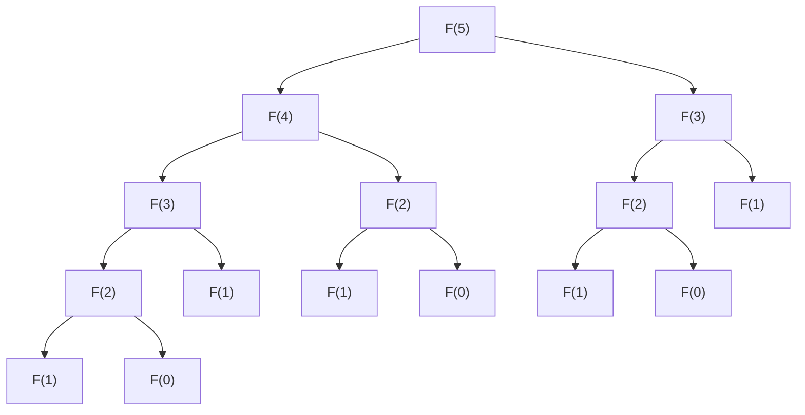

# 1. Einleitung

Wenn man im Bereich Programmierung und Algorithmen fortschreitet, stößt man auf eine große Hürde, mit der viele Lernende konfrontiert werden. Das ist die **Dynamische Programmierung** (Dynamic Programming, kurz **DP**). Wenn man nur den Namen hört, könnte man sich wappnen und denken: "Das klingt irgendwie schwierig" oder "Braucht man dafür mathematisches Fachwissen?". Wenn man jedoch das Wesen versteht, erkennt man, dass DP eine sehr leistungsfähige und zugleich intuitive Methode zur Problemlösung ist.

In diesem Artikel beginnen wir mit den Grundkonzepten der DP und erklären ausführlich ihre Denkweise und Implementierungsmethoden am Beispiel repräsentativer Probleme wie der "Fibonacci-Folge" und dem "Rucksackproblem". Lassen Sie uns das Verständnis Schritt für Schritt vertiefen, begleitet von Python-Code.


# 2. Was ist Dynamische Programmierung (DP)?

Dynamische Programmierung (Dynamic Programming) ist eine Methode, bei der ein komplexes Problem in mehrere kleine Teilprobleme unterteilt wird und die Lösung jedes Teilproblems aufgezeichnet (memoisiert) wird, während man es löst. Dadurch wird die Verschwendung wiederholter gleicher Berechnungen vermieden und die Berechnungszeit drastisch verkürzt.

Der Kern der DP liegt in den folgenden zwei Merkmalen:

1. **Optimale Teilstruktur** (Optimal Substructure): Die Eigenschaft, dass die optimale Lösung eines großen Problems aus den optimalen Lösungen seiner kleinen Teilprobleme zusammengesetzt werden kann.
2. **Überlappende Teilprobleme** (Overlapping Subproblems): Die Eigenschaft, dass dieselben kleinen Probleme immer wieder auftreten.

Für Probleme mit diesen Merkmalen entfaltet DP eine enorme Wirkung.

## Zwei Ansätze der DP

Bei der DP gibt es grob gesagt zwei Implementierungsansätze.

### 1. Memoisierte Rekursion (Top-down-Ansatz)
Man geht vom großen Problem aus und ruft rekursiv kleine Probleme auf. Dabei wird das einmal berechnete Ergebnis in einem Array oder einer Hashmap gespeichert (memoisiert). Wenn dasselbe Problem erneut auftritt, wird der memoisierte Wert zurückgegeben, ohne neu zu berechnen.

### 2. Bottom-up-Ansatz (Teile und Herrsche und Tabellenausfüllen)
Man berechnet die Lösungen beginnend mit dem kleinsten Problem und zeichnet sie in einem Array (DP-Tabelle) auf. Mit den Lösungen der kleinen Probleme löst man nach und nach größere Probleme, bis man schließlich die Lösung des gewünschten Problems erhält.


# 3. Grundlagen: DP lernen anhand der Fibonacci-Folge

Als ersten Schritt zum Verständnis des DP-Konzepts behandeln wir die Fibonacci-Folge.

Die Fibonacci-Folge ist wie folgt definiert:
$ F(0) = 0 $
$ F(1) = 1 $
$ F(n) = F(n-1) + F(n-2) \quad \text{für } n \ge 2 $

## 3.1 Die Falle des einfachen rekursiven Aufrufs

Schreiben wir die Funktion in Python genau nach der Definition.

```python
def fib_recursive(n):
    if n <= 0:
        return 0
    elif n == 1:
        return 1
    return fib_recursive(n-1) + fib_recursive(n-2)
```

Diese Implementierung ist intuitiv, hat aber ein großes Problem. Nämlich, dass **die Komplexität exponentiell ansteigt**. Schauen wir uns den Aufrufbaum der Funktion an, wenn $F(5)$ berechnet wird.



Wie Sie sehen können, werden $F(3)$ und $F(2)$ mehrfach wiederholt berechnet. Die Komplexität beträgt $O(2^n)$, und wenn $n$ groß wird, kann die Berechnung nicht in praxisgerechter Zeit beendet werden.

## 3.2 Memoisierte Rekursion (Top-down-Ansatz)

Die Methode zur Vermeidung dieser Verschwendung ist die **Memoisierung**. Speichern wir einmal berechnete Ergebnisse ab.

```python
def fib_memo(n, memo=None):
    if memo is None:
        memo = {}
    if n in memo:
        return memo[n]
    if n <= 0:
        return 0
    elif n == 1:
        return 1
    
    memo[n] = fib_memo(n-1, memo) + fib_memo(n-2, memo)
    return memo[n]
```

Dadurch wird jedes $F(i)$ nur noch einmal berechnet, und die Komplexität sinkt drastisch auf $O(n)$.

## 3.3 Bottom-up-Ansatz (DP-Tabelle)

Um den Overhead von rekursiven Aufrufen zu vermeiden, berechnet der Bottom-up-Ansatz von unten nach oben.

```python
def fib_dp(n):
    if n <= 0:
        return 0
    elif n == 1:
        return 1
        
    dp = [0] * (n + 1)
    dp[0] = 0
    dp[1] = 1
    
    for i in range(2, n + 1):
        dp[i] = dp[i-1] + dp[i-2]
        
    return dp[n]
```

Wir bereiten ein Array `dp` vor und füllen es in der Reihenfolge ab dem kleinsten Index aus. Dies ist die typische Verwendung einer DP-Tabelle.


# 4. Anwendung: Das Rucksackproblem

Das wahre Potenzial der DP zeigt sich bei der Lösung von Optimierungsproblemen. Betrachten wir hier das bekannte "0-1-Rucksackproblem".

## 4.1 Problemstellung

Sie sind ein Dieb (so das Szenario). Sie haben einen Rucksack mit der Kapazität $W$. Vor Ihnen liegen $N$ Gegenstände, und für jeden Gegenstand $i$ sind ein Gewicht $w_i$ und ein Wert $v_i$ festgelegt.

Wählen Sie Gegenstände so aus, dass die Kapazität des Rucksacks nicht überschritten wird, und **maximieren Sie die Summe der Werte** der mitgenommenen Gegenstände. Allerdings gibt es jeden Gegenstand nur einmal, und Sie müssen sich entscheiden zwischen "auswählen (1)" oder "nicht auswählen (0)".

## 4.2 Definition von Zuständen und Rekursionsgleichung

Bei der Lösung von Problemen mit DP ist die **Zustandsdefinition** und die Ableitung der **Rekursionsgleichung (Zustandsübergangsgleichung)** am wichtigsten.

Der Zustand wird wie folgt definiert:
$dp[i][w]$: Der Maximalwert bei der Auswahl aus den ersten $i$ Gegenständen, sodass das Gesamtgewicht höchstens $w$ beträgt.

Wenn wir nun den $i$-ten Gegenstand (Gewicht $w_i$, Wert $v_i$) betrachten, haben wir die folgenden zwei Optionen:

1. **Fall "nicht auswählen"**:
   Der Maximalwert entspricht dem vorherigen Zustand $dp[i-1][w]$.
2. **Fall "auswählen"** (nur möglich, wenn $w \ge w_i$):
   Dem Zustand, bei dem $w_i$ von der Kapazität abgezogen wird, wird der Wert $v_i$ des Gegenstands $i$ hinzugefügt. Das heißt, es ergibt sich $dp[i-1][w - w_i] + v_i$.

Daher lautet die Rekursionsgleichung wie folgt:

$$
dp[i][w] = 
\begin{cases}
\max(dp[i-1][w], dp[i-1][w - w_i] + v_i) & \text{wenn } w \ge w_i \\
dp[i-1][w] & \text{sonst}
\end{cases}
$$

## 4.3 Python-Implementierung

Wir übertragen diese Rekursionsgleichung direkt in ein Programm.

```python
def knapsack(weights, values, W):
    N = len(weights)
    # Initialisierung der DP-Tabelle: 2D-Array der Größe (N+1) x (W+1)
    dp = [[0] * (W + 1) for _ in range(N + 1)]
    
    # Ausfüllen der DP-Tabelle
    for i in range(1, N + 1):
        for w in range(W + 1):
            if w >= weights[i-1]:
                # Maximalwert zwischen Auswählen und Nicht-Auswählen nehmen
                dp[i][w] = max(dp[i-1][w], dp[i-1][w - weights[i-1]] + values[i-1])
            else:
                # Fall, wenn Kapazität überschritten und nicht ausgewählt werden kann
                dp[i][w] = dp[i-1][w]
                
    return dp[N][W]
```

### Übergänge der DP-Tabelle

Verfolgen wir die Übergänge der `dp`-Tabelle in einem bestimmten Beispiel.

| $i$ \ $w$ | 0 | 1 | 2 | 3 | 4 | 5 |
|---|---|---|---|---|---|---|
| 0 | 0 | 0 | 0 | 0 | 0 | 0 |
| 1 | 0 | 0 | 3 | 3 | 3 | 3 |
| 2 | 0 | 2 | 3 | 5 | 5 | 5 |
| 3 | 0 | 2 | 3 | 5 | 6 | 7 |
| 4 | 0 | 2 | 3 | 5 | 6 | 7 |

Auf diese Weise erhält man letztendlich die Antwort, indem man die optimale Lösung beginnend mit den Teilproblemen geringer Kapazität und kleiner Artikelanzahl bestimmt.


# 5. Detaillierte Erklärung und Erforschung von Algorithmen zum tieferen Verständnis von DP

Um das Verständnis für DP zu festigen, ist es unerlässlich, mehr Beispiele zu betrachten und verschiedene Muster von Zustandsübergängen zu lernen.

## 5.1 Editierdistanz (Levenshtein-Distanz)

Ein Problem, bei dem ermittelt wird, wie viele minimale Operationen von "Einfügen", "Löschen" und "Ersetzen" auf einen String $S$ angewendet werden müssen, um ihn in einen String $T$ umzuwandeln, wenn zwei Strings $S$ und $T$ gegeben sind.

### Rekursionsgleichung

$$
dp[i][j] = 
\begin{cases}
dp[i-1][j-1] & \text{wenn } S[i-1] == T[j-1] \\
\min(dp[i][j-1], dp[i-1][j], dp[i-1][j-1]) + 1 & \text{sonst}
\end{cases}
$$

## 5.2 Optimierungstechnik der räumlichen Komplexität (In-Place-Aktualisierung)

In den bisherigen Implementierungen haben wir $O(NW)$ oder $O(MN)$ Speicher für die Berechnung der Zustandsübergänge verwendet. Wenn man jedoch die Rekursionsgleichung genau beobachtet, wird für die Aktualisierung eines bestimmten Zustands oft nur die "vorherige Zeile" benötigt.

Beispielsweise können wir ein zweidimensionales Array auf ein eindimensionales reduzieren, indem wir die Rekursionsgleichung des Rucksackproblems nutzen. Bei der Aktualisierung wird von rechts nach links aktualisiert, was Fehler verhindert, bei denen der Wert von $i-1$ während der Berechnung des aktuellen $i$ überschrieben wird.

```python
def knapsack_optimized(weights, values, W):
    N = len(weights)
    dp = [0] * (W + 1)
    
    for i in range(N):
        # Durch Rückwärtsaktualisierung reicht ein 1D-Array
        for w in range(W, weights[i] - 1, -1):
            dp[w] = max(dp[w], dp[w - weights[i]] + values[i])
            
    return dp[W]
```

### Erweiterte Erklärung Teil 1: Grenzen der DP und Algorithmenauswahl

Die Stärke der Dynamischen Programmierung liegt in der Vermeidung der Überlappung von Teilstrukturen, jedoch können damit nicht alle Probleme schnell gelöst werden. Beispielsweise beträgt die Komplexität des Rucksackproblems $O(NW)$, was auf den ersten Blick wie eine polynomielle Zeit aussieht. $W$ ist jedoch der "Wert" der Eingabe und kann in Bezug auf die Eingabegröße (Anzahl der Bits) exponentiell groß werden. Eine solche Komplexität wird als **pseudopolynomielle Zeit** bezeichnet.

Wenn $W$ sehr groß ist, erschöpft allein die Allokation des Arrays den Speicher, und die Anzahl der Schleifendurchläufe wird enorm, sodass diese DP-Methode nicht mehr angewendet werden kann. In diesem Fall muss auf ein DP-Verfahren für die Obergrenze $V$ der Wertsumme umgestellt werden oder ein anderer Ansatz wie Meet-in-the-Middle erforderlich sein.

Außerdem ist es beim Debuggen von DP am effektivsten, **die bei kleinen Eingaben manuell berechnete Tabelle mit der vom Programm ausgegebenen Tabelle zu vergleichen**. Wenn man Papier und Stift zur Hand nimmt und die zweidimensionale Tabelle tatsächlich aufzeichnet, versteht man sofort, "warum es zu dieser Rekursionsgleichung kommt" und "wo der Übergang falsch ist".

### Erweiterte Erklärung Teil 40: Grenzen der DP und Algorithmenauswahl

Die Stärke der Dynamischen Programmierung liegt in der Vermeidung der Überlappung von Teilstrukturen, jedoch können damit nicht alle Probleme schnell gelöst werden. Beispielsweise beträgt die Komplexität des Rucksackproblems $O(NW)$, was auf den ersten Blick wie eine polynomielle Zeit aussieht. $W$ ist jedoch der "Wert" der Eingabe und kann in Bezug auf die Eingabegröße (Anzahl der Bits) exponentiell groß werden. Eine solche Komplexität wird als **pseudopolynomielle Zeit** bezeichnet.

Wenn $W$ sehr groß ist, erschöpft allein die Allokation des Arrays den Speicher, und die Anzahl der Schleifendurchläufe wird enorm, sodass diese DP-Methode nicht mehr angewendet werden kann. In diesem Fall muss auf ein DP-Verfahren für die Obergrenze $V$ der Wertsumme umgestellt werden oder ein anderer Ansatz wie Meet-in-the-Middle erforderlich sein.

Außerdem ist es beim Debuggen von DP am effektivsten, **die bei kleinen Eingaben manuell berechnete Tabelle mit der vom Programm ausgegebenen Tabelle zu vergleichen**. Wenn man Papier und Stift zur Hand nimmt und die zweidimensionale Tabelle tatsächlich aufzeichnet, versteht man sofort, "warum es zu dieser Rekursionsgleichung kommt" und "wo der Übergang falsch ist".

# 6. Fazit

Dynamische Programmierung (DP) mag auf den ersten Blick abschreckend wirken. Wenn Sie jedoch mit einem intuitiven Verständnis der "Vermeidung sinnloser Berechnungen" in der Fibonacci-Folge beginnen und schrittweise zu Dingen wie der "Definition von Zuständen und Übergängen" im Rucksackproblem fortschreiten, können Sie es sicher meistern.

**"Wie man den Zustand definiert"**
**"Aus welchen kleinen Zuständen dieser Zustand berechnet werden kann (Rekursionsgleichung)"**

Der kürzeste Weg, die Fähigkeit zu entwickeln, diese beiden Punkte zu erkennen, besteht darin, sich vielen Problemen zu stellen und zu versuchen, die DP-Tabelle selbst aufzuzeichnen. Versuchen Sie unbedingt, das in diesem Artikel Gelernte als Waffe zu nutzen, und stellen Sie sich der Herausforderung.
