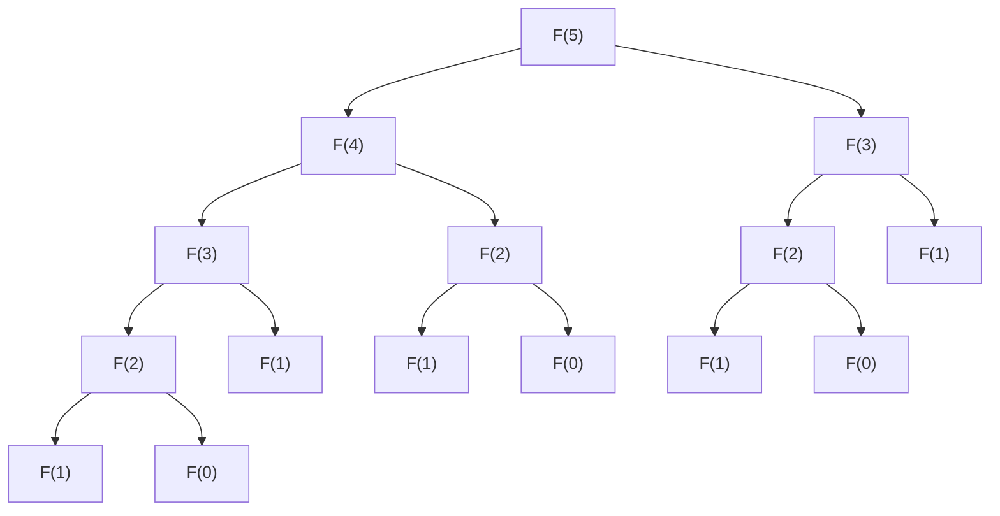

# 1. Introducción

Al avanzar en el aprendizaje de programación y algoritmos, hay un gran obstáculo al que se enfrentan muchos estudiantes. Ese es la **Programación Dinámica** (Dynamic Programming, abreviado como **DP** ). Solo al escuchar el nombre, podrías ponerte a la defensiva pensando: «Parece difícil» o «¿No se necesitan conocimientos matemáticos especializados?». Sin embargo, si entiendes su esencia, te darás cuenta de que la DP es un método de resolución de problemas muy poderoso y, a la vez, intuitivo.

En este artículo, partiendo de los conceptos básicos de la DP y usando como ejemplos problemas representativos como la «secuencia de Fibonacci» y el «problema de la mochila», explicaremos exhaustivamente su forma de pensar y métodos de implementación. Profundicemos en su comprensión paso a paso, intercalando código en Python.


# 2. ¿Qué es la Programación Dinámica (DP)?

La Programación Dinámica (Dynamic Programming) es un método que divide un problema complejo en varios subproblemas más pequeños y avanza resolviéndolos mientras registra (memoriza) las soluciones de cada subproblema. Con esto, se elimina el desperdicio de repetir los mismos cálculos y se puede reducir drásticamente el tiempo de computación.

El núcleo de la DP reside en las siguientes 2 características.

1.  **Subestructura Óptima** (Optimal Substructure): La propiedad de que la solución óptima de un problema grande se puede componer a partir de las soluciones óptimas de sus subproblemas pequeños.
2.  **Superposición de Subproblemas** (Overlapping Subproblems): La propiedad de que el mismo subproblema pequeño aparece repetidamente varias veces.

Para problemas que tienen estas características, la DP demuestra un poder inmenso.

## 2 enfoques de la DP

La DP se divide a grandes rasgos en 2 enfoques de implementación.

### 1. Recursión con memorización (Enfoque Top-down)
Se parte de un problema grande y se llaman recursivamente a problemas más pequeños. En ese momento, los resultados calculados una vez se guardan (memorizan) en un array o hash map, y cuando el mismo problema vuelve a aparecer, se devuelve el valor memorizado sin recalcularlo.

### 2. Enfoque Bottom-up (Divide y vencerás y llenado de tablas)
Se calculan las soluciones en orden desde el problema más pequeño y se registran en un array (tabla DP). Usando las soluciones de los problemas pequeños se resuelven gradualmente los problemas más grandes y, finalmente, se obtiene la solución del problema que se desea encontrar.


# 3. Nivel Básico: Aprender DP con la secuencia de Fibonacci

Como primer paso para entender el concepto de la DP, tomaremos la secuencia de Fibonacci.

La secuencia de Fibonacci es una secuencia definida de la siguiente manera.
$ F(0) = 0 $
$ F(1) = 1 $
$ F(n) = F(n-1) + F(n-2) \quad \text{para } n \ge 2 $

## 3.1 La trampa de la llamada recursiva simple

Vamos a escribir la función en Python tal como se define.

```python
def fib_recursive(n):
    if n <= 0:
        return 0
    elif n == 1:
        return 1
    return fib_recursive(n-1) + fib_recursive(n-2)
```

Esta implementación es intuitiva, pero tiene un gran problema. Eso es que **la complejidad computacional aumenta exponencialmente** . Veamos el árbol de llamadas de la función al calcular $F(5)$.



Como pueden ver, $F(3)$ y $F(2)$ se calculan repetidamente muchas veces. La complejidad computacional es de $O(2^n)$, y a medida que $n$ se hace grande, el cálculo no terminará en un tiempo práctico.

## 3.2 Recursión con memorización (Enfoque Top-down)

Lo que elimina este desperdicio es la **memorización** . Guardemos los resultados calculados una vez.

```python
def fib_memo(n, memo=None):
    if memo is None:
        memo = {}
    if n in memo:
        return memo[n]
    if n <= 0:
        return 0
    elif n == 1:
        return 1
    
    memo[n] = fib_memo(n-1, memo) + fib_memo(n-2, memo)
    return memo[n]
```

Con esto, cada $F(i)$ solo se calculará una vez y la complejidad computacional se reducirá drásticamente a $O(n)$.

## 3.3 Enfoque Bottom-up (Tabla DP)

Para evitar la sobrecarga de las llamadas recursivas, el enfoque bottom-up calcula en orden desde abajo.

```python
def fib_dp(n):
    if n <= 0:
        return 0
    elif n == 1:
        return 1
        
    dp = [0] * (n + 1)
    dp[0] = 0
    dp[1] = 1
    
    for i in range(2, n + 1):
        dp[i] = dp[i-1] + dp[i-2]
        
    return dp[n]
```

Preparamos un array `dp` y lo llenamos en orden desde los índices más pequeños. Este es el uso típico de una tabla DP.


# 4. Nivel Aplicado: Problema de la mochila

El verdadero valor de la DP se muestra al resolver problemas de optimización. Aquí consideraremos el famoso «problema de la mochila 0-1».

## 4.1 Configuración del problema

Eres un ladrón (esa es la premisa). Tienes una mochila con capacidad $W$. Delante de ti hay $N$ artículos, y cada artículo $i$ tiene asignado un peso $w_i$ y un valor $v_i$.

Selecciona los artículos sin exceder la capacidad de la mochila y **maximiza la suma de valores** de los artículos que te llevas. Sin embargo, solo hay un artículo de cada tipo, por lo que debes elegir «llevar (1)» o «no llevar (0)».

## 4.2 Definición del estado y relación de recurrencia

Al resolver problemas con DP, lo más importante es la **definición del estado** y la derivación de la **relación de recurrencia (ecuación de transición de estado)** .

Definimos el estado de la siguiente manera.
$dp[i][w]$ : El valor máximo cuando se eligen entre los primeros $i$ artículos de modo que la suma de los pesos sea menor o igual a $w$.

Aquí, al considerar el artículo número $i$ (peso $w_i$, valor $v_i$), hay 2 opciones.

1.  **Caso de no elegir** :
    El valor máximo es el mismo que el del estado anterior $dp[i-1][w]$.
2.  **Caso de elegir** (solo posible si $w \ge w_i$):
    Al estado en el que se ha restado $w_i$ a la capacidad, le sumamos el valor $v_i$ del artículo $i$. Es decir, se convierte en $dp[i-1][w - w_i] + v_i$.

Por lo tanto, la relación de recurrencia es la siguiente.

$$
dp[i][w] = 
\begin{cases}
\max(dp[i-1][w], dp[i-1][w - w_i] + v_i) & \text{si } w \ge w_i \\
dp[i-1][w] & \text{en otro caso}
\end{cases}
$$

## 4.3 Implementación en Python

Llevaremos esta relación de recurrencia directamente a un programa.

```python
def knapsack(weights, values, W):
    N = len(weights)
    # Inicialización de la tabla DP: array 2D de (N+1) x (W+1)
    dp = [[0] * (W + 1) for _ in range(N + 1)]
    
    # Llenar la tabla DP
    for i in range(1, N + 1):
        for w in range(W + 1):
            if w >= weights[i-1]:
                # Tomar el valor máximo entre elegir y no elegir
                dp[i][w] = max(dp[i-1][w], dp[i-1][w - weights[i-1]] + values[i-1])
            else:
                # Caso en que no se puede elegir por exceso de capacidad
                dp[i][w] = dp[i-1][w]
                
    return dp[N][W]
```

### Transición de la tabla DP

Vamos a seguir la transición de la tabla `dp` en un ejemplo.

| $i$ \ $w$ | 0 | 1 | 2 | 3 | 4 | 5 |
|---|---|---|---|---|---|---|
| 0 | 0 | 0 | 0 | 0 | 0 | 0 |
| 1 | 0 | 0 | 3 | 3 | 3 | 3 |
| 2 | 0 | 2 | 3 | 5 | 5 | 5 |
| 3 | 0 | 2 | 3 | 5 | 6 | 7 |
| 4 | 0 | 2 | 3 | 5 | 6 | 7 |

De esta manera, al encontrar la solución óptima en orden desde los subproblemas con poca capacidad y pocos artículos, finalmente se encuentra la respuesta.


# 5. Explicación detallada y exploración de algoritmos para entender la DP más profundamente

Para consolidar la comprensión de la DP, es esencial exponerse a más ejemplos y aprender los diversos patrones de transición de estados.

## 5.1 Distancia de edición (Distancia de Levenshtein)

Dadas dos cadenas $S$ y $T$, es un problema para encontrar el número mínimo de operaciones de «inserción», «eliminación» y «sustitución» necesarias en $S$ para convertirla en $T$.

### Relación de recurrencia

$$
dp[i][j] = 
\begin{cases}
dp[i-1][j-1] & \text{si } S[i-1] == T[j-1] \\
\min(dp[i][j-1], dp[i-1][j], dp[i-1][j-1]) + 1 & \text{en otro caso}
\end{cases}
$$

## 5.2 Técnica de optimización de la complejidad espacial (Actualización in-place)

En las implementaciones hasta ahora, hemos estado usando una memoria de $O(NW)$ u $O(MN)$ para calcular las transiciones de estados. Sin embargo, observando de cerca la relación de recurrencia, para actualizar un cierto estado, a menudo solo se necesita la «fila anterior».

Por ejemplo, utilizando la relación de recurrencia del problema de la mochila, un array 2D se puede reducir a un array 1D. Al momento de actualizar, al hacerlo de derecha a izquierda, se puede evitar el error de sobrescribir el valor de $i-1$ durante el cálculo actual de $i$.

```python
def knapsack_optimized(weights, values, W):
    N = len(weights)
    dp = [0] * (W + 1)
    
    for i in range(N):
        # Al actualizar en orden inverso, basta con un array 1D
        for w in range(W, weights[i] - 1, -1):
            dp[w] = max(dp[w], dp[w - weights[i]] + values[i])
            
    return dp[W]
```


### Parte de Explicación Avanzada 1: Límites de la DP y selección de algoritmos

La fuerza de la programación dinámica radica en evitar la superposición de subestructuras, pero aun así, no todos los problemas se pueden resolver a alta velocidad. Por ejemplo, la complejidad computacional del problema de la mochila es de $O(NW)$, lo que a primera vista parece tiempo polinomial. Sin embargo, $W$ es el «valor» de entrada, que puede ser exponencialmente grande en relación con el tamaño de la entrada (número de bits). A esta complejidad computacional se le llama **tiempo pseudopolinomial** .

Si $W$ es muy grande, simplemente con reservar el array se agotará la memoria, y el número de bucles será enorme, por lo que este método de DP no se podrá aplicar. En ese caso, se debe cambiar a una DP respecto al límite superior de la suma de los valores $V$, o se requerirá un enfoque diferente como la enumeración de la mitad completa (Meet in the Middle).

Además, en la depuración de DP, **comparar una tabla calculada a mano con una entrada pequeña con la tabla que genera el programa** es lo más efectivo. Al preparar papel y lápiz e intentar escribir la tabla 2D, podrás entender a la perfección «por qué se convierte en esta relación de recurrencia» o «dónde te equivocaste en la transición».

### Parte de Explicación Avanzada 40: Límites de la DP y selección de algoritmos

La fuerza de la programación dinámica radica en evitar la superposición de subestructuras, pero aun así, no todos los problemas se pueden resolver a alta velocidad. Por ejemplo, la complejidad computacional del problema de la mochila es de $O(NW)$, lo que a primera vista parece tiempo polinomial. Sin embargo, $W$ es el «valor» de entrada, que puede ser exponencialmente grande en relación con el tamaño de la entrada (número de bits). A esta complejidad computacional se le llama **tiempo pseudopolinomial** .

Si $W$ es muy grande, simplemente con reservar el array se agotará la memoria, y el número de bucles será enorme, por lo que este método de DP no se podrá aplicar. En ese caso, se debe cambiar a una DP respecto al límite superior de la suma de los valores $V$, o se requerirá un enfoque diferente como la enumeración de la mitad completa (Meet in the Middle).

Además, en la depuración de DP, **comparar una tabla calculada a mano con una entrada pequeña con la tabla que genera el programa** es lo más efectivo. Al preparar papel y lápiz e intentar escribir la tabla 2D, podrás entender a la perfección «por qué se convierte en esta relación de recurrencia» o «dónde te equivocaste en la transición».

# 6. Conclusión

Al principio, podrías sentir que es difícil acercarse a la Programación Dinámica (DP). Sin embargo, partiendo de una comprensión intuitiva como la «eliminación de cálculos inútiles» en la secuencia de Fibonacci, y avanzando hacia la «definición de estados y transiciones» como en el problema de la mochila, definitivamente podrás dominarla.

**«Cómo definir el estado»**
**«A partir de qué pequeños estados se puede calcular ese estado (relación de recurrencia)»**

Para cultivar la capacidad de ver a través de estos 2 puntos, la forma más rápida es interactuar con muchos problemas e intentar escribir tablas DP con tus propias manos. Por favor, asume el desafío armado con los conocimientos aprendidos en este artículo.
