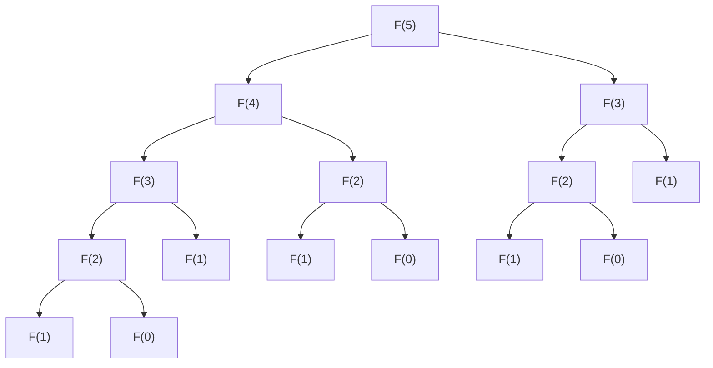

# 1. Introduction

Au fur et à mesure que l'on progresse dans l'apprentissage de la programmation et des algorithmes, de nombreux apprenants se heurtent à un grand obstacle. Il s'agit de la **programmation dynamique** (Dynamic Programming, en abrégé **DP**). En entendant seulement le nom, vous pourriez vous mettre sur la défensive en pensant : "Cela a l'air difficile" ou "Faut-il des connaissances spécialisées en mathématiques ?". Cependant, si l'on en comprend l'essence, on s'aperçoit que la DP est une méthode de résolution de problèmes très puissante et intuitive.

Dans cet article, nous partirons des concepts de base de la DP, et nous expliquerons en profondeur sa logique et ses méthodes d'implémentation en prenant pour exemples des problèmes représentatifs que sont la "suite de Fibonacci" et le "problème du sac à dos". Approfondissons notre compréhension étape par étape, en y mêlant du code Python.


# 2. Qu'est-ce que la programmation dynamique (DP) ?

La programmation dynamique (Dynamic Programming) est une technique qui consiste à diviser un problème complexe en plusieurs petits sous-problèmes, et à avancer dans la résolution en enregistrant (mémorisant) la solution de chaque sous-problème. Cela permet d'éliminer le gaspillage lié à la répétition des mêmes calculs, et de réduire considérablement le temps de calcul.

Le cœur de la DP réside dans les deux caractéristiques suivantes :

1.  **Sous-structure optimale** (Optimal Substructure) : La propriété selon laquelle la solution optimale d'un grand problème peut être construite à partir des solutions optimales de ses petits sous-problèmes.
2.  **Chevauchement des sous-problèmes** (Overlapping Subproblems) : La propriété selon laquelle les mêmes petits problèmes apparaissent de manière répétée.

Ces caractéristiques font que la DP démontre une puissance absolue.

## Les 2 approches de la DP

La DP propose globalement deux approches d'implémentation.

### 1. Récursivité avec mémoïsation (approche descendante)
On part du grand problème et on appelle récursivement de petits problèmes. À ce moment-là, on enregistre (mémorise) le résultat une fois calculé dans un tableau ou une table de hachage, et lorsque le même problème réapparaît, on renvoie la valeur mémorisée sans la recalculer.

### 2. Approche ascendante (tableau DP)
On calcule les solutions dans l'ordre, du plus petit problème au plus grand, et on les enregistre dans un tableau (tableau DP). On utilise les solutions des petits problèmes pour résoudre progressivement les grands problèmes, et on obtient finalement la solution du problème que l'on cherche à résoudre.


# 3. Partie de base : Apprendre la DP avec la suite de Fibonacci

Comme première étape pour comprendre le concept de la DP, nous allons aborder la suite de Fibonacci.

La suite de Fibonacci est une suite définie comme suit :
$ F(0) = 0 $
$ F(1) = 1 $
$ F(n) = F(n-1) + F(n-2) \quad \text{pour } n \ge 2 $

## 3.1 Le piège du simple appel récursif

Essayons d'écrire une fonction en Python exactement comme la définition.

```python
def fib_recursive(n):
    if n <= 0:
        return 0
    elif n == 1:
        return 1
    return fib_recursive(n-1) + fib_recursive(n-2)
```

Cette implémentation est intuitive, mais présente un gros problème. C'est que **la complexité temporelle augmente de manière exponentielle**. Regardons l'arbre des appels de fonction lors du calcul de $F(5)$.



Comme vous pouvez le voir, $F(3)$ et $F(2)$ sont calculés à plusieurs reprises. La complexité temporelle devient $O(2^n)$, et lorsque $n$ devient grand, le calcul ne se termine plus dans un temps raisonnable.

## 3.2 Récursivité avec mémoïsation (approche descendante)

Ce qui élimine ce gaspillage, c'est la **mémoïsation**. Sauvegardons les résultats une fois calculés.

```python
def fib_memo(n, memo=None):
    if memo is None:
        memo = {}
    if n in memo:
        return memo[n]
    if n <= 0:
        return 0
    elif n == 1:
        return 1
    
    memo[n] = fib_memo(n-1, memo) + fib_memo(n-2, memo)
    return memo[n]
```

Grâce à cela, chaque $F(i)$ n'est calculé qu'une seule fois, et la complexité temporelle chute drastiquement à $O(n)$.

## 3.3 Approche ascendante (tableau DP)

Afin d'éviter la surcharge des appels récursifs, l'approche ascendante consiste à calculer dans l'ordre en partant du bas.

```python
def fib_dp(n):
    if n <= 0:
        return 0
    elif n == 1:
        return 1
        
    dp = [0] * (n + 1)
    dp[0] = 0
    dp[1] = 1
    
    for i in range(2, n + 1):
        dp[i] = dp[i-1] + dp[i-2]
        
    return dp[n]
```

On prépare un tableau `dp`, et on le remplit dans l'ordre à partir des petits indices. C'est l'utilisation typique d'un tableau DP.


# 4. Partie appliquée : Le problème du sac à dos

La véritable valeur de la DP s'exprime lorsqu'on résout des problèmes d'optimisation. Considérons ici le célèbre "problème du sac à dos 0-1".

## 4.1 Énoncé du problème

Vous êtes un voleur (c'est le contexte). Vous avez un sac à dos d'une capacité de $W$. Devant vous se trouvent $N$ objets, et chaque objet $i$ a un poids $w_i$ et une valeur $v_i$.

Choisissez des objets dans la limite de la capacité du sac à dos, et **maximisez la valeur totale** des objets que vous rapportez. Cependant, chaque objet est unique, et le choix est soit "le prendre (1)", soit "ne pas le prendre (0)".

## 4.2 Définition de l'état et relation de récurrence

Lors de la résolution d'un problème avec la DP, le plus important est la **définition de l'état** et la dérivation de la **relation de récurrence (équation de transition d'état)**.

L'état est défini comme suit.
$dp[i][w]$ : La valeur maximale lorsqu'on choisit parmi les $i$ premiers objets de sorte que le poids total soit inférieur ou égal à $w$.

Ici, lorsqu'on considère le $i$-ème objet (poids $w_i$, valeur $v_i$), il y a deux options.

1.  **Si on ne le choisit pas** :
    La valeur maximale est la même que l'état précédent $dp[i-1][w]$.
2.  **Si on le choisit** (possible seulement si $w \ge w_i$) :
    On ajoute la valeur $v_i$ de l'objet $i$ à l'état où l'on a soustrait $w_i$ de la capacité. C'est-à-dire, cela devient $dp[i-1][w - w_i] + v_i$.

Par conséquent, la relation de récurrence est la suivante.

$$
dp[i][w] = 
\begin{cases}
\max(dp[i-1][w], dp[i-1][w - w_i] + v_i) & \text{si } w \ge w_i \\
dp[i-1][w] & \text{sinon}
\end{cases}
$$

## 4.3 Implémentation en Python

Nous transposons cette relation de récurrence telle quelle dans le programme.

```python
def knapsack(weights, values, W):
    N = len(weights)
    # Initialisation du tableau DP : tableau 2D de (N+1) x (W+1)
    dp = [[0] * (W + 1) for _ in range(N + 1)]
    
    # Remplissage du tableau DP
    for i in range(1, N + 1):
        for w in range(W + 1):
            if w >= weights[i-1]:
                # Prendre le maximum entre le cas où l'on choisit et celui où l'on ne choisit pas
                dp[i][w] = max(dp[i-1][w], dp[i-1][w - weights[i-1]] + values[i-1])
            else:
                # Cas où l'on ne peut pas choisir pour cause de dépassement de capacité
                dp[i][w] = dp[i-1][w]
                
    return dp[N][W]
```

### Transition du tableau DP

Suivons la transition du tableau `dp` avec un exemple.

| $i$ \ $w$ | 0 | 1 | 2 | 3 | 4 | 5 |
|---|---|---|---|---|---|---|
| 0 | 0 | 0 | 0 | 0 | 0 | 0 |
| 1 | 0 | 0 | 3 | 3 | 3 | 3 |
| 2 | 0 | 2 | 3 | 5 | 5 | 5 |
| 3 | 0 | 2 | 3 | 5 | 6 | 7 |
| 4 | 0 | 2 | 3 | 5 | 6 | 7 |

De cette manière, en cherchant la solution optimale dans l'ordre à partir de sous-problèmes avec une petite capacité et peu d'objets, on trouve finalement la réponse.


# 5. Explications détaillées et exploration des algorithmes pour une compréhension plus approfondie de la DP

Pour consolider sa compréhension de la DP, il est essentiel d'aborder plus d'exemples de problèmes et d'apprendre divers modèles de transition d'état.

## 5.1 Distance d'édition (Distance de Levenshtein)

Étant donné deux chaînes de caractères $S$ et $T$, c'est un problème qui cherche à trouver le nombre minimum d'opérations d'"insertion", de "suppression" et de "remplacement" à effectuer sur $S$ pour la convertir en $T$.

### Relation de récurrence

$$
dp[i][j] = 
\begin{cases}
dp[i-1][j-1] & \text{si } S[i-1] == T[j-1] \\
\min(dp[i][j-1], dp[i-1][j], dp[i-1][j-1]) + 1 & \text{sinon}
\end{cases}
$$

## 5.2 Technique d'optimisation de la complexité spatiale (Mise à jour sur place)

Dans les implémentations jusqu'à présent, nous avons utilisé une mémoire de $O(NW)$ ou $O(MN)$ pour le calcul des transitions d'état. Cependant, si l'on observe attentivement la relation de récurrence, il arrive souvent que seule "la ligne précédente" soit nécessaire pour mettre à jour un état donné.

Par exemple, en utilisant la relation de récurrence du problème du sac à dos, on peut réduire le tableau 2D à un tableau 1D. Lors de la mise à jour, en mettant à jour de droite à gauche, on peut éviter le bug d'écrasement de la valeur de $i-1$ pendant le calcul du $i$ actuel.

```python
def knapsack_optimized(weights, values, W):
    N = len(weights)
    dp = [0] * (W + 1)
    
    for i in range(N):
        # En mettant à jour dans l'ordre inverse, un tableau 1D suffit
        for w in range(W, weights[i] - 1, -1):
            dp[w] = max(dp[w], dp[w - weights[i]] + values[i])
            
    return dp[W]
```


### Partie d'explication avancée 1: Les limites de la DP et le choix de l'algorithme

La force de la programmation dynamique est d'éviter le chevauchement des sous-structures, mais cela ne signifie pas que tous les problèmes peuvent être résolus rapidement. Par exemple, la complexité temporelle du problème du sac à dos est de $O(NW)$, ce qui ressemble à première vue à un temps polynomial. Cependant, $W$ est la "valeur" de l'entrée, et peut être de taille exponentielle par rapport à la taille de l'entrée (nombre de bits). Une telle complexité est appelée **temps pseudo-polynomial**.

Si $W$ est extrêmement grand, l'allocation du tableau à elle seule épuisera la mémoire, et le nombre de boucles sera énorme, de sorte que cette méthode DP ne pourra plus être appliquée. Dans ce cas, il est nécessaire de passer à une DP par rapport à la limite supérieure de la somme des valeurs $V$, ou d'utiliser une autre approche telle que la séparation en deux (Meet in the Middle).

De plus, lors du débogage de la DP, **comparer le tableau calculé à la main avec de petites entrées et le tableau produit par le programme** est le plus efficace. En préparant du papier et un stylo et en dessinant réellement un tableau en 2D, vous comprendrez parfaitement "pourquoi il s'agit de cette relation de récurrence" et "où la transition est erronée".

### Partie d'explication avancée 2: Les limites de la DP et le choix de l'algorithme

La force de la programmation dynamique est d'éviter le chevauchement des sous-structures, mais cela ne signifie pas que tous les problèmes peuvent être résolus rapidement. Par exemple, la complexité temporelle du problème du sac à dos est de $O(NW)$, ce qui ressemble à première vue à un temps polynomial. Cependant, $W$ est la "valeur" de l'entrée, et peut être de taille exponentielle par rapport à la taille de l'entrée (nombre de bits). Une telle complexité est appelée **temps pseudo-polynomial**.

Si $W$ est extrêmement grand, l'allocation du tableau à elle seule épuisera la mémoire, et le nombre de boucles sera énorme, de sorte que cette méthode DP ne pourra plus être appliquée. Dans ce cas, il est nécessaire de passer à une DP par rapport à la limite supérieure de la somme des valeurs $V$, ou d'utiliser une autre approche telle que la séparation en deux (Meet in the Middle).

De plus, lors du débogage de la DP, **comparer le tableau calculé à la main avec de petites entrées et le tableau produit par le programme** est le plus efficace. En préparant du papier et un stylo et en dessinant réellement un tableau en 2D, vous comprendrez parfaitement "pourquoi il s'agit de cette relation de récurrence" et "où la transition est erronée".

### Partie d'explication avancée 3: Les limites de la DP et le choix de l'algorithme

La force de la programmation dynamique est d'éviter le chevauchement des sous-structures, mais cela ne signifie pas que tous les problèmes peuvent être résolus rapidement. Par exemple, la complexité temporelle du problème du sac à dos est de $O(NW)$, ce qui ressemble à première vue à un temps polynomial. Cependant, $W$ est la "valeur" de l'entrée, et peut être de taille exponentielle par rapport à la taille de l'entrée (nombre de bits). Une telle complexité est appelée **temps pseudo-polynomial**.

Si $W$ est extrêmement grand, l'allocation du tableau à elle seule épuisera la mémoire, et le nombre de boucles sera énorme, de sorte que cette méthode DP ne pourra plus être appliquée. Dans ce cas, il est nécessaire de passer à une DP par rapport à la limite supérieure de la somme des valeurs $V$, ou d'utiliser une autre approche telle que la séparation en deux (Meet in the Middle).

De plus, lors du débogage de la DP, **comparer le tableau calculé à la main avec de petites entrées et le tableau produit par le programme** est le plus efficace. En préparant du papier et un stylo et en dessinant réellement un tableau en 2D, vous comprendrez parfaitement "pourquoi il s'agit de cette relation de récurrence" et "où la transition est erronée".

### Partie d'explication avancée 4: Les limites de la DP et le choix de l'algorithme

La force de la programmation dynamique est d'éviter le chevauchement des sous-structures, mais cela ne signifie pas que tous les problèmes peuvent être résolus rapidement. Par exemple, la complexité temporelle du problème du sac à dos est de $O(NW)$, ce qui ressemble à première vue à un temps polynomial. Cependant, $W$ est la "valeur" de l'entrée, et peut être de taille exponentielle par rapport à la taille de l'entrée (nombre de bits). Une telle complexité est appelée **temps pseudo-polynomial**.

Si $W$ est extrêmement grand, l'allocation du tableau à elle seule épuisera la mémoire, et le nombre de boucles sera énorme, de sorte que cette méthode DP ne pourra plus être appliquée. Dans ce cas, il est nécessaire de passer à une DP par rapport à la limite supérieure de la somme des valeurs $V$, ou d'utiliser une autre approche telle que la séparation en deux (Meet in the Middle).

De plus, lors du débogage de la DP, **comparer le tableau calculé à la main avec de petites entrées et le tableau produit par le programme** est le plus efficace. En préparant du papier et un stylo et en dessinant réellement un tableau en 2D, vous comprendrez parfaitement "pourquoi il s'agit de cette relation de récurrence" et "où la transition est erronée".

### Partie d'explication avancée 5: Les limites de la DP et le choix de l'algorithme

La force de la programmation dynamique est d'éviter le chevauchement des sous-structures, mais cela ne signifie pas que tous les problèmes peuvent être résolus rapidement. Par exemple, la complexité temporelle du problème du sac à dos est de $O(NW)$, ce qui ressemble à première vue à un temps polynomial. Cependant, $W$ est la "valeur" de l'entrée, et peut être de taille exponentielle par rapport à la taille de l'entrée (nombre de bits). Une telle complexité est appelée **temps pseudo-polynomial**.

Si $W$ est extrêmement grand, l'allocation du tableau à elle seule épuisera la mémoire, et le nombre de boucles sera énorme, de sorte que cette méthode DP ne pourra plus être appliquée. Dans ce cas, il est nécessaire de passer à une DP par rapport à la limite supérieure de la somme des valeurs $V$, ou d'utiliser une autre approche telle que la séparation en deux (Meet in the Middle).

De plus, lors du débogage de la DP, **comparer le tableau calculé à la main avec de petites entrées et le tableau produit par le programme** est le plus efficace. En préparant du papier et un stylo et en dessinant réellement un tableau en 2D, vous comprendrez parfaitement "pourquoi il s'agit de cette relation de récurrence" et "où la transition est erronée".

### Partie d'explication avancée 6: Les limites de la DP et le choix de l'algorithme

La force de la programmation dynamique est d'éviter le chevauchement des sous-structures, mais cela ne signifie pas que tous les problèmes peuvent être résolus rapidement. Par exemple, la complexité temporelle du problème du sac à dos est de $O(NW)$, ce qui ressemble à première vue à un temps polynomial. Cependant, $W$ est la "valeur" de l'entrée, et peut être de taille exponentielle par rapport à la taille de l'entrée (nombre de bits). Une telle complexité est appelée **temps pseudo-polynomial**.

Si $W$ est extrêmement grand, l'allocation du tableau à elle seule épuisera la mémoire, et le nombre de boucles sera énorme, de sorte que cette méthode DP ne pourra plus être appliquée. Dans ce cas, il est nécessaire de passer à une DP par rapport à la limite supérieure de la somme des valeurs $V$, ou d'utiliser une autre approche telle que la séparation en deux (Meet in the Middle).

De plus, lors du débogage de la DP, **comparer le tableau calculé à la main avec de petites entrées et le tableau produit par le programme** est le plus efficace. En préparant du papier et un stylo et en dessinant réellement un tableau en 2D, vous comprendrez parfaitement "pourquoi il s'agit de cette relation de récurrence" et "où la transition est erronée".

### Partie d'explication avancée 7: Les limites de la DP et le choix de l'algorithme

La force de la programmation dynamique est d'éviter le chevauchement des sous-structures, mais cela ne signifie pas que tous les problèmes peuvent être résolus rapidement. Par exemple, la complexité temporelle du problème du sac à dos est de $O(NW)$, ce qui ressemble à première vue à un temps polynomial. Cependant, $W$ est la "valeur" de l'entrée, et peut être de taille exponentielle par rapport à la taille de l'entrée (nombre de bits). Une telle complexité est appelée **temps pseudo-polynomial**.

Si $W$ est extrêmement grand, l'allocation du tableau à elle seule épuisera la mémoire, et le nombre de boucles sera énorme, de sorte que cette méthode DP ne pourra plus être appliquée. Dans ce cas, il est nécessaire de passer à une DP par rapport à la limite supérieure de la somme des valeurs $V$, ou d'utiliser une autre approche telle que la séparation en deux (Meet in the Middle).

De plus, lors du débogage de la DP, **comparer le tableau calculé à la main avec de petites entrées et le tableau produit par le programme** est le plus efficace. En préparant du papier et un stylo et en dessinant réellement un tableau en 2D, vous comprendrez parfaitement "pourquoi il s'agit de cette relation de récurrence" et "où la transition est erronée".

### Partie d'explication avancée 8: Les limites de la DP et le choix de l'algorithme

La force de la programmation dynamique est d'éviter le chevauchement des sous-structures, mais cela ne signifie pas que tous les problèmes peuvent être résolus rapidement. Par exemple, la complexité temporelle du problème du sac à dos est de $O(NW)$, ce qui ressemble à première vue à un temps polynomial. Cependant, $W$ est la "valeur" de l'entrée, et peut être de taille exponentielle par rapport à la taille de l'entrée (nombre de bits). Une telle complexité est appelée **temps pseudo-polynomial**.

Si $W$ est extrêmement grand, l'allocation du tableau à elle seule épuisera la mémoire, et le nombre de boucles sera énorme, de sorte que cette méthode DP ne pourra plus être appliquée. Dans ce cas, il est nécessaire de passer à une DP par rapport à la limite supérieure de la somme des valeurs $V$, ou d'utiliser une autre approche telle que la séparation en deux (Meet in the Middle).

De plus, lors du débogage de la DP, **comparer le tableau calculé à la main avec de petites entrées et le tableau produit par le programme** est le plus efficace. En préparant du papier et un stylo et en dessinant réellement un tableau en 2D, vous comprendrez parfaitement "pourquoi il s'agit de cette relation de récurrence" et "où la transition est erronée".

### Partie d'explication avancée 9: Les limites de la DP et le choix de l'algorithme

La force de la programmation dynamique est d'éviter le chevauchement des sous-structures, mais cela ne signifie pas que tous les problèmes peuvent être résolus rapidement. Par exemple, la complexité temporelle du problème du sac à dos est de $O(NW)$, ce qui ressemble à première vue à un temps polynomial. Cependant, $W$ est la "valeur" de l'entrée, et peut être de taille exponentielle par rapport à la taille de l'entrée (nombre de bits). Une telle complexité est appelée **temps pseudo-polynomial**.

Si $W$ est extrêmement grand, l'allocation du tableau à elle seule épuisera la mémoire, et le nombre de boucles sera énorme, de sorte que cette méthode DP ne pourra plus être appliquée. Dans ce cas, il est nécessaire de passer à une DP par rapport à la limite supérieure de la somme des valeurs $V$, ou d'utiliser une autre approche telle que la séparation en deux (Meet in the Middle).

De plus, lors du débogage de la DP, **comparer le tableau calculé à la main avec de petites entrées et le tableau produit par le programme** est le plus efficace. En préparant du papier et un stylo et en dessinant réellement un tableau en 2D, vous comprendrez parfaitement "pourquoi il s'agit de cette relation de récurrence" et "où la transition est erronée".

### Partie d'explication avancée 10: Les limites de la DP et le choix de l'algorithme

La force de la programmation dynamique est d'éviter le chevauchement des sous-structures, mais cela ne signifie pas que tous les problèmes peuvent être résolus rapidement. Par exemple, la complexité temporelle du problème du sac à dos est de $O(NW)$, ce qui ressemble à première vue à un temps polynomial. Cependant, $W$ est la "valeur" de l'entrée, et peut être de taille exponentielle par rapport à la taille de l'entrée (nombre de bits). Une telle complexité est appelée **temps pseudo-polynomial**.

Si $W$ est extrêmement grand, l'allocation du tableau à elle seule épuisera la mémoire, et le nombre de boucles sera énorme, de sorte que cette méthode DP ne pourra plus être appliquée. Dans ce cas, il est nécessaire de passer à une DP par rapport à la limite supérieure de la somme des valeurs $V$, ou d'utiliser une autre approche telle que la séparation en deux (Meet in the Middle).

De plus, lors du débogage de la DP, **comparer le tableau calculé à la main avec de petites entrées et le tableau produit par le programme** est le plus efficace. En préparant du papier et un stylo et en dessinant réellement un tableau en 2D, vous comprendrez parfaitement "pourquoi il s'agit de cette relation de récurrence" et "où la transition est erronée".

### Partie d'explication avancée 11: Les limites de la DP et le choix de l'algorithme

La force de la programmation dynamique est d'éviter le chevauchement des sous-structures, mais cela ne signifie pas que tous les problèmes peuvent être résolus rapidement. Par exemple, la complexité temporelle du problème du sac à dos est de $O(NW)$, ce qui ressemble à première vue à un temps polynomial. Cependant, $W$ est la "valeur" de l'entrée, et peut être de taille exponentielle par rapport à la taille de l'entrée (nombre de bits). Une telle complexité est appelée **temps pseudo-polynomial**.

Si $W$ est extrêmement grand, l'allocation du tableau à elle seule épuisera la mémoire, et le nombre de boucles sera énorme, de sorte que cette méthode DP ne pourra plus être appliquée. Dans ce cas, il est nécessaire de passer à une DP par rapport à la limite supérieure de la somme des valeurs $V$, ou d'utiliser une autre approche telle que la séparation en deux (Meet in the Middle).

De plus, lors du débogage de la DP, **comparer le tableau calculé à la main avec de petites entrées et le tableau produit par le programme** est le plus efficace. En préparant du papier et un stylo et en dessinant réellement un tableau en 2D, vous comprendrez parfaitement "pourquoi il s'agit de cette relation de récurrence" et "où la transition est erronée".

### Partie d'explication avancée 12: Les limites de la DP et le choix de l'algorithme

La force de la programmation dynamique est d'éviter le chevauchement des sous-structures, mais cela ne signifie pas que tous les problèmes peuvent être résolus rapidement. Par exemple, la complexité temporelle du problème du sac à dos est de $O(NW)$, ce qui ressemble à première vue à un temps polynomial. Cependant, $W$ est la "valeur" de l'entrée, et peut être de taille exponentielle par rapport à la taille de l'entrée (nombre de bits). Une telle complexité est appelée **temps pseudo-polynomial**.

Si $W$ est extrêmement grand, l'allocation du tableau à elle seule épuisera la mémoire, et le nombre de boucles sera énorme, de sorte que cette méthode DP ne pourra plus être appliquée. Dans ce cas, il est nécessaire de passer à une DP par rapport à la limite supérieure de la somme des valeurs $V$, ou d'utiliser une autre approche telle que la séparation en deux (Meet in the Middle).

De plus, lors du débogage de la DP, **comparer le tableau calculé à la main avec de petites entrées et le tableau produit par le programme** est le plus efficace. En préparant du papier et un stylo et en dessinant réellement un tableau en 2D, vous comprendrez parfaitement "pourquoi il s'agit de cette relation de récurrence" et "où la transition est erronée".

### Partie d'explication avancée 13: Les limites de la DP et le choix de l'algorithme

La force de la programmation dynamique est d'éviter le chevauchement des sous-structures, mais cela ne signifie pas que tous les problèmes peuvent être résolus rapidement. Par exemple, la complexité temporelle du problème du sac à dos est de $O(NW)$, ce qui ressemble à première vue à un temps polynomial. Cependant, $W$ est la "valeur" de l'entrée, et peut être de taille exponentielle par rapport à la taille de l'entrée (nombre de bits). Une telle complexité est appelée **temps pseudo-polynomial**.

Si $W$ est extrêmement grand, l'allocation du tableau à elle seule épuisera la mémoire, et le nombre de boucles sera énorme, de sorte que cette méthode DP ne pourra plus être appliquée. Dans ce cas, il est nécessaire de passer à une DP par rapport à la limite supérieure de la somme des valeurs $V$, ou d'utiliser une autre approche telle que la séparation en deux (Meet in the Middle).

De plus, lors du débogage de la DP, **comparer le tableau calculé à la main avec de petites entrées et le tableau produit par le programme** est le plus efficace. En préparant du papier et un stylo et en dessinant réellement un tableau en 2D, vous comprendrez parfaitement "pourquoi il s'agit de cette relation de récurrence" et "où la transition est erronée".

### Partie d'explication avancée 14: Les limites de la DP et le choix de l'algorithme

La force de la programmation dynamique est d'éviter le chevauchement des sous-structures, mais cela ne signifie pas que tous les problèmes peuvent être résolus rapidement. Par exemple, la complexité temporelle du problème du sac à dos est de $O(NW)$, ce qui ressemble à première vue à un temps polynomial. Cependant, $W$ est la "valeur" de l'entrée, et peut être de taille exponentielle par rapport à la taille de l'entrée (nombre de bits). Une telle complexité est appelée **temps pseudo-polynomial**.

Si $W$ est extrêmement grand, l'allocation du tableau à elle seule épuisera la mémoire, et le nombre de boucles sera énorme, de sorte que cette méthode DP ne pourra plus être appliquée. Dans ce cas, il est nécessaire de passer à une DP par rapport à la limite supérieure de la somme des valeurs $V$, ou d'utiliser une autre approche telle que la séparation en deux (Meet in the Middle).

De plus, lors du débogage de la DP, **comparer le tableau calculé à la main avec de petites entrées et le tableau produit par le programme** est le plus efficace. En préparant du papier et un stylo et en dessinant réellement un tableau en 2D, vous comprendrez parfaitement "pourquoi il s'agit de cette relation de récurrence" et "où la transition est erronée".

### Partie d'explication avancée 15: Les limites de la DP et le choix de l'algorithme

La force de la programmation dynamique est d'éviter le chevauchement des sous-structures, mais cela ne signifie pas que tous les problèmes peuvent être résolus rapidement. Par exemple, la complexité temporelle du problème du sac à dos est de $O(NW)$, ce qui ressemble à première vue à un temps polynomial. Cependant, $W$ est la "valeur" de l'entrée, et peut être de taille exponentielle par rapport à la taille de l'entrée (nombre de bits). Une telle complexité est appelée **temps pseudo-polynomial**.

Si $W$ est extrêmement grand, l'allocation du tableau à elle seule épuisera la mémoire, et le nombre de boucles sera énorme, de sorte que cette méthode DP ne pourra plus être appliquée. Dans ce cas, il est nécessaire de passer à une DP par rapport à la limite supérieure de la somme des valeurs $V$, ou d'utiliser une autre approche telle que la séparation en deux (Meet in the Middle).

De plus, lors du débogage de la DP, **comparer le tableau calculé à la main avec de petites entrées et le tableau produit par le programme** est le plus efficace. En préparant du papier et un stylo et en dessinant réellement un tableau en 2D, vous comprendrez parfaitement "pourquoi il s'agit de cette relation de récurrence" et "où la transition est erronée".

### Partie d'explication avancée 16: Les limites de la DP et le choix de l'algorithme

La force de la programmation dynamique est d'éviter le chevauchement des sous-structures, mais cela ne signifie pas que tous les problèmes peuvent être résolus rapidement. Par exemple, la complexité temporelle du problème du sac à dos est de $O(NW)$, ce qui ressemble à première vue à un temps polynomial. Cependant, $W$ est la "valeur" de l'entrée, et peut être de taille exponentielle par rapport à la taille de l'entrée (nombre de bits). Une telle complexité est appelée **temps pseudo-polynomial**.

Si $W$ est extrêmement grand, l'allocation du tableau à elle seule épuisera la mémoire, et le nombre de boucles sera énorme, de sorte que cette méthode DP ne pourra plus être appliquée. Dans ce cas, il est nécessaire de passer à une DP par rapport à la limite supérieure de la somme des valeurs $V$, ou d'utiliser une autre approche telle que la séparation en deux (Meet in the Middle).

De plus, lors du débogage de la DP, **comparer le tableau calculé à la main avec de petites entrées et le tableau produit par le programme** est le plus efficace. En préparant du papier et un stylo et en dessinant réellement un tableau en 2D, vous comprendrez parfaitement "pourquoi il s'agit de cette relation de récurrence" et "où la transition est erronée".

### Partie d'explication avancée 17: Les limites de la DP et le choix de l'algorithme

La force de la programmation dynamique est d'éviter le chevauchement des sous-structures, mais cela ne signifie pas que tous les problèmes peuvent être résolus rapidement. Par exemple, la complexité temporelle du problème du sac à dos est de $O(NW)$, ce qui ressemble à première vue à un temps polynomial. Cependant, $W$ est la "valeur" de l'entrée, et peut être de taille exponentielle par rapport à la taille de l'entrée (nombre de bits). Une telle complexité est appelée **temps pseudo-polynomial**.

Si $W$ est extrêmement grand, l'allocation du tableau à elle seule épuisera la mémoire, et le nombre de boucles sera énorme, de sorte que cette méthode DP ne pourra plus être appliquée. Dans ce cas, il est nécessaire de passer à une DP par rapport à la limite supérieure de la somme des valeurs $V$, ou d'utiliser une autre approche telle que la séparation en deux (Meet in the Middle).

De plus, lors du débogage de la DP, **comparer le tableau calculé à la main avec de petites entrées et le tableau produit par le programme** est le plus efficace. En préparant du papier et un stylo et en dessinant réellement un tableau en 2D, vous comprendrez parfaitement "pourquoi il s'agit de cette relation de récurrence" et "où la transition est erronée".

### Partie d'explication avancée 18: Les limites de la DP et le choix de l'algorithme

La force de la programmation dynamique est d'éviter le chevauchement des sous-structures, mais cela ne signifie pas que tous les problèmes peuvent être résolus rapidement. Par exemple, la complexité temporelle du problème du sac à dos est de $O(NW)$, ce qui ressemble à première vue à un temps polynomial. Cependant, $W$ est la "valeur" de l'entrée, et peut être de taille exponentielle par rapport à la taille de l'entrée (nombre de bits). Une telle complexité est appelée **temps pseudo-polynomial**.

Si $W$ est extrêmement grand, l'allocation du tableau à elle seule épuisera la mémoire, et le nombre de boucles sera énorme, de sorte que cette méthode DP ne pourra plus être appliquée. Dans ce cas, il est nécessaire de passer à une DP par rapport à la limite supérieure de la somme des valeurs $V$, ou d'utiliser une autre approche telle que la séparation en deux (Meet in the Middle).

De plus, lors du débogage de la DP, **comparer le tableau calculé à la main avec de petites entrées et le tableau produit par le programme** est le plus efficace. En préparant du papier et un stylo et en dessinant réellement un tableau en 2D, vous comprendrez parfaitement "pourquoi il s'agit de cette relation de récurrence" et "où la transition est erronée".

### Partie d'explication avancée 19: Les limites de la DP et le choix de l'algorithme

La force de la programmation dynamique est d'éviter le chevauchement des sous-structures, mais cela ne signifie pas que tous les problèmes peuvent être résolus rapidement. Par exemple, la complexité temporelle du problème du sac à dos est de $O(NW)$, ce qui ressemble à première vue à un temps polynomial. Cependant, $W$ est la "valeur" de l'entrée, et peut être de taille exponentielle par rapport à la taille de l'entrée (nombre de bits). Une telle complexité est appelée **temps pseudo-polynomial**.

Si $W$ est extrêmement grand, l'allocation du tableau à elle seule épuisera la mémoire, et le nombre de boucles sera énorme, de sorte que cette méthode DP ne pourra plus être appliquée. Dans ce cas, il est nécessaire de passer à une DP par rapport à la limite supérieure de la somme des valeurs $V$, ou d'utiliser une autre approche telle que la séparation en deux (Meet in the Middle).

De plus, lors du débogage de la DP, **comparer le tableau calculé à la main avec de petites entrées et le tableau produit par le programme** est le plus efficace. En préparant du papier et un stylo et en dessinant réellement un tableau en 2D, vous comprendrez parfaitement "pourquoi il s'agit de cette relation de récurrence" et "où la transition est erronée".

### Partie d'explication avancée 20: Les limites de la DP et le choix de l'algorithme

La force de la programmation dynamique est d'éviter le chevauchement des sous-structures, mais cela ne signifie pas que tous les problèmes peuvent être résolus rapidement. Par exemple, la complexité temporelle du problème du sac à dos est de $O(NW)$, ce qui ressemble à première vue à un temps polynomial. Cependant, $W$ est la "valeur" de l'entrée, et peut être de taille exponentielle par rapport à la taille de l'entrée (nombre de bits). Une telle complexité est appelée **temps pseudo-polynomial**.

Si $W$ est extrêmement grand, l'allocation du tableau à elle seule épuisera la mémoire, et le nombre de boucles sera énorme, de sorte que cette méthode DP ne pourra plus être appliquée. Dans ce cas, il est nécessaire de passer à une DP par rapport à la limite supérieure de la somme des valeurs $V$, ou d'utiliser une autre approche telle que la séparation en deux (Meet in the Middle).

De plus, lors du débogage de la DP, **comparer le tableau calculé à la main avec de petites entrées et le tableau produit par le programme** est le plus efficace. En préparant du papier et un stylo et en dessinant réellement un tableau en 2D, vous comprendrez parfaitement "pourquoi il s'agit de cette relation de récurrence" et "où la transition est erronée".

### Partie d'explication avancée 21: Les limites de la DP et le choix de l'algorithme

La force de la programmation dynamique est d'éviter le chevauchement des sous-structures, mais cela ne signifie pas que tous les problèmes peuvent être résolus rapidement. Par exemple, la complexité temporelle du problème du sac à dos est de $O(NW)$, ce qui ressemble à première vue à un temps polynomial. Cependant, $W$ est la "valeur" de l'entrée, et peut être de taille exponentielle par rapport à la taille de l'entrée (nombre de bits). Une telle complexité est appelée **temps pseudo-polynomial**.

Si $W$ est extrêmement grand, l'allocation du tableau à elle seule épuisera la mémoire, et le nombre de boucles sera énorme, de sorte que cette méthode DP ne pourra plus être appliquée. Dans ce cas, il est nécessaire de passer à une DP par rapport à la limite supérieure de la somme des valeurs $V$, ou d'utiliser une autre approche telle que la séparation en deux (Meet in the Middle).

De plus, lors du débogage de la DP, **comparer le tableau calculé à la main avec de petites entrées et le tableau produit par le programme** est le plus efficace. En préparant du papier et un stylo et en dessinant réellement un tableau en 2D, vous comprendrez parfaitement "pourquoi il s'agit de cette relation de récurrence" et "où la transition est erronée".

### Partie d'explication avancée 22: Les limites de la DP et le choix de l'algorithme

La force de la programmation dynamique est d'éviter le chevauchement des sous-structures, mais cela ne signifie pas que tous les problèmes peuvent être résolus rapidement. Par exemple, la complexité temporelle du problème du sac à dos est de $O(NW)$, ce qui ressemble à première vue à un temps polynomial. Cependant, $W$ est la "valeur" de l'entrée, et peut être de taille exponentielle par rapport à la taille de l'entrée (nombre de bits). Une telle complexité est appelée **temps pseudo-polynomial**.

Si $W$ est extrêmement grand, l'allocation du tableau à elle seule épuisera la mémoire, et le nombre de boucles sera énorme, de sorte que cette méthode DP ne pourra plus être appliquée. Dans ce cas, il est nécessaire de passer à une DP par rapport à la limite supérieure de la somme des valeurs $V$, ou d'utiliser une autre approche telle que la séparation en deux (Meet in the Middle).

De plus, lors du débogage de la DP, **comparer le tableau calculé à la main avec de petites entrées et le tableau produit par le programme** est le plus efficace. En préparant du papier et un stylo et en dessinant réellement un tableau en 2D, vous comprendrez parfaitement "pourquoi il s'agit de cette relation de récurrence" et "où la transition est erronée".

### Partie d'explication avancée 23: Les limites de la DP et le choix de l'algorithme

La force de la programmation dynamique est d'éviter le chevauchement des sous-structures, mais cela ne signifie pas que tous les problèmes peuvent être résolus rapidement. Par exemple, la complexité temporelle du problème du sac à dos est de $O(NW)$, ce qui ressemble à première vue à un temps polynomial. Cependant, $W$ est la "valeur" de l'entrée, et peut être de taille exponentielle par rapport à la taille de l'entrée (nombre de bits). Une telle complexité est appelée **temps pseudo-polynomial**.

Si $W$ est extrêmement grand, l'allocation du tableau à elle seule épuisera la mémoire, et le nombre de boucles sera énorme, de sorte que cette méthode DP ne pourra plus être appliquée. Dans ce cas, il est nécessaire de passer à une DP par rapport à la limite supérieure de la somme des valeurs $V$, ou d'utiliser une autre approche telle que la séparation en deux (Meet in the Middle).

De plus, lors du débogage de la DP, **comparer le tableau calculé à la main avec de petites entrées et le tableau produit par le programme** est le plus efficace. En préparant du papier et un stylo et en dessinant réellement un tableau en 2D, vous comprendrez parfaitement "pourquoi il s'agit de cette relation de récurrence" et "où la transition est erronée".

### Partie d'explication avancée 24: Les limites de la DP et le choix de l'algorithme

La force de la programmation dynamique est d'éviter le chevauchement des sous-structures, mais cela ne signifie pas que tous les problèmes peuvent être résolus rapidement. Par exemple, la complexité temporelle du problème du sac à dos est de $O(NW)$, ce qui ressemble à première vue à un temps polynomial. Cependant, $W$ est la "valeur" de l'entrée, et peut être de taille exponentielle par rapport à la taille de l'entrée (nombre de bits). Une telle complexité est appelée **temps pseudo-polynomial**.

Si $W$ est extrêmement grand, l'allocation du tableau à elle seule épuisera la mémoire, et le nombre de boucles sera énorme, de sorte que cette méthode DP ne pourra plus être appliquée. Dans ce cas, il est nécessaire de passer à une DP par rapport à la limite supérieure de la somme des valeurs $V$, ou d'utiliser une autre approche telle que la séparation en deux (Meet in the Middle).

De plus, lors du débogage de la DP, **comparer le tableau calculé à la main avec de petites entrées et le tableau produit par le programme** est le plus efficace. En préparant du papier et un stylo et en dessinant réellement un tableau en 2D, vous comprendrez parfaitement "pourquoi il s'agit de cette relation de récurrence" et "où la transition est erronée".

### Partie d'explication avancée 25: Les limites de la DP et le choix de l'algorithme

La force de la programmation dynamique est d'éviter le chevauchement des sous-structures, mais cela ne signifie pas que tous les problèmes peuvent être résolus rapidement. Par exemple, la complexité temporelle du problème du sac à dos est de $O(NW)$, ce qui ressemble à première vue à un temps polynomial. Cependant, $W$ est la "valeur" de l'entrée, et peut être de taille exponentielle par rapport à la taille de l'entrée (nombre de bits). Une telle complexité est appelée **temps pseudo-polynomial**.

Si $W$ est extrêmement grand, l'allocation du tableau à elle seule épuisera la mémoire, et le nombre de boucles sera énorme, de sorte que cette méthode DP ne pourra plus être appliquée. Dans ce cas, il est nécessaire de passer à une DP par rapport à la limite supérieure de la somme des valeurs $V$, ou d'utiliser une autre approche telle que la séparation en deux (Meet in the Middle).

De plus, lors du débogage de la DP, **comparer le tableau calculé à la main avec de petites entrées et le tableau produit par le programme** est le plus efficace. En préparant du papier et un stylo et en dessinant réellement un tableau en 2D, vous comprendrez parfaitement "pourquoi il s'agit de cette relation de récurrence" et "où la transition est erronée".

### Partie d'explication avancée 26: Les limites de la DP et le choix de l'algorithme

La force de la programmation dynamique est d'éviter le chevauchement des sous-structures, mais cela ne signifie pas que tous les problèmes peuvent être résolus rapidement. Par exemple, la complexité temporelle du problème du sac à dos est de $O(NW)$, ce qui ressemble à première vue à un temps polynomial. Cependant, $W$ est la "valeur" de l'entrée, et peut être de taille exponentielle par rapport à la taille de l'entrée (nombre de bits). Une telle complexité est appelée **temps pseudo-polynomial**.

Si $W$ est extrêmement grand, l'allocation du tableau à elle seule épuisera la mémoire, et le nombre de boucles sera énorme, de sorte que cette méthode DP ne pourra plus être appliquée. Dans ce cas, il est nécessaire de passer à une DP par rapport à la limite supérieure de la somme des valeurs $V$, ou d'utiliser une autre approche telle que la séparation en deux (Meet in the Middle).

De plus, lors du débogage de la DP, **comparer le tableau calculé à la main avec de petites entrées et le tableau produit par le programme** est le plus efficace. En préparant du papier et un stylo et en dessinant réellement un tableau en 2D, vous comprendrez parfaitement "pourquoi il s'agit de cette relation de récurrence" et "où la transition est erronée".

### Partie d'explication avancée 27: Les limites de la DP et le choix de l'algorithme

La force de la programmation dynamique est d'éviter le chevauchement des sous-structures, mais cela ne signifie pas que tous les problèmes peuvent être résolus rapidement. Par exemple, la complexité temporelle du problème du sac à dos est de $O(NW)$, ce qui ressemble à première vue à un temps polynomial. Cependant, $W$ est la "valeur" de l'entrée, et peut être de taille exponentielle par rapport à la taille de l'entrée (nombre de bits). Une telle complexité est appelée **temps pseudo-polynomial**.

Si $W$ est extrêmement grand, l'allocation du tableau à elle seule épuisera la mémoire, et le nombre de boucles sera énorme, de sorte que cette méthode DP ne pourra plus être appliquée. Dans ce cas, il est nécessaire de passer à une DP par rapport à la limite supérieure de la somme des valeurs $V$, ou d'utiliser une autre approche telle que la séparation en deux (Meet in the Middle).

De plus, lors du débogage de la DP, **comparer le tableau calculé à la main avec de petites entrées et le tableau produit par le programme** est le plus efficace. En préparant du papier et un stylo et en dessinant réellement un tableau en 2D, vous comprendrez parfaitement "pourquoi il s'agit de cette relation de récurrence" et "où la transition est erronée".

### Partie d'explication avancée 28: Les limites de la DP et le choix de l'algorithme

La force de la programmation dynamique est d'éviter le chevauchement des sous-structures, mais cela ne signifie pas que tous les problèmes peuvent être résolus rapidement. Par exemple, la complexité temporelle du problème du sac à dos est de $O(NW)$, ce qui ressemble à première vue à un temps polynomial. Cependant, $W$ est la "valeur" de l'entrée, et peut être de taille exponentielle par rapport à la taille de l'entrée (nombre de bits). Une telle complexité est appelée **temps pseudo-polynomial**.

Si $W$ est extrêmement grand, l'allocation du tableau à elle seule épuisera la mémoire, et le nombre de boucles sera énorme, de sorte que cette méthode DP ne pourra plus être appliquée. Dans ce cas, il est nécessaire de passer à une DP par rapport à la limite supérieure de la somme des valeurs $V$, ou d'utiliser une autre approche telle que la séparation en deux (Meet in the Middle).

De plus, lors du débogage de la DP, **comparer le tableau calculé à la main avec de petites entrées et le tableau produit par le programme** est le plus efficace. En préparant du papier et un stylo et en dessinant réellement un tableau en 2D, vous comprendrez parfaitement "pourquoi il s'agit de cette relation de récurrence" et "où la transition est erronée".

### Partie d'explication avancée 29: Les limites de la DP et le choix de l'algorithme

La force de la programmation dynamique est d'éviter le chevauchement des sous-structures, mais cela ne signifie pas que tous les problèmes peuvent être résolus rapidement. Par exemple, la complexité temporelle du problème du sac à dos est de $O(NW)$, ce qui ressemble à première vue à un temps polynomial. Cependant, $W$ est la "valeur" de l'entrée, et peut être de taille exponentielle par rapport à la taille de l'entrée (nombre de bits). Une telle complexité est appelée **temps pseudo-polynomial**.

Si $W$ est extrêmement grand, l'allocation du tableau à elle seule épuisera la mémoire, et le nombre de boucles sera énorme, de sorte que cette méthode DP ne pourra plus être appliquée. Dans ce cas, il est nécessaire de passer à une DP par rapport à la limite supérieure de la somme des valeurs $V$, ou d'utiliser une autre approche telle que la séparation en deux (Meet in the Middle).

De plus, lors du débogage de la DP, **comparer le tableau calculé à la main avec de petites entrées et le tableau produit par le programme** est le plus efficace. En préparant du papier et un stylo et en dessinant réellement un tableau en 2D, vous comprendrez parfaitement "pourquoi il s'agit de cette relation de récurrence" et "où la transition est erronée".

### Partie d'explication avancée 30: Les limites de la DP et le choix de l'algorithme

La force de la programmation dynamique est d'éviter le chevauchement des sous-structures, mais cela ne signifie pas que tous les problèmes peuvent être résolus rapidement. Par exemple, la complexité temporelle du problème du sac à dos est de $O(NW)$, ce qui ressemble à première vue à un temps polynomial. Cependant, $W$ est la "valeur" de l'entrée, et peut être de taille exponentielle par rapport à la taille de l'entrée (nombre de bits). Une telle complexité est appelée **temps pseudo-polynomial**.

Si $W$ est extrêmement grand, l'allocation du tableau à elle seule épuisera la mémoire, et le nombre de boucles sera énorme, de sorte que cette méthode DP ne pourra plus être appliquée. Dans ce cas, il est nécessaire de passer à une DP par rapport à la limite supérieure de la somme des valeurs $V$, ou d'utiliser une autre approche telle que la séparation en deux (Meet in the Middle).

De plus, lors du débogage de la DP, **comparer le tableau calculé à la main avec de petites entrées et le tableau produit par le programme** est le plus efficace. En préparant du papier et un stylo et en dessinant réellement un tableau en 2D, vous comprendrez parfaitement "pourquoi il s'agit de cette relation de récurrence" et "où la transition est erronée".

### Partie d'explication avancée 31: Les limites de la DP et le choix de l'algorithme

La force de la programmation dynamique est d'éviter le chevauchement des sous-structures, mais cela ne signifie pas que tous les problèmes peuvent être résolus rapidement. Par exemple, la complexité temporelle du problème du sac à dos est de $O(NW)$, ce qui ressemble à première vue à un temps polynomial. Cependant, $W$ est la "valeur" de l'entrée, et peut être de taille exponentielle par rapport à la taille de l'entrée (nombre de bits). Une telle complexité est appelée **temps pseudo-polynomial**.

Si $W$ est extrêmement grand, l'allocation du tableau à elle seule épuisera la mémoire, et le nombre de boucles sera énorme, de sorte que cette méthode DP ne pourra plus être appliquée. Dans ce cas, il est nécessaire de passer à une DP par rapport à la limite supérieure de la somme des valeurs $V$, ou d'utiliser une autre approche telle que la séparation en deux (Meet in the Middle).

De plus, lors du débogage de la DP, **comparer le tableau calculé à la main avec de petites entrées et le tableau produit par le programme** est le plus efficace. En préparant du papier et un stylo et en dessinant réellement un tableau en 2D, vous comprendrez parfaitement "pourquoi il s'agit de cette relation de récurrence" et "où la transition est erronée".

### Partie d'explication avancée 32: Les limites de la DP et le choix de l'algorithme

La force de la programmation dynamique est d'éviter le chevauchement des sous-structures, mais cela ne signifie pas que tous les problèmes peuvent être résolus rapidement. Par exemple, la complexité temporelle du problème du sac à dos est de $O(NW)$, ce qui ressemble à première vue à un temps polynomial. Cependant, $W$ est la "valeur" de l'entrée, et peut être de taille exponentielle par rapport à la taille de l'entrée (nombre de bits). Une telle complexité est appelée **temps pseudo-polynomial**.

Si $W$ est extrêmement grand, l'allocation du tableau à elle seule épuisera la mémoire, et le nombre de boucles sera énorme, de sorte que cette méthode DP ne pourra plus être appliquée. Dans ce cas, il est nécessaire de passer à une DP par rapport à la limite supérieure de la somme des valeurs $V$, ou d'utiliser une autre approche telle que la séparation en deux (Meet in the Middle).

De plus, lors du débogage de la DP, **comparer le tableau calculé à la main avec de petites entrées et le tableau produit par le programme** est le plus efficace. En préparant du papier et un stylo et en dessinant réellement un tableau en 2D, vous comprendrez parfaitement "pourquoi il s'agit de cette relation de récurrence" et "où la transition est erronée".

### Partie d'explication avancée 33: Les limites de la DP et le choix de l'algorithme

La force de la programmation dynamique est d'éviter le chevauchement des sous-structures, mais cela ne signifie pas que tous les problèmes peuvent être résolus rapidement. Par exemple, la complexité temporelle du problème du sac à dos est de $O(NW)$, ce qui ressemble à première vue à un temps polynomial. Cependant, $W$ est la "valeur" de l'entrée, et peut être de taille exponentielle par rapport à la taille de l'entrée (nombre de bits). Une telle complexité est appelée **temps pseudo-polynomial**.

Si $W$ est extrêmement grand, l'allocation du tableau à elle seule épuisera la mémoire, et le nombre de boucles sera énorme, de sorte que cette méthode DP ne pourra plus être appliquée. Dans ce cas, il est nécessaire de passer à une DP par rapport à la limite supérieure de la somme des valeurs $V$, ou d'utiliser une autre approche telle que la séparation en deux (Meet in the Middle).

De plus, lors du débogage de la DP, **comparer le tableau calculé à la main avec de petites entrées et le tableau produit par le programme** est le plus efficace. En préparant du papier et un stylo et en dessinant réellement un tableau en 2D, vous comprendrez parfaitement "pourquoi il s'agit de cette relation de récurrence" et "où la transition est erronée".

### Partie d'explication avancée 34: Les limites de la DP et le choix de l'algorithme

La force de la programmation dynamique est d'éviter le chevauchement des sous-structures, mais cela ne signifie pas que tous les problèmes peuvent être résolus rapidement. Par exemple, la complexité temporelle du problème du sac à dos est de $O(NW)$, ce qui ressemble à première vue à un temps polynomial. Cependant, $W$ est la "valeur" de l'entrée, et peut être de taille exponentielle par rapport à la taille de l'entrée (nombre de bits). Une telle complexité est appelée **temps pseudo-polynomial**.

Si $W$ est extrêmement grand, l'allocation du tableau à elle seule épuisera la mémoire, et le nombre de boucles sera énorme, de sorte que cette méthode DP ne pourra plus être appliquée. Dans ce cas, il est nécessaire de passer à une DP par rapport à la limite supérieure de la somme des valeurs $V$, ou d'utiliser une autre approche telle que la séparation en deux (Meet in the Middle).

De plus, lors du débogage de la DP, **comparer le tableau calculé à la main avec de petites entrées et le tableau produit par le programme** est le plus efficace. En préparant du papier et un stylo et en dessinant réellement un tableau en 2D, vous comprendrez parfaitement "pourquoi il s'agit de cette relation de récurrence" et "où la transition est erronée".

### Partie d'explication avancée 35: Les limites de la DP et le choix de l'algorithme

La force de la programmation dynamique est d'éviter le chevauchement des sous-structures, mais cela ne signifie pas que tous les problèmes peuvent être résolus rapidement. Par exemple, la complexité temporelle du problème du sac à dos est de $O(NW)$, ce qui ressemble à première vue à un temps polynomial. Cependant, $W$ est la "valeur" de l'entrée, et peut être de taille exponentielle par rapport à la taille de l'entrée (nombre de bits). Une telle complexité est appelée **temps pseudo-polynomial**.

Si $W$ est extrêmement grand, l'allocation du tableau à elle seule épuisera la mémoire, et le nombre de boucles sera énorme, de sorte que cette méthode DP ne pourra plus être appliquée. Dans ce cas, il est nécessaire de passer à une DP par rapport à la limite supérieure de la somme des valeurs $V$, ou d'utiliser une autre approche telle que la séparation en deux (Meet in the Middle).

De plus, lors du débogage de la DP, **comparer le tableau calculé à la main avec de petites entrées et le tableau produit par le programme** est le plus efficace. En préparant du papier et un stylo et en dessinant réellement un tableau en 2D, vous comprendrez parfaitement "pourquoi il s'agit de cette relation de récurrence" et "où la transition est erronée".

### Partie d'explication avancée 36: Les limites de la DP et le choix de l'algorithme

La force de la programmation dynamique est d'éviter le chevauchement des sous-structures, mais cela ne signifie pas que tous les problèmes peuvent être résolus rapidement. Par exemple, la complexité temporelle du problème du sac à dos est de $O(NW)$, ce qui ressemble à première vue à un temps polynomial. Cependant, $W$ est la "valeur" de l'entrée, et peut être de taille exponentielle par rapport à la taille de l'entrée (nombre de bits). Une telle complexité est appelée **temps pseudo-polynomial**.

Si $W$ est extrêmement grand, l'allocation du tableau à elle seule épuisera la mémoire, et le nombre de boucles sera énorme, de sorte que cette méthode DP ne pourra plus être appliquée. Dans ce cas, il est nécessaire de passer à une DP par rapport à la limite supérieure de la somme des valeurs $V$, ou d'utiliser une autre approche telle que la séparation en deux (Meet in the Middle).

De plus, lors du débogage de la DP, **comparer le tableau calculé à la main avec de petites entrées et le tableau produit par le programme** est le plus efficace. En préparant du papier et un stylo et en dessinant réellement un tableau en 2D, vous comprendrez parfaitement "pourquoi il s'agit de cette relation de récurrence" et "où la transition est erronée".

### Partie d'explication avancée 37: Les limites de la DP et le choix de l'algorithme

La force de la programmation dynamique est d'éviter le chevauchement des sous-structures, mais cela ne signifie pas que tous les problèmes peuvent être résolus rapidement. Par exemple, la complexité temporelle du problème du sac à dos est de $O(NW)$, ce qui ressemble à première vue à un temps polynomial. Cependant, $W$ est la "valeur" de l'entrée, et peut être de taille exponentielle par rapport à la taille de l'entrée (nombre de bits). Une telle complexité est appelée **temps pseudo-polynomial**.

Si $W$ est extrêmement grand, l'allocation du tableau à elle seule épuisera la mémoire, et le nombre de boucles sera énorme, de sorte que cette méthode DP ne pourra plus être appliquée. Dans ce cas, il est nécessaire de passer à une DP par rapport à la limite supérieure de la somme des valeurs $V$, ou d'utiliser une autre approche telle que la séparation en deux (Meet in the Middle).

De plus, lors du débogage de la DP, **comparer le tableau calculé à la main avec de petites entrées et le tableau produit par le programme** est le plus efficace. En préparant du papier et un stylo et en dessinant réellement un tableau en 2D, vous comprendrez parfaitement "pourquoi il s'agit de cette relation de récurrence" et "où la transition est erronée".

### Partie d'explication avancée 38: Les limites de la DP et le choix de l'algorithme

La force de la programmation dynamique est d'éviter le chevauchement des sous-structures, mais cela ne signifie pas que tous les problèmes peuvent être résolus rapidement. Par exemple, la complexité temporelle du problème du sac à dos est de $O(NW)$, ce qui ressemble à première vue à un temps polynomial. Cependant, $W$ est la "valeur" de l'entrée, et peut être de taille exponentielle par rapport à la taille de l'entrée (nombre de bits). Une telle complexité est appelée **temps pseudo-polynomial**.

Si $W$ est extrêmement grand, l'allocation du tableau à elle seule épuisera la mémoire, et le nombre de boucles sera énorme, de sorte que cette méthode DP ne pourra plus être appliquée. Dans ce cas, il est nécessaire de passer à une DP par rapport à la limite supérieure de la somme des valeurs $V$, ou d'utiliser une autre approche telle que la séparation en deux (Meet in the Middle).

De plus, lors du débogage de la DP, **comparer le tableau calculé à la main avec de petites entrées et le tableau produit par le programme** est le plus efficace. En préparant du papier et un stylo et en dessinant réellement un tableau en 2D, vous comprendrez parfaitement "pourquoi il s'agit de cette relation de récurrence" et "où la transition est erronée".

### Partie d'explication avancée 39: Les limites de la DP et le choix de l'algorithme

La force de la programmation dynamique est d'éviter le chevauchement des sous-structures, mais cela ne signifie pas que tous les problèmes peuvent être résolus rapidement. Par exemple, la complexité temporelle du problème du sac à dos est de $O(NW)$, ce qui ressemble à première vue à un temps polynomial. Cependant, $W$ est la "valeur" de l'entrée, et peut être de taille exponentielle par rapport à la taille de l'entrée (nombre de bits). Une telle complexité est appelée **temps pseudo-polynomial**.

Si $W$ est extrêmement grand, l'allocation du tableau à elle seule épuisera la mémoire, et le nombre de boucles sera énorme, de sorte que cette méthode DP ne pourra plus être appliquée. Dans ce cas, il est nécessaire de passer à une DP par rapport à la limite supérieure de la somme des valeurs $V$, ou d'utiliser une autre approche telle que la séparation en deux (Meet in the Middle).

De plus, lors du débogage de la DP, **comparer le tableau calculé à la main avec de petites entrées et le tableau produit par le programme** est le plus efficace. En préparant du papier et un stylo et en dessinant réellement un tableau en 2D, vous comprendrez parfaitement "pourquoi il s'agit de cette relation de récurrence" et "où la transition est erronée".

### Partie d'explication avancée 40: Les limites de la DP et le choix de l'algorithme

La force de la programmation dynamique est d'éviter le chevauchement des sous-structures, mais cela ne signifie pas que tous les problèmes peuvent être résolus rapidement. Par exemple, la complexité temporelle du problème du sac à dos est de $O(NW)$, ce qui ressemble à première vue à un temps polynomial. Cependant, $W$ est la "valeur" de l'entrée, et peut être de taille exponentielle par rapport à la taille de l'entrée (nombre de bits). Une telle complexité est appelée **temps pseudo-polynomial**.

Si $W$ est extrêmement grand, l'allocation du tableau à elle seule épuisera la mémoire, et le nombre de boucles sera énorme, de sorte que cette méthode DP ne pourra plus être appliquée. Dans ce cas, il est nécessaire de passer à une DP par rapport à la limite supérieure de la somme des valeurs $V$, ou d'utiliser une autre approche telle que la séparation en deux (Meet in the Middle).

De plus, lors du débogage de la DP, **comparer le tableau calculé à la main avec de petites entrées et le tableau produit par le programme** est le plus efficace. En préparant du papier et un stylo et en dessinant réellement un tableau en 2D, vous comprendrez parfaitement "pourquoi il s'agit de cette relation de récurrence" et "où la transition est erronée".

# 6. Conclusion

La programmation dynamique (DP) peut sembler difficile à aborder au début. Cependant, en partant de la compréhension intuitive de "l'élimination des calculs inutiles" dans la suite de Fibonacci, et en progressant pas à pas vers la "définition des états et des transitions" comme dans le problème du sac à dos, vous pouvez sans aucun doute la maîtriser.

**"Comment définir l'état"**
**"À partir de quels petits états cet état peut-il être calculé (relation de récurrence)"**

Pour développer la capacité à discerner ces deux points, le raccourci le plus rapide est de s'exposer à de nombreux problèmes et d'écrire des tableaux DP de ses propres mains. N'hésitez pas à relever le défi en utilisant les connaissances acquises dans cet article comme arme.
