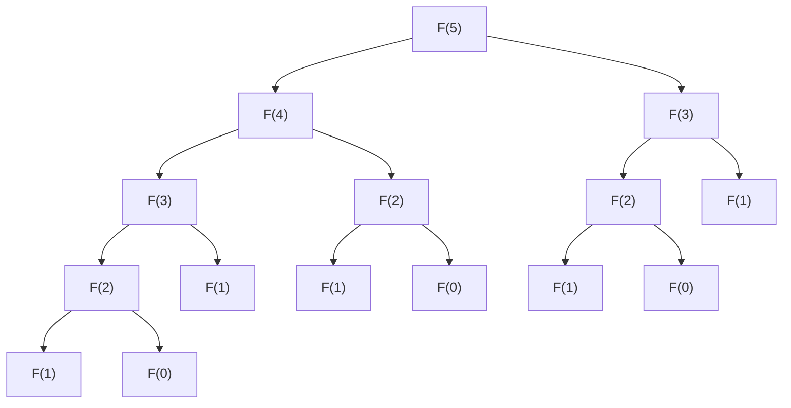

# 1. परिचय

प्रोग्रामिंग और एल्गोरिदम सीखने के दौरान, कई शिक्षार्थियों को एक बड़ी बाधा का सामना करना पड़ता है। यह **डायनामिक प्रोग्रामिंग** (Dynamic Programming, या संक्षेप में **DP** ) है। केवल नाम सुनने से, आप सोच सकते हैं कि "यह मुश्किल लगता है" या "क्या इसके लिए विशेष गणितीय ज्ञान की आवश्यकता है?" हालांकि, यदि आप इसका सार समझते हैं, तो आप पाएंगे कि DP समस्या-समाधान का एक बहुत ही शक्तिशाली और सहज तरीका है।

इस लेख में, हम DP की बुनियादी अवधारणाओं से शुरू करेंगे और "Fibonacci अनुक्रम" और "Knapsack समस्या" के प्रतिनिधि समस्याओं को उदाहरण के रूप में उपयोग करके, इसकी सोच और कार्यान्वयन विधियों को विस्तार से समझाएंगे। Python कोड का उपयोग करते हुए, आइए चरण-दर-चरण अपनी समझ को गहरा करें।


# 2. डायनामिक प्रोग्रामिंग (DP) क्या है?

डायनामिक प्रोग्रामिंग (Dynamic Programming) एक ऐसी तकनीक है जो जटिल समस्याओं को कई छोटी उप-समस्याओं में विभाजित करती है और प्रत्येक उप-समस्या के समाधान को रिकॉर्ड (मेमो) करते हुए समस्या को हल करती है। इससे एक ही गणना को बार-बार दोहराने की बर्बादी बचती है और गणना समय में भारी कमी आ सकती है।

DP का मूल निम्नलिखित 2 विशेषताओं में है।

1. **इष्टतम उप-संरचना** (Optimal Substructure): एक गुण जहाँ एक बड़ी समस्या का इष्टतम समाधान उसकी छोटी उप-समस्याओं के इष्टतम समाधानों से बनाया जा सकता है।
2. **ओवरलैपिंग उप-समस्याएँ** (Overlapping Subproblems): एक गुण जहाँ वही छोटी समस्याएँ बार-बार प्रकट होती हैं।

इन विशेषताओं वाली समस्याओं के लिए, DP अपार शक्ति प्रदर्शित करता है।

## DP के 2 दृष्टिकोण

DP को मोटे तौर पर दो कार्यान्वयन दृष्टिकोणों में विभाजित किया जा सकता है।

### 1. मेमोइजेशन रिकर्शन (टॉप-डाउन दृष्टिकोण)
एक बड़ी समस्या से शुरू होकर, यह पुनरावर्ती (recursively) रूप से छोटी समस्याओं को कॉल करता है। उस समय, एक बार गणना किए गए परिणामों को एक एरे या हैश मैप में सहेजा (मेमो) जाता है, और जब वही समस्या फिर से दिखाई देती है, तो पुनर्गणना किए बिना सहेजा गया मान वापस कर दिया जाता है।

### 2. बॉटम-अप दृष्टिकोण (विभाजन और तालिका भरना)
सबसे छोटी समस्या से शुरू करके, समाधान क्रमिक रूप से गिने जाते हैं और एक एरे (DP तालिका) में रिकॉर्ड किए जाते हैं। छोटी समस्याओं के समाधानों का उपयोग करके बड़ी समस्याओं को धीरे-धीरे हल किया जाता है, और अंततः वांछित समस्या का समाधान प्राप्त किया जाता है।


# 3. बुनियादी अनुभाग: Fibonacci अनुक्रम के साथ DP सीखना

DP की अवधारणा को समझने के पहले कदम के रूप में, आइए Fibonacci अनुक्रम पर विचार करें।

Fibonacci अनुक्रम एक ऐसा अनुक्रम है जिसे इस प्रकार परिभाषित किया गया है:
$ F(0) = 0 $
$ F(1) = 1 $
$ F(n) = F(n-1) + F(n-2) \quad \text{for } n \ge 2 $

## 3.1 सरल रिकर्सिव कॉल का जाल

आइए परिभाषा के अनुसार Python में एक फ़ंक्शन लिखें।

```python
def fib_recursive(n):
    if n <= 0:
        return 0
    elif n == 1:
        return 1
    return fib_recursive(n-1) + fib_recursive(n-2)
```

यह कार्यान्वयन सहज है, लेकिन इसमें एक बड़ी समस्या है। वह यह है कि **गणना की जटिलता घातांकीय (exponentially) रूप से बढ़ती है** । आइए $F(5)$ की गणना करते समय फ़ंक्शन कॉल ट्री देखें।



जैसा कि आप देख सकते हैं, $F(3)$ और $F(2)$ की गणना बार-बार की जा रही है। समय जटिलता $O(2^n)$ हो जाती है, और जब $n$ बड़ा हो जाता है, तो गणना व्यावहारिक समय में समाप्त नहीं होगी।

## 3.2 मेमोइजेशन रिकर्शन (टॉप-डाउन दृष्टिकोण)

इस बर्बादी को खत्म करना **मेमोइजेशन** कहलाता है। आइए एक बार गणना किए गए परिणामों को सहेजें।

```python
def fib_memo(n, memo=None):
    if memo is None:
        memo = {}
    if n in memo:
        return memo[n]
    if n <= 0:
        return 0
    elif n == 1:
        return 1
    
    memo[n] = fib_memo(n-1, memo) + fib_memo(n-2, memo)
    return memo[n]
```

इसके कारण, प्रत्येक $F(i)$ की गणना केवल एक बार की जाती है, और समय जटिलता भारी रूप से $O(n)$ तक कम हो जाती है।

## 3.3 बॉटम-अप दृष्टिकोण (DP तालिका)

रिकर्सिव कॉल के ओवरहेड से बचने के लिए, बॉटम-अप दृष्टिकोण का उपयोग करके नीचे से क्रम में गणना की जाती है।

```python
def fib_dp(n):
    if n <= 0:
        return 0
    elif n == 1:
        return 1
        
    dp = [0] * (n + 1)
    dp[0] = 0
    dp[1] = 1
    
    for i in range(2, n + 1):
        dp[i] = dp[i-1] + dp[i-2]
        
    return dp[n]
```

हम एक एरे `dp` तैयार करते हैं और इसे सबसे छोटे इंडेक्स से भरना शुरू करते हैं। यह DP तालिका का एक विशिष्ट उपयोग है।


# 4. उन्नत अनुभाग: Knapsack समस्या

DP की वास्तविक शक्ति तब प्रदर्शित होती है जब इसका उपयोग अनुकूलन समस्याओं (optimization problems) को हल करने के लिए किया जाता है। यहाँ, आइए प्रसिद्ध "0-1 Knapsack समस्या" पर विचार करें।

## 4.1 समस्या सेटिंग

मान लीजिए कि आप एक चोर हैं (यह एक सेटिंग है)। आपके पास $W$ क्षमता वाला एक knapsack है। आपके सामने $N$ वस्तुएँ हैं, और प्रत्येक वस्तु $i$ का वजन $w_i$ और मूल्य $v_i$ है।

knapsack की क्षमता से अधिक हुए बिना वस्तुओं का चयन करें, और आपके द्वारा घर ले जाई जाने वाली वस्तुओं के **कुल मूल्य को अधिकतम करें** । हालाँकि, प्रत्येक वस्तु केवल एक है, और आप या तो इसे "चुनते हैं (1)" या "नहीं चुनते हैं (0)"।

## 4.2 स्थिति (State) की परिभाषा और रिकरेंस संबंध (Recurrence Relation)

DP के साथ किसी समस्या को हल करते समय सबसे महत्वपूर्ण बात **स्थिति की परिभाषा** और **रिकरेंस संबंध (state transition equation)** प्राप्त करना है।

स्थिति को इस प्रकार परिभाषित किया गया है:
$dp[i][w]$ : पहले $i$ वस्तुओं में से, कुल वजन $w$ या उससे कम होने पर चुना गया अधिकतम मूल्य।

यहाँ, $i$-वें वस्तु (वजन $w_i$, मूल्य $v_i$) पर विचार करते समय, 2 विकल्प हैं:

1. **चयन नहीं करने पर**:
   अधिकतम मूल्य पिछली स्थिति $dp[i-1][w]$ के समान है।
2. **चयन करने पर** (केवल तभी संभव है जब $w \ge w_i$ हो):
   क्षमता से $w_i$ घटाने के बाद स्थिति में वस्तु $i$ का मूल्य $v_i$ जोड़ें। अर्थात, $dp[i-1][w - w_i] + v_i$ होगा।

इसलिए, रिकरेंस संबंध इस प्रकार है:

$$
dp[i][w] = 
\begin{cases}
\max(dp[i-1][w], dp[i-1][w - w_i] + v_i) & \text{if } w \ge w_i \\
dp[i-1][w] & \text{otherwise}
\end{cases}
$$

## 4.3 Python कार्यान्वयन

इस रिकरेंस संबंध को सीधे एक प्रोग्राम में बदलते हैं।

```python
def knapsack(weights, values, W):
    N = len(weights)
    # DP तालिका का आरंभीकरण: (N+1) x (W+1) का 2-आयामी एरे
    dp = [[0] * (W + 1) for _ in range(N + 1)]
    
    # DP तालिका भरना
    for i in range(1, N + 1):
        for w in range(W + 1):
            if w >= weights[i-1]:
                # चुनने और न चुनने के बीच अधिकतम मूल्य लें
                dp[i][w] = max(dp[i-1][w], dp[i-1][w - weights[i-1]] + values[i-1])
            else:
                # क्षमता से अधिक होने के कारण नहीं चुन सकते
                dp[i][w] = dp[i-1][w]
                
    return dp[N][W]
```

### DP तालिका का संक्रमण (Transition)

आइए एक उदाहरण के साथ `dp` तालिका के संक्रमण का पालन करें।

| $i$ \ $w$ | 0 | 1 | 2 | 3 | 4 | 5 |
|---|---|---|---|---|---|---|
| 0 | 0 | 0 | 0 | 0 | 0 | 0 |
| 1 | 0 | 0 | 3 | 3 | 3 | 3 |
| 2 | 0 | 2 | 3 | 5 | 5 | 5 |
| 3 | 0 | 2 | 3 | 5 | 6 | 7 |
| 4 | 0 | 2 | 3 | 5 | 6 | 7 |

इस तरह, छोटी क्षमता और कम वस्तुओं वाली उप-समस्याओं से क्रमिक रूप से इष्टतम समाधान खोजने से अंततः उत्तर प्राप्त हो जाएगा।


# 5. DP को अधिक गहराई से समझने के लिए विस्तृत विवरण और एल्गोरिदम का अन्वेषण

DP की अपनी समझ को मजबूत करने के लिए, अधिक उदाहरण समस्याओं का सामना करना और राज्य संक्रमण (state transitions) के विभिन्न पैटर्नों को सीखना आवश्यक है।

## 5.1 संपादन दूरी (Levenshtein Distance)

जब दो स्ट्रिंग $S$ और $T$ दिए जाते हैं, तो यह समस्या $S$ को $T$ में बदलने के लिए आवश्यक "इन्सर्ट (insert)", "डिलीट (delete)", और "रिप्लेस (replace)" संचालन की न्यूनतम संख्या ज्ञात करने के लिए है।

### रिकरेंस संबंध

$$
dp[i][j] = 
\begin{cases}
dp[i-1][j-1] & \text{if } S[i-1] == T[j-1] \\
\min(dp[i][j-1], dp[i-1][j], dp[i-1][j-1]) + 1 & \text{otherwise}
\end{cases}
$$

## 5.2 अंतरिक्ष जटिलता (Space Complexity) अनुकूलन तकनीक (इन-प्लेस अपडेट)

अब तक के कार्यान्वयन में, राज्य संक्रमण की गणना करने के लिए $O(NW)$ या $O(MN)$ मेमोरी का उपयोग किया गया है। हालांकि, यदि आप रिकरेंस संबंध को ध्यान से देखते हैं, तो किसी राज्य को अपडेट करने के लिए अक्सर केवल "पिछली पंक्ति" की आवश्यकता होती है।

उदाहरण के लिए, Knapsack समस्या के रिकरेंस संबंध का उपयोग करके 2-आयामी एरे को 1-आयामी एरे में घटाया जा सकता है। अपडेट करते समय, दाएं से बाएं अपडेट करके, आप उस बग को रोक सकते हैं जो वर्तमान $i$ की गणना के दौरान $i-1$ के मान को अधिलेखित (overwrite) कर देता है।

```python
def knapsack_optimized(weights, values, W):
    N = len(weights)
    dp = [0] * (W + 1)
    
    for i in range(N):
        # रिवर्स क्रम में अपडेट करके, 1-आयामी एरे पर्याप्त है
        for w in range(W, weights[i] - 1, -1):
            dp[w] = max(dp[w], dp[w - weights[i]] + values[i])
            
    return dp[W]
```


### उन्नत व्याख्या भाग 1: DP की सीमाएँ और एल्गोरिदम चयन

डायनामिक प्रोग्रामिंग की ताकत उप-संरचनाओं के ओवरलैपिंग से बचना है, लेकिन फिर भी सभी समस्याओं को जल्दी से हल नहीं किया जा सकता है। उदाहरण के लिए, Knapsack समस्या की समय जटिलता $O(NW)$ है, जो पहली नज़र में बहुपद समय (polynomial time) लगती है। हालांकि, $W$ इनपुट का "मान" है, और यह इनपुट आकार (बिट्स की संख्या) के सापेक्ष घातीय (exponential) हो सकता है। इस तरह की समय जटिलता को **छद्म-बहुपद समय (pseudo-polynomial time)** कहा जाता है।

यदि $W$ बहुत बड़ा है, तो केवल एरे आवंटित करने से मेमोरी समाप्त हो जाएगी और लूप की संख्या बहुत अधिक हो जाएगी, इसलिए यह DP विधि लागू नहीं की जा सकती है। उस मामले में, मूल्यों के योग की ऊपरी सीमा $V$ के खिलाफ DP पर स्विच करना, या Meet in the Middle जैसे अन्य दृष्टिकोण आवश्यक हैं।

इसके अलावा, DP को डिबग करते समय, **छोटे इनपुट के साथ मैन्युअल रूप से गणना की गई तालिका और प्रोग्राम द्वारा आउटपुट की गई तालिका की तुलना करना** सबसे प्रभावी है। एक कागज और पेन तैयार करके और वास्तव में 2-आयामी तालिका लिखकर, आप आसानी से समझ सकते हैं कि "यह इस रिकरेंस संबंध का कारण क्यों बनता है" और "संक्रमण (transition) में गलती कहाँ है"।

### उन्नत व्याख्या भाग 2: DP की सीमाएँ और एल्गोरिदम चयन

डायनामिक प्रोग्रामिंग की ताकत उप-संरचनाओं के ओवरलैपिंग से बचना है, लेकिन फिर भी सभी समस्याओं को जल्दी से हल नहीं किया जा सकता है। उदाहरण के लिए, Knapsack समस्या की समय जटिलता $O(NW)$ है, जो पहली नज़र में बहुपद समय (polynomial time) लगती है। हालांकि, $W$ इनपुट का "मान" है, और यह इनपुट आकार (बिट्स की संख्या) के सापेक्ष घातीय (exponential) हो सकता है। इस तरह की समय जटिलता को **छद्म-बहुपद समय (pseudo-polynomial time)** कहा जाता है।

यदि $W$ बहुत बड़ा है, तो केवल एरे आवंटित करने से मेमोरी समाप्त हो जाएगी और लूप की संख्या बहुत अधिक हो जाएगी, इसलिए यह DP विधि लागू नहीं की जा सकती है। उस मामले में, मूल्यों के योग की ऊपरी सीमा $V$ के खिलाफ DP पर स्विच करना, या Meet in the Middle जैसे अन्य दृष्टिकोण आवश्यक हैं।

इसके अलावा, DP को डिबग करते समय, **छोटे इनपुट के साथ मैन्युअल रूप से गणना की गई तालिका और प्रोग्राम द्वारा आउटपुट की गई तालिका की तुलना करना** सबसे प्रभावी है। एक कागज और पेन तैयार करके और वास्तव में 2-आयामी तालिका लिखकर, आप आसानी से समझ सकते हैं कि "यह इस रिकरेंस संबंध का कारण क्यों बनता है" और "संक्रमण (transition) में गलती कहाँ है"।

### उन्नत व्याख्या भाग 3: DP की सीमाएँ और एल्गोरिदम चयन

डायनामिक प्रोग्रामिंग की ताकत उप-संरचनाओं के ओवरलैपिंग से बचना है, लेकिन फिर भी सभी समस्याओं को जल्दी से हल नहीं किया जा सकता है। उदाहरण के लिए, Knapsack समस्या की समय जटिलता $O(NW)$ है, जो पहली नज़र में बहुपद समय (polynomial time) लगती है। हालांकि, $W$ इनपुट का "मान" है, और यह इनपुट आकार (बिट्स की संख्या) के सापेक्ष घातीय (exponential) हो सकता है। इस तरह की समय जटिलता को **छद्म-बहुपद समय (pseudo-polynomial time)** कहा जाता है।

यदि $W$ बहुत बड़ा है, तो केवल एरे आवंटित करने से मेमोरी समाप्त हो जाएगी और लूप की संख्या बहुत अधिक हो जाएगी, इसलिए यह DP विधि लागू नहीं की जा सकती है। उस मामले में, मूल्यों के योग की ऊपरी सीमा $V$ के खिलाफ DP पर स्विच करना, या Meet in the Middle जैसे अन्य दृष्टिकोण आवश्यक हैं।

इसके अलावा, DP को डिबग करते समय, **छोटे इनपुट के साथ मैन्युअल रूप से गणना की गई तालिका और प्रोग्राम द्वारा आउटपुट की गई तालिका की तुलना करना** सबसे प्रभावी है। एक कागज और पेन तैयार करके और वास्तव में 2-आयामी तालिका लिखकर, आप आसानी से समझ सकते हैं कि "यह इस रिकरेंस संबंध का कारण क्यों बनता है" और "संक्रमण (transition) में गलती कहाँ है"।

### उन्नत व्याख्या भाग 4: DP की सीमाएँ और एल्गोरिदम चयन

डायनामिक प्रोग्रामिंग की ताकत उप-संरचनाओं के ओवरलैपिंग से बचना है, लेकिन फिर भी सभी समस्याओं को जल्दी से हल नहीं किया जा सकता है। उदाहरण के लिए, Knapsack समस्या की समय जटिलता $O(NW)$ है, जो पहली नज़र में बहुपद समय (polynomial time) लगती है। हालांकि, $W$ इनपुट का "मान" है, और यह इनपुट आकार (बिट्स की संख्या) के सापेक्ष घातीय (exponential) हो सकता है। इस तरह की समय जटिलता को **छद्म-बहुपद समय (pseudo-polynomial time)** कहा जाता है।

यदि $W$ बहुत बड़ा है, तो केवल एरे आवंटित करने से मेमोरी समाप्त हो जाएगी और लूप की संख्या बहुत अधिक हो जाएगी, इसलिए यह DP विधि लागू नहीं की जा सकती है। उस मामले में, मूल्यों के योग की ऊपरी सीमा $V$ के खिलाफ DP पर स्विच करना, या Meet in the Middle जैसे अन्य दृष्टिकोण आवश्यक हैं।

इसके अलावा, DP को डिबग करते समय, **छोटे इनपुट के साथ मैन्युअल रूप से गणना की गई तालिका और प्रोग्राम द्वारा आउटपुट की गई तालिका की तुलना करना** सबसे प्रभावी है। एक कागज और पेन तैयार करके और वास्तव में 2-आयामी तालिका लिखकर, आप आसानी से समझ सकते हैं कि "यह इस रिकरेंस संबंध का कारण क्यों बनता है" और "संक्रमण (transition) में गलती कहाँ है"।

### उन्नत व्याख्या भाग 5: DP की सीमाएँ और एल्गोरिदम चयन

डायनामिक प्रोग्रामिंग की ताकत उप-संरचनाओं के ओवरलैपिंग से बचना है, लेकिन फिर भी सभी समस्याओं को जल्दी से हल नहीं किया जा सकता है। उदाहरण के लिए, Knapsack समस्या की समय जटिलता $O(NW)$ है, जो पहली नज़र में बहुपद समय (polynomial time) लगती है। हालांकि, $W$ इनपुट का "मान" है, और यह इनपुट आकार (बिट्स की संख्या) के सापेक्ष घातीय (exponential) हो सकता है। इस तरह की समय जटिलता को **छद्म-बहुपद समय (pseudo-polynomial time)** कहा जाता है।

यदि $W$ बहुत बड़ा है, तो केवल एरे आवंटित करने से मेमोरी समाप्त हो जाएगी और लूप की संख्या बहुत अधिक हो जाएगी, इसलिए यह DP विधि लागू नहीं की जा सकती है। उस मामले में, मूल्यों के योग की ऊपरी सीमा $V$ के खिलाफ DP पर स्विच करना, या Meet in the Middle जैसे अन्य दृष्टिकोण आवश्यक हैं।

इसके अलावा, DP को डिबग करते समय, **छोटे इनपुट के साथ मैन्युअल रूप से गणना की गई तालिका और प्रोग्राम द्वारा आउटपुट की गई तालिका की तुलना करना** सबसे प्रभावी है। एक कागज और पेन तैयार करके और वास्तव में 2-आयामी तालिका लिखकर, आप आसानी से समझ सकते हैं कि "यह इस रिकरेंस संबंध का कारण क्यों बनता है" और "संक्रमण (transition) में गलती कहाँ है"।

### उन्नत व्याख्या भाग 6: DP की सीमाएँ और एल्गोरिदम चयन

डायनामिक प्रोग्रामिंग की ताकत उप-संरचनाओं के ओवरलैपिंग से बचना है, लेकिन फिर भी सभी समस्याओं को जल्दी से हल नहीं किया जा सकता है। उदाहरण के लिए, Knapsack समस्या की समय जटिलता $O(NW)$ है, जो पहली नज़र में बहुपद समय (polynomial time) लगती है। हालांकि, $W$ इनपुट का "मान" है, और यह इनपुट आकार (बिट्स की संख्या) के सापेक्ष घातीय (exponential) हो सकता है। इस तरह की समय जटिलता को **छद्म-बहुपद समय (pseudo-polynomial time)** कहा जाता है।

यदि $W$ बहुत बड़ा है, तो केवल एरे आवंटित करने से मेमोरी समाप्त हो जाएगी और लूप की संख्या बहुत अधिक हो जाएगी, इसलिए यह DP विधि लागू नहीं की जा सकती है। उस मामले में, मूल्यों के योग की ऊपरी सीमा $V$ के खिलाफ DP पर स्विच करना, या Meet in the Middle जैसे अन्य दृष्टिकोण आवश्यक हैं।

इसके अलावा, DP को डिबग करते समय, **छोटे इनपुट के साथ मैन्युअल रूप से गणना की गई तालिका और प्रोग्राम द्वारा आउटपुट की गई तालिका की तुलना करना** सबसे प्रभावी है। एक कागज और पेन तैयार करके और वास्तव में 2-आयामी तालिका लिखकर, आप आसानी से समझ सकते हैं कि "यह इस रिकरेंस संबंध का कारण क्यों बनता है" और "संक्रमण (transition) में गलती कहाँ है"।

### उन्नत व्याख्या भाग 7: DP की सीमाएँ और एल्गोरिदम चयन

डायनामिक प्रोग्रामिंग की ताकत उप-संरचनाओं के ओवरलैपिंग से बचना है, लेकिन फिर भी सभी समस्याओं को जल्दी से हल नहीं किया जा सकता है। उदाहरण के लिए, Knapsack समस्या की समय जटिलता $O(NW)$ है, जो पहली नज़र में बहुपद समय (polynomial time) लगती है। हालांकि, $W$ इनपुट का "मान" है, और यह इनपुट आकार (बिट्स की संख्या) के सापेक्ष घातीय (exponential) हो सकता है। इस तरह की समय जटिलता को **छद्म-बहुपद समय (pseudo-polynomial time)** कहा जाता है।

यदि $W$ बहुत बड़ा है, तो केवल एरे आवंटित करने से मेमोरी समाप्त हो जाएगी और लूप की संख्या बहुत अधिक हो जाएगी, इसलिए यह DP विधि लागू नहीं की जा सकती है। उस मामले में, मूल्यों के योग की ऊपरी सीमा $V$ के खिलाफ DP पर स्विच करना, या Meet in the Middle जैसे अन्य दृष्टिकोण आवश्यक हैं।

इसके अलावा, DP को डिबग करते समय, **छोटे इनपुट के साथ मैन्युअल रूप से गणना की गई तालिका और प्रोग्राम द्वारा आउटपुट की गई तालिका की तुलना करना** सबसे प्रभावी है। एक कागज और पेन तैयार करके और वास्तव में 2-आयामी तालिका लिखकर, आप आसानी से समझ सकते हैं कि "यह इस रिकरेंस संबंध का कारण क्यों बनता है" और "संक्रमण (transition) में गलती कहाँ है"।

### उन्नत व्याख्या भाग 8: DP की सीमाएँ और एल्गोरिदम चयन

डायनामिक प्रोग्रामिंग की ताकत उप-संरचनाओं के ओवरलैपिंग से बचना है, लेकिन फिर भी सभी समस्याओं को जल्दी से हल नहीं किया जा सकता है। उदाहरण के लिए, Knapsack समस्या की समय जटिलता $O(NW)$ है, जो पहली नज़र में बहुपद समय (polynomial time) लगती है। हालांकि, $W$ इनपुट का "मान" है, और यह इनपुट आकार (बिट्स की संख्या) के सापेक्ष घातीय (exponential) हो सकता है। इस तरह की समय जटिलता को **छद्म-बहुपद समय (pseudo-polynomial time)** कहा जाता है।

यदि $W$ बहुत बड़ा है, तो केवल एरे आवंटित करने से मेमोरी समाप्त हो जाएगी और लूप की संख्या बहुत अधिक हो जाएगी, इसलिए यह DP विधि लागू नहीं की जा सकती है। उस मामले में, मूल्यों के योग की ऊपरी सीमा $V$ के खिलाफ DP पर स्विच करना, या Meet in the Middle जैसे अन्य दृष्टिकोण आवश्यक हैं।

इसके अलावा, DP को डिबग करते समय, **छोटे इनपुट के साथ मैन्युअल रूप से गणना की गई तालिका और प्रोग्राम द्वारा आउटपुट की गई तालिका की तुलना करना** सबसे प्रभावी है। एक कागज और पेन तैयार करके और वास्तव में 2-आयामी तालिका लिखकर, आप आसानी से समझ सकते हैं कि "यह इस रिकरेंस संबंध का कारण क्यों बनता है" और "संक्रमण (transition) में गलती कहाँ है"।

### उन्नत व्याख्या भाग 9: DP की सीमाएँ और एल्गोरिदम चयन

डायनामिक प्रोग्रामिंग की ताकत उप-संरचनाओं के ओवरलैपिंग से बचना है, लेकिन फिर भी सभी समस्याओं को जल्दी से हल नहीं किया जा सकता है। उदाहरण के लिए, Knapsack समस्या की समय जटिलता $O(NW)$ है, जो पहली नज़र में बहुपद समय (polynomial time) लगती है। हालांकि, $W$ इनपुट का "मान" है, और यह इनपुट आकार (बिट्स की संख्या) के सापेक्ष घातीय (exponential) हो सकता है। इस तरह की समय जटिलता को **छद्म-बहुपद समय (pseudo-polynomial time)** कहा जाता है।

यदि $W$ बहुत बड़ा है, तो केवल एरे आवंटित करने से मेमोरी समाप्त हो जाएगी और लूप की संख्या बहुत अधिक हो जाएगी, इसलिए यह DP विधि लागू नहीं की जा सकती है। उस मामले में, मूल्यों के योग की ऊपरी सीमा $V$ के खिलाफ DP पर स्विच करना, या Meet in the Middle जैसे अन्य दृष्टिकोण आवश्यक हैं।

इसके अलावा, DP को डिबग करते समय, **छोटे इनपुट के साथ मैन्युअल रूप से गणना की गई तालिका और प्रोग्राम द्वारा आउटपुट की गई तालिका की तुलना करना** सबसे प्रभावी है। एक कागज और पेन तैयार करके और वास्तव में 2-आयामी तालिका लिखकर, आप आसानी से समझ सकते हैं कि "यह इस रिकरेंस संबंध का कारण क्यों बनता है" और "संक्रमण (transition) में गलती कहाँ है"।

### उन्नत व्याख्या भाग 10: DP की सीमाएँ और एल्गोरिदम चयन

डायनामिक प्रोग्रामिंग की ताकत उप-संरचनाओं के ओवरलैपिंग से बचना है, लेकिन फिर भी सभी समस्याओं को जल्दी से हल नहीं किया जा सकता है। उदाहरण के लिए, Knapsack समस्या की समय जटिलता $O(NW)$ है, जो पहली नज़र में बहुपद समय (polynomial time) लगती है। हालांकि, $W$ इनपुट का "मान" है, और यह इनपुट आकार (बिट्स की संख्या) के सापेक्ष घातीय (exponential) हो सकता है। इस तरह की समय जटिलता को **छद्म-बहुपद समय (pseudo-polynomial time)** कहा जाता है।

यदि $W$ बहुत बड़ा है, तो केवल एरे आवंटित करने से मेमोरी समाप्त हो जाएगी और लूप की संख्या बहुत अधिक हो जाएगी, इसलिए यह DP विधि लागू नहीं की जा सकती है। उस मामले में, मूल्यों के योग की ऊपरी सीमा $V$ के खिलाफ DP पर स्विच करना, या Meet in the Middle जैसे अन्य दृष्टिकोण आवश्यक हैं।

इसके अलावा, DP को डिबग करते समय, **छोटे इनपुट के साथ मैन्युअल रूप से गणना की गई तालिका और प्रोग्राम द्वारा आउटपुट की गई तालिका की तुलना करना** सबसे प्रभावी है। एक कागज और पेन तैयार करके और वास्तव में 2-आयामी तालिका लिखकर, आप आसानी से समझ सकते हैं कि "यह इस रिकरेंस संबंध का कारण क्यों बनता है" और "संक्रमण (transition) में गलती कहाँ है"।

### उन्नत व्याख्या भाग 11: DP की सीमाएँ और एल्गोरिदम चयन

डायनामिक प्रोग्रामिंग की ताकत उप-संरचनाओं के ओवरलैपिंग से बचना है, लेकिन फिर भी सभी समस्याओं को जल्दी से हल नहीं किया जा सकता है। उदाहरण के लिए, Knapsack समस्या की समय जटिलता $O(NW)$ है, जो पहली नज़र में बहुपद समय (polynomial time) लगती है। हालांकि, $W$ इनपुट का "मान" है, और यह इनपुट आकार (बिट्स की संख्या) के सापेक्ष घातीय (exponential) हो सकता है। इस तरह की समय जटिलता को **छद्म-बहुपद समय (pseudo-polynomial time)** कहा जाता है।

यदि $W$ बहुत बड़ा है, तो केवल एरे आवंटित करने से मेमोरी समाप्त हो जाएगी और लूप की संख्या बहुत अधिक हो जाएगी, इसलिए यह DP विधि लागू नहीं की जा सकती है। उस मामले में, मूल्यों के योग की ऊपरी सीमा $V$ के खिलाफ DP पर स्विच करना, या Meet in the Middle जैसे अन्य दृष्टिकोण आवश्यक हैं।

इसके अलावा, DP को डिबग करते समय, **छोटे इनपुट के साथ मैन्युअल रूप से गणना की गई तालिका और प्रोग्राम द्वारा आउटपुट की गई तालिका की तुलना करना** सबसे प्रभावी है। एक कागज और पेन तैयार करके और वास्तव में 2-आयामी तालिका लिखकर, आप आसानी से समझ सकते हैं कि "यह इस रिकरेंस संबंध का कारण क्यों बनता है" और "संक्रमण (transition) में गलती कहाँ है"।

### उन्नत व्याख्या भाग 12: DP की सीमाएँ और एल्गोरिदम चयन

डायनामिक प्रोग्रामिंग की ताकत उप-संरचनाओं के ओवरलैपिंग से बचना है, लेकिन फिर भी सभी समस्याओं को जल्दी से हल नहीं किया जा सकता है। उदाहरण के लिए, Knapsack समस्या की समय जटिलता $O(NW)$ है, जो पहली नज़र में बहुपद समय (polynomial time) लगती है। हालांकि, $W$ इनपुट का "मान" है, और यह इनपुट आकार (बिट्स की संख्या) के सापेक्ष घातीय (exponential) हो सकता है। इस तरह की समय जटिलता को **छद्म-बहुपद समय (pseudo-polynomial time)** कहा जाता है।

यदि $W$ बहुत बड़ा है, तो केवल एरे आवंटित करने से मेमोरी समाप्त हो जाएगी और लूप की संख्या बहुत अधिक हो जाएगी, इसलिए यह DP विधि लागू नहीं की जा सकती है। उस मामले में, मूल्यों के योग की ऊपरी सीमा $V$ के खिलाफ DP पर स्विच करना, या Meet in the Middle जैसे अन्य दृष्टिकोण आवश्यक हैं।

इसके अलावा, DP को डिबग करते समय, **छोटे इनपुट के साथ मैन्युअल रूप से गणना की गई तालिका और प्रोग्राम द्वारा आउटपुट की गई तालिका की तुलना करना** सबसे प्रभावी है। एक कागज और पेन तैयार करके और वास्तव में 2-आयामी तालिका लिखकर, आप आसानी से समझ सकते हैं कि "यह इस रिकरेंस संबंध का कारण क्यों बनता है" और "संक्रमण (transition) में गलती कहाँ है"।

### उन्नत व्याख्या भाग 13: DP की सीमाएँ और एल्गोरिदम चयन

डायनामिक प्रोग्रामिंग की ताकत उप-संरचनाओं के ओवरलैपिंग से बचना है, लेकिन फिर भी सभी समस्याओं को जल्दी से हल नहीं किया जा सकता है। उदाहरण के लिए, Knapsack समस्या की समय जटिलता $O(NW)$ है, जो पहली नज़र में बहुपद समय (polynomial time) लगती है। हालांकि, $W$ इनपुट का "मान" है, और यह इनपुट आकार (बिट्स की संख्या) के सापेक्ष घातीय (exponential) हो सकता है। इस तरह की समय जटिलता को **छद्म-बहुपद समय (pseudo-polynomial time)** कहा जाता है।

यदि $W$ बहुत बड़ा है, तो केवल एरे आवंटित करने से मेमोरी समाप्त हो जाएगी और लूप की संख्या बहुत अधिक हो जाएगी, इसलिए यह DP विधि लागू नहीं की जा सकती है। उस मामले में, मूल्यों के योग की ऊपरी सीमा $V$ के खिलाफ DP पर स्विच करना, या Meet in the Middle जैसे अन्य दृष्टिकोण आवश्यक हैं।

इसके अलावा, DP को डिबग करते समय, **छोटे इनपुट के साथ मैन्युअल रूप से गणना की गई तालिका और प्रोग्राम द्वारा आउटपुट की गई तालिका की तुलना करना** सबसे प्रभावी है। एक कागज और पेन तैयार करके और वास्तव में 2-आयामी तालिका लिखकर, आप आसानी से समझ सकते हैं कि "यह इस रिकरेंस संबंध का कारण क्यों बनता है" और "संक्रमण (transition) में गलती कहाँ है"।

### उन्नत व्याख्या भाग 14: DP की सीमाएँ और एल्गोरिदम चयन

डायनामिक प्रोग्रामिंग की ताकत उप-संरचनाओं के ओवरलैपिंग से बचना है, लेकिन फिर भी सभी समस्याओं को जल्दी से हल नहीं किया जा सकता है। उदाहरण के लिए, Knapsack समस्या की समय जटिलता $O(NW)$ है, जो पहली नज़र में बहुपद समय (polynomial time) लगती है। हालांकि, $W$ इनपुट का "मान" है, और यह इनपुट आकार (बिट्स की संख्या) के सापेक्ष घातीय (exponential) हो सकता है। इस तरह की समय जटिलता को **छद्म-बहुपद समय (pseudo-polynomial time)** कहा जाता है।

यदि $W$ बहुत बड़ा है, तो केवल एरे आवंटित करने से मेमोरी समाप्त हो जाएगी और लूप की संख्या बहुत अधिक हो जाएगी, इसलिए यह DP विधि लागू नहीं की जा सकती है। उस मामले में, मूल्यों के योग की ऊपरी सीमा $V$ के खिलाफ DP पर स्विच करना, या Meet in the Middle जैसे अन्य दृष्टिकोण आवश्यक हैं।

इसके अलावा, DP को डिबग करते समय, **छोटे इनपुट के साथ मैन्युअल रूप से गणना की गई तालिका और प्रोग्राम द्वारा आउटपुट की गई तालिका की तुलना करना** सबसे प्रभावी है। एक कागज और पेन तैयार करके और वास्तव में 2-आयामी तालिका लिखकर, आप आसानी से समझ सकते हैं कि "यह इस रिकरेंस संबंध का कारण क्यों बनता है" और "संक्रमण (transition) में गलती कहाँ है"।

### उन्नत व्याख्या भाग 15: DP की सीमाएँ और एल्गोरिदम चयन

डायनामिक प्रोग्रामिंग की ताकत उप-संरचनाओं के ओवरलैपिंग से बचना है, लेकिन फिर भी सभी समस्याओं को जल्दी से हल नहीं किया जा सकता है। उदाहरण के लिए, Knapsack समस्या की समय जटिलता $O(NW)$ है, जो पहली नज़र में बहुपद समय (polynomial time) लगती है। हालांकि, $W$ इनपुट का "मान" है, और यह इनपुट आकार (बिट्स की संख्या) के सापेक्ष घातीय (exponential) हो सकता है। इस तरह की समय जटिलता को **छद्म-बहुपद समय (pseudo-polynomial time)** कहा जाता है।

यदि $W$ बहुत बड़ा है, तो केवल एरे आवंटित करने से मेमोरी समाप्त हो जाएगी और लूप की संख्या बहुत अधिक हो जाएगी, इसलिए यह DP विधि लागू नहीं की जा सकती है। उस मामले में, मूल्यों के योग की ऊपरी सीमा $V$ के खिलाफ DP पर स्विच करना, या Meet in the Middle जैसे अन्य दृष्टिकोण आवश्यक हैं।

इसके अलावा, DP को डिबग करते समय, **छोटे इनपुट के साथ मैन्युअल रूप से गणना की गई तालिका और प्रोग्राम द्वारा आउटपुट की गई तालिका की तुलना करना** सबसे प्रभावी है। एक कागज और पेन तैयार करके और वास्तव में 2-आयामी तालिका लिखकर, आप आसानी से समझ सकते हैं कि "यह इस रिकरेंस संबंध का कारण क्यों बनता है" और "संक्रमण (transition) में गलती कहाँ है"।

### उन्नत व्याख्या भाग 16: DP की सीमाएँ और एल्गोरिदम चयन

डायनामिक प्रोग्रामिंग की ताकत उप-संरचनाओं के ओवरलैपिंग से बचना है, लेकिन फिर भी सभी समस्याओं को जल्दी से हल नहीं किया जा सकता है। उदाहरण के लिए, Knapsack समस्या की समय जटिलता $O(NW)$ है, जो पहली नज़र में बहुपद समय (polynomial time) लगती है। हालांकि, $W$ इनपुट का "मान" है, और यह इनपुट आकार (बिट्स की संख्या) के सापेक्ष घातीय (exponential) हो सकता है। इस तरह की समय जटिलता को **छद्म-बहुपद समय (pseudo-polynomial time)** कहा जाता है।

यदि $W$ बहुत बड़ा है, तो केवल एरे आवंटित करने से मेमोरी समाप्त हो जाएगी और लूप की संख्या बहुत अधिक हो जाएगी, इसलिए यह DP विधि लागू नहीं की जा सकती है। उस मामले में, मूल्यों के योग की ऊपरी सीमा $V$ के खिलाफ DP पर स्विच करना, या Meet in the Middle जैसे अन्य दृष्टिकोण आवश्यक हैं।

इसके अलावा, DP को डिबग करते समय, **छोटे इनपुट के साथ मैन्युअल रूप से गणना की गई तालिका और प्रोग्राम द्वारा आउटपुट की गई तालिका की तुलना करना** सबसे प्रभावी है। एक कागज और पेन तैयार करके और वास्तव में 2-आयामी तालिका लिखकर, आप आसानी से समझ सकते हैं कि "यह इस रिकरेंस संबंध का कारण क्यों बनता है" और "संक्रमण (transition) में गलती कहाँ है"।

### उन्नत व्याख्या भाग 17: DP की सीमाएँ और एल्गोरिदम चयन

डायनामिक प्रोग्रामिंग की ताकत उप-संरचनाओं के ओवरलैपिंग से बचना है, लेकिन फिर भी सभी समस्याओं को जल्दी से हल नहीं किया जा सकता है। उदाहरण के लिए, Knapsack समस्या की समय जटिलता $O(NW)$ है, जो पहली नज़र में बहुपद समय (polynomial time) लगती है। हालांकि, $W$ इनपुट का "मान" है, और यह इनपुट आकार (बिट्स की संख्या) के सापेक्ष घातीय (exponential) हो सकता है। इस तरह की समय जटिलता को **छद्म-बहुपद समय (pseudo-polynomial time)** कहा जाता है।

यदि $W$ बहुत बड़ा है, तो केवल एरे आवंटित करने से मेमोरी समाप्त हो जाएगी और लूप की संख्या बहुत अधिक हो जाएगी, इसलिए यह DP विधि लागू नहीं की जा सकती है। उस मामले में, मूल्यों के योग की ऊपरी सीमा $V$ के खिलाफ DP पर स्विच करना, या Meet in the Middle जैसे अन्य दृष्टिकोण आवश्यक हैं।

इसके अलावा, DP को डिबग करते समय, **छोटे इनपुट के साथ मैन्युअल रूप से गणना की गई तालिका और प्रोग्राम द्वारा आउटपुट की गई तालिका की तुलना करना** सबसे प्रभावी है। एक कागज और पेन तैयार करके और वास्तव में 2-आयामी तालिका लिखकर, आप आसानी से समझ सकते हैं कि "यह इस रिकरेंस संबंध का कारण क्यों बनता है" और "संक्रमण (transition) में गलती कहाँ है"।

### उन्नत व्याख्या भाग 18: DP की सीमाएँ और एल्गोरिदम चयन

डायनामिक प्रोग्रामिंग की ताकत उप-संरचनाओं के ओवरलैपिंग से बचना है, लेकिन फिर भी सभी समस्याओं को जल्दी से हल नहीं किया जा सकता है। उदाहरण के लिए, Knapsack समस्या की समय जटिलता $O(NW)$ है, जो पहली नज़र में बहुपद समय (polynomial time) लगती है। हालांकि, $W$ इनपुट का "मान" है, और यह इनपुट आकार (बिट्स की संख्या) के सापेक्ष घातीय (exponential) हो सकता है। इस तरह की समय जटिलता को **छद्म-बहुपद समय (pseudo-polynomial time)** कहा जाता है।

यदि $W$ बहुत बड़ा है, तो केवल एरे आवंटित करने से मेमोरी समाप्त हो जाएगी और लूप की संख्या बहुत अधिक हो जाएगी, इसलिए यह DP विधि लागू नहीं की जा सकती है। उस मामले में, मूल्यों के योग की ऊपरी सीमा $V$ के खिलाफ DP पर स्विच करना, या Meet in the Middle जैसे अन्य दृष्टिकोण आवश्यक हैं।

इसके अलावा, DP को डिबग करते समय, **छोटे इनपुट के साथ मैन्युअल रूप से गणना की गई तालिका और प्रोग्राम द्वारा आउटपुट की गई तालिका की तुलना करना** सबसे प्रभावी है। एक कागज और पेन तैयार करके और वास्तव में 2-आयामी तालिका लिखकर, आप आसानी से समझ सकते हैं कि "यह इस रिकरेंस संबंध का कारण क्यों बनता है" और "संक्रमण (transition) में गलती कहाँ है"।

### उन्नत व्याख्या भाग 19: DP की सीमाएँ और एल्गोरिदम चयन

डायनामिक प्रोग्रामिंग की ताकत उप-संरचनाओं के ओवरलैपिंग से बचना है, लेकिन फिर भी सभी समस्याओं को जल्दी से हल नहीं किया जा सकता है। उदाहरण के लिए, Knapsack समस्या की समय जटिलता $O(NW)$ है, जो पहली नज़र में बहुपद समय (polynomial time) लगती है। हालांकि, $W$ इनपुट का "मान" है, और यह इनपुट आकार (बिट्स की संख्या) के सापेक्ष घातीय (exponential) हो सकता है। इस तरह की समय जटिलता को **छद्म-बहुपद समय (pseudo-polynomial time)** कहा जाता है।

यदि $W$ बहुत बड़ा है, तो केवल एरे आवंटित करने से मेमोरी समाप्त हो जाएगी और लूप की संख्या बहुत अधिक हो जाएगी, इसलिए यह DP विधि लागू नहीं की जा सकती है। उस मामले में, मूल्यों के योग की ऊपरी सीमा $V$ के खिलाफ DP पर स्विच करना, या Meet in the Middle जैसे अन्य दृष्टिकोण आवश्यक हैं।

इसके अलावा, DP को डिबग करते समय, **छोटे इनपुट के साथ मैन्युअल रूप से गणना की गई तालिका और प्रोग्राम द्वारा आउटपुट की गई तालिका की तुलना करना** सबसे प्रभावी है। एक कागज और पेन तैयार करके और वास्तव में 2-आयामी तालिका लिखकर, आप आसानी से समझ सकते हैं कि "यह इस रिकरेंस संबंध का कारण क्यों बनता है" और "संक्रमण (transition) में गलती कहाँ है"।

### उन्नत व्याख्या भाग 20: DP की सीमाएँ और एल्गोरिदम चयन

डायनामिक प्रोग्रामिंग की ताकत उप-संरचनाओं के ओवरलैपिंग से बचना है, लेकिन फिर भी सभी समस्याओं को जल्दी से हल नहीं किया जा सकता है। उदाहरण के लिए, Knapsack समस्या की समय जटिलता $O(NW)$ है, जो पहली नज़र में बहुपद समय (polynomial time) लगती है। हालांकि, $W$ इनपुट का "मान" है, और यह इनपुट आकार (बिट्स की संख्या) के सापेक्ष घातीय (exponential) हो सकता है। इस तरह की समय जटिलता को **छद्म-बहुपद समय (pseudo-polynomial time)** कहा जाता है।

यदि $W$ बहुत बड़ा है, तो केवल एरे आवंटित करने से मेमोरी समाप्त हो जाएगी और लूप की संख्या बहुत अधिक हो जाएगी, इसलिए यह DP विधि लागू नहीं की जा सकती है। उस मामले में, मूल्यों के योग की ऊपरी सीमा $V$ के खिलाफ DP पर स्विच करना, या Meet in the Middle जैसे अन्य दृष्टिकोण आवश्यक हैं।

इसके अलावा, DP को डिबग करते समय, **छोटे इनपुट के साथ मैन्युअल रूप से गणना की गई तालिका और प्रोग्राम द्वारा आउटपुट की गई तालिका की तुलना करना** सबसे प्रभावी है। एक कागज और पेन तैयार करके और वास्तव में 2-आयामी तालिका लिखकर, आप आसानी से समझ सकते हैं कि "यह इस रिकरेंस संबंध का कारण क्यों बनता है" और "संक्रमण (transition) में गलती कहाँ है"।

### उन्नत व्याख्या भाग 21: DP की सीमाएँ और एल्गोरिदम चयन

डायनामिक प्रोग्रामिंग की ताकत उप-संरचनाओं के ओवरलैपिंग से बचना है, लेकिन फिर भी सभी समस्याओं को जल्दी से हल नहीं किया जा सकता है। उदाहरण के लिए, Knapsack समस्या की समय जटिलता $O(NW)$ है, जो पहली नज़र में बहुपद समय (polynomial time) लगती है। हालांकि, $W$ इनपुट का "मान" है, और यह इनपुट आकार (बिट्स की संख्या) के सापेक्ष घातीय (exponential) हो सकता है। इस तरह की समय जटिलता को **छद्म-बहुपद समय (pseudo-polynomial time)** कहा जाता है।

यदि $W$ बहुत बड़ा है, तो केवल एरे आवंटित करने से मेमोरी समाप्त हो जाएगी और लूप की संख्या बहुत अधिक हो जाएगी, इसलिए यह DP विधि लागू नहीं की जा सकती है। उस मामले में, मूल्यों के योग की ऊपरी सीमा $V$ के खिलाफ DP पर स्विच करना, या Meet in the Middle जैसे अन्य दृष्टिकोण आवश्यक हैं।

इसके अलावा, DP को डिबग करते समय, **छोटे इनपुट के साथ मैन्युअल रूप से गणना की गई तालिका और प्रोग्राम द्वारा आउटपुट की गई तालिका की तुलना करना** सबसे प्रभावी है। एक कागज और पेन तैयार करके और वास्तव में 2-आयामी तालिका लिखकर, आप आसानी से समझ सकते हैं कि "यह इस रिकरेंस संबंध का कारण क्यों बनता है" और "संक्रमण (transition) में गलती कहाँ है"।

### उन्नत व्याख्या भाग 22: DP की सीमाएँ और एल्गोरिदम चयन

डायनामिक प्रोग्रामिंग की ताकत उप-संरचनाओं के ओवरलैपिंग से बचना है, लेकिन फिर भी सभी समस्याओं को जल्दी से हल नहीं किया जा सकता है। उदाहरण के लिए, Knapsack समस्या की समय जटिलता $O(NW)$ है, जो पहली नज़र में बहुपद समय (polynomial time) लगती है। हालांकि, $W$ इनपुट का "मान" है, और यह इनपुट आकार (बिट्स की संख्या) के सापेक्ष घातीय (exponential) हो सकता है। इस तरह की समय जटिलता को **छद्म-बहुपद समय (pseudo-polynomial time)** कहा जाता है।

यदि $W$ बहुत बड़ा है, तो केवल एरे आवंटित करने से मेमोरी समाप्त हो जाएगी और लूप की संख्या बहुत अधिक हो जाएगी, इसलिए यह DP विधि लागू नहीं की जा सकती है। उस मामले में, मूल्यों के योग की ऊपरी सीमा $V$ के खिलाफ DP पर स्विच करना, या Meet in the Middle जैसे अन्य दृष्टिकोण आवश्यक हैं।

इसके अलावा, DP को डिबग करते समय, **छोटे इनपुट के साथ मैन्युअल रूप से गणना की गई तालिका और प्रोग्राम द्वारा आउटपुट की गई तालिका की तुलना करना** सबसे प्रभावी है। एक कागज और पेन तैयार करके और वास्तव में 2-आयामी तालिका लिखकर, आप आसानी से समझ सकते हैं कि "यह इस रिकरेंस संबंध का कारण क्यों बनता है" और "संक्रमण (transition) में गलती कहाँ है"।

### उन्नत व्याख्या भाग 23: DP की सीमाएँ और एल्गोरिदम चयन

डायनामिक प्रोग्रामिंग की ताकत उप-संरचनाओं के ओवरलैपिंग से बचना है, लेकिन फिर भी सभी समस्याओं को जल्दी से हल नहीं किया जा सकता है। उदाहरण के लिए, Knapsack समस्या की समय जटिलता $O(NW)$ है, जो पहली नज़र में बहुपद समय (polynomial time) लगती है। हालांकि, $W$ इनपुट का "मान" है, और यह इनपुट आकार (बिट्स की संख्या) के सापेक्ष घातीय (exponential) हो सकता है। इस तरह की समय जटिलता को **छद्म-बहुपद समय (pseudo-polynomial time)** कहा जाता है।

यदि $W$ बहुत बड़ा है, तो केवल एरे आवंटित करने से मेमोरी समाप्त हो जाएगी और लूप की संख्या बहुत अधिक हो जाएगी, इसलिए यह DP विधि लागू नहीं की जा सकती है। उस मामले में, मूल्यों के योग की ऊपरी सीमा $V$ के खिलाफ DP पर स्विच करना, या Meet in the Middle जैसे अन्य दृष्टिकोण आवश्यक हैं।

इसके अलावा, DP को डिबग करते समय, **छोटे इनपुट के साथ मैन्युअल रूप से गणना की गई तालिका और प्रोग्राम द्वारा आउटपुट की गई तालिका की तुलना करना** सबसे प्रभावी है। एक कागज और पेन तैयार करके और वास्तव में 2-आयामी तालिका लिखकर, आप आसानी से समझ सकते हैं कि "यह इस रिकरेंस संबंध का कारण क्यों बनता है" और "संक्रमण (transition) में गलती कहाँ है"।

### उन्नत व्याख्या भाग 24: DP की सीमाएँ और एल्गोरिदम चयन

डायनामिक प्रोग्रामिंग की ताकत उप-संरचनाओं के ओवरलैपिंग से बचना है, लेकिन फिर भी सभी समस्याओं को जल्दी से हल नहीं किया जा सकता है। उदाहरण के लिए, Knapsack समस्या की समय जटिलता $O(NW)$ है, जो पहली नज़र में बहुपद समय (polynomial time) लगती है। हालांकि, $W$ इनपुट का "मान" है, और यह इनपुट आकार (बिट्स की संख्या) के सापेक्ष घातीय (exponential) हो सकता है। इस तरह की समय जटिलता को **छद्म-बहुपद समय (pseudo-polynomial time)** कहा जाता है।

यदि $W$ बहुत बड़ा है, तो केवल एरे आवंटित करने से मेमोरी समाप्त हो जाएगी और लूप की संख्या बहुत अधिक हो जाएगी, इसलिए यह DP विधि लागू नहीं की जा सकती है। उस मामले में, मूल्यों के योग की ऊपरी सीमा $V$ के खिलाफ DP पर स्विच करना, या Meet in the Middle जैसे अन्य दृष्टिकोण आवश्यक हैं।

इसके अलावा, DP को डिबग करते समय, **छोटे इनपुट के साथ मैन्युअल रूप से गणना की गई तालिका और प्रोग्राम द्वारा आउटपुट की गई तालिका की तुलना करना** सबसे प्रभावी है। एक कागज और पेन तैयार करके और वास्तव में 2-आयामी तालिका लिखकर, आप आसानी से समझ सकते हैं कि "यह इस रिकरेंस संबंध का कारण क्यों बनता है" और "संक्रमण (transition) में गलती कहाँ है"।

### उन्नत व्याख्या भाग 25: DP की सीमाएँ और एल्गोरिदम चयन

डायनामिक प्रोग्रामिंग की ताकत उप-संरचनाओं के ओवरलैपिंग से बचना है, लेकिन फिर भी सभी समस्याओं को जल्दी से हल नहीं किया जा सकता है। उदाहरण के लिए, Knapsack समस्या की समय जटिलता $O(NW)$ है, जो पहली नज़र में बहुपद समय (polynomial time) लगती है। हालांकि, $W$ इनपुट का "मान" है, और यह इनपुट आकार (बिट्स की संख्या) के सापेक्ष घातीय (exponential) हो सकता है। इस तरह की समय जटिलता को **छद्म-बहुपद समय (pseudo-polynomial time)** कहा जाता है।

यदि $W$ बहुत बड़ा है, तो केवल एरे आवंटित करने से मेमोरी समाप्त हो जाएगी और लूप की संख्या बहुत अधिक हो जाएगी, इसलिए यह DP विधि लागू नहीं की जा सकती है। उस मामले में, मूल्यों के योग की ऊपरी सीमा $V$ के खिलाफ DP पर स्विच करना, या Meet in the Middle जैसे अन्य दृष्टिकोण आवश्यक हैं।

इसके अलावा, DP को डिबग करते समय, **छोटे इनपुट के साथ मैन्युअल रूप से गणना की गई तालिका और प्रोग्राम द्वारा आउटपुट की गई तालिका की तुलना करना** सबसे प्रभावी है। एक कागज और पेन तैयार करके और वास्तव में 2-आयामी तालिका लिखकर, आप आसानी से समझ सकते हैं कि "यह इस रिकरेंस संबंध का कारण क्यों बनता है" और "संक्रमण (transition) में गलती कहाँ है"।

### उन्नत व्याख्या भाग 26: DP की सीमाएँ और एल्गोरिदम चयन

डायनामिक प्रोग्रामिंग की ताकत उप-संरचनाओं के ओवरलैपिंग से बचना है, लेकिन फिर भी सभी समस्याओं को जल्दी से हल नहीं किया जा सकता है। उदाहरण के लिए, Knapsack समस्या की समय जटिलता $O(NW)$ है, जो पहली नज़र में बहुपद समय (polynomial time) लगती है। हालांकि, $W$ इनपुट का "मान" है, और यह इनपुट आकार (बिट्स की संख्या) के सापेक्ष घातीय (exponential) हो सकता है। इस तरह की समय जटिलता को **छद्म-बहुपद समय (pseudo-polynomial time)** कहा जाता है।

यदि $W$ बहुत बड़ा है, तो केवल एरे आवंटित करने से मेमोरी समाप्त हो जाएगी और लूप की संख्या बहुत अधिक हो जाएगी, इसलिए यह DP विधि लागू नहीं की जा सकती है। उस मामले में, मूल्यों के योग की ऊपरी सीमा $V$ के खिलाफ DP पर स्विच करना, या Meet in the Middle जैसे अन्य दृष्टिकोण आवश्यक हैं।

इसके अलावा, DP को डिबग करते समय, **छोटे इनपुट के साथ मैन्युअल रूप से गणना की गई तालिका और प्रोग्राम द्वारा आउटपुट की गई तालिका की तुलना करना** सबसे प्रभावी है। एक कागज और पेन तैयार करके और वास्तव में 2-आयामी तालिका लिखकर, आप आसानी से समझ सकते हैं कि "यह इस रिकरेंस संबंध का कारण क्यों बनता है" और "संक्रमण (transition) में गलती कहाँ है"।

### उन्नत व्याख्या भाग 27: DP की सीमाएँ और एल्गोरिदम चयन

डायनामिक प्रोग्रामिंग की ताकत उप-संरचनाओं के ओवरलैपिंग से बचना है, लेकिन फिर भी सभी समस्याओं को जल्दी से हल नहीं किया जा सकता है। उदाहरण के लिए, Knapsack समस्या की समय जटिलता $O(NW)$ है, जो पहली नज़र में बहुपद समय (polynomial time) लगती है। हालांकि, $W$ इनपुट का "मान" है, और यह इनपुट आकार (बिट्स की संख्या) के सापेक्ष घातीय (exponential) हो सकता है। इस तरह की समय जटिलता को **छद्म-बहुपद समय (pseudo-polynomial time)** कहा जाता है।

यदि $W$ बहुत बड़ा है, तो केवल एरे आवंटित करने से मेमोरी समाप्त हो जाएगी और लूप की संख्या बहुत अधिक हो जाएगी, इसलिए यह DP विधि लागू नहीं की जा सकती है। उस मामले में, मूल्यों के योग की ऊपरी सीमा $V$ के खिलाफ DP पर स्विच करना, या Meet in the Middle जैसे अन्य दृष्टिकोण आवश्यक हैं।

इसके अलावा, DP को डिबग करते समय, **छोटे इनपुट के साथ मैन्युअल रूप से गणना की गई तालिका और प्रोग्राम द्वारा आउटपुट की गई तालिका की तुलना करना** सबसे प्रभावी है। एक कागज और पेन तैयार करके और वास्तव में 2-आयामी तालिका लिखकर, आप आसानी से समझ सकते हैं कि "यह इस रिकरेंस संबंध का कारण क्यों बनता है" और "संक्रमण (transition) में गलती कहाँ है"।

### उन्नत व्याख्या भाग 28: DP की सीमाएँ और एल्गोरिदम चयन

डायनामिक प्रोग्रामिंग की ताकत उप-संरचनाओं के ओवरलैपिंग से बचना है, लेकिन फिर भी सभी समस्याओं को जल्दी से हल नहीं किया जा सकता है। उदाहरण के लिए, Knapsack समस्या की समय जटिलता $O(NW)$ है, जो पहली नज़र में बहुपद समय (polynomial time) लगती है। हालांकि, $W$ इनपुट का "मान" है, और यह इनपुट आकार (बिट्स की संख्या) के सापेक्ष घातीय (exponential) हो सकता है। इस तरह की समय जटिलता को **छद्म-बहुपद समय (pseudo-polynomial time)** कहा जाता है।

यदि $W$ बहुत बड़ा है, तो केवल एरे आवंटित करने से मेमोरी समाप्त हो जाएगी और लूप की संख्या बहुत अधिक हो जाएगी, इसलिए यह DP विधि लागू नहीं की जा सकती है। उस मामले में, मूल्यों के योग की ऊपरी सीमा $V$ के खिलाफ DP पर स्विच करना, या Meet in the Middle जैसे अन्य दृष्टिकोण आवश्यक हैं।

इसके अलावा, DP को डिबग करते समय, **छोटे इनपुट के साथ मैन्युअल रूप से गणना की गई तालिका और प्रोग्राम द्वारा आउटपुट की गई तालिका की तुलना करना** सबसे प्रभावी है। एक कागज और पेन तैयार करके और वास्तव में 2-आयामी तालिका लिखकर, आप आसानी से समझ सकते हैं कि "यह इस रिकरेंस संबंध का कारण क्यों बनता है" और "संक्रमण (transition) में गलती कहाँ है"।

### उन्नत व्याख्या भाग 29: DP की सीमाएँ और एल्गोरिदम चयन

डायनामिक प्रोग्रामिंग की ताकत उप-संरचनाओं के ओवरलैपिंग से बचना है, लेकिन फिर भी सभी समस्याओं को जल्दी से हल नहीं किया जा सकता है। उदाहरण के लिए, Knapsack समस्या की समय जटिलता $O(NW)$ है, जो पहली नज़र में बहुपद समय (polynomial time) लगती है। हालांकि, $W$ इनपुट का "मान" है, और यह इनपुट आकार (बिट्स की संख्या) के सापेक्ष घातीय (exponential) हो सकता है। इस तरह की समय जटिलता को **छद्म-बहुपद समय (pseudo-polynomial time)** कहा जाता है।

यदि $W$ बहुत बड़ा है, तो केवल एरे आवंटित करने से मेमोरी समाप्त हो जाएगी और लूप की संख्या बहुत अधिक हो जाएगी, इसलिए यह DP विधि लागू नहीं की जा सकती है। उस मामले में, मूल्यों के योग की ऊपरी सीमा $V$ के खिलाफ DP पर स्विच करना, या Meet in the Middle जैसे अन्य दृष्टिकोण आवश्यक हैं।

इसके अलावा, DP को डिबग करते समय, **छोटे इनपुट के साथ मैन्युअल रूप से गणना की गई तालिका और प्रोग्राम द्वारा आउटपुट की गई तालिका की तुलना करना** सबसे प्रभावी है। एक कागज और पेन तैयार करके और वास्तव में 2-आयामी तालिका लिखकर, आप आसानी से समझ सकते हैं कि "यह इस रिकरेंस संबंध का कारण क्यों बनता है" और "संक्रमण (transition) में गलती कहाँ है"।

### उन्नत व्याख्या भाग 30: DP की सीमाएँ और एल्गोरिदम चयन

डायनामिक प्रोग्रामिंग की ताकत उप-संरचनाओं के ओवरलैपिंग से बचना है, लेकिन फिर भी सभी समस्याओं को जल्दी से हल नहीं किया जा सकता है। उदाहरण के लिए, Knapsack समस्या की समय जटिलता $O(NW)$ है, जो पहली नज़र में बहुपद समय (polynomial time) लगती है। हालांकि, $W$ इनपुट का "मान" है, और यह इनपुट आकार (बिट्स की संख्या) के सापेक्ष घातीय (exponential) हो सकता है। इस तरह की समय जटिलता को **छद्म-बहुपद समय (pseudo-polynomial time)** कहा जाता है।

यदि $W$ बहुत बड़ा है, तो केवल एरे आवंटित करने से मेमोरी समाप्त हो जाएगी और लूप की संख्या बहुत अधिक हो जाएगी, इसलिए यह DP विधि लागू नहीं की जा सकती है। उस मामले में, मूल्यों के योग की ऊपरी सीमा $V$ के खिलाफ DP पर स्विच करना, या Meet in the Middle जैसे अन्य दृष्टिकोण आवश्यक हैं।

इसके अलावा, DP को डिबग करते समय, **छोटे इनपुट के साथ मैन्युअल रूप से गणना की गई तालिका और प्रोग्राम द्वारा आउटपुट की गई तालिका की तुलना करना** सबसे प्रभावी है। एक कागज और पेन तैयार करके और वास्तव में 2-आयामी तालिका लिखकर, आप आसानी से समझ सकते हैं कि "यह इस रिकरेंस संबंध का कारण क्यों बनता है" और "संक्रमण (transition) में गलती कहाँ है"।

### उन्नत व्याख्या भाग 31: DP की सीमाएँ और एल्गोरिदम चयन

डायनामिक प्रोग्रामिंग की ताकत उप-संरचनाओं के ओवरलैपिंग से बचना है, लेकिन फिर भी सभी समस्याओं को जल्दी से हल नहीं किया जा सकता है। उदाहरण के लिए, Knapsack समस्या की समय जटिलता $O(NW)$ है, जो पहली नज़र में बहुपद समय (polynomial time) लगती है। हालांकि, $W$ इनपुट का "मान" है, और यह इनपुट आकार (बिट्स की संख्या) के सापेक्ष घातीय (exponential) हो सकता है। इस तरह की समय जटिलता को **छद्म-बहुपद समय (pseudo-polynomial time)** कहा जाता है।

यदि $W$ बहुत बड़ा है, तो केवल एरे आवंटित करने से मेमोरी समाप्त हो जाएगी और लूप की संख्या बहुत अधिक हो जाएगी, इसलिए यह DP विधि लागू नहीं की जा सकती है। उस मामले में, मूल्यों के योग की ऊपरी सीमा $V$ के खिलाफ DP पर स्विच करना, या Meet in the Middle जैसे अन्य दृष्टिकोण आवश्यक हैं।

इसके अलावा, DP को डिबग करते समय, **छोटे इनपुट के साथ मैन्युअल रूप से गणना की गई तालिका और प्रोग्राम द्वारा आउटपुट की गई तालिका की तुलना करना** सबसे प्रभावी है। एक कागज और पेन तैयार करके और वास्तव में 2-आयामी तालिका लिखकर, आप आसानी से समझ सकते हैं कि "यह इस रिकरेंस संबंध का कारण क्यों बनता है" और "संक्रमण (transition) में गलती कहाँ है"।

### उन्नत व्याख्या भाग 32: DP की सीमाएँ और एल्गोरिदम चयन

डायनामिक प्रोग्रामिंग की ताकत उप-संरचनाओं के ओवरलैपिंग से बचना है, लेकिन फिर भी सभी समस्याओं को जल्दी से हल नहीं किया जा सकता है। उदाहरण के लिए, Knapsack समस्या की समय जटिलता $O(NW)$ है, जो पहली नज़र में बहुपद समय (polynomial time) लगती है। हालांकि, $W$ इनपुट का "मान" है, और यह इनपुट आकार (बिट्स की संख्या) के सापेक्ष घातीय (exponential) हो सकता है। इस तरह की समय जटिलता को **छद्म-बहुपद समय (pseudo-polynomial time)** कहा जाता है।

यदि $W$ बहुत बड़ा है, तो केवल एरे आवंटित करने से मेमोरी समाप्त हो जाएगी और लूप की संख्या बहुत अधिक हो जाएगी, इसलिए यह DP विधि लागू नहीं की जा सकती है। उस मामले में, मूल्यों के योग की ऊपरी सीमा $V$ के खिलाफ DP पर स्विच करना, या Meet in the Middle जैसे अन्य दृष्टिकोण आवश्यक हैं।

इसके अलावा, DP को डिबग करते समय, **छोटे इनपुट के साथ मैन्युअल रूप से गणना की गई तालिका और प्रोग्राम द्वारा आउटपुट की गई तालिका की तुलना करना** सबसे प्रभावी है। एक कागज और पेन तैयार करके और वास्तव में 2-आयामी तालिका लिखकर, आप आसानी से समझ सकते हैं कि "यह इस रिकरेंस संबंध का कारण क्यों बनता है" और "संक्रमण (transition) में गलती कहाँ है"।

### उन्नत व्याख्या भाग 33: DP की सीमाएँ और एल्गोरिदम चयन

डायनामिक प्रोग्रामिंग की ताकत उप-संरचनाओं के ओवरलैपिंग से बचना है, लेकिन फिर भी सभी समस्याओं को जल्दी से हल नहीं किया जा सकता है। उदाहरण के लिए, Knapsack समस्या की समय जटिलता $O(NW)$ है, जो पहली नज़र में बहुपद समय (polynomial time) लगती है। हालांकि, $W$ इनपुट का "मान" है, और यह इनपुट आकार (बिट्स की संख्या) के सापेक्ष घातीय (exponential) हो सकता है। इस तरह की समय जटिलता को **छद्म-बहुपद समय (pseudo-polynomial time)** कहा जाता है।

यदि $W$ बहुत बड़ा है, तो केवल एरे आवंटित करने से मेमोरी समाप्त हो जाएगी और लूप की संख्या बहुत अधिक हो जाएगी, इसलिए यह DP विधि लागू नहीं की जा सकती है। उस मामले में, मूल्यों के योग की ऊपरी सीमा $V$ के खिलाफ DP पर स्विच करना, या Meet in the Middle जैसे अन्य दृष्टिकोण आवश्यक हैं।

इसके अलावा, DP को डिबग करते समय, **छोटे इनपुट के साथ मैन्युअल रूप से गणना की गई तालिका और प्रोग्राम द्वारा आउटपुट की गई तालिका की तुलना करना** सबसे प्रभावी है। एक कागज और पेन तैयार करके और वास्तव में 2-आयामी तालिका लिखकर, आप आसानी से समझ सकते हैं कि "यह इस रिकरेंस संबंध का कारण क्यों बनता है" और "संक्रमण (transition) में गलती कहाँ है"।

### उन्नत व्याख्या भाग 34: DP की सीमाएँ और एल्गोरिदम चयन

डायनामिक प्रोग्रामिंग की ताकत उप-संरचनाओं के ओवरलैपिंग से बचना है, लेकिन फिर भी सभी समस्याओं को जल्दी से हल नहीं किया जा सकता है। उदाहरण के लिए, Knapsack समस्या की समय जटिलता $O(NW)$ है, जो पहली नज़र में बहुपद समय (polynomial time) लगती है। हालांकि, $W$ इनपुट का "मान" है, और यह इनपुट आकार (बिट्स की संख्या) के सापेक्ष घातीय (exponential) हो सकता है। इस तरह की समय जटिलता को **छद्म-बहुपद समय (pseudo-polynomial time)** कहा जाता है।

यदि $W$ बहुत बड़ा है, तो केवल एरे आवंटित करने से मेमोरी समाप्त हो जाएगी और लूप की संख्या बहुत अधिक हो जाएगी, इसलिए यह DP विधि लागू नहीं की जा सकती है। उस मामले में, मूल्यों के योग की ऊपरी सीमा $V$ के खिलाफ DP पर स्विच करना, या Meet in the Middle जैसे अन्य दृष्टिकोण आवश्यक हैं।

इसके अलावा, DP को डिबग करते समय, **छोटे इनपुट के साथ मैन्युअल रूप से गणना की गई तालिका और प्रोग्राम द्वारा आउटपुट की गई तालिका की तुलना करना** सबसे प्रभावी है। एक कागज और पेन तैयार करके और वास्तव में 2-आयामी तालिका लिखकर, आप आसानी से समझ सकते हैं कि "यह इस रिकरेंस संबंध का कारण क्यों बनता है" और "संक्रमण (transition) में गलती कहाँ है"।

### उन्नत व्याख्या भाग 35: DP की सीमाएँ और एल्गोरिदम चयन

डायनामिक प्रोग्रामिंग की ताकत उप-संरचनाओं के ओवरलैपिंग से बचना है, लेकिन फिर भी सभी समस्याओं को जल्दी से हल नहीं किया जा सकता है। उदाहरण के लिए, Knapsack समस्या की समय जटिलता $O(NW)$ है, जो पहली नज़र में बहुपद समय (polynomial time) लगती है। हालांकि, $W$ इनपुट का "मान" है, और यह इनपुट आकार (बिट्स की संख्या) के सापेक्ष घातीय (exponential) हो सकता है। इस तरह की समय जटिलता को **छद्म-बहुपद समय (pseudo-polynomial time)** कहा जाता है।

यदि $W$ बहुत बड़ा है, तो केवल एरे आवंटित करने से मेमोरी समाप्त हो जाएगी और लूप की संख्या बहुत अधिक हो जाएगी, इसलिए यह DP विधि लागू नहीं की जा सकती है। उस मामले में, मूल्यों के योग की ऊपरी सीमा $V$ के खिलाफ DP पर स्विच करना, या Meet in the Middle जैसे अन्य दृष्टिकोण आवश्यक हैं।

इसके अलावा, DP को डिबग करते समय, **छोटे इनपुट के साथ मैन्युअल रूप से गणना की गई तालिका और प्रोग्राम द्वारा आउटपुट की गई तालिका की तुलना करना** सबसे प्रभावी है। एक कागज और पेन तैयार करके और वास्तव में 2-आयामी तालिका लिखकर, आप आसानी से समझ सकते हैं कि "यह इस रिकरेंस संबंध का कारण क्यों बनता है" और "संक्रमण (transition) में गलती कहाँ है"।

### उन्नत व्याख्या भाग 36: DP की सीमाएँ और एल्गोरिदम चयन

डायनामिक प्रोग्रामिंग की ताकत उप-संरचनाओं के ओवरलैपिंग से बचना है, लेकिन फिर भी सभी समस्याओं को जल्दी से हल नहीं किया जा सकता है। उदाहरण के लिए, Knapsack समस्या की समय जटिलता $O(NW)$ है, जो पहली नज़र में बहुपद समय (polynomial time) लगती है। हालांकि, $W$ इनपुट का "मान" है, और यह इनपुट आकार (बिट्स की संख्या) के सापेक्ष घातीय (exponential) हो सकता है। इस तरह की समय जटिलता को **छद्म-बहुपद समय (pseudo-polynomial time)** कहा जाता है।

यदि $W$ बहुत बड़ा है, तो केवल एरे आवंटित करने से मेमोरी समाप्त हो जाएगी और लूप की संख्या बहुत अधिक हो जाएगी, इसलिए यह DP विधि लागू नहीं की जा सकती है। उस मामले में, मूल्यों के योग की ऊपरी सीमा $V$ के खिलाफ DP पर स्विच करना, या Meet in the Middle जैसे अन्य दृष्टिकोण आवश्यक हैं।

इसके अलावा, DP को डिबग करते समय, **छोटे इनपुट के साथ मैन्युअल रूप से गणना की गई तालिका और प्रोग्राम द्वारा आउटपुट की गई तालिका की तुलना करना** सबसे प्रभावी है। एक कागज और पेन तैयार करके और वास्तव में 2-आयामी तालिका लिखकर, आप आसानी से समझ सकते हैं कि "यह इस रिकरेंस संबंध का कारण क्यों बनता है" और "संक्रमण (transition) में गलती कहाँ है"।

### उन्नत व्याख्या भाग 37: DP की सीमाएँ और एल्गोरिदम चयन

डायनामिक प्रोग्रामिंग की ताकत उप-संरचनाओं के ओवरलैपिंग से बचना है, लेकिन फिर भी सभी समस्याओं को जल्दी से हल नहीं किया जा सकता है। उदाहरण के लिए, Knapsack समस्या की समय जटिलता $O(NW)$ है, जो पहली नज़र में बहुपद समय (polynomial time) लगती है। हालांकि, $W$ इनपुट का "मान" है, और यह इनपुट आकार (बिट्स की संख्या) के सापेक्ष घातीय (exponential) हो सकता है। इस तरह की समय जटिलता को **छद्म-बहुपद समय (pseudo-polynomial time)** कहा जाता है।

यदि $W$ बहुत बड़ा है, तो केवल एरे आवंटित करने से मेमोरी समाप्त हो जाएगी और लूप की संख्या बहुत अधिक हो जाएगी, इसलिए यह DP विधि लागू नहीं की जा सकती है। उस मामले में, मूल्यों के योग की ऊपरी सीमा $V$ के खिलाफ DP पर स्विच करना, या Meet in the Middle जैसे अन्य दृष्टिकोण आवश्यक हैं।

इसके अलावा, DP को डिबग करते समय, **छोटे इनपुट के साथ मैन्युअल रूप से गणना की गई तालिका और प्रोग्राम द्वारा आउटपुट की गई तालिका की तुलना करना** सबसे प्रभावी है। एक कागज और पेन तैयार करके और वास्तव में 2-आयामी तालिका लिखकर, आप आसानी से समझ सकते हैं कि "यह इस रिकरेंस संबंध का कारण क्यों बनता है" और "संक्रमण (transition) में गलती कहाँ है"।

### उन्नत व्याख्या भाग 38: DP की सीमाएँ और एल्गोरिदम चयन

डायनामिक प्रोग्रामिंग की ताकत उप-संरचनाओं के ओवरलैपिंग से बचना है, लेकिन फिर भी सभी समस्याओं को जल्दी से हल नहीं किया जा सकता है। उदाहरण के लिए, Knapsack समस्या की समय जटिलता $O(NW)$ है, जो पहली नज़र में बहुपद समय (polynomial time) लगती है। हालांकि, $W$ इनपुट का "मान" है, और यह इनपुट आकार (बिट्स की संख्या) के सापेक्ष घातीय (exponential) हो सकता है। इस तरह की समय जटिलता को **छद्म-बहुपद समय (pseudo-polynomial time)** कहा जाता है।

यदि $W$ बहुत बड़ा है, तो केवल एरे आवंटित करने से मेमोरी समाप्त हो जाएगी और लूप की संख्या बहुत अधिक हो जाएगी, इसलिए यह DP विधि लागू नहीं की जा सकती है। उस मामले में, मूल्यों के योग की ऊपरी सीमा $V$ के खिलाफ DP पर स्विच करना, या Meet in the Middle जैसे अन्य दृष्टिकोण आवश्यक हैं।

इसके अलावा, DP को डिबग करते समय, **छोटे इनपुट के साथ मैन्युअल रूप से गणना की गई तालिका और प्रोग्राम द्वारा आउटपुट की गई तालिका की तुलना करना** सबसे प्रभावी है। एक कागज और पेन तैयार करके और वास्तव में 2-आयामी तालिका लिखकर, आप आसानी से समझ सकते हैं कि "यह इस रिकरेंस संबंध का कारण क्यों बनता है" और "संक्रमण (transition) में गलती कहाँ है"।

### उन्नत व्याख्या भाग 39: DP की सीमाएँ और एल्गोरिदम चयन

डायनामिक प्रोग्रामिंग की ताकत उप-संरचनाओं के ओवरलैपिंग से बचना है, लेकिन फिर भी सभी समस्याओं को जल्दी से हल नहीं किया जा सकता है। उदाहरण के लिए, Knapsack समस्या की समय जटिलता $O(NW)$ है, जो पहली नज़र में बहुपद समय (polynomial time) लगती है। हालांकि, $W$ इनपुट का "मान" है, और यह इनपुट आकार (बिट्स की संख्या) के सापेक्ष घातीय (exponential) हो सकता है। इस तरह की समय जटिलता को **छद्म-बहुपद समय (pseudo-polynomial time)** कहा जाता है।

यदि $W$ बहुत बड़ा है, तो केवल एरे आवंटित करने से मेमोरी समाप्त हो जाएगी और लूप की संख्या बहुत अधिक हो जाएगी, इसलिए यह DP विधि लागू नहीं की जा सकती है। उस मामले में, मूल्यों के योग की ऊपरी सीमा $V$ के खिलाफ DP पर स्विच करना, या Meet in the Middle जैसे अन्य दृष्टिकोण आवश्यक हैं।

इसके अलावा, DP को डिबग करते समय, **छोटे इनपुट के साथ मैन्युअल रूप से गणना की गई तालिका और प्रोग्राम द्वारा आउटपुट की गई तालिका की तुलना करना** सबसे प्रभावी है। एक कागज और पेन तैयार करके और वास्तव में 2-आयामी तालिका लिखकर, आप आसानी से समझ सकते हैं कि "यह इस रिकरेंस संबंध का कारण क्यों बनता है" और "संक्रमण (transition) में गलती कहाँ है"।

### उन्नत व्याख्या भाग 40: DP की सीमाएँ और एल्गोरिदम चयन

डायनामिक प्रोग्रामिंग की ताकत उप-संरचनाओं के ओवरलैपिंग से बचना है, लेकिन फिर भी सभी समस्याओं को जल्दी से हल नहीं किया जा सकता है। उदाहरण के लिए, Knapsack समस्या की समय जटिलता $O(NW)$ है, जो पहली नज़र में बहुपद समय (polynomial time) लगती है। हालांकि, $W$ इनपुट का "मान" है, और यह इनपुट आकार (बिट्स की संख्या) के सापेक्ष घातीय (exponential) हो सकता है। इस तरह की समय जटिलता को **छद्म-बहुपद समय (pseudo-polynomial time)** कहा जाता है।

यदि $W$ बहुत बड़ा है, तो केवल एरे आवंटित करने से मेमोरी समाप्त हो जाएगी और लूप की संख्या बहुत अधिक हो जाएगी, इसलिए यह DP विधि लागू नहीं की जा सकती है। उस मामले में, मूल्यों के योग की ऊपरी सीमा $V$ के खिलाफ DP पर स्विच करना, या Meet in the Middle जैसे अन्य दृष्टिकोण आवश्यक हैं।

इसके अलावा, DP को डिबग करते समय, **छोटे इनपुट के साथ मैन्युअल रूप से गणना की गई तालिका और प्रोग्राम द्वारा आउटपुट की गई तालिका की तुलना करना** सबसे प्रभावी है। एक कागज और पेन तैयार करके और वास्तव में 2-आयामी तालिका लिखकर, आप आसानी से समझ सकते हैं कि "यह इस रिकरेंस संबंध का कारण क्यों बनता है" और "संक्रमण (transition) में गलती कहाँ है"।

# 6. निष्कर्ष

डायनामिक प्रोग्रामिंग (DP) पहली बार में संपर्क करना मुश्किल लग सकता है। हालांकि, Fibonacci अनुक्रम में "अनावश्यक गणनाओं को खत्म करने" की सहज समझ से शुरू करके और Knapsack समस्या जैसी "स्थिति और संक्रमण की परिभाषा" के चरणों का पालन करके, आप निश्चित रूप से इसमें महारत हासिल कर सकते हैं।

**"स्थिति को कैसे परिभाषित करें"**
**"उस स्थिति की गणना किस छोटी स्थिति से की जा सकती है (रिकरेंस संबंध)"**

इन 2 बिंदुओं को देखने की क्षमता विकसित करने का सबसे अच्छा तरीका कई समस्याओं का सामना करना और अपने हाथों से DP तालिकाएँ लिखना है। कृपया इस लेख में आपके द्वारा सीखे गए ज्ञान को हथियार के रूप में उपयोग करके चुनौती दें।
