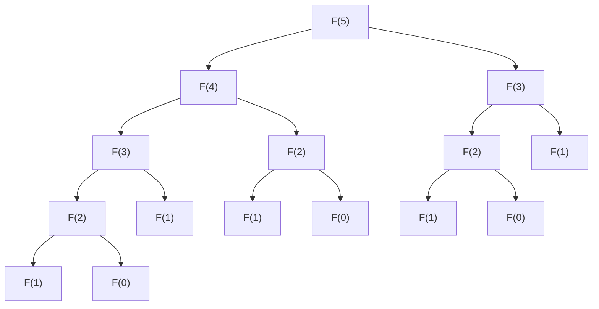

# 1. Pendahuluan

Saat Anda mulai belajar pemrograman dan algoritma, ada satu hambatan besar yang dihadapi oleh banyak pelajar. Itu adalah **Pemrograman Dinamis** (Dynamic Programming, disingkat **DP**). Mendengar namanya saja, Anda mungkin bersikap waspada dan berpikir, "Sepertinya sulit" atau "Apakah saya membutuhkan pengetahuan ahli matematika?". Namun, jika Anda memahami esensinya, Anda akan mengerti bahwa DP adalah teknik pemecahan masalah yang sangat kuat dan intuitif.

Dalam artikel ini, kita akan mulai dari konsep dasar DP dan menggunakan masalah perwakilan "Barisan Fibonacci" dan "Masalah Knapsack" sebagai contoh untuk menjelaskan secara mendalam tentang konsep dan metode implementasinya. Mari kita perdalam pemahaman kita selangkah demi selangkah sambil melihat kode Python.

# 2. Apa itu Pemrograman Dinamis (DP)?

Pemrograman Dinamis (Dynamic Programming) adalah metode untuk memecahkan masalah yang kompleks dengan membaginya menjadi beberapa sub-masalah yang lebih kecil, dan menyelesaikannya sambil mencatat (memoisasi) solusi dari setiap sub-masalah. Hal ini dapat menghilangkan kesia-siaan dari mengulangi perhitungan yang sama dan dapat secara dramatis mempersingkat waktu komputasi.

Inti dari DP terletak pada dua karakteristik berikut.

1. **Substruktur Optimal** (Optimal Substructure): Sifat di mana solusi optimal untuk masalah besar dapat dibentuk dari solusi optimal dari sub-masalah yang lebih kecil.
2. **Sub-masalah Tumpang Tindih** (Overlapping Subproblems): Sifat di mana masalah kecil yang sama muncul berulang kali.

Untuk masalah yang memiliki karakteristik ini, DP menunjukkan kekuatan yang luar biasa.

## 2 Pendekatan DP

DP secara umum dapat dibagi menjadi 2 pendekatan implementasi.

### 1. Rekursi Memoisasi (Metode Top-down)
Dimulai dari masalah besar dan memanggil masalah kecil secara rekursif. Saat itu, hasil perhitungan yang sudah dilakukan sekali disimpan (dimemoisasi) ke dalam array atau hash map, dan ketika masalah yang sama muncul lagi, nilai yang dimemoisasi dikembalikan tanpa melakukan perhitungan ulang.

### 2. Metode Bottom-up (Bagi-dan-Taklukkan dan Pengisian Tabel)
Menghitung solusi secara berurutan mulai dari masalah yang paling kecil dan mencatatnya dalam array (tabel DP). Menggunakan solusi dari masalah kecil untuk secara bertahap memecahkan masalah yang lebih besar, dan pada akhirnya mendapatkan solusi untuk masalah yang ingin dipecahkan.

# 3. Bagian Dasar: Belajar DP melalui Barisan Fibonacci

Sebagai langkah awal untuk memahami konsep DP, kita akan menggunakan barisan Fibonacci.

Barisan Fibonacci adalah barisan yang didefinisikan sebagai berikut.
$ F(0) = 0 $
$ F(1) = 1 $
$ F(n) = F(n-1) + F(n-2) \quad \text{untuk } n \ge 2 $

## 3.1 Jebakan dari Pemanggilan Rekursif Sederhana

Mari kita tulis fungsi dalam Python persis seperti definisinya.

```python
def fib_recursive(n):
    if n <= 0:
        return 0
    elif n == 1:
        return 1
    return fib_recursive(n-1) + fib_recursive(n-2)
```

Implementasi ini intuitif, tetapi ada satu masalah besar. Yaitu, **kompleksitas waktu meningkat secara eksponensial**. Mari kita lihat pohon pemanggilan fungsi saat menghitung $F(5)$.



Seperti yang Anda lihat, $F(3)$ dan $F(2)$ dihitung berulang kali. Kompleksitas waktunya menjadi $O(2^n)$, dan seiring dengan bertambahnya nilai $n$, perhitungan tidak akan selesai dalam waktu yang praktis.

## 3.2 Rekursi Memoisasi (Metode Top-down)

**Memoisasi** adalah cara untuk menghilangkan kesia-siaan ini. Mari kita simpan hasil dari apa yang telah dihitung sekali.

```python
def fib_memo(n, memo=None):
    if memo is None:
        memo = {}
    if n in memo:
        return memo[n]
    if n <= 0:
        return 0
    elif n == 1:
        return 1
    
    memo[n] = fib_memo(n-1, memo) + fib_memo(n-2, memo)
    return memo[n]
```

Dengan ini, setiap $F(i)$ hanya akan dihitung sekali, dan kompleksitas waktu akan turun drastis menjadi $O(n)$.

## 3.3 Metode Bottom-up (Tabel DP)

Untuk menghindari overhead dari pemanggilan rekursif, metode bottom-up melakukan perhitungan secara berurutan dari bawah.

```python
def fib_dp(n):
    if n <= 0:
        return 0
    elif n == 1:
        return 1
        
    dp = [0] * (n + 1)
    dp[0] = 0
    dp[1] = 1
    
    for i in range(2, n + 1):
        dp[i] = dp[i-1] + dp[i-2]
        
    return dp[n]
```

Siapkan array `dp`, dan isi secara berurutan mulai dari indeks terkecil. Ini adalah cara umum penggunaan tabel DP.

# 4. Bagian Lanjutan: Masalah Knapsack

Kekuatan sejati DP akan terlihat ketika memecahkan masalah optimisasi. Di sini kita akan membahas masalah terkenal "Masalah Knapsack 0-1".

## 4.1 Pengaturan Masalah

Anda adalah seorang pencuri (ini adalah pengaturannya). Anda memiliki tas knapsack dengan kapasitas $W$. Di depan Anda ada $N$ barang, dan setiap barang $i$ memiliki berat $w_i$ dan nilai $v_i$.

Pilih barang-barang dalam batas kapasitas knapsack, dan **maksimalkan total nilai** dari barang-barang yang dibawa pulang. Namun, setiap barang hanya ada satu, dan pilihannya hanya "memilih (1)" atau "tidak memilih (0)".

## 4.2 Definisi State dan Relasi Rekurensi

Saat memecahkan masalah dengan DP, hal yang paling penting adalah menurunkan **definisi state (kondisi)** dan **relasi rekurensi (persamaan transisi state)**.

State didefinisikan sebagai berikut.
$dp[i][w]$ : Nilai maksimum ketika memilih barang-barang dari $i$ barang pertama sedemikian rupa sehingga total beratnya kurang dari atau sama dengan $w$.

Di sini, saat mempertimbangkan barang ke-$i$ (berat $w_i$, nilai $v_i$), ada dua pilihan berikut.

1. **Jika tidak memilih**:
   Nilai maksimum sama dengan state sebelumnya $dp[i-1][w]$.
2. **Jika memilih** (hanya mungkin jika $w \ge w_i$):
   Tambahkan nilai $v_i$ dari barang $i$ pada state di mana $w_i$ dikurangkan dari kapasitas. Yaitu, menjadi $dp[i-1][w - w_i] + v_i$.

Oleh karena itu, relasi rekurensinya adalah sebagai berikut.

$$
dp[i][w] = 
\begin{cases}
\max(dp[i-1][w], dp[i-1][w - w_i] + v_i) & \text{jika } w \ge w_i \\
dp[i-1][w] & \text{jika tidak}
\end{cases}
$$

## 4.3 Implementasi Python

Kita akan mengubah relasi rekurensi ini langsung ke dalam program.

```python
def knapsack(weights, values, W):
    N = len(weights)
    # Inisialisasi tabel DP: array 2 dimensi berukuran (N+1) x (W+1)
    dp = [[0] * (W + 1) for _ in range(N + 1)]
    
    # Mengisi tabel DP
    for i in range(1, N + 1):
        for w in range(W + 1):
            if w >= weights[i-1]:
                # Mengambil nilai maksimum antara saat memilih dan tidak memilih
                dp[i][w] = max(dp[i-1][w], dp[i-1][w - weights[i-1]] + values[i-1])
            else:
                # Jika tidak dapat memilih karena kelebihan kapasitas
                dp[i][w] = dp[i-1][w]
                
    return dp[N][W]
```

### Transisi Tabel DP

Mari kita ikuti transisi tabel `dp` dengan sebuah contoh.

| $i$ \ $w$ | 0 | 1 | 2 | 3 | 4 | 5 |
|---|---|---|---|---|---|---|
| 0 | 0 | 0 | 0 | 0 | 0 | 0 |
| 1 | 0 | 0 | 3 | 3 | 3 | 3 |
| 2 | 0 | 2 | 3 | 5 | 5 | 5 |
| 3 | 0 | 2 | 3 | 5 | 6 | 7 |
| 4 | 0 | 2 | 3 | 5 | 6 | 7 |

Dengan cara ini, dengan mencari solusi optimal secara berurutan dari sub-masalah dengan kapasitas kecil dan jumlah barang sedikit, kita akhirnya akan mendapatkan jawabannya.

# 5. Penjelasan Detail dan Eksplorasi Algoritma untuk Memahami DP Lebih Dalam

Untuk memantapkan pemahaman terhadap DP, sangat penting untuk menyentuh lebih banyak contoh masalah dan mempelajari berbagai pola transisi state.

## 5.1 Jarak Edit (Jarak Levenshtein)

Ketika dua string $S$ dan $T$ diberikan, ini adalah masalah mencari berapa jumlah minimum operasi "penyisipan", "penghapusan", dan "penggantian" yang diperlukan untuk mengubah $S$ menjadi $T$.

### Relasi Rekurensi

$$
dp[i][j] = 
\begin{cases}
dp[i-1][j-1] & \text{jika } S[i-1] == T[j-1] \\
\min(dp[i][j-1], dp[i-1][j], dp[i-1][j-1]) + 1 & \text{jika tidak}
\end{cases}
$$

## 5.2 Teknik Optimisasi Kompleksitas Ruang (Pembaruan In-place)

Dalam implementasi sebelumnya, kita telah menggunakan memori $O(NW)$ atau $O(MN)$ untuk perhitungan transisi state. Namun, jika kita mengamati relasi rekurensinya dengan seksama, kita akan sering mendapati bahwa pembaruan suatu state hanya membutuhkan "baris sebelumnya".

Misalnya, dengan menggunakan relasi rekurensi masalah knapsack, kita dapat mengurangi array 2 dimensi menjadi array 1 dimensi. Saat memperbarui, dengan melakukannya dari kanan ke kiri, kita dapat mencegah bug yang menyebabkan nilai $i-1$ tertimpa selama perhitungan $i$ saat ini.

```python
def knapsack_optimized(weights, values, W):
    N = len(weights)
    dp = [0] * (W + 1)
    
    for i in range(N):
        # Dengan memperbarui secara terbalik, cukup dengan array 1 dimensi
        for w in range(W, weights[i] - 1, -1):
            dp[w] = max(dp[w], dp[w - weights[i]] + values[i])
            
    return dp[W]
```

### Bagian Penjelasan Lanjutan 1: Batasan DP dan Pemilihan Algoritma

Kekuatan pemrograman dinamis terletak pada kemampuannya untuk menghindari duplikasi tumpang tindih dari substruktur, tetapi ini tidak berarti semua masalah dapat diselesaikan dengan cepat. Misalnya, kompleksitas waktu dari masalah knapsack adalah $O(NW)$, yang sekilas terlihat seperti waktu polinomial. Namun, karena $W$ adalah "nilai" input, ukurannya bisa menjadi eksponensial terhadap ukuran input (jumlah bit). Kompleksitas waktu seperti ini disebut **waktu pseudo-polinomial** (pseudo-polynomial time).

Jika $W$ sangat besar, hanya dengan mengalokasikan array saja sudah dapat menghabiskan memori, dan jumlah iterasi (loop) akan menjadi sangat besar, sehingga metode DP ini tidak dapat diterapkan. Dalam kasus tersebut, pendekatan lain diperlukan, seperti beralih ke DP terhadap batas atas total nilai $V$, atau menggunakan enumerasi paruh penuh (Meet in the Middle).

Selain itu, dalam men-debug DP, metode yang paling efektif adalah **membandingkan tabel yang dihitung secara manual pada input skala kecil dengan tabel yang dihasilkan oleh program**. Dengan menyiapkan kertas dan pena, dan mencoba menggambar tabel 2 dimensi secara langsung, Anda akan dapat memahami dengan jelas "mengapa relasi rekurensi ini terbentuk" dan "di mana kesalahan transisinya".

### Bagian Penjelasan Lanjutan 2: Batasan DP dan Pemilihan Algoritma

Kekuatan pemrograman dinamis terletak pada kemampuannya untuk menghindari duplikasi tumpang tindih dari substruktur, tetapi ini tidak berarti semua masalah dapat diselesaikan dengan cepat. Misalnya, kompleksitas waktu dari masalah knapsack adalah $O(NW)$, yang sekilas terlihat seperti waktu polinomial. Namun, karena $W$ adalah "nilai" input, ukurannya bisa menjadi eksponensial terhadap ukuran input (jumlah bit). Kompleksitas waktu seperti ini disebut **waktu pseudo-polinomial** (pseudo-polynomial time).

Jika $W$ sangat besar, hanya dengan mengalokasikan array saja sudah dapat menghabiskan memori, dan jumlah iterasi (loop) akan menjadi sangat besar, sehingga metode DP ini tidak dapat diterapkan. Dalam kasus tersebut, pendekatan lain diperlukan, seperti beralih ke DP terhadap batas atas total nilai $V$, atau menggunakan enumerasi paruh penuh (Meet in the Middle).

Selain itu, dalam men-debug DP, metode yang paling efektif adalah **membandingkan tabel yang dihitung secara manual pada input skala kecil dengan tabel yang dihasilkan oleh program**. Dengan menyiapkan kertas dan pena, dan mencoba menggambar tabel 2 dimensi secara langsung, Anda akan dapat memahami dengan jelas "mengapa relasi rekurensi ini terbentuk" dan "di mana kesalahan transisinya".

### Bagian Penjelasan Lanjutan 3: Batasan DP dan Pemilihan Algoritma

Kekuatan pemrograman dinamis terletak pada kemampuannya untuk menghindari duplikasi tumpang tindih dari substruktur, tetapi ini tidak berarti semua masalah dapat diselesaikan dengan cepat. Misalnya, kompleksitas waktu dari masalah knapsack adalah $O(NW)$, yang sekilas terlihat seperti waktu polinomial. Namun, karena $W$ adalah "nilai" input, ukurannya bisa menjadi eksponensial terhadap ukuran input (jumlah bit). Kompleksitas waktu seperti ini disebut **waktu pseudo-polinomial** (pseudo-polynomial time).

Jika $W$ sangat besar, hanya dengan mengalokasikan array saja sudah dapat menghabiskan memori, dan jumlah iterasi (loop) akan menjadi sangat besar, sehingga metode DP ini tidak dapat diterapkan. Dalam kasus tersebut, pendekatan lain diperlukan, seperti beralih ke DP terhadap batas atas total nilai $V$, atau menggunakan enumerasi paruh penuh (Meet in the Middle).

Selain itu, dalam men-debug DP, metode yang paling efektif adalah **membandingkan tabel yang dihitung secara manual pada input skala kecil dengan tabel yang dihasilkan oleh program**. Dengan menyiapkan kertas dan pena, dan mencoba menggambar tabel 2 dimensi secara langsung, Anda akan dapat memahami dengan jelas "mengapa relasi rekurensi ini terbentuk" dan "di mana kesalahan transisinya".

### Bagian Penjelasan Lanjutan 4: Batasan DP dan Pemilihan Algoritma

Kekuatan pemrograman dinamis terletak pada kemampuannya untuk menghindari duplikasi tumpang tindih dari substruktur, tetapi ini tidak berarti semua masalah dapat diselesaikan dengan cepat. Misalnya, kompleksitas waktu dari masalah knapsack adalah $O(NW)$, yang sekilas terlihat seperti waktu polinomial. Namun, karena $W$ adalah "nilai" input, ukurannya bisa menjadi eksponensial terhadap ukuran input (jumlah bit). Kompleksitas waktu seperti ini disebut **waktu pseudo-polinomial** (pseudo-polynomial time).

Jika $W$ sangat besar, hanya dengan mengalokasikan array saja sudah dapat menghabiskan memori, dan jumlah iterasi (loop) akan menjadi sangat besar, sehingga metode DP ini tidak dapat diterapkan. Dalam kasus tersebut, pendekatan lain diperlukan, seperti beralih ke DP terhadap batas atas total nilai $V$, atau menggunakan enumerasi paruh penuh (Meet in the Middle).

Selain itu, dalam men-debug DP, metode yang paling efektif adalah **membandingkan tabel yang dihitung secara manual pada input skala kecil dengan tabel yang dihasilkan oleh program**. Dengan menyiapkan kertas dan pena, dan mencoba menggambar tabel 2 dimensi secara langsung, Anda akan dapat memahami dengan jelas "mengapa relasi rekurensi ini terbentuk" dan "di mana kesalahan transisinya".

### Bagian Penjelasan Lanjutan 5: Batasan DP dan Pemilihan Algoritma

Kekuatan pemrograman dinamis terletak pada kemampuannya untuk menghindari duplikasi tumpang tindih dari substruktur, tetapi ini tidak berarti semua masalah dapat diselesaikan dengan cepat. Misalnya, kompleksitas waktu dari masalah knapsack adalah $O(NW)$, yang sekilas terlihat seperti waktu polinomial. Namun, karena $W$ adalah "nilai" input, ukurannya bisa menjadi eksponensial terhadap ukuran input (jumlah bit). Kompleksitas waktu seperti ini disebut **waktu pseudo-polinomial** (pseudo-polynomial time).

Jika $W$ sangat besar, hanya dengan mengalokasikan array saja sudah dapat menghabiskan memori, dan jumlah iterasi (loop) akan menjadi sangat besar, sehingga metode DP ini tidak dapat diterapkan. Dalam kasus tersebut, pendekatan lain diperlukan, seperti beralih ke DP terhadap batas atas total nilai $V$, atau menggunakan enumerasi paruh penuh (Meet in the Middle).

Selain itu, dalam men-debug DP, metode yang paling efektif adalah **membandingkan tabel yang dihitung secara manual pada input skala kecil dengan tabel yang dihasilkan oleh program**. Dengan menyiapkan kertas dan pena, dan mencoba menggambar tabel 2 dimensi secara langsung, Anda akan dapat memahami dengan jelas "mengapa relasi rekurensi ini terbentuk" dan "di mana kesalahan transisinya".

### Bagian Penjelasan Lanjutan 6: Batasan DP dan Pemilihan Algoritma

Kekuatan pemrograman dinamis terletak pada kemampuannya untuk menghindari duplikasi tumpang tindih dari substruktur, tetapi ini tidak berarti semua masalah dapat diselesaikan dengan cepat. Misalnya, kompleksitas waktu dari masalah knapsack adalah $O(NW)$, yang sekilas terlihat seperti waktu polinomial. Namun, karena $W$ adalah "nilai" input, ukurannya bisa menjadi eksponensial terhadap ukuran input (jumlah bit). Kompleksitas waktu seperti ini disebut **waktu pseudo-polinomial** (pseudo-polynomial time).

Jika $W$ sangat besar, hanya dengan mengalokasikan array saja sudah dapat menghabiskan memori, dan jumlah iterasi (loop) akan menjadi sangat besar, sehingga metode DP ini tidak dapat diterapkan. Dalam kasus tersebut, pendekatan lain diperlukan, seperti beralih ke DP terhadap batas atas total nilai $V$, atau menggunakan enumerasi paruh penuh (Meet in the Middle).

Selain itu, dalam men-debug DP, metode yang paling efektif adalah **membandingkan tabel yang dihitung secara manual pada input skala kecil dengan tabel yang dihasilkan oleh program**. Dengan menyiapkan kertas dan pena, dan mencoba menggambar tabel 2 dimensi secara langsung, Anda akan dapat memahami dengan jelas "mengapa relasi rekurensi ini terbentuk" dan "di mana kesalahan transisinya".

### Bagian Penjelasan Lanjutan 7: Batasan DP dan Pemilihan Algoritma

Kekuatan pemrograman dinamis terletak pada kemampuannya untuk menghindari duplikasi tumpang tindih dari substruktur, tetapi ini tidak berarti semua masalah dapat diselesaikan dengan cepat. Misalnya, kompleksitas waktu dari masalah knapsack adalah $O(NW)$, yang sekilas terlihat seperti waktu polinomial. Namun, karena $W$ adalah "nilai" input, ukurannya bisa menjadi eksponensial terhadap ukuran input (jumlah bit). Kompleksitas waktu seperti ini disebut **waktu pseudo-polinomial** (pseudo-polynomial time).

Jika $W$ sangat besar, hanya dengan mengalokasikan array saja sudah dapat menghabiskan memori, dan jumlah iterasi (loop) akan menjadi sangat besar, sehingga metode DP ini tidak dapat diterapkan. Dalam kasus tersebut, pendekatan lain diperlukan, seperti beralih ke DP terhadap batas atas total nilai $V$, atau menggunakan enumerasi paruh penuh (Meet in the Middle).

Selain itu, dalam men-debug DP, metode yang paling efektif adalah **membandingkan tabel yang dihitung secara manual pada input skala kecil dengan tabel yang dihasilkan oleh program**. Dengan menyiapkan kertas dan pena, dan mencoba menggambar tabel 2 dimensi secara langsung, Anda akan dapat memahami dengan jelas "mengapa relasi rekurensi ini terbentuk" dan "di mana kesalahan transisinya".

### Bagian Penjelasan Lanjutan 8: Batasan DP dan Pemilihan Algoritma

Kekuatan pemrograman dinamis terletak pada kemampuannya untuk menghindari duplikasi tumpang tindih dari substruktur, tetapi ini tidak berarti semua masalah dapat diselesaikan dengan cepat. Misalnya, kompleksitas waktu dari masalah knapsack adalah $O(NW)$, yang sekilas terlihat seperti waktu polinomial. Namun, karena $W$ adalah "nilai" input, ukurannya bisa menjadi eksponensial terhadap ukuran input (jumlah bit). Kompleksitas waktu seperti ini disebut **waktu pseudo-polinomial** (pseudo-polynomial time).

Jika $W$ sangat besar, hanya dengan mengalokasikan array saja sudah dapat menghabiskan memori, dan jumlah iterasi (loop) akan menjadi sangat besar, sehingga metode DP ini tidak dapat diterapkan. Dalam kasus tersebut, pendekatan lain diperlukan, seperti beralih ke DP terhadap batas atas total nilai $V$, atau menggunakan enumerasi paruh penuh (Meet in the Middle).

Selain itu, dalam men-debug DP, metode yang paling efektif adalah **membandingkan tabel yang dihitung secara manual pada input skala kecil dengan tabel yang dihasilkan oleh program**. Dengan menyiapkan kertas dan pena, dan mencoba menggambar tabel 2 dimensi secara langsung, Anda akan dapat memahami dengan jelas "mengapa relasi rekurensi ini terbentuk" dan "di mana kesalahan transisinya".

### Bagian Penjelasan Lanjutan 9: Batasan DP dan Pemilihan Algoritma

Kekuatan pemrograman dinamis terletak pada kemampuannya untuk menghindari duplikasi tumpang tindih dari substruktur, tetapi ini tidak berarti semua masalah dapat diselesaikan dengan cepat. Misalnya, kompleksitas waktu dari masalah knapsack adalah $O(NW)$, yang sekilas terlihat seperti waktu polinomial. Namun, karena $W$ adalah "nilai" input, ukurannya bisa menjadi eksponensial terhadap ukuran input (jumlah bit). Kompleksitas waktu seperti ini disebut **waktu pseudo-polinomial** (pseudo-polynomial time).

Jika $W$ sangat besar, hanya dengan mengalokasikan array saja sudah dapat menghabiskan memori, dan jumlah iterasi (loop) akan menjadi sangat besar, sehingga metode DP ini tidak dapat diterapkan. Dalam kasus tersebut, pendekatan lain diperlukan, seperti beralih ke DP terhadap batas atas total nilai $V$, atau menggunakan enumerasi paruh penuh (Meet in the Middle).

Selain itu, dalam men-debug DP, metode yang paling efektif adalah **membandingkan tabel yang dihitung secara manual pada input skala kecil dengan tabel yang dihasilkan oleh program**. Dengan menyiapkan kertas dan pena, dan mencoba menggambar tabel 2 dimensi secara langsung, Anda akan dapat memahami dengan jelas "mengapa relasi rekurensi ini terbentuk" dan "di mana kesalahan transisinya".

### Bagian Penjelasan Lanjutan 10: Batasan DP dan Pemilihan Algoritma

Kekuatan pemrograman dinamis terletak pada kemampuannya untuk menghindari duplikasi tumpang tindih dari substruktur, tetapi ini tidak berarti semua masalah dapat diselesaikan dengan cepat. Misalnya, kompleksitas waktu dari masalah knapsack adalah $O(NW)$, yang sekilas terlihat seperti waktu polinomial. Namun, karena $W$ adalah "nilai" input, ukurannya bisa menjadi eksponensial terhadap ukuran input (jumlah bit). Kompleksitas waktu seperti ini disebut **waktu pseudo-polinomial** (pseudo-polynomial time).

Jika $W$ sangat besar, hanya dengan mengalokasikan array saja sudah dapat menghabiskan memori, dan jumlah iterasi (loop) akan menjadi sangat besar, sehingga metode DP ini tidak dapat diterapkan. Dalam kasus tersebut, pendekatan lain diperlukan, seperti beralih ke DP terhadap batas atas total nilai $V$, atau menggunakan enumerasi paruh penuh (Meet in the Middle).

Selain itu, dalam men-debug DP, metode yang paling efektif adalah **membandingkan tabel yang dihitung secara manual pada input skala kecil dengan tabel yang dihasilkan oleh program**. Dengan menyiapkan kertas dan pena, dan mencoba menggambar tabel 2 dimensi secara langsung, Anda akan dapat memahami dengan jelas "mengapa relasi rekurensi ini terbentuk" dan "di mana kesalahan transisinya".

### Bagian Penjelasan Lanjutan 11: Batasan DP dan Pemilihan Algoritma

Kekuatan pemrograman dinamis terletak pada kemampuannya untuk menghindari duplikasi tumpang tindih dari substruktur, tetapi ini tidak berarti semua masalah dapat diselesaikan dengan cepat. Misalnya, kompleksitas waktu dari masalah knapsack adalah $O(NW)$, yang sekilas terlihat seperti waktu polinomial. Namun, karena $W$ adalah "nilai" input, ukurannya bisa menjadi eksponensial terhadap ukuran input (jumlah bit). Kompleksitas waktu seperti ini disebut **waktu pseudo-polinomial** (pseudo-polynomial time).

Jika $W$ sangat besar, hanya dengan mengalokasikan array saja sudah dapat menghabiskan memori, dan jumlah iterasi (loop) akan menjadi sangat besar, sehingga metode DP ini tidak dapat diterapkan. Dalam kasus tersebut, pendekatan lain diperlukan, seperti beralih ke DP terhadap batas atas total nilai $V$, atau menggunakan enumerasi paruh penuh (Meet in the Middle).

Selain itu, dalam men-debug DP, metode yang paling efektif adalah **membandingkan tabel yang dihitung secara manual pada input skala kecil dengan tabel yang dihasilkan oleh program**. Dengan menyiapkan kertas dan pena, dan mencoba menggambar tabel 2 dimensi secara langsung, Anda akan dapat memahami dengan jelas "mengapa relasi rekurensi ini terbentuk" dan "di mana kesalahan transisinya".

### Bagian Penjelasan Lanjutan 12: Batasan DP dan Pemilihan Algoritma

Kekuatan pemrograman dinamis terletak pada kemampuannya untuk menghindari duplikasi tumpang tindih dari substruktur, tetapi ini tidak berarti semua masalah dapat diselesaikan dengan cepat. Misalnya, kompleksitas waktu dari masalah knapsack adalah $O(NW)$, yang sekilas terlihat seperti waktu polinomial. Namun, karena $W$ adalah "nilai" input, ukurannya bisa menjadi eksponensial terhadap ukuran input (jumlah bit). Kompleksitas waktu seperti ini disebut **waktu pseudo-polinomial** (pseudo-polynomial time).

Jika $W$ sangat besar, hanya dengan mengalokasikan array saja sudah dapat menghabiskan memori, dan jumlah iterasi (loop) akan menjadi sangat besar, sehingga metode DP ini tidak dapat diterapkan. Dalam kasus tersebut, pendekatan lain diperlukan, seperti beralih ke DP terhadap batas atas total nilai $V$, atau menggunakan enumerasi paruh penuh (Meet in the Middle).

Selain itu, dalam men-debug DP, metode yang paling efektif adalah **membandingkan tabel yang dihitung secara manual pada input skala kecil dengan tabel yang dihasilkan oleh program**. Dengan menyiapkan kertas dan pena, dan mencoba menggambar tabel 2 dimensi secara langsung, Anda akan dapat memahami dengan jelas "mengapa relasi rekurensi ini terbentuk" dan "di mana kesalahan transisinya".

### Bagian Penjelasan Lanjutan 13: Batasan DP dan Pemilihan Algoritma

Kekuatan pemrograman dinamis terletak pada kemampuannya untuk menghindari duplikasi tumpang tindih dari substruktur, tetapi ini tidak berarti semua masalah dapat diselesaikan dengan cepat. Misalnya, kompleksitas waktu dari masalah knapsack adalah $O(NW)$, yang sekilas terlihat seperti waktu polinomial. Namun, karena $W$ adalah "nilai" input, ukurannya bisa menjadi eksponensial terhadap ukuran input (jumlah bit). Kompleksitas waktu seperti ini disebut **waktu pseudo-polinomial** (pseudo-polynomial time).

Jika $W$ sangat besar, hanya dengan mengalokasikan array saja sudah dapat menghabiskan memori, dan jumlah iterasi (loop) akan menjadi sangat besar, sehingga metode DP ini tidak dapat diterapkan. Dalam kasus tersebut, pendekatan lain diperlukan, seperti beralih ke DP terhadap batas atas total nilai $V$, atau menggunakan enumerasi paruh penuh (Meet in the Middle).

Selain itu, dalam men-debug DP, metode yang paling efektif adalah **membandingkan tabel yang dihitung secara manual pada input skala kecil dengan tabel yang dihasilkan oleh program**. Dengan menyiapkan kertas dan pena, dan mencoba menggambar tabel 2 dimensi secara langsung, Anda akan dapat memahami dengan jelas "mengapa relasi rekurensi ini terbentuk" dan "di mana kesalahan transisinya".

### Bagian Penjelasan Lanjutan 14: Batasan DP dan Pemilihan Algoritma

Kekuatan pemrograman dinamis terletak pada kemampuannya untuk menghindari duplikasi tumpang tindih dari substruktur, tetapi ini tidak berarti semua masalah dapat diselesaikan dengan cepat. Misalnya, kompleksitas waktu dari masalah knapsack adalah $O(NW)$, yang sekilas terlihat seperti waktu polinomial. Namun, karena $W$ adalah "nilai" input, ukurannya bisa menjadi eksponensial terhadap ukuran input (jumlah bit). Kompleksitas waktu seperti ini disebut **waktu pseudo-polinomial** (pseudo-polynomial time).

Jika $W$ sangat besar, hanya dengan mengalokasikan array saja sudah dapat menghabiskan memori, dan jumlah iterasi (loop) akan menjadi sangat besar, sehingga metode DP ini tidak dapat diterapkan. Dalam kasus tersebut, pendekatan lain diperlukan, seperti beralih ke DP terhadap batas atas total nilai $V$, atau menggunakan enumerasi paruh penuh (Meet in the Middle).

Selain itu, dalam men-debug DP, metode yang paling efektif adalah **membandingkan tabel yang dihitung secara manual pada input skala kecil dengan tabel yang dihasilkan oleh program**. Dengan menyiapkan kertas dan pena, dan mencoba menggambar tabel 2 dimensi secara langsung, Anda akan dapat memahami dengan jelas "mengapa relasi rekurensi ini terbentuk" dan "di mana kesalahan transisinya".

### Bagian Penjelasan Lanjutan 15: Batasan DP dan Pemilihan Algoritma

Kekuatan pemrograman dinamis terletak pada kemampuannya untuk menghindari duplikasi tumpang tindih dari substruktur, tetapi ini tidak berarti semua masalah dapat diselesaikan dengan cepat. Misalnya, kompleksitas waktu dari masalah knapsack adalah $O(NW)$, yang sekilas terlihat seperti waktu polinomial. Namun, karena $W$ adalah "nilai" input, ukurannya bisa menjadi eksponensial terhadap ukuran input (jumlah bit). Kompleksitas waktu seperti ini disebut **waktu pseudo-polinomial** (pseudo-polynomial time).

Jika $W$ sangat besar, hanya dengan mengalokasikan array saja sudah dapat menghabiskan memori, dan jumlah iterasi (loop) akan menjadi sangat besar, sehingga metode DP ini tidak dapat diterapkan. Dalam kasus tersebut, pendekatan lain diperlukan, seperti beralih ke DP terhadap batas atas total nilai $V$, atau menggunakan enumerasi paruh penuh (Meet in the Middle).

Selain itu, dalam men-debug DP, metode yang paling efektif adalah **membandingkan tabel yang dihitung secara manual pada input skala kecil dengan tabel yang dihasilkan oleh program**. Dengan menyiapkan kertas dan pena, dan mencoba menggambar tabel 2 dimensi secara langsung, Anda akan dapat memahami dengan jelas "mengapa relasi rekurensi ini terbentuk" dan "di mana kesalahan transisinya".

### Bagian Penjelasan Lanjutan 16: Batasan DP dan Pemilihan Algoritma

Kekuatan pemrograman dinamis terletak pada kemampuannya untuk menghindari duplikasi tumpang tindih dari substruktur, tetapi ini tidak berarti semua masalah dapat diselesaikan dengan cepat. Misalnya, kompleksitas waktu dari masalah knapsack adalah $O(NW)$, yang sekilas terlihat seperti waktu polinomial. Namun, karena $W$ adalah "nilai" input, ukurannya bisa menjadi eksponensial terhadap ukuran input (jumlah bit). Kompleksitas waktu seperti ini disebut **waktu pseudo-polinomial** (pseudo-polynomial time).

Jika $W$ sangat besar, hanya dengan mengalokasikan array saja sudah dapat menghabiskan memori, dan jumlah iterasi (loop) akan menjadi sangat besar, sehingga metode DP ini tidak dapat diterapkan. Dalam kasus tersebut, pendekatan lain diperlukan, seperti beralih ke DP terhadap batas atas total nilai $V$, atau menggunakan enumerasi paruh penuh (Meet in the Middle).

Selain itu, dalam men-debug DP, metode yang paling efektif adalah **membandingkan tabel yang dihitung secara manual pada input skala kecil dengan tabel yang dihasilkan oleh program**. Dengan menyiapkan kertas dan pena, dan mencoba menggambar tabel 2 dimensi secara langsung, Anda akan dapat memahami dengan jelas "mengapa relasi rekurensi ini terbentuk" dan "di mana kesalahan transisinya".

### Bagian Penjelasan Lanjutan 17: Batasan DP dan Pemilihan Algoritma

Kekuatan pemrograman dinamis terletak pada kemampuannya untuk menghindari duplikasi tumpang tindih dari substruktur, tetapi ini tidak berarti semua masalah dapat diselesaikan dengan cepat. Misalnya, kompleksitas waktu dari masalah knapsack adalah $O(NW)$, yang sekilas terlihat seperti waktu polinomial. Namun, karena $W$ adalah "nilai" input, ukurannya bisa menjadi eksponensial terhadap ukuran input (jumlah bit). Kompleksitas waktu seperti ini disebut **waktu pseudo-polinomial** (pseudo-polynomial time).

Jika $W$ sangat besar, hanya dengan mengalokasikan array saja sudah dapat menghabiskan memori, dan jumlah iterasi (loop) akan menjadi sangat besar, sehingga metode DP ini tidak dapat diterapkan. Dalam kasus tersebut, pendekatan lain diperlukan, seperti beralih ke DP terhadap batas atas total nilai $V$, atau menggunakan enumerasi paruh penuh (Meet in the Middle).

Selain itu, dalam men-debug DP, metode yang paling efektif adalah **membandingkan tabel yang dihitung secara manual pada input skala kecil dengan tabel yang dihasilkan oleh program**. Dengan menyiapkan kertas dan pena, dan mencoba menggambar tabel 2 dimensi secara langsung, Anda akan dapat memahami dengan jelas "mengapa relasi rekurensi ini terbentuk" dan "di mana kesalahan transisinya".

### Bagian Penjelasan Lanjutan 18: Batasan DP dan Pemilihan Algoritma

Kekuatan pemrograman dinamis terletak pada kemampuannya untuk menghindari duplikasi tumpang tindih dari substruktur, tetapi ini tidak berarti semua masalah dapat diselesaikan dengan cepat. Misalnya, kompleksitas waktu dari masalah knapsack adalah $O(NW)$, yang sekilas terlihat seperti waktu polinomial. Namun, karena $W$ adalah "nilai" input, ukurannya bisa menjadi eksponensial terhadap ukuran input (jumlah bit). Kompleksitas waktu seperti ini disebut **waktu pseudo-polinomial** (pseudo-polynomial time).

Jika $W$ sangat besar, hanya dengan mengalokasikan array saja sudah dapat menghabiskan memori, dan jumlah iterasi (loop) akan menjadi sangat besar, sehingga metode DP ini tidak dapat diterapkan. Dalam kasus tersebut, pendekatan lain diperlukan, seperti beralih ke DP terhadap batas atas total nilai $V$, atau menggunakan enumerasi paruh penuh (Meet in the Middle).

Selain itu, dalam men-debug DP, metode yang paling efektif adalah **membandingkan tabel yang dihitung secara manual pada input skala kecil dengan tabel yang dihasilkan oleh program**. Dengan menyiapkan kertas dan pena, dan mencoba menggambar tabel 2 dimensi secara langsung, Anda akan dapat memahami dengan jelas "mengapa relasi rekurensi ini terbentuk" dan "di mana kesalahan transisinya".

### Bagian Penjelasan Lanjutan 19: Batasan DP dan Pemilihan Algoritma

Kekuatan pemrograman dinamis terletak pada kemampuannya untuk menghindari duplikasi tumpang tindih dari substruktur, tetapi ini tidak berarti semua masalah dapat diselesaikan dengan cepat. Misalnya, kompleksitas waktu dari masalah knapsack adalah $O(NW)$, yang sekilas terlihat seperti waktu polinomial. Namun, karena $W$ adalah "nilai" input, ukurannya bisa menjadi eksponensial terhadap ukuran input (jumlah bit). Kompleksitas waktu seperti ini disebut **waktu pseudo-polinomial** (pseudo-polynomial time).

Jika $W$ sangat besar, hanya dengan mengalokasikan array saja sudah dapat menghabiskan memori, dan jumlah iterasi (loop) akan menjadi sangat besar, sehingga metode DP ini tidak dapat diterapkan. Dalam kasus tersebut, pendekatan lain diperlukan, seperti beralih ke DP terhadap batas atas total nilai $V$, atau menggunakan enumerasi paruh penuh (Meet in the Middle).

Selain itu, dalam men-debug DP, metode yang paling efektif adalah **membandingkan tabel yang dihitung secara manual pada input skala kecil dengan tabel yang dihasilkan oleh program**. Dengan menyiapkan kertas dan pena, dan mencoba menggambar tabel 2 dimensi secara langsung, Anda akan dapat memahami dengan jelas "mengapa relasi rekurensi ini terbentuk" dan "di mana kesalahan transisinya".

### Bagian Penjelasan Lanjutan 20: Batasan DP dan Pemilihan Algoritma

Kekuatan pemrograman dinamis terletak pada kemampuannya untuk menghindari duplikasi tumpang tindih dari substruktur, tetapi ini tidak berarti semua masalah dapat diselesaikan dengan cepat. Misalnya, kompleksitas waktu dari masalah knapsack adalah $O(NW)$, yang sekilas terlihat seperti waktu polinomial. Namun, karena $W$ adalah "nilai" input, ukurannya bisa menjadi eksponensial terhadap ukuran input (jumlah bit). Kompleksitas waktu seperti ini disebut **waktu pseudo-polinomial** (pseudo-polynomial time).

Jika $W$ sangat besar, hanya dengan mengalokasikan array saja sudah dapat menghabiskan memori, dan jumlah iterasi (loop) akan menjadi sangat besar, sehingga metode DP ini tidak dapat diterapkan. Dalam kasus tersebut, pendekatan lain diperlukan, seperti beralih ke DP terhadap batas atas total nilai $V$, atau menggunakan enumerasi paruh penuh (Meet in the Middle).

Selain itu, dalam men-debug DP, metode yang paling efektif adalah **membandingkan tabel yang dihitung secara manual pada input skala kecil dengan tabel yang dihasilkan oleh program**. Dengan menyiapkan kertas dan pena, dan mencoba menggambar tabel 2 dimensi secara langsung, Anda akan dapat memahami dengan jelas "mengapa relasi rekurensi ini terbentuk" dan "di mana kesalahan transisinya".

### Bagian Penjelasan Lanjutan 21: Batasan DP dan Pemilihan Algoritma

Kekuatan pemrograman dinamis terletak pada kemampuannya untuk menghindari duplikasi tumpang tindih dari substruktur, tetapi ini tidak berarti semua masalah dapat diselesaikan dengan cepat. Misalnya, kompleksitas waktu dari masalah knapsack adalah $O(NW)$, yang sekilas terlihat seperti waktu polinomial. Namun, karena $W$ adalah "nilai" input, ukurannya bisa menjadi eksponensial terhadap ukuran input (jumlah bit). Kompleksitas waktu seperti ini disebut **waktu pseudo-polinomial** (pseudo-polynomial time).

Jika $W$ sangat besar, hanya dengan mengalokasikan array saja sudah dapat menghabiskan memori, dan jumlah iterasi (loop) akan menjadi sangat besar, sehingga metode DP ini tidak dapat diterapkan. Dalam kasus tersebut, pendekatan lain diperlukan, seperti beralih ke DP terhadap batas atas total nilai $V$, atau menggunakan enumerasi paruh penuh (Meet in the Middle).

Selain itu, dalam men-debug DP, metode yang paling efektif adalah **membandingkan tabel yang dihitung secara manual pada input skala kecil dengan tabel yang dihasilkan oleh program**. Dengan menyiapkan kertas dan pena, dan mencoba menggambar tabel 2 dimensi secara langsung, Anda akan dapat memahami dengan jelas "mengapa relasi rekurensi ini terbentuk" dan "di mana kesalahan transisinya".

### Bagian Penjelasan Lanjutan 22: Batasan DP dan Pemilihan Algoritma

Kekuatan pemrograman dinamis terletak pada kemampuannya untuk menghindari duplikasi tumpang tindih dari substruktur, tetapi ini tidak berarti semua masalah dapat diselesaikan dengan cepat. Misalnya, kompleksitas waktu dari masalah knapsack adalah $O(NW)$, yang sekilas terlihat seperti waktu polinomial. Namun, karena $W$ adalah "nilai" input, ukurannya bisa menjadi eksponensial terhadap ukuran input (jumlah bit). Kompleksitas waktu seperti ini disebut **waktu pseudo-polinomial** (pseudo-polynomial time).

Jika $W$ sangat besar, hanya dengan mengalokasikan array saja sudah dapat menghabiskan memori, dan jumlah iterasi (loop) akan menjadi sangat besar, sehingga metode DP ini tidak dapat diterapkan. Dalam kasus tersebut, pendekatan lain diperlukan, seperti beralih ke DP terhadap batas atas total nilai $V$, atau menggunakan enumerasi paruh penuh (Meet in the Middle).

Selain itu, dalam men-debug DP, metode yang paling efektif adalah **membandingkan tabel yang dihitung secara manual pada input skala kecil dengan tabel yang dihasilkan oleh program**. Dengan menyiapkan kertas dan pena, dan mencoba menggambar tabel 2 dimensi secara langsung, Anda akan dapat memahami dengan jelas "mengapa relasi rekurensi ini terbentuk" dan "di mana kesalahan transisinya".

### Bagian Penjelasan Lanjutan 23: Batasan DP dan Pemilihan Algoritma

Kekuatan pemrograman dinamis terletak pada kemampuannya untuk menghindari duplikasi tumpang tindih dari substruktur, tetapi ini tidak berarti semua masalah dapat diselesaikan dengan cepat. Misalnya, kompleksitas waktu dari masalah knapsack adalah $O(NW)$, yang sekilas terlihat seperti waktu polinomial. Namun, karena $W$ adalah "nilai" input, ukurannya bisa menjadi eksponensial terhadap ukuran input (jumlah bit). Kompleksitas waktu seperti ini disebut **waktu pseudo-polinomial** (pseudo-polynomial time).

Jika $W$ sangat besar, hanya dengan mengalokasikan array saja sudah dapat menghabiskan memori, dan jumlah iterasi (loop) akan menjadi sangat besar, sehingga metode DP ini tidak dapat diterapkan. Dalam kasus tersebut, pendekatan lain diperlukan, seperti beralih ke DP terhadap batas atas total nilai $V$, atau menggunakan enumerasi paruh penuh (Meet in the Middle).

Selain itu, dalam men-debug DP, metode yang paling efektif adalah **membandingkan tabel yang dihitung secara manual pada input skala kecil dengan tabel yang dihasilkan oleh program**. Dengan menyiapkan kertas dan pena, dan mencoba menggambar tabel 2 dimensi secara langsung, Anda akan dapat memahami dengan jelas "mengapa relasi rekurensi ini terbentuk" dan "di mana kesalahan transisinya".

### Bagian Penjelasan Lanjutan 24: Batasan DP dan Pemilihan Algoritma

Kekuatan pemrograman dinamis terletak pada kemampuannya untuk menghindari duplikasi tumpang tindih dari substruktur, tetapi ini tidak berarti semua masalah dapat diselesaikan dengan cepat. Misalnya, kompleksitas waktu dari masalah knapsack adalah $O(NW)$, yang sekilas terlihat seperti waktu polinomial. Namun, karena $W$ adalah "nilai" input, ukurannya bisa menjadi eksponensial terhadap ukuran input (jumlah bit). Kompleksitas waktu seperti ini disebut **waktu pseudo-polinomial** (pseudo-polynomial time).

Jika $W$ sangat besar, hanya dengan mengalokasikan array saja sudah dapat menghabiskan memori, dan jumlah iterasi (loop) akan menjadi sangat besar, sehingga metode DP ini tidak dapat diterapkan. Dalam kasus tersebut, pendekatan lain diperlukan, seperti beralih ke DP terhadap batas atas total nilai $V$, atau menggunakan enumerasi paruh penuh (Meet in the Middle).

Selain itu, dalam men-debug DP, metode yang paling efektif adalah **membandingkan tabel yang dihitung secara manual pada input skala kecil dengan tabel yang dihasilkan oleh program**. Dengan menyiapkan kertas dan pena, dan mencoba menggambar tabel 2 dimensi secara langsung, Anda akan dapat memahami dengan jelas "mengapa relasi rekurensi ini terbentuk" dan "di mana kesalahan transisinya".

### Bagian Penjelasan Lanjutan 25: Batasan DP dan Pemilihan Algoritma

Kekuatan pemrograman dinamis terletak pada kemampuannya untuk menghindari duplikasi tumpang tindih dari substruktur, tetapi ini tidak berarti semua masalah dapat diselesaikan dengan cepat. Misalnya, kompleksitas waktu dari masalah knapsack adalah $O(NW)$, yang sekilas terlihat seperti waktu polinomial. Namun, karena $W$ adalah "nilai" input, ukurannya bisa menjadi eksponensial terhadap ukuran input (jumlah bit). Kompleksitas waktu seperti ini disebut **waktu pseudo-polinomial** (pseudo-polynomial time).

Jika $W$ sangat besar, hanya dengan mengalokasikan array saja sudah dapat menghabiskan memori, dan jumlah iterasi (loop) akan menjadi sangat besar, sehingga metode DP ini tidak dapat diterapkan. Dalam kasus tersebut, pendekatan lain diperlukan, seperti beralih ke DP terhadap batas atas total nilai $V$, atau menggunakan enumerasi paruh penuh (Meet in the Middle).

Selain itu, dalam men-debug DP, metode yang paling efektif adalah **membandingkan tabel yang dihitung secara manual pada input skala kecil dengan tabel yang dihasilkan oleh program**. Dengan menyiapkan kertas dan pena, dan mencoba menggambar tabel 2 dimensi secara langsung, Anda akan dapat memahami dengan jelas "mengapa relasi rekurensi ini terbentuk" dan "di mana kesalahan transisinya".

### Bagian Penjelasan Lanjutan 26: Batasan DP dan Pemilihan Algoritma

Kekuatan pemrograman dinamis terletak pada kemampuannya untuk menghindari duplikasi tumpang tindih dari substruktur, tetapi ini tidak berarti semua masalah dapat diselesaikan dengan cepat. Misalnya, kompleksitas waktu dari masalah knapsack adalah $O(NW)$, yang sekilas terlihat seperti waktu polinomial. Namun, karena $W$ adalah "nilai" input, ukurannya bisa menjadi eksponensial terhadap ukuran input (jumlah bit). Kompleksitas waktu seperti ini disebut **waktu pseudo-polinomial** (pseudo-polynomial time).

Jika $W$ sangat besar, hanya dengan mengalokasikan array saja sudah dapat menghabiskan memori, dan jumlah iterasi (loop) akan menjadi sangat besar, sehingga metode DP ini tidak dapat diterapkan. Dalam kasus tersebut, pendekatan lain diperlukan, seperti beralih ke DP terhadap batas atas total nilai $V$, atau menggunakan enumerasi paruh penuh (Meet in the Middle).

Selain itu, dalam men-debug DP, metode yang paling efektif adalah **membandingkan tabel yang dihitung secara manual pada input skala kecil dengan tabel yang dihasilkan oleh program**. Dengan menyiapkan kertas dan pena, dan mencoba menggambar tabel 2 dimensi secara langsung, Anda akan dapat memahami dengan jelas "mengapa relasi rekurensi ini terbentuk" dan "di mana kesalahan transisinya".

### Bagian Penjelasan Lanjutan 27: Batasan DP dan Pemilihan Algoritma

Kekuatan pemrograman dinamis terletak pada kemampuannya untuk menghindari duplikasi tumpang tindih dari substruktur, tetapi ini tidak berarti semua masalah dapat diselesaikan dengan cepat. Misalnya, kompleksitas waktu dari masalah knapsack adalah $O(NW)$, yang sekilas terlihat seperti waktu polinomial. Namun, karena $W$ adalah "nilai" input, ukurannya bisa menjadi eksponensial terhadap ukuran input (jumlah bit). Kompleksitas waktu seperti ini disebut **waktu pseudo-polinomial** (pseudo-polynomial time).

Jika $W$ sangat besar, hanya dengan mengalokasikan array saja sudah dapat menghabiskan memori, dan jumlah iterasi (loop) akan menjadi sangat besar, sehingga metode DP ini tidak dapat diterapkan. Dalam kasus tersebut, pendekatan lain diperlukan, seperti beralih ke DP terhadap batas atas total nilai $V$, atau menggunakan enumerasi paruh penuh (Meet in the Middle).

Selain itu, dalam men-debug DP, metode yang paling efektif adalah **membandingkan tabel yang dihitung secara manual pada input skala kecil dengan tabel yang dihasilkan oleh program**. Dengan menyiapkan kertas dan pena, dan mencoba menggambar tabel 2 dimensi secara langsung, Anda akan dapat memahami dengan jelas "mengapa relasi rekurensi ini terbentuk" dan "di mana kesalahan transisinya".

### Bagian Penjelasan Lanjutan 28: Batasan DP dan Pemilihan Algoritma

Kekuatan pemrograman dinamis terletak pada kemampuannya untuk menghindari duplikasi tumpang tindih dari substruktur, tetapi ini tidak berarti semua masalah dapat diselesaikan dengan cepat. Misalnya, kompleksitas waktu dari masalah knapsack adalah $O(NW)$, yang sekilas terlihat seperti waktu polinomial. Namun, karena $W$ adalah "nilai" input, ukurannya bisa menjadi eksponensial terhadap ukuran input (jumlah bit). Kompleksitas waktu seperti ini disebut **waktu pseudo-polinomial** (pseudo-polynomial time).

Jika $W$ sangat besar, hanya dengan mengalokasikan array saja sudah dapat menghabiskan memori, dan jumlah iterasi (loop) akan menjadi sangat besar, sehingga metode DP ini tidak dapat diterapkan. Dalam kasus tersebut, pendekatan lain diperlukan, seperti beralih ke DP terhadap batas atas total nilai $V$, atau menggunakan enumerasi paruh penuh (Meet in the Middle).

Selain itu, dalam men-debug DP, metode yang paling efektif adalah **membandingkan tabel yang dihitung secara manual pada input skala kecil dengan tabel yang dihasilkan oleh program**. Dengan menyiapkan kertas dan pena, dan mencoba menggambar tabel 2 dimensi secara langsung, Anda akan dapat memahami dengan jelas "mengapa relasi rekurensi ini terbentuk" dan "di mana kesalahan transisinya".

### Bagian Penjelasan Lanjutan 29: Batasan DP dan Pemilihan Algoritma

Kekuatan pemrograman dinamis terletak pada kemampuannya untuk menghindari duplikasi tumpang tindih dari substruktur, tetapi ini tidak berarti semua masalah dapat diselesaikan dengan cepat. Misalnya, kompleksitas waktu dari masalah knapsack adalah $O(NW)$, yang sekilas terlihat seperti waktu polinomial. Namun, karena $W$ adalah "nilai" input, ukurannya bisa menjadi eksponensial terhadap ukuran input (jumlah bit). Kompleksitas waktu seperti ini disebut **waktu pseudo-polinomial** (pseudo-polynomial time).

Jika $W$ sangat besar, hanya dengan mengalokasikan array saja sudah dapat menghabiskan memori, dan jumlah iterasi (loop) akan menjadi sangat besar, sehingga metode DP ini tidak dapat diterapkan. Dalam kasus tersebut, pendekatan lain diperlukan, seperti beralih ke DP terhadap batas atas total nilai $V$, atau menggunakan enumerasi paruh penuh (Meet in the Middle).

Selain itu, dalam men-debug DP, metode yang paling efektif adalah **membandingkan tabel yang dihitung secara manual pada input skala kecil dengan tabel yang dihasilkan oleh program**. Dengan menyiapkan kertas dan pena, dan mencoba menggambar tabel 2 dimensi secara langsung, Anda akan dapat memahami dengan jelas "mengapa relasi rekurensi ini terbentuk" dan "di mana kesalahan transisinya".

### Bagian Penjelasan Lanjutan 30: Batasan DP dan Pemilihan Algoritma

Kekuatan pemrograman dinamis terletak pada kemampuannya untuk menghindari duplikasi tumpang tindih dari substruktur, tetapi ini tidak berarti semua masalah dapat diselesaikan dengan cepat. Misalnya, kompleksitas waktu dari masalah knapsack adalah $O(NW)$, yang sekilas terlihat seperti waktu polinomial. Namun, karena $W$ adalah "nilai" input, ukurannya bisa menjadi eksponensial terhadap ukuran input (jumlah bit). Kompleksitas waktu seperti ini disebut **waktu pseudo-polinomial** (pseudo-polynomial time).

Jika $W$ sangat besar, hanya dengan mengalokasikan array saja sudah dapat menghabiskan memori, dan jumlah iterasi (loop) akan menjadi sangat besar, sehingga metode DP ini tidak dapat diterapkan. Dalam kasus tersebut, pendekatan lain diperlukan, seperti beralih ke DP terhadap batas atas total nilai $V$, atau menggunakan enumerasi paruh penuh (Meet in the Middle).

Selain itu, dalam men-debug DP, metode yang paling efektif adalah **membandingkan tabel yang dihitung secara manual pada input skala kecil dengan tabel yang dihasilkan oleh program**. Dengan menyiapkan kertas dan pena, dan mencoba menggambar tabel 2 dimensi secara langsung, Anda akan dapat memahami dengan jelas "mengapa relasi rekurensi ini terbentuk" dan "di mana kesalahan transisinya".

### Bagian Penjelasan Lanjutan 31: Batasan DP dan Pemilihan Algoritma

Kekuatan pemrograman dinamis terletak pada kemampuannya untuk menghindari duplikasi tumpang tindih dari substruktur, tetapi ini tidak berarti semua masalah dapat diselesaikan dengan cepat. Misalnya, kompleksitas waktu dari masalah knapsack adalah $O(NW)$, yang sekilas terlihat seperti waktu polinomial. Namun, karena $W$ adalah "nilai" input, ukurannya bisa menjadi eksponensial terhadap ukuran input (jumlah bit). Kompleksitas waktu seperti ini disebut **waktu pseudo-polinomial** (pseudo-polynomial time).

Jika $W$ sangat besar, hanya dengan mengalokasikan array saja sudah dapat menghabiskan memori, dan jumlah iterasi (loop) akan menjadi sangat besar, sehingga metode DP ini tidak dapat diterapkan. Dalam kasus tersebut, pendekatan lain diperlukan, seperti beralih ke DP terhadap batas atas total nilai $V$, atau menggunakan enumerasi paruh penuh (Meet in the Middle).

Selain itu, dalam men-debug DP, metode yang paling efektif adalah **membandingkan tabel yang dihitung secara manual pada input skala kecil dengan tabel yang dihasilkan oleh program**. Dengan menyiapkan kertas dan pena, dan mencoba menggambar tabel 2 dimensi secara langsung, Anda akan dapat memahami dengan jelas "mengapa relasi rekurensi ini terbentuk" dan "di mana kesalahan transisinya".

### Bagian Penjelasan Lanjutan 32: Batasan DP dan Pemilihan Algoritma

Kekuatan pemrograman dinamis terletak pada kemampuannya untuk menghindari duplikasi tumpang tindih dari substruktur, tetapi ini tidak berarti semua masalah dapat diselesaikan dengan cepat. Misalnya, kompleksitas waktu dari masalah knapsack adalah $O(NW)$, yang sekilas terlihat seperti waktu polinomial. Namun, karena $W$ adalah "nilai" input, ukurannya bisa menjadi eksponensial terhadap ukuran input (jumlah bit). Kompleksitas waktu seperti ini disebut **waktu pseudo-polinomial** (pseudo-polynomial time).

Jika $W$ sangat besar, hanya dengan mengalokasikan array saja sudah dapat menghabiskan memori, dan jumlah iterasi (loop) akan menjadi sangat besar, sehingga metode DP ini tidak dapat diterapkan. Dalam kasus tersebut, pendekatan lain diperlukan, seperti beralih ke DP terhadap batas atas total nilai $V$, atau menggunakan enumerasi paruh penuh (Meet in the Middle).

Selain itu, dalam men-debug DP, metode yang paling efektif adalah **membandingkan tabel yang dihitung secara manual pada input skala kecil dengan tabel yang dihasilkan oleh program**. Dengan menyiapkan kertas dan pena, dan mencoba menggambar tabel 2 dimensi secara langsung, Anda akan dapat memahami dengan jelas "mengapa relasi rekurensi ini terbentuk" dan "di mana kesalahan transisinya".

### Bagian Penjelasan Lanjutan 33: Batasan DP dan Pemilihan Algoritma

Kekuatan pemrograman dinamis terletak pada kemampuannya untuk menghindari duplikasi tumpang tindih dari substruktur, tetapi ini tidak berarti semua masalah dapat diselesaikan dengan cepat. Misalnya, kompleksitas waktu dari masalah knapsack adalah $O(NW)$, yang sekilas terlihat seperti waktu polinomial. Namun, karena $W$ adalah "nilai" input, ukurannya bisa menjadi eksponensial terhadap ukuran input (jumlah bit). Kompleksitas waktu seperti ini disebut **waktu pseudo-polinomial** (pseudo-polynomial time).

Jika $W$ sangat besar, hanya dengan mengalokasikan array saja sudah dapat menghabiskan memori, dan jumlah iterasi (loop) akan menjadi sangat besar, sehingga metode DP ini tidak dapat diterapkan. Dalam kasus tersebut, pendekatan lain diperlukan, seperti beralih ke DP terhadap batas atas total nilai $V$, atau menggunakan enumerasi paruh penuh (Meet in the Middle).

Selain itu, dalam men-debug DP, metode yang paling efektif adalah **membandingkan tabel yang dihitung secara manual pada input skala kecil dengan tabel yang dihasilkan oleh program**. Dengan menyiapkan kertas dan pena, dan mencoba menggambar tabel 2 dimensi secara langsung, Anda akan dapat memahami dengan jelas "mengapa relasi rekurensi ini terbentuk" dan "di mana kesalahan transisinya".

### Bagian Penjelasan Lanjutan 34: Batasan DP dan Pemilihan Algoritma

Kekuatan pemrograman dinamis terletak pada kemampuannya untuk menghindari duplikasi tumpang tindih dari substruktur, tetapi ini tidak berarti semua masalah dapat diselesaikan dengan cepat. Misalnya, kompleksitas waktu dari masalah knapsack adalah $O(NW)$, yang sekilas terlihat seperti waktu polinomial. Namun, karena $W$ adalah "nilai" input, ukurannya bisa menjadi eksponensial terhadap ukuran input (jumlah bit). Kompleksitas waktu seperti ini disebut **waktu pseudo-polinomial** (pseudo-polynomial time).

Jika $W$ sangat besar, hanya dengan mengalokasikan array saja sudah dapat menghabiskan memori, dan jumlah iterasi (loop) akan menjadi sangat besar, sehingga metode DP ini tidak dapat diterapkan. Dalam kasus tersebut, pendekatan lain diperlukan, seperti beralih ke DP terhadap batas atas total nilai $V$, atau menggunakan enumerasi paruh penuh (Meet in the Middle).

Selain itu, dalam men-debug DP, metode yang paling efektif adalah **membandingkan tabel yang dihitung secara manual pada input skala kecil dengan tabel yang dihasilkan oleh program**. Dengan menyiapkan kertas dan pena, dan mencoba menggambar tabel 2 dimensi secara langsung, Anda akan dapat memahami dengan jelas "mengapa relasi rekurensi ini terbentuk" dan "di mana kesalahan transisinya".

### Bagian Penjelasan Lanjutan 35: Batasan DP dan Pemilihan Algoritma

Kekuatan pemrograman dinamis terletak pada kemampuannya untuk menghindari duplikasi tumpang tindih dari substruktur, tetapi ini tidak berarti semua masalah dapat diselesaikan dengan cepat. Misalnya, kompleksitas waktu dari masalah knapsack adalah $O(NW)$, yang sekilas terlihat seperti waktu polinomial. Namun, karena $W$ adalah "nilai" input, ukurannya bisa menjadi eksponensial terhadap ukuran input (jumlah bit). Kompleksitas waktu seperti ini disebut **waktu pseudo-polinomial** (pseudo-polynomial time).

Jika $W$ sangat besar, hanya dengan mengalokasikan array saja sudah dapat menghabiskan memori, dan jumlah iterasi (loop) akan menjadi sangat besar, sehingga metode DP ini tidak dapat diterapkan. Dalam kasus tersebut, pendekatan lain diperlukan, seperti beralih ke DP terhadap batas atas total nilai $V$, atau menggunakan enumerasi paruh penuh (Meet in the Middle).

Selain itu, dalam men-debug DP, metode yang paling efektif adalah **membandingkan tabel yang dihitung secara manual pada input skala kecil dengan tabel yang dihasilkan oleh program**. Dengan menyiapkan kertas dan pena, dan mencoba menggambar tabel 2 dimensi secara langsung, Anda akan dapat memahami dengan jelas "mengapa relasi rekurensi ini terbentuk" dan "di mana kesalahan transisinya".

### Bagian Penjelasan Lanjutan 36: Batasan DP dan Pemilihan Algoritma

Kekuatan pemrograman dinamis terletak pada kemampuannya untuk menghindari duplikasi tumpang tindih dari substruktur, tetapi ini tidak berarti semua masalah dapat diselesaikan dengan cepat. Misalnya, kompleksitas waktu dari masalah knapsack adalah $O(NW)$, yang sekilas terlihat seperti waktu polinomial. Namun, karena $W$ adalah "nilai" input, ukurannya bisa menjadi eksponensial terhadap ukuran input (jumlah bit). Kompleksitas waktu seperti ini disebut **waktu pseudo-polinomial** (pseudo-polynomial time).

Jika $W$ sangat besar, hanya dengan mengalokasikan array saja sudah dapat menghabiskan memori, dan jumlah iterasi (loop) akan menjadi sangat besar, sehingga metode DP ini tidak dapat diterapkan. Dalam kasus tersebut, pendekatan lain diperlukan, seperti beralih ke DP terhadap batas atas total nilai $V$, atau menggunakan enumerasi paruh penuh (Meet in the Middle).

Selain itu, dalam men-debug DP, metode yang paling efektif adalah **membandingkan tabel yang dihitung secara manual pada input skala kecil dengan tabel yang dihasilkan oleh program**. Dengan menyiapkan kertas dan pena, dan mencoba menggambar tabel 2 dimensi secara langsung, Anda akan dapat memahami dengan jelas "mengapa relasi rekurensi ini terbentuk" dan "di mana kesalahan transisinya".

### Bagian Penjelasan Lanjutan 37: Batasan DP dan Pemilihan Algoritma

Kekuatan pemrograman dinamis terletak pada kemampuannya untuk menghindari duplikasi tumpang tindih dari substruktur, tetapi ini tidak berarti semua masalah dapat diselesaikan dengan cepat. Misalnya, kompleksitas waktu dari masalah knapsack adalah $O(NW)$, yang sekilas terlihat seperti waktu polinomial. Namun, karena $W$ adalah "nilai" input, ukurannya bisa menjadi eksponensial terhadap ukuran input (jumlah bit). Kompleksitas waktu seperti ini disebut **waktu pseudo-polinomial** (pseudo-polynomial time).

Jika $W$ sangat besar, hanya dengan mengalokasikan array saja sudah dapat menghabiskan memori, dan jumlah iterasi (loop) akan menjadi sangat besar, sehingga metode DP ini tidak dapat diterapkan. Dalam kasus tersebut, pendekatan lain diperlukan, seperti beralih ke DP terhadap batas atas total nilai $V$, atau menggunakan enumerasi paruh penuh (Meet in the Middle).

Selain itu, dalam men-debug DP, metode yang paling efektif adalah **membandingkan tabel yang dihitung secara manual pada input skala kecil dengan tabel yang dihasilkan oleh program**. Dengan menyiapkan kertas dan pena, dan mencoba menggambar tabel 2 dimensi secara langsung, Anda akan dapat memahami dengan jelas "mengapa relasi rekurensi ini terbentuk" dan "di mana kesalahan transisinya".

### Bagian Penjelasan Lanjutan 38: Batasan DP dan Pemilihan Algoritma

Kekuatan pemrograman dinamis terletak pada kemampuannya untuk menghindari duplikasi tumpang tindih dari substruktur, tetapi ini tidak berarti semua masalah dapat diselesaikan dengan cepat. Misalnya, kompleksitas waktu dari masalah knapsack adalah $O(NW)$, yang sekilas terlihat seperti waktu polinomial. Namun, karena $W$ adalah "nilai" input, ukurannya bisa menjadi eksponensial terhadap ukuran input (jumlah bit). Kompleksitas waktu seperti ini disebut **waktu pseudo-polinomial** (pseudo-polynomial time).

Jika $W$ sangat besar, hanya dengan mengalokasikan array saja sudah dapat menghabiskan memori, dan jumlah iterasi (loop) akan menjadi sangat besar, sehingga metode DP ini tidak dapat diterapkan. Dalam kasus tersebut, pendekatan lain diperlukan, seperti beralih ke DP terhadap batas atas total nilai $V$, atau menggunakan enumerasi paruh penuh (Meet in the Middle).

Selain itu, dalam men-debug DP, metode yang paling efektif adalah **membandingkan tabel yang dihitung secara manual pada input skala kecil dengan tabel yang dihasilkan oleh program**. Dengan menyiapkan kertas dan pena, dan mencoba menggambar tabel 2 dimensi secara langsung, Anda akan dapat memahami dengan jelas "mengapa relasi rekurensi ini terbentuk" dan "di mana kesalahan transisinya".

### Bagian Penjelasan Lanjutan 39: Batasan DP dan Pemilihan Algoritma

Kekuatan pemrograman dinamis terletak pada kemampuannya untuk menghindari duplikasi tumpang tindih dari substruktur, tetapi ini tidak berarti semua masalah dapat diselesaikan dengan cepat. Misalnya, kompleksitas waktu dari masalah knapsack adalah $O(NW)$, yang sekilas terlihat seperti waktu polinomial. Namun, karena $W$ adalah "nilai" input, ukurannya bisa menjadi eksponensial terhadap ukuran input (jumlah bit). Kompleksitas waktu seperti ini disebut **waktu pseudo-polinomial** (pseudo-polynomial time).

Jika $W$ sangat besar, hanya dengan mengalokasikan array saja sudah dapat menghabiskan memori, dan jumlah iterasi (loop) akan menjadi sangat besar, sehingga metode DP ini tidak dapat diterapkan. Dalam kasus tersebut, pendekatan lain diperlukan, seperti beralih ke DP terhadap batas atas total nilai $V$, atau menggunakan enumerasi paruh penuh (Meet in the Middle).

Selain itu, dalam men-debug DP, metode yang paling efektif adalah **membandingkan tabel yang dihitung secara manual pada input skala kecil dengan tabel yang dihasilkan oleh program**. Dengan menyiapkan kertas dan pena, dan mencoba menggambar tabel 2 dimensi secara langsung, Anda akan dapat memahami dengan jelas "mengapa relasi rekurensi ini terbentuk" dan "di mana kesalahan transisinya".

### Bagian Penjelasan Lanjutan 40: Batasan DP dan Pemilihan Algoritma

Kekuatan pemrograman dinamis terletak pada kemampuannya untuk menghindari duplikasi tumpang tindih dari substruktur, tetapi ini tidak berarti semua masalah dapat diselesaikan dengan cepat. Misalnya, kompleksitas waktu dari masalah knapsack adalah $O(NW)$, yang sekilas terlihat seperti waktu polinomial. Namun, karena $W$ adalah "nilai" input, ukurannya bisa menjadi eksponensial terhadap ukuran input (jumlah bit). Kompleksitas waktu seperti ini disebut **waktu pseudo-polinomial** (pseudo-polynomial time).

Jika $W$ sangat besar, hanya dengan mengalokasikan array saja sudah dapat menghabiskan memori, dan jumlah iterasi (loop) akan menjadi sangat besar, sehingga metode DP ini tidak dapat diterapkan. Dalam kasus tersebut, pendekatan lain diperlukan, seperti beralih ke DP terhadap batas atas total nilai $V$, atau menggunakan enumerasi paruh penuh (Meet in the Middle).

Selain itu, dalam men-debug DP, metode yang paling efektif adalah **membandingkan tabel yang dihitung secara manual pada input skala kecil dengan tabel yang dihasilkan oleh program**. Dengan menyiapkan kertas dan pena, dan mencoba menggambar tabel 2 dimensi secara langsung, Anda akan dapat memahami dengan jelas "mengapa relasi rekurensi ini terbentuk" dan "di mana kesalahan transisinya".

# 6. Penutup

Pemrograman Dinamis (DP) mungkin terasa sulit untuk dipahami pada awalnya. Namun, dimulai dengan pemahaman intuitif tentang "penghapusan komputasi yang tidak perlu" dalam barisan Fibonacci, lalu mengambil langkah ke "definisi state dan transisi" seperti dalam masalah knapsack, Anda pasti akan dapat menguasainya.

**"Bagaimana mendefinisikan state"**
**"Dari state kecil apa state tersebut dapat dihitung (relasi rekurensi)"**

Untuk mengasah kemampuan mengenali kedua poin ini, cara tercepat adalah dengan mengekspos diri Anda pada banyak masalah dan mencoba menulis tabel DP dengan tangan Anda sendiri. Silakan mencoba untuk menantangnya dengan menggunakan pengetahuan yang telah dipelajari dalam artikel ini sebagai senjata Anda.
