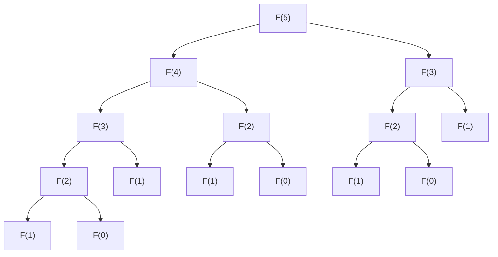

# 1. はじめに

プログラミングやアルゴリズムの学習を進めていくと、多くの学習者が直面する大きな壁があります。それが **動的計画法** （Dynamic Programming、略して **DP** ）です。名前だけを聞くと、「何だか難しそう」「数学の専門知識が必要なのでは？」と身構えてしまうかもしれません。しかし、本質を理解すれば、DPは非常に強力で、かつ直感的な問題解決手法であることがわかります。

本記事では、DPの基本概念から出発し、代表的な問題である「フィボナッチ数列」と「ナップサック問題」を例に、その考え方と実装方法を徹底的に解説します。Pythonのコードを交えながら、段階的に理解を深めていきましょう。


# 2. 動的計画法（DP）とは何か？

動的計画法（Dynamic Programming）は、複雑な問題を複数の小さな部分問題に分割し、それぞれの部分問題の解を記録（メモ）しながら解き進める手法です。これにより、同じ計算を繰り返す無駄を省き、計算時間を劇的に短縮することができます。

DPの核心は以下の2つの特徴にあります。

1.  **部分構造最適性** （Optimal Substructure）：大きな問題の最適解が、その小さな部分問題の最適解から構成できるという性質。
2.  **部分問題の重複** （Overlapping Subproblems）：同じ小さな問題が何度も繰り返し現れるという性質。

これらの特徴を持つ問題に対して、DPは絶大な威力を発揮します。

## DPの2つのアプローチ

DPには、大きく分けて2つの実装アプローチがあります。

### 1. メモ化再帰（トップダウン方式）
大きな問題から出発し、再帰的に小さな問題を呼び出します。その際、一度計算した結果を配列やハッシュマップに保存（メモ）しておき、同じ問題が再度現れたときは、再計算せずにメモした値を返します。

### 2. ボトムアップ方式（分割統治とテーブル埋め）
最も小さな問題から順に解を計算し、配列（DPテーブル）に記録していきます。小さな問題の解を使って徐々に大きな問題を解き、最終的に求めたい問題の解を得ます。


# 3. 基礎編：フィボナッチ数列で学ぶDP

DPの概念を理解するための最初の一歩として、フィボナッチ数列を取り上げます。

フィボナッチ数列は、次のように定義される数列です。
$$ F(0) = 0 $$
$$ F(1) = 1 $$
$$ F(n) = F(n-1) + F(n-2) \quad \text{for } n \ge 2 $$

## 3.1 単純な再帰呼び出しの罠

定義通りにPythonで関数を書いてみましょう。

```python
def fib_recursive(n):
    if n <= 0:
        return 0
    elif n == 1:
        return 1
    return fib_recursive(n-1) + fib_recursive(n-2)
```

この実装は直感的ですが、大きな問題があります。それは **計算量が指数関数的に増大する** ということです。$F(5)$ を計算する際の関数の呼び出しツリーを見てみましょう。



ご覧の通り、$F(3)$ や $F(2)$ が何度も重複して計算されています。計算量は $O(2^n)$ となり、$n$ が大きくなると実用的な時間で計算が終わらなくなります。

## 3.2 メモ化再帰（トップダウン方式）

この無駄を省くのが **メモ化** です。一度計算した結果を保存しておきましょう。

```python
def fib_memo(n, memo=None):
    if memo is None:
        memo = {}
    if n in memo:
        return memo[n]
    if n <= 0:
        return 0
    elif n == 1:
        return 1
    
    memo[n] = fib_memo(n-1, memo) + fib_memo(n-2, memo)
    return memo[n]
```

これにより、各 $F(i)$ は一度しか計算されなくなり、計算量は $O(n)$ に激減します。

## 3.3 ボトムアップ方式（DPテーブル）

再帰呼び出しのオーバーヘッドを避けるため、下から順に計算していくのがボトムアップ方式です。

```python
def fib_dp(n):
    if n <= 0:
        return 0
    elif n == 1:
        return 1
        
    dp = [0] * (n + 1)
    dp[0] = 0
    dp[1] = 1
    
    for i in range(2, n + 1):
        dp[i] = dp[i-1] + dp[i-2]
        
    return dp[n]
```

配列 `dp` を用意し、インデックスが小さい方から順番に埋めていきます。これが典型的なDPテーブルの使い方です。


# 4. 応用編：ナップサック問題

DPの真骨頂は、最適化問題を解くときに発揮されます。ここでは有名な「0-1ナップサック問題」を考えましょう。

## 4.1 問題設定

あなたは泥棒です（という設定です）。容量が $W$ のナップサックを持っています。目の前には $N$ 個の品物があり、それぞれの品物 $i$ には重さ $w_i$ と価値 $v_i$ が設定されています。

ナップサックの容量を超えない範囲で品物を選び、持ち帰る品物の **価値の合計を最大化** してください。ただし、各品物は1つしかなく、「選ぶ（1）」か「選ばない（0）」かのどちらかです。

## 4.2 状態の定義と漸化式

DPで問題を解く際、最も重要なのが **状態の定義** と **漸化式（状態遷移方程式）** の導出です。

状態を次のように定義します。
$dp[i][w]$ ：最初の $i$ 個の品物の中から、重さの合計が $w$ 以下になるように選んだときの価値の最大値。

ここで、$i$ 番目の品物（重さ $w_i$、価値 $v_i$）を考えるとき、次の2つの選択肢があります。

1.  **選ばない場合**：
    価値の最大値は、前の状態 $dp[i-1][w]$ と同じです。
2.  **選ぶ場合**（ただし $w \ge w_i$ の場合のみ可能）：
    容量から $w_i$ を引いた状態に、品物 $i$ の価値 $v_i$ を足します。すなわち、$dp[i-1][w - w_i] + v_i$ となります。

したがって、漸化式は次のようになります。

$$
dp[i][w] = 
\begin{cases}
\max(dp[i-1][w], dp[i-1][w - w_i] + v_i) & \text{if } w \ge w_i \\
dp[i-1][w] & \text{otherwise}
\end{cases}
$$

## 4.3 Python実装

この漸化式をそのままプログラムに落とし込みます。

```python
def knapsack(weights, values, W):
    N = len(weights)
    # DPテーブルの初期化: (N+1) x (W+1) の2次元配列
    dp = [[0] * (W + 1) for _ in range(N + 1)]
    
    # DPテーブルを埋める
    for i in range(1, N + 1):
        for w in range(W + 1):
            if w >= weights[i-1]:
                # 選ぶ場合と選ばない場合の最大値を取る
                dp[i][w] = max(dp[i-1][w], dp[i-1][w - weights[i-1]] + values[i-1])
            else:
                # 容量オーバーで選べない場合
                dp[i][w] = dp[i-1][w]
                
    return dp[N][W]
```

### DPテーブルの推移

ある例での `dp` テーブルの推移を追ってみましょう。

| $i$ \ $w$ | 0 | 1 | 2 | 3 | 4 | 5 |
|---|---|---|---|---|---|---|
| 0 | 0 | 0 | 0 | 0 | 0 | 0 |
| 1 | 0 | 0 | 3 | 3 | 3 | 3 |
| 2 | 0 | 2 | 3 | 5 | 5 | 5 |
| 3 | 0 | 2 | 3 | 5 | 6 | 7 |
| 4 | 0 | 2 | 3 | 5 | 6 | 7 |

このように、小さな容量・少ない品数の部分問題から順に最適解を求めていくことで、最終的に答えが求まります。


# 5. より深くDPを理解するための詳細解説とアルゴリズムの探求

DPへの理解を確固たるものにするためには、より多くの例題に触れ、様々なパターンの状態遷移を学ぶことが不可欠です。

## 5.1 編集距離（レーベンシュタイン距離）

二つの文字列 $S$ と $T$ が与えられたとき、$S$ に「挿入」「削除」「置換」の操作を最小何回行えば $T$ に変換できるかを求める問題です。

### 漸化式

$$
dp[i][j] = 
\begin{cases}
dp[i-1][j-1] & \text{if } S[i-1] == T[j-1] \\
\min(dp[i][j-1], dp[i-1][j], dp[i-1][j-1]) + 1 & \text{otherwise}
\end{cases}
$$

## 5.2 [空間計算量](https://kenji.blog/p/time-space-complexity-big-o-notation-examples/)の最適化技術（インプレース更新）

これまでの実装では、状態遷移の計算に $O(NW)$ や $O(MN)$ のメモリを使用してきました。しかし、漸化式をよく観察すると、ある状態の更新には「一つ前の行」しか必要ないことが多いです。

例えば、ナップサック問題の漸化式を利用して、2次元配列を1次元配列に削減することができます。更新の際、右から左に向かって更新することで、現在の $i$ の計算中に $i-1$ の値を上書きしてしまうバグを防ぐことができます。

```python
def knapsack_optimized(weights, values, W):
    N = len(weights)
    dp = [0] * (W + 1)
    
    for i in range(N):
        # 逆順に更新することで、1次元配列で済む
        for w in range(W, weights[i] - 1, -1):
            dp[w] = max(dp[w], dp[w - weights[i]] + values[i])
            
    return dp[W]
```


### 発展解説パート 1：DPの限界とアルゴリズム選択

動的計画法の強みは部分構造の重複を避けることですが、それでもすべての問題が高速に解けるわけではありません。例えば、ナップサック問題の計算量は $O(NW)$ であり、これは一見多項式時間に見えます。しかし、$W$ は入力の「値」であり、入力サイズ（ビット数）に対しては指数的な大きさになり得ます。このような計算量を **擬似多項式時間** と呼びます。

もし $W$ が非常に大きい場合、配列の確保だけでメモリが枯渇し、ループ回数も膨大になるため、このDP手法は適用できなくなります。その場合は、価値の総和の上限 $V$ に対するDPに切り替えるか、半分全列挙（Meet in the Middle）などの別のアプローチが必要になります。

また、DPのデバッグにおいては、 **小規模な入力で手計算したテーブルと、プログラムが出力するテーブルを比較する** ことが最も効果的です。紙とペンを用意し、2次元の表を実際に書いてみることで、「なぜこの漸化式になるのか」「どこで遷移を間違えているのか」が手に取るようにわかります。

### 発展解説パート 2：DPの限界とアルゴリズム選択

動的計画法の強みは部分構造の重複を避けることですが、それでもすべての問題が高速に解けるわけではありません。例えば、ナップサック問題の計算量は $O(NW)$ であり、これは一見多項式時間に見えます。しかし、$W$ は入力の「値」であり、入力サイズ（ビット数）に対しては指数的な大きさになり得ます。このような計算量を **擬似多項式時間** と呼びます。

もし $W$ が非常に大きい場合、配列の確保だけでメモリが枯渇し、ループ回数も膨大になるため、このDP手法は適用できなくなります。その場合は、価値の総和の上限 $V$ に対するDPに切り替えるか、半分全列挙（Meet in the Middle）などの別のアプローチが必要になります。

また、DPのデバッグにおいては、 **小規模な入力で手計算したテーブルと、プログラムが出力するテーブルを比較する** ことが最も効果的です。紙とペンを用意し、2次元の表を実際に書いてみることで、「なぜこの漸化式になるのか」「どこで遷移を間違えているのか」が手に取るようにわかります。

### 発展解説パート 3：DPの限界とアルゴリズム選択

動的計画法の強みは部分構造の重複を避けることですが、それでもすべての問題が高速に解けるわけではありません。例えば、ナップサック問題の計算量は $O(NW)$ であり、これは一見多項式時間に見えます。しかし、$W$ は入力の「値」であり、入力サイズ（ビット数）に対しては指数的な大きさになり得ます。このような計算量を **擬似多項式時間** と呼びます。

もし $W$ が非常に大きい場合、配列の確保だけでメモリが枯渇し、ループ回数も膨大になるため、このDP手法は適用できなくなります。その場合は、価値の総和の上限 $V$ に対するDPに切り替えるか、半分全列挙（Meet in the Middle）などの別のアプローチが必要になります。

また、DPのデバッグにおいては、 **小規模な入力で手計算したテーブルと、プログラムが出力するテーブルを比較する** ことが最も効果的です。紙とペンを用意し、2次元の表を実際に書いてみることで、「なぜこの漸化式になるのか」「どこで遷移を間違えているのか」が手に取るようにわかります。

### 発展解説パート 4：DPの限界とアルゴリズム選択

動的計画法の強みは部分構造の重複を避けることですが、それでもすべての問題が高速に解けるわけではありません。例えば、ナップサック問題の計算量は $O(NW)$ であり、これは一見多項式時間に見えます。しかし、$W$ は入力の「値」であり、入力サイズ（ビット数）に対しては指数的な大きさになり得ます。このような計算量を **擬似多項式時間** と呼びます。

もし $W$ が非常に大きい場合、配列の確保だけでメモリが枯渇し、ループ回数も膨大になるため、このDP手法は適用できなくなります。その場合は、価値の総和の上限 $V$ に対するDPに切り替えるか、半分全列挙（Meet in the Middle）などの別のアプローチが必要になります。

また、DPのデバッグにおいては、 **小規模な入力で手計算したテーブルと、プログラムが出力するテーブルを比較する** ことが最も効果的です。紙とペンを用意し、2次元の表を実際に書いてみることで、「なぜこの漸化式になるのか」「どこで遷移を間違えているのか」が手に取るようにわかります。

### 発展解説パート 5：DPの限界とアルゴリズム選択

動的計画法の強みは部分構造の重複を避けることですが、それでもすべての問題が高速に解けるわけではありません。例えば、ナップサック問題の計算量は $O(NW)$ であり、これは一見多項式時間に見えます。しかし、$W$ は入力の「値」であり、入力サイズ（ビット数）に対しては指数的な大きさになり得ます。このような計算量を **擬似多項式時間** と呼びます。

もし $W$ が非常に大きい場合、配列の確保だけでメモリが枯渇し、ループ回数も膨大になるため、このDP手法は適用できなくなります。その場合は、価値の総和の上限 $V$ に対するDPに切り替えるか、半分全列挙（Meet in the Middle）などの別のアプローチが必要になります。

また、DPのデバッグにおいては、 **小規模な入力で手計算したテーブルと、プログラムが出力するテーブルを比較する** ことが最も効果的です。紙とペンを用意し、2次元の表を実際に書いてみることで、「なぜこの漸化式になるのか」「どこで遷移を間違えているのか」が手に取るようにわかります。

### 発展解説パート 6：DPの限界とアルゴリズム選択

動的計画法の強みは部分構造の重複を避けることですが、それでもすべての問題が高速に解けるわけではありません。例えば、ナップサック問題の計算量は $O(NW)$ であり、これは一見多項式時間に見えます。しかし、$W$ は入力の「値」であり、入力サイズ（ビット数）に対しては指数的な大きさになり得ます。このような計算量を **擬似多項式時間** と呼びます。

もし $W$ が非常に大きい場合、配列の確保だけでメモリが枯渇し、ループ回数も膨大になるため、このDP手法は適用できなくなります。その場合は、価値の総和の上限 $V$ に対するDPに切り替えるか、半分全列挙（Meet in the Middle）などの別のアプローチが必要になります。

また、DPのデバッグにおいては、 **小規模な入力で手計算したテーブルと、プログラムが出力するテーブルを比較する** ことが最も効果的です。紙とペンを用意し、2次元の表を実際に書いてみることで、「なぜこの漸化式になるのか」「どこで遷移を間違えているのか」が手に取るようにわかります。

### 発展解説パート 7：DPの限界とアルゴリズム選択

動的計画法の強みは部分構造の重複を避けることですが、それでもすべての問題が高速に解けるわけではありません。例えば、ナップサック問題の計算量は $O(NW)$ であり、これは一見多項式時間に見えます。しかし、$W$ は入力の「値」であり、入力サイズ（ビット数）に対しては指数的な大きさになり得ます。このような計算量を **擬似多項式時間** と呼びます。

もし $W$ が非常に大きい場合、配列の確保だけでメモリが枯渇し、ループ回数も膨大になるため、このDP手法は適用できなくなります。その場合は、価値の総和の上限 $V$ に対するDPに切り替えるか、半分全列挙（Meet in the Middle）などの別のアプローチが必要になります。

また、DPのデバッグにおいては、 **小規模な入力で手計算したテーブルと、プログラムが出力するテーブルを比較する** ことが最も効果的です。紙とペンを用意し、2次元の表を実際に書いてみることで、「なぜこの漸化式になるのか」「どこで遷移を間違えているのか」が手に取るようにわかります。

### 発展解説パート 8：DPの限界とアルゴリズム選択

動的計画法の強みは部分構造の重複を避けることですが、それでもすべての問題が高速に解けるわけではありません。例えば、ナップサック問題の計算量は $O(NW)$ であり、これは一見多項式時間に見えます。しかし、$W$ は入力の「値」であり、入力サイズ（ビット数）に対しては指数的な大きさになり得ます。このような計算量を **擬似多項式時間** と呼びます。

もし $W$ が非常に大きい場合、配列の確保だけでメモリが枯渇し、ループ回数も膨大になるため、このDP手法は適用できなくなります。その場合は、価値の総和の上限 $V$ に対するDPに切り替えるか、半分全列挙（Meet in the Middle）などの別のアプローチが必要になります。

また、DPのデバッグにおいては、 **小規模な入力で手計算したテーブルと、プログラムが出力するテーブルを比較する** ことが最も効果的です。紙とペンを用意し、2次元の表を実際に書いてみることで、「なぜこの漸化式になるのか」「どこで遷移を間違えているのか」が手に取るようにわかります。

### 発展解説パート 9：DPの限界とアルゴリズム選択

動的計画法の強みは部分構造の重複を避けることですが、それでもすべての問題が高速に解けるわけではありません。例えば、ナップサック問題の計算量は $O(NW)$ であり、これは一見多項式時間に見えます。しかし、$W$ は入力の「値」であり、入力サイズ（ビット数）に対しては指数的な大きさになり得ます。このような計算量を **擬似多項式時間** と呼びます。

もし $W$ が非常に大きい場合、配列の確保だけでメモリが枯渇し、ループ回数も膨大になるため、このDP手法は適用できなくなります。その場合は、価値の総和の上限 $V$ に対するDPに切り替えるか、半分全列挙（Meet in the Middle）などの別のアプローチが必要になります。

また、DPのデバッグにおいては、 **小規模な入力で手計算したテーブルと、プログラムが出力するテーブルを比較する** ことが最も効果的です。紙とペンを用意し、2次元の表を実際に書いてみることで、「なぜこの漸化式になるのか」「どこで遷移を間違えているのか」が手に取るようにわかります。

### 発展解説パート 10：DPの限界とアルゴリズム選択

動的計画法の強みは部分構造の重複を避けることですが、それでもすべての問題が高速に解けるわけではありません。例えば、ナップサック問題の計算量は $O(NW)$ であり、これは一見多項式時間に見えます。しかし、$W$ は入力の「値」であり、入力サイズ（ビット数）に対しては指数的な大きさになり得ます。このような計算量を **擬似多項式時間** と呼びます。

もし $W$ が非常に大きい場合、配列の確保だけでメモリが枯渇し、ループ回数も膨大になるため、このDP手法は適用できなくなります。その場合は、価値の総和の上限 $V$ に対するDPに切り替えるか、半分全列挙（Meet in the Middle）などの別のアプローチが必要になります。

また、DPのデバッグにおいては、 **小規模な入力で手計算したテーブルと、プログラムが出力するテーブルを比較する** ことが最も効果的です。紙とペンを用意し、2次元の表を実際に書いてみることで、「なぜこの漸化式になるのか」「どこで遷移を間違えているのか」が手に取るようにわかります。

### 発展解説パート 11：DPの限界とアルゴリズム選択

動的計画法の強みは部分構造の重複を避けることですが、それでもすべての問題が高速に解けるわけではありません。例えば、ナップサック問題の計算量は $O(NW)$ であり、これは一見多項式時間に見えます。しかし、$W$ は入力の「値」であり、入力サイズ（ビット数）に対しては指数的な大きさになり得ます。このような計算量を **擬似多項式時間** と呼びます。

もし $W$ が非常に大きい場合、配列の確保だけでメモリが枯渇し、ループ回数も膨大になるため、このDP手法は適用できなくなります。その場合は、価値の総和の上限 $V$ に対するDPに切り替えるか、半分全列挙（Meet in the Middle）などの別のアプローチが必要になります。

また、DPのデバッグにおいては、 **小規模な入力で手計算したテーブルと、プログラムが出力するテーブルを比較する** ことが最も効果的です。紙とペンを用意し、2次元の表を実際に書いてみることで、「なぜこの漸化式になるのか」「どこで遷移を間違えているのか」が手に取るようにわかります。

### 発展解説パート 12：DPの限界とアルゴリズム選択

動的計画法の強みは部分構造の重複を避けることですが、それでもすべての問題が高速に解けるわけではありません。例えば、ナップサック問題の計算量は $O(NW)$ であり、これは一見多項式時間に見えます。しかし、$W$ は入力の「値」であり、入力サイズ（ビット数）に対しては指数的な大きさになり得ます。このような計算量を **擬似多項式時間** と呼びます。

もし $W$ が非常に大きい場合、配列の確保だけでメモリが枯渇し、ループ回数も膨大になるため、このDP手法は適用できなくなります。その場合は、価値の総和の上限 $V$ に対するDPに切り替えるか、半分全列挙（Meet in the Middle）などの別のアプローチが必要になります。

また、DPのデバッグにおいては、 **小規模な入力で手計算したテーブルと、プログラムが出力するテーブルを比較する** ことが最も効果的です。紙とペンを用意し、2次元の表を実際に書いてみることで、「なぜこの漸化式になるのか」「どこで遷移を間違えているのか」が手に取るようにわかります。

### 発展解説パート 13：DPの限界とアルゴリズム選択

動的計画法の強みは部分構造の重複を避けることですが、それでもすべての問題が高速に解けるわけではありません。例えば、ナップサック問題の計算量は $O(NW)$ であり、これは一見多項式時間に見えます。しかし、$W$ は入力の「値」であり、入力サイズ（ビット数）に対しては指数的な大きさになり得ます。このような計算量を **擬似多項式時間** と呼びます。

もし $W$ が非常に大きい場合、配列の確保だけでメモリが枯渇し、ループ回数も膨大になるため、このDP手法は適用できなくなります。その場合は、価値の総和の上限 $V$ に対するDPに切り替えるか、半分全列挙（Meet in the Middle）などの別のアプローチが必要になります。

また、DPのデバッグにおいては、 **小規模な入力で手計算したテーブルと、プログラムが出力するテーブルを比較する** ことが最も効果的です。紙とペンを用意し、2次元の表を実際に書いてみることで、「なぜこの漸化式になるのか」「どこで遷移を間違えているのか」が手に取るようにわかります。

### 発展解説パート 14：DPの限界とアルゴリズム選択

動的計画法の強みは部分構造の重複を避けることですが、それでもすべての問題が高速に解けるわけではありません。例えば、ナップサック問題の計算量は $O(NW)$ であり、これは一見多項式時間に見えます。しかし、$W$ は入力の「値」であり、入力サイズ（ビット数）に対しては指数的な大きさになり得ます。このような計算量を **擬似多項式時間** と呼びます。

もし $W$ が非常に大きい場合、配列の確保だけでメモリが枯渇し、ループ回数も膨大になるため、このDP手法は適用できなくなります。その場合は、価値の総和の上限 $V$ に対するDPに切り替えるか、半分全列挙（Meet in the Middle）などの別のアプローチが必要になります。

また、DPのデバッグにおいては、 **小規模な入力で手計算したテーブルと、プログラムが出力するテーブルを比較する** ことが最も効果的です。紙とペンを用意し、2次元の表を実際に書いてみることで、「なぜこの漸化式になるのか」「どこで遷移を間違えているのか」が手に取るようにわかります。

### 発展解説パート 15：DPの限界とアルゴリズム選択

動的計画法の強みは部分構造の重複を避けることですが、それでもすべての問題が高速に解けるわけではありません。例えば、ナップサック問題の計算量は $O(NW)$ であり、これは一見多項式時間に見えます。しかし、$W$ は入力の「値」であり、入力サイズ（ビット数）に対しては指数的な大きさになり得ます。このような計算量を **擬似多項式時間** と呼びます。

もし $W$ が非常に大きい場合、配列の確保だけでメモリが枯渇し、ループ回数も膨大になるため、このDP手法は適用できなくなります。その場合は、価値の総和の上限 $V$ に対するDPに切り替えるか、半分全列挙（Meet in the Middle）などの別のアプローチが必要になります。

また、DPのデバッグにおいては、 **小規模な入力で手計算したテーブルと、プログラムが出力するテーブルを比較する** ことが最も効果的です。紙とペンを用意し、2次元の表を実際に書いてみることで、「なぜこの漸化式になるのか」「どこで遷移を間違えているのか」が手に取るようにわかります。

### 発展解説パート 16：DPの限界とアルゴリズム選択

動的計画法の強みは部分構造の重複を避けることですが、それでもすべての問題が高速に解けるわけではありません。例えば、ナップサック問題の計算量は $O(NW)$ であり、これは一見多項式時間に見えます。しかし、$W$ は入力の「値」であり、入力サイズ（ビット数）に対しては指数的な大きさになり得ます。このような計算量を **擬似多項式時間** と呼びます。

もし $W$ が非常に大きい場合、配列の確保だけでメモリが枯渇し、ループ回数も膨大になるため、このDP手法は適用できなくなります。その場合は、価値の総和の上限 $V$ に対するDPに切り替えるか、半分全列挙（Meet in the Middle）などの別のアプローチが必要になります。

また、DPのデバッグにおいては、 **小規模な入力で手計算したテーブルと、プログラムが出力するテーブルを比較する** ことが最も効果的です。紙とペンを用意し、2次元の表を実際に書いてみることで、「なぜこの漸化式になるのか」「どこで遷移を間違えているのか」が手に取るようにわかります。

### 発展解説パート 17：DPの限界とアルゴリズム選択

動的計画法の強みは部分構造の重複を避けることですが、それでもすべての問題が高速に解けるわけではありません。例えば、ナップサック問題の計算量は $O(NW)$ であり、これは一見多項式時間に見えます。しかし、$W$ は入力の「値」であり、入力サイズ（ビット数）に対しては指数的な大きさになり得ます。このような計算量を **擬似多項式時間** と呼びます。

もし $W$ が非常に大きい場合、配列の確保だけでメモリが枯渇し、ループ回数も膨大になるため、このDP手法は適用できなくなります。その場合は、価値の総和の上限 $V$ に対するDPに切り替えるか、半分全列挙（Meet in the Middle）などの別のアプローチが必要になります。

また、DPのデバッグにおいては、 **小規模な入力で手計算したテーブルと、プログラムが出力するテーブルを比較する** ことが最も効果的です。紙とペンを用意し、2次元の表を実際に書いてみることで、「なぜこの漸化式になるのか」「どこで遷移を間違えているのか」が手に取るようにわかります。

### 発展解説パート 18：DPの限界とアルゴリズム選択

動的計画法の強みは部分構造の重複を避けることですが、それでもすべての問題が高速に解けるわけではありません。例えば、ナップサック問題の計算量は $O(NW)$ であり、これは一見多項式時間に見えます。しかし、$W$ は入力の「値」であり、入力サイズ（ビット数）に対しては指数的な大きさになり得ます。このような計算量を **擬似多項式時間** と呼びます。

もし $W$ が非常に大きい場合、配列の確保だけでメモリが枯渇し、ループ回数も膨大になるため、このDP手法は適用できなくなります。その場合は、価値の総和の上限 $V$ に対するDPに切り替えるか、半分全列挙（Meet in the Middle）などの別のアプローチが必要になります。

また、DPのデバッグにおいては、 **小規模な入力で手計算したテーブルと、プログラムが出力するテーブルを比較する** ことが最も効果的です。紙とペンを用意し、2次元の表を実際に書いてみることで、「なぜこの漸化式になるのか」「どこで遷移を間違えているのか」が手に取るようにわかります。

### 発展解説パート 19：DPの限界とアルゴリズム選択

動的計画法の強みは部分構造の重複を避けることですが、それでもすべての問題が高速に解けるわけではありません。例えば、ナップサック問題の計算量は $O(NW)$ であり、これは一見多項式時間に見えます。しかし、$W$ は入力の「値」であり、入力サイズ（ビット数）に対しては指数的な大きさになり得ます。このような計算量を **擬似多項式時間** と呼びます。

もし $W$ が非常に大きい場合、配列の確保だけでメモリが枯渇し、ループ回数も膨大になるため、このDP手法は適用できなくなります。その場合は、価値の総和の上限 $V$ に対するDPに切り替えるか、半分全列挙（Meet in the Middle）などの別のアプローチが必要になります。

また、DPのデバッグにおいては、 **小規模な入力で手計算したテーブルと、プログラムが出力するテーブルを比較する** ことが最も効果的です。紙とペンを用意し、2次元の表を実際に書いてみることで、「なぜこの漸化式になるのか」「どこで遷移を間違えているのか」が手に取るようにわかります。

### 発展解説パート 20：DPの限界とアルゴリズム選択

動的計画法の強みは部分構造の重複を避けることですが、それでもすべての問題が高速に解けるわけではありません。例えば、ナップサック問題の計算量は $O(NW)$ であり、これは一見多項式時間に見えます。しかし、$W$ は入力の「値」であり、入力サイズ（ビット数）に対しては指数的な大きさになり得ます。このような計算量を **擬似多項式時間** と呼びます。

もし $W$ が非常に大きい場合、配列の確保だけでメモリが枯渇し、ループ回数も膨大になるため、このDP手法は適用できなくなります。その場合は、価値の総和の上限 $V$ に対するDPに切り替えるか、半分全列挙（Meet in the Middle）などの別のアプローチが必要になります。

また、DPのデバッグにおいては、 **小規模な入力で手計算したテーブルと、プログラムが出力するテーブルを比較する** ことが最も効果的です。紙とペンを用意し、2次元の表を実際に書いてみることで、「なぜこの漸化式になるのか」「どこで遷移を間違えているのか」が手に取るようにわかります。

### 発展解説パート 21：DPの限界とアルゴリズム選択

動的計画法の強みは部分構造の重複を避けることですが、それでもすべての問題が高速に解けるわけではありません。例えば、ナップサック問題の計算量は $O(NW)$ であり、これは一見多項式時間に見えます。しかし、$W$ は入力の「値」であり、入力サイズ（ビット数）に対しては指数的な大きさになり得ます。このような計算量を **擬似多項式時間** と呼びます。

もし $W$ が非常に大きい場合、配列の確保だけでメモリが枯渇し、ループ回数も膨大になるため、このDP手法は適用できなくなります。その場合は、価値の総和の上限 $V$ に対するDPに切り替えるか、半分全列挙（Meet in the Middle）などの別のアプローチが必要になります。

また、DPのデバッグにおいては、 **小規模な入力で手計算したテーブルと、プログラムが出力するテーブルを比較する** ことが最も効果的です。紙とペンを用意し、2次元の表を実際に書いてみることで、「なぜこの漸化式になるのか」「どこで遷移を間違えているのか」が手に取るようにわかります。

### 発展解説パート 22：DPの限界とアルゴリズム選択

動的計画法の強みは部分構造の重複を避けることですが、それでもすべての問題が高速に解けるわけではありません。例えば、ナップサック問題の計算量は $O(NW)$ であり、これは一見多項式時間に見えます。しかし、$W$ は入力の「値」であり、入力サイズ（ビット数）に対しては指数的な大きさになり得ます。このような計算量を **擬似多項式時間** と呼びます。

もし $W$ が非常に大きい場合、配列の確保だけでメモリが枯渇し、ループ回数も膨大になるため、このDP手法は適用できなくなります。その場合は、価値の総和の上限 $V$ に対するDPに切り替えるか、半分全列挙（Meet in the Middle）などの別のアプローチが必要になります。

また、DPのデバッグにおいては、 **小規模な入力で手計算したテーブルと、プログラムが出力するテーブルを比較する** ことが最も効果的です。紙とペンを用意し、2次元の表を実際に書いてみることで、「なぜこの漸化式になるのか」「どこで遷移を間違えているのか」が手に取るようにわかります。

### 発展解説パート 23：DPの限界とアルゴリズム選択

動的計画法の強みは部分構造の重複を避けることですが、それでもすべての問題が高速に解けるわけではありません。例えば、ナップサック問題の計算量は $O(NW)$ であり、これは一見多項式時間に見えます。しかし、$W$ は入力の「値」であり、入力サイズ（ビット数）に対しては指数的な大きさになり得ます。このような計算量を **擬似多項式時間** と呼びます。

もし $W$ が非常に大きい場合、配列の確保だけでメモリが枯渇し、ループ回数も膨大になるため、このDP手法は適用できなくなります。その場合は、価値の総和の上限 $V$ に対するDPに切り替えるか、半分全列挙（Meet in the Middle）などの別のアプローチが必要になります。

また、DPのデバッグにおいては、 **小規模な入力で手計算したテーブルと、プログラムが出力するテーブルを比較する** ことが最も効果的です。紙とペンを用意し、2次元の表を実際に書いてみることで、「なぜこの漸化式になるのか」「どこで遷移を間違えているのか」が手に取るようにわかります。

### 発展解説パート 24：DPの限界とアルゴリズム選択

動的計画法の強みは部分構造の重複を避けることですが、それでもすべての問題が高速に解けるわけではありません。例えば、ナップサック問題の計算量は $O(NW)$ であり、これは一見多項式時間に見えます。しかし、$W$ は入力の「値」であり、入力サイズ（ビット数）に対しては指数的な大きさになり得ます。このような計算量を **擬似多項式時間** と呼びます。

もし $W$ が非常に大きい場合、配列の確保だけでメモリが枯渇し、ループ回数も膨大になるため、このDP手法は適用できなくなります。その場合は、価値の総和の上限 $V$ に対するDPに切り替えるか、半分全列挙（Meet in the Middle）などの別のアプローチが必要になります。

また、DPのデバッグにおいては、 **小規模な入力で手計算したテーブルと、プログラムが出力するテーブルを比較する** ことが最も効果的です。紙とペンを用意し、2次元の表を実際に書いてみることで、「なぜこの漸化式になるのか」「どこで遷移を間違えているのか」が手に取るようにわかります。

### 発展解説パート 25：DPの限界とアルゴリズム選択

動的計画法の強みは部分構造の重複を避けることですが、それでもすべての問題が高速に解けるわけではありません。例えば、ナップサック問題の計算量は $O(NW)$ であり、これは一見多項式時間に見えます。しかし、$W$ は入力の「値」であり、入力サイズ（ビット数）に対しては指数的な大きさになり得ます。このような計算量を **擬似多項式時間** と呼びます。

もし $W$ が非常に大きい場合、配列の確保だけでメモリが枯渇し、ループ回数も膨大になるため、このDP手法は適用できなくなります。その場合は、価値の総和の上限 $V$ に対するDPに切り替えるか、半分全列挙（Meet in the Middle）などの別のアプローチが必要になります。

また、DPのデバッグにおいては、 **小規模な入力で手計算したテーブルと、プログラムが出力するテーブルを比較する** ことが最も効果的です。紙とペンを用意し、2次元の表を実際に書いてみることで、「なぜこの漸化式になるのか」「どこで遷移を間違えているのか」が手に取るようにわかります。

### 発展解説パート 26：DPの限界とアルゴリズム選択

動的計画法の強みは部分構造の重複を避けることですが、それでもすべての問題が高速に解けるわけではありません。例えば、ナップサック問題の計算量は $O(NW)$ であり、これは一見多項式時間に見えます。しかし、$W$ は入力の「値」であり、入力サイズ（ビット数）に対しては指数的な大きさになり得ます。このような計算量を **擬似多項式時間** と呼びます。

もし $W$ が非常に大きい場合、配列の確保だけでメモリが枯渇し、ループ回数も膨大になるため、このDP手法は適用できなくなります。その場合は、価値の総和の上限 $V$ に対するDPに切り替えるか、半分全列挙（Meet in the Middle）などの別のアプローチが必要になります。

また、DPのデバッグにおいては、 **小規模な入力で手計算したテーブルと、プログラムが出力するテーブルを比較する** ことが最も効果的です。紙とペンを用意し、2次元の表を実際に書いてみることで、「なぜこの漸化式になるのか」「どこで遷移を間違えているのか」が手に取るようにわかります。

### 発展解説パート 27：DPの限界とアルゴリズム選択

動的計画法の強みは部分構造の重複を避けることですが、それでもすべての問題が高速に解けるわけではありません。例えば、ナップサック問題の計算量は $O(NW)$ であり、これは一見多項式時間に見えます。しかし、$W$ は入力の「値」であり、入力サイズ（ビット数）に対しては指数的な大きさになり得ます。このような計算量を **擬似多項式時間** と呼びます。

もし $W$ が非常に大きい場合、配列の確保だけでメモリが枯渇し、ループ回数も膨大になるため、このDP手法は適用できなくなります。その場合は、価値の総和の上限 $V$ に対するDPに切り替えるか、半分全列挙（Meet in the Middle）などの別のアプローチが必要になります。

また、DPのデバッグにおいては、 **小規模な入力で手計算したテーブルと、プログラムが出力するテーブルを比較する** ことが最も効果的です。紙とペンを用意し、2次元の表を実際に書いてみることで、「なぜこの漸化式になるのか」「どこで遷移を間違えているのか」が手に取るようにわかります。

### 発展解説パート 28：DPの限界とアルゴリズム選択

動的計画法の強みは部分構造の重複を避けることですが、それでもすべての問題が高速に解けるわけではありません。例えば、ナップサック問題の計算量は $O(NW)$ であり、これは一見多項式時間に見えます。しかし、$W$ は入力の「値」であり、入力サイズ（ビット数）に対しては指数的な大きさになり得ます。このような計算量を **擬似多項式時間** と呼びます。

もし $W$ が非常に大きい場合、配列の確保だけでメモリが枯渇し、ループ回数も膨大になるため、このDP手法は適用できなくなります。その場合は、価値の総和の上限 $V$ に対するDPに切り替えるか、半分全列挙（Meet in the Middle）などの別のアプローチが必要になります。

また、DPのデバッグにおいては、 **小規模な入力で手計算したテーブルと、プログラムが出力するテーブルを比較する** ことが最も効果的です。紙とペンを用意し、2次元の表を実際に書いてみることで、「なぜこの漸化式になるのか」「どこで遷移を間違えているのか」が手に取るようにわかります。

### 発展解説パート 29：DPの限界とアルゴリズム選択

動的計画法の強みは部分構造の重複を避けることですが、それでもすべての問題が高速に解けるわけではありません。例えば、ナップサック問題の計算量は $O(NW)$ であり、これは一見多項式時間に見えます。しかし、$W$ は入力の「値」であり、入力サイズ（ビット数）に対しては指数的な大きさになり得ます。このような計算量を **擬似多項式時間** と呼びます。

もし $W$ が非常に大きい場合、配列の確保だけでメモリが枯渇し、ループ回数も膨大になるため、このDP手法は適用できなくなります。その場合は、価値の総和の上限 $V$ に対するDPに切り替えるか、半分全列挙（Meet in the Middle）などの別のアプローチが必要になります。

また、DPのデバッグにおいては、 **小規模な入力で手計算したテーブルと、プログラムが出力するテーブルを比較する** ことが最も効果的です。紙とペンを用意し、2次元の表を実際に書いてみることで、「なぜこの漸化式になるのか」「どこで遷移を間違えているのか」が手に取るようにわかります。

### 発展解説パート 30：DPの限界とアルゴリズム選択

動的計画法の強みは部分構造の重複を避けることですが、それでもすべての問題が高速に解けるわけではありません。例えば、ナップサック問題の計算量は $O(NW)$ であり、これは一見多項式時間に見えます。しかし、$W$ は入力の「値」であり、入力サイズ（ビット数）に対しては指数的な大きさになり得ます。このような計算量を **擬似多項式時間** と呼びます。

もし $W$ が非常に大きい場合、配列の確保だけでメモリが枯渇し、ループ回数も膨大になるため、このDP手法は適用できなくなります。その場合は、価値の総和の上限 $V$ に対するDPに切り替えるか、半分全列挙（Meet in the Middle）などの別のアプローチが必要になります。

また、DPのデバッグにおいては、 **小規模な入力で手計算したテーブルと、プログラムが出力するテーブルを比較する** ことが最も効果的です。紙とペンを用意し、2次元の表を実際に書いてみることで、「なぜこの漸化式になるのか」「どこで遷移を間違えているのか」が手に取るようにわかります。

### 発展解説パート 31：DPの限界とアルゴリズム選択

動的計画法の強みは部分構造の重複を避けることですが、それでもすべての問題が高速に解けるわけではありません。例えば、ナップサック問題の計算量は $O(NW)$ であり、これは一見多項式時間に見えます。しかし、$W$ は入力の「値」であり、入力サイズ（ビット数）に対しては指数的な大きさになり得ます。このような計算量を **擬似多項式時間** と呼びます。

もし $W$ が非常に大きい場合、配列の確保だけでメモリが枯渇し、ループ回数も膨大になるため、このDP手法は適用できなくなります。その場合は、価値の総和の上限 $V$ に対するDPに切り替えるか、半分全列挙（Meet in the Middle）などの別のアプローチが必要になります。

また、DPのデバッグにおいては、 **小規模な入力で手計算したテーブルと、プログラムが出力するテーブルを比較する** ことが最も効果的です。紙とペンを用意し、2次元の表を実際に書いてみることで、「なぜこの漸化式になるのか」「どこで遷移を間違えているのか」が手に取るようにわかります。

### 発展解説パート 32：DPの限界とアルゴリズム選択

動的計画法の強みは部分構造の重複を避けることですが、それでもすべての問題が高速に解けるわけではありません。例えば、ナップサック問題の計算量は $O(NW)$ であり、これは一見多項式時間に見えます。しかし、$W$ は入力の「値」であり、入力サイズ（ビット数）に対しては指数的な大きさになり得ます。このような計算量を **擬似多項式時間** と呼びます。

もし $W$ が非常に大きい場合、配列の確保だけでメモリが枯渇し、ループ回数も膨大になるため、このDP手法は適用できなくなります。その場合は、価値の総和の上限 $V$ に対するDPに切り替えるか、半分全列挙（Meet in the Middle）などの別のアプローチが必要になります。

また、DPのデバッグにおいては、 **小規模な入力で手計算したテーブルと、プログラムが出力するテーブルを比較する** ことが最も効果的です。紙とペンを用意し、2次元の表を実際に書いてみることで、「なぜこの漸化式になるのか」「どこで遷移を間違えているのか」が手に取るようにわかります。

### 発展解説パート 33：DPの限界とアルゴリズム選択

動的計画法の強みは部分構造の重複を避けることですが、それでもすべての問題が高速に解けるわけではありません。例えば、ナップサック問題の計算量は $O(NW)$ であり、これは一見多項式時間に見えます。しかし、$W$ は入力の「値」であり、入力サイズ（ビット数）に対しては指数的な大きさになり得ます。このような計算量を **擬似多項式時間** と呼びます。

もし $W$ が非常に大きい場合、配列の確保だけでメモリが枯渇し、ループ回数も膨大になるため、このDP手法は適用できなくなります。その場合は、価値の総和の上限 $V$ に対するDPに切り替えるか、半分全列挙（Meet in the Middle）などの別のアプローチが必要になります。

また、DPのデバッグにおいては、 **小規模な入力で手計算したテーブルと、プログラムが出力するテーブルを比較する** ことが最も効果的です。紙とペンを用意し、2次元の表を実際に書いてみることで、「なぜこの漸化式になるのか」「どこで遷移を間違えているのか」が手に取るようにわかります。

### 発展解説パート 34：DPの限界とアルゴリズム選択

動的計画法の強みは部分構造の重複を避けることですが、それでもすべての問題が高速に解けるわけではありません。例えば、ナップサック問題の計算量は $O(NW)$ であり、これは一見多項式時間に見えます。しかし、$W$ は入力の「値」であり、入力サイズ（ビット数）に対しては指数的な大きさになり得ます。このような計算量を **擬似多項式時間** と呼びます。

もし $W$ が非常に大きい場合、配列の確保だけでメモリが枯渇し、ループ回数も膨大になるため、このDP手法は適用できなくなります。その場合は、価値の総和の上限 $V$ に対するDPに切り替えるか、半分全列挙（Meet in the Middle）などの別のアプローチが必要になります。

また、DPのデバッグにおいては、 **小規模な入力で手計算したテーブルと、プログラムが出力するテーブルを比較する** ことが最も効果的です。紙とペンを用意し、2次元の表を実際に書いてみることで、「なぜこの漸化式になるのか」「どこで遷移を間違えているのか」が手に取るようにわかります。

### 発展解説パート 35：DPの限界とアルゴリズム選択

動的計画法の強みは部分構造の重複を避けることですが、それでもすべての問題が高速に解けるわけではありません。例えば、ナップサック問題の計算量は $O(NW)$ であり、これは一見多項式時間に見えます。しかし、$W$ は入力の「値」であり、入力サイズ（ビット数）に対しては指数的な大きさになり得ます。このような計算量を **擬似多項式時間** と呼びます。

もし $W$ が非常に大きい場合、配列の確保だけでメモリが枯渇し、ループ回数も膨大になるため、このDP手法は適用できなくなります。その場合は、価値の総和の上限 $V$ に対するDPに切り替えるか、半分全列挙（Meet in the Middle）などの別のアプローチが必要になります。

また、DPのデバッグにおいては、 **小規模な入力で手計算したテーブルと、プログラムが出力するテーブルを比較する** ことが最も効果的です。紙とペンを用意し、2次元の表を実際に書いてみることで、「なぜこの漸化式になるのか」「どこで遷移を間違えているのか」が手に取るようにわかります。

### 発展解説パート 36：DPの限界とアルゴリズム選択

動的計画法の強みは部分構造の重複を避けることですが、それでもすべての問題が高速に解けるわけではありません。例えば、ナップサック問題の計算量は $O(NW)$ であり、これは一見多項式時間に見えます。しかし、$W$ は入力の「値」であり、入力サイズ（ビット数）に対しては指数的な大きさになり得ます。このような計算量を **擬似多項式時間** と呼びます。

もし $W$ が非常に大きい場合、配列の確保だけでメモリが枯渇し、ループ回数も膨大になるため、このDP手法は適用できなくなります。その場合は、価値の総和の上限 $V$ に対するDPに切り替えるか、半分全列挙（Meet in the Middle）などの別のアプローチが必要になります。

また、DPのデバッグにおいては、 **小規模な入力で手計算したテーブルと、プログラムが出力するテーブルを比較する** ことが最も効果的です。紙とペンを用意し、2次元の表を実際に書いてみることで、「なぜこの漸化式になるのか」「どこで遷移を間違えているのか」が手に取るようにわかります。

### 発展解説パート 37：DPの限界とアルゴリズム選択

動的計画法の強みは部分構造の重複を避けることですが、それでもすべての問題が高速に解けるわけではありません。例えば、ナップサック問題の計算量は $O(NW)$ であり、これは一見多項式時間に見えます。しかし、$W$ は入力の「値」であり、入力サイズ（ビット数）に対しては指数的な大きさになり得ます。このような計算量を **擬似多項式時間** と呼びます。

もし $W$ が非常に大きい場合、配列の確保だけでメモリが枯渇し、ループ回数も膨大になるため、このDP手法は適用できなくなります。その場合は、価値の総和の上限 $V$ に対するDPに切り替えるか、半分全列挙（Meet in the Middle）などの別のアプローチが必要になります。

また、DPのデバッグにおいては、 **小規模な入力で手計算したテーブルと、プログラムが出力するテーブルを比較する** ことが最も効果的です。紙とペンを用意し、2次元の表を実際に書いてみることで、「なぜこの漸化式になるのか」「どこで遷移を間違えているのか」が手に取るようにわかります。

### 発展解説パート 38：DPの限界とアルゴリズム選択

動的計画法の強みは部分構造の重複を避けることですが、それでもすべての問題が高速に解けるわけではありません。例えば、ナップサック問題の計算量は $O(NW)$ であり、これは一見多項式時間に見えます。しかし、$W$ は入力の「値」であり、入力サイズ（ビット数）に対しては指数的な大きさになり得ます。このような計算量を **擬似多項式時間** と呼びます。

もし $W$ が非常に大きい場合、配列の確保だけでメモリが枯渇し、ループ回数も膨大になるため、このDP手法は適用できなくなります。その場合は、価値の総和の上限 $V$ に対するDPに切り替えるか、半分全列挙（Meet in the Middle）などの別のアプローチが必要になります。

また、DPのデバッグにおいては、 **小規模な入力で手計算したテーブルと、プログラムが出力するテーブルを比較する** ことが最も効果的です。紙とペンを用意し、2次元の表を実際に書いてみることで、「なぜこの漸化式になるのか」「どこで遷移を間違えているのか」が手に取るようにわかります。

### 発展解説パート 39：DPの限界とアルゴリズム選択

動的計画法の強みは部分構造の重複を避けることですが、それでもすべての問題が高速に解けるわけではありません。例えば、ナップサック問題の計算量は $O(NW)$ であり、これは一見多項式時間に見えます。しかし、$W$ は入力の「値」であり、入力サイズ（ビット数）に対しては指数的な大きさになり得ます。このような計算量を **擬似多項式時間** と呼びます。

もし $W$ が非常に大きい場合、配列の確保だけでメモリが枯渇し、ループ回数も膨大になるため、このDP手法は適用できなくなります。その場合は、価値の総和の上限 $V$ に対するDPに切り替えるか、半分全列挙（Meet in the Middle）などの別のアプローチが必要になります。

また、DPのデバッグにおいては、 **小規模な入力で手計算したテーブルと、プログラムが出力するテーブルを比較する** ことが最も効果的です。紙とペンを用意し、2次元の表を実際に書いてみることで、「なぜこの漸化式になるのか」「どこで遷移を間違えているのか」が手に取るようにわかります。

### 発展解説パート 40：DPの限界とアルゴリズム選択

動的計画法の強みは部分構造の重複を避けることですが、それでもすべての問題が高速に解けるわけではありません。例えば、ナップサック問題の計算量は $O(NW)$ であり、これは一見多項式時間に見えます。しかし、$W$ は入力の「値」であり、入力サイズ（ビット数）に対しては指数的な大きさになり得ます。このような計算量を **擬似多項式時間** と呼びます。

もし $W$ が非常に大きい場合、配列の確保だけでメモリが枯渇し、ループ回数も膨大になるため、このDP手法は適用できなくなります。その場合は、価値の総和の上限 $V$ に対するDPに切り替えるか、半分全列挙（Meet in the Middle）などの別のアプローチが必要になります。

また、DPのデバッグにおいては、 **小規模な入力で手計算したテーブルと、プログラムが出力するテーブルを比較する** ことが最も効果的です。紙とペンを用意し、2次元の表を実際に書いてみることで、「なぜこの漸化式になるのか」「どこで遷移を間違えているのか」が手に取るようにわかります。

# 6. おわりに

動的計画法（DP）は、初めはとっつきにくく感じるかもしれません。しかし、フィボナッチ数列での「無駄な計算の排除」という直感的な理解から出発し、ナップサック問題のような「状態と遷移の定義」へと段階を踏むことで、必ずマスターすることができます。

**「状態をどう定義するか」**
**「その状態はどういう小さな状態から計算できるか（漸化式）」**

この2点を見抜く力を養うには、多くの問題に触れ、自分の手でDPテーブルを書いてみることが一番の近道です。ぜひ、本記事で学んだ知識を武器に、挑戦してみてください。
