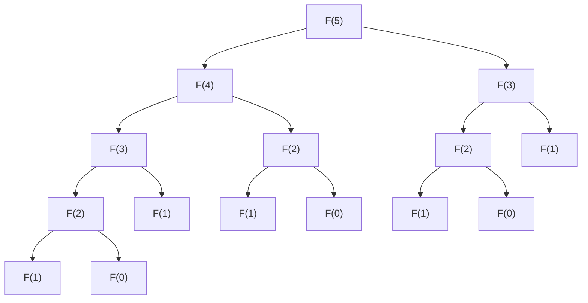

# 1. はじめに：なぜ動的計画法（DP）でつまずくのか？

プログラミングやコンピュータサイエンスの学習を進めていくと、多くの学習者が「アルゴリズムの壁」に直面します。その中でも特に大きなハードルとして立ちはだかるのが、**動的計画法（Dynamic Programming、略して DP）** です。

「漸化式」「部分構造最適性」「状態遷移」など、数学的な用語が並ぶため、「自分には難しすぎる」と挫折してしまう人も少なくありません。しかし、動的計画法は魔法ではありません。本質的には「**同じ計算を二度としないための賢い工夫**」に過ぎないのです。

動的計画法を習得することは、エンジニアとしての基礎力を飛躍的に向上させます。実際のシステム開発においても、ルート探索（ナビゲーションアプリ）、DNAシーケンスの類似度判定（バイオインフォマティクス）、リソースの最適割り当て（クラウドインフラストラクチャ）など、私たちの見えないところでDPの考え方が活用されています。

本記事では、初学者がつまずきやすいポイントを丁寧に紐解きながら、動的計画法の基本概念から代表的な応用問題である「フィボナッチ数列」と「0-1ナップサック問題」までを、非常に詳細に解説します。

---

# 2. 動的計画法（Dynamic Programming）の基礎概念

動的計画法という名前は、1950年代に数学者リチャード・ベルマン（Richard Bellman）によって名付けられました。ここでいう「Programming」は、現在の「ソースコードを書くこと」ではなく、元々は「計画（Planning）」や「表を埋めるプロセス」を意味する数学・最適化分野の用語です。

ある問題に対してDPを適用し、効率的に解くためには、その問題が以下の **2つの重要な性質** を満たしている必要があります。

## 2.1 部分構造最適性 (Optimal Substructure)
「大きな問題の最適解が、それを分割した小さな部分問題の最適解から構成できる」という性質です。
例えば、A地点からC地点までの最短経路を求める際、途中のB地点を経由する場合、AからCへの最短経路は「AからBへの最短経路」と「BからCへの最短経路」の足し合わせで表現できます。これが部分構造最適性です。

## 2.2 部分問題の重複 (Overlapping Subproblems)
「問題を小さな部分問題に分割して解き進める過程で、全く同じ部分問題が何度も繰り返し出現する」という性質です。
DPはこの重複に着目し、一度計算した部分問題の答えを「メモ」しておくことで、計算時間を劇的に削減します。これは、分割統治法（Divide and Conquer：マージソートやクイックソートなど）との決定的な違いです。分割統治法では分割された部分問題が独立している（重複しない）のに対し、DPでは部分問題が複雑に重なり合っています。

---

# 3. DPを実装する2大アプローチ

DPのプログラムへの落とし込み方には、大きく分けて2つのアプローチがあります。問題の性質や個人の好みによって使い分けられます。

## 3.1 トップダウン方式（メモ化再帰: Memoization）
最終的に求めたい一番大きな問題から出発し、再帰関数を用いて小さな問題へブレイクダウンしていくアプローチです。
- **特徴**: 計算の途中で得られた結果を配列や辞書（ハッシュマップ）に記録（メモ）しておき、次に同じ関数呼び出しが発生した際には、再計算せずにメモの値を即座に返します。
- **メリット**: 再帰の直感的なコード構造を保ちつつ、必要な計算だけをオンデマンドで行えます。
- **デメリット**: 再帰呼び出しの深さが大きくなると、関数呼び出しのオーバーヘッドが生じたり、スタックオーバーフロー（Stack Overflow）を引き起こすリスクがあります。

## 3.2 ボトムアップ方式（DPテーブルの構築: Tabulation）
一番小さな自明な問題（ベースケース）から出発し、反復（forループ等）を使って順番に配列（DPテーブル）を埋めていき、最終的に求めたい大きな問題の答えを導くアプローチです。
- **特徴**: 再帰関数を使わず、多次元配列などをループ処理でインデックスが小さい方から順次更新していきます。
- **メリット**: 関数呼び出しのオーバーヘッドがなく、一般的に実行速度が高速です。メモリ効率（空間計算量）を最適化しやすいという強みもあります。
- **デメリット**: 漸化式に基づくインデックスの設計や、配列の初期化ルールなど、最初は直感的に理解しづらい場合があります。

---

# 4. フィボナッチ数列で体験するDPの威力

まずはDPの最もシンプルな例として、フィボナッチ数列（Fibonacci Sequence）を題材に解説します。

フィボナッチ数列は次のように定義されます。
- $F(0) = 0$
- $F(1) = 1$
- $F(n) = F(n-1) + F(n-2)$ （ただし $n \ge 2$）

## 4.1 素朴な再帰による「指数関数的爆発」

数学の定義をそのままPythonプログラムに直してみましょう。

```python
def fib_recursive(n):
    if n == 0:
        return 0
    if n == 1:
        return 1
    return fib_recursive(n-1) + fib_recursive(n-2)
```

一見するとシンプルで美しいコードです。しかし、この実装には致命的な欠陥があります。$n=5$ の時の計算（関数呼び出し）の木構造を見てみましょう。



グラフを見ると、$F(3)$ が2回、$F(2)$ が3回も計算されています。$n$が大きくなると重複は雪だるま式に増え、時間計算量は $O(2^n)$ という指数関数的爆発を起こします。$n=50$ にもなれば、最新のPCでも計算が終わるまでに何年もかかってしまいます。

## 4.2 トップダウン方式（メモ化再帰）による解決

この「無駄な重複計算」を省くために、**メモ化（Memoization）** を導入します。

```python
def fib_memo(n, memo=None):
    if memo is None:
        memo = {}
    
    # すでに計算済みならメモから即座に返す
    if n in memo:
        return memo[n]
        
    if n == 0:
        return 0
    if n == 1:
        return 1
        
    # 計算結果をメモに保存してから返す
    memo[n] = fib_memo(n-1, memo) + fib_memo(n-2, memo)
    return memo[n]
```

これにより、各 $F(k)$ の計算は最初の1度きりとなり、以降は即座にメモから値が返されます。時間計算量は $O(N)$ へと激減し、$n=1000$ でも一瞬で答えが出ます。

## 4.3 ボトムアップ方式（DPテーブル）への移行

今度は、再帰を使わずに小さい値から順番にテーブルを埋めていくボトムアップ方式で実装します。

```python
def fib_dp(n):
    if n == 0: return 0
    if n == 1: return 1
    
    # DPテーブル（配列）を用意
    dp = [0] * (n + 1)
    dp[0] = 0
    dp[1] = 1
    
    # 2からnまで順番に計算して埋める
    for i in range(2, n + 1):
        dp[i] = dp[i-1] + dp[i-2]
        
    return dp[n]
```
配列 `dp` を用意し、前から順番に埋めていく感覚が、まさに「動的計画法」の基本です。

### さらに高度な最適化：空間計算量を O(1) にする
上の実装では、長さ $n+1$ の配列を確保するため空間計算量が $O(N)$ かかります。しかし漸化式を見ると、直前の2つの値（$i-1$ と $i-2$）さえ覚えていれば十分なことがわかります。

```python
def fib_optimized(n):
    if n == 0: return 0
    
    prev2 = 0 # F(n-2)
    prev1 = 1 # F(n-1)
    
    for _ in range(2, n + 1):
        current = prev1 + prev2
        prev2 = prev1
        prev1 = current
        
    return prev1
```
このように、配列全体を保存しなくても変数をスライドさせるだけで計算でき、メモリ使用量（空間計算量）を $O(1)$ まで削減できます。DPを学ぶ際、このように「状態の依存関係」を観察してメモリを節約する考え方は非常に重要です。

---

# 5. ナップサック問題（0-1 Knapsack Problem）に挑む

フィボナッチ数列でDPの基礎を理解したところで、次はより実践的で応用価値の高い最適化問題、「0-1 ナップサック問題」に取り組みましょう。

## 5.1 問題設定と「なぜ貪欲法ではダメなのか」
**設定**:
あなたは容量 $W$ キログラムまで荷物を入れられるナップサックを持っています。目の前には $N$ 個の品物があり、各品物 $i$ には「重さ $w_i$」と「価値 $v_i$」が設定されています。
ナップサックが破れない範囲（重さの合計が $W$ 以下）で品物を選び、持ち帰る **価値の合計を最大化** してください。なお、各品物は1つしかなく、一部だけを切り取って入れることはできません（だから 0 または 1 なのです）。

**貪欲法（Greedy）の罠**:
「価値が高いものから順に入れる」「重さあたりの価値（コスパ）が高いものから順に入れる」といった直感的なアプローチ（貪欲法）では、この問題は解けません。
例えば、容量 $W = 5$ のナップサックに対して以下の品物があるとします。
- 品物A: 重さ 3, 価値 5 (コスパ 1.66)
- 品物B: 重さ 2, 価値 3 (コスパ 1.50)
- 品物C: 重さ 2, 価値 3 (コスパ 1.50)

コスパの良い品物Aを入れると、残り容量は2となり、品物B(またはC)を入れて合計価値は 8（重さ5）になります。しかし最適解は、品物BとCの両方を入れることで、合計価値は 6 + 6ではなく3 + 3 = 6… あれ？
別の例を考えましょう。容量 $W = 4$。
- 品物A: 重さ 3, 価値 4 (コスパ 1.33)
- 品物B: 重さ 2, 価値 3 (コスパ 1.50)
- 品物C: 重さ 2, 価値 3 (コスパ 1.50)

コスパ順（B→Cと入れたいが入らないのでBのみ、残り2でAもCも入らない）だとBのみで価値3。しかし最適解は、BとCを入れることで重さ4、価値6となります。このように、「今の最善」を選ぶだけでは全体の最適解に辿り着けないため、あらゆる状態を網羅しつつ効率化できるDPの出番となります。

## 5.2 状態の定義と漸化式（状態遷移方程式）

DPを構築するためには、「状態」を明確に定義することが最も重要です。

`dp[i][w]` を次のように定義します。
**「最初の $i$ 個の品物の中から、重さの合計が $w$ 以下になるように選んだときの、価値の最大値」**

次に、$i$ 番目の品物（重さ $w_i$、価値 $v_i$）をナップサックに入れるかどうかを検討する際の状態の移り変わり（漸化式）を考えます。

1. **品物 $i$ を選ばない（選べない）場合**
   容量が足りない、あるいは意図的に入れない場合の最大価値は、$i-1$ 番目までで構成した最大価値と変わりません。
   $$dp[i][w] = dp[i-1][w]$$

2. **品物 $i$ を選ぶ場合（重さが $w_i$ 以下の場合のみ可能）**
   ナップサックの容量 $w$ のうち、$w_i$ 分を品物 $i$ に明け渡すため、状態は $w - w_i$ に巻き戻ります。そこに品物 $i$ の価値 $v_i$ が加わります。
   $$dp[i][w] = dp[i-1][w - w_i] + v_i$$

この2つのケースのうち、**より価値が大きくなる方（最大値）** を選べばよいのです。これを漸化式にまとめると以下のようになります。

$$
dp[i][w] = 
\begin{cases}
dp[i-1][w] & \text{if } w < w_i \\
\max(dp[i-1][w], \ dp[i-1][w - w_i] + v_i) & \text{if } w \ge w_i
\end{cases}
$$

## 5.3 Pythonによる基本実装 (2次元配列)

漸化式が完成すれば、あとはそれをコードに翻訳するだけです。

```python
def knapsack_01(weights, values, W):
    N = len(weights)
    # 状態を保存するDPテーブル。初期値は0。
    # dp[N+1][W+1] の2次元配列を確保
    dp = [[0] * (W + 1) for _ in range(N + 1)]
    
    # 品物を1つずつ増やしながら検討していく
    for i in range(1, N + 1):
        weight = weights[i-1]
        value = values[i-1]
        
        # 各容量 0〜W について最適解を計算
        for w in range(W + 1):
            if w >= weight:
                # 入れる場合と入れない場合で大きい方を採用
                dp[i][w] = max(dp[i-1][w], dp[i-1][w - weight] + value)
            else:
                # 容量不足で入れられない場合
                dp[i][w] = dp[i-1][w]
                
    return dp[N][W]
```

この実装の時間計算量は品物の数 $N$ とナップサックの容量 $W$ に対して $O(NW)$ となり、効率よく解を求めることができます。

## 5.4 さらなる高みへ：空間計算量の最適化（1次元配列への削減）

フィボナッチ数列の時と同じように、メモリ使用量を最適化してみましょう。
上記の2次元配列の更新ロジックをよく観察すると、`dp[i][w]` を計算するために必要なデータは **「直前の行（`dp[i-1]`）」** の情報だけです。つまり、$N \times W$ の広大な行列を保持し続ける必要はなく、長さ $W+1$ の1次元配列を使い回すことができそうです。

ただし、**配列を右から左へ（大きい容量から小さい容量へ）逆順に更新していく必要があります。** もし左から右に更新してしまうと、同じステップの中で更新済みの `dp` の値を参照してしまう（＝同じ品物を複数回選んでしまう）ことになるからです。

```python
def knapsack_optimized(weights, values, W):
    N = len(weights)
    # 容量W+1の1次元配列のみを用意
    dp = [0] * (W + 1)
    
    for i in range(N):
        weight = weights[i]
        value = values[i]
        
        # 容量が大きい方から逆順にループを回す！
        for w in range(W, weight - 1, -1):
            dp[w] = max(dp[w], dp[w - weight] + value)
            
    return dp[W]
```
これにより、空間計算量を $O(NW)$ から $O(W)$ へと劇的に削減できました。実務のプログラミングコンテストや厳しいリソース制約下では、この「インプレース更新」のテクニックが勝敗を分けることもあります。

---

# 6. DPをマスターするための学習戦略とアドバイス

動的計画法を自分の武器にするためには、単にコードを暗記するだけでは不十分です。以下の3つのアプローチを意識して学習を深めてみてください。

1. **手動で表（テーブル）を書いてみる**
   頭の中でシミュレーションするのではなく、紙とペンを用意して、実際に小さなケースのDPテーブルを自力で埋めてみてください。「なるほど、斜め上の値を参照して足しているのか」といった、視覚的な気づきが得られます。
   
2. **漸化式を言葉に翻訳する**
   `dp[i][j] = max(...)` という数式を見たら、必ず「i番目までの〇〇を使って、制限jを満たした時の、最大の△△」と日本語の定義に翻訳する癖をつけてください。状態の定義が曖昧なままだと、少し問題設定をひねられた途端に手足が出なくなります。

3. **多様なパターンの問題に触れる**
   ナップサック問題のような「選択」のDPだけでなく、
   - **最長共通部分列（LCS）** のような「文字列やシーケンス」のDP
   - **コイン両替問題** のような「個数無制限」のDP
   - **区間DP** や **ビットDP** といった特殊な状態を持つDP
   など、様々なカテゴリの問題に挑戦することで、「状態の持ち方」の引き出しが増えていきます。

# 7. まとめ

本記事では、動的計画法の基本概念から、メモ化再帰とボトムアップ方式の違い、そして「フィボナッチ数列」から「ナップサック問題」に至るまでの詳細な設計と思考プロセスを解説しました。

DPの本質は **「過去の努力を無駄にしない（メモする）こと」** と **「複雑な世界を小さな問題の積み重ねとして再定義すること」** に尽きます。最初は難しく感じるかもしれませんが、テーブルを埋めるパズルゲームのような感覚を掴めば、非常に楽しく、そして頼もしいツールとなります。

ぜひ今回紹介したPythonコードを手元で動かし、値を変更したりプリント文（`print()`）で変数の推移を観察したりして、DPの奥深い世界を体感してみてください。アルゴリズムの壁を一つ越えた先に、さらに広大なプログラミングの世界が待っているはずです。
