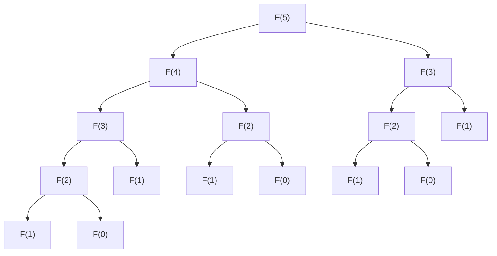

# 1. Introdução

À medida que você avança na programação e no aprendizado de algoritmos, há uma grande barreira que muitos estudantes enfrentam. Trata-se da **Programação Dinâmica** (Dynamic Programming, abreviada como **DP**). Só de ouvir o nome, você pode ficar na defensiva, pensando "Parece difícil" ou "Não precisa de conhecimentos matemáticos especializados?". No entanto, ao entender a essência, você verá que a DP é uma técnica de resolução de problemas muito poderosa e intuitiva.

Neste artigo, partiremos do conceito básico de DP e, usando os problemas representativos "Sequência de Fibonacci" e "Problema da Mochila" como exemplos, explicaremos minuciosamente a sua forma de pensar e métodos de implementação. Vamos aprofundar nossa compreensão gradualmente, mesclando com o código Python.


# 2. O que é Programação Dinâmica (DP)?

A Programação Dinâmica (Dynamic Programming) é uma técnica que divide problemas complexos em vários subproblemas menores, e resolve registrando (memoizando) a solução de cada subproblema. Com isso, elimina-se o desperdício de repetir os mesmos cálculos, e o tempo de cálculo pode ser drasticamente reduzido.

O núcleo da DP está nas seguintes duas características:

1.  **Subestrutura Ótima** (Optimal Substructure): A propriedade de que a solução ótima de um problema maior pode ser construída a partir das soluções ótimas de seus subproblemas menores.
2.  **Sobreposição de Subproblemas** (Overlapping Subproblems): A propriedade de que os mesmos problemas menores aparecem repetidamente.

Para problemas com essas características, a DP exibe um poder imenso.

## 2 Abordagens da DP

A DP possui principalmente 2 abordagens de implementação.

### 1. Recursão com Memoização (Abordagem Top-Down)
Começa pelo problema maior e chama recursivamente os problemas menores. Nesse momento, o resultado calculado uma vez é salvo (memoizado) em um array ou hash map, e quando o mesmo problema aparecer novamente, o valor memoizado é retornado sem recalcular.

### 2. Abordagem Bottom-Up (Divisão e Conquista e Preenchimento de Tabela)
Calcula as soluções sequencialmente desde o menor problema, registrando-as em um array (Tabela DP). Usando as soluções dos problemas menores, resolve gradualmente problemas maiores e, por fim, obtém a solução do problema que se deseja resolver.


# 3. Parte Básica: Aprendendo DP com a Sequência de Fibonacci

Como um primeiro passo para entender o conceito de DP, usaremos a sequência de Fibonacci.

A sequência de Fibonacci é uma sequência definida como segue:
$ F(0) = 0 $
$ F(1) = 1 $
$ F(n) = F(n-1) + F(n-2) \quad \text{para } n \ge 2 $

## 3.1 A Armadilha da Chamada Recursiva Simples

Vamos tentar escrever uma função em Python conforme a definição.

```python
def fib_recursive(n):
    if n <= 0:
        return 0
    elif n == 1:
        return 1
    return fib_recursive(n-1) + fib_recursive(n-2)
```

Esta implementação é intuitiva, mas possui um grande problema. É que **a complexidade computacional aumenta exponencialmente**. Vamos ver a árvore de chamadas de função ao calcular $F(5)$.



Como você pode ver, $F(3)$ e $F(2)$ são calculados repetidamente várias vezes. A complexidade computacional torna-se $O(2^n)$, e quando $n$ fica grande, o cálculo não terminará em um tempo prático.

## 3.2 Recursão com Memoização (Abordagem Top-Down)

O que elimina esse desperdício é a **memoização**. Vamos salvar os resultados calculados uma vez.

```python
def fib_memo(n, memo=None):
    if memo is None:
        memo = {}
    if n in memo:
        return memo[n]
    if n <= 0:
        return 0
    elif n == 1:
        return 1
    
    memo[n] = fib_memo(n-1, memo) + fib_memo(n-2, memo)
    return memo[n]
```

Dessa forma, cada $F(i)$ é calculado apenas uma vez, e a complexidade computacional cai drasticamente para $O(n)$.

## 3.3 Abordagem Bottom-Up (Tabela DP)

Para evitar a sobrecarga de chamadas recursivas, a abordagem bottom-up calcula em ordem, de baixo para cima.

```python
def fib_dp(n):
    if n <= 0:
        return 0
    elif n == 1:
        return 1
        
    dp = [0] * (n + 1)
    dp[0] = 0
    dp[1] = 1
    
    for i in range(2, n + 1):
        dp[i] = dp[i-1] + dp[i-2]
        
    return dp[n]
```

Um array `dp` é preparado e preenchido em ordem a partir do índice menor. Esta é a forma típica de usar uma tabela DP.


# 4. Parte de Aplicação: Problema da Mochila

A verdadeira essência da DP é mostrada ao resolver problemas de otimização. Aqui, consideraremos o famoso "Problema da Mochila 0-1".

## 4.1 Definição do Problema

Você é um ladrão (esse é o cenário). Você tem uma mochila com capacidade $W$. Há $N$ itens à sua frente, e cada item $i$ tem um peso $w_i$ e um valor $v_i$.

Escolha itens de modo que não excedam a capacidade da mochila e **maximize a soma dos valores** dos itens levados. No entanto, há apenas um de cada item, e as opções são "escolher (1)" ou "não escolher (0)".

## 4.2 Definição de Estado e Relação de Recorrência

Ao resolver problemas com DP, o mais importante é a derivação da **definição do estado** e da **relação de recorrência (equação de transição de estado)**.

O estado é definido da seguinte maneira:
$dp[i][w]$: O valor máximo quando escolhido dentre os primeiros $i$ itens, de forma que a soma dos pesos seja $w$ ou menos.

Aqui, ao considerar o $i$-ésimo item (peso $w_i$, valor $v_i$), existem as seguintes duas opções:

1.  **Caso não escolha**:
    O valor máximo é o mesmo do estado anterior $dp[i-1][w]$.
2.  **Caso escolha** (possível apenas se $w \ge w_i$):
    Adicione o valor $v_i$ do item $i$ ao estado onde $w_i$ é subtraído da capacidade. Ou seja, será $dp[i-1][w - w_i] + v_i$.

Portanto, a relação de recorrência será a seguinte:

$$
dp[i][w] = 
\begin{cases}
\max(dp[i-1][w], dp[i-1][w - w_i] + v_i) & \text{se } w \ge w_i \\
dp[i-1][w] & \text{caso contrário}
\end{cases}
$$

## 4.3 Implementação em Python

Nós transcrevemos esta relação de recorrência diretamente no programa.

```python
def knapsack(weights, values, W):
    N = len(weights)
    # Inicialização da tabela DP: Array bidimensional de (N+1) x (W+1)
    dp = [[0] * (W + 1) for _ in range(N + 1)]
    
    # Preencher a tabela DP
    for i in range(1, N + 1):
        for w in range(W + 1):
            if w >= weights[i-1]:
                # Tomar o valor máximo entre escolher e não escolher
                dp[i][w] = max(dp[i-1][w], dp[i-1][w - weights[i-1]] + values[i-1])
            else:
                # Caso não possa escolher devido ao excesso de capacidade
                dp[i][w] = dp[i-1][w]
                
    return dp[N][W]
```

### Transição da Tabela DP

Vamos acompanhar a transição da tabela `dp` em um certo exemplo.

| $i$ \ $w$ | 0 | 1 | 2 | 3 | 4 | 5 |
|---|---|---|---|---|---|---|
| 0 | 0 | 0 | 0 | 0 | 0 | 0 |
| 1 | 0 | 0 | 3 | 3 | 3 | 3 |
| 2 | 0 | 2 | 3 | 5 | 5 | 5 |
| 3 | 0 | 2 | 3 | 5 | 6 | 7 |
| 4 | 0 | 2 | 3 | 5 | 6 | 7 |

Desta forma, ao procurar a solução ótima em ordem a partir de problemas menores com pequenas capacidades e poucos itens, a resposta é encontrada no final.


# 5. Explicação Detalhada e Exploração de Algoritmos para Entender a DP Mais Profundamente

Para consolidar a compreensão da DP, é essencial lidar com mais problemas de exemplo e aprender os vários padrões de transições de estado.

## 5.1 Distância de Edição (Distância de Levenshtein)

Quando duas strings $S$ e $T$ são dadas, é o problema de encontrar o número mínimo de operações de "inserção", "exclusão" e "substituição" a serem realizadas em $S$ para convertê-la em $T$.

### Relação de Recorrência

$$
dp[i][j] = 
\begin{cases}
dp[i-1][j-1] & \text{se } S[i-1] == T[j-1] \\
\min(dp[i][j-1], dp[i-1][j], dp[i-1][j-1]) + 1 & \text{caso contrário}
\end{cases}
$$

## 5.2 Técnica de Otimização da Complexidade de Espaço (Atualização In-place)

Nas implementações até agora, usamos $O(NW)$ ou $O(MN)$ de memória para o cálculo das transições de estado. No entanto, observando de perto a relação de recorrência, muitas vezes é necessário apenas a "linha anterior" para atualizar um certo estado.

Por exemplo, usando a relação de recorrência do problema da mochila, é possível reduzir um array bidimensional para um array unidimensional. Ao atualizar, fazendo a atualização da direita para a esquerda, é possível evitar o bug de sobrescrever o valor de $i-1$ durante o cálculo do $i$ atual.

```python
def knapsack_optimized(weights, values, W):
    N = len(weights)
    dp = [0] * (W + 1)
    
    for i in range(N):
        # Atualizando em ordem inversa, um array unidimensional é suficiente
        for w in range(W, weights[i] - 1, -1):
            dp[w] = max(dp[w], dp[w - weights[i]] + values[i])
            
    return dp[W]
```

### Parte de Explicação Avançada 1: Limitações da DP e Seleção de Algoritmos

A força da programação dinâmica é evitar a sobreposição de subestruturas, mas mesmo assim, nem todos os problemas podem ser resolvidos rapidamente. Por exemplo, a complexidade computacional do problema da mochila é $O(NW)$, o que, à primeira vista, parece ser de tempo polinomial. No entanto, $W$ é um "valor" da entrada e pode ter um tamanho exponencial em relação ao tamanho da entrada (número de bits). Tal complexidade computacional é chamada de **tempo pseudo-polinomial**.

Se $W$ for muito grande, apenas a alocação do array esgotará a memória, e o número de loops será enorme, de modo que este método DP não poderá ser aplicado. Nesse caso, é necessário mudar para DP com relação ao limite superior da soma dos valores $V$, ou usar outra abordagem, como enumeração pela metade (Meet in the Middle).

Além disso, na depuração de DP, **comparar a tabela calculada à mão com uma pequena entrada e a tabela de saída do programa** é o mais eficaz. Preparando papel e caneta e realmente desenhando a tabela bidimensional, você poderá entender facilmente "por que essa relação de recorrência ocorre" e "onde a transição está errada".

### Parte de Explicação Avançada 40: Limitações da DP e Seleção de Algoritmos

A força da programação dinâmica é evitar a sobreposição de subestruturas, mas mesmo assim, nem todos os problemas podem ser resolvidos rapidamente. Por exemplo, a complexidade computacional do problema da mochila é $O(NW)$, o que, à primeira vista, parece ser de tempo polinomial. No entanto, $W$ é um "valor" da entrada e pode ter um tamanho exponencial em relação ao tamanho da entrada (número de bits). Tal complexidade computacional é chamada de **tempo pseudo-polinomial**.

Se $W$ for muito grande, apenas a alocação do array esgotará a memória, e o número de loops será enorme, de modo que este método DP não poderá ser aplicado. Nesse caso, é necessário mudar para DP com relação ao limite superior da soma dos valores $V$, ou usar outra abordagem, como enumeração pela metade (Meet in the Middle).

Além disso, na depuração de DP, **comparar a tabela calculada à mão com uma pequena entrada e a tabela de saída do programa** é o mais eficaz. Preparando papel e caneta e realmente desenhando a tabela bidimensional, você poderá entender facilmente "por que essa relação de recorrência ocorre" e "onde a transição está errada".

# 6. Conclusão

A programação dinâmica (DP) pode parecer difícil de abordar no começo. No entanto, partindo da compreensão intuitiva de "eliminar cálculos inúteis" na sequência de Fibonacci e prosseguindo em etapas para a "definição de estado e transição" como no problema da mochila, você certamente poderá dominá-la.

**"Como definir o estado"**
**"A partir de quais estados menores esse estado pode ser calculado (relação de recorrência)"**

A maneira mais rápida de cultivar a capacidade de discernir esses 2 pontos é ter contato com muitos problemas e tentar escrever a tabela DP com suas próprias mãos. Por favor, tente enfrentar desafios usando o conhecimento aprendido neste artigo como uma arma.
