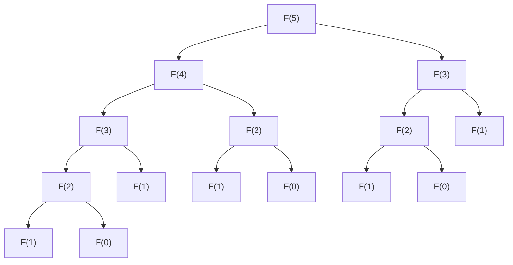

# 1. Введение

По мере изучения программирования и алгоритмов многие учащиеся сталкиваются с серьезным препятствием. Это **динамическое программирование** (Dynamic Programming, или сокращенно **ДП**). Услышав только название, вы можете насторожиться, подумав: «Звучит как-то сложно» или «Не нужны ли для этого специальные математические знания?». Однако, если понять суть, становится ясно, что ДП - это очень мощный и интуитивно понятный метод решения задач.

В этой статье мы начнем с базовых концепций ДП и на примере типичных задач, таких как «последовательность Фибоначчи» и «задача о рюкзаке», подробно разберем его логику и способы реализации. Используя код на Python, давайте шаг за шагом углублять наше понимание.


# 2. Что такое динамическое программирование (ДП)?

Динамическое программирование (Dynamic Programming) - это метод, при котором сложная задача разбивается на несколько небольших подзадач, и при решении каждой подзадачи ее ответ записывается (мемоизируется). Это позволяет избежать повторных вычислений и радикально сократить время работы.

Суть ДП заключается в следующих двух особенностях:

1.  **Оптимальная подструктура** (Optimal Substructure): Свойство, при котором оптимальное решение большой задачи может быть составлено из оптимальных решений ее меньших подзадач.
2.  **Перекрывающиеся подзадачи** (Overlapping Subproblems): Свойство, при котором одни и те же небольшие задачи встречаются снова и снова.

Для задач, обладающих этими характеристиками, ДП демонстрирует огромную эффективность.

## 2 подхода к ДП

Существует два основных подхода к реализации ДП.

### 1. Рекурсия с мемоизацией (нисходящий подход)
Начинаем с большой задачи и рекурсивно вызываем меньшие. При этом результаты уже вычисленных задач сохраняются (мемоизируются) в массиве или хеш-таблице. Когда та же задача встречается снова, вместо повторного вычисления возвращается сохраненное значение.

### 2. Восходящий подход (таблица ДП)
Решения вычисляются по порядку, начиная с самых маленьких задач, и записываются в массив (таблицу ДП). Используя решения меньших задач, мы постепенно решаем более крупные, в конечном итоге получая решение исходной задачи.


# 3. Базовый уровень: Изучаем ДП на примере последовательности Фибоначчи

В качестве первого шага к пониманию концепции ДП мы рассмотрим последовательность Фибоначчи.

Последовательность Фибоначчи - это числовая последовательность, определяемая следующим образом:
$ F(0) = 0 $
$ F(1) = 1 $
$ F(n) = F(n-1) + F(n-2) \quad \text{для } n \ge 2 $

## 3.1 Ловушка простых рекурсивных вызовов

Давайте напишем функцию на Python строго по определению.

```python
def fib_recursive(n):
    if n <= 0:
        return 0
    elif n == 1:
        return 1
    return fib_recursive(n-1) + fib_recursive(n-2)
```

Эта реализация интуитивно понятна, но имеет большую проблему. Она заключается в том, что **вычислительная сложность возрастает экспоненциально**. Давайте посмотрим на дерево вызовов функции при вычислении $F(5)$.



Как видите, $F(3)$ и $F(2)$ вычисляются многократно и повторяются. Временная сложность составляет $O(2^n)$, и при больших значениях $n$ вычисления не завершатся за разумное время.

## 3.2 Рекурсия с мемоизацией (нисходящий подход)

Этих лишних действий можно избежать с помощью **мемоизации**. Давайте сохранять однажды вычисленные результаты.

```python
def fib_memo(n, memo=None):
    if memo is None:
        memo = {}
    if n in memo:
        return memo[n]
    if n <= 0:
        return 0
    elif n == 1:
        return 1
    
    memo[n] = fib_memo(n-1, memo) + fib_memo(n-2, memo)
    return memo[n]
```

Благодаря этому каждое $F(i)$ вычисляется только один раз, а вычислительная сложность резко сокращается до $O(n)$.

## 3.3 Восходящий подход (таблица ДП)

Восходящий подход заключается в вычислении снизу вверх, чтобы избежать накладных расходов на рекурсивные вызовы.

```python
def fib_dp(n):
    if n <= 0:
        return 0
    elif n == 1:
        return 1
        
    dp = [0] * (n + 1)
    dp[0] = 0
    dp[1] = 1
    
    for i in range(2, n + 1):
        dp[i] = dp[i-1] + dp[i-2]
        
    return dp[n]
```

Мы подготавливаем массив `dp` и последовательно заполняем его, начиная с наименьших индексов. Это типичный способ использования таблицы ДП.


# 4. Продвинутый уровень: Задача о рюкзаке

Истинная сила ДП проявляется при решении задач оптимизации. Здесь мы рассмотрим знаменитую «задачу о рюкзаке 0-1».

## 4.1 Постановка задачи

Вы вор (по сценарию). У вас есть рюкзак вместимостью $W$. Перед вами $N$ предметов, и для каждого предмета $i$ заданы его вес $w_i$ и ценность $v_i$.

Выберите предметы в пределах вместимости рюкзака так, чтобы **максимизировать общую ценность** уносимых предметов. При этом каждый предмет существует только в одном экземпляре, и его можно либо «выбрать (1)», либо «не выбрать (0)».

## 4.2 Определение состояния и рекуррентное соотношение

При решении задач с помощью ДП самым важным является **определение состояния** и вывод **рекуррентного соотношения (уравнения перехода состояний)**.

Определим состояние следующим образом:
$dp[i][w]$ ：максимальная ценность при выборе из первых $i$ предметов так, чтобы их суммарный вес не превышал $w$.

Здесь, рассматривая $i$-й предмет (вес $w_i$, ценность $v_i$), у нас есть два варианта:

1.  **Если не выбирать**:
    Максимальная ценность такая же, как в предыдущем состоянии $dp[i-1][w]$.
2.  **Если выбрать** (возможно только при $w \ge w_i$):
    К состоянию с вместимостью, уменьшенной на $w_i$, прибавляется ценность $v_i$ предмета $i$. То есть $dp[i-1][w - w_i] + v_i$.

Следовательно, рекуррентное соотношение будет выглядеть так:

$$
dp[i][w] = 
\begin{cases}
\max(dp[i-1][w], dp[i-1][w - w_i] + v_i) & \text{если } w \ge w_i \\
dp[i-1][w] & \text{иначе}
\end{cases}
$$

## 4.3 Реализация на Python

Давайте перенесем это рекуррентное соотношение прямо в программу.

```python
def knapsack(weights, values, W):
    N = len(weights)
    # Инициализация таблицы ДП: двумерный массив размером (N+1) x (W+1)
    dp = [[0] * (W + 1) for _ in range(N + 1)]
    
    # Заполнение таблицы ДП
    for i in range(1, N + 1):
        for w in range(W + 1):
            if w >= weights[i-1]:
                # Берем максимум между выбором и не-выбором предмета
                dp[i][w] = max(dp[i-1][w], dp[i-1][w - weights[i-1]] + values[i-1])
            else:
                # Если превышена вместимость и выбрать нельзя
                dp[i][w] = dp[i-1][w]
                
    return dp[N][W]
```

### Развитие таблицы ДП

Давайте проследим, как меняется таблица `dp` на определенном примере.

| $i$ \ $w$ | 0 | 1 | 2 | 3 | 4 | 5 |
|---|---|---|---|---|---|---|
| 0 | 0 | 0 | 0 | 0 | 0 | 0 |
| 1 | 0 | 0 | 3 | 3 | 3 | 3 |
| 2 | 0 | 2 | 3 | 5 | 5 | 5 |
| 3 | 0 | 2 | 3 | 5 | 6 | 7 |
| 4 | 0 | 2 | 3 | 5 | 6 | 7 |

Таким образом, последовательно находя оптимальные решения подзадач с меньшей вместимостью и меньшим числом предметов, мы в итоге получаем окончательный ответ.


# 5. Подробные объяснения и изучение алгоритмов для более глубокого понимания ДП

Чтобы закрепить понимание ДП, необходимо рассмотреть множество примеров и изучить различные паттерны переходов состояний.

## 5.1 Расстояние редактирования (расстояние Левенштейна)

Даны две строки $S$ и $T$. Задача состоит в том, чтобы найти минимальное количество операций «вставки», «удаления» и «замены», необходимых для преобразования $S$ в $T$.

### Рекуррентное соотношение

$$
dp[i][j] = 
\begin{cases}
dp[i-1][j-1] & \text{если } S[i-1] == T[j-1] \\
\min(dp[i][j-1], dp[i-1][j], dp[i-1][j-1]) + 1 & \text{иначе}
\end{cases}
$$

## 5.2 Технологии оптимизации пространственной сложности (обновление на месте)

В наших предыдущих реализациях мы использовали память $O(NW)$ или $O(MN)$ для вычисления переходов состояний. Однако если внимательно посмотреть на рекуррентное соотношение, часто для обновления определенного состояния нужна только «предыдущая строка».

Например, используя рекуррентное соотношение задачи о рюкзаке, двумерный массив можно сократить до одномерного. При обновлении, двигаясь справа налево, мы можем предотвратить ошибку перезаписи значений для $i-1$ во время текущего вычисления для $i$.

```python
def knapsack_optimized(weights, values, W):
    N = len(weights)
    dp = [0] * (W + 1)
    
    for i in range(N):
        # При обратном порядке обновления достаточно одномерного массива
        for w in range(W, weights[i] - 1, -1):
            dp[w] = max(dp[w], dp[w - weights[i]] + values[i])
            
    return dp[W]
```


### Развитие и пояснения, часть 1: Ограничения ДП и выбор алгоритма

Сила динамического программирования заключается в избегании дублирования подструктур, но тем не менее не все задачи могут быть решены быстро. Например, вычислительная сложность задачи о рюкзаке составляет $O(NW)$, что на первый взгляд кажется полиномиальным временем. Однако $W$ - это «значение» входных данных, и оно может быть экспоненциально большим по отношению к размеру входа (количеству бит). Такая вычислительная сложность называется **псевдополиномиальным временем**.

Если $W$ очень велико, то только на выделение памяти для массива она будет исчерпана, а количество циклов станет огромным, поэтому этот метод ДП применить не удастся. В таком случае необходимо переключиться на ДП по верхней границе общей суммы ценностей $V$, или потребуется другой подход, такой как половина перебора (Meet in the Middle).

Кроме того, при отладке ДП наиболее эффективно **сравнивать таблицу, рассчитанную вручную на небольших входных данных, с таблицей, выведенной программой**. Вооружившись бумагой и ручкой и фактически нарисовав двумерную таблицу, вы сразу поймете, «почему получается именно такое рекуррентное соотношение» и «где произошла ошибка при переходе».

### Развитие и пояснения, часть 2: Ограничения ДП и выбор алгоритма

Сила динамического программирования заключается в избегании дублирования подструктур, но тем не менее не все задачи могут быть решены быстро. Например, вычислительная сложность задачи о рюкзаке составляет $O(NW)$, что на первый взгляд кажется полиномиальным временем. Однако $W$ - это «значение» входных данных, и оно может быть экспоненциально большим по отношению к размеру входа (количеству бит). Такая вычислительная сложность называется **псевдополиномиальным временем**.

Если $W$ очень велико, то только на выделение памяти для массива она будет исчерпана, а количество циклов станет огромным, поэтому этот метод ДП применить не удастся. В таком случае необходимо переключиться на ДП по верхней границе общей суммы ценностей $V$, или потребуется другой подход, такой как половина перебора (Meet in the Middle).

Кроме того, при отладке ДП наиболее эффективно **сравнивать таблицу, рассчитанную вручную на небольших входных данных, с таблицей, выведенной программой**. Вооружившись бумагой и ручкой и фактически нарисовав двумерную таблицу, вы сразу поймете, «почему получается именно такое рекуррентное соотношение» и «где произошла ошибка при переходе».

### Развитие и пояснения, часть 3: Ограничения ДП и выбор алгоритма

Сила динамического программирования заключается в избегании дублирования подструктур, но тем не менее не все задачи могут быть решены быстро. Например, вычислительная сложность задачи о рюкзаке составляет $O(NW)$, что на первый взгляд кажется полиномиальным временем. Однако $W$ - это «значение» входных данных, и оно может быть экспоненциально большим по отношению к размеру входа (количеству бит). Такая вычислительная сложность называется **псевдополиномиальным временем**.

Если $W$ очень велико, то только на выделение памяти для массива она будет исчерпана, а количество циклов станет огромным, поэтому этот метод ДП применить не удастся. В таком случае необходимо переключиться на ДП по верхней границе общей суммы ценностей $V$, или потребуется другой подход, такой как половина перебора (Meet in the Middle).

Кроме того, при отладке ДП наиболее эффективно **сравнивать таблицу, рассчитанную вручную на небольших входных данных, с таблицей, выведенной программой**. Вооружившись бумагой и ручкой и фактически нарисовав двумерную таблицу, вы сразу поймете, «почему получается именно такое рекуррентное соотношение» и «где произошла ошибка при переходе».

### Развитие и пояснения, часть 4: Ограничения ДП и выбор алгоритма

Сила динамического программирования заключается в избегании дублирования подструктур, но тем не менее не все задачи могут быть решены быстро. Например, вычислительная сложность задачи о рюкзаке составляет $O(NW)$, что на первый взгляд кажется полиномиальным временем. Однако $W$ - это «значение» входных данных, и оно может быть экспоненциально большим по отношению к размеру входа (количеству бит). Такая вычислительная сложность называется **псевдополиномиальным временем**.

Если $W$ очень велико, то только на выделение памяти для массива она будет исчерпана, а количество циклов станет огромным, поэтому этот метод ДП применить не удастся. В таком случае необходимо переключиться на ДП по верхней границе общей суммы ценностей $V$, или потребуется другой подход, такой как половина перебора (Meet in the Middle).

Кроме того, при отладке ДП наиболее эффективно **сравнивать таблицу, рассчитанную вручную на небольших входных данных, с таблицей, выведенной программой**. Вооружившись бумагой и ручкой и фактически нарисовав двумерную таблицу, вы сразу поймете, «почему получается именно такое рекуррентное соотношение» и «где произошла ошибка при переходе».

### Развитие и пояснения, часть 5: Ограничения ДП и выбор алгоритма

Сила динамического программирования заключается в избегании дублирования подструктур, но тем не менее не все задачи могут быть решены быстро. Например, вычислительная сложность задачи о рюкзаке составляет $O(NW)$, что на первый взгляд кажется полиномиальным временем. Однако $W$ - это «значение» входных данных, и оно может быть экспоненциально большим по отношению к размеру входа (количеству бит). Такая вычислительная сложность называется **псевдополиномиальным временем**.

Если $W$ очень велико, то только на выделение памяти для массива она будет исчерпана, а количество циклов станет огромным, поэтому этот метод ДП применить не удастся. В таком случае необходимо переключиться на ДП по верхней границе общей суммы ценностей $V$, или потребуется другой подход, такой как половина перебора (Meet in the Middle).

Кроме того, при отладке ДП наиболее эффективно **сравнивать таблицу, рассчитанную вручную на небольших входных данных, с таблицей, выведенной программой**. Вооружившись бумагой и ручкой и фактически нарисовав двумерную таблицу, вы сразу поймете, «почему получается именно такое рекуррентное соотношение» и «где произошла ошибка при переходе».

### Развитие и пояснения, часть 6: Ограничения ДП и выбор алгоритма

Сила динамического программирования заключается в избегании дублирования подструктур, но тем не менее не все задачи могут быть решены быстро. Например, вычислительная сложность задачи о рюкзаке составляет $O(NW)$, что на первый взгляд кажется полиномиальным временем. Однако $W$ - это «значение» входных данных, и оно может быть экспоненциально большим по отношению к размеру входа (количеству бит). Такая вычислительная сложность называется **псевдополиномиальным временем**.

Если $W$ очень велико, то только на выделение памяти для массива она будет исчерпана, а количество циклов станет огромным, поэтому этот метод ДП применить не удастся. В таком случае необходимо переключиться на ДП по верхней границе общей суммы ценностей $V$, или потребуется другой подход, такой как половина перебора (Meet in the Middle).

Кроме того, при отладке ДП наиболее эффективно **сравнивать таблицу, рассчитанную вручную на небольших входных данных, с таблицей, выведенной программой**. Вооружившись бумагой и ручкой и фактически нарисовав двумерную таблицу, вы сразу поймете, «почему получается именно такое рекуррентное соотношение» и «где произошла ошибка при переходе».

### Развитие и пояснения, часть 7: Ограничения ДП и выбор алгоритма

Сила динамического программирования заключается в избегании дублирования подструктур, но тем не менее не все задачи могут быть решены быстро. Например, вычислительная сложность задачи о рюкзаке составляет $O(NW)$, что на первый взгляд кажется полиномиальным временем. Однако $W$ - это «значение» входных данных, и оно может быть экспоненциально большим по отношению к размеру входа (количеству бит). Такая вычислительная сложность называется **псевдополиномиальным временем**.

Если $W$ очень велико, то только на выделение памяти для массива она будет исчерпана, а количество циклов станет огромным, поэтому этот метод ДП применить не удастся. В таком случае необходимо переключиться на ДП по верхней границе общей суммы ценностей $V$, или потребуется другой подход, такой как половина перебора (Meet in the Middle).

Кроме того, при отладке ДП наиболее эффективно **сравнивать таблицу, рассчитанную вручную на небольших входных данных, с таблицей, выведенной программой**. Вооружившись бумагой и ручкой и фактически нарисовав двумерную таблицу, вы сразу поймете, «почему получается именно такое рекуррентное соотношение» и «где произошла ошибка при переходе».

### Развитие и пояснения, часть 8: Ограничения ДП и выбор алгоритма

Сила динамического программирования заключается в избегании дублирования подструктур, но тем не менее не все задачи могут быть решены быстро. Например, вычислительная сложность задачи о рюкзаке составляет $O(NW)$, что на первый взгляд кажется полиномиальным временем. Однако $W$ - это «значение» входных данных, и оно может быть экспоненциально большим по отношению к размеру входа (количеству бит). Такая вычислительная сложность называется **псевдополиномиальным временем**.

Если $W$ очень велико, то только на выделение памяти для массива она будет исчерпана, а количество циклов станет огромным, поэтому этот метод ДП применить не удастся. В таком случае необходимо переключиться на ДП по верхней границе общей суммы ценностей $V$, или потребуется другой подход, такой как половина перебора (Meet in the Middle).

Кроме того, при отладке ДП наиболее эффективно **сравнивать таблицу, рассчитанную вручную на небольших входных данных, с таблицей, выведенной программой**. Вооружившись бумагой и ручкой и фактически нарисовав двумерную таблицу, вы сразу поймете, «почему получается именно такое рекуррентное соотношение» и «где произошла ошибка при переходе».

### Развитие и пояснения, часть 9: Ограничения ДП и выбор алгоритма

Сила динамического программирования заключается в избегании дублирования подструктур, но тем не менее не все задачи могут быть решены быстро. Например, вычислительная сложность задачи о рюкзаке составляет $O(NW)$, что на первый взгляд кажется полиномиальным временем. Однако $W$ - это «значение» входных данных, и оно может быть экспоненциально большим по отношению к размеру входа (количеству бит). Такая вычислительная сложность называется **псевдополиномиальным временем**.

Если $W$ очень велико, то только на выделение памяти для массива она будет исчерпана, а количество циклов станет огромным, поэтому этот метод ДП применить не удастся. В таком случае необходимо переключиться на ДП по верхней границе общей суммы ценностей $V$, или потребуется другой подход, такой как половина перебора (Meet in the Middle).

Кроме того, при отладке ДП наиболее эффективно **сравнивать таблицу, рассчитанную вручную на небольших входных данных, с таблицей, выведенной программой**. Вооружившись бумагой и ручкой и фактически нарисовав двумерную таблицу, вы сразу поймете, «почему получается именно такое рекуррентное соотношение» и «где произошла ошибка при переходе».

### Развитие и пояснения, часть 10: Ограничения ДП и выбор алгоритма

Сила динамического программирования заключается в избегании дублирования подструктур, но тем не менее не все задачи могут быть решены быстро. Например, вычислительная сложность задачи о рюкзаке составляет $O(NW)$, что на первый взгляд кажется полиномиальным временем. Однако $W$ - это «значение» входных данных, и оно может быть экспоненциально большим по отношению к размеру входа (количеству бит). Такая вычислительная сложность называется **псевдополиномиальным временем**.

Если $W$ очень велико, то только на выделение памяти для массива она будет исчерпана, а количество циклов станет огромным, поэтому этот метод ДП применить не удастся. В таком случае необходимо переключиться на ДП по верхней границе общей суммы ценностей $V$, или потребуется другой подход, такой как половина перебора (Meet in the Middle).

Кроме того, при отладке ДП наиболее эффективно **сравнивать таблицу, рассчитанную вручную на небольших входных данных, с таблицей, выведенной программой**. Вооружившись бумагой и ручкой и фактически нарисовав двумерную таблицу, вы сразу поймете, «почему получается именно такое рекуррентное соотношение» и «где произошла ошибка при переходе».

### Развитие и пояснения, часть 11: Ограничения ДП и выбор алгоритма

Сила динамического программирования заключается в избегании дублирования подструктур, но тем не менее не все задачи могут быть решены быстро. Например, вычислительная сложность задачи о рюкзаке составляет $O(NW)$, что на первый взгляд кажется полиномиальным временем. Однако $W$ - это «значение» входных данных, и оно может быть экспоненциально большим по отношению к размеру входа (количеству бит). Такая вычислительная сложность называется **псевдополиномиальным временем**.

Если $W$ очень велико, то только на выделение памяти для массива она будет исчерпана, а количество циклов станет огромным, поэтому этот метод ДП применить не удастся. В таком случае необходимо переключиться на ДП по верхней границе общей суммы ценностей $V$, или потребуется другой подход, такой как половина перебора (Meet in the Middle).

Кроме того, при отладке ДП наиболее эффективно **сравнивать таблицу, рассчитанную вручную на небольших входных данных, с таблицей, выведенной программой**. Вооружившись бумагой и ручкой и фактически нарисовав двумерную таблицу, вы сразу поймете, «почему получается именно такое рекуррентное соотношение» и «где произошла ошибка при переходе».

### Развитие и пояснения, часть 12: Ограничения ДП и выбор алгоритма

Сила динамического программирования заключается в избегании дублирования подструктур, но тем не менее не все задачи могут быть решены быстро. Например, вычислительная сложность задачи о рюкзаке составляет $O(NW)$, что на первый взгляд кажется полиномиальным временем. Однако $W$ - это «значение» входных данных, и оно может быть экспоненциально большим по отношению к размеру входа (количеству бит). Такая вычислительная сложность называется **псевдополиномиальным временем**.

Если $W$ очень велико, то только на выделение памяти для массива она будет исчерпана, а количество циклов станет огромным, поэтому этот метод ДП применить не удастся. В таком случае необходимо переключиться на ДП по верхней границе общей суммы ценностей $V$, или потребуется другой подход, такой как половина перебора (Meet in the Middle).

Кроме того, при отладке ДП наиболее эффективно **сравнивать таблицу, рассчитанную вручную на небольших входных данных, с таблицей, выведенной программой**. Вооружившись бумагой и ручкой и фактически нарисовав двумерную таблицу, вы сразу поймете, «почему получается именно такое рекуррентное соотношение» и «где произошла ошибка при переходе».

### Развитие и пояснения, часть 13: Ограничения ДП и выбор алгоритма

Сила динамического программирования заключается в избегании дублирования подструктур, но тем не менее не все задачи могут быть решены быстро. Например, вычислительная сложность задачи о рюкзаке составляет $O(NW)$, что на первый взгляд кажется полиномиальным временем. Однако $W$ - это «значение» входных данных, и оно может быть экспоненциально большим по отношению к размеру входа (количеству бит). Такая вычислительная сложность называется **псевдополиномиальным временем**.

Если $W$ очень велико, то только на выделение памяти для массива она будет исчерпана, а количество циклов станет огромным, поэтому этот метод ДП применить не удастся. В таком случае необходимо переключиться на ДП по верхней границе общей суммы ценностей $V$, или потребуется другой подход, такой как половина перебора (Meet in the Middle).

Кроме того, при отладке ДП наиболее эффективно **сравнивать таблицу, рассчитанную вручную на небольших входных данных, с таблицей, выведенной программой**. Вооружившись бумагой и ручкой и фактически нарисовав двумерную таблицу, вы сразу поймете, «почему получается именно такое рекуррентное соотношение» и «где произошла ошибка при переходе».

### Развитие и пояснения, часть 14: Ограничения ДП и выбор алгоритма

Сила динамического программирования заключается в избегании дублирования подструктур, но тем не менее не все задачи могут быть решены быстро. Например, вычислительная сложность задачи о рюкзаке составляет $O(NW)$, что на первый взгляд кажется полиномиальным временем. Однако $W$ - это «значение» входных данных, и оно может быть экспоненциально большим по отношению к размеру входа (количеству бит). Такая вычислительная сложность называется **псевдополиномиальным временем**.

Если $W$ очень велико, то только на выделение памяти для массива она будет исчерпана, а количество циклов станет огромным, поэтому этот метод ДП применить не удастся. В таком случае необходимо переключиться на ДП по верхней границе общей суммы ценностей $V$, или потребуется другой подход, такой как половина перебора (Meet in the Middle).

Кроме того, при отладке ДП наиболее эффективно **сравнивать таблицу, рассчитанную вручную на небольших входных данных, с таблицей, выведенной программой**. Вооружившись бумагой и ручкой и фактически нарисовав двумерную таблицу, вы сразу поймете, «почему получается именно такое рекуррентное соотношение» и «где произошла ошибка при переходе».

### Развитие и пояснения, часть 15: Ограничения ДП и выбор алгоритма

Сила динамического программирования заключается в избегании дублирования подструктур, но тем не менее не все задачи могут быть решены быстро. Например, вычислительная сложность задачи о рюкзаке составляет $O(NW)$, что на первый взгляд кажется полиномиальным временем. Однако $W$ - это «значение» входных данных, и оно может быть экспоненциально большим по отношению к размеру входа (количеству бит). Такая вычислительная сложность называется **псевдополиномиальным временем**.

Если $W$ очень велико, то только на выделение памяти для массива она будет исчерпана, а количество циклов станет огромным, поэтому этот метод ДП применить не удастся. В таком случае необходимо переключиться на ДП по верхней границе общей суммы ценностей $V$, или потребуется другой подход, такой как половина перебора (Meet in the Middle).

Кроме того, при отладке ДП наиболее эффективно **сравнивать таблицу, рассчитанную вручную на небольших входных данных, с таблицей, выведенной программой**. Вооружившись бумагой и ручкой и фактически нарисовав двумерную таблицу, вы сразу поймете, «почему получается именно такое рекуррентное соотношение» и «где произошла ошибка при переходе».

### Развитие и пояснения, часть 16: Ограничения ДП и выбор алгоритма

Сила динамического программирования заключается в избегании дублирования подструктур, но тем не менее не все задачи могут быть решены быстро. Например, вычислительная сложность задачи о рюкзаке составляет $O(NW)$, что на первый взгляд кажется полиномиальным временем. Однако $W$ - это «значение» входных данных, и оно может быть экспоненциально большим по отношению к размеру входа (количеству бит). Такая вычислительная сложность называется **псевдополиномиальным временем**.

Если $W$ очень велико, то только на выделение памяти для массива она будет исчерпана, а количество циклов станет огромным, поэтому этот метод ДП применить не удастся. В таком случае необходимо переключиться на ДП по верхней границе общей суммы ценностей $V$, или потребуется другой подход, такой как половина перебора (Meet in the Middle).

Кроме того, при отладке ДП наиболее эффективно **сравнивать таблицу, рассчитанную вручную на небольших входных данных, с таблицей, выведенной программой**. Вооружившись бумагой и ручкой и фактически нарисовав двумерную таблицу, вы сразу поймете, «почему получается именно такое рекуррентное соотношение» и «где произошла ошибка при переходе».

### Развитие и пояснения, часть 17: Ограничения ДП и выбор алгоритма

Сила динамического программирования заключается в избегании дублирования подструктур, но тем не менее не все задачи могут быть решены быстро. Например, вычислительная сложность задачи о рюкзаке составляет $O(NW)$, что на первый взгляд кажется полиномиальным временем. Однако $W$ - это «значение» входных данных, и оно может быть экспоненциально большим по отношению к размеру входа (количеству бит). Такая вычислительная сложность называется **псевдополиномиальным временем**.

Если $W$ очень велико, то только на выделение памяти для массива она будет исчерпана, а количество циклов станет огромным, поэтому этот метод ДП применить не удастся. В таком случае необходимо переключиться на ДП по верхней границе общей суммы ценностей $V$, или потребуется другой подход, такой как половина перебора (Meet in the Middle).

Кроме того, при отладке ДП наиболее эффективно **сравнивать таблицу, рассчитанную вручную на небольших входных данных, с таблицей, выведенной программой**. Вооружившись бумагой и ручкой и фактически нарисовав двумерную таблицу, вы сразу поймете, «почему получается именно такое рекуррентное соотношение» и «где произошла ошибка при переходе».

### Развитие и пояснения, часть 18: Ограничения ДП и выбор алгоритма

Сила динамического программирования заключается в избегании дублирования подструктур, но тем не менее не все задачи могут быть решены быстро. Например, вычислительная сложность задачи о рюкзаке составляет $O(NW)$, что на первый взгляд кажется полиномиальным временем. Однако $W$ - это «значение» входных данных, и оно может быть экспоненциально большим по отношению к размеру входа (количеству бит). Такая вычислительная сложность называется **псевдополиномиальным временем**.

Если $W$ очень велико, то только на выделение памяти для массива она будет исчерпана, а количество циклов станет огромным, поэтому этот метод ДП применить не удастся. В таком случае необходимо переключиться на ДП по верхней границе общей суммы ценностей $V$, или потребуется другой подход, такой как половина перебора (Meet in the Middle).

Кроме того, при отладке ДП наиболее эффективно **сравнивать таблицу, рассчитанную вручную на небольших входных данных, с таблицей, выведенной программой**. Вооружившись бумагой и ручкой и фактически нарисовав двумерную таблицу, вы сразу поймете, «почему получается именно такое рекуррентное соотношение» и «где произошла ошибка при переходе».

### Развитие и пояснения, часть 19: Ограничения ДП и выбор алгоритма

Сила динамического программирования заключается в избегании дублирования подструктур, но тем не менее не все задачи могут быть решены быстро. Например, вычислительная сложность задачи о рюкзаке составляет $O(NW)$, что на первый взгляд кажется полиномиальным временем. Однако $W$ - это «значение» входных данных, и оно может быть экспоненциально большим по отношению к размеру входа (количеству бит). Такая вычислительная сложность называется **псевдополиномиальным временем**.

Если $W$ очень велико, то только на выделение памяти для массива она будет исчерпана, а количество циклов станет огромным, поэтому этот метод ДП применить не удастся. В таком случае необходимо переключиться на ДП по верхней границе общей суммы ценностей $V$, или потребуется другой подход, такой как половина перебора (Meet in the Middle).

Кроме того, при отладке ДП наиболее эффективно **сравнивать таблицу, рассчитанную вручную на небольших входных данных, с таблицей, выведенной программой**. Вооружившись бумагой и ручкой и фактически нарисовав двумерную таблицу, вы сразу поймете, «почему получается именно такое рекуррентное соотношение» и «где произошла ошибка при переходе».

### Развитие и пояснения, часть 20: Ограничения ДП и выбор алгоритма

Сила динамического программирования заключается в избегании дублирования подструктур, но тем не менее не все задачи могут быть решены быстро. Например, вычислительная сложность задачи о рюкзаке составляет $O(NW)$, что на первый взгляд кажется полиномиальным временем. Однако $W$ - это «значение» входных данных, и оно может быть экспоненциально большим по отношению к размеру входа (количеству бит). Такая вычислительная сложность называется **псевдополиномиальным временем**.

Если $W$ очень велико, то только на выделение памяти для массива она будет исчерпана, а количество циклов станет огромным, поэтому этот метод ДП применить не удастся. В таком случае необходимо переключиться на ДП по верхней границе общей суммы ценностей $V$, или потребуется другой подход, такой как половина перебора (Meet in the Middle).

Кроме того, при отладке ДП наиболее эффективно **сравнивать таблицу, рассчитанную вручную на небольших входных данных, с таблицей, выведенной программой**. Вооружившись бумагой и ручкой и фактически нарисовав двумерную таблицу, вы сразу поймете, «почему получается именно такое рекуррентное соотношение» и «где произошла ошибка при переходе».

### Развитие и пояснения, часть 21: Ограничения ДП и выбор алгоритма

Сила динамического программирования заключается в избегании дублирования подструктур, но тем не менее не все задачи могут быть решены быстро. Например, вычислительная сложность задачи о рюкзаке составляет $O(NW)$, что на первый взгляд кажется полиномиальным временем. Однако $W$ - это «значение» входных данных, и оно может быть экспоненциально большим по отношению к размеру входа (количеству бит). Такая вычислительная сложность называется **псевдополиномиальным временем**.

Если $W$ очень велико, то только на выделение памяти для массива она будет исчерпана, а количество циклов станет огромным, поэтому этот метод ДП применить не удастся. В таком случае необходимо переключиться на ДП по верхней границе общей суммы ценностей $V$, или потребуется другой подход, такой как половина перебора (Meet in the Middle).

Кроме того, при отладке ДП наиболее эффективно **сравнивать таблицу, рассчитанную вручную на небольших входных данных, с таблицей, выведенной программой**. Вооружившись бумагой и ручкой и фактически нарисовав двумерную таблицу, вы сразу поймете, «почему получается именно такое рекуррентное соотношение» и «где произошла ошибка при переходе».

### Развитие и пояснения, часть 22: Ограничения ДП и выбор алгоритма

Сила динамического программирования заключается в избегании дублирования подструктур, но тем не менее не все задачи могут быть решены быстро. Например, вычислительная сложность задачи о рюкзаке составляет $O(NW)$, что на первый взгляд кажется полиномиальным временем. Однако $W$ - это «значение» входных данных, и оно может быть экспоненциально большим по отношению к размеру входа (количеству бит). Такая вычислительная сложность называется **псевдополиномиальным временем**.

Если $W$ очень велико, то только на выделение памяти для массива она будет исчерпана, а количество циклов станет огромным, поэтому этот метод ДП применить не удастся. В таком случае необходимо переключиться на ДП по верхней границе общей суммы ценностей $V$, или потребуется другой подход, такой как половина перебора (Meet in the Middle).

Кроме того, при отладке ДП наиболее эффективно **сравнивать таблицу, рассчитанную вручную на небольших входных данных, с таблицей, выведенной программой**. Вооружившись бумагой и ручкой и фактически нарисовав двумерную таблицу, вы сразу поймете, «почему получается именно такое рекуррентное соотношение» и «где произошла ошибка при переходе».

### Развитие и пояснения, часть 23: Ограничения ДП и выбор алгоритма

Сила динамического программирования заключается в избегании дублирования подструктур, но тем не менее не все задачи могут быть решены быстро. Например, вычислительная сложность задачи о рюкзаке составляет $O(NW)$, что на первый взгляд кажется полиномиальным временем. Однако $W$ - это «значение» входных данных, и оно может быть экспоненциально большим по отношению к размеру входа (количеству бит). Такая вычислительная сложность называется **псевдополиномиальным временем**.

Если $W$ очень велико, то только на выделение памяти для массива она будет исчерпана, а количество циклов станет огромным, поэтому этот метод ДП применить не удастся. В таком случае необходимо переключиться на ДП по верхней границе общей суммы ценностей $V$, или потребуется другой подход, такой как половина перебора (Meet in the Middle).

Кроме того, при отладке ДП наиболее эффективно **сравнивать таблицу, рассчитанную вручную на небольших входных данных, с таблицей, выведенной программой**. Вооружившись бумагой и ручкой и фактически нарисовав двумерную таблицу, вы сразу поймете, «почему получается именно такое рекуррентное соотношение» и «где произошла ошибка при переходе».

### Развитие и пояснения, часть 24: Ограничения ДП и выбор алгоритма

Сила динамического программирования заключается в избегании дублирования подструктур, но тем не менее не все задачи могут быть решены быстро. Например, вычислительная сложность задачи о рюкзаке составляет $O(NW)$, что на первый взгляд кажется полиномиальным временем. Однако $W$ - это «значение» входных данных, и оно может быть экспоненциально большим по отношению к размеру входа (количеству бит). Такая вычислительная сложность называется **псевдополиномиальным временем**.

Если $W$ очень велико, то только на выделение памяти для массива она будет исчерпана, а количество циклов станет огромным, поэтому этот метод ДП применить не удастся. В таком случае необходимо переключиться на ДП по верхней границе общей суммы ценностей $V$, или потребуется другой подход, такой как половина перебора (Meet in the Middle).

Кроме того, при отладке ДП наиболее эффективно **сравнивать таблицу, рассчитанную вручную на небольших входных данных, с таблицей, выведенной программой**. Вооружившись бумагой и ручкой и фактически нарисовав двумерную таблицу, вы сразу поймете, «почему получается именно такое рекуррентное соотношение» и «где произошла ошибка при переходе».

### Развитие и пояснения, часть 25: Ограничения ДП и выбор алгоритма

Сила динамического программирования заключается в избегании дублирования подструктур, но тем не менее не все задачи могут быть решены быстро. Например, вычислительная сложность задачи о рюкзаке составляет $O(NW)$, что на первый взгляд кажется полиномиальным временем. Однако $W$ - это «значение» входных данных, и оно может быть экспоненциально большим по отношению к размеру входа (количеству бит). Такая вычислительная сложность называется **псевдополиномиальным временем**.

Если $W$ очень велико, то только на выделение памяти для массива она будет исчерпана, а количество циклов станет огромным, поэтому этот метод ДП применить не удастся. В таком случае необходимо переключиться на ДП по верхней границе общей суммы ценностей $V$, или потребуется другой подход, такой как половина перебора (Meet in the Middle).

Кроме того, при отладке ДП наиболее эффективно **сравнивать таблицу, рассчитанную вручную на небольших входных данных, с таблицей, выведенной программой**. Вооружившись бумагой и ручкой и фактически нарисовав двумерную таблицу, вы сразу поймете, «почему получается именно такое рекуррентное соотношение» и «где произошла ошибка при переходе».

### Развитие и пояснения, часть 26: Ограничения ДП и выбор алгоритма

Сила динамического программирования заключается в избегании дублирования подструктур, но тем не менее не все задачи могут быть решены быстро. Например, вычислительная сложность задачи о рюкзаке составляет $O(NW)$, что на первый взгляд кажется полиномиальным временем. Однако $W$ - это «значение» входных данных, и оно может быть экспоненциально большим по отношению к размеру входа (количеству бит). Такая вычислительная сложность называется **псевдополиномиальным временем**.

Если $W$ очень велико, то только на выделение памяти для массива она будет исчерпана, а количество циклов станет огромным, поэтому этот метод ДП применить не удастся. В таком случае необходимо переключиться на ДП по верхней границе общей суммы ценностей $V$, или потребуется другой подход, такой как половина перебора (Meet in the Middle).

Кроме того, при отладке ДП наиболее эффективно **сравнивать таблицу, рассчитанную вручную на небольших входных данных, с таблицей, выведенной программой**. Вооружившись бумагой и ручкой и фактически нарисовав двумерную таблицу, вы сразу поймете, «почему получается именно такое рекуррентное соотношение» и «где произошла ошибка при переходе».

### Развитие и пояснения, часть 27: Ограничения ДП и выбор алгоритма

Сила динамического программирования заключается в избегании дублирования подструктур, но тем не менее не все задачи могут быть решены быстро. Например, вычислительная сложность задачи о рюкзаке составляет $O(NW)$, что на первый взгляд кажется полиномиальным временем. Однако $W$ - это «значение» входных данных, и оно может быть экспоненциально большим по отношению к размеру входа (количеству бит). Такая вычислительная сложность называется **псевдополиномиальным временем**.

Если $W$ очень велико, то только на выделение памяти для массива она будет исчерпана, а количество циклов станет огромным, поэтому этот метод ДП применить не удастся. В таком случае необходимо переключиться на ДП по верхней границе общей суммы ценностей $V$, или потребуется другой подход, такой как половина перебора (Meet in the Middle).

Кроме того, при отладке ДП наиболее эффективно **сравнивать таблицу, рассчитанную вручную на небольших входных данных, с таблицей, выведенной программой**. Вооружившись бумагой и ручкой и фактически нарисовав двумерную таблицу, вы сразу поймете, «почему получается именно такое рекуррентное соотношение» и «где произошла ошибка при переходе».

### Развитие и пояснения, часть 28: Ограничения ДП и выбор алгоритма

Сила динамического программирования заключается в избегании дублирования подструктур, но тем не менее не все задачи могут быть решены быстро. Например, вычислительная сложность задачи о рюкзаке составляет $O(NW)$, что на первый взгляд кажется полиномиальным временем. Однако $W$ - это «значение» входных данных, и оно может быть экспоненциально большим по отношению к размеру входа (количеству бит). Такая вычислительная сложность называется **псевдополиномиальным временем**.

Если $W$ очень велико, то только на выделение памяти для массива она будет исчерпана, а количество циклов станет огромным, поэтому этот метод ДП применить не удастся. В таком случае необходимо переключиться на ДП по верхней границе общей суммы ценностей $V$, или потребуется другой подход, такой как половина перебора (Meet in the Middle).

Кроме того, при отладке ДП наиболее эффективно **сравнивать таблицу, рассчитанную вручную на небольших входных данных, с таблицей, выведенной программой**. Вооружившись бумагой и ручкой и фактически нарисовав двумерную таблицу, вы сразу поймете, «почему получается именно такое рекуррентное соотношение» и «где произошла ошибка при переходе».

### Развитие и пояснения, часть 29: Ограничения ДП и выбор алгоритма

Сила динамического программирования заключается в избегании дублирования подструктур, но тем не менее не все задачи могут быть решены быстро. Например, вычислительная сложность задачи о рюкзаке составляет $O(NW)$, что на первый взгляд кажется полиномиальным временем. Однако $W$ - это «значение» входных данных, и оно может быть экспоненциально большим по отношению к размеру входа (количеству бит). Такая вычислительная сложность называется **псевдополиномиальным временем**.

Если $W$ очень велико, то только на выделение памяти для массива она будет исчерпана, а количество циклов станет огромным, поэтому этот метод ДП применить не удастся. В таком случае необходимо переключиться на ДП по верхней границе общей суммы ценностей $V$, или потребуется другой подход, такой как половина перебора (Meet in the Middle).

Кроме того, при отладке ДП наиболее эффективно **сравнивать таблицу, рассчитанную вручную на небольших входных данных, с таблицей, выведенной программой**. Вооружившись бумагой и ручкой и фактически нарисовав двумерную таблицу, вы сразу поймете, «почему получается именно такое рекуррентное соотношение» и «где произошла ошибка при переходе».

### Развитие и пояснения, часть 30: Ограничения ДП и выбор алгоритма

Сила динамического программирования заключается в избегании дублирования подструктур, но тем не менее не все задачи могут быть решены быстро. Например, вычислительная сложность задачи о рюкзаке составляет $O(NW)$, что на первый взгляд кажется полиномиальным временем. Однако $W$ - это «значение» входных данных, и оно может быть экспоненциально большим по отношению к размеру входа (количеству бит). Такая вычислительная сложность называется **псевдополиномиальным временем**.

Если $W$ очень велико, то только на выделение памяти для массива она будет исчерпана, а количество циклов станет огромным, поэтому этот метод ДП применить не удастся. В таком случае необходимо переключиться на ДП по верхней границе общей суммы ценностей $V$, или потребуется другой подход, такой как половина перебора (Meet in the Middle).

Кроме того, при отладке ДП наиболее эффективно **сравнивать таблицу, рассчитанную вручную на небольших входных данных, с таблицей, выведенной программой**. Вооружившись бумагой и ручкой и фактически нарисовав двумерную таблицу, вы сразу поймете, «почему получается именно такое рекуррентное соотношение» и «где произошла ошибка при переходе».

### Развитие и пояснения, часть 31: Ограничения ДП и выбор алгоритма

Сила динамического программирования заключается в избегании дублирования подструктур, но тем не менее не все задачи могут быть решены быстро. Например, вычислительная сложность задачи о рюкзаке составляет $O(NW)$, что на первый взгляд кажется полиномиальным временем. Однако $W$ - это «значение» входных данных, и оно может быть экспоненциально большим по отношению к размеру входа (количеству бит). Такая вычислительная сложность называется **псевдополиномиальным временем**.

Если $W$ очень велико, то только на выделение памяти для массива она будет исчерпана, а количество циклов станет огромным, поэтому этот метод ДП применить не удастся. В таком случае необходимо переключиться на ДП по верхней границе общей суммы ценностей $V$, или потребуется другой подход, такой как половина перебора (Meet in the Middle).

Кроме того, при отладке ДП наиболее эффективно **сравнивать таблицу, рассчитанную вручную на небольших входных данных, с таблицей, выведенной программой**. Вооружившись бумагой и ручкой и фактически нарисовав двумерную таблицу, вы сразу поймете, «почему получается именно такое рекуррентное соотношение» и «где произошла ошибка при переходе».

### Развитие и пояснения, часть 32: Ограничения ДП и выбор алгоритма

Сила динамического программирования заключается в избегании дублирования подструктур, но тем не менее не все задачи могут быть решены быстро. Например, вычислительная сложность задачи о рюкзаке составляет $O(NW)$, что на первый взгляд кажется полиномиальным временем. Однако $W$ - это «значение» входных данных, и оно может быть экспоненциально большим по отношению к размеру входа (количеству бит). Такая вычислительная сложность называется **псевдополиномиальным временем**.

Если $W$ очень велико, то только на выделение памяти для массива она будет исчерпана, а количество циклов станет огромным, поэтому этот метод ДП применить не удастся. В таком случае необходимо переключиться на ДП по верхней границе общей суммы ценностей $V$, или потребуется другой подход, такой как половина перебора (Meet in the Middle).

Кроме того, при отладке ДП наиболее эффективно **сравнивать таблицу, рассчитанную вручную на небольших входных данных, с таблицей, выведенной программой**. Вооружившись бумагой и ручкой и фактически нарисовав двумерную таблицу, вы сразу поймете, «почему получается именно такое рекуррентное соотношение» и «где произошла ошибка при переходе».

### Развитие и пояснения, часть 33: Ограничения ДП и выбор алгоритма

Сила динамического программирования заключается в избегании дублирования подструктур, но тем не менее не все задачи могут быть решены быстро. Например, вычислительная сложность задачи о рюкзаке составляет $O(NW)$, что на первый взгляд кажется полиномиальным временем. Однако $W$ - это «значение» входных данных, и оно может быть экспоненциально большим по отношению к размеру входа (количеству бит). Такая вычислительная сложность называется **псевдополиномиальным временем**.

Если $W$ очень велико, то только на выделение памяти для массива она будет исчерпана, а количество циклов станет огромным, поэтому этот метод ДП применить не удастся. В таком случае необходимо переключиться на ДП по верхней границе общей суммы ценностей $V$, или потребуется другой подход, такой как половина перебора (Meet in the Middle).

Кроме того, при отладке ДП наиболее эффективно **сравнивать таблицу, рассчитанную вручную на небольших входных данных, с таблицей, выведенной программой**. Вооружившись бумагой и ручкой и фактически нарисовав двумерную таблицу, вы сразу поймете, «почему получается именно такое рекуррентное соотношение» и «где произошла ошибка при переходе».

### Развитие и пояснения, часть 34: Ограничения ДП и выбор алгоритма

Сила динамического программирования заключается в избегании дублирования подструктур, но тем не менее не все задачи могут быть решены быстро. Например, вычислительная сложность задачи о рюкзаке составляет $O(NW)$, что на первый взгляд кажется полиномиальным временем. Однако $W$ - это «значение» входных данных, и оно может быть экспоненциально большим по отношению к размеру входа (количеству бит). Такая вычислительная сложность называется **псевдополиномиальным временем**.

Если $W$ очень велико, то только на выделение памяти для массива она будет исчерпана, а количество циклов станет огромным, поэтому этот метод ДП применить не удастся. В таком случае необходимо переключиться на ДП по верхней границе общей суммы ценностей $V$, или потребуется другой подход, такой как половина перебора (Meet in the Middle).

Кроме того, при отладке ДП наиболее эффективно **сравнивать таблицу, рассчитанную вручную на небольших входных данных, с таблицей, выведенной программой**. Вооружившись бумагой и ручкой и фактически нарисовав двумерную таблицу, вы сразу поймете, «почему получается именно такое рекуррентное соотношение» и «где произошла ошибка при переходе».

### Развитие и пояснения, часть 35: Ограничения ДП и выбор алгоритма

Сила динамического программирования заключается в избегании дублирования подструктур, но тем не менее не все задачи могут быть решены быстро. Например, вычислительная сложность задачи о рюкзаке составляет $O(NW)$, что на первый взгляд кажется полиномиальным временем. Однако $W$ - это «значение» входных данных, и оно может быть экспоненциально большим по отношению к размеру входа (количеству бит). Такая вычислительная сложность называется **псевдополиномиальным временем**.

Если $W$ очень велико, то только на выделение памяти для массива она будет исчерпана, а количество циклов станет огромным, поэтому этот метод ДП применить не удастся. В таком случае необходимо переключиться на ДП по верхней границе общей суммы ценностей $V$, или потребуется другой подход, такой как половина перебора (Meet in the Middle).

Кроме того, при отладке ДП наиболее эффективно **сравнивать таблицу, рассчитанную вручную на небольших входных данных, с таблицей, выведенной программой**. Вооружившись бумагой и ручкой и фактически нарисовав двумерную таблицу, вы сразу поймете, «почему получается именно такое рекуррентное соотношение» и «где произошла ошибка при переходе».

### Развитие и пояснения, часть 36: Ограничения ДП и выбор алгоритма

Сила динамического программирования заключается в избегании дублирования подструктур, но тем не менее не все задачи могут быть решены быстро. Например, вычислительная сложность задачи о рюкзаке составляет $O(NW)$, что на первый взгляд кажется полиномиальным временем. Однако $W$ - это «значение» входных данных, и оно может быть экспоненциально большим по отношению к размеру входа (количеству бит). Такая вычислительная сложность называется **псевдополиномиальным временем**.

Если $W$ очень велико, то только на выделение памяти для массива она будет исчерпана, а количество циклов станет огромным, поэтому этот метод ДП применить не удастся. В таком случае необходимо переключиться на ДП по верхней границе общей суммы ценностей $V$, или потребуется другой подход, такой как половина перебора (Meet in the Middle).

Кроме того, при отладке ДП наиболее эффективно **сравнивать таблицу, рассчитанную вручную на небольших входных данных, с таблицей, выведенной программой**. Вооружившись бумагой и ручкой и фактически нарисовав двумерную таблицу, вы сразу поймете, «почему получается именно такое рекуррентное соотношение» и «где произошла ошибка при переходе».

### Развитие и пояснения, часть 37: Ограничения ДП и выбор алгоритма

Сила динамического программирования заключается в избегании дублирования подструктур, но тем не менее не все задачи могут быть решены быстро. Например, вычислительная сложность задачи о рюкзаке составляет $O(NW)$, что на первый взгляд кажется полиномиальным временем. Однако $W$ - это «значение» входных данных, и оно может быть экспоненциально большим по отношению к размеру входа (количеству бит). Такая вычислительная сложность называется **псевдополиномиальным временем**.

Если $W$ очень велико, то только на выделение памяти для массива она будет исчерпана, а количество циклов станет огромным, поэтому этот метод ДП применить не удастся. В таком случае необходимо переключиться на ДП по верхней границе общей суммы ценностей $V$, или потребуется другой подход, такой как половина перебора (Meet in the Middle).

Кроме того, при отладке ДП наиболее эффективно **сравнивать таблицу, рассчитанную вручную на небольших входных данных, с таблицей, выведенной программой**. Вооружившись бумагой и ручкой и фактически нарисовав двумерную таблицу, вы сразу поймете, «почему получается именно такое рекуррентное соотношение» и «где произошла ошибка при переходе».

### Развитие и пояснения, часть 38: Ограничения ДП и выбор алгоритма

Сила динамического программирования заключается в избегании дублирования подструктур, но тем не менее не все задачи могут быть решены быстро. Например, вычислительная сложность задачи о рюкзаке составляет $O(NW)$, что на первый взгляд кажется полиномиальным временем. Однако $W$ - это «значение» входных данных, и оно может быть экспоненциально большим по отношению к размеру входа (количеству бит). Такая вычислительная сложность называется **псевдополиномиальным временем**.

Если $W$ очень велико, то только на выделение памяти для массива она будет исчерпана, а количество циклов станет огромным, поэтому этот метод ДП применить не удастся. В таком случае необходимо переключиться на ДП по верхней границе общей суммы ценностей $V$, или потребуется другой подход, такой как половина перебора (Meet in the Middle).

Кроме того, при отладке ДП наиболее эффективно **сравнивать таблицу, рассчитанную вручную на небольших входных данных, с таблицей, выведенной программой**. Вооружившись бумагой и ручкой и фактически нарисовав двумерную таблицу, вы сразу поймете, «почему получается именно такое рекуррентное соотношение» и «где произошла ошибка при переходе».

### Развитие и пояснения, часть 39: Ограничения ДП и выбор алгоритма

Сила динамического программирования заключается в избегании дублирования подструктур, но тем не менее не все задачи могут быть решены быстро. Например, вычислительная сложность задачи о рюкзаке составляет $O(NW)$, что на первый взгляд кажется полиномиальным временем. Однако $W$ - это «значение» входных данных, и оно может быть экспоненциально большим по отношению к размеру входа (количеству бит). Такая вычислительная сложность называется **псевдополиномиальным временем**.

Если $W$ очень велико, то только на выделение памяти для массива она будет исчерпана, а количество циклов станет огромным, поэтому этот метод ДП применить не удастся. В таком случае необходимо переключиться на ДП по верхней границе общей суммы ценностей $V$, или потребуется другой подход, такой как половина перебора (Meet in the Middle).

Кроме того, при отладке ДП наиболее эффективно **сравнивать таблицу, рассчитанную вручную на небольших входных данных, с таблицей, выведенной программой**. Вооружившись бумагой и ручкой и фактически нарисовав двумерную таблицу, вы сразу поймете, «почему получается именно такое рекуррентное соотношение» и «где произошла ошибка при переходе».

### Развитие и пояснения, часть 40: Ограничения ДП и выбор алгоритма

Сила динамического программирования заключается в избегании дублирования подструктур, но тем не менее не все задачи могут быть решены быстро. Например, вычислительная сложность задачи о рюкзаке составляет $O(NW)$, что на первый взгляд кажется полиномиальным временем. Однако $W$ - это «значение» входных данных, и оно может быть экспоненциально большим по отношению к размеру входа (количеству бит). Такая вычислительная сложность называется **псевдополиномиальным временем**.

Если $W$ очень велико, то только на выделение памяти для массива она будет исчерпана, а количество циклов станет огромным, поэтому этот метод ДП применить не удастся. В таком случае необходимо переключиться на ДП по верхней границе общей суммы ценностей $V$, или потребуется другой подход, такой как половина перебора (Meet in the Middle).

Кроме того, при отладке ДП наиболее эффективно **сравнивать таблицу, рассчитанную вручную на небольших входных данных, с таблицей, выведенной программой**. Вооружившись бумагой и ручкой и фактически нарисовав двумерную таблицу, вы сразу поймете, «почему получается именно такое рекуррентное соотношение» и «где произошла ошибка при переходе».


# 6. Заключение

Поначалу динамическое программирование (ДП) может показаться неприступным. Однако, начав с интуитивного понимания «устранения ненужных вычислений» в последовательности Фибоначчи и шаг за шагом переходя к «определению состояний и переходов» на примере задачи о рюкзаке, вы обязательно сможете его освоить.

**«Как определить состояние»**
**«Из каких меньших состояний можно вычислить это состояние (рекуррентное соотношение)»**

Лучший способ развить способность видеть эти две вещи - это решать много задач и пытаться рисовать таблицы ДП своими руками. Обязательно попробуйте свои силы, вооружившись знаниями, полученными в этой статье.
