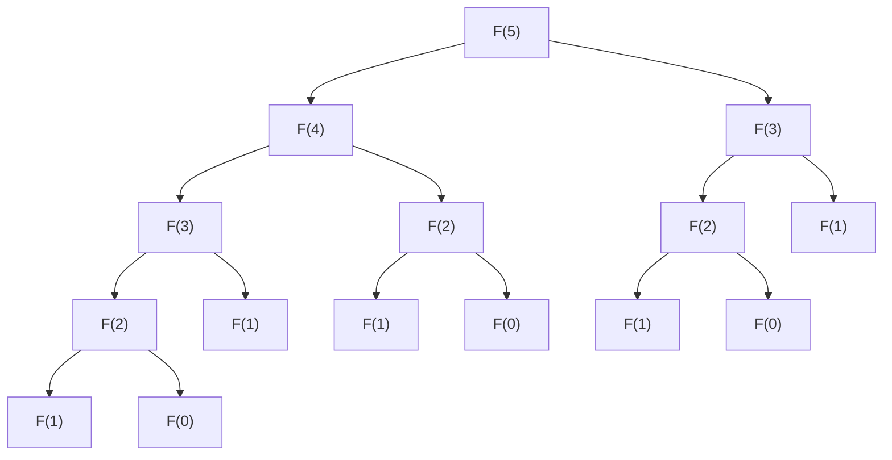

# 1. 引言

在推进编程和算法学习的过程中，许多学习者都会面临一个巨大的障碍。那就是 **动态规划** （Dynamic Programming，简称 **DP** ）。仅仅听到名字，可能会让人觉得“似乎很难”、“是不是需要专业的数学知识？”从而产生畏难情绪。但是，只要理解了其本质，就会发现DP是一种非常强大且直观的问题解决手法。

本文将从DP的基本概念出发，以代表性问题“斐波那契数列”和“背包问题”为例，彻底讲解其思考方式和实现方法。我们将结合Python代码，逐步加深理解。


# 2. 什么是动态规划（DP）？

动态规划（Dynamic Programming）是一种将复杂问题分割成多个小部分问题，并一边记录（备忘录）各个部分问题的解一边进行求解的手法。通过这种方法，可以省去重复相同计算的浪费，从而大幅缩短计算时间。

DP的核心在于以下2个特征。

1.  **最优子结构** （Optimal Substructure）：大问题的最优解可以由其小部分问题的最优解构成这一性质。
2.  **重叠子问题** （Overlapping Subproblems）：相同的小问题会多次重复出现这一性质。

对于具有这些特征的问题，DP能发挥出巨大的威力。

## DP的2种方法

DP大致可以分为2种实现方法。

### 1. 记忆化搜索（自顶向下方式）
从大问题出发，递归地调用小问题。在此过程中，将计算过一次的结果保存（记录）在数组或哈希表中，当同样的问题再次出现时，不进行重新计算，而是返回记录的值。

### 2. 自底向上方式（分治与填表）
从最小的问题开始依次计算解，并记录在数组（DP表）中。利用小问题的解逐渐解决大问题，最终获得所求问题的解。


# 3. 基础篇：通过斐波那契数列学习DP

作为理解DP概念的第一步，我们来探讨斐波那契数列。

斐波那契数列是按如下定义的数列。
$ F(0) = 0 $
$ F(1) = 1 $
$ F(n) = F(n-1) + F(n-2) \quad \text{对于 } n \ge 2 $

## 3.1 简单递归调用的陷阱

让我们按照定义用Python写一个函数。

```python
def fib_recursive(n):
    if n <= 0:
        return 0
    elif n == 1:
        return 1
    return fib_recursive(n-1) + fib_recursive(n-2)
```

这种实现非常直观，但存在一个大问题。那就是 **计算量呈指数级增长** 。让我们看看计算 $F(5)$ 时的函数调用树。



如您所见，$F(3)$ 和 $F(2)$ 被多次重复计算。计算量达到了 $O(2^n)$ ，当 $n$ 变大时，计算将无法在实际可用的时间内完成。

## 3.2 记忆化搜索（自顶向下方式）

省去这种浪费的就是 **记忆化** 。让我们把计算过一次的结果保存下来。

```python
def fib_memo(n, memo=None):
    if memo is None:
        memo = {}
    if n in memo:
        return memo[n]
    if n <= 0:
        return 0
    elif n == 1:
        return 1
    
    memo[n] = fib_memo(n-1, memo) + fib_memo(n-2, memo)
    return memo[n]
```

通过这种方式，每个 $F(i)$ 只会被计算一次，计算量将锐减至 $O(n)$ 。

## 3.3 自底向上方式（DP表）

为了避免递归调用的开销，从下向上依次进行计算的方法就是自底向上方式。

```python
def fib_dp(n):
    if n <= 0:
        return 0
    elif n == 1:
        return 1
        
    dp = [0] * (n + 1)
    dp[0] = 0
    dp[1] = 1
    
    for i in range(2, n + 1):
        dp[i] = dp[i-1] + dp[i-2]
        
    return dp[n]
```

准备一个数组 `dp` ，从索引较小的一端开始依次填充。这就是典型的DP表用法。


# 4. 应用篇：背包问题

当解决优化问题时，DP的真正价值得以展现。在这里，我们来考虑著名的“0-1背包问题”。

## 4.1 问题设定

假设你是一个小偷（这只是一个设定）。你有一个容量为 $W$ 的背包。面前有 $N$ 个物品，每个物品 $i$ 都有其对应的重量 $w_i$ 和价值 $v_i$ 。

请在不超过背包容量的范围内选择物品，使得带回的物品的 **总价值最大化** 。需要注意的是，每种物品只有一个，只能选择“拿（1）”或“不拿（0）”。

## 4.2 状态的定义与递推公式

在用DP解决问题时，最重要的是 **状态的定义** 和 **递推公式（状态转移方程）** 的推导。

我们将状态定义如下。
$dp[i][w]$ ：从前 $i$ 个物品中进行选择，在总重量不超过 $w$ 的情况下的最大价值。

在这里，当我们考虑第 $i$ 个物品（重量 $w_i$ ，价值 $v_i$ ）时，有以下2种选择。

1.  **不选择的情况** ：
    最大价值与前一个状态 $dp[i-1][w]$ 相同。
2.  **选择的情况** （前提是必须满足 $w \ge w_i$ ）：
    在容量减去 $w_i$ 后的状态上，加上物品 $i$ 的价值 $v_i$ 。即为 $dp[i-1][w - w_i] + v_i$ 。

因此，递推公式如下。

$$
dp[i][w] = 
\begin{cases}
\max(dp[i-1][w], dp[i-1][w - w_i] + v_i) & \text{如果 } w \ge w_i \\
dp[i-1][w] & \text{否则}
\end{cases}
$$

## 4.3 Python实现

我们将这个递推公式直接转化为程序代码。

```python
def knapsack(weights, values, W):
    N = len(weights)
    # DP表的初始化: (N+1) x (W+1) 的二维数组
    dp = [[0] * (W + 1) for _ in range(N + 1)]
    
    # 填充DP表
    for i in range(1, N + 1):
        for w in range(W + 1):
            if w >= weights[i-1]:
                # 取选择和不选择情况下的最大值
                dp[i][w] = max(dp[i-1][w], dp[i-1][w - weights[i-1]] + values[i-1])
            else:
                # 因超过容量无法选择的情况
                dp[i][w] = dp[i-1][w]
                
    return dp[N][W]
```

### DP表的推移

让我们追踪一下在某个例子中 `dp` 表的推移过程。

| $i$ \ $w$ | 0 | 1 | 2 | 3 | 4 | 5 |
|---|---|---|---|---|---|---|
| 0 | 0 | 0 | 0 | 0 | 0 | 0 |
| 1 | 0 | 0 | 3 | 3 | 3 | 3 |
| 2 | 0 | 2 | 3 | 5 | 5 | 5 |
| 3 | 0 | 2 | 3 | 5 | 6 | 7 |
| 4 | 0 | 2 | 3 | 5 | 6 | 7 |

像这样，从较小容量、较少物品数量的子问题开始依次求最优解，最终就能得出答案。


# 5. 深入理解DP的详细解说与算法探究

为了巩固对DP的理解，接触更多的例题并学习各种模式的状态转移是必不可少的。

## 5.1 编辑距离（莱文斯坦距离）

给定两个字符串 $S$ 和 $T$ ，求对 $S$ 进行“插入”、“删除”、“替换”操作，最少需要多少次才能将其转换为 $T$ 的问题。

### 递推公式

$$
dp[i][j] = 
\begin{cases}
dp[i-1][j-1] & \text{如果 } S[i-1] == T[j-1] \\
\min(dp[i][j-1], dp[i-1][j], dp[i-1][j-1]) + 1 & \text{否则}
\end{cases}
$$

## 5.2 空间复杂度的优化技术（原地更新）

在迄今为止的实现中，状态转移的计算使用了 $O(NW)$ 或 $O(MN)$ 的内存。但是，仔细观察递推公式会发现，在更新某个状态时往往只需要“上一行”的数据。

例如，利用背包问题的递推公式，可以将二维数组缩减为一维数组。在更新时，通过从右向左进行更新，可以防止在计算当前的 $i$ 时将 $i-1$ 的值覆盖掉的bug。

```python
def knapsack_optimized(weights, values, W):
    N = len(weights)
    dp = [0] * (W + 1)
    
    for i in range(N):
        # 通过逆序更新，只需一维数组
        for w in range(W, weights[i] - 1, -1):
            dp[w] = max(dp[w], dp[w - weights[i]] + values[i])
            
    return dp[W]
```


### 发展解说部分 1：DP的局限与算法选择

动态规划的优势在于避免了子结构的重叠，但这并不意味着所有问题都能被高速解决。例如，背包问题的计算量是 $O(NW)$ ，这乍一看像是多项式时间。但是，$W$ 是输入的“值”，相对于输入大小（比特数）它可能会呈现指数级的大小。这样的计算量被称为 **伪多项式时间** 。

如果 $W$ 非常大，仅仅是分配数组就会耗尽内存，循环次数也会变得极其庞大，因此这种DP方法将不再适用。在这种情况下，需要切换为针对总价值上限 $V$ 的DP，或者采用折半枚举（Meet in the Middle）等其他方法。

此外，在DP的调试中， **将小规模输入下手动计算的表格与程序输出的表格进行比较** 是最有效的方法。准备好纸和笔，实际画一下二维表格，“为什么是这个递推公式”、“哪里转移出错了”就会一目了然。

### 发展解说部分 40：DP的局限与算法选择

动态规划的优势在于避免了子结构的重叠，但这并不意味着所有问题都能被高速解决。例如，背包问题的计算量是 $O(NW)$ ，这乍一看像是多项式时间。但是，$W$ 是输入的“值”，相对于输入大小（比特数）它可能会呈现指数级的大小。这样的计算量被称为 **伪多项式时间** 。

如果 $W$ 非常大，仅仅是分配数组就会耗尽内存，循环次数也会变得极其庞大，因此这种DP方法将不再适用。在这种情况下，需要切换为针对总价值上限 $V$ 的DP，或者采用折半枚举（Meet in the Middle）等其他方法。

此外，在DP的调试中， **将小规模输入下手动计算的表格与程序输出的表格进行比较** 是最有效的方法。准备好纸和笔，实际画一下二维表格，“为什么是这个递推公式”、“哪里转移出错了”就会一目了然。

# 6. 结语

刚开始时，动态规划（DP）可能会让人觉得难以入门。但是，从斐波那契数列中“排除无效计算”这一直观理解出发，通过循序渐进地学习诸如背包问题中的“状态与转移的定义”，您一定能够掌握它。

**“如何定义状态”**
**“该状态可以从怎样的小状态计算得来（递推公式）”**

要培养洞察这两点的能力，最好的捷径就是接触大量问题，并亲自动手画DP表。请务必将本文学到的知识作为武器，去迎接挑战吧。
