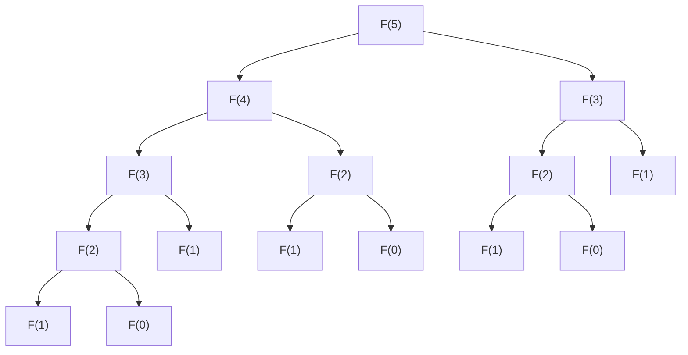

# 1. 前言

在學習程式設計與演算法的過程中，許多學習者會面臨一道巨大的難關。那就是 **動態規劃** （Dynamic Programming，簡稱 **DP** ）。光聽名字，可能會讓人產生「好像很難」、「是不是需要專業的數學知識？」等防備心。然而，只要理解其本質，就會發現 DP 是非常強大，且相當直觀的解決問題手法。

本文將從 DP 的基本概念出發，以代表性的問題「費氏數列」與「背包問題」為例，徹底解說其思考方式與實作方法。我們將交織 Python 的程式碼，循序漸進地加深理解。


# 2. 什麼是動態規劃（DP）？

動態規劃（Dynamic Programming）是一種將複雜問題分割為多個較小的子問題，並在記錄（記憶）各個子問題解答的同時，推進求解的手法。如此一來，便能省去重複相同計算的浪費，大幅縮短計算時間。

DP 的核心在於以下 2 個特徵。

1.  **最佳子結構** （Optimal Substructure）：大問題的最佳解，可以由其較小子問題的最佳解所構成的性質。
2.  **重疊子問題** （Overlapping Subproblems）：相同的較小問題會多次重複出現的性質。

對於具有這些特徵的問題，DP 能發揮極大的威力。

## DP 的 2 種作法

DP 大致可分為 2 種實作作法。

### 1. 記憶化遞迴（由上而下方式）
從大問題出發，遞迴地呼叫較小的問題。此時，將計算過一次的結果儲存（記憶）於陣列或雜湊表中，當相同問題再次出現時，不再重新計算，而是回傳記憶的值。

### 2. 由下而上方式（分治法與表格填寫）
從最小的問題開始依序計算解答，並記錄於陣列（DP 表格）中。利用較小問題的解答來逐漸解開較大的問題，最終得出想求之問題的解。


# 3. 基礎篇：透過費氏數列學習 DP

作為理解 DP 概念的第一步，我們來探討費氏數列。

費氏數列是如下定義的數列。
$ F(0) = 0 $
$ F(1) = 1 $
$ F(n) = F(n-1) + F(n-2) \quad \text{對於 } n \ge 2 $

## 3.1 單純遞迴呼叫的陷阱

讓我們照著定義，用 Python 寫出函式吧。

```python
def fib_recursive(n):
    if n <= 0:
        return 0
    elif n == 1:
        return 1
    return fib_recursive(n-1) + fib_recursive(n-2)
```

這個實作很直觀，但有個大問題。那就是 **計算複雜度會呈指數函數增加** 。讓我們看看計算 $F(5)$ 時的函式呼叫樹狀圖吧。



如您所見，$F(3)$ 與 $F(2)$ 被重複計算了許多次。計算複雜度為 $O(2^n)$ ，當 $n$ 變大時，便無法在實用的時間內計算完畢。

## 3.2 記憶化遞迴（由上而下方式）

能省去這種浪費的就是 **記憶化** 。讓我們將計算過一次的結果儲存起來吧。

```python
def fib_memo(n, memo=None):
    if memo is None:
        memo = {}
    if n in memo:
        return memo[n]
    if n <= 0:
        return 0
    elif n == 1:
        return 1
    
    memo[n] = fib_memo(n-1, memo) + fib_memo(n-2, memo)
    return memo[n]
```

藉此，各個 $F(i)$ 都只會被計算一次，計算複雜度劇減至 $O(n)$ 。

## 3.3 由下而上方式（DP 表格）

為了避免遞迴呼叫的額外負擔，由下依序計算上去的就是由下而上方式。

```python
def fib_dp(n):
    if n <= 0:
        return 0
    elif n == 1:
        return 1
        
    dp = [0] * (n + 1)
    dp[0] = 0
    dp[1] = 1
    
    for i in range(2, n + 1):
        dp[i] = dp[i-1] + dp[i-2]
        
    return dp[n]
```

準備陣列 `dp` ，從索引值較小的地方開始依序填寫。這就是典型的 DP 表格用法。


# 4. 應用篇：背包問題

DP 的真本事，會在求解最佳化問題時發揮出來。在此我們來思考著名的「0-1 背包問題」。

## 4.1 問題設定

您是一名小偷（這是一個情境設定）。您有一個容量為 $W$ 的背包。眼前有 $N$ 個物品，各個物品 $i$ 皆設定了重量 $w_i$ 與價值 $v_i$ 。

請在不超過背包容量的範圍內挑選物品，將帶回去的物品 **價值總和最大化** 。不過，各物品都只有 1 個，只能選擇「挑選（1）」或「不挑選（0）」。

## 4.2 狀態的定義與遞迴關係式

利用 DP 解題時，最重要的是 **狀態的定義** 與 **遞迴關係式（狀態轉移方程式）** 的推導。

狀態定義如下。
$dp[i][w]$ ：從最初的 $i$ 個物品中，挑選重量總和在 $w$ 以下時的價值最大值。

在此，當考慮第 $i$ 個物品（重量 $w_i$ 、價值 $v_i$ ）時，有以下 2 種選項。

1.  **不挑選的情況**：
    價值最大值與前一個狀態 $dp[i-1][w]$ 相同。
2.  **挑選的情況**（但僅限於 $w \ge w_i$ 的情況）：
    在容量扣除 $w_i$ 的狀態中，加上物品 $i$ 的價值 $v_i$ 。亦即，$dp[i-1][w - w_i] + v_i$ 。

因此，遞迴關係式如下所示。

$$
dp[i][w] = 
\begin{cases}
\max(dp[i-1][w], dp[i-1][w - w_i] + v_i) & \text{如果 } w \ge w_i \\
dp[i-1][w] & \text{其他情況}
\end{cases}
$$

## 4.3 Python 實作

將這個遞迴關係式直接落實為程式。

```python
def knapsack(weights, values, W):
    N = len(weights)
    # DP 表格的初始化：(N+1) x (W+1) 的二維陣列
    dp = [[0] * (W + 1) for _ in range(N + 1)]
    
    # 填寫 DP 表格
    for i in range(1, N + 1):
        for w in range(W + 1):
            if w >= weights[i-1]:
                # 取得挑選與不挑選情況中的最大值
                dp[i][w] = max(dp[i-1][w], dp[i-1][w - weights[i-1]] + values[i-1])
            else:
                # 因超過容量而無法挑選的情況
                dp[i][w] = dp[i-1][w]
                
    return dp[N][W]
```

### DP 表格的推移

讓我們追蹤某個範例中 `dp` 表格的推移吧。

| $i$ \ $w$ | 0 | 1 | 2 | 3 | 4 | 5 |
|---|---|---|---|---|---|---|
| 0 | 0 | 0 | 0 | 0 | 0 | 0 |
| 1 | 0 | 0 | 3 | 3 | 3 | 3 |
| 2 | 0 | 2 | 3 | 5 | 5 | 5 |
| 3 | 0 | 2 | 3 | 5 | 6 | 7 |
| 4 | 0 | 2 | 3 | 5 | 6 | 7 |

像這樣，從容量小、物品數量少的子問題開始依序求出最佳解，最終便能得出答案。


# 5. 為深入理解 DP 的詳細解說與演算法探討

為了鞏固對 DP 的理解，多接觸各種例題，學習各種模式的狀態轉移是不可或缺的。

## 5.1 編輯距離（萊文斯坦距離）

當給定兩個字串 $S$ 與 $T$ 時，求出最少需要對 $S$ 進行幾次「插入」、「刪除」、「替換」操作才能轉換為 $T$ 的問題。

### 遞迴關係式

$$
dp[i][j] = 
\begin{cases}
dp[i-1][j-1] & \text{如果 } S[i-1] == T[j-1] \\
\min(dp[i][j-1], dp[i-1][j], dp[i-1][j-1]) + 1 & \text{其他情況}
\end{cases}
$$

## 5.2 空間複雜度最佳化技術（原地更新）

在至今為止的實作中，我們使用了 $O(NW)$ 或 $O(MN)$ 的記憶體來計算狀態轉移。然而，只要仔細觀察遞迴關係式，就會發現某個狀態的更新，通常只需要「前一列」即可。

例如，利用背包問題的遞迴關係式，可以將二維陣列縮減為一維陣列。更新時，藉由由右至左進行更新，可以防止在計算目前的 $i$ 時，覆寫掉 $i-1$ 之值的錯誤。

```python
def knapsack_optimized(weights, values, W):
    N = len(weights)
    dp = [0] * (W + 1)
    
    for i in range(N):
        # 藉由反向更新，只需一維陣列即可
        for w in range(W, weights[i] - 1, -1):
            dp[w] = max(dp[w], dp[w - weights[i]] + values[i])
            
    return dp[W]
```


### 發展解說部分 1：DP 的極限與演算法選擇

動態規劃的優勢在於避免子結構的重複，但即便如此，並非所有問題都能快速求解。例如，背包問題的計算複雜度為 $O(NW)$ ，這乍看之下像是多項式時間。然而，$W$ 是輸入的「值」，相對於輸入大小（位元數），它可能會是指數級的大小。我們將這種計算複雜度稱為 **虛擬多項式時間** 。

如果 $W$ 非常大，光是確保陣列就會耗盡記憶體，迴圈次數也會變得非常龐大，因此將無法適用這種 DP 手法。在這種情況下，就必須切換成針對價值總和上限 $V$ 的 DP ，或是採用折半枚舉（Meet in the Middle）等其他作法。

此外，在 DP 的除錯中， **將透過小規模輸入手動計算的表格與程式輸出的表格進行比較** 是最有效的。準備紙筆，實際畫出二維表格，就能清楚明瞭地知道「為什麼會變成這個遞迴關係式」、「在何處弄錯了轉移」。

### 發展解說部分 40：DP 的極限與演算法選擇

動態規劃的優勢在於避免子結構的重複，但即便如此，並非所有問題都能快速求解。例如，背包問題的計算複雜度為 $O(NW)$ ，這乍看之下像是多項式時間。然而，$W$ 是輸入的「值」，相對於輸入大小（位元數），它可能會是指數級的大小。我們將這種計算複雜度稱為 **虛擬多項式時間** 。

如果 $W$ 非常大，光是確保陣列就會耗盡記憶體，迴圈次數也會變得非常龐大，因此將無法適用這種 DP 手法。在這種情況下，就必須切換成針對價值總和上限 $V$ 的 DP ，或是採用折半枚舉（Meet in the Middle）等其他作法。

此外，在 DP 的除錯中， **將透過小規模輸入手動計算的表格與程式輸出的表格進行比較** 是最有效的。準備紙筆，實際畫出二維表格，就能清楚明瞭地知道「為什麼會變成這個遞迴關係式」、「在何處弄錯了轉移」。

# 6. 結語

動態規劃（DP）一開始可能會讓人覺得難以親近。然而，從費氏數列中「排除無謂的計算」這種直觀的理解出發，並循序漸進地邁向如背包問題的「狀態與轉移的定義」，就必定能夠熟練掌握。

**「該如何定義狀態」**
**「該狀態可以從什麼樣的較小狀態計算出來（遞迴關係式）」**

要培養出看透這 2 點的能力，最好的捷徑就是多接觸問題，並親手畫出 DP 表格。請務必以本文中學到的知識為武器，試著挑戰看看。
