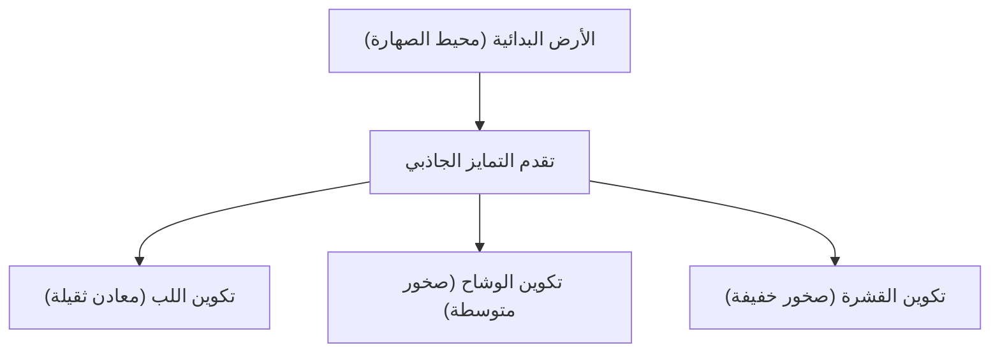

## مقدمة: الأرض كمصنع كيميائي عملاق

الأرض التي تمتد تحت أقدامنا. للوهلة الأولى قد تبدو ككتلة صخرية صامتة، لكن باطنها عبارة عن مصنع كيميائي ديناميكي مستمر في النشاط. منذ ولادة الأرض قبل حوالي 4.6 مليار سنة، تطورت عبر فترات زمنية هائلة لتصل إلى شكلها الحالي.

في هذا المقال، سنلقي نظرة عامة على التركيب العنصري للأرض بأكملها، ونتعمق في كيفية تشكل البنية ثلاثية الطبقات: القشرة، الوشاح، واللب (اللب الخارجي واللب الداخلي)، وما هي المكونات التي تتكون منها كل طبقة. من ولادة النجوم إلى تمايز المواد، وصولاً إلى تكوين السطح الغني الذي نعيش عليه، دعونا نكشف عن أصل كوكب الأرض من منظور كيميائي.

## التركيب العنصري الكلي للأرض: الأربعة الكبار (العناصر الأربعة الرئيسية)

إذا تمكنا من وضع الأرض في خلاط عملاق وتحطيمها إلى قطع صغيرة، ثم تحليل مكوناتها، فما هي النتائج التي سنحصل عليها؟ في الواقع، عدد أنواع العناصر التي تتكون منها الأرض ليس كبيراً جداً. يتكون الجزء الأكبر من كتلتها من أربعة عناصر فقط.

1. **الحديد (Fe)**: حوالي 32.1%
2. **الأكسجين (O)**: حوالي 30.1%
3. **السيليكون (Si)**: حوالي 15.1%
4. **المغنيسيوم (Mg)**: حوالي 13.9%

تشكل هذه العناصر الأربعة وحدها **أكثر من 90%** من إجمالي كتلة الأرض. وتتكون النسبة المتبقية البالغة حوالي 10% من عناصر نادرة مثل الكبريت (2.9%)، والنيكل (1.8%)، والكالسيوم (1.5%)، والألومنيوم (1.4%).

### لماذا يكثر الحديد والأكسجين؟

يعود سبب كون الحديد هو العنصر الأكثر وفرة في الأرض بأكملها إلى عملية تكوين النظام الشمسي. في تفاعلات الاندماج النووي التي تحدث داخل النجوم، يمتلك الحديد النواة الذرية الأكثر استقراراً. لذلك، كانت المواد المتناثرة في الفضاء بسبب انفجارات المستعرات الأعظمية غنية بالحديد. وعندما تشكلت الأرض، تجمعت هذه الكواكب المصغرة المحتوية على الحديد، مما أدى إلى وجود كميات كبيرة من الحديد على الأرض.

من ناحية أخرى، يعد الأكسجين ثالث أكثر العناصر وفرة في الكون، ويرتبط بسهولة بالسيليكون والمغنيسيوم والحديد التي تتكون منها الصخور، لذلك تم دمجه بكميات كبيرة كأكاسيد (صخور).

## بنية الأرض: تاريخ التمايز

كانت الأرض في بداياتها عبارة عن "محيط من الصهارة" المذابة بسبب حرارة الاصطدامات مع الكواكب المصغرة وحرارة اضمحلال النظائر المشعة. في هذه الحالة السائلة ذات درجات الحرارة العالية، حدثت ظاهرة تسمى "**التمايز الجاذبي**".

غاصت المواد الثقيلة (بشكل رئيسي الحديد والنيكل) لتشكل مركز الأرض (اللب)، بينما طفت المواد الخفيفة (مثل السيليكات) لتشكل الوشاح والقشرة. أدى هذا التمايز إلى إنشاء البنية الطبقية الحالية للأرض.

دعونا نلقي نظرة فاحصة على كل طبقة.

## اللب (النواة): كرة حديدية عملاقة في مركز الأرض

يقع اللب في مركز الأرض، على عمق يتراوح بين 2,900 كم و 6,371 كم تقريباً من السطح. يمثل اللب حوالي 32% من الكتلة الإجمالية للأرض، ويتكون أساساً من سبيكة من الحديد والنيكل.

ينقسم اللب بدوره إلى جزأين: **اللب الخارجي** و**اللب الداخلي**.

### اللب الخارجي (Outer Core)

يقع اللب الخارجي على عمق يتراوح بين 2,900 كم و 5,150 كم تقريباً. درجة الحرارة هناك مرتفعة جداً (حوالي 4,000 إلى 5,000 درجة مئوية)، ويكون الحديد والنيكل في حالة **سائلة** ذائبة.

يُعتقد أن المجال المغناطيسي للأرض (الجيومغناطيسية) ينشأ عن طريق الحمل الحراري للمعادن السائلة في اللب الخارجي (نظرية الدينامو). يلعب هذا المجال المغناطيسي دوراً مهماً للغاية في حماية الحياة على الأرض من الأشعة الكونية الضارة والرياح الشمسية. بالإضافة إلى ذلك، يُقدر أن اللب الخارجي يحتوي على حوالي 10% من العناصر الخفيفة الذائبة مثل الكبريت والأكسجين والسيليكون، إلى جانب الحديد والنيكل.

### اللب الداخلي (Inner Core)

اللب الداخلي هو المنطقة الممتدة من عمق 5,150 كم تقريباً إلى مركز الأرض (6,371 كم). درجة الحرارة هنا أعلى من اللب الخارجي (حوالي 5,000 إلى 6,000 درجة مئوية، مما يضاهي درجة حرارة سطح الشمس)، ومع ذلك، فإنه يحافظ على حالة **صلبة**.

ويرجع ذلك إلى أن الضغط يزداد بشكل حاد كلما اتجهنا نحو المركز (حوالي 3.3 مليون إلى 3.6 مليون ضغط جوي)، وتحت بيئة الضغط الفائق، ترتفع نقطة انصهار الحديد. ومع التبريد المستمر للأرض ككل، يتصلب الحديد السائل في اللب الخارجي تدريجياً، ويُعتقد أن اللب الداخلي يستمر في النمو بمعدل حوالي 1 ملم سنوياً.

## الوشاح: طبقة صخرية ضخمة تشكل معظم الأرض

يمتد الوشاح تحت القشرة، من عمق عشرات الكيلومترات إلى حوالي 2,900 كيلومتر. الوشاح هو أكبر طبقة في الأرض، حيث يشكل حوالي 84% من حجم الأرض وحوالي 67% من كتلتها.

غالباً ما يُساء فهم الوشاح على أنه بحر من الصهارة المنصهرة، ولكنه في الواقع يتكون من **صخور صلبة**. المكونات الرئيسية هي "**معادن السيليكات**" المكونة من السيليكون والأكسجين والمغنيسيوم والحديد وغيرها. يتكون الوشاح العلوي بشكل خاص من صخر يسمى البيريدوتيت (يتكون من الزبرجد الزيتوني والبيروكسين).

### الحمل الحراري للوشاح كحركة عملاقة

على الرغم من أن الوشاح صلب، إلا أنه يتدفق ببطء شديد مثل الشراب (تشوه لدن) عند النظر إليه على مقياس زمني جيولوجي طويل يمتد لعشرات الآلاف إلى مئات الملايين من السنين. ولإطلاق حرارة باطن الأرض (الحرارة من اللب وحرارة اضمحلال العناصر المشعة) إلى السطح، يخضع الوشاح لحركة حمل حراري ضخمة.

إن الحمل الحراري للوشاح هو القوة الدافعة التي تحرك الصفائح (الكتل الصخرية) على السطح، وهو السبب الجذري لتشوهات القشرة الأرضية مثل الزلازل والنشاط البركاني وحركات بناء الجبال.

## القشرة: القشرة الرقيقة التي نعيش عليها

الطبقة الخارجية الأرق التي تغطي سطح الأرض هي "القشرة". مقارنة بنصف قطر الأرض (حوالي 6,371 كم)، فإن سمك القشرة لا يتجاوز 5 إلى 70 كم فقط. وإذا شبهنا الأرض بالتفاحة، فإن هذه الطبقة أرق من قشرتها.

تشكلت القشرة من تركز العناصر الأخف وزناً من الوشاح (مثل السيليكون والألومنيوم والكالسيوم والصوديوم والبوتاسيوم). على الرغم من أنها تشكل أقل من 1% من إجمالي كتلة الأرض، إلا أنها مكان حيوي يتواجد فيه تنوع من العناصر الضرورية للحياة.

بالنظر إلى تركيب القشرة (أرقام كلارك)، فإن الأكسجين (حوالي 46.6%) والسيليكون (حوالي 27.7%) هما الأكثر وفرة بشكل ساحق، ويشكلان معاً حوالي ثلاثة أرباع كتلة القشرة. يليهما الألومنيوم (حوالي 8.1%) والحديد (حوالي 5.0%).

تنقسم القشرة بشكل رئيسي إلى نوعين:

### القشرة القارية

هذا هو الجزء الذي يشكل الأساس للأرض اليابسة التي نعيش عليها. يبلغ متوسط سمكها حوالي 30 إلى 40 كم (وتصل إلى 70 كم في الأماكن الأكثر سمكاً مثل هضبة التبت). المكون الرئيسي هو صخور السيليكات مثل الجرانيت، ولأنها غنية بالسيليكون (Si) والألومنيوم (Al)، يطلق عليها أيضاً اسم "**سيال (SiAl)**". كثافتها خفيفة نسبياً وتبلغ حوالي 2.7 جم/سم³.

### القشرة المحيطية

هذه هي القشرة التي تشكل قاع المحيط. وهي رقيقة حيث يبلغ سمكها حوالي 5 إلى 10 كم، ومكونها الرئيسي هو البازلت. ولأنها غنية بالسيليكون (Si) والمغنيسيوم (Mg)، يطلق عليها أيضاً اسم "**سيما (SiMa)**". ونظراً لاحتوائها على حديد ومغنيسيوم أكثر من القشرة القارية، فإن كثافتها أثقل وتبلغ حوالي 3.0 جم/سم³.

## خاتمة: التوازن المعجزة الذي يغذي الحياة

تقوم الأرض على توازن دقيق بين المجال المغناطيسي القوي الناتج عن اللب الحديدي، والنشاط التكتوني النشط للقشرة الناتج عن تدفق الوشاح، والقشرة التي تركزت فيها مجموعة متنوعة من العناصر.

لو كان الحديد أقل ولم يكن هناك مجال مغناطيسي، لكانت الحياة قد احترقت بالأشعة الكونية. ولو لم يكن هناك حمل حراري في الوشاح ولا نشاط تكتوني، لما تم تدوير العناصر الغذائية، وربما كان تطور الحياة سيتوقف.

تحت الأرض التي نقف عليها بشكل طبيعي كل يوم، يكمن تاريخ هائل يمتد لـ 4.6 مليار سنة ودراما كونية. إن معرفة البنية الداخلية للأرض هي دليل مهم لمعرفة سبب قدرتنا على العيش على هذا الكوكب.
