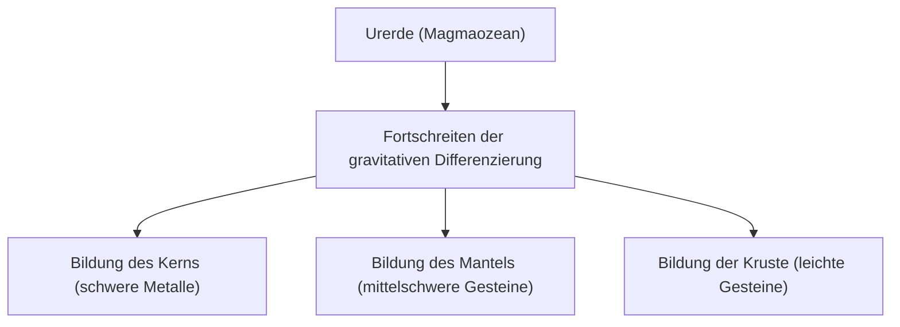

## Einleitung: Die Erde als riesige chemische Fabrik

Die Erde, die sich unter unseren Füßen erstreckt, mag auf den ersten Blick wie ein stiller Felsbrocken erscheinen, doch ihr Inneres ist eine dynamische chemische Fabrik, die ständig in Bewegung ist. Seit ihrer Entstehung vor etwa 4,6 Milliarden Jahren hat sich die Erde über einen unvorstellbaren Zeitraum hinweg zu ihrer heutigen Form entwickelt.

In diesem Artikel werfen wir einen Blick auf die elementare Zusammensetzung der gesamten Erde und gehen der Frage auf den Grund, wie die dreischichtige Struktur aus Kruste, Mantel und Kern (äußerer und innerer Kern) entstanden ist und aus welchen Bestandteilen sie jeweils besteht. Von der Geburt des Sterns über die Differenzierung der Materie bis hin zur Entstehung der reichen Erdoberfläche, auf der wir leben, wollen wir die Entstehungsgeschichte unseres Planeten aus der Perspektive der Chemie entschlüsseln.

## Die elementare Zusammensetzung der gesamten Erde: Die Großen Vier (Big Four)

Wenn wir die Erde in einem riesigen Mixer zerkleinern und ihre Bestandteile analysieren könnten, welches Ergebnis würden wir erhalten? Tatsächlich ist die Anzahl der Elemente, aus denen die Erde besteht, gar nicht so groß. Der Großteil der Masse wird von nur vier Elementen eingenommen.

1. **Eisen (Fe)**: ca. 32,1%
2. **Sauerstoff (O)**: ca. 30,1%
3. **Silizium (Si)**: ca. 15,1%
4. **Magnesium (Mg)**: ca. 13,9%

Diese vier Elemente allein machen **mehr als 90%** der Gesamtmasse der Erde aus. Die restlichen rund 10% bestehen aus Spurenelementen wie Schwefel (2,9%), Nickel (1,8%), Calcium (1,5%) und Aluminium (1,4%).

### Warum gibt es so viel Eisen und Sauerstoff?

Der Grund, warum Eisen das häufigste Element auf der gesamten Erde ist, geht auf die Entstehungsgeschichte des Sonnensystems zurück. Bei den Kernfusionsreaktionen im Inneren von Sternen besitzt Eisen den stabilsten Atomkern. Daher war das Material, das durch Supernova-Explosionen im Weltraum verteilt wurde, reich an Eisen. Als sich die Erde bildete, sammelten sich diese eisenhaltigen Planetesimale an, was dazu führte, dass große Mengen an Eisen auf der Erde vorhanden sind.

Sauerstoff hingegen ist das dritthäufigste Element im Universum. Da er sich leicht mit gesteinsbildenden Elementen wie Silizium, Magnesium und Eisen verbindet, wurde er in großen Mengen als Oxide (Gesteine) gebunden.

## Die Struktur der Erde: Die Geschichte der Differenzierung

Die frühe Erde befand sich durch die Hitze von Planetesimal-Einschlägen und die Zerfallswärme radioaktiver Isotope in einem geschmolzenen "Magmaozean"-Zustand. In diesem heißen, flüssigen Zustand fand ein Phänomen statt, das "**gravitative Differenzierung**" genannt wird.

Schwere Materialien (hauptsächlich Eisen und Nickel) sanken ab, um das Zentrum (den Kern) der Erde zu bilden, während leichtere Materialien (wie Silikate) aufstiegen, um den Mantel und die Kruste zu bilden. Durch diese Differenzierung entstand die heutige Schalenstruktur der Erde.

Lassen Sie uns nun jede Schicht genauer betrachten.

## Der Kern: Die riesige Eisenkugel im Zentrum der Erde

Der Kern befindet sich im Zentrum der Erde, in einer Tiefe von etwa 2.900 km bis 6.371 km unter der Erdoberfläche. Der Kern macht etwa 32% der Gesamtmasse der Erde aus und besteht hauptsächlich aus einer Legierung aus Eisen und Nickel.

Der Kern wird weiter in zwei Teile unterteilt: den **äußeren Kern** und den **inneren Kern**.

### Äußerer Kern (Outer Core)

Der äußere Kern befindet sich in einer Tiefe von etwa 2.900 km bis 5.150 km. Die Temperatur ist extrem hoch (etwa 4.000 bis 5.000°C), weshalb Eisen und Nickel in einem geschmolzenen, **flüssigen** Zustand vorliegen.

Man geht davon aus, dass die Konvektion des flüssigen Metalls im äußeren Kern das Magnetfeld der Erde (Geomagnetismus) erzeugt (Dynamotheorie). Dieses Magnetfeld spielt eine äußerst wichtige Rolle, da es das Leben auf der Erde vor schädlicher kosmischer Strahlung und dem Sonnenwind schützt. Außerdem wird geschätzt, dass neben Eisen und Nickel auch etwa 10% leichtere Elemente wie Schwefel, Sauerstoff und Silizium im äußeren Kern gelöst sind.

### Innerer Kern (Inner Core)

Der innerer Kern reicht von einer Tiefe von etwa 5.150 km bis zum Erdmittelpunkt (6.371 km). Obwohl die Temperatur noch höher ist als im äußeren Kern (etwa 5.000 bis 6.000°C, vergleichbar mit der Oberflächentemperatur der Sonne), bleibt er in einem **festen** Zustand.

Das liegt daran, dass der Druck zur Mitte hin drastisch ansteigt (etwa 3,3 bis 3,6 Millionen Atmosphären) und der Schmelzpunkt von Eisen unter ultrahohen Druckbedingungen steigt. Man nimmt an, dass auch heute noch, während die Erde insgesamt abkühlt, das flüssige Eisen des äußeren Kerns allmählich erstarrt und der innere Kern mit einer Geschwindigkeit von etwa 1 mm pro Jahr weiter wächst.

## Der Mantel: Die riesige Gesteinsschicht, die den größten Teil der Erde ausmacht

Unterhalb der Erdkruste erstreckt sich in einer Tiefe von einigen Dutzend bis etwa 2.900 km der Mantel. Der Mantel ist die größte Schicht der Erde und macht etwa 84% ihres Volumens sowie rund 67% ihrer Masse aus.

Es ist ein weit verbreitetes Missverständnis, dass der Mantel ein Meer aus geschmolzenem Magma sei; in Wirklichkeit besteht er aus **festem Gestein**. Die Hauptbestandteile sind "**Silikatminerale**", die aus Silizium, Sauerstoff, Magnesium, Eisen und anderen Elementen bestehen. Insbesondere der obere Mantel besteht aus einem Gestein namens Peridotit (Olivin und Pyroxen).

### Mantelkonvektion: Eine gewaltige Bewegung

Obwohl der Mantel fest ist, fließt er auf langen geologischen Zeitskalen von Zehntausenden bis Hunderten von Millionen Jahren langsam wie zäher Sirup (plastische Verformung). Um die im Erdinneren vorhandene Wärme (Wärme aus dem Kern und Zerfallswärme radioaktiver Elemente) an die Oberfläche abzugeben, durchläuft der Mantel eine riesige Konvektionsbewegung.

Diese Mantelkonvektion ist die treibende Kraft, die die Erdplatten (Gesteinsplatten) an der Oberfläche bewegt, und die grundlegende Ursache für tektonische Aktivitäten wie Erdbeben, Vulkanismus und Gebirgsbildung.

## Die Kruste: Die dünne Schale, auf der wir leben

Die äußerste, dünne Schicht, die die Erdoberfläche bedeckt, ist die "Kruste". Im Verhältnis zum Radius der Erde (etwa 6.371 km) ist die Kruste nur 5 bis 70 km dick. Verglichen mit einem Apfel ist diese Schicht dünner als dessen Schale.

Die Kruste wurde gebildet, als sich noch leichtere Elemente (wie Silizium, Aluminium, Calcium, Natrium, Kalium usw.) aus dem Mantel konzentrierten. Obwohl sie weniger als 1% der Gesamtmasse der Erde ausmacht, ist sie ein wichtiger Ort, an dem sich eine Vielzahl von Elementen befindet, die für das Leben unerlässlich sind.

Betrachtet man die Zusammensetzung der Kruste (Clarke-Wert), so sind Sauerstoff (etwa 46,6%) und Silizium (etwa 27,7%) überwältigend häufig; diese beiden machen etwa drei Viertel der Masse der Kruste aus. Es folgen Aluminium (etwa 8,1%) und Eisen (etwa 5,0%).

Die Kruste kann grob in zwei Typen unterteilt werden.

### Kontinentale Kruste

Dies ist der Teil, der das Fundament der Landmassen bildet, auf denen wir leben. Ihre durchschnittliche Dicke beträgt etwa 30 bis 40 km (an dicken Stellen wie dem tibetischen Plateau bis zu 70 km). Ihr Hauptbestandteil sind Silikatgesteine wie Granit. Da sie reich an Silizium (Si) und Aluminium (Al) ist, wird sie auch "**Sial (SiAl)**" genannt. Mit etwa 2,7 g/cm³ ist ihre Dichte relativ gering.

### Ozeanische Kruste

Dies ist die Kruste, die den Meeresboden bildet. Sie ist mit etwa 5 bis 10 km eher dünn und besteht hauptsächlich aus Basalt. Weil sie reich an Silizium (Si) und Magnesium (Mg) ist, wird sie auch "**Sima (SiMa)**" genannt. Da sie mehr Eisen und Magnesium enthält als die kontinentale Kruste, ist ihre Dichte mit etwa 3,0 g/cm³ höher.

## Schlusswort: Das wundersame Gleichgewicht, das Leben fördert

Die Erde beruht auf einem faszinierenden Gleichgewicht: einem starken Magnetfeld, das durch den Eisenkern erzeugt wird, aktiver Tektonik durch den fließenden Mantel und einer Kruste, in der sich vielfältige Elemente konzentrieren.

Wäre weniger Eisen vorhanden und gäbe es kein Magnetfeld, wäre das Leben wahrscheinlich durch kosmische Strahlung verbrannt worden. Gäbe es keine Mantelkonvektion und tektonische Aktivitäten, würden Nährstoffe nicht zirkulieren, und die Evolution des Lebens wäre möglicherweise stagniert.

Unter dem Boden, auf den wir so selbstverständlich treten, verbergen sich eine unvorstellbare Geschichte von 4,6 Milliarden Jahren sowie das Drama des Universums. Die innere Struktur der Erde zu verstehen, ist ein entscheidender Schlüssel, um zu begreifen, warum wir auf diesem Planeten leben können.
