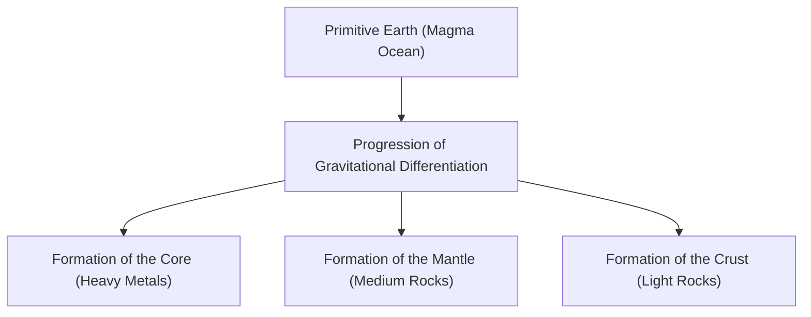

## Introduction: The Earth as a Giant Chemical Factory

The Earth beneath our feet. At first glance, it might seem like a quiet lump of rock, but its interior is a dynamic chemical factory constantly in action. Approximately 4.6 billion years have passed since the Earth was born, evolving over an immense period into its present form.

In this article, we will take a broad view of the overall elemental composition of the Earth and delve deeply into how the three-layer structure of the crust, mantle, and core (outer and inner core) was formed, and what components make up each layer. From the birth of stars to the differentiation of matter, and finally to the formation of the rich surface where we live, let's unravel the origins of our planet from a chemical perspective.

## The Earth's Overall Elemental Composition: The Big Four

If we could put the Earth into a giant blender, crush it to pieces, and analyze its composition, what results would we get? Surprisingly, there are not many types of elements that make up the Earth. The vast majority of its mass is dominated by just four elements.

1. **Iron (Fe)**: Approximately 32.1%
2. **Oxygen (O)**: Approximately 30.1%
3. **Silicon (Si)**: Approximately 15.1%
4. **Magnesium (Mg)**: Approximately 13.9%

These four elements alone account for **over 90%** of the Earth's total mass. The remaining approximately 10% consists of trace elements such as sulfur (2.9%), nickel (1.8%), calcium (1.5%), and aluminum (1.4%).

### Why is there so much iron and oxygen?

The reason why iron is the most abundant element in the entire Earth dates back to the formation process of the solar system. In the nuclear fusion reactions taking place inside stars, iron has the most stable atomic nucleus. Therefore, the matter scattered into space by supernova explosions was rich in iron. When the Earth was formed, planetesimals containing these irons aggregated, resulting in a large amount of iron present on Earth.

On the other hand, oxygen is the third most abundant element in the universe. Since it easily combines with elements like silicon, magnesium, and iron that make up rocks, it was taken in in large quantities as oxides (rocks).

## The Earth's Structure: A History of Differentiation

The early Earth was in a state of a molten "magma ocean" due to the heat from planetesimal impacts and the decay heat of radioactive isotopes. Within this high-temperature liquid state, a phenomenon called "**gravitational differentiation**" occurred.

Heavy substances (mainly iron and nickel) sank to form the center of the Earth (core), while lighter substances (such as silicates) rose to form the mantle and crust. This differentiation created the layered structure of the present Earth.

Now, let's take a closer look at each layer.

## The Core: A Giant Iron Sphere at the Center of the Earth

Located at a depth of about 2,900 km to 6,371 km from the Earth's surface, in the central part of the Earth, is the core. The core accounts for about 32% of the Earth's total mass and is primarily made of an alloy of iron and nickel.

The core is further divided into two parts: the **outer core** and the **inner core**.

### Outer Core

The outer core is located at a depth of about 2,900 km to 5,150 km. The temperature is extremely high (about 4,000 to 5,000°C), and it is in a **liquid** state where iron and nickel are melted.

It is believed that the convection of liquid metal in the outer core generates the Earth's magnetic field (geomagnetism) (dynamo theory). This magnetic field plays a crucial role in protecting life on Earth from harmful cosmic rays and solar wind. Additionally, it is estimated that about 10% of light elements such as sulfur, oxygen, and silicon are dissolved in the outer core along with iron and nickel.

### Inner Core

The inner core is the region from a depth of about 5,150 km to the center of the Earth (6,371 km). The temperature is even higher than the outer core (about 5,000 to 6,000°C, comparable to the surface temperature of the sun), yet it remains in a **solid** state.

This is because the pressure increases sharply towards the center (about 3.3 million to 3.6 million atmospheres), and under such ultra-high pressure environments, the melting point of iron rises. As the entire Earth continues to cool today, the liquid iron in the outer core gradually solidifies, and it is thought that the inner core continues to grow at a pace of about 1 mm per year.

## The Mantle: A Giant Layer of Rock Covering Most of the Earth

Spreading beneath the crust from a depth of a few tens of kilometers to about 2,900 km is the mantle. The mantle is the largest layer of the Earth, accounting for about 84% of its volume and 67% of its mass.

The mantle is often misunderstood as an ocean of molten magma, but in reality, it is made of **solid rock**. Its main components are "**silicate minerals**" consisting of silicon, oxygen, magnesium, iron, and others. The upper mantle, in particular, is composed of a rock called peridotite (olivine and pyroxene).

### The Giant Movement Called Mantle Convection

Although the mantle is solid, it flows slowly like syrup (plastic deformation) when viewed over a long geological time scale of tens of thousands to hundreds of millions of years. To release the heat inside the Earth (heat from the core and decay heat from radioactive elements) to the surface, the mantle undergoes a massive convective movement.

This mantle convection is the driving force that moves the tectonic plates on the Earth's surface and is the fundamental cause of crustal movements such as earthquakes, volcanic activity, and orogeny.

## The Crust: The Thin Shell Where We Live

The outermost thin layer covering the surface of the Earth is the "crust." Compared to the radius of the Earth (about 6,371 km), the thickness of the crust is only about 5 to 70 km. To use an apple as an analogy, it is a layer thinner than its skin.

The crust was formed by the concentration of elements even lighter than the mantle (such as silicon, aluminum, calcium, sodium, and potassium). It accounts for less than 1% of the total mass of the Earth, but it is an important place where diverse elements essential for life exist.

Looking at the composition of the crust (Clarke number), oxygen (about 46.6%) and silicon (about 27.7%) are overwhelmingly abundant, and these two alone account for about three-quarters of the mass of the crust. This is followed by aluminum (about 8.1%) and iron (about 5.0%).

There are roughly two types of crust.

### Continental Crust

This is the foundational part of the land where we live. Its average thickness is about 30 to 40 km (up to 70 km in thick places like the Tibetan Plateau). Its main components are silicate rocks such as granite, and because it is rich in silicon (Si) and aluminum (Al), it is also called "**sial (SiAl)**". Its density is relatively light at about 2.7 g/cm³.

### Oceanic Crust

This is the crust that makes up the ocean floor. Its thickness is as thin as about 5 to 10 km, and its main component is basalt. Because it is rich in silicon (Si) and magnesium (Mg), it is also called "**sima (SiMa)**". It is heavier than the continental crust, with a density of about 3.0 g/cm³, because it contains more iron and magnesium.

## Conclusion: The Miraculous Balance that Nurtures Life

The Earth is built on an exquisite balance: a powerful magnetic field from the iron core, active crustal movements from the flowing mantle, and a crust concentrated with diverse elements.

If there were less iron and no magnetic field existed, life would have been burned away by cosmic rays. If there were no mantle convection and no crustal movements, nutrients would not circulate, and the evolution of life might have stagnated.

Beneath the solid ground we take for granted lies a tremendous history of 4.6 billion years and the drama of the universe. Understanding the internal structure of the Earth is a crucial clue to knowing why we are able to live on this planet.
