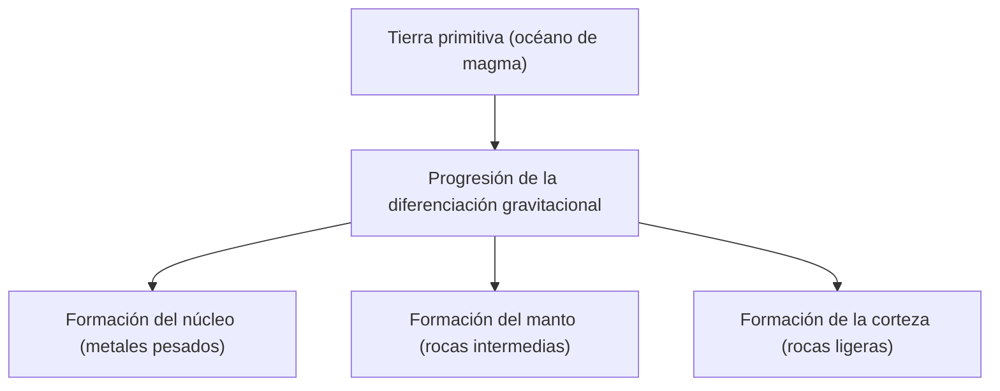

## Introducción: La Tierra como una fábrica química gigante

La Tierra que se extiende bajo nuestros pies. A primera vista, puede parecer una masa de roca estática, pero su interior es una fábrica química dinámica que se mantiene en constante actividad. Han pasado unos 4.600 millones de años desde la formación de la Tierra, un tiempo inmenso durante el cual ha evolucionado hasta alcanzar su forma actual.

En este artículo, ofreceremos una visión general de la composición elemental de toda la Tierra y profundizaremos en cómo se formó su estructura de tres capas (corteza, manto y núcleo, tanto externo como interno) y de qué componentes está formada cada una. Desde el nacimiento de las estrellas hasta la diferenciación de la materia, y llegando hasta la formación de la rica superficie terrestre donde habitamos, desentrañaremos el origen de nuestro planeta desde la perspectiva de la química.

## Composición elemental global de la Tierra: Los cuatro grandes (Big Four)

Si pudiéramos poner la Tierra en una batidora gigante, triturarla y analizar sus componentes, ¿qué resultados obtendríamos? En realidad, la variedad de elementos que componen la Tierra no es tan grande. La mayor parte de su masa está compuesta por solo cuatro elementos.

1. **Hierro (Fe)**: Aprox. 32.1%
2. **Oxígeno (O)**: Aprox. 30.1%
3. **Silicio (Si)**: Aprox. 15.1%
4. **Magnesio (Mg)**: Aprox. 13.9%

Solo estos cuatro elementos representan **más del 90%** de la masa total de la Tierra. El aproximadamente 10% restante está compuesto por elementos traza como el azufre (2.9%), níquel (1.8%), calcio (1.5%) y aluminio (1.4%).

### ¿Por qué hay tanto hierro y oxígeno?

La razón por la cual el hierro es el elemento más abundante en toda la Tierra se remonta al proceso de formación del sistema solar. En las reacciones de fusión nuclear que ocurren en el interior de las estrellas, el hierro posee el núcleo atómico más estable. Por lo tanto, el material esparcido en el espacio por eventos como explosiones de supernovas era rico en hierro. Al formarse la Tierra, se acumularon estos planetesimales que contenían hierro, razón por la cual existe una gran cantidad de hierro en nuestro planeta.

Por otro lado, el oxígeno es el tercer elemento más abundante en el universo y tiende a unirse fácilmente con los elementos que forman las rocas, como el silicio, el magnesio y el hierro, por lo que fue incorporado en grandes cantidades en forma de óxidos (rocas).

## Estructura de la Tierra: Historia de la diferenciación

La Tierra primitiva se encontraba en un estado de "océano de magma", completamente fundida por el calor generado por los impactos de planetesimales y el calor de desintegración de isótopos radiactivos. En este estado líquido de alta temperatura se produjo un fenómeno llamado "**diferenciación gravitacional**".

Los materiales pesados (principalmente hierro y níquel) se hundieron para formar el centro de la Tierra (el núcleo), mientras que los materiales ligeros (como los silicatos) ascendieron para formar el manto y la corteza. A través de esta diferenciación, se creó la actual estructura en capas de la Tierra.

Veamos ahora cada capa con más detalle.

## El núcleo: Una esfera gigante de hierro en el centro de la Tierra

Situado en el centro de la Tierra, a una profundidad aproximada de 2.900 km a 6.371 km desde la superficie, se encuentra el núcleo. El núcleo representa alrededor del 32% de la masa total de la Tierra y está compuesto principalmente por una aleación de hierro y níquel.

El núcleo se divide a su vez en dos partes: el **núcleo externo** y el **núcleo interno**.

### Núcleo externo (Outer Core)

El núcleo externo se sitúa a una profundidad de aproximadamente 2.900 km a 5.150 km. La temperatura es extremadamente alta (alrededor de 4.000 a 5.000 °C) y se encuentra en estado **líquido**, compuesto por hierro y níquel fundidos.

Se cree que la convección de este metal líquido en el núcleo externo genera el campo magnético de la Tierra (teoría de la dínamo). Este campo magnético desempeña un papel crucial al proteger la vida en la Tierra de los rayos cósmicos dañinos y del viento solar. Además del hierro y el níquel, se estima que el núcleo externo contiene un 10% de elementos ligeros disueltos, como azufre, oxígeno y silicio.

### Núcleo interno (Inner Core)

El núcleo interno abarca desde unos 5.150 km de profundidad hasta el centro mismo de la Tierra (6.371 km). Aunque la temperatura es aún mayor que en el núcleo externo (alrededor de 5.000 a 6.000 °C, comparable a la temperatura superficial del Sol), se mantiene en estado **sólido**.

Esto se debe a que la presión aumenta drásticamente hacia el centro (aproximadamente de 3,3 a 3,6 millones de atmósferas) y, bajo este entorno de presión extrema, el punto de fusión del hierro se eleva. A medida que la Tierra en su conjunto continúa enfriándose, el hierro líquido del núcleo externo se solidifica gradualmente; se cree que el núcleo interno sigue creciendo a un ritmo de aproximadamente 1 mm por año.

## El manto: La gigantesca capa de roca que ocupa la mayor parte de la Tierra

Debajo de la corteza, extendiéndose desde unas pocas decenas de kilómetros hasta unos 2.900 km de profundidad, se encuentra el manto. El manto es la capa más grande de la Tierra, abarcando alrededor del 84% de su volumen y el 67% de su masa.

A menudo se piensa erróneamente que el manto es un mar de magma fundido, pero en realidad está compuesto de **roca sólida**. Sus componentes principales son "minerales de silicato" formados por silicio, oxígeno, magnesio, hierro, etc. El manto superior, en particular, está formado por una roca llamada peridotita (compuesta por olivino y piroxeno).

### El movimiento masivo de la convección del manto

Aunque el manto es sólido, en escalas de tiempo geológico largas, de decenas a cientos de millones de años, fluye lentamente como si fuera sirope (deformación plástica). Para liberar el calor interno de la Tierra (el calor proveniente del núcleo y el calor de desintegración de los elementos radiactivos) hacia la superficie, el manto experimenta un movimiento masivo de convección.

Esta convección del manto es la fuerza motriz que mueve las placas (bloques rocosos) de la superficie terrestre, y es la causa fundamental de los movimientos tectónicos como los terremotos, la actividad volcánica y la orogenia (formación de montañas).

## La corteza: La delgada capa donde vivimos

La capa más externa y delgada que recubre la superficie terrestre es la "corteza". En comparación con el radio de la Tierra (unos 6.371 km), el grosor de la corteza es de apenas unos 5 a 70 km. Para usar una analogía con una manzana, es una capa incluso más fina que su piel.

La corteza se formó por la concentración de elementos aún más ligeros del manto (silicio, aluminio, calcio, sodio, potasio, etc.). Aunque representa menos del 1% de la masa total de la Tierra, es un lugar fundamental donde existen diversos elementos indispensables para la vida.

En términos de composición de la corteza (número de Clarke), el oxígeno (aprox. 46.6%) y el silicio (aprox. 27.7%) son abrumadoramente abundantes, conformando entre ambos cerca de tres cuartas partes de la masa de la corteza. Les siguen el aluminio (aprox. 8.1%) y el hierro (aprox. 5.0%).

Existen dos tipos principales de corteza.

### Corteza continental

Es la base de las tierras firmes en las que habitamos. Su grosor promedio es de unos 30 a 40 km (llegando a 70 km en lugares gruesos como la meseta del Tíbet). Su componente principal son rocas silicatadas como el granito, y al ser rica en silicio (Si) y aluminio (Al), también se la conoce como "**Sial (SiAl)**". Su densidad es relativamente baja, alrededor de 2,7 g/cm³.

### Corteza oceánica

Es la corteza que forma el fondo del océano. Es delgada, con un grosor de unos 5 a 10 km, y su componente principal es el basalto. Al ser rica en silicio (Si) y magnesio (Mg), también se la conoce como "**Sima (SiMa)**". Como contiene más hierro y magnesio que la corteza continental, es más pesada, con una densidad de aproximadamente 3,0 g/cm³.

## Conclusión: El milagroso equilibrio que sustenta la vida

La Tierra se sostiene sobre un delicado equilibrio que incluye el potente campo magnético generado por el núcleo de hierro, la activa actividad tectónica impulsada por el manto fluido y una corteza donde se concentran diversos elementos.

Si hubiera menos hierro y no existiera el campo magnético, la vida habría sido calcinada por los rayos cósmicos. Si no hubiera convección del manto ni actividad tectónica, los nutrientes no habrían circulado y la evolución de la vida podría haberse estancado.

Debajo de la tierra que pisamos a diario con naturalidad, se oculta una inmensa historia de 4.600 millones de años y un drama cósmico. Conocer la estructura interna de la Tierra es una clave fundamental para comprender por qué somos capaces de vivir en este planeta.
